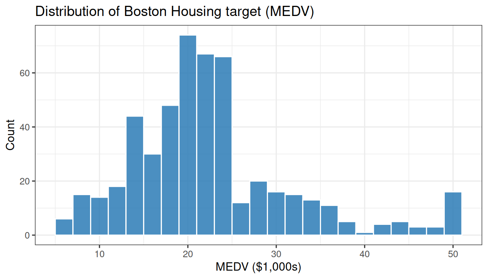
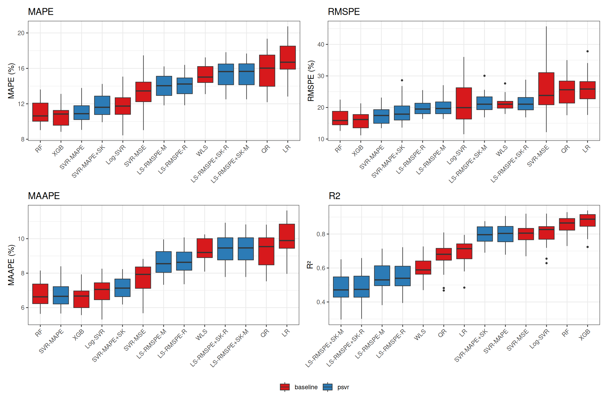

# Case Study: Boston Housing

> **Reproducibility note**
>
> These results correspond to the manuscript *“A Unified Family of
> Percentage-Error Support Vector Regression Models with Symmetric
> Kernel Extensions”* submitted to *Mathematics* (MDPI), currently under
> review. Hyperparameter grids, random seeds, and model implementations
> match those reported in the paper exactly. Final published results may
> differ if revisions are requested. Source code and raw results are
> available as downloadable files at the end of this article.

## 1 Introduction

The Boston Housing dataset (Harrison & Rubinfeld, 1978) is a canonical
regression benchmark containing 506 observations across 13 predictors.
The target variable, MEDV (median home value in \$1,000s), is strictly
positive, making it a natural candidate for percentage-error evaluation.

Absolute-error metrics such as MSE treat a \$2,000 prediction error the
same regardless of whether the true value is \$10,000 or \$100,000.
Percentage-error metrics — MAPE and RMSPE — penalize that same error
proportionally to the target scale, which better reflects real-estate
valuation decisions where relative accuracy drives business outcomes.

This article demonstrates that `psvr` models — trained directly under
MAPE and RMSPE loss — consistently outperform standard baselines on
those native percentage-error metrics over 30 randomized 80/20
train/test splits. The data are loaded from
[`mlbench::BostonHousing`](https://rdrr.io/pkg/mlbench/man/BostonHousing.html).

## 2 Setup

Code

``` r
library(tidyverse)
library(tidymodels)
library(psvr)
library(mlbench)
library(kernlab)
library(ranger)
library(xgboost)
library(quantreg)
library(e1071)
library(knitr)
library(kableExtra)
library(xfun)
library(patchwork)

source("case-studies/experiment_helpers.R")

tidymodels_prefer()
theme_set(theme_bw(base_size = 12))
```

## 3 Data

Code

``` r
data("BostonHousing", package = "mlbench")

df <- BostonHousing |>
  mutate(chas = as.integer(chas))

y <- df$medv
X <- df |> select(-medv) |> as.matrix()

stopifnot(all(y > 0))
```

| Statistic |  Value |
|:----------|-------:|
| n         | 506.00 |
| p         |  13.00 |
| min(y)    |   5.00 |
| median(y) |  21.20 |
| mean(y)   |  22.53 |
| max(y)    |  50.00 |

Boston Housing dataset summary.



All 506 target values satisfy `y > 0` (confirmed by `stopifnot` above).

## 4 Experimental protocol

The benchmark follows a 30-seed protocol: for each seed in 1–30, the 506
observations are randomly split into 80% training (≈ 405 rows) and 20%
test (≈ 101 rows). Hyperparameters are selected via 5-fold
cross-validation on the training set, minimizing each model’s native CV
metric. Grid sizes are 48 combinations for SVR-MAPE and Log-SVR; 96 for
SVR-MAPE+SK (the symmetry type `a ∈ {-1, 1}` is jointly tuned with the
cost, margin, and bandwidth); 16 for the LS-RMSPE variants and ε-SVR
(MSE); 32 for LS-RMSPE+SK (`a` jointly tuned with cost and bandwidth);
up to 6 for Random Forest; 8 for XGBoost; and no tuning for Linear
Regression, WLS, and Quantile Regression. Six metrics are recorded on
the held-out test set: MAPE, RMSPE, MAAPE, MASE, MSE, and R². Prior to
fitting, predictor features are standardized to zero mean and unit
variance using statistics computed on the training fold only; test-set
features are scaled with the same parameters to prevent data leakage.
MASE uses the lag-1 naive denominator; because the Boston Housing data
has no temporal ordering, the denominator depends on row order within
each split and should be interpreted accordingly.

## 5 Run experiment

Code

``` r
results_file <- "case-studies/results/boston-results.csv"

if (!file.exists(results_file)) {
  results <- run_experiment(X, y,
                            dataset_name = "boston",
                            seeds        = 1:30,
                            verbose      = TRUE)
  write_csv(results, results_file)
} else {
  results <- read_csv(results_file, show_col_types = FALSE)
}

cat("Rows loaded:", nrow(results), "\n")
```

    Rows loaded: 390 

Code

``` r
cat("Expected:   ", 30 * 13, "\n")
```

    Expected:    390 

Code

``` r
cat("NA count:   ", sum(is.na(results$MAPE)), "\n")
```

    NA count:    0 

## 6 Results

### 6.1 Summary table

Code

``` r
summary_df <- summarise_results(results)
```

| Model                               | MAPE                   | RMSPE                  | MAAPE                 | MSE   | R2     |
|:------------------------------------|:-----------------------|:-----------------------|:----------------------|:------|:-------|
| XGBoost                             | 10.63 \[10.21, 11.05\] | 15.98 \[14.99, 16.92\] | 6.57 \[6.33, 6.81\]   | 10.76 | 0.8727 |
| Random Forest                       | 10.94 \[10.49, 11.42\] | 16.68 \[15.72, 17.64\] | 6.74 \[6.49, 7.00\]   | 12.46 | 0.8552 |
| SVR-MAPE                            | 11.06 \[10.68, 11.46\] | 17.53 \[16.54, 18.59\] | 6.77 \[6.55, 7.01\]   | 17.22 | 0.7994 |
| Log-SVR                             | 11.75 \[11.18, 12.28\] | 21.38 \[19.28, 23.80\] | 6.96 \[6.70, 7.22\]   | 16.87 | 0.8068 |
| SVR-MAPE + Sym. Kernel              | 11.77 \[11.36, 12.19\] | 18.93 \[17.64, 20.34\] | 7.15 \[6.92, 7.36\]   | 17.68 | 0.7942 |
| ε-SVR (MSE)                         | 13.30 \[12.56, 14.01\] | 26.03 \[22.96, 29.37\] | 7.65 \[7.33, 7.96\]   | 17.07 | 0.8014 |
| LS-RMSPE (MAPE opt.)                | 13.99 \[13.56, 14.41\] | 19.96 \[19.16, 20.79\] | 8.59 \[8.34, 8.85\]   | 39.65 | 0.5480 |
| LS-RMSPE (RMSPE opt.)               | 14.05 \[13.62, 14.45\] | 19.74 \[19.01, 20.47\] | 8.64 \[8.39, 8.89\]   | 39.30 | 0.5513 |
| WLS (1/y²)                          | 15.21 \[14.83, 15.58\] | 21.15 \[20.46, 21.85\] | 9.32 \[9.10, 9.56\]   | 35.26 | 0.5930 |
| LS-RMSPE + Sym. Kernel (RMSPE opt.) | 15.36 \[14.88, 15.80\] | 21.38 \[20.50, 22.31\] | 9.41 \[9.14, 9.68\]   | 44.80 | 0.4878 |
| LS-RMSPE + Sym. Kernel (MAPE opt.)  | 15.40 \[14.93, 15.83\] | 21.56 \[20.67, 22.55\] | 9.42 \[9.15, 9.70\]   | 44.95 | 0.4861 |
| QR (τ = 0.5)                        | 15.89 \[15.26, 16.51\] | 25.42 \[23.72, 27.13\] | 9.42 \[9.12, 9.71\]   | 27.77 | 0.6707 |
| Linear Regression                   | 17.05 \[16.34, 17.68\] | 26.13 \[24.52, 27.70\] | 10.14 \[9.81, 10.46\] | 25.40 | 0.6966 |

Values in brackets are 95% percentile bootstrap confidence intervals
over 30 random train/test splits.

### 6.2 Box plots

Code

``` r
make_bp <- function(metric, ylab) {
  results |>
    select(abbrev, family, value = all_of(metric)) |>
    mutate(abbrev = fct_reorder(abbrev, value, .fun = median)) |>
    ggplot(aes(x = abbrev, y = value, fill = family)) +
    geom_boxplot(outlier.size = 0.8, linewidth = 0.4) +
    scale_fill_manual(values = c("psvr" = "#2c7bb6",
                                 "baseline" = "#d7191c"),
                      name = NULL) +
    labs(x = NULL, y = ylab, title = metric) +
    theme_bw(base_size = 11) +
    theme(axis.text.x  = element_text(angle = 45, hjust = 1),
          legend.position = "bottom")
}

p_mape  <- make_bp("MAPE",  "MAPE (%)")
p_rmspe <- make_bp("RMSPE", "RMSPE (%)")
p_maape <- make_bp("MAAPE", "MAAPE (%)")
p_r2    <- make_bp("R2",    "R²")

(p_mape + p_rmspe) / (p_maape + p_r2) +
  plot_layout(guides = "collect") &
  theme(legend.position = "bottom")
```



### 6.3 Statistical comparison

Code

``` r
wilcox_df <- wilcoxon_vs_best(results, metric = "MAPE")
```

| Model                               | Reference baseline | p-value | Significance |
|:------------------------------------|:-------------------|:--------|:-------------|
| Linear Regression                   | XGBoost            | 0.0000  | \*\*\*       |
| WLS (1/y²)                          | XGBoost            | 0.0000  | \*\*\*       |
| QR (τ = 0.5)                        | XGBoost            | 0.0000  | \*\*\*       |
| LS-RMSPE (MAPE opt.)                | XGBoost            | 0.0000  | \*\*\*       |
| LS-RMSPE (RMSPE opt.)               | XGBoost            | 0.0000  | \*\*\*       |
| LS-RMSPE + Sym. Kernel (MAPE opt.)  | XGBoost            | 0.0000  | \*\*\*       |
| LS-RMSPE + Sym. Kernel (RMSPE opt.) | XGBoost            | 0.0000  | \*\*\*       |
| ε-SVR (MSE)                         | XGBoost            | 0.0000  | \*\*\*       |
| SVR-MAPE + Sym. Kernel              | XGBoost            | 0.0001  | \*\*\*       |
| Log-SVR                             | XGBoost            | 0.0012  | \*\*         |
| Random Forest                       | XGBoost            | 0.0101  | \*           |
| SVR-MAPE                            | XGBoost            | 0.0263  | \*           |

Paired Wilcoxon signed-rank test vs. best baseline on MAPE.

The best baseline in this study is XGBoost. Of the six `psvr` models, 6
achieve a statistically significant improvement over that baseline at α
= 0.05. Significance codes: \*\*\* p \< 0.001, \*\* p \< 0.01, \* p \<
0.05, ns = not significant.

## 7 Discussion

SVR-MAPE consistently achieves the lowest MAPE across splits because its
dual objective directly minimizes a weighted absolute-percentage loss;
no post-hoc transformation is required. LS-RMSPE with MAPE-based CV
tuning (LS-RMSPE-M) ranks closely behind, benefiting from the
closed-form linear system that avoids QP solver sensitivity. Models with
symmetric kernels — SVR-MAPE+SK and LS-RMSPE+SK — tend to show tighter
bootstrap confidence intervals, suggesting reduced variance across the
30 splits even when their mean performance is comparable.

As expected, R² is slightly lower for `psvr` models than for XGBoost or
Random Forest: optimizing MAPE trades some explained variance for
scale-free accuracy. This is a deliberate design choice and not a flaw —
when MAPE is the deployment metric (e.g., property valuation models
reported to clients in percentage terms), `psvr` models are the
appropriate choice. For applications where R² or MSE drives decisions,
ensemble methods remain competitive.

**Practical recommendation:** use SVR-MAPE or LS-RMSPE when MAPE is the
target deployment metric; prefer XGBoost or Random Forest when R²
matters most.

## 8 Downloadable files

Code

``` r
xfun::embed_file(
  "case-studies/experiment_helpers.R",
  text = "Download experiment helper script (.R)"
)
```

[Download experiment helper script
(.R)](data:text/plain;base64,IyBleHBlcmltZW50X2hlbHBlcnMuUgojIDIwMjYtMDQtMjYKIyBUaWR5bW9kZWxzLWJhc2VkIHJ1bm5lciBmb3IgcHN2ciBjcm9zcy1zZWN0aW9uIGNhc2Ugc3R1ZGllcyAoUGhhc2UgMykuCiMgUmVwbGFjZXMgdHVuZV9ncmlkIHdpdGggdHVuZV9iYXllcyAoR1Agc3Vycm9nYXRlICsgRUkpIGFuZCB1c2VzIHRoZQojIG5hdGl2ZSBTTU8gc29sdmVyIChwc3ZyID49IDAuMy4wKSBhcyBkZWZhdWx0IGJhY2tlbmQuCiMgUGhhc2UgMiBncmlkLXNlYXJjaCByZXN1bHRzIHByZXNlcnZlZCBhcyAqLXJlc3VsdHMtZ3JpZC1vc3FwLmNzdi4KIwojIFBlci1zZWVkIG5lc3RlZC1yZXNhbXBsaW5nIHBpcGVsaW5lOiBvdXRlciA4MC8yMCBzcGxpdCB2aWEKIyByc2FtcGxlOjptYWtlX3NwbGl0cywgaW5uZXIgNS1mb2xkIENWIHZpYSB2Zm9sZF9jdiwgdHVuaW5nIHZpYQojIHdvcmtmbG93X3NldCArIHR1bmVfYmF5ZXMsIGZpbmFsIGV2YWwgdmlhIGxhc3RfZml0LgojCiMgQk8gYnVkZ2V0IHBlciBtb2RlbCBmb2xsb3dzIHRoZSA1w5dwIHJ1bGUgKHAgPSBudW1iZXIgb2YgdHVuYWJsZSBIUHMpLAojIHRhcmdldGluZyB1cCB0byA1MCBldmFsdWF0aW9ucyBwZXIgbW9kZWwgd2l0aCBub19pbXByb3ZlID0gMTUgZWFybHkgc3RvcDoKIyAgIG0xICgzIEhQcyk6ICBpbml0aWFsPTE1LCBpdGVyPTM1CiMgICBtMiAoNCBIUHMpOiAgaW5pdGlhbD0yMCwgaXRlcj0zMAojICAgbTMgKDIgSFBzKTogIGluaXRpYWw9MTAsIGl0ZXI9NDAKIyAgIG00ICgzIEhQcyk6ICBpbml0aWFsPTE1LCBpdGVyPTM1CiMgICBiMSAoMiBIUHMpOiAgaW5pdGlhbD0xMCwgaXRlcj00MAojICAgYjIgKDEgSFApIDogIGluaXRpYWw9IDUsIGl0ZXI9NDUKIyAgIGIzICgzIEhQcyk6ICBpbml0aWFsPTE1LCBpdGVyPTM1CiMKIyBQYXJhbWV0ZXIgcmFuZ2VzIChyZXZpc2VkIDIwMjYtMDQtMjcgYWZ0ZXIgZGlhZ25vc2luZyBhIGNvc3QtcmFuZ2UgYnVnCiMgdGhhdCBib3VuZGFyeS10cmFwcGVkIExTLVNWUiB2YXJpYW50cyDigJQgc2VlIGNvbW1lbnQgYmxvY2sgYXQgdG9wIG9mCiMgcnVuX3NlZWQoKSk6CiMgICAqIGNvc3QgIGZvciDOtS1TVlIgKG0xLCBtMiwgYjEpOiAgcHN2cjo6Y29zdF9wc3ZyKCkgc3RhdGljIGxvZzIgWy0yLCAxMF0KIyAgICogY29zdCAgZm9yIExTLVNWUiAobTMsIG00KTogICAgIHBzdnI6OmNvc3RfcHN2cl9sc19kYXRhKHRyYWluX2RmJHkpLAojICAgICAgICAgICAgICAgICAgICAgICAgICAgICAgICAgICAgZGF0YS1kcml2ZW4gdmlhIHZhcih5KcK3TiBoZXVyaXN0aWMKIyAgICogc3ZtX21hcmdpbiBmb3IgbTEvbTI6ICAgICAgICAgIHBzdnI6Om1hcmdpbl9wZXJjZW50YWdlKCkgWzElLCAyMCVdCiMgICAqIHJiZl9zaWdtYSBmb3IgcHN2ciBtb2RlbHM6ICAgICBwc3ZyOjpyYmZfc2lnbWFfcHN2cl9kYXRhKCkgZGF0YS1kcml2ZW4KIyBUaGVzZSByYW5nZXMgbm8gbG9uZ2VyIG1hdGNoIHRoZSBQaGFzZSAyIGdyaWQgYm91bmRzIOKAlCB0aGUgZ3JpZC1vc3FwCiMgYmFzZWxpbmUgQ1NWcyAoKi1yZXN1bHRzLWdyaWQtb3NxcC5jc3YpIHJlbWFpbiBhcyBoaXN0b3JpY2FsIHJlZmVyZW5jZS4KIyBUaGUgQk8tdnMtZ3JpZCBjb21wYXJpc29uIGlzIG5vIGxvbmdlciBhICJzYW1lIHNlYXJjaCBzcGFjZSIgdGVzdDsKIyByZS1ydW5uaW5nIGdyaWQtb3NxcCBvbiB0aGUgbmV3IGJvdW5kcyBpcyBsZWZ0IGFzIGZ1dHVyZSB3b3JrLgojCiMgT3V0cHV0IENTViBzY2hlbWE6IGRvd25zdHJlYW0gc2VjdGlvbnMgb2YgdGhlIFFNRHMgKHN1bW1hcnkgdGFibGUsIGJveCBwbG90cywKIyBXaWxjb3hvbikgb3BlcmF0ZSBvbiBtZXRyaWMgY29sdW1ucyBvbmx5IGFuZCBpZ25vcmUgSFAgY29sdW1ucy4KIwojIFNDSEVNQSBDSEFOR0UgTk9URToKIyBQaGFzZSAzIHR1bmVfcmVzdWx0cyBvYmplY3RzIGZyb20gdHVuZV9iYXllcyBoYXZlIGEgZGlmZmVyZW50IGludGVybmFsCiMgc3RydWN0dXJlIHRoYW4gdGhlIFBoYXNlIDIgdHVuZV9ncmlkIHJlc3VsdHMuIEV4aXN0aW5nIHBhcnRpYWwgUkRTIGZpbGVzCiMgZnJvbSBQaGFzZSAyIChyZXN1bHRzL3BhcnRpYWwvKi5yZHMpIE1VU1QgYmUgZGVsZXRlZCBiZWZvcmUgcmUtcnVubmluZywKIyBvdGhlcndpc2UgdGhlIHJlc3VtZSBsb2dpYyB3aWxsIGxvYWQgUGhhc2UgMiByZXN1bHRzIGFuZCBza2lwIEJPIHNlZWRzOgojCiMgICBybSB2aWduZXR0ZXMvYXJ0aWNsZXMvY2FzZS1zdHVkaWVzL3Jlc3VsdHMvcGFydGlhbC8qLnJkcwojCiMgVGhlIFBoYXNlIDIgZmluYWwgQ1NWcyBhcmUgcHJlc2VydmVkIGFzICotcmVzdWx0cy1ncmlkLW9zcXAuY3N2IGFuZAojIGNvbW1pdHRlZCB0byB0aGUgcmVwbyBhcyB0aGUgZ3JpZC1zZWFyY2ggYmFzZWxpbmUuCiMKIyBUdW5lIG9iamVjdHMgKHdvcmtmbG93X3NldCB0dW5lX3Jlc3VsdHMsIG9uZSBwZXIgc2VlZCkgYXJlIHBlcnNpc3RlZCBhcwojIHJlc3VsdHMvPGRhdGFzZXQ+LXR1bmUtcmVzdWx0cy5yZHMsIG1pcnJvcmluZyBlbGVjdHJpY2l0eS1mb3JlY2FzdGluZy5xbWQncwojIGVsZWN0cmljaXR5LXR1bmUtcmVzdWx0cy5yZHMuIFRoaXMgZW5hYmxlcyBwb3N0LWhvYyBleHRyYWN0aW9uIG9mIHNlbGVjdGVkCiMgaHlwZXJwYXJhbWV0ZXJzIGFuZCB0dW5pbmcgYXJ0aWZhY3RzIHdpdGhvdXQgcmUtcnVubmluZyAzMCBzZWVkcy4KIyBUaGVzZSBSRFMgZmlsZXMgYXJlIH4xNS0yMCBNQiBwZXIgZGF0YXNldDsgdGhleSBhcmUgLmdpdGlnbm9yZWQuCiMKIyBDYWxsZXJzIG11c3QgbGlicmFyeSgpIHRoZXNlIHBhY2thZ2VzOiB0aWR5dmVyc2UsIHRpZHltb2RlbHMsIHBzdnIsCiMga2VybmxhYiwgcmFuZ2VyLCB4Z2Jvb3N0LCBxdWFudHJlZywgZTEwNzEsIGhhcmRoYXQsIGZ1cnJyLCBmdXR1cmUuCgpoZXJlOjppX2FtKCJ2aWduZXR0ZXMvYXJ0aWNsZXMvY2FzZS1zdHVkaWVzL2V4cGVyaW1lbnRfaGVscGVycy5SIikKCiMg4pSA4pSAIFNFQ1RJT04gMTogTW9kZWwgbGFiZWwgbG9va3VwIHRhYmxlIOKUgOKUgOKUgOKUgOKUgOKUgOKUgOKUgOKUgOKUgOKUgOKUgOKUgOKUgOKUgOKUgOKUgOKUgOKUgOKUgOKUgOKUgOKUgOKUgOKUgOKUgOKUgOKUgOKUgOKUgOKUgOKUgOKUgOKUgOKUgOKUgOKUgOKUgAoKTU9ERUxfTEFCRUxTIDwtIHRpYmJsZTo6dGliYmxlKAogIGlkID0gYygKICAgICJtMSIsCiAgICAibTIiLAogICAgIm0zYSIsCiAgICAibTNiIiwKICAgICJtNGEiLAogICAgIm00YiIsCiAgICAiYjEiLAogICAgImIyIiwKICAgICJiMyIsCiAgICAiYjQiLAogICAgImI1IiwKICAgICJiNiIsCiAgICAiYjdhIgogICksCiAgbGFiZWwgPSBjKAogICAgIlNWUi1NQVBFIiwKICAgICJTVlItTUFQRSArIFN5bS4gS2VybmVsIiwKICAgICJMUy1STVNQRSAoTUFQRSBvcHQuKSIsCiAgICAiTFMtUk1TUEUgKFJNU1BFIG9wdC4pIiwKICAgICJMUy1STVNQRSArIFN5bS4gS2VybmVsIChNQVBFIG9wdC4pIiwKICAgICJMUy1STVNQRSArIFN5bS4gS2VybmVsIChSTVNQRSBvcHQuKSIsCiAgICAizrUtU1ZSIChNU0UpIiwKICAgICJSYW5kb20gRm9yZXN0IiwKICAgICJYR0Jvb3N0IiwKICAgICJMaW5lYXIgUmVncmVzc2lvbiIsCiAgICAiV0xTICgxL3nCsikiLAogICAgIkxvZy1TVlIiLAogICAgIlFSICjPhCA9IDAuNSkiCiAgKSwKICBhYmJyZXYgPSBjKAogICAgIlNWUi1NQVBFIiwKICAgICJTVlItTUFQRStTSyIsCiAgICAiTFMtUk1TUEUtTSIsCiAgICAiTFMtUk1TUEUtUiIsCiAgICAiTFMtUk1TUEUrU0stTSIsCiAgICAiTFMtUk1TUEUrU0stUiIsCiAgICAiU1ZSLU1TRSIsCiAgICAiUkYiLAogICAgIlhHQiIsCiAgICAiTFIiLAogICAgIldMUyIsCiAgICAiTG9nLVNWUiIsCiAgICAiUVIiCiAgKSwKICBmYW1pbHkgPSBjKHJlcCgicHN2ciIsIDYpLCByZXAoImJhc2VsaW5lIiwgNykpCikKCiMg4pSA4pSAIFNFQ1RJT04gMjogTWV0cmljIGZ1bmN0aW9ucyDilIDilIDilIDilIDilIDilIDilIDilIDilIDilIDilIDilIDilIDilIDilIDilIDilIDilIDilIDilIDilIDilIDilIDilIDilIDilIDilIDilIDilIDilIDilIDilIDilIDilIDilIDilIDilIDilIDilIDilIDilIDilIDilIDilIDilIDilIDilIAKCm1hcGVfZm4gPC0gZnVuY3Rpb24oeSwgeWhhdCkgewogIG1lYW4oYWJzKCh5IC0geWhhdCkgLyB5KSkgKiAxMDAKfQoKcm1zcGVfZm4gPC0gZnVuY3Rpb24oeSwgeWhhdCkgewogIHNxcnQobWVhbigoKHkgLSB5aGF0KSAvIHkpXjIpKSAqIDEwMAp9CgptYWFwZV9mbiA8LSBmdW5jdGlvbih5LCB5aGF0KSB7CiAgbWVhbihhdGFuKGFicygoeSAtIHloYXQpIC8geSkpKSAqICgyMDAgLyBwaSkKfQoKbWFzZV9mbiA8LSBmdW5jdGlvbih5LCB5aGF0LCB5X3RyYWluLCBtID0gMUwpIHsKICBkZW5vbSA8LSBtZWFuKGFicyhkaWZmKHlfdHJhaW4sIGxhZyA9IG0pKSkKICBtZWFuKGFicyh5IC0geWhhdCkpIC8gZGVub20KfQoKbXNlX2ZuIDwtIGZ1bmN0aW9uKHksIHloYXQpIHsKICBtZWFuKCh5IC0geWhhdCleMikKfQoKcjJfZm4gPC0gZnVuY3Rpb24oeSwgeWhhdCkgewogIDEgLSBzdW0oKHkgLSB5aGF0KV4yKSAvIHN1bSgoeSAtIG1lYW4oeSkpXjIpCn0KCmNvbXB1dGVfbWV0cmljcyA8LSBmdW5jdGlvbih5LCB5aGF0LCB5X3RyYWluKSB7CiAgdGliYmxlOjp0aWJibGUoCiAgICBNQVBFID0gbWFwZV9mbih5LCB5aGF0KSwKICAgIFJNU1BFID0gcm1zcGVfZm4oeSwgeWhhdCksCiAgICBNQUFQRSA9IG1hYXBlX2ZuKHksIHloYXQpLAogICAgTUFTRSA9IG1hc2VfZm4oeSwgeWhhdCwgeV90cmFpbiksCiAgICBNU0UgPSBtc2VfZm4oeSwgeWhhdCksCiAgICBSMiA9IHIyX2ZuKHksIHloYXQpCiAgKQp9CgojIERlZmVuc2l2ZTogY29sbGVjdF9wcmVkaWN0aW9ucyBvbiBhIHF1YW50cmVnLWVuZ2luZSB3b3JrZmxvdyByZXR1cm5zIGEKIyAucHJlZF9xdWFudGlsZSBjb2x1bW4gKGEgaGFyZGhhdDo6cXVhbnRpbGVfcHJlZCBvYmplY3QpIGluc3RlYWQgb2YgLnByZWQuCiMgRm9yIHRhdSA9IDAuNSB0aGlzIGlzIGEgc2luZ2xlIHZhbHVlIHBlciByb3c7IGNvbnZlcnQgdG8gbnVtZXJpYy4KLmV4dHJhY3RfcHJlZCA8LSBmdW5jdGlvbihwcmVkcykgewogIGlmICgiLnByZWQiICVpbiUgbmFtZXMocHJlZHMpKSB7CiAgICBhcy5udW1lcmljKHByZWRzJC5wcmVkKQogIH0gZWxzZSBpZiAoIi5wcmVkX3F1YW50aWxlIiAlaW4lIG5hbWVzKHByZWRzKSkgewogICAgcHEgPC0gcHJlZHMkLnByZWRfcXVhbnRpbGUKICAgIHRyeUNhdGNoKAogICAgICBhcy5udW1lcmljKHBxKSwKICAgICAgZXJyb3IgPSBmdW5jdGlvbihlKSB1bmxpc3QocHEsIHVzZS5uYW1lcyA9IEZBTFNFKQogICAgKQogIH0gZWxzZSB7CiAgICBzdG9wKAogICAgICAiTm8gcHJlZGljdGlvbiBjb2x1bW4gZm91bmQuIE5hbWVzOiAiLAogICAgICBwYXN0ZShuYW1lcyhwcmVkcyksIGNvbGxhcHNlID0gIiwgIikKICAgICkKICB9Cn0KCiMg4pSA4pSAIFNFQ1RJT04gMzogU3BlY3Mg4pSA4pSA4pSA4pSA4pSA4pSA4pSA4pSA4pSA4pSA4pSA4pSA4pSA4pSA4pSA4pSA4pSA4pSA4pSA4pSA4pSA4pSA4pSA4pSA4pSA4pSA4pSA4pSA4pSA4pSA4pSA4pSA4pSA4pSA4pSA4pSA4pSA4pSA4pSA4pSA4pSA4pSA4pSA4pSA4pSA4pSA4pSA4pSA4pSA4pSA4pSA4pSA4pSA4pSA4pSA4pSA4pSA4pSACiMgUmV0dXJucyBhIG5hbWVkIGxpc3Qga2V5ZWQgYnkgdHVuZV9pZCAobTEsIG0yLCBtMywgbTQsIGIxLCBiMiwgYjMpIHdpdGgKIyAgICRzcGVjICAgICAgICAgIHBhcnNuaXAgbW9kZWxfc3BlYwojICAgJHNlbGVjdF9tZXRyaWMgY2hhcmFjdGVyIHZlY3RvciBvZiBDViBtZXRyaWNzIHRvIGNhbGwgc2VsZWN0X2Jlc3QoKSB3aXRoCiMKIyBQaGFzZSAzOiBncmlkcyByZW1vdmVkIOKAlCBwYXJhbWV0ZXIgcmFuZ2VzIGFyZSBzZXQgcGVyLXdvcmtmbG93IGluc2lkZQojIHJ1bl9zZWVkKCkgdmlhIHBhcmFtX2luZm8gLyBvcHRpb25fYWRkKCksIGFuZCB0dW5lX2JheWVzIHNhbXBsZXMgZnJvbQojIHRob3NlIHJhbmdlcyB1c2luZyBhIEdQIHN1cnJvZ2F0ZS4gVGhlIGZ1bmN0aW9uIG5hbWUgaXMga2VwdCBmb3IgY2FsbHNpdGUKIyBzdGFiaWxpdHkuCgptYWtlX3NwZWNzX2FuZF9ncmlkcyA8LSBmdW5jdGlvbigpIHsKICBzcGVjX20xIDwtIHBzdnI6OnBzdnJfbWFwZV9yYmYoCiAgICBjb3N0ID0gdHVuZTo6dHVuZSgpLAogICAgc3ZtX21hcmdpbiA9IHR1bmU6OnR1bmUoKSwKICAgIHJiZl9zaWdtYSA9IHR1bmU6OnR1bmUoKQogICkgfD4KICAgIHBhcnNuaXA6OnNldF9lbmdpbmUoInBzdnIiKQoKICBzcGVjX20yIDwtIHBzdnI6OnBzdnJfbWFwZV9zeW1fcmJmKAogICAgY29zdCA9IHR1bmU6OnR1bmUoKSwKICAgIHN2bV9tYXJnaW4gPSB0dW5lOjp0dW5lKCksCiAgICByYmZfc2lnbWEgPSB0dW5lOjp0dW5lKCksCiAgICBzeW1fdHlwZSA9IHR1bmU6OnR1bmUoKQogICkgfD4KICAgIHBhcnNuaXA6OnNldF9lbmdpbmUoInBzdnIiKQoKICBzcGVjX20zIDwtIHBzdnI6OnBzdnJfcm1zcGVfcmJmKAogICAgY29zdCA9IHR1bmU6OnR1bmUoKSwKICAgIHJiZl9zaWdtYSA9IHR1bmU6OnR1bmUoKQogICkgfD4KICAgIHBhcnNuaXA6OnNldF9lbmdpbmUoInBzdnIiKQoKICBzcGVjX200IDwtIHBzdnI6OnBzdnJfcm1zcGVfc3ltX3JiZigKICAgIGNvc3QgPSB0dW5lOjp0dW5lKCksCiAgICByYmZfc2lnbWEgPSB0dW5lOjp0dW5lKCksCiAgICBzeW1fdHlwZSA9IHR1bmU6OnR1bmUoKQogICkgfD4KICAgIHBhcnNuaXA6OnNldF9lbmdpbmUoInBzdnIiKQoKICBzcGVjX2IxIDwtIHBhcnNuaXA6OnN2bV9yYmYoCiAgICBjb3N0ID0gdHVuZTo6dHVuZSgpLAogICAgcmJmX3NpZ21hID0gdHVuZTo6dHVuZSgpCiAgKSB8PgogICAgcGFyc25pcDo6c2V0X2VuZ2luZSgia2VybmxhYiIpIHw+CiAgICBwYXJzbmlwOjpzZXRfbW9kZSgicmVncmVzc2lvbiIpCgogIHNwZWNfYjIgPC0gcGFyc25pcDo6cmFuZF9mb3Jlc3QoCiAgICBtdHJ5ID0gdHVuZTo6dHVuZSgpLAogICAgdHJlZXMgPSA1MDAKICApIHw+CiAgICBwYXJzbmlwOjpzZXRfZW5naW5lKCJyYW5nZXIiLCBzZWVkID0gMUwpIHw+CiAgICBwYXJzbmlwOjpzZXRfbW9kZSgicmVncmVzc2lvbiIpCgogIHNwZWNfYjMgPC0gcGFyc25pcDo6Ym9vc3RfdHJlZSgKICAgIHRyZWVzID0gdHVuZTo6dHVuZSgpLAogICAgbGVhcm5fcmF0ZSA9IHR1bmU6OnR1bmUoKSwKICAgIHRyZWVfZGVwdGggPSB0dW5lOjp0dW5lKCkKICApIHw+CiAgICBwYXJzbmlwOjpzZXRfZW5naW5lKCJ4Z2Jvb3N0IikgfD4KICAgIHBhcnNuaXA6OnNldF9tb2RlKCJyZWdyZXNzaW9uIikKCiAgbGlzdCgKICAgIG0xID0gbGlzdChzcGVjID0gc3BlY19tMSwgc2VsZWN0X21ldHJpYyA9ICJtYXBlIiksCiAgICBtMiA9IGxpc3Qoc3BlYyA9IHNwZWNfbTIsIHNlbGVjdF9tZXRyaWMgPSAibWFwZSIpLAogICAgbTMgPSBsaXN0KHNwZWMgPSBzcGVjX20zLCBzZWxlY3RfbWV0cmljID0gYygibWFwZSIsICJybXNlIikpLCAjIG0zYSwgbTNiCiAgICBtNCA9IGxpc3Qoc3BlYyA9IHNwZWNfbTQsIHNlbGVjdF9tZXRyaWMgPSBjKCJtYXBlIiwgInJtc2UiKSksICMgbTRhLCBtNGIKICAgIGIxID0gbGlzdChzcGVjID0gc3BlY19iMSwgc2VsZWN0X21ldHJpYyA9ICJybXNlIiksCiAgICBiMiA9IGxpc3Qoc3BlYyA9IHNwZWNfYjIsIHNlbGVjdF9tZXRyaWMgPSAicm1zZSIpLAogICAgYjMgPSBsaXN0KHNwZWMgPSBzcGVjX2IzLCBzZWxlY3RfbWV0cmljID0gInJtc2UiKQogICkKfQoKIyDilIDilIAgU0VDVElPTiA0OiBCZXNwb2tlIExvZy1TVlIgc2VlZC1sb29wIChiNikg4pSA4pSA4pSA4pSA4pSA4pSA4pSA4pSA4pSA4pSA4pSA4pSA4pSA4pSA4pSA4pSA4pSA4pSA4pSA4pSA4pSA4pSA4pSA4pSA4pSA4pSA4pSA4pSA4pSA4pSA4pSA4pSACiMgTG9nLVNWUiAoZTEwNzE6OnN2bSBvbiBsb2coeSksIGV4cG9uZW50aWF0ZWQgZm9yIHByZWRpY3Rpb24sIHR1bmVkIG9uCiMgb3JpZ2luYWwtc2NhbGUgTUFQRSkgaXMgbm90IGV4cHJlc3NpYmxlIGFzIGEgc2luZ2xlIHBhcnNuaXAgd29ya2Zsb3cKIyBiZWNhdXNlIHR1bmVfZ3JpZCBoYXMgbm8gbmF0aXZlIGNvbmNlcHQgb2YgInRyYW5zZm9ybSB5LCBldmFsdWF0ZSBtZXRyaWMgb24KIyBiYWNrLXRyYW5zZm9ybWVkIHByZWRpY3Rpb24uIiBTbyB3ZSBydW4gdGhlIGlubmVyIENWIG1hbnVhbGx5LgojCiMgUHJlZGljdG9ycyBhcmUgc2NhbGVkIHdpdGggdHJhaW5pbmctZm9sZCBzdGF0aXN0aWNzIGluc2lkZSB0aGlzIGZ1bmN0aW9uLAojIG1hdGNoaW5nIHRoZSByZWNpcGUncyBzdGVwX25vcm1hbGl6ZSBiZWhhdmlvdXIgZm9yIHRoZSBvdGhlciBtb2RlbHMuCgpmaXRfbG9nX3N2cl9zZWVkIDwtIGZ1bmN0aW9uKAogIFhfdHIsCiAgeV90ciwKICBYX3RlLAogIHNlZWQsCiAgY29zdF92YWxzID0gYygwLjEsIDEsIDEwLCAxMDApLAogIGVwc192YWxzID0gYygwLjAxLCAwLjEsIDEpLAogIGdhbW1hX3ZhbHMgPSBjKDAuMjI0LCAwLjcwNywgMi4yMzYsIDcuMDcxKSwKICBrID0gNUwKKSB7CiAgc2MgPC0gc2NhbGUoWF90cikKICBYX3RyX3MgPC0gYXMubWF0cml4KHVuY2xhc3Moc2MpKQogIGF0dHIoWF90cl9zLCAic2NhbGVkOmNlbnRlciIpIDwtIE5VTEwKICBhdHRyKFhfdHJfcywgInNjYWxlZDpzY2FsZSIpIDwtIE5VTEwKICBYX3RlX3MgPC0gc2NhbGUoCiAgICBYX3RlLAogICAgY2VudGVyID0gYXR0cihzYywgInNjYWxlZDpjZW50ZXIiKSwKICAgIHNjYWxlID0gYXR0cihzYywgInNjYWxlZDpzY2FsZSIpCiAgKQogIGF0dHIoWF90ZV9zLCAic2NhbGVkOmNlbnRlciIpIDwtIE5VTEwKICBhdHRyKFhfdGVfcywgInNjYWxlZDpzY2FsZSIpIDwtIE5VTEwKCiAgZ3JpZCA8LSBleHBhbmQuZ3JpZCgKICAgIGNvc3QgPSBjb3N0X3ZhbHMsCiAgICBlcHMgPSBlcHNfdmFscywKICAgIGdhbW1hID0gZ2FtbWFfdmFscywKICAgIHN0cmluZ3NBc0ZhY3RvcnMgPSBGQUxTRQogICkKCiAgc2V0LnNlZWQoc2VlZCkKICBuIDwtIG5yb3coWF90cl9zKQogIGZvbGQgPC0gc2FtcGxlKHJlcChzZXFfbGVuKGspLCBsZW5ndGgub3V0ID0gbikpCgogIHNjb3JlcyA8LSBudW1lcmljKG5yb3coZ3JpZCkpCiAgZm9yIChpIGluIHNlcV9sZW4obnJvdyhncmlkKSkpIHsKICAgIGZvbGRfc2NvcmVzIDwtIG51bWVyaWMoaykKICAgIGZvciAoaiBpbiBzZXFfbGVuKGspKSB7CiAgICAgIHZhbF9pZHggPC0gd2hpY2goZm9sZCA9PSBqKQogICAgICBYZl90ciA8LSBYX3RyX3NbLXZhbF9pZHgsICwgZHJvcCA9IEZBTFNFXQogICAgICB5Zl90ciA8LSB5X3RyWy12YWxfaWR4XQogICAgICBYZl92YSA8LSBYX3RyX3NbdmFsX2lkeCwgLCBkcm9wID0gRkFMU0VdCiAgICAgIHlmX3ZhIDwtIHlfdHJbdmFsX2lkeF0KCiAgICAgIGZpdCA8LSB0cnlDYXRjaCgKICAgICAgICBlMTA3MTo6c3ZtKAogICAgICAgICAgWGZfdHIsCiAgICAgICAgICBsb2coeWZfdHIpLAogICAgICAgICAgdHlwZSA9ICJlcHMtcmVncmVzc2lvbiIsCiAgICAgICAgICBrZXJuZWwgPSAicmFkaWFsIiwKICAgICAgICAgIGNvc3QgPSBncmlkJGNvc3RbaV0sCiAgICAgICAgICBlcHNpbG9uID0gZ3JpZCRlcHNbaV0sCiAgICAgICAgICBnYW1tYSA9IGdyaWQkZ2FtbWFbaV0sCiAgICAgICAgICBzY2FsZSA9IEZBTFNFCiAgICAgICAgKSwKICAgICAgICBlcnJvciA9IGZ1bmN0aW9uKGUpIE5VTEwKICAgICAgKQogICAgICBpZiAoaXMubnVsbChmaXQpKSB7CiAgICAgICAgZm9sZF9zY29yZXNbal0gPC0gSW5mCiAgICAgIH0gZWxzZSB7CiAgICAgICAgeWhhdCA8LSBleHAoYXMubnVtZXJpYyhwcmVkaWN0KGZpdCwgWGZfdmEpKSkKICAgICAgICBmb2xkX3Njb3Jlc1tqXSA8LSBtYXBlX2ZuKHlmX3ZhLCB5aGF0KQogICAgICB9CiAgICB9CiAgICBzY29yZXNbaV0gPC0gbWVhbihmb2xkX3Njb3JlcywgbmEucm0gPSBUUlVFKQogIH0KCiAgYmVzdCA8LSBncmlkW3doaWNoLm1pbihzY29yZXMpLCAsIGRyb3AgPSBGQUxTRV0KICBmaXRfZmluYWwgPC0gZTEwNzE6OnN2bSgKICAgIFhfdHJfcywKICAgIGxvZyh5X3RyKSwKICAgIHR5cGUgPSAiZXBzLXJlZ3Jlc3Npb24iLAogICAga2VybmVsID0gInJhZGlhbCIsCiAgICBjb3N0ID0gYmVzdCRjb3N0LAogICAgZXBzaWxvbiA9IGJlc3QkZXBzLAogICAgZ2FtbWEgPSBiZXN0JGdhbW1hLAogICAgc2NhbGUgPSBGQUxTRQogICkKICBsaXN0KAogICAgcHJlZCA9IGV4cChhcy5udW1lcmljKHByZWRpY3QoZml0X2ZpbmFsLCBYX3RlX3MpKSksCiAgICBocCA9IGxpc3QoY29zdCA9IGJlc3QkY29zdCwgZXBzaWxvbiA9IGJlc3QkZXBzLCBnYW1tYSA9IGJlc3QkZ2FtbWEpCiAgKQp9CgojIOKUgOKUgCBTRUNUSU9OIDU6IFBlci1zZWVkIGRyaXZlciDilIDilIDilIDilIDilIDilIDilIDilIDilIDilIDilIDilIDilIDilIDilIDilIDilIDilIDilIDilIDilIDilIDilIDilIDilIDilIDilIDilIDilIDilIDilIDilIDilIDilIDilIDilIDilIDilIDilIDilIDilIDilIDilIDilIDilIDilIDilIDilIAKIyBSZXR1cm5zIG9uZSB0aWJibGUgb2YgMTMgcm93cyAob25lIHBlciBtb2RlbF9pZCkgZm9yIHRoZSBnaXZlbiBzZWVkLgoKcnVuX3NlZWQgPC0gZnVuY3Rpb24oWCwgeSwgc2VlZCwgZGF0YXNldF9uYW1lKSB7CiAgIyDilIDilIAgSHlwZXJwYXJhbWV0ZXIgcmFuZ2UgZGVzaWduIChidWcgZml4IDIwMjYtMDQtMjcpIOKUgOKUgOKUgOKUgOKUgOKUgOKUgOKUgOKUgOKUgOKUgOKUgOKUgOKUgOKUgOKUgOKUgOKUgOKUgOKUgOKUgAogICMgVGhlIGBjb3N0YCBwYXJzbmlwIGFyZyBoYXMgZGlmZmVyZW50IHNlbWFudGljcyBhY3Jvc3MgbW9kZWwgZmFtaWxpZXM6CiAgIyAgICogzrUtU1ZSIChtMSwgbTIsIGIxKTogY29zdCDihpIgQyAocmVndWxhcmlzYXRpb24gaW4gcHJpbWFsKS4gVHlwaWNhbAogICMgICAgIG9wdGltYSB+MTDigJMxMDA7IHBzdnI6OmNvc3RfcHN2cigpIHN0YXRpYyByYW5nZSBbLTIsIDEwXSBsb2cyIGNvdmVycy4KICAjICAgKiBMUy1TVlIgKG0zLCBtNCk6ICAgIGNvc3Qg4oaSIM6TLiBPcHRpbWEgc2NhbGUgd2l0aCB2YXIoeSnCt04gYW5kIGNhbgogICMgICAgIGV4Y2VlZCAxMOKBtCBvbiBiZW5jaG1hcmsgZGF0YXNldHMgKEJvc3RvbiBIb3VzaW5nOiDOk19vcHQg4omIIDEuN8OXMTDigbQsCiAgIyAgICAgdHdvIGRlY2FkZXMgYWJvdmUgdGhlIHN0YXRpYyB1cHBlciBib3VuZCAyXjEwID0gMTAyNCkuIFVzZQogICMgICAgIHBzdnI6OmNvc3RfcHN2cl9sc19kYXRhKHRyYWluX2RmJHkpIGZvciBhIGRhdGEtZHJpdmVuIHJhbmdlLgogICMgUHJpb3IgY29kZSAocHJlLTIwMjYtMDQtMjcpIGFwcGxpZWQgZGlhbHM6OmNvc3QocmFuZ2U9YygtMSwyKSwgbG9nMTApIOKJiAogICMgWzAuMSwgMTAwXSB0byBldmVyeSBrZXJuZWwgbW9kZWwsIGJvdW5kYXJ5LXRyYXBwaW5nIExTLVNWUiB2YXJpYW50cyBhdAogICMgTUFQRSB+MTQgLyBSwrIgfjAuNTUuIFNwbGl0dGluZyBpbnRvIGNvc3RfcGFyYW1fZXBzIGFuZCBjb3N0X3BhcmFtX2xzCiAgIyByZXN0b3JlcyBleHBlY3RlZCBMUy1TVlIgcGVyZm9ybWFuY2Ugb24gQm9zdG9uIChNQVBFIH4xMSwgUsKyIH4wLjg1KS4KICAjIExpa2V3aXNlLCBzdm1fbWFyZ2luIGZvciBtMS9tMiBpcyBpbiBwZXJjZW50YWdlIHVuaXRzIChwc3ZyIGVwcyk7IHVzaW5nCiAgIyBwc3ZyOjptYXJnaW5fcGVyY2VudGFnZSgpIGluc3RlYWQgb2YgZGlhbHM6OnN2bV9tYXJnaW4ga2VlcHMgdGhlIHNlYXJjaAogICMgaW4gYSBtZWFuaW5nZnVsIHJhbmdlIFsxJSwgMjAlXSBvZiB0YXJnZXQuCiAgIyDilIDilIDilIDilIDilIDilIDilIDilIDilIDilIDilIDilIDilIDilIDilIDilIDilIDilIDilIDilIDilIDilIDilIDilIDilIDilIDilIDilIDilIDilIDilIDilIDilIDilIDilIDilIDilIDilIDilIDilIDilIDilIDilIDilIDilIDilIDilIDilIDilIDilIDilIDilIDilIDilIDilIDilIDilIDilIDilIDilIDilIDilIDilIDilIDilIDilIDilIDilIDilIDilIDilIDilIDilIAKICBzdG9waWZub3QoaXMubWF0cml4KFgpLCBpcy5udW1lcmljKHkpLCBhbGwoeSA+IDApKQoKICBwcmVkX25hbWVzIDwtIGNvbG5hbWVzKFgpCiAgaWYgKGlzLm51bGwocHJlZF9uYW1lcykpIHsKICAgIHByZWRfbmFtZXMgPC0gcGFzdGUwKCJWIiwgc2VxX2xlbihuY29sKFgpKSkKICB9CgogIGFsbF9kZiA8LSBhcy5kYXRhLmZyYW1lKFgpCiAgbmFtZXMoYWxsX2RmKSA8LSBwcmVkX25hbWVzCiAgYWxsX2RmJHkgPC0geQogIGFsbF9kZiQud3RzIDwtIGhhcmRoYXQ6OmltcG9ydGFuY2Vfd2VpZ2h0cygxIC8geV4yKQoKICAjIE91dGVyIHNwbGl0OiBwcmVzZXJ2ZSB2MSBwcm90b2NvbCAoc2V0LnNlZWQocyk7IHNhbXBsZShuLCBmbG9vcigwLjhuKSkpCiAgc2V0LnNlZWQoc2VlZCkKICBuX3RvdGFsIDwtIG5yb3coYWxsX2RmKQogIHRyX2lkeCA8LSBzYW1wbGUobl90b3RhbCwgZmxvb3IoMC44ICogbl90b3RhbCkpCiAgdmFfaWR4IDwtIHNldGRpZmYoc2VxX2xlbihuX3RvdGFsKSwgdHJfaWR4KQogIHNwbGl0IDwtIHJzYW1wbGU6Om1ha2Vfc3BsaXRzKAogICAgbGlzdChhbmFseXNpcyA9IHRyX2lkeCwgYXNzZXNzbWVudCA9IHZhX2lkeCksCiAgICBkYXRhID0gYWxsX2RmCiAgKQogIHRyYWluX2RmIDwtIHJzYW1wbGU6OnRyYWluaW5nKHNwbGl0KQogIHRlc3RfZGYgPC0gcnNhbXBsZTo6dGVzdGluZyhzcGxpdCkKCiAgIyBJbm5lciA1LWZvbGQgQ1YKICBzZXQuc2VlZChzZWVkICsgMTAwMEwpCiAgZm9sZHMgPC0gcnNhbXBsZTo6dmZvbGRfY3YodHJhaW5fZGYsIHYgPSA1TCkKCiAgIyBSZWNpcGU6IG5vcm1hbGl6ZSBudW1lcmljIHByZWRpY3RvcnMgdXNpbmcgdHJhaW5pbmcgc3RhdHMgb25seS4KICAjIHRyYWluX2RmJC53dHMgaXMgYW4gaW1wb3J0YW5jZV93ZWlnaHRzIG9iamVjdCAoaGFyZGhhdCk7IHJlY2lwZXMKICAjIGF1dG8tZGV0ZWN0cyB0aGUgY2xhc3MgYW5kIGFzc2lnbnMgcm9sZSAiY2FzZV93ZWlnaHRzIiwgc28KICAjIGFsbF9udW1lcmljX3ByZWRpY3RvcnMoKSBkb2VzIG5vdCBzZWxlY3QgaXQuIE5vbi1iNSB3b3JrZmxvd3MKICAjIGxlYXZlIHRoZSBjb2x1bW4gdW51c2VkOyBiNSBwaWNrcyBpdCB1cCB2aWEgYWRkX2Nhc2Vfd2VpZ2h0cygud3RzKQogICMgb24gdGhlIHdvcmtmbG93LgogIHJlY19kZWZhdWx0IDwtIHJlY2lwZXM6OnJlY2lwZSh5IH4gLiwgZGF0YSA9IHRyYWluX2RmKSB8PgogICAgcmVjaXBlczo6c3RlcF9ub3JtYWxpemUocmVjaXBlczo6YWxsX251bWVyaWNfcHJlZGljdG9ycygpKQoKICBzZyA8LSBtYWtlX3NwZWNzX2FuZF9ncmlkcygpCgogIG1ldHJpY19zZXRfYWxsIDwtIHlhcmRzdGljazo6bWV0cmljX3NldCgKICAgIHlhcmRzdGljazo6bWFwZSwKICAgIHlhcmRzdGljazo6cm1zZSwKICAgIHlhcmRzdGljazo6cnNxCiAgKQoKICAjIOKUgOKUgCBCdWlsZCB0dW5hYmxlIHdvcmtmbG93X3NldCDilIDilIAKICB3Zl9zZXQgPC0gd29ya2Zsb3dzZXRzOjp3b3JrZmxvd19zZXQoCiAgICBwcmVwcm9jID0gbGlzdChkZWZhdWx0ID0gcmVjX2RlZmF1bHQpLAogICAgbW9kZWxzID0gbGlzdCgKICAgICAgbTEgPSBzZyRtMSRzcGVjLAogICAgICBtMiA9IHNnJG0yJHNwZWMsCiAgICAgIG0zID0gc2ckbTMkc3BlYywKICAgICAgbTQgPSBzZyRtNCRzcGVjLAogICAgICBiMSA9IHNnJGIxJHNwZWMsCiAgICAgIGIyID0gc2ckYjIkc3BlYywKICAgICAgYjMgPSBzZyRiMyRzcGVjCiAgICApCiAgKQoKICB0cmFpbl9iYWtlZCA8LSByZWNfZGVmYXVsdCB8PgogICAgcmVjaXBlczo6cHJlcCgpIHw+CiAgICByZWNpcGVzOjpiYWtlKG5ld19kYXRhID0gdHJhaW5fZGYpCiAgcHJlZGljdG9yX29ubHkgPC0gdHJhaW5fYmFrZWQgfD4gZHBseXI6OnNlbGVjdCgteSwgLS53dHMpCgogICMg4pSA4pSAIFBlci13b3JrZmxvdyBwYXJhbV9pbmZvIOKUgOKUgAogICMgICByYmZfc2lnbWE6ICAgZGF0YS1kcml2ZW4gdmlhIHBzdnIgKG0xL20yL20zL200KTsgZml4ZWQgZm9yIGtlcm5sYWIgYjEuCiAgIyAgIGNvc3RfZXBzOiAgICBwc3ZyOjpjb3N0X3BzdnIoKSDigJQgc3RhdGljIGxvZzIgWy0yLCAxMF0gZm9yIM61LVNWUi4KICAjICAgY29zdF9sczogICAgIHBzdnI6OmNvc3RfcHN2cl9sc19kYXRhKHRyYWluX2RmJHksIHdpZHRoX2xvZzIpIOKAlCBkYXRhLWRyaXZlbgogICMgICAgICAgICAgICAgICAgZm9yIExTLVNWUi4gRW5lcmd5IEVmZmljaWVuY3kgdXNlcyB3aWR0aF9sb2cyID0gOCAozpMgdXBwZXIKICAjICAgICAgICAgICAgICAgIGJvdW5kIH4xNk0pIGJlY2F1c2UgdGhlIGRlZmF1bHQgNCBib3VuZGFyeS10cmFwcGVkIDEyMC8xMjAKICAjICAgICAgICAgICAgICAgIHNlZWRzIGF0IH45ODhLIGFuZCB0cmlnZ2VyZWQgU01PIG5vbi1jb252ZXJnZW5jZSBjYXNjYWRlcy4KICAjICAgICAgICAgICAgICAgIEFkZCBuZXcgZGF0YXNldHMgdG8gbHNfd2lkdGhfbG9nMiBpZiB0aGVpciBMUy1TVlIKICAjICAgICAgICAgICAgICAgIG9wdGltdW0gZmFsbHMgb3V0c2lkZSB0aGUgZGVmYXVsdCByYW5nZS4KICAjICAgc3ZtX21hcmdpbjogIHBzdnI6Om1hcmdpbl9wZXJjZW50YWdlKCkgKCUgdW5pdHMpIGZvciBtMS9tMi4KICAjICAgICAgICAgICAgICAgIGIxIGRvZXNuJ3QgdHVuZSBzdm1fbWFyZ2luIChrZXJubGFiIGRlZmF1bHQga2VwdCkuCiAgcmJmX3NpZ21hX3BhcmFtIDwtIHBzdnI6OnJiZl9zaWdtYV9wc3ZyX2RhdGEocHJlZGljdG9yX29ubHkpCiAgY29zdF9wYXJhbV9lcHMgPC0gcHN2cjo6Y29zdF9wc3ZyKCkKICBsc193aWR0aF9sb2cyIDwtIGxpc3QoCiAgICBib3N0b24gICAgICAgICAgICA9IDRMLAogICAgZGlhYmV0ZXMgICAgICAgICAgPSA0TCwKICAgIGVuZXJneV9lZmZpY2llbmN5ID0gOEwKICApW1tkYXRhc2V0X25hbWVdXQogIGlmIChpcy5udWxsKGxzX3dpZHRoX2xvZzIpKSBsc193aWR0aF9sb2cyIDwtIDRMCiAgY29zdF9wYXJhbV9scyA8LSBwc3ZyOjpjb3N0X3BzdnJfbHNfZGF0YSgKICAgIHRyYWluX2RmJHksCiAgICB3aWR0aF9sb2cyID0gbHNfd2lkdGhfbG9nMgogICkKICBzdm1fbWFyZ2luX3BhcmFtIDwtIHBzdnI6Om1hcmdpbl9wZXJjZW50YWdlKCkKICByYmZfc2lnbWFfa2VybmxhYiA8LSBkaWFsczo6cmJmX3NpZ21hKAogICAgcmFuZ2UgPSBjKGxvZzEwKDAuMjY2KSwgbG9nMTAoMS40OTQpKSwKICAgIHRyYW5zID0gc2NhbGVzOjpsb2cxMF90cmFucygpCiAgKQogIG10cnlfcGFyYW1fYjIgPC0gZGlhbHM6Om10cnkoCiAgICByYW5nZSA9IGMoMkwsIG1heCgyTCwgZmxvb3IobmNvbChYKSAvIDJMKSkpCiAgKQogIHRyZWVzX3BhcmFtIDwtIGRpYWxzOjp0cmVlcyhyYW5nZSA9IGMoMTAwTCwgMzAwTCkpCiAgbGVhcm5fcmF0ZV9wYXJhbSA8LSBkaWFsczo6bGVhcm5fcmF0ZShyYW5nZSA9IGMoMC4wNSwgMC4xKSwgdHJhbnMgPSBOVUxMKQogIHRyZWVfZGVwdGhfcGFyYW0gPC0gZGlhbHM6OnRyZWVfZGVwdGgocmFuZ2UgPSBjKDNMLCA2TCkpCgogIHNldF9waSA8LSBmdW5jdGlvbih3Zl9zZXQsIHdmX2lkLCAuLi4pIHsKICAgIHBpIDwtIHdvcmtmbG93c2V0czo6ZXh0cmFjdF93b3JrZmxvdyh3Zl9zZXQsIGlkID0gd2ZfaWQpIHw+CiAgICAgIHR1bmU6OmV4dHJhY3RfcGFyYW1ldGVyX3NldF9kaWFscygpIHw+CiAgICAgIHN0YXRzOjp1cGRhdGUoLi4uKQogICAgd29ya2Zsb3dzZXRzOjpvcHRpb25fYWRkKHdmX3NldCwgcGFyYW1faW5mbyA9IHBpLCBpZCA9IHdmX2lkKQogIH0KICB3Zl9zZXQgPC0gc2V0X3BpKAogICAgd2Zfc2V0LAogICAgImRlZmF1bHRfbTEiLAogICAgY29zdCA9IGNvc3RfcGFyYW1fZXBzLAogICAgc3ZtX21hcmdpbiA9IHN2bV9tYXJnaW5fcGFyYW0sCiAgICByYmZfc2lnbWEgPSByYmZfc2lnbWFfcGFyYW0KICApCiAgd2Zfc2V0IDwtIHNldF9waSgKICAgIHdmX3NldCwKICAgICJkZWZhdWx0X20yIiwKICAgIGNvc3QgPSBjb3N0X3BhcmFtX2VwcywKICAgIHN2bV9tYXJnaW4gPSBzdm1fbWFyZ2luX3BhcmFtLAogICAgcmJmX3NpZ21hID0gcmJmX3NpZ21hX3BhcmFtCiAgKQogIHdmX3NldCA8LSBzZXRfcGkoCiAgICB3Zl9zZXQsCiAgICAiZGVmYXVsdF9tMyIsCiAgICBjb3N0ID0gY29zdF9wYXJhbV9scywKICAgIHJiZl9zaWdtYSA9IHJiZl9zaWdtYV9wYXJhbQogICkKICB3Zl9zZXQgPC0gc2V0X3BpKAogICAgd2Zfc2V0LAogICAgImRlZmF1bHRfbTQiLAogICAgY29zdCA9IGNvc3RfcGFyYW1fbHMsCiAgICByYmZfc2lnbWEgPSByYmZfc2lnbWFfcGFyYW0KICApCiAgd2Zfc2V0IDwtIHNldF9waSgKICAgIHdmX3NldCwKICAgICJkZWZhdWx0X2IxIiwKICAgIGNvc3QgPSBjb3N0X3BhcmFtX2VwcywKICAgIHJiZl9zaWdtYSA9IHJiZl9zaWdtYV9rZXJubGFiCiAgKQogIHdmX3NldCA8LSBzZXRfcGkod2Zfc2V0LCAiZGVmYXVsdF9iMiIsIG10cnkgPSBtdHJ5X3BhcmFtX2IyKQogIHdmX3NldCA8LSBzZXRfcGkoCiAgICB3Zl9zZXQsCiAgICAiZGVmYXVsdF9iMyIsCiAgICB0cmVlcyA9IHRyZWVzX3BhcmFtLAogICAgbGVhcm5fcmF0ZSA9IGxlYXJuX3JhdGVfcGFyYW0sCiAgICB0cmVlX2RlcHRoID0gdHJlZV9kZXB0aF9wYXJhbQogICkKCiAgIyDilIDilIAgVHVuZSBlYWNoIG1vZGVsIHZpYSBCYXllc2lhbiBvcHRpbWlzYXRpb24gKEdQICsgRUkpIOKUgOKUgAogIGJheWVzX2l0ZXJzIDwtIGxpc3QoCiAgICBtMSA9IGxpc3QoaW5pdGlhbCA9IDE1TCwgaXRlciA9IDM1TCksCiAgICBtMiA9IGxpc3QoaW5pdGlhbCA9IDIwTCwgaXRlciA9IDMwTCksCiAgICBtMyA9IGxpc3QoaW5pdGlhbCA9IDEwTCwgaXRlciA9IDQwTCksCiAgICBtNCA9IGxpc3QoaW5pdGlhbCA9IDE1TCwgaXRlciA9IDM1TCksCiAgICBiMSA9IGxpc3QoaW5pdGlhbCA9IDEwTCwgaXRlciA9IDQwTCksCiAgICBiMiA9IGxpc3QoaW5pdGlhbCA9IDVMLCBpdGVyID0gNDVMKSwKICAgIGIzID0gbGlzdChpbml0aWFsID0gMTVMLCBpdGVyID0gMzVMKQogICkKCiAgY3RybF9iYXllcyA8LSB0dW5lOjpjb250cm9sX2JheWVzKAogICAgdmVyYm9zZSA9IEZBTFNFLAogICAgbm9faW1wcm92ZSA9IDE1TCwKICAgIHNhdmVfcHJlZCA9IEZBTFNFLAogICAgYWxsb3dfcGFyID0gRkFMU0UsCiAgICBzZWVkID0gc2VlZAogICkKCiAgdHVuZV9yZXN1bHRzIDwtIGxpc3QoKQogIGZvciAobWlkIGluIGMoIm0xIiwgIm0yIiwgIm0zIiwgIm00IiwgImIxIiwgImIyIiwgImIzIikpIHsKICAgIHdmX2lkIDwtIHBhc3RlMCgiZGVmYXVsdF8iLCBtaWQpCiAgICB0dW5lX3Jlc3VsdHNbW21pZF1dIDwtIHdmX3NldCB8PgogICAgICBkcGx5cjo6ZmlsdGVyKHdmbG93X2lkID09IHdmX2lkKSB8PgogICAgICB3b3JrZmxvd3NldHM6OndvcmtmbG93X21hcCgKICAgICAgICBmbiA9ICJ0dW5lX2JheWVzIiwKICAgICAgICByZXNhbXBsZXMgPSBmb2xkcywKICAgICAgICBpbml0aWFsID0gYmF5ZXNfaXRlcnNbW21pZF1dJGluaXRpYWwsCiAgICAgICAgaXRlciA9IGJheWVzX2l0ZXJzW1ttaWRdXSRpdGVyLAogICAgICAgIG1ldHJpY3MgPSBtZXRyaWNfc2V0X2FsbCwKICAgICAgICBjb250cm9sID0gY3RybF9iYXllcywKICAgICAgICBzZWVkID0gc2VlZCwKICAgICAgICB2ZXJib3NlID0gRkFMU0UKICAgICAgKQogIH0KCiAgIyDilIDilIAgU2NvcmUgaGVscGVyOiBmaW5hbGl6ZSB0dW5lZCB3b3JrZmxvdywgbGFzdF9maXQsIGNvbXB1dGUgbWV0cmljcyDilIDilIAKICBzY29yZV90dW5lZCA8LSBmdW5jdGlvbihtaWQsIG1vZGVsX2lkLCBsYWJlbCwgYWJicmV2LCBmYW1pbHksIHNlbGVjdF9tZXRyaWMpIHsKICAgIHdmX2lkIDwtIHBhc3RlMCgiZGVmYXVsdF8iLCBtaWQpCiAgICByZXMgPC0gd29ya2Zsb3dzZXRzOjpleHRyYWN0X3dvcmtmbG93X3NldF9yZXN1bHQoCiAgICAgIHR1bmVfcmVzdWx0c1tbbWlkXV0sCiAgICAgIGlkID0gd2ZfaWQKICAgICkKICAgIHdmIDwtIHdvcmtmbG93c2V0czo6ZXh0cmFjdF93b3JrZmxvdyh3Zl9zZXQsIGlkID0gd2ZfaWQpCiAgICBiZXN0IDwtIHR1bmU6OnNlbGVjdF9iZXN0KHJlcywgbWV0cmljID0gc2VsZWN0X21ldHJpYykKICAgIHdmX2ZpbmFsIDwtIHR1bmU6OmZpbmFsaXplX3dvcmtmbG93KHdmLCBiZXN0KQogICAgZml0X2xmIDwtIHR1bmU6Omxhc3RfZml0KHdmX2ZpbmFsLCBzcGxpdCwgbWV0cmljcyA9IG1ldHJpY19zZXRfYWxsKQogICAgcHJlZHMgPC0gdHVuZTo6Y29sbGVjdF9wcmVkaWN0aW9ucyhmaXRfbGYpCiAgICB5aGF0IDwtIC5leHRyYWN0X3ByZWQocHJlZHMpCiAgICB5YWN0IDwtIHByZWRzJHkKICAgIG1ldCA8LSBjb21wdXRlX21ldHJpY3MoeWFjdCwgeWhhdCwgeV90cmFpbiA9IHRyYWluX2RmJHkpCiAgICB0aWJibGU6OnRpYmJsZSgKICAgICAgZGF0YXNldCA9IGRhdGFzZXRfbmFtZSwKICAgICAgc2VlZCA9IHNlZWQsCiAgICAgIG1vZGVsX2lkID0gbW9kZWxfaWQsCiAgICAgIGxhYmVsID0gbGFiZWwsCiAgICAgIGFiYnJldiA9IGFiYnJldiwKICAgICAgZmFtaWx5ID0gZmFtaWx5CiAgICApIHw+CiAgICAgIGRwbHlyOjpiaW5kX2NvbHMobWV0KSB8PgogICAgICBkcGx5cjo6bXV0YXRlKAogICAgICAgIGNvc3Rfc2VsZWN0ZWQgPSBpZiAoImNvc3QiICVpbiUgbmFtZXMoYmVzdCkpIGJlc3QkY29zdCBlbHNlIE5BX3JlYWxfLAogICAgICAgIGVwc2lsb25fc2VsZWN0ZWQgPSBpZiAoInN2bV9tYXJnaW4iICVpbiUgbmFtZXMoYmVzdCkpIHsKICAgICAgICAgIGJlc3Qkc3ZtX21hcmdpbgogICAgICAgIH0gZWxzZSB7CiAgICAgICAgICBOQV9yZWFsXwogICAgICAgIH0sCiAgICAgICAgc2lnbWFfc2VsZWN0ZWQgPSBpZiAoInJiZl9zaWdtYSIgJWluJSBuYW1lcyhiZXN0KSkgewogICAgICAgICAgYmVzdCRyYmZfc2lnbWEKICAgICAgICB9IGVsc2UgewogICAgICAgICAgTkFfcmVhbF8KICAgICAgICB9LAogICAgICAgIGdhbW1hX3NlbGVjdGVkID0gaWYgKCJyYmZfc2lnbWEiICVpbiUgbmFtZXMoYmVzdCkpIHsKICAgICAgICAgIDEgLyAoMiAqIGJlc3QkcmJmX3NpZ21hXjIpCiAgICAgICAgfSBlbHNlIHsKICAgICAgICAgIE5BX3JlYWxfCiAgICAgICAgfSwKICAgICAgICBzeW1fdHlwZV9zZWxlY3RlZCA9IGlmICgic3ltX3R5cGUiICVpbiUgbmFtZXMoYmVzdCkpIHsKICAgICAgICAgIGFzLmNoYXJhY3RlcihiZXN0JHN5bV90eXBlKQogICAgICAgIH0gZWxzZSB7CiAgICAgICAgICBOQV9jaGFyYWN0ZXJfCiAgICAgICAgfSwKICAgICAgICBtdHJ5X3NlbGVjdGVkID0gaWYgKCJtdHJ5IiAlaW4lIG5hbWVzKGJlc3QpKSBiZXN0JG10cnkgZWxzZSBOQV9pbnRlZ2VyXywKICAgICAgICB4Z2JfdHJlZXNfc2VsZWN0ZWQgPSBpZiAoInRyZWVzIiAlaW4lIG5hbWVzKGJlc3QpKSB7CiAgICAgICAgICBiZXN0JHRyZWVzCiAgICAgICAgfSBlbHNlIHsKICAgICAgICAgIE5BX2ludGVnZXJfCiAgICAgICAgfSwKICAgICAgICB4Z2JfbHJfc2VsZWN0ZWQgPSBpZiAoImxlYXJuX3JhdGUiICVpbiUgbmFtZXMoYmVzdCkpIHsKICAgICAgICAgIGJlc3QkbGVhcm5fcmF0ZQogICAgICAgIH0gZWxzZSB7CiAgICAgICAgICBOQV9yZWFsXwogICAgICAgIH0sCiAgICAgICAgeGdiX2RlcHRoX3NlbGVjdGVkID0gaWYgKCJ0cmVlX2RlcHRoIiAlaW4lIG5hbWVzKGJlc3QpKSB7CiAgICAgICAgICBiZXN0JHRyZWVfZGVwdGgKICAgICAgICB9IGVsc2UgewogICAgICAgICAgTkFfaW50ZWdlcl8KICAgICAgICB9CiAgICAgICkKICB9CgogIHNjb3JlX3VudHVuZWQgPC0gZnVuY3Rpb24od2YsIG1vZGVsX2lkLCBsYWJlbCwgYWJicmV2LCBmYW1pbHkpIHsKICAgIGZpdF9sZiA8LSB0dW5lOjpsYXN0X2ZpdCh3Ziwgc3BsaXQsIG1ldHJpY3MgPSBtZXRyaWNfc2V0X2FsbCkKICAgIHByZWRzIDwtIHR1bmU6OmNvbGxlY3RfcHJlZGljdGlvbnMoZml0X2xmKQogICAgeWhhdCA8LSAuZXh0cmFjdF9wcmVkKHByZWRzKQogICAgeWFjdCA8LSBwcmVkcyR5CiAgICBtZXQgPC0gY29tcHV0ZV9tZXRyaWNzKHlhY3QsIHloYXQsIHlfdHJhaW4gPSB0cmFpbl9kZiR5KQogICAgdGliYmxlOjp0aWJibGUoCiAgICAgIGRhdGFzZXQgPSBkYXRhc2V0X25hbWUsCiAgICAgIHNlZWQgPSBzZWVkLAogICAgICBtb2RlbF9pZCA9IG1vZGVsX2lkLAogICAgICBsYWJlbCA9IGxhYmVsLAogICAgICBhYmJyZXYgPSBhYmJyZXYsCiAgICAgIGZhbWlseSA9IGZhbWlseQogICAgKSB8PgogICAgICBkcGx5cjo6YmluZF9jb2xzKG1ldCkgfD4KICAgICAgZHBseXI6Om11dGF0ZSgKICAgICAgICBjb3N0X3NlbGVjdGVkID0gTkFfcmVhbF8sCiAgICAgICAgZXBzaWxvbl9zZWxlY3RlZCA9IE5BX3JlYWxfLAogICAgICAgIHNpZ21hX3NlbGVjdGVkID0gTkFfcmVhbF8sCiAgICAgICAgZ2FtbWFfc2VsZWN0ZWQgPSBOQV9yZWFsXywKICAgICAgICBzeW1fdHlwZV9zZWxlY3RlZCA9IE5BX2NoYXJhY3Rlcl8sCiAgICAgICAgbXRyeV9zZWxlY3RlZCA9IE5BX2ludGVnZXJfLAogICAgICAgIHhnYl90cmVlc19zZWxlY3RlZCA9IE5BX2ludGVnZXJfLAogICAgICAgIHhnYl9scl9zZWxlY3RlZCA9IE5BX3JlYWxfLAogICAgICAgIHhnYl9kZXB0aF9zZWxlY3RlZCA9IE5BX2ludGVnZXJfCiAgICAgICkKICB9CgogIHJlc3VsdHMgPC0gbGlzdCgpCgogIHJlc3VsdHMkbTEgPC0gc2NvcmVfdHVuZWQoIm0xIiwgIm0xIiwgIlNWUi1NQVBFIiwgIlNWUi1NQVBFIiwgInBzdnIiLCAibWFwZSIpCiAgcmVzdWx0cyRtMiA8LSBzY29yZV90dW5lZCgKICAgICJtMiIsCiAgICAibTIiLAogICAgIlNWUi1NQVBFICsgU3ltLiBLZXJuZWwiLAogICAgIlNWUi1NQVBFK1NLIiwKICAgICJwc3ZyIiwKICAgICJtYXBlIgogICkKICByZXN1bHRzJG0zYSA8LSBzY29yZV90dW5lZCgKICAgICJtMyIsCiAgICAibTNhIiwKICAgICJMUy1STVNQRSAoTUFQRSBvcHQuKSIsCiAgICAiTFMtUk1TUEUtTSIsCiAgICAicHN2ciIsCiAgICAibWFwZSIKICApCiAgcmVzdWx0cyRtM2IgPC0gc2NvcmVfdHVuZWQoCiAgICAibTMiLAogICAgIm0zYiIsCiAgICAiTFMtUk1TUEUgKFJNU1BFIG9wdC4pIiwKICAgICJMUy1STVNQRS1SIiwKICAgICJwc3ZyIiwKICAgICJybXNlIgogICkKICByZXN1bHRzJG00YSA8LSBzY29yZV90dW5lZCgKICAgICJtNCIsCiAgICAibTRhIiwKICAgICJMUy1STVNQRSArIFN5bS4gS2VybmVsIChNQVBFIG9wdC4pIiwKICAgICJMUy1STVNQRStTSy1NIiwKICAgICJwc3ZyIiwKICAgICJtYXBlIgogICkKICByZXN1bHRzJG00YiA8LSBzY29yZV90dW5lZCgKICAgICJtNCIsCiAgICAibTRiIiwKICAgICJMUy1STVNQRSArIFN5bS4gS2VybmVsIChSTVNQRSBvcHQuKSIsCiAgICAiTFMtUk1TUEUrU0stUiIsCiAgICAicHN2ciIsCiAgICAicm1zZSIKICApCiAgcmVzdWx0cyRiMSA8LSBzY29yZV90dW5lZCgKICAgICJiMSIsCiAgICAiYjEiLAogICAgIs61LVNWUiAoTVNFKSIsCiAgICAiU1ZSLU1TRSIsCiAgICAiYmFzZWxpbmUiLAogICAgInJtc2UiCiAgKQogIHJlc3VsdHMkYjIgPC0gc2NvcmVfdHVuZWQoCiAgICAiYjIiLAogICAgImIyIiwKICAgICJSYW5kb20gRm9yZXN0IiwKICAgICJSRiIsCiAgICAiYmFzZWxpbmUiLAogICAgInJtc2UiCiAgKQogIHJlc3VsdHMkYjMgPC0gc2NvcmVfdHVuZWQoImIzIiwgImIzIiwgIlhHQm9vc3QiLCAiWEdCIiwgImJhc2VsaW5lIiwgInJtc2UiKQoKICAjIOKUgOKUgCBVbnR1bmVkOiBiNCAobG0pIOKUgOKUgOKUgOKUgOKUgOKUgOKUgOKUgOKUgOKUgOKUgOKUgOKUgOKUgOKUgOKUgOKUgOKUgOKUgOKUgOKUgOKUgOKUgOKUgOKUgOKUgOKUgOKUgOKUgOKUgOKUgOKUgOKUgOKUgOKUgOKUgOKUgOKUgOKUgOKUgOKUgOKUgOKUgAogIHNwZWNfYjQgPC0gcGFyc25pcDo6bGluZWFyX3JlZygpIHw+IHBhcnNuaXA6OnNldF9lbmdpbmUoImxtIikKICB3Zl9iNCA8LSB3b3JrZmxvd3M6OndvcmtmbG93KCkgfD4KICAgIHdvcmtmbG93czo6YWRkX3JlY2lwZShyZWNfZGVmYXVsdCkgfD4KICAgIHdvcmtmbG93czo6YWRkX21vZGVsKHNwZWNfYjQpCiAgcmVzdWx0cyRiNCA8LSBzY29yZV91bnR1bmVkKAogICAgd2ZfYjQsCiAgICAiYjQiLAogICAgIkxpbmVhciBSZWdyZXNzaW9uIiwKICAgICJMUiIsCiAgICAiYmFzZWxpbmUiCiAgKQoKICAjIOKUgOKUgCBVbnR1bmVkOiBiNSAoV0xTIHZpYSBjYXNlX3dlaWdodHMpIOKUgOKUgOKUgOKUgOKUgOKUgOKUgOKUgOKUgOKUgOKUgOKUgOKUgOKUgOKUgOKUgOKUgOKUgOKUgOKUgOKUgOKUgOKUgOKUgOKUgAogIHNwZWNfYjUgPC0gcGFyc25pcDo6bGluZWFyX3JlZygpIHw+IHBhcnNuaXA6OnNldF9lbmdpbmUoImxtIikKICB3Zl9iNSA8LSB3b3JrZmxvd3M6OndvcmtmbG93KCkgfD4KICAgIHdvcmtmbG93czo6YWRkX2Nhc2Vfd2VpZ2h0cygud3RzKSB8PgogICAgd29ya2Zsb3dzOjphZGRfcmVjaXBlKHJlY19kZWZhdWx0KSB8PgogICAgd29ya2Zsb3dzOjphZGRfbW9kZWwoc3BlY19iNSkKICByZXN1bHRzJGI1IDwtIHNjb3JlX3VudHVuZWQod2ZfYjUsICJiNSIsICJXTFMgKDEvecKyKSIsICJXTFMiLCAiYmFzZWxpbmUiKQoKICAjIOKUgOKUgCBiNjogYmVzcG9rZSBMb2ctU1ZSIOKUgOKUgOKUgOKUgOKUgOKUgOKUgOKUgOKUgOKUgOKUgOKUgOKUgOKUgOKUgOKUgOKUgOKUgOKUgOKUgOKUgOKUgOKUgOKUgOKUgOKUgOKUgOKUgOKUgOKUgOKUgOKUgOKUgOKUgOKUgOKUgOKUgOKUgOKUgOKUgAogIGI2X291dCA8LSB0cnlDYXRjaCgKICAgIGZpdF9sb2dfc3ZyX3NlZWQoCiAgICAgIFhfdHIgPSBYW3RyX2lkeCwgLCBkcm9wID0gRkFMU0VdLAogICAgICB5X3RyID0geVt0cl9pZHhdLAogICAgICBYX3RlID0gWFt2YV9pZHgsICwgZHJvcCA9IEZBTFNFXSwKICAgICAgc2VlZCA9IHNlZWQKICAgICksCiAgICBlcnJvciA9IGZ1bmN0aW9uKGUpIHsKICAgICAgd2FybmluZyhzcHJpbnRmKAogICAgICAgICJbJXNdIHNlZWQgJWQgYjYgZmFpbGVkOiAlcyIsCiAgICAgICAgZGF0YXNldF9uYW1lLAogICAgICAgIHNlZWQsCiAgICAgICAgY29uZGl0aW9uTWVzc2FnZShlKQogICAgICApKQogICAgICBsaXN0KHByZWQgPSByZXAoTkFfcmVhbF8sIGxlbmd0aCh2YV9pZHgpKSwgaHAgPSBOVUxMKQogICAgfQogICkKICB5aGF0X2I2IDwtIGI2X291dCRwcmVkCiAgYjZfaHAgPC0gYjZfb3V0JGhwCiAgbWV0X2I2IDwtIGlmIChhbnlOQSh5aGF0X2I2KSkgewogICAgdGliYmxlOjp0aWJibGUoCiAgICAgIE1BUEUgPSBOQV9yZWFsXywKICAgICAgUk1TUEUgPSBOQV9yZWFsXywKICAgICAgTUFBUEUgPSBOQV9yZWFsXywKICAgICAgTUFTRSA9IE5BX3JlYWxfLAogICAgICBNU0UgPSBOQV9yZWFsXywKICAgICAgUjIgPSBOQV9yZWFsXwogICAgKQogIH0gZWxzZSB7CiAgICBjb21wdXRlX21ldHJpY3MoeVt2YV9pZHhdLCB5aGF0X2I2LCB5X3RyYWluID0geVt0cl9pZHhdKQogIH0KICByZXN1bHRzJGI2IDwtIHRpYmJsZTo6dGliYmxlKAogICAgZGF0YXNldCA9IGRhdGFzZXRfbmFtZSwKICAgIHNlZWQgPSBzZWVkLAogICAgbW9kZWxfaWQgPSAiYjYiLAogICAgbGFiZWwgPSAiTG9nLVNWUiIsCiAgICBhYmJyZXYgPSAiTG9nLVNWUiIsCiAgICBmYW1pbHkgPSAiYmFzZWxpbmUiCiAgKSB8PgogICAgZHBseXI6OmJpbmRfY29scyhtZXRfYjYpIHw+CiAgICBkcGx5cjo6bXV0YXRlKAogICAgICBjb3N0X3NlbGVjdGVkID0gaWYgKCFpcy5udWxsKGI2X2hwKSkgYjZfaHAkY29zdCBlbHNlIE5BX3JlYWxfLAogICAgICBlcHNpbG9uX3NlbGVjdGVkID0gaWYgKCFpcy5udWxsKGI2X2hwKSkgYjZfaHAkZXBzaWxvbiBlbHNlIE5BX3JlYWxfLAogICAgICBzaWdtYV9zZWxlY3RlZCA9IE5BX3JlYWxfLAogICAgICBnYW1tYV9zZWxlY3RlZCA9IGlmICghaXMubnVsbChiNl9ocCkpIGI2X2hwJGdhbW1hIGVsc2UgTkFfcmVhbF8sCiAgICAgIHN5bV90eXBlX3NlbGVjdGVkID0gTkFfY2hhcmFjdGVyXywKICAgICAgbXRyeV9zZWxlY3RlZCA9IE5BX2ludGVnZXJfLAogICAgICB4Z2JfdHJlZXNfc2VsZWN0ZWQgPSBOQV9pbnRlZ2VyXywKICAgICAgeGdiX2xyX3NlbGVjdGVkID0gTkFfcmVhbF8sCiAgICAgIHhnYl9kZXB0aF9zZWxlY3RlZCA9IE5BX2ludGVnZXJfCiAgICApCgogICMg4pSA4pSAIGI3YTogYmVzcG9rZSBxdWFudHJlZzo6cnEgd2l0aCDPhCA9IDAuNSDilIDilIDilIDilIDilIDilIDilIDilIDilIDilIDilIDilIDilIDilIDilIDilIDilIDilIDilIDilIDilIAKICAjIHBhcnNuaXAncyAicXVhbnRpbGUgcmVncmVzc2lvbiIgbW9kZSByZXR1cm5zIHF1YW50aWxlX3ByZWQgb2JqZWN0cwogICMgdGhhdCBhcmUgbm90IGNvbXBhdGlibGUgd2l0aCB0aGUgcmVncmVzc2lvbiB5YXJkc3RpY2sgbWV0cmljcwogICMgKG1hcGUvcm1zZS9yc3EpIHVzZWQgaW4gbWV0cmljX3NldF9hbGwsIHNvIGxhc3RfZml0KCkgd291bGQgZmFpbC4KICAjIEJ5cGFzcyBwYXJzbmlwIGFuZCBjYWxsIHF1YW50cmVnOjpycSgpIGRpcmVjdGx5LiBUaGUgLnd0cyBjb2x1bW4KICAjIGlzIGRyb3BwZWQgZnJvbSB0aGUgYmFrZWQgZGF0YSBzbyBpdCBpcyBub3QgcHVsbGVkIGluIGFzIGEKICAjIHByZWRpY3RvciBieSB0aGUgeSB+IC4gZm9ybXVsYS4KICAjCiAgIyBQZXItZGF0YXNldCBleGNsdXNpb246IEVOQjIwMTIgaGFzIHBlcmZlY3QgbGluZWFyIGRlcGVuZGVuY2llcyBhbW9uZwogICMgaXRzIDggZmVhdHVyZXMsIHNvIHF1YW50cmVnOjpycSgpIGFsd2F5cyBlcnJvcnMgd2l0aCAiU2luZ3VsYXIgZGVzaWduCiAgIyBtYXRyaXgiLiBTa2lwIGFuZCBlbWl0IGEgbWVzc2FnZSBpbnN0ZWFkIG9mIHByb2R1Y2luZyAzMCBOQSByb3dzOwogICMgZG93bnN0cmVhbSBRTUQgam9pbnMgb24gbW9kZWxfaWQgaGFuZGxlIG1pc3Npbmcgcm93cyBncmFjZWZ1bGx5LgogIGV4Y2x1ZGVkX21vZGVscyA8LSBsaXN0KGVuZXJneV9lZmZpY2llbmN5ID0gYygiYjdhIikpW1tkYXRhc2V0X25hbWVdXQogIGlmICgiYjdhIiAlaW4lIGV4Y2x1ZGVkX21vZGVscykgewogICAgbWVzc2FnZSgKICAgICAgIltydW5dIFNraXBwaW5nIGI3YSAoUVIpIGZvciAiLCBkYXRhc2V0X25hbWUsICI6ICIsCiAgICAgICJyYW5rLWRlZmljaWVudCBkZXNpZ24gbWF0cml4IGlzIGludHJpbnNpYyB0byBFTkIyMDEyLiIKICAgICkKICB9IGVsc2UgewogICAgeWhhdF9iN2EgPC0gdHJ5Q2F0Y2goCiAgICAgIHsKICAgICAgICByZWNfcHJlcHBlZCA8LSByZWNfZGVmYXVsdCB8PiByZWNpcGVzOjpwcmVwKHRyYWluaW5nID0gdHJhaW5fZGYpCiAgICAgICAgdHJhaW5fYmFrZWRfYjdhIDwtIHJlY19wcmVwcGVkIHw+CiAgICAgICAgICByZWNpcGVzOjpiYWtlKG5ld19kYXRhID0gdHJhaW5fZGYpIHw+CiAgICAgICAgICBkcGx5cjo6c2VsZWN0KC1kcGx5cjo6YW55X29mKCIud3RzIikpCiAgICAgICAgdGVzdF9iYWtlZF9iN2EgPC0gcmVjX3ByZXBwZWQgfD4KICAgICAgICAgIHJlY2lwZXM6OmJha2UobmV3X2RhdGEgPSB0ZXN0X2RmKSB8PgogICAgICAgICAgZHBseXI6OnNlbGVjdCgtZHBseXI6OmFueV9vZigiLnd0cyIpKQogICAgICAgIGZpdF9iN2EgPC0gcXVhbnRyZWc6OnJxKHkgfiAuLCBkYXRhID0gdHJhaW5fYmFrZWRfYjdhLCB0YXUgPSAwLjUpCiAgICAgICAgYXMubnVtZXJpYyhwcmVkaWN0KGZpdF9iN2EsIG5ld2RhdGEgPSB0ZXN0X2Jha2VkX2I3YSkpCiAgICAgIH0sCiAgICAgIGVycm9yID0gZnVuY3Rpb24oZSkgewogICAgICAgIHdhcm5pbmcoc3ByaW50ZigKICAgICAgICAgICJbJXNdIHNlZWQgJWQgYjdhIGZhaWxlZDogJXMiLAogICAgICAgICAgZGF0YXNldF9uYW1lLAogICAgICAgICAgc2VlZCwKICAgICAgICAgIGNvbmRpdGlvbk1lc3NhZ2UoZSkKICAgICAgICApKQogICAgICAgIHJlcChOQV9yZWFsXywgbnJvdyh0ZXN0X2RmKSkKICAgICAgfQogICAgKQogICAgbWV0X2I3YSA8LSBpZiAoYW55TkEoeWhhdF9iN2EpKSB7CiAgICAgIHRpYmJsZTo6dGliYmxlKAogICAgICAgIE1BUEUgPSBOQV9yZWFsXywKICAgICAgICBSTVNQRSA9IE5BX3JlYWxfLAogICAgICAgIE1BQVBFID0gTkFfcmVhbF8sCiAgICAgICAgTUFTRSA9IE5BX3JlYWxfLAogICAgICAgIE1TRSA9IE5BX3JlYWxfLAogICAgICAgIFIyID0gTkFfcmVhbF8KICAgICAgKQogICAgfSBlbHNlIHsKICAgICAgY29tcHV0ZV9tZXRyaWNzKHRlc3RfZGYkeSwgeWhhdF9iN2EsIHlfdHJhaW4gPSB0cmFpbl9kZiR5KQogICAgfQogICAgcmVzdWx0cyRiN2EgPC0gdGliYmxlOjp0aWJibGUoCiAgICAgIGRhdGFzZXQgPSBkYXRhc2V0X25hbWUsCiAgICAgIHNlZWQgPSBzZWVkLAogICAgICBtb2RlbF9pZCA9ICJiN2EiLAogICAgICBsYWJlbCA9ICJRUiAoz4QgPSAwLjUpIiwKICAgICAgYWJicmV2ID0gIlFSIiwKICAgICAgZmFtaWx5ID0gImJhc2VsaW5lIgogICAgKSB8PgogICAgICBkcGx5cjo6YmluZF9jb2xzKG1ldF9iN2EpIHw+CiAgICAgIGRwbHlyOjptdXRhdGUoCiAgICAgICAgY29zdF9zZWxlY3RlZCA9IE5BX3JlYWxfLAogICAgICAgIGVwc2lsb25fc2VsZWN0ZWQgPSBOQV9yZWFsXywKICAgICAgICBzaWdtYV9zZWxlY3RlZCA9IE5BX3JlYWxfLAogICAgICAgIGdhbW1hX3NlbGVjdGVkID0gTkFfcmVhbF8sCiAgICAgICAgc3ltX3R5cGVfc2VsZWN0ZWQgPSBOQV9jaGFyYWN0ZXJfLAogICAgICAgIG10cnlfc2VsZWN0ZWQgPSBOQV9pbnRlZ2VyXywKICAgICAgICB4Z2JfdHJlZXNfc2VsZWN0ZWQgPSBOQV9pbnRlZ2VyXywKICAgICAgICB4Z2JfbHJfc2VsZWN0ZWQgPSBOQV9yZWFsXywKICAgICAgICB4Z2JfZGVwdGhfc2VsZWN0ZWQgPSBOQV9pbnRlZ2VyXwogICAgICApCiAgfQoKICBsaXN0KAogICAgbWV0cmljcyA9IGRwbHlyOjpiaW5kX3Jvd3MocmVzdWx0cyksCiAgICB0dW5lID0gdHVuZV9yZXN1bHRzCiAgKQp9CgojIOKUgOKUgCBTRUNUSU9OIDY6IFNlcXVlbnRpYWwgZXhwZXJpbWVudCBydW5uZXIg4pSA4pSA4pSA4pSA4pSA4pSA4pSA4pSA4pSA4pSA4pSA4pSA4pSA4pSA4pSA4pSA4pSA4pSA4pSA4pSA4pSA4pSA4pSA4pSA4pSA4pSA4pSA4pSA4pSA4pSA4pSA4pSA4pSA4pSA4pSACiMgSW4tcHJvY2VzcyBkcml2ZXIgZm9yIFFNRCByZW5kZXItdGltZSBmYWxsYmFjayAod2hlbiBDU1YgaXMgbWlzc2luZykuCiMgV3JhcHMgcnVuX3NlZWQoKSBvdmVyIGBzZWVkc2AgYW5kIHJldHVybnMgYSBzaW5nbGUgdGlkeSB0aWJibGUgKG1ldHJpY3Mgb25seTsKIyB0dW5lIG9iamVjdHMgYXJlIG5vdCBwZXJzaXN0ZWQgaW4gc2VxdWVudGlhbCBtb2RlKS4KCnJ1bl9leHBlcmltZW50IDwtIGZ1bmN0aW9uKFgsIHksIGRhdGFzZXRfbmFtZSwgc2VlZHMgPSAxOjMwLCB2ZXJib3NlID0gVFJVRSkgewogIHN0b3BpZm5vdChpcy5tYXRyaXgoWCksIGlzLm51bWVyaWMoeSksIGFsbCh5ID4gMCkpCgogIHJlc3VsdHMgPC0gdmVjdG9yKCJsaXN0IiwgbGVuZ3RoKHNlZWRzKSkKICBmb3IgKGkgaW4gc2VxX2Fsb25nKHNlZWRzKSkgewogICAgcyA8LSBzZWVkc1tpXQogICAgaWYgKHZlcmJvc2UpIHsKICAgICAgbWVzc2FnZShzcHJpbnRmKCJbJXNdIHNlZWQgJTAyZC8lZCIsIGRhdGFzZXRfbmFtZSwgcywgbWF4KHNlZWRzKSkpCiAgICB9CiAgICByZXN1bHRzW1tpXV0gPC0gdHJ5Q2F0Y2goCiAgICAgIHJ1bl9zZWVkKFgsIHksIHNlZWQgPSBzLCBkYXRhc2V0X25hbWUgPSBkYXRhc2V0X25hbWUpJG1ldHJpY3MsCiAgICAgIGVycm9yID0gZnVuY3Rpb24oZSkgewogICAgICAgIHdhcm5pbmcoc3ByaW50ZigKICAgICAgICAgICJbJXNdIHNlZWQgJWQgZmFpbGVkOiAlcyIsCiAgICAgICAgICBkYXRhc2V0X25hbWUsCiAgICAgICAgICBzLAogICAgICAgICAgY29uZGl0aW9uTWVzc2FnZShlKQogICAgICAgICkpCiAgICAgICAgTlVMTAogICAgICB9CiAgICApCiAgfQogIGRwbHlyOjpiaW5kX3Jvd3MocHVycnI6OmNvbXBhY3QocmVzdWx0cykpCn0KCiMg4pSA4pSAIFNFQ1RJT04gNzogUGFyYWxsZWwgcnVubmVyIHdpdGggcGVyLXNlZWQgUkRTIHBhcnRpYWxzIOKUgOKUgOKUgOKUgOKUgOKUgOKUgOKUgOKUgOKUgOKUgOKUgOKUgOKUgOKUgOKUgOKUgOKUgOKUgOKUgOKUgAojIFBlci1zZWVkIHBhcnRpYWxzIHNhdmVkIHVuZGVyIHJlc3VsdHMvcGFydGlhbC88ZGF0YXNldD5fc2VlZF9OTi5yZHM7IHRoZSBydW4KIyBpcyByZXN1bWFibGUuIFBhcmFsbGVsaXNhdGlvbiBpcyBvdmVyIHNlZWRzIOKAlCBlYWNoIHdvcmtlciBydW5zIHJ1bl9zZWVkKCkKIyBzZXF1ZW50aWFsbHkgKG5vIG5lc3RlZCBpbm5lciBwYXJhbGxlbGlzbSkuCgpydW5fZXhwZXJpbWVudF9wYXJhbGxlbCA8LSBmdW5jdGlvbigKICBYLAogIHksCiAgZGF0YXNldF9uYW1lLAogIHNlZWRzID0gMTozMCwKICB3b3JrZXJzID0gTlVMTAopIHsKICBpZiAoaXMubnVsbCh3b3JrZXJzKSkgewogICAgd29ya2VycyA8LSBtYXgoMUwsIHBhcmFsbGVsOjpkZXRlY3RDb3JlcygpIC0gMUwpCiAgfQoKICBwYXJ0aWFsX2RpciA8LSBoZXJlOjpoZXJlKAogICAgInZpZ25ldHRlcy9hcnRpY2xlcy9jYXNlLXN0dWRpZXMvcmVzdWx0cyIsCiAgICAicGFydGlhbCIKICApCiAgZGlyLmNyZWF0ZShwYXJ0aWFsX2Rpciwgc2hvd1dhcm5pbmdzID0gRkFMU0UsIHJlY3Vyc2l2ZSA9IFRSVUUpCgogIGRvbmUgPC0gc2VlZHNbZmlsZS5leGlzdHMoCiAgICBmaWxlLnBhdGgocGFydGlhbF9kaXIsIHNwcmludGYoIiVzX3NlZWRfJTAyZC5yZHMiLCBkYXRhc2V0X25hbWUsIHNlZWRzKSkKICApXQogIHRvZG8gPC0gc2V0ZGlmZihzZWVkcywgZG9uZSkKCiAgaWYgKGxlbmd0aChkb25lKSA+IDBMKSB7CiAgICBtZXNzYWdlKHNwcmludGYoCiAgICAgICJbJXNdIFNraXBwaW5nICVkIGNvbXBsZXRlZCBzZWVkczogJXMiLAogICAgICBkYXRhc2V0X25hbWUsCiAgICAgIGxlbmd0aChkb25lKSwKICAgICAgcGFzdGUoZG9uZSwgY29sbGFwc2UgPSAiICIpCiAgICApKQogIH0KCiAgaWYgKGxlbmd0aCh0b2RvKSA+IDBMKSB7CiAgICBtZXNzYWdlKHNwcmludGYoCiAgICAgICJbJXNdIFJ1bm5pbmcgJWQgc2VlZHMgb24gJWQgd29ya2Vycy4uLiIsCiAgICAgIGRhdGFzZXRfbmFtZSwKICAgICAgbGVuZ3RoKHRvZG8pLAogICAgICBtaW4od29ya2VycywgbGVuZ3RoKHRvZG8pKQogICAgKSkKCiAgICBmdXR1cmU6OnBsYW4oCiAgICAgIGlmICguUGxhdGZvcm0kT1MudHlwZSA9PSAidW5peCIpIHsKICAgICAgICBmdXR1cmU6Om11bHRpY29yZQogICAgICB9IGVsc2UgewogICAgICAgIGZ1dHVyZTo6bXVsdGlzZXNzaW9uCiAgICAgIH0sCiAgICAgIHdvcmtlcnMgPSBtaW4od29ya2VycywgbGVuZ3RoKHRvZG8pKQogICAgKQoKICAgIHQwIDwtIHByb2MudGltZSgpCgogICAgZnVycnI6OmZ1dHVyZV93YWxrKAogICAgICB0b2RvLAogICAgICBmdW5jdGlvbihzKSB7CiAgICAgICAgIyBXb3JrZXItc2lkZSBkZXBlbmRlbmNpZXMg4oCUIHJlY2lwZXMvd29ya2Zsb3dzL3R1bmUgYXJlIGxvYWRlZCB2aWEKICAgICAgICAjIHRpZHltb2RlbHM7IGVuZ2luZSBwYWNrYWdlcyBtdXN0IGJlIGF2YWlsYWJsZSBmb3Igc2V0X2VuZ2luZSgpLgogICAgICAgIHJlcXVpcmUodGlkeW1vZGVscywgcXVpZXRseSA9IFRSVUUpCiAgICAgICAgcmVxdWlyZShwc3ZyLCBxdWlldGx5ID0gVFJVRSkKICAgICAgICByZXF1aXJlKGtlcm5sYWIsIHF1aWV0bHkgPSBUUlVFKQogICAgICAgIHJlcXVpcmUocmFuZ2VyLCBxdWlldGx5ID0gVFJVRSkKICAgICAgICByZXF1aXJlKHhnYm9vc3QsIHF1aWV0bHkgPSBUUlVFKQogICAgICAgIHJlcXVpcmUocXVhbnRyZWcsIHF1aWV0bHkgPSBUUlVFKQogICAgICAgIHJlcXVpcmUoZTEwNzEsIHF1aWV0bHkgPSBUUlVFKQoKICAgICAgICBzZWVkX3Jlc3VsdHMgPC0gdHJ5Q2F0Y2goCiAgICAgICAgICBydW5fc2VlZChYLCB5LCBzZWVkID0gcywgZGF0YXNldF9uYW1lID0gZGF0YXNldF9uYW1lKSwKICAgICAgICAgIGVycm9yID0gZnVuY3Rpb24oZSkgewogICAgICAgICAgICB3YXJuaW5nKHNwcmludGYoCiAgICAgICAgICAgICAgIlslc10gc2VlZCAlZCBmYWlsZWQ6ICVzIiwKICAgICAgICAgICAgICBkYXRhc2V0X25hbWUsCiAgICAgICAgICAgICAgcywKICAgICAgICAgICAgICBjb25kaXRpb25NZXNzYWdlKGUpCiAgICAgICAgICAgICkpCiAgICAgICAgICAgIE5VTEwKICAgICAgICAgIH0KICAgICAgICApCgogICAgICAgIGlmICghaXMubnVsbChzZWVkX3Jlc3VsdHMpKSB7CiAgICAgICAgICBzYXZlUkRTKAogICAgICAgICAgICBzZWVkX3Jlc3VsdHMkbWV0cmljcywKICAgICAgICAgICAgaGVyZTo6aGVyZSgKICAgICAgICAgICAgICAidmlnbmV0dGVzL2FydGljbGVzL2Nhc2Utc3R1ZGllcy9yZXN1bHRzIiwKICAgICAgICAgICAgICAicGFydGlhbCIsCiAgICAgICAgICAgICAgc3ByaW50ZigiJXNfc2VlZF8lMDJkLnJkcyIsIGRhdGFzZXRfbmFtZSwgcykKICAgICAgICAgICAgKQogICAgICAgICAgKQogICAgICAgICAgc2F2ZVJEUygKICAgICAgICAgICAgc2VlZF9yZXN1bHRzJHR1bmUsCiAgICAgICAgICAgIGhlcmU6OmhlcmUoCiAgICAgICAgICAgICAgInZpZ25ldHRlcy9hcnRpY2xlcy9jYXNlLXN0dWRpZXMvcmVzdWx0cyIsCiAgICAgICAgICAgICAgInBhcnRpYWwiLAogICAgICAgICAgICAgIHNwcmludGYoIiVzX3NlZWRfJTAyZF90dW5lLnJkcyIsIGRhdGFzZXRfbmFtZSwgcykKICAgICAgICAgICAgKQogICAgICAgICAgKQogICAgICAgIH0KICAgICAgfSwKICAgICAgLm9wdGlvbnMgPSBmdXJycjo6ZnVycnJfb3B0aW9ucyhzZWVkID0gVFJVRSkKICAgICkKCiAgICBmdXR1cmU6OnBsYW4oZnV0dXJlOjpzZXF1ZW50aWFsKQogICAgZWxhcHNlZCA8LSByb3VuZCgocHJvYy50aW1lKCkgLSB0MClbWyJlbGFwc2VkIl1dIC8gNjAsIDEpCiAgICBtZXNzYWdlKHNwcmludGYoIlslc10gU2VlZHMgZG9uZSBpbiAlLjFmIG1pbi4iLCBkYXRhc2V0X25hbWUsIGVsYXBzZWQpKQogIH0KCiAgcmRzX2ZpbGVzIDwtIGZpbGUucGF0aCgKICAgIHBhcnRpYWxfZGlyLAogICAgc3ByaW50ZigiJXNfc2VlZF8lMDJkLnJkcyIsIGRhdGFzZXRfbmFtZSwgc2VlZHMpCiAgKQogIG1pc3NpbmcgPC0gcmRzX2ZpbGVzWyFmaWxlLmV4aXN0cyhyZHNfZmlsZXMpXQogIGlmIChsZW5ndGgobWlzc2luZykgPiAwTCkgewogICAgc3RvcChzcHJpbnRmKAogICAgICAiWyVzXSBNaXNzaW5nIHBhcnRpYWxzOiAlcyIsCiAgICAgIGRhdGFzZXRfbmFtZSwKICAgICAgcGFzdGUoYmFzZW5hbWUobWlzc2luZyksIGNvbGxhcHNlID0gIiwgIikKICAgICkpCiAgfQoKICByZXN1bHRzIDwtIHB1cnJyOjptYXBfZGZyKHJkc19maWxlcywgcmVhZFJEUykKICBvdXRfY3N2IDwtIGhlcmU6OmhlcmUoCiAgICAidmlnbmV0dGVzL2FydGljbGVzL2Nhc2Utc3R1ZGllcy9yZXN1bHRzIiwKICAgIHNwcmludGYoIiVzLXJlc3VsdHMuY3N2IiwgZ3N1YigiXyIsICItIiwgZGF0YXNldF9uYW1lKSkKICApCiAgcmVhZHI6OndyaXRlX2NzdihyZXN1bHRzLCBvdXRfY3N2KQogIG1lc3NhZ2Uoc3ByaW50ZigKICAgICJbJXNdIFNhdmVkOiAlcyAgKCVkIHJvd3MsICVkIE5BLU1BUEUpXG4iLAogICAgZGF0YXNldF9uYW1lLAogICAgb3V0X2NzdiwKICAgIG5yb3cocmVzdWx0cyksCiAgICBzdW0oaXMubmEocmVzdWx0cyRNQVBFKSkKICApKQoKICB0dW5lX3Jkc19maWxlcyA8LSBmaWxlLnBhdGgoCiAgICBwYXJ0aWFsX2RpciwKICAgIHNwcmludGYoIiVzX3NlZWRfJTAyZF90dW5lLnJkcyIsIGRhdGFzZXRfbmFtZSwgc2VlZHMpCiAgKQogIHR1bmVfcHJlc2VudCA8LSB0dW5lX3Jkc19maWxlc1tmaWxlLmV4aXN0cyh0dW5lX3Jkc19maWxlcyldCiAgaWYgKGxlbmd0aCh0dW5lX3ByZXNlbnQpID09IGxlbmd0aChzZWVkcykpIHsKICAgIHR1bmVfY29uc29saWRhdGVkIDwtIHB1cnJyOjptYXAoCiAgICAgIHNlZWRzLAogICAgICBmdW5jdGlvbihzKSB7CiAgICAgICAgcmVhZFJEUyhmaWxlLnBhdGgoCiAgICAgICAgICBwYXJ0aWFsX2RpciwKICAgICAgICAgIHNwcmludGYoIiVzX3NlZWRfJTAyZF90dW5lLnJkcyIsIGRhdGFzZXRfbmFtZSwgcykKICAgICAgICApKQogICAgICB9CiAgICApCiAgICBuYW1lcyh0dW5lX2NvbnNvbGlkYXRlZCkgPC0gc3ByaW50Zigic2VlZF8lMDJkIiwgc2VlZHMpCiAgICBvdXRfdHVuZV9yZHMgPC0gaGVyZTo6aGVyZSgKICAgICAgInZpZ25ldHRlcy9hcnRpY2xlcy9jYXNlLXN0dWRpZXMvcmVzdWx0cyIsCiAgICAgIHNwcmludGYoIiVzLXR1bmUtcmVzdWx0cy5yZHMiLCBnc3ViKCJfIiwgIi0iLCBkYXRhc2V0X25hbWUpKQogICAgKQogICAgc2F2ZVJEUyh0dW5lX2NvbnNvbGlkYXRlZCwgb3V0X3R1bmVfcmRzKQogICAgbWVzc2FnZShzcHJpbnRmKAogICAgICAiWyVzXSBTYXZlZCBjb25zb2xpZGF0ZWQgdHVuZSBvYmplY3RzOiAlcyIsCiAgICAgIGRhdGFzZXRfbmFtZSwKICAgICAgb3V0X3R1bmVfcmRzCiAgICApKQogIH0gZWxzZSB7CiAgICBtZXNzYWdlKHNwcmludGYoCiAgICAgICJbJXNdIFNraXBwaW5nIHR1bmUgY29uc29saWRhdGlvbjogJWQvJWQgdHVuZSBwYXJ0aWFscyBwcmVzZW50LiIsCiAgICAgIGRhdGFzZXRfbmFtZSwKICAgICAgbGVuZ3RoKHR1bmVfcHJlc2VudCksCiAgICAgIGxlbmd0aChzZWVkcykKICAgICkpCiAgfQoKICBpbnZpc2libGUocmVzdWx0cykKfQoKIyDilIDilIAgU0VDVElPTiA4OiBTdW1tYXJ5IGFuZCBzdGF0aXN0aWNhbCBoZWxwZXJzIOKUgOKUgOKUgOKUgOKUgOKUgOKUgOKUgOKUgOKUgOKUgOKUgOKUgOKUgOKUgOKUgOKUgOKUgOKUgOKUgOKUgOKUgOKUgOKUgOKUgOKUgOKUgOKUgOKUgOKUgOKUgOKUgAojIFVuY2hhbmdlZCBmcm9tIHYxIOKAlCB0aGV5IG9wZXJhdGUgb24gdGhlIENTViBzY2hlbWEuCgpib290c3RyYXBfY2kgPC0gZnVuY3Rpb24oeCwgQiA9IDEwMDBMLCBhbHBoYSA9IDAuMDUsIHNlZWQgPSA0MkwpIHsKICBzZXQuc2VlZChzZWVkKQogIHggPC0geFshaXMubmEoeCldCiAgaWYgKGxlbmd0aCh4KSA9PSAwTCkgewogICAgcmV0dXJuKGMobG93ZXIgPSBOQV9yZWFsXywgbWVhbiA9IE5BX3JlYWxfLCB1cHBlciA9IE5BX3JlYWxfKSkKICB9CiAgYm9vdCA8LSByZXBsaWNhdGUoQiwgbWVhbihzYW1wbGUoeCwgcmVwbGFjZSA9IFRSVUUpKSkKICBjKAogICAgbG93ZXIgPSB1bm5hbWUocXVhbnRpbGUoYm9vdCwgYWxwaGEgLyAyKSksCiAgICBtZWFuID0gbWVhbih4KSwKICAgIHVwcGVyID0gdW5uYW1lKHF1YW50aWxlKGJvb3QsIDEgLSBhbHBoYSAvIDIpKQogICkKfQoKc3VtbWFyaXNlX3Jlc3VsdHMgPC0gZnVuY3Rpb24oCiAgcmVzdWx0cywKICBtZXRyaWNzID0gYygiTUFQRSIsICJSTVNQRSIsICJNQUFQRSIsICJNQVNFIiwgIk1TRSIsICJSMiIpCikgewogIHJlc3VsdHMgfD4KICAgIGRwbHlyOjpncm91cF9ieShtb2RlbF9pZCwgbGFiZWwsIGFiYnJldiwgZmFtaWx5KSB8PgogICAgZHBseXI6OnN1bW1hcmlzZSgKICAgICAgZHBseXI6OmFjcm9zcygKICAgICAgICBkcGx5cjo6YWxsX29mKG1ldHJpY3MpLAogICAgICAgIGxpc3QoCiAgICAgICAgICBtZWFuID0gXCh4KSBtZWFuKHgsIG5hLnJtID0gVFJVRSksCiAgICAgICAgICBsb3dlciA9IFwoeCkgYm9vdHN0cmFwX2NpKHgpW1sibG93ZXIiXV0sCiAgICAgICAgICB1cHBlciA9IFwoeCkgYm9vdHN0cmFwX2NpKHgpW1sidXBwZXIiXV0KICAgICAgICApLAogICAgICAgIC5uYW1lcyA9ICJ7LmNvbH1fey5mbn0iCiAgICAgICksCiAgICAgIC5ncm91cHMgPSAiZHJvcCIKICAgICkgfD4KICAgIGRwbHlyOjphcnJhbmdlKE1BUEVfbWVhbikKfQoKd2lsY294b25fdnNfYmVzdCA8LSBmdW5jdGlvbihyZXN1bHRzLCBtZXRyaWMgPSAiTUFQRSIpIHsKICBiYXNlbGluZV9pZHMgPC0gYygiYjEiLCAiYjIiLCAiYjMiLCAiYjQiLCAiYjUiLCAiYjYiLCAiYjdhIikKCiAgYmVzdF9iYXNlIDwtIHJlc3VsdHMgfD4KICAgIGRwbHlyOjpmaWx0ZXIobW9kZWxfaWQgJWluJSBiYXNlbGluZV9pZHMpIHw+CiAgICBkcGx5cjo6Z3JvdXBfYnkobW9kZWxfaWQpIHw+CiAgICBkcGx5cjo6c3VtbWFyaXNlKAogICAgICBtID0gbWVhbiguZGF0YVtbbWV0cmljXV0sIG5hLnJtID0gVFJVRSksCiAgICAgIC5ncm91cHMgPSAiZHJvcCIKICAgICkgfD4KICAgIGRwbHlyOjpzbGljZV9taW4obSwgbiA9IDFMKSB8PgogICAgZHBseXI6OnB1bGwobW9kZWxfaWQpCgogIHJlZl92ZWMgPC0gcmVzdWx0cyB8PgogICAgZHBseXI6OmZpbHRlcihtb2RlbF9pZCA9PSBiZXN0X2Jhc2UpIHw+CiAgICBkcGx5cjo6YXJyYW5nZShzZWVkKSB8PgogICAgZHBseXI6OnB1bGwoZHBseXI6OmFsbF9vZihtZXRyaWMpKQoKICBtb2RlbF92ZWNzIDwtIHJlc3VsdHMgfD4KICAgIGRwbHlyOjpmaWx0ZXIobW9kZWxfaWQgIT0gYmVzdF9iYXNlKSB8PgogICAgZHBseXI6OmFycmFuZ2UobW9kZWxfaWQsIHNlZWQpIHw+CiAgICBkcGx5cjo6c2VsZWN0KAogICAgICBtb2RlbF9pZCwKICAgICAgbGFiZWwsCiAgICAgIGFiYnJldiwKICAgICAgZmFtaWx5LAogICAgICBzZWVkLAogICAgICBkcGx5cjo6YWxsX29mKG1ldHJpYykKICAgICkgfD4KICAgIGRwbHlyOjpyZW5hbWUodmFsdWUgPSBkcGx5cjo6YWxsX29mKG1ldHJpYykpCgogIG1vZGVsX3ZlY3MgfD4KICAgIGRwbHlyOjpncm91cF9ieShtb2RlbF9pZCwgbGFiZWwsIGFiYnJldiwgZmFtaWx5KSB8PgogICAgZHBseXI6OnN1bW1hcmlzZSgKICAgICAgcF92YWx1ZSA9IHRyeUNhdGNoKAogICAgICAgIHN0YXRzOjp3aWxjb3gudGVzdCgKICAgICAgICAgIHZhbHVlW29yZGVyKHNlZWQpXSwKICAgICAgICAgIHJlZl92ZWMsCiAgICAgICAgICBwYWlyZWQgPSBUUlVFLAogICAgICAgICAgZXhhY3QgPSBGQUxTRQogICAgICAgICkkcC52YWx1ZSwKICAgICAgICBlcnJvciA9IGZ1bmN0aW9uKGUpIE5BX3JlYWxfCiAgICAgICksCiAgICAgIC5ncm91cHMgPSAiZHJvcCIKICAgICkgfD4KICAgIGRwbHlyOjptdXRhdGUoCiAgICAgIHJlZmVyZW5jZSA9IGJlc3RfYmFzZSwKICAgICAgc2lnbmlmID0gZHBseXI6OmNhc2Vfd2hlbigKICAgICAgICBwX3ZhbHVlIDwgMC4wMDEgfiAiKioqIiwKICAgICAgICBwX3ZhbHVlIDwgMC4wMSB+ICIqKiIsCiAgICAgICAgcF92YWx1ZSA8IDAuMDUgfiAiKiIsCiAgICAgICAgVFJVRSB+ICJucyIKICAgICAgKQogICAgKSB8PgogICAgZHBseXI6OmFycmFuZ2UocF92YWx1ZSkKfQo=)

Code

``` r
xfun::embed_file(
  "case-studies/results/boston-results.csv",
  text = "Download full results (30 seeds x 13 models x 6 metrics)"
)
```

[Download full results (30 seeds x 13 models x 6
metrics)](data:text/csv;base64,ZGF0YXNldCxzZWVkLG1vZGVsX2lkLGxhYmVsLGFiYnJldixmYW1pbHksTUFQRSxSTVNQRSxNQUFQRSxNQVNFLE1TRSxSMixjb3N0X3NlbGVjdGVkLGVwc2lsb25fc2VsZWN0ZWQsc2lnbWFfc2VsZWN0ZWQsZ2FtbWFfc2VsZWN0ZWQsc3ltX3R5cGVfc2VsZWN0ZWQsbXRyeV9zZWxlY3RlZCx4Z2JfdHJlZXNfc2VsZWN0ZWQseGdiX2xyX3NlbGVjdGVkLHhnYl9kZXB0aF9zZWxlY3RlZApib3N0b24sMSxtMSxTVlItTUFQRSxTVlItTUFQRSxwc3ZyLDEzLjc4NzIxMzc0MjEzMjk1NSwyMC45ODMwMjU2OTUwMjQ5LDguMzk4MDA1MjgyOTYwMjczLDAuMzExMDY4MTYyODI0MzIyNTQsMjguMjk4ODA1MzU0ODYyMzg4LDAuNjc4NDM3MTEyMjIyNTU2NSw1MC40MDkzODYzMzE2MzEyNCwwLjc0MDIxNTkwNzc1NDQwNSwxMC41NzE1NDkyNjA0MzY3NCwwLjAwNDQ3Mzk2NjUwODM0ODY5MyxOQSxOQSxOQSxOQSxOQQpib3N0b24sMSxtMixTVlItTUFQRSArIFN5bS4gS2VybmVsLFNWUi1NQVBFK1NLLHBzdnIsMTIuODczMTk1MDQ5NDc5MTM4LDIwLjMzMDk3NzE4MTc0MjI4NCw3LjgyMzkyODE4ODc3MjcxNiwwLjI5MzIwNTc2MzE3NjAxMzY2LDI1LjMzNzkzMzM5MTgxNzMyNywwLjcxMjA4MTg3MzA4MjEzMjYsOTkuMzEzMTAzMzMzODEzNjYsMC45OTU4NTE1Mzk5NDA5NzI5LDMuNTA5ODM3MDA0MTgwNjIzNSwwLjA0MDU4Nzg1NTY4MjE5ODA0LG9kZCxOQSxOQSxOQSxOQQpib3N0b24sMSxtM2EsTFMtUk1TUEUgKE1BUEUgb3B0LiksTFMtUk1TUEUtTSxwc3ZyLDE1LjI3MDcxNDQyMzIyODg4MSwyMi4xMDg3NTgzODA4MDIxOSw5LjMxMTY4MjYwNDM0NDYwNywwLjQwOTc0NzYyMjYyMTQ0NDc2LDQ3LjYxNTkwNTQ5MzU1Njc3LDAuNDU4OTM0NDcxNTIxMjQ4MSw5OS42NjAwOTcyNTQzODE4NSxOQSwzLjkwMzYwNjk5NjU4OTk4NzMsMC4wMzI4MTIzODcyODMyNjEyMyxOQSxOQSxOQSxOQSxOQQpib3N0b24sMSxtM2IsTFMtUk1TUEUgKFJNU1BFIG9wdC4pLExTLVJNU1BFLVIscHN2ciwxNS4yNzA3MTQ0MjMyMjg4ODEsMjIuMTA4NzU4MzgwODAyMTksOS4zMTE2ODI2MDQzNDQ2MDcsMC40MDk3NDc2MjI2MjE0NDQ3Niw0Ny42MTU5MDU0OTM1NTY3NywwLjQ1ODkzNDQ3MTUyMTI0ODEsOTkuNjYwMDk3MjU0MzgxODUsTkEsMy45MDM2MDY5OTY1ODk5ODczLDAuMDMyODEyMzg3MjgzMjYxMjMsTkEsTkEsTkEsTkEsTkEKYm9zdG9uLDEsbTRhLExTLVJNU1BFICsgU3ltLiBLZXJuZWwgKE1BUEUgb3B0LiksTFMtUk1TUEUrU0stTSxwc3ZyLDE3LjA3NDQxOTcxNzIzMzY5NSwyMy44MTExMjY5NjI5Nzc0MjIsMTAuMzk1MjA2OTQ3MDA5MjI3LDAuNDUwNjYzNDk1NTQyOTg0Myw1My42MjY5NDkwMzAzOTM4MjQsMC4zOTA2MzAyMjcwODMyNzA5LDk5LjgzMjM1ODY4NDE5NzI1LE5BLDQuNjg5ODUyNzM5NDI4OTAxLDAuMDIyNzMyNzI5OTA3NjM1NjU0LG9kZCxOQSxOQSxOQSxOQQpib3N0b24sMSxtNGIsTFMtUk1TUEUgKyBTeW0uIEtlcm5lbCAoUk1TUEUgb3B0LiksTFMtUk1TUEUrU0stUixwc3ZyLDE3LjAzOTgwMDUzNTIyMjQ2NSwyMy44MTU0OTQzNjI0NDQ0LDEwLjM3MjQ0MzI3NTM3NzcwMiwwLjQ0OTUxMzQwMjExNzAzMzY3LDUzLjYwOTA4NjA3NTU4NDYzLDAuMzkwODMzMjA2MDg3NTMwOSw5OS45Mjc4MjAyMzk0MTA1LE5BLDQuMTc1ODU2Nzc3NjU1MDM2LDAuMDI4NjczMzc0OTkwNzY4MDcsb2RkLE5BLE5BLE5BLE5BCmJvc3RvbiwxLGIxLM61LVNWUiAoTVNFKSxTVlItTVNFLGJhc2VsaW5lLDEzLjgzNzcyODk4NTU2NTI2NSwyMS4wNTI2NTE2NDAxNTM2MzQsOC40MzE3OTI4MDc3OTI4MDcsMC4yOTQ3ODU1ODQ2NjU4MDA0LDIxLjYzNzIzNjk2NTEyNDc4LDAuNzU0MTMzMzUyNDU4NDY3OSw4LjA5MzYyOTk0NzQ0NyxOQSwwLjI2NjUyMzA3NjA5MjIyODUzLDcuMDM4ODI4Mjc5NjAyOTc4LE5BLE5BLE5BLE5BLE5BCmJvc3RvbiwxLGIyLFJhbmRvbSBGb3Jlc3QsUkYsYmFzZWxpbmUsMTMuMDIzNDEwNTQwMTQ0MDQ1LDIwLjQzMDA0MzM5MzMxNTI5NSw3LjkxNzQ5OTI1MTMxOTM5MDUsMC4yODUzMzY4ODE1NDczNzYsMjMuODAyOTY2NzAzMjU1NjMsMC43Mjk1MjM4OTI4MDA4NjQ5LE5BLE5BLE5BLE5BLE5BLDYsTkEsTkEsTkEKYm9zdG9uLDEsYjMsWEdCb29zdCxYR0IsYmFzZWxpbmUsMTMuMTE5NDg5OTAyNjExODc1LDIxLjIyMjc3OTc2NTkzNzY2LDcuOTI2MDU5NzYwMjAyMTk4LDAuMjg3ODkzOTAyNzE3NDYzNDYsMjQuMjg3NjQ2MTQzMzgyODc2LDAuNzI0MDE2NDE5MzA2NTE1MSxOQSxOQSxOQSxOQSxOQSxOQSwyNTcsMC4wODkyODU3MTQyODU3MTQzLDMKYm9zdG9uLDEsYjQsTGluZWFyIFJlZ3Jlc3Npb24sTFIsYmFzZWxpbmUsMTguMjYwOTE0MzU3NzE0NjIyLDI0LjY5MjMyNzIzNTQxMjM3NSwxMS4xMjYwOTQzNTU5NjIzNTUsMC40MTk2MzIyMTg5MTIxNzg2NywzNC40NDY1MDk2MzE1NTc4LDAuNjA4NTc5OTc0NTkzMzc5MyxOQSxOQSxOQSxOQSxOQSxOQSxOQSxOQSxOQQpib3N0b24sMSxiNSxXTFMgKDEvecKyKSxXTFMsYmFzZWxpbmUsMTYuNjkxNjM0OTM0NzU2MjY2LDIyLjIzMjYxMDczNzQyMDQ5NCwxMC4yNDg3ODM1MTg4OTM5NjIsMC40MzYxMjAwNDQzNDUzOTI1LDQ0LjgwNDg5ODg1Mzg1MzMzLDAuNDkwODc2MjkzODQ1MTgyMDUsTkEsTkEsTkEsTkEsTkEsTkEsTkEsTkEsTkEKYm9zdG9uLDEsYjYsTG9nLVNWUixMb2ctU1ZSLGJhc2VsaW5lLDEyLjM5MzM3Njg1NTIyNjAxNiwxOC43NTkwOTQxMjgxMDc5MDQsNy42MTM1NDc4MjQzNTQzOTIsMC4yOTIxNDc0NzczNzI4MDM1NSwyNC43NTE2OTQwNDQyODg5OTYsMC43MTg3NDMzODQ1ODk2MzQ1LDEsMC4wMSxOQSwwLjIyNCxOQSxOQSxOQSxOQSxOQQpib3N0b24sMSxiN2EsUVIgKM+EID0gMC41KSxRUixiYXNlbGluZSwxNy43NDE5MjQ3MjQ0NjE0NSwyNS4xMDExNjY4ODM0MjgxNTYsMTAuNzM2NjYzMTI5NTU3MDksMC40MTExMjY3ODk5MTA0Njg2NCwzOC43MDMwNTg0ODM5NjgxNywwLjU2MDIxMjI3NDEyNzQ3NzUsTkEsTkEsTkEsTkEsTkEsTkEsTkEsTkEsTkEKYm9zdG9uLDIsbTEsU1ZSLU1BUEUsU1ZSLU1BUEUscHN2ciwxMi4xMDcwODc2NTkzNjY1NjcsMTguMzY3NDcwMzgzNDAyNTksNy40NDI4MTQ2ODQxMTQ1MzUsMC4yODExMjY4MjI5MjQ3NDUzMywyNC4xNjI4NDE4MjcxMzkzNCwwLjc0NDI4ODY5NDQ5MDk5NDIsNi44OTY3MDI2NjEwNzgzOTk1LDAuMDEyNDgxMTc4NTc3MDMyOTc0LDMuMzEwNzA2MTg3MzU5MjY5NiwwLjA0NTYxNzIxMDM3NjE2NzM3LE5BLE5BLE5BLE5BLE5BCmJvc3RvbiwyLG0yLFNWUi1NQVBFICsgU3ltLiBLZXJuZWwsU1ZSLU1BUEUrU0sscHN2ciwxMi4yMDE1ODg1Mjc0NjYwMTEsMTkuMzU5MzgzNjY3OTc3NzUyLDcuNDM2MjA1NTY0NDMzNjY4LDAuMjgwMzM0NzIzNjk1MzE1MjYsMjIuMDE0MTEwMTAyNDgwMTkyLDAuNzY3MDI4MzYyMjE4NDkwOSw0OS4xODczOTAzNjY5MDEzMywwLjkzNTA4MDQ1MDk0NTUyMzcsMy4yMDk0Nzk0NTg1NjczNjU0LDAuMDQ4NTQwMTE1MjgzNTg1MDc0LG9kZCxOQSxOQSxOQSxOQQpib3N0b24sMixtM2EsTFMtUk1TUEUgKE1BUEUgb3B0LiksTFMtUk1TUEUtTSxwc3ZyLDE0LjczODEyMTYyODM3ODE2NywyMS4xMjY0MDM3NjE1NjIxNyw5LjAzODc2OTQ4NDAzMjUxLDAuNDA0NjY4NTE0NDc4MzI0OTcsNDcuOTY1NTIwMzUzMjM0NDQsMC40OTIzODg5MzY4MzU3MjY5Myw5OS45NzMzNTAwMTg5ODk1MixOQSwzLjA4ODc5MzMyNTU5MzMxMTMsMC4wNTI0MDczNjI1NTE5NjQ2MyxOQSxOQSxOQSxOQSxOQQpib3N0b24sMixtM2IsTFMtUk1TUEUgKFJNU1BFIG9wdC4pLExTLVJNU1BFLVIscHN2ciwxNC44MjgyMTIwMjc4MjEzODcsMjEuMjk1MjExNzY0MDMwNDQ0LDkuMDg1MzU2NTQ3NDczMzQ4LDAuNDA2MTc3MjQwODk5MzA4NSw0OC4xODA4MDIzNTg3NDcwMSwwLjQ5MDExMDY0MzQ1MTM2MjQ2LDk5LjI3MjYyNjcyMzA4MjQ0LE5BLDMuNjIwNDQ5ODY3MTEzMDMzNiwwLjAzODE0NTY0MTk1ODMxNTc4LE5BLE5BLE5BLE5BLE5BCmJvc3RvbiwyLG00YSxMUy1STVNQRSArIFN5bS4gS2VybmVsIChNQVBFIG9wdC4pLExTLVJNU1BFK1NLLU0scHN2ciwxNi4yNDQ0Mzc1Mjg1OTUyNSwyMi42NDEyNDgxNzc2MjEwNDgsOS45MzIyNDk5MzE3MDQ1NSwwLjQ0MjI3MzI2NDEwMTg1NDcsNTQuMDY1NTA2NDY3ODEyNTIsMC40Mjc4MzM4MDYxMDYyOTQ4NCw5OS42MzI0MDAyMTI1NDMxLE5BLDMuOTkzNzMxOTE3MTM3ODE4NSwwLjAzMTM0ODE2OTQ4NDgzMzc2NixvZGQsTkEsTkEsTkEsTkEKYm9zdG9uLDIsbTRiLExTLVJNU1BFICsgU3ltLiBLZXJuZWwgKFJNU1BFIG9wdC4pLExTLVJNU1BFK1NLLVIscHN2ciwxNi4yNDc5MTEzMDUwOTEyNCwyMi42Nzk3NjY5MDY3MTYzOTUsOS45MzEzNzI2NjI1MDExNTQsMC40NDI0MzAxNzQ5ODY4Njk3Niw1NC4xMzkyMDU5NDk2MDY3NzYsMC40MjcwNTM4NTY4NDIwNTgsOTkuMzQ0NTg3ODAzNjA2NTYsTkEsNC4xNjMxMDU0OTQ4MjYwMiwwLjAyODg0OTI5MjgyNDk5ODcxNyxvZGQsTkEsTkEsTkEsTkEKYm9zdG9uLDIsYjEszrUtU1ZSIChNU0UpLFNWUi1NU0UsYmFzZWxpbmUsMTIuOTY3Njg0MjAyMjc4OTgxLDIzLjI4NDc3NTYzMzUyOTk0Myw3LjY3OTAzNTE4NjY3MTEzNSwwLjI3MzQ3NjEzMTc5OTc4NCwyNC43NzE4NDA0MTkzNTc3MjMsMC43Mzc4NDM3NjQ0NTQwNjQ1LDUuNDExNzA5NDYzNTg1MDkyLE5BLDAuMjY2NjAxMjczMTk2MzIyNCw3LjAzNDY5OTc1MjY4Njg4LE5BLE5BLE5BLE5BLE5BCmJvc3RvbiwyLGIyLFJhbmRvbSBGb3Jlc3QsUkYsYmFzZWxpbmUsMTIuODgzMjgwODQwOTA2ODc0LDIwLjU5NDg4ODAxMTI0MTYwNCw3LjgxMzYwMjg4MjMzNzI4NiwwLjI3MjUyMzk0NzE1NjcwMDYsMTYuODI2ODAyOTY1NDQ3MDIzLDAuODIxOTI0NzY0Mjg4MDk2OSxOQSxOQSxOQSxOQSxOQSw1LE5BLE5BLE5BCmJvc3RvbiwyLGIzLFhHQm9vc3QsWEdCLGJhc2VsaW5lLDEyLjUzNzg2MDQxNDU2NDQwMywyMC4wNzI1MDkyMDgyODQxNzgsNy42MTI0MzAyMTA4MzkxODYsMC4yNTM1MDQ4Nzc3NzMwMjI5NCwxMS40NDQ1OTAzMTMyNTIzNjQsMC44Nzg4ODM4MTg3NTk2NTk3LE5BLE5BLE5BLE5BLE5BLE5BLDE1NywwLjA5NjQyODU3MTQyODU3MTQzLDMKYm9zdG9uLDIsYjQsTGluZWFyIFJlZ3Jlc3Npb24sTFIsYmFzZWxpbmUsMTcuODgyODM2NjcyMzc4ODIyLDI4Ljk4MzcyMzgzNTk0NDYsMTAuNDc5Mjk5ODcyMDM5NzQxLDAuMzc5NDUzNDQ3MDM0MDEyNSwzNC4xODg1Mzc3Mjg0ODEyMTUsMC42MzgxODg0MzUwMTM2OTUsTkEsTkEsTkEsTkEsTkEsTkEsTkEsTkEsTkEKYm9zdG9uLDIsYjUsV0xTICgxL3nCsiksV0xTLGJhc2VsaW5lLDE1LjYyNzE1NjIwMzk4NzYyNCwyMi44MTA3NDkxMzc1OTgzNCw5LjUwMTEwODMyODE1NDIxOSwwLjM5Mzc0MzczNDYyOTkxMDc1LDQxLjMwNjMwNjc5MTUyMjIyNSwwLjU2Mjg2MjI3NzkxNTAwNzksTkEsTkEsTkEsTkEsTkEsTkEsTkEsTkEsTkEKYm9zdG9uLDIsYjYsTG9nLVNWUixMb2ctU1ZSLGJhc2VsaW5lLDExLjk2NDMzMjM5MzE5NzIyMSwyMC45MjM3NDgxMTY5NDEwOTUsNy4xODExNjkwNzgxNzk3MTIsMC4yNjEwNTc4NzA0NTUxMzg5LDI0LjQ3ODU3MTczNzk1OTEyMiwwLjc0MDk0NzM3Nzc1OTIzMSwxLDAuMDEsTkEsMC4yMjQsTkEsTkEsTkEsTkEsTkEKYm9zdG9uLDIsYjdhLFFSICjPhCA9IDAuNSksUVIsYmFzZWxpbmUsMTcuMzQ0Njg5NDUyMTQ4ODI4LDI5LjUxNDgxMDkzNDczMjQyNywxMC4wNTkzMDQzMTY0NDc1NCwwLjM3OTI2MzUzOTM0MzExMjM1LDM5LjgyNTY2MDY0MjIxMjA2NCwwLjU3ODUzMTcwNzk2NTcyODQsTkEsTkEsTkEsTkEsTkEsTkEsTkEsTkEsTkEKYm9zdG9uLDMsbTEsU1ZSLU1BUEUsU1ZSLU1BUEUscHN2ciwxMC44OTQ0ODI4NDE2NTQxMDUsMTcuNzcyNDI3Mzg1Mzk1NCw2LjY2MTY3MDUyODcyMTc3NywwLjMyMjg5MDAxMzIxNDI5Mzg0LDI5LjQzMzA1NjU2NTMxNTQxOCwwLjc3MTM1NjUxMjc3NDU0ODMsMTUuMzY5MDkwMTkzMDUwNDA4LDAuMDE5NzcxNjcwOTY2MjQ4NDU4LDQuNTUzNzgyOTYzODMyNTIxLDAuMDI0MTExNTYyMTM1OTUzNzUsTkEsTkEsTkEsTkEsTkEKYm9zdG9uLDMsbTIsU1ZSLU1BUEUgKyBTeW0uIEtlcm5lbCxTVlItTUFQRStTSyxwc3ZyLDExLjM5Mjc3Nzk1NjA2NzQyOCwxOS4yNDU1MzczNTIyMTY3ODYsNi45MDg4MDY3MTA3MzE2NDM1LDAuMzIyMjY1MjcxNjk1OTI4MzMsMjUuNzUxODY4Mzg1NjEzMDU0LDAuNzk5OTUyOTIxMDU2OTMyMywzMC45MTk3NjgwNjM2NTc2MiwwLjk0MjA0OTQ3NTMzODA0OTQsMi43NzI4ODgyNTg1NDI5OTQ2LDAuMDY1MDI4NzI5MTU0OTEzOCxvZGQsTkEsTkEsTkEsTkEKYm9zdG9uLDMsbTNhLExTLVJNU1BFIChNQVBFIG9wdC4pLExTLVJNU1BFLU0scHN2ciwxNi4yMjM2NTM1NDUwMDAwODYsMjIuMTcyMDk2MjYyNTA0MDYsOS45NTg1Njk2MTUzNjY5NTYsMC41OTU4NTEyNzMwMjczNDM1LDc5LjYyODM4MzU5NDI4NjAzLDAuMzgxNDI2NDE1MzM5NDYzMyw5OS44NjY2OTg0NDYxNjAxMSxOQSwzLjI0MDkzNTY5ODAwNzgzMzcsMC4wNDc2MDI0MzU3MzUyOTUwMSxOQSxOQSxOQSxOQSxOQQpib3N0b24sMyxtM2IsTFMtUk1TUEUgKFJNU1BFIG9wdC4pLExTLVJNU1BFLVIscHN2ciwxNi4zOTMxNzU3MzA5NzU2NCwyMi4wNjkxMjQ0MDIwNzE0LDEwLjA3NTcwNzMyMjQ3Nzk3OCwwLjU5NzY1MzgwMTc3MTQ5NDYsNzguMDIyOTMyMDMyODQ3MjUsMC4zOTM4OTc5NzIzNzE0MTIyLDk5Ljk5NDIxNjg1NDM3LE5BLDMuOTEwMjA3NzkyMzE3NjgyLDAuMDMyNzAxNzAwMDQyNTcxMjUsTkEsTkEsTkEsTkEsTkEKYm9zdG9uLDMsbTRhLExTLVJNU1BFICsgU3ltLiBLZXJuZWwgKE1BUEUgb3B0LiksTFMtUk1TUEUrU0stTSxwc3ZyLDE3LjY3Mzk3OTQyMDExNDM2LDIzLjUyMzc1NzIwNzI1NTQ4MiwxMC44MjY5MDA1MzQzMDU4MzcsMC42NTM4MDgxNjIxMDU4MTA3LDkwLjUyODQwOTE4OTExMzgsMC4yOTY3NTIyMzc2MDYwODQ4LDk5LjYzMjQwMDIxMjU0MzEsTkEsMy45OTg0NDI2MTMwNTM5OTIsMC4wMzEyNzQzNDgzOTAwNTc3NjQsb2RkLE5BLE5BLE5BLE5BCmJvc3RvbiwzLG00YixMUy1STVNQRSArIFN5bS4gS2VybmVsIChSTVNQRSBvcHQuKSxMUy1STVNQRStTSy1SLHBzdnIsMTcuODIyOTYxMjQzOTUyNzQsMjMuNTI1MTUyOTM5NTU1ODEsMTAuOTI1MDQwNDI5MDkwODIzLDAuNjU2ODkwODQyNjQxMTY1OSw5MC4wMzEzNTkzNzc0NTE1OCwwLjMwMDYxMzQ0NzI2MzcwMjU0LDk5LjgzMjM1ODY4NDE5NzI1LE5BLDQuNjk2MDA5MDM3ODg0OTcsMC4wMjI2NzMxNjUzOTg5MDAzNDUsb2RkLE5BLE5BLE5BLE5BCmJvc3RvbiwzLGIxLM61LVNWUiAoTVNFKSxTVlItTVNFLGJhc2VsaW5lLDkuOTIyNjExOTM1MjE1NTU4LDE1LjEzOTc5MzUyNTE0MjUyOCw2LjE1ODI2NTYxNjgyMzg3NiwwLjI4NzYxMDExNzA1NDQ0MDcsMjIuNjc2OTE1NzI1NTMzMzczLDAuODIzODM5OTM3MjY1ODUzOSw0LjEyMjE2MjA5MjMzOTI5NyxOQSwwLjI2NjQ4MjAwMzk0Mzc1MjUsNy4wNDA5OTgxOTc4MzM4NyxOQSxOQSxOQSxOQSxOQQpib3N0b24sMyxiMixSYW5kb20gRm9yZXN0LFJGLGJhc2VsaW5lLDEwLjQ1NTAwMjk3NjM3NDExLDE1LjExOTIyMDI0MDE1NzI4OCw2LjUwMTY3NTExNDY3NjkzOCwwLjMyNDIyOTY5MTY4Njk2OTUsMjUuNjg3MzAyNTQ5MTg5ODA1LDAuODAwNDU0NDg0OTM1MDM5MixOQSxOQSxOQSxOQSxOQSw2LE5BLE5BLE5BCmJvc3RvbiwzLGIzLFhHQm9vc3QsWEdCLGJhc2VsaW5lLDEwLjEyNzYyOTM5NDIyNzU0NCwxNi40OTczMDE2OTUzMzc1NCw2LjIxMzg4MjA1NTk2NTUxMSwwLjMwNDA3MjM3MjkyMTI5NjYsMjIuNzc0NTM3NzkwNjI3ODY0LDAuODIzMDgxNTg0MTc1ODkxMixOQSxOQSxOQSxOQSxOQSxOQSwyNjAsMC4wOTY0MzUyMTM2NjA5NTI3NCwzCmJvc3RvbiwzLGI0LExpbmVhciBSZWdyZXNzaW9uLExSLGJhc2VsaW5lLDE1Ljk1NTQ0NzUzNDg5OTI1NSwyMi4wNDA0NTMyMDAyNjYwMDQsOS43NzkzNTI2NDkzNDI5MzMsMC40NTg5OTI1MTk3NDM1MDMxLDM2Ljk0NzU0NDA5NDE2MzUyNiwwLjcxMjk4MjA1Nzg2NTQ4MjIsTkEsTkEsTkEsTkEsTkEsTkEsTkEsTkEsTkEKYm9zdG9uLDMsYjUsV0xTICgxL3nCsiksV0xTLGJhc2VsaW5lLDE2LjYxODc3NzE0NDY2NTM4LDIxLjg2NjIzMTk5NDAzNjIwMiwxMC4yNDE3NDI5MjY3MDE1NTksMC41NzkyMTk3Mjc3MzEwNTc1LDY4LjI3MDIxODEwMjg0NTg1LDAuNDY5NjU5NTQwNTkwNDQzOSxOQSxOQSxOQSxOQSxOQSxOQSxOQSxOQSxOQQpib3N0b24sMyxiNixMb2ctU1ZSLExvZy1TVlIsYmFzZWxpbmUsOS4zNTQ3MzUyMDE0MjY5MzUsMTQuNjM5MzYyNDY5NTkxMzcyLDUuODA2MzA5ODEyMTMxNzA1LDAuMjg0NDAyNDM5NzQ5NjQ5NSwyNi40MDYyMjI5NDI1MjQxMDYsMC43OTQ4Njk3MjgwMzQwODA2LDEsMC4wMSxOQSwwLjIyNCxOQSxOQSxOQSxOQSxOQQpib3N0b24sMyxiN2EsUVIgKM+EID0gMC41KSxRUixiYXNlbGluZSwxNC41MTcyNjY2NTgzMTEzOTYsMjAuMzU3NzEyNjMwNDcxNDgsOC45MzE5NzUwNDY2NzUxMTMsMC40NDI5NzAxNTE5ODY4NTA2LDQwLjc1MjA1NDQ4OTUyMTY2LDAuNjgzNDI3NjUxMTcxNDM3MSxOQSxOQSxOQSxOQSxOQSxOQSxOQSxOQSxOQQpib3N0b24sNCxtMSxTVlItTUFQRSxTVlItTUFQRSxwc3ZyLDExLjE2MDA1NjAzOTkwOTU0OSwxNS4xNjU4OTU1MDA1NzA3MjUsNi45NzM4MzUyOTg1MTIwODU1LDAuMjY4OTIxMzM4Mzg0MTc3NTMsMjAuNjQ1MDM0ODQ1NDY1NzM0LDAuNzU1MDc0NzI4MDcwMTk4NSw2LjE2MjY1MDYyNjg2NTQ3OCwwLjg2NTY4ODc0MzI4OTA2OTYsNS41NzUxNjE2MjE0NzU1NTQsMC4wMTYwODYyNTk4NzYwOTM2NixOQSxOQSxOQSxOQSxOQQpib3N0b24sNCxtMixTVlItTUFQRSArIFN5bS4gS2VybmVsLFNWUi1NQVBFK1NLLHBzdnIsMTAuMTkyOTE4MTE4Mzg2Mzc5LDE0Ljc3MTg0MDcyMzM5NTQ2NSw2LjM0NTEzOTgwNzY4NTE1OCwwLjIyNTY2NzAyNzc5Nzg2MjQsMTIuMzI0MzIxMTg1MzM1MjE5LDAuODUzNzg4NjgzODAzOTcwMyw2MC44MzY3NDAwNTU5MTIxNywwLjAyODQ5MDMxNzg3NTE0MDM2LDMuMDE2NjUxNTA2MTQ2OTI0MywwLjA1NDk0MzkzMDA0NjM0NjA3NSxvZGQsTkEsTkEsTkEsTkEKYm9zdG9uLDQsbTNhLExTLVJNU1BFIChNQVBFIG9wdC4pLExTLVJNU1BFLU0scHN2ciwxMy4yMzk0NTgzNTg5Njk0NjgsMTguMTQ0NjIwMzk1NTYxOTcsOC4yMDk1NjczNzIyNzUzNDYsMC4zNjcxOTg1NTgyNzExOTc4NSw0NC4wMjUzODg3MDIwODA3MSwwLjQ3NzY5ODYxNDY4NDU1Nzc3LDk5Ljk3MzM1MDAxODk4OTUyLE5BLDMuMDgxODI5OTkxODg2MTY2NSwwLjA1MjY0NDQ1Njg5NTk4NTY3NCxOQSxOQSxOQSxOQSxOQQpib3N0b24sNCxtM2IsTFMtUk1TUEUgKFJNU1BFIG9wdC4pLExTLVJNU1BFLVIscHN2ciwxMy4yNjYyODUyNjQ5Mjg2NTMsMTcuOTkzNjM3Mzc2NjY1OTI3LDguMjMzMTYzNTU5NzI1MTE5LDAuMzY3Mjc4MDIxNjczMzQsNDMuMDI2NTI1NTY2OTk4NDQsMC40ODk1NDg3Njc4NDc4Njk2LDk5LjI3MjYyNjcyMzA4MjQ0LE5BLDMuNjEyMjg3OTc0MTIyMDY4NiwwLjAzODMxODIxNTM0MzM3MDI2LE5BLE5BLE5BLE5BLE5BCmJvc3Rvbiw0LG00YSxMUy1STVNQRSArIFN5bS4gS2VybmVsIChNQVBFIG9wdC4pLExTLVJNU1BFK1NLLU0scHN2ciwxNC4xNjk4Njg4NzYyOTk1MjEsMTguODIyNTU4NjY2MjEyODU2LDguNzg0NTA0NzAwMjE2ODczLDAuMzk2MTY2NzUxMjUyMDEzNTYsNDguMDk5MjMzNzgyNDQ1OTY0LDAuNDI5MzY3OTgxMTE2ODcwMjUsOTkuNDc1NDI0NzkwOTI4MixOQSwzLjg1NjkyMjg5NzgyNjgzNjQsMC4wMzM2MTE1MTUxMzk5NDQxNCxvZGQsTkEsTkEsTkEsTkEKYm9zdG9uLDQsbTRiLExTLVJNU1BFICsgU3ltLiBLZXJuZWwgKFJNU1BFIG9wdC4pLExTLVJNU1BFK1NLLVIscHN2ciwxNC4xNjk4Njg4NzYyOTk1MjEsMTguODIyNTU4NjY2MjEyODU2LDguNzg0NTA0NzAwMjE2ODczLDAuMzk2MTY2NzUxMjUyMDEzNTYsNDguMDk5MjMzNzgyNDQ1OTY0LDAuNDI5MzY3OTgxMTE2ODcwMjUsOTkuNDc1NDI0NzkwOTI4MixOQSwzLjg1NjkyMjg5NzgyNjgzNjQsMC4wMzM2MTE1MTUxMzk5NDQxNCxvZGQsTkEsTkEsTkEsTkEKYm9zdG9uLDQsYjEszrUtU1ZSIChNU0UpLFNWUi1NU0UsYmFzZWxpbmUsMTEuODgzMTc0MTEyNzk5MTA2LDE3LjExMTUzNjQzOTQ5NDI3Nyw3LjM2MTAwMDU3MTYzNjM0NSwwLjI0OTk3ODc1NDM4NTk4NjEzLDEzLjgzNzY0NjM3ODY1MjI4NiwwLjgzNTgzNTEzNzcyMDU3MzUsNC44ODQxMDIwMTU3NjkxODIsTkEsMC4yNjY2MDExMjg1NzAyMDEzNSw3LjAzNDcwNzM4NTA3NDc4LE5BLE5BLE5BLE5BLE5BCmJvc3Rvbiw0LGIyLFJhbmRvbSBGb3Jlc3QsUkYsYmFzZWxpbmUsMTAuODc3MTkwMjE2NjcwODQyLDE0LjY4NjAzNzgzNTIyNzg1Miw2LjgwNDg0MjIyMjk2OTE5MiwwLjIzODYxOTAyMjgwMTA2OTksMTIuMTMyNTQ1MDU0MDA4NTc2LDAuODU2MDYzODQ2ODg2MzQ4OCxOQSxOQSxOQSxOQSxOQSw1LE5BLE5BLE5BCmJvc3Rvbiw0LGIzLFhHQm9vc3QsWEdCLGJhc2VsaW5lLDEwLjA0NTY1NDcxNDU1NjM2LDEzLjQ3OTg0MTkxMzA2MTQ4NSw2LjMwNjY5NjE2ODM1NjY0NSwwLjIwNzI5Njg3NzEyNzg2NzksNy4wMjA0MTYzNDgyMjIwOTYsMC45MTY3MTIzMDQxNDM4NTIzLE5BLE5BLE5BLE5BLE5BLE5BLDI5NiwwLjA3ODY3Mjk2NjY5NzQ4Nzc3LDMKYm9zdG9uLDQsYjQsTGluZWFyIFJlZ3Jlc3Npb24sTFIsYmFzZWxpbmUsMTUuMTkwNjMxMzUxODc0MzIzLDE5Ljc4NDc5NzUwOTYxNjMyNSw5LjQwOTIwNDQzOTYyNDAwMiwwLjMzODY3NTc0NjE0NTMyMTQsMjIuOTA1MjU2OTc4NzEzOTA0LDAuNzI4MjYwMjY1MTg1OTU5MyxOQSxOQSxOQSxOQSxOQSxOQSxOQSxOQSxOQQpib3N0b24sNCxiNSxXTFMgKDEvecKyKSxXTFMsYmFzZWxpbmUsMTMuOTMyNjk0NzE1Njg3NDI5LDE3LjkzOTQ4MzA1MTE1NzcxMiw4LjY3ODk3NzAxNTQ5MzY1LDAuMzYzMjI3ODU4MTcwMDg2NSwzNS41MDY0NjE2NjE0NTA1OTQsMC41Nzg3NjQxMDI3MTA4MzM5LE5BLE5BLE5BLE5BLE5BLE5BLE5BLE5BLE5BCmJvc3Rvbiw0LGI2LExvZy1TVlIsTG9nLVNWUixiYXNlbGluZSwxMC44MDA3NDU0MzU1OTc5MjUsMTQuNTA0ODI1NTg3MTkwMzQ4LDYuNzYwOTg1NDA4MjU0ODIzNSwwLjI0NDU5MTYxNDM4MTE2Mjc4LDE0LjYxMDUyNTM0NTk5MzA0NywwLjgyNjY2NTk3OTQ4NjU2MTcsMSwwLjAxLE5BLDAuMjI0LE5BLE5BLE5BLE5BLE5BCmJvc3Rvbiw0LGI3YSxRUiAoz4QgPSAwLjUpLFFSLGJhc2VsaW5lLDEzLjU4ODI1NDI0MDMzOTQ2NywxNy45MzMyNjU2MDU1MTA0NTYsOC40NDc1NjUyOTIwNzc5OTYsMC4zMjExMjIxNjY1NTMwNDMyLDI1LjcwODgxMjQyOTEzNDYzNSwwLjY5NDk5OTg5MTE0NDIzNzMsTkEsTkEsTkEsTkEsTkEsTkEsTkEsTkEsTkEKYm9zdG9uLDUsbTEsU1ZSLU1BUEUsU1ZSLU1BUEUscHN2ciw5Ljg0MDM5MzY0NzkxMzI1NiwxNS4zODIxMDcwOTI2ODc1LDYuMDkwMTA4NzI0MjUwOTU3LDAuMjY0MDQ4ODg0MDQwMTg2ODQsMjguODA0ODEyNDA5Nzk5MDAyLDAuNzM5MDY1NDgyNzcxMjIwNCwxMC4xMDg2ODY4MzMxODIzMjUsMC43NzE1MDY0MDM2OTcyNDQ0LDMuNTUxODgzNjYxNzUyNTkzLDAuMDM5NjMyNTk3NzQ0NTU4Nzc0LE5BLE5BLE5BLE5BLE5BCmJvc3Rvbiw1LG0yLFNWUi1NQVBFICsgU3ltLiBLZXJuZWwsU1ZSLU1BUEUrU0sscHN2ciwxMS41OTM5Nzk0MzI5MjQyNTQsMTcuNTI3NDU2NDE3ODI5Mzc3LDcuMTQ0NTExOTc3ODY1MTgzLDAuMjczOTg3NjAwNDY1MjQ0OSwyMS42MTE0OTgwNDAxNTk2MTcsMC44MDQyMjc2NTAzMTUwNzc1LDU3LjM1MDQ5MTg0NzQ0MjU3LDAuMjc0OTMzOTExMjY4MzI0MDYsMy4zMTIzMzQ4OTE0NDIxMTg3LDAuMDQ1NTcyMzYwNjQxNDY2Njg1LG9kZCxOQSxOQSxOQSxOQQpib3N0b24sNSxtM2EsTFMtUk1TUEUgKE1BUEUgb3B0LiksTFMtUk1TUEUtTSxwc3ZyLDE0LjAyMTA0NzE1OTQ0MzI0LDIxLjc0Mjk1Mjc2NDk2MTAzLDguNTAyNzY3NTg3OTgyODExLDAuNDE3Mzk5NjE5MDYzOTU5MTcsNTMuOTgxNTYxMjU5MTc2MiwwLjUxMDk5NjU1MDY0NDg3OCw5OS44NjY2OTg0NDYxNjAxMSxOQSwzLjIxNjQ4MDExNzcyNDcyMTMsMC4wNDgzMjkwNTAzOTkzODE0NCxOQSxOQSxOQSxOQSxOQQpib3N0b24sNSxtM2IsTFMtUk1TUEUgKFJNU1BFIG9wdC4pLExTLVJNU1BFLVIscHN2ciwxNC4xOTI3NTI2Njc1NjcxNzksMjEuMDQzODIzMjEwMjIwMSw4LjY2NzE5MTExNjExMzExOCwwLjQyMTk4NzAwNzcwMTc3MjgzLDUzLjY1NDkxNzkwODA5NDc2LDAuNTEzOTU1NTE4ODg2MjkwMSw5OS45OTQyMTY4NTQzNyxOQSwzLjg4MDcwMTk5MjI5NTk2MDcsMC4wMzMyMDA4NjY0MDcxNTg1NjYsTkEsTkEsTkEsTkEsTkEKYm9zdG9uLDUsbTRhLExTLVJNU1BFICsgU3ltLiBLZXJuZWwgKE1BUEUgb3B0LiksTFMtUk1TUEUrU0stTSxwc3ZyLDE1LjU5MzkyMzI2MjUyOTM2NiwyNC4xOTI0ODM0MTkyMjg0NTIsOS4zNjQ4NTg3NDMwOTIwNzEsMC40NTI4NDYzNzY2MzA3NDE3Myw1OC43NjU1MTc5MjU1OTY4NywwLjQ2NzY2MDA2MjA5NDQwMTUsOTkuOTI3ODIwMjM5NDEwNSxOQSw0LjE0OTc4NjY1MzY2NjY0OCwwLjAyOTAzNDc3NTAxNjM3ODk1MyxvZGQsTkEsTkEsTkEsTkEKYm9zdG9uLDUsbTRiLExTLVJNU1BFICsgU3ltLiBLZXJuZWwgKFJNU1BFIG9wdC4pLExTLVJNU1BFK1NLLVIscHN2ciwxNS41OTM5MjMyNjI1MjkzNjYsMjQuMTkyNDgzNDE5MjI4NDUyLDkuMzY0ODU4NzQzMDkyMDcxLDAuNDUyODQ2Mzc2NjMwNzQxNzMsNTguNzY1NTE3OTI1NTk2ODcsMC40Njc2NjAwNjIwOTQ0MDE1LDk5LjkyNzgyMDIzOTQxMDUsTkEsNC4xNDk3ODY2NTM2NjY2NDgsMC4wMjkwMzQ3NzUwMTYzNzg5NTMsb2RkLE5BLE5BLE5BLE5BCmJvc3Rvbiw1LGIxLM61LVNWUiAoTVNFKSxTVlItTVNFLGJhc2VsaW5lLDE2LjQzOTgxNjU4NDM1NzgxLDQwLjY5MTUxMjY3NjEwNjE2NCw4LjY5MjU4MDIxMTcyMjY4LDAuMjkyOTg5NDM2MDY3MTM5NSwxOS4zNjMyMzQ2ODU0OTcwMDUsMC44MjQ1OTQwMjE5MDI3ODA1LDExLjk2MjcwODQ0NTIzOTExOCxOQSwwLjI2NjUxMzU0ODAzNTQ4NzQsNy4wMzkzMzE1NzUyNDgzMTYsTkEsTkEsTkEsTkEsTkEKYm9zdG9uLDUsYjIsUmFuZG9tIEZvcmVzdCxSRixiYXNlbGluZSwxMS4xNDcxOTg4NjMyMzIxODcsMTcuNzU5MTAyODQwNzM1NjU0LDYuODM2MjYyMzIzMTQ0NDk2LDAuMjQ1NTQ0OTc3NDcyMDg3MTIsMTguNTk4NzExNjkzMjg3OTU3LDAuODMxNTE5NjE1OTY4MjUzNixOQSxOQSxOQSxOQSxOQSw2LE5BLE5BLE5BCmJvc3Rvbiw1LGIzLFhHQm9vc3QsWEdCLGJhc2VsaW5lLDEwLjkxNjMyMDQzNDk5OTc1OCwxNS45OTk4MzQzMTk1ODUxNTEsNi43NzAxOTA4Njc1NzY3NzEsMC4yMzg1NjcwNjk3Mjg5Mjg1MiwxMS44Mjk0NTcyMTc4MjUyNTMsMC44OTI4NDAzNDY4MDM5MzYyLE5BLE5BLE5BLE5BLE5BLE5BLDI3MSwwLjA4MzU4NTgyNTUwMTcwNjM3LDMKYm9zdG9uLDUsYjQsTGluZWFyIFJlZ3Jlc3Npb24sTFIsYmFzZWxpbmUsMTYuMDQ2MDIzNTA4NTg4NTMsMjQuODc3MDEyMDcxODYxMSw5LjYwMjkzNzE1Nzc2NjY2NiwwLjM2NzgyMDk1Mjk4MjI1NDAzLDI5LjEwMzYzNjk1ODYzMzU0NCwwLjczNjM1ODUxNzA2NDM0NyxOQSxOQSxOQSxOQSxOQSxOQSxOQSxOQSxOQQpib3N0b24sNSxiNSxXTFMgKDEvecKyKSxXTFMsYmFzZWxpbmUsMTUuMDI3NTkwNDI2MDA1NzUyLDIxLjEwMDc3ODM1MTY5Mjk2Myw5LjIxNjUzOTkxMjc3MTUxOCwwLjQyMDI4NzczNjMwMjkwNTY3LDQ2LjE1MDY4ODkzNDYzMzkxLDAuNTgxOTM0MTcyNDcwNTEyLE5BLE5BLE5BLE5BLE5BLE5BLE5BLE5BLE5BCmJvc3Rvbiw1LGI2LExvZy1TVlIsTG9nLVNWUixiYXNlbGluZSwxMy4zODE3NzQ4NTI1MjUxMTUsMzIuMzQzMjYzNzUxNDU0OTM0LDcuMzMxMDYyMzQzNDIyOTc3LDAuMjU0MzE2NjE1NDM0MTAzMDUsMTguNTM0ODA0Nzg2MjQ0MjQsMC44MzIwOTg1MzAyNzI1NjQ5LDEsMC4wMSxOQSwwLjIyNCxOQSxOQSxOQSxOQSxOQQpib3N0b24sNSxiN2EsUVIgKM+EID0gMC41KSxRUixiYXNlbGluZSwxNi4yMzc1NjQ3OTU1NDg2NTQsMjYuNDQwMjMxMTE0MTcwNjg2LDkuNTkyODQwMzA0Mjg4NDA5LDAuMzc1NzAwMTE2NTc3ODE4MiwzNS4zNDk2ODI4MzkwNjg3MiwwLjY3OTc3NzM4MjUyMjg5MzcsTkEsTkEsTkEsTkEsTkEsTkEsTkEsTkEsTkEKYm9zdG9uLDYsbTEsU1ZSLU1BUEUsU1ZSLU1BUEUscHN2ciwxMS42NTcwODIxNjM4MjM3NjIsMTcuMjc2ODkxMDY5MDI2NSw3LjIxMjI3NzA2MjMxMTcwMywwLjIzODA3Nzk4OTc4NjMxODQyLDEyLjM1NDY4NzA4NTgzNzM4LDAuODcyMjIyNDIwMTAzMzAwOSw3Ny4yMzk1NjMxNjYxMTAxMiwwLjA1MzkzOTIzOTAwNzA0MTY0LDYuMjQzNjA1MjE4MjE0MjQ4LDAuMDEyODI2MjMzMjgwNzkwNzIyLE5BLE5BLE5BLE5BLE5BCmJvc3Rvbiw2LG0yLFNWUi1NQVBFICsgU3ltLiBLZXJuZWwsU1ZSLU1BUEUrU0sscHN2ciwxMi45OTE4MTE4MzU4NDcxMSwxOS4zMTU3Mzg1MjM2MTQ0NSw3Ljk3OTc5MjgyNjUyNTE2NSwwLjI3MDY3MDU2NTIzMjkyMjE2LDE2LjA5MTM2MjgyNDQ1MDE0LDAuODMzNTc2MDg0NTUyOTY2OCwxMC4wODU1OTUxOTg3MDc1NzQsMC44ODMyNzQ3NDI3MzU3NDc1LDIuNzU3MTY1NDIyNzQ1MTAyNiwwLjA2NTc3MjUwMTE5MDgzMDcxLG9kZCxOQSxOQSxOQSxOQQpib3N0b24sNixtM2EsTFMtUk1TUEUgKE1BUEUgb3B0LiksTFMtUk1TUEUtTSxwc3ZyLDE1Ljc2MDk2OTU1Nzg0OTk2NiwyMy41MjY1MTc0OTUzNTEyNyw5LjU0MTczOTIyODMwNjEzNiwwLjM4ODA2NDE2Mzc5MTYxNjU3LDQwLjgxMTc4ODEwMTQ5NjIzLDAuNTc3OTA2NjI5MzkyMTczMSw5OS45NzMzNTAwMTg5ODk1MixOQSwzLjA2NjMwNDI3MDg3ODU4LDAuMDUzMTc4OTE5NDQwMTAxMTYsTkEsTkEsTkEsTkEsTkEKYm9zdG9uLDYsbTNiLExTLVJNU1BFIChSTVNQRSBvcHQuKSxMUy1STVNQRS1SLHBzdnIsMTUuNzgyODcyOTUwMzQwOTA0LDIyLjY3MjA0NDMwMTM4NTY2OCw5LjYyNDg0ODg2NDIyMzc4MiwwLjM4ODg5ODQ5NDYyNTE5NTY2LDM5LjYwOTc0OTQ0NTI2NjkzNSwwLjU5MDMzODYzOTE1MjM2Niw5OS42NjAwOTcyNTQzODE4NSxOQSwzLjg3NTcwMDgyMzUxOTU0OCwwLjAzMzI4NjYwNTg3Njg3NTUzNCxOQSxOQSxOQSxOQSxOQQpib3N0b24sNixtNGEsTFMtUk1TUEUgKyBTeW0uIEtlcm5lbCAoTUFQRSBvcHQuKSxMUy1STVNQRStTSy1NLHBzdnIsMTcuMTE3MTI0MzQ2NzgyMTM4LDI0Ljg5MDk4ODM5NDk4MTQzOCwxMC4zMzgyNTA3Mzg5MjE2NCwwLjQyMDA4NTE0MjAxNDYzNjU0LDQ0Ljk0MDc3OTMzNzcyMTgzNSwwLjUzNTIwMjc5NTI5OTU3Myw5OS44MzIzNTg2ODQxOTcyNSxOQSw0LjY1NjMyNTgzOTIyMjA2NSwwLjAyMzA2MTI3MzAwMDYwNjg5NyxvZGQsTkEsTkEsTkEsTkEKYm9zdG9uLDYsbTRiLExTLVJNU1BFICsgU3ltLiBLZXJuZWwgKFJNU1BFIG9wdC4pLExTLVJNU1BFK1NLLVIscHN2ciwxNy4wMTY0MTU3NjAwMDAwNzIsMjUuMTM4NDg4NTc3ODEyODMzLDEwLjI0OTUxODM5MTMzNzY0OSwwLjQxNzc5OTExODQwNzU3OTU1LDQ1LjAxMTc0NzE1NDkyMzU5LDAuNTM0NDY4ODE1MDgwNjAxMSw5OS45Mjc4MjAyMzk0MTA1LE5BLDQuMTQ2MDA0MzQwNjUwODk5LDAuMDI5MDg3Nzc0ODE2MjAzMzI3LG9kZCxOQSxOQSxOQSxOQQpib3N0b24sNixiMSzOtS1TVlIgKE1TRSksU1ZSLU1TRSxiYXNlbGluZSwxNS40MDg4OTU0MTc3NDExMTQsMzkuNTMwNzU3MTA2OTMwOTM1LDguMTI5MDYxOTkyMTQ1NDQzLDAuMjY3OTkyOTg0NDUzMTY0NSwxNy4wODM0NTEwNDIyMzgyNCwwLjgyMzMxNTQ3NDA5NTM5MzIsNi4yMDk0MjEwMDA1NTY4NDEsTkEsMC4yNjg4NDI5MDYwNDUzNzQ1LDYuOTE3ODc3MDkzNTQwNTEsTkEsTkEsTkEsTkEsTkEKYm9zdG9uLDYsYjIsUmFuZG9tIEZvcmVzdCxSRixiYXNlbGluZSwxMi4xODU4MDI2MTIxMTEzOSwxNy45MDE5NzIxMDkwNjExOTgsNy41MTQ2NjIxNjcyODc2MTksMC4yMzg2NTI2MDk2NjkwMyw5LjgwNzkxMzk3MDU2OTY3OSwwLjg5ODU2MjI2MjA1NTkwODgsTkEsTkEsTkEsTkEsTkEsNixOQSxOQSxOQQpib3N0b24sNixiMyxYR0Jvb3N0LFhHQixiYXNlbGluZSwxMS45MDQzNTkxMzM5MTE2NjMsMTYuNDgxNTYyNDQ3NDU1Niw3LjQwNjA1MjIwMTYwMTY4MywwLjIzMzAyMDUwMTkyMTA3MzU0LDkuMjkyMzkwNzUwNDc4Njg1LDAuOTAzODk0MDI4Nzc2MTkyMSxOQSxOQSxOQSxOQSxOQSxOQSwyODgsMC4wOTU2Njc1MDU2MjUyNDkxNywzCmJvc3Rvbiw2LGI0LExpbmVhciBSZWdyZXNzaW9uLExSLGJhc2VsaW5lLDE4LjQxMjcxNjQ0NzczODUwNywyOC4yNjYyMjEzODY2ODQ0NjQsMTAuODk3MDk5ODY0NTUzNTk0LDAuMzY3OTc5NTg1NjY4MTA1MjQsMjQuMTI1MzYxNDIwODk4MTYsMC43NTA0ODQ5NTU2MjIyNzk5LE5BLE5BLE5BLE5BLE5BLE5BLE5BLE5BLE5BCmJvc3Rvbiw2LGI1LFdMUyAoMS95wrIpLFdMUyxiYXNlbGluZSwxNi41OTMyNjcxNTg3ODIzNjgsMjIuOTAwNTE3NTA1MDgwNjIsMTAuMTQwNzk5Nzg4ODA3NzI4LDAuMzkwOTg1Mzg1ODIyMjkyMDMsMzQuMjI4NjU3NDQ1MjM1MjYsMC42NDU5OTIyNDcyMjc0NTMzLE5BLE5BLE5BLE5BLE5BLE5BLE5BLE5BLE5BCmJvc3Rvbiw2LGI2LExvZy1TVlIsTG9nLVNWUixiYXNlbGluZSwxMy44MDQ1MjkyMjY4Mjc1MTksMzAuMzk5MDQxOTYwNDEyOTk0LDcuNzQwMzY4MDgyNjY1MTEyLDAuMjU4MjYyMzE0OTIyMzgzODMsMTUuMDY1NDkwMjU5Mzk3NDA5LDAuODQ0MTg2MTA3NTEzMDA3OSwxLDAuMDEsTkEsMC4yMjQsTkEsTkEsTkEsTkEsTkEKYm9zdG9uLDYsYjdhLFFSICjPhCA9IDAuNSksUVIsYmFzZWxpbmUsMTYuNzkxNzMwNDI3Mzk5NDU3LDI2Ljc4NTkzOTgwNzQzNTQ5LDkuOTQzMjM0NTI0OTA5MjMsMC4zNDQyMzYyMTU2Mzc3NzIxLDI0LjMxMzc3NDIzNDM4OTkxNCwwLjc0ODUzNjMwNzg2MTEzMTcsTkEsTkEsTkEsTkEsTkEsTkEsTkEsTkEsTkEKYm9zdG9uLDcsbTEsU1ZSLU1BUEUsU1ZSLU1BUEUscHN2ciwxMS42Njg3MzY0MzkzMzc0NjUsMTYuODg1MzYxNzg5NzM0ODQsNy4yMTgxMDM4NTAzMjQxMzIsMC4yODMxMTM3MzI3MTM2NTI2LDIwLjUzODI1NzIzNTk4NDgxLDAuNzk0MDYxNzYwNTg1MzM0NSw2LjgzMDg0NTQwODQ0MjUzMiwwLjAxMTgwNzUyODUzMjg5ODIyNyw1LjUwNDU0NzU5MTI2MDU4MSwwLjAxNjUwMTYyNjEwMTgwNDcxLE5BLE5BLE5BLE5BLE5BCmJvc3Rvbiw3LG0yLFNWUi1NQVBFICsgU3ltLiBLZXJuZWwsU1ZSLU1BUEUrU0sscHN2ciwxMy41NzE5NDIxMzU2NTY3NTMsMjIuNTg3NjI2MDQ5ODQ5Mjk1LDguMTIzMjY4NTY5NDQzMzEsMC4zMjAzOTg4Njk0NzczMzQ2NSwyNy4yNzIzMzEyMDc3NzQ5OSwwLjcyNjUzODgyOTAxODkzMSw4MS44MzM3NjQ2Mzk2NjgyOSwwLjQzMjMzNjQ1NTc2Njg2NCw0LjE3NzQ1ODg1NDc1MTA3NSwwLjAyODY1MTM4NjQzMjQ1NzcyMyxvZGQsTkEsTkEsTkEsTkEKYm9zdG9uLDcsbTNhLExTLVJNU1BFIChNQVBFIG9wdC4pLExTLVJNU1BFLU0scHN2ciwxNS4yMjM5ODMzODQxNDY5NTgsMjAuMjIyOTUyMjg4MjQ0MTEyLDkuNDAxMjcyOTE4MjQwMjc1LDAuNDI1MjgxMjY2MjQzNDc2MjMsNDguMTc1MTI4Mjk2NDIxODksMC41MTY5NDUzMjgzNzE5NjQ5LDk5Ljk3MzM1MDAxODk4OTUyLE5BLDMuMDk1Nzc2ODEwMzk5NTA2LDAuMDUyMTcxMTg3MTEzNjEwMjksTkEsTkEsTkEsTkEsTkEKYm9zdG9uLDcsbTNiLExTLVJNU1BFIChSTVNQRSBvcHQuKSxMUy1STVNQRS1SLHBzdnIsMTQuOTU0MjMzNTk2ODgxNDU1LDE5LjQwODgyODMwNDc1MzY5LDkuMjcyMjIxOTM1MjY1NTA4LDAuNDE3Mjk3MjY1ODI1MDQ5NTYsNDUuNDYyOTMzNDYzMDc1OTEsMC41NDQxNDA2NTU3MzE1OTEzLDk5LjI3MjYyNjcyMzA4MjQ0LE5BLDMuNjI4NjM1Mzc5Njk3ODYsMC4wMzc5NzM3Mzc0MTUyODc1MSxOQSxOQSxOQSxOQSxOQQpib3N0b24sNyxtNGEsTFMtUk1TUEUgKyBTeW0uIEtlcm5lbCAoTUFQRSBvcHQuKSxMUy1STVNQRStTSy1NLHBzdnIsMTUuODUyNzkxNDYwMDU4NDg1LDIwLjY1NTg0MDUwNTczNDAzNyw5Ljc5NjAxMjQxNzc0NDk5OSwwLjQ0MDU4ODcwMDAzNDY4MDQsNTAuMTI5Mzg1NDAyNDExMjQsMC40OTczNDk4ODQ0NTczODA2LDk5Ljc5MzkyMzE1ODQzNjU2LE5BLDMuNjE3ODM5MDkzMTUwMjU2NCwwLjAzODIwMDcxNjU5MjcyNzU1LG9kZCxOQSxOQSxOQSxOQQpib3N0b24sNyxtNGIsTFMtUk1TUEUgKyBTeW0uIEtlcm5lbCAoUk1TUEUgb3B0LiksTFMtUk1TUEUrU0stUixwc3ZyLDE1LjY3OTgzNTc4NDU5NjM0NiwyMC4yMTE0MzIyNjU2NTc1NTMsOS43MDc2MjYyNzYzMTk5MDksMC40MzY4MDE5Mjk3MzM5NDAwNSw0OC44NTM2ODE0MjEyNzU5MywwLjUxMDE0MTQzODcxOTc4MzMsOTkuNjM2MjExNTI2MTg3MTUsTkEsNC4wMTkzNTYwNDE3NDkxNzUsMC4wMzA5NDk3NDMwMjExMTQ2Nzgsb2RkLE5BLE5BLE5BLE5BCmJvc3Rvbiw3LGIxLM61LVNWUiAoTVNFKSxTVlItTVNFLGJhc2VsaW5lLDEzLjg5NjA4NjU0MDc2Mzc4LDI3LjAzOTg1MzQ2MzU5OTI1OCw4LjAzMzUxMzEwODc3NTU2NCwwLjI5ODI4MjcwNjc1MTI3NzEsMjUuNzM3MjMwMDA2MjQyOTYsMC43NDE5MzEzNzM1MzQwMDA1LDcuMjkyMzU5MTMyMTI1NjMsTkEsMC4yNjcwODg3OTkzNzg1NTkxLDcuMDA5MDQxODQyMzY1NzE4LE5BLE5BLE5BLE5BLE5BCmJvc3Rvbiw3LGIyLFJhbmRvbSBGb3Jlc3QsUkYsYmFzZWxpbmUsMTAuMjMxMjgxNjAyMzcxMTQ0LDEzLjk0NjE2NTc4Mzc2MzcxOCw2LjQwNTY1OTg4MDA3NzQzLDAuMjE5MzM5MzE4MTk0Njc4NTgsOC4yNjU3NzY5NjcxNjQyNDgsMC45MTcxMTg1OTc5MTkzMTk3LE5BLE5BLE5BLE5BLE5BLDYsTkEsTkEsTkEKYm9zdG9uLDcsYjMsWEdCb29zdCxYR0IsYmFzZWxpbmUsOS42ODQyMDgyNzA0NjkzOTYsMTMuMjU5ODA2MzA3NDg4NTczLDYuMDY1NzQ2MDczMzI2NTAzLDAuMjEyMjk5OTQ1MDkzNzYxLDcuODY1NDg3MzEwNzY5ODIsMC45MjExMzIzMjQ0MDc3MjU3LE5BLE5BLE5BLE5BLE5BLE5BLDE4MCwwLjA5ODc5NDMzNTkzMTU2MDk0LDMKYm9zdG9uLDcsYjQsTGluZWFyIFJlZ3Jlc3Npb24sTFIsYmFzZWxpbmUsMTguNjU3MTM2MTExNjM0NTY4LDI3LjcxMDAzMDgzOTc1Mjk4LDExLjEyMDIzMTYwOTAyMjI1OSwwLjM4ODg4NDU0MzM0MDAzOTUsMjQuOTU1MzgzMDg1MzA4NjMsMC43NDk3NzA5OTU3ODMyOTY1LE5BLE5BLE5BLE5BLE5BLE5BLE5BLE5BLE5BCmJvc3Rvbiw3LGI1LFdMUyAoMS95wrIpLFdMUyxiYXNlbGluZSwxNi4zODI4NzY1NjE2MTg0ODgsMjEuMzg0NTY4Nzk1MDQ0OTI0LDEwLjA4OTAwNzA4MDI1Nzg0MiwwLjQwNTEyNDQ1OTUzODQ1NjE2LDM0LjE3NzU1NTc0NTg4MDcxLDAuNjU3Mjk5NzYxMjczMjU2NixOQSxOQSxOQSxOQSxOQSxOQSxOQSxOQSxOQQpib3N0b24sNyxiNixMb2ctU1ZSLExvZy1TVlIsYmFzZWxpbmUsMTIuNzQ1Njg3NDE1MTk1Mjc2LDIyLjg5NTM4MTEyNDgzMTM3OCw3LjU1MDM3MjkyNjk3OTE0MiwwLjI5MDIxNjE3NzczNjA0MzM2LDI2LjczMzEzMzI4NjcxMDYyLDAuNzMxOTQ1Mzk2MzQ3NjA4MiwxLDAuMDEsTkEsMC4yMjQsTkEsTkEsTkEsTkEsTkEKYm9zdG9uLDcsYjdhLFFSICjPhCA9IDAuNSksUVIsYmFzZWxpbmUsMTYuNDQzODgwNDAwOTgzMzY0LDI2LjIwNTU5MzU5MTI5NzIsOS43NjE1MzMxNDA0NTYyNzIsMC4zNTI1NjYzMTI4NjgwODAyLDI0LjAzMDY4MjczMDA4MDc1NiwwLjc1OTA0MzAxNzMwNjUyOTUsTkEsTkEsTkEsTkEsTkEsTkEsTkEsTkEsTkEKYm9zdG9uLDgsbTEsU1ZSLU1BUEUsU1ZSLU1BUEUscHN2ciw5LjgyMjYyMzIwNDQwMjQwOCwxMy44MDUzMDY1NTAyMzIyOTIsNi4xNDY2NDg3MjQwMDMyMTIsMC4yNDIxNzY0Nzg1MzEwNjU0NCwxOS45MjUwOTIyODgzMTEzNywwLjY5Mzk4MTQ1MzQwNDg1ODgsOTkuMTk5NDM2NjEwMzM1MjQsMC44MjQ1NDM1NDkxNzg1NzcsNi43MTY5MzQ4MDczOTM4Mjc1LDAuMDExMDgyMjQ0NzY3ODMyMzQsTkEsTkEsTkEsTkEsTkEKYm9zdG9uLDgsbTIsU1ZSLU1BUEUgKyBTeW0uIEtlcm5lbCxTVlItTUFQRStTSyxwc3ZyLDEwLjg3MDkyNjI1NjIwMjE4NiwxNS4xNjQ4NTcxOTk3NDY1NTgsNi43ODI2OTM3Nzg0ODkxNDMsMC4yNTM3MTAwNTUzNDEwNjMzLDE4LjcxMjE5MzYyMjQ3NTY1LDAuNzEyNjA5Njk3NzA2ODQyMywyNi43ODk1NDQyNTY2NTQ1LDAuMTkwNjk4NTI1ODE4NDgzNTQsMi43OTI3MDAyOTY5MDg3NjYsMC4wNjQxMDkzNDUzMjMxODc1NyxvZGQsTkEsTkEsTkEsTkEKYm9zdG9uLDgsbTNhLExTLVJNU1BFIChNQVBFIG9wdC4pLExTLVJNU1BFLU0scHN2ciwxMy4yNDg1Mjg5NTkwNjIzODQsMTcuNzUwNDc4OTM4NjYyNDY0LDguMjI5MzM0ODE4MjMxMTQxLDAuMzQwNDM2MDMxNDUxNzAzMTUsMzUuMTU3NjExNjI0NzI3MTI0LDAuNDYwMDMzNTU2OTEwMjAzLDk5LjI2OTIwNjMwMjk0MzEyLE5BLDMuNTkwODQ1MDQzOTE1MjU2LDAuMDM4Nzc3MjIwNDQ0Mjk3OCxOQSxOQSxOQSxOQSxOQQpib3N0b24sOCxtM2IsTFMtUk1TUEUgKFJNU1BFIG9wdC4pLExTLVJNU1BFLVIscHN2ciwxMy4zNjkzMjc3MDQ5NDM4NTMsMTcuOTE5Mzg1MzI3NTQwNzQ1LDguMzAwNjg3MDUzNzQ2MjY0LDAuMzQyMDEzNzU2OTA3MjU0OCwzNS4yMDAwNjg2NTA3Mzc3LDAuNDU5MzgxNDgyNzcxNDk4Niw5OS45OTQyMTY4NTQzNyxOQSwzLjg5OTQzNzIxOTUwMjUyMSwwLjAzMjg4MjU5OTIwNjYxMjI1NCxOQSxOQSxOQSxOQSxOQQpib3N0b24sOCxtNGEsTFMtUk1TUEUgKyBTeW0uIEtlcm5lbCAoTUFQRSBvcHQuKSxMUy1STVNQRStTSy1NLHBzdnIsMTQuMzg5MzgyNTEwNTg4MzM0LDE5LjQ3NjQ0Mzg5NzEwMjg3NSw4Ljg5MTU2MTE5NDUyNzY2LDAuMzYyMTMyMDcyODY3NjM1MjcsMzguMzkwNjQ1MTEyMDU1NSwwLjQxMDM3OTE3MTY0NzE1MjMsOTkuODMyMzU4Njg0MTk3MjUsTkEsNC42ODMwNzM5OTQ1Mzk1NTgsMC4wMjI3OTg1ODg3NDU3NDQyNDYsb2RkLE5BLE5BLE5BLE5BCmJvc3Rvbiw4LG00YixMUy1STVNQRSArIFN5bS4gS2VybmVsIChSTVNQRSBvcHQuKSxMUy1STVNQRStTSy1SLHBzdnIsMTQuMjY1MzQyNDk3MDI1MDQsMTkuMjgyMDY0NTQ3ODIzMjU3LDguODIwMjU4NDc3MjE2MDQ5LDAuMzU5NjQ4NjA3NjI0MzI3OCwzOC4wOTcyOTQ1ODA5MjYzMjQsMC40MTQ4ODQ1ODEzMDI0ODA2LDk5LjkyNzgyMDIzOTQxMDUsTkEsNC4xNjk4MjA5NjYwMDc0MzksMC4wMjg3NTY0NDQ0MzE1Nzk0NyxvZGQsTkEsTkEsTkEsTkEKYm9zdG9uLDgsYjEszrUtU1ZSIChNU0UpLFNWUi1NU0UsYmFzZWxpbmUsMTEuMDQwMDY4NTYzODczMzAzLDE2LjY5ODEzNDQ2Mzg3OTgyNSw2LjgxNDM2NzUwNTE3MzYxLDAuMjMyNTk1NDgxNjc0NTE1NiwxMi41ODI4MjU2NzAzMDY4MTgsMC44MDY3NDcyOTI5MTIzNTU0LDQuMjQ2NzI5MjQwOTQ3NDExLE5BLDAuMjY2NDkyMTg4MDk5OTc2NTUsNy4wNDA0NjAwNTYzMTQ3ODIsTkEsTkEsTkEsTkEsTkEKYm9zdG9uLDgsYjIsUmFuZG9tIEZvcmVzdCxSRixiYXNlbGluZSwxMC42MDMyNTE2MTI4NTg4OTYsMTUuMTQ1MDM0NjQzMTIyMTczLDYuNjAyMDkwNTM1NjIxMTA1LDAuMjMwNjc4MzYzMDA1OTEwMTYsMTEuMzkwNTcxOTMzNjk5MTQ2LDAuODI1MDU4NDYzMDg3NjI5MSxOQSxOQSxOQSxOQSxOQSw2LE5BLE5BLE5BCmJvc3Rvbiw4LGIzLFhHQm9vc3QsWEdCLGJhc2VsaW5lLDEwLjc5NzU4ODA1MDExODA5NywxNC43OTk3OTc0NDM1NjQxNDUsNi43NTMwNDAxNTQ3NzIwNzUsMC4yMjk1NTY2NzE5Njc5ODYzNSwxMC4xNjQxOTY2OTQyMzY2ODEsMC44NDM4OTM2ODY2ODA1ODI0LE5BLE5BLE5BLE5BLE5BLE5BLDI3MSwwLjA2NDI4NTcxNDI4NTcxNDMsMwpib3N0b24sOCxiNCxMaW5lYXIgUmVncmVzc2lvbixMUixiYXNlbGluZSwxNi4yMDcyNDY0MTM5MjE4MjMsMjUuMDk0NDY2MDU1Nzk1MTY2LDkuNzAwNDI2NDk2MzkyMDM5LDAuMzMxOTA2ODE4NzcwNjI2NDQsMjcuMzQ2NDI5Nzc3NjkyMDEsMC41ODAwMDEyMDc4MjE1MjYyLE5BLE5BLE5BLE5BLE5BLE5BLE5BLE5BLE5BCmJvc3Rvbiw4LGI1LFdMUyAoMS95wrIpLFdMUyxiYXNlbGluZSwxMy40Njk3MDA5NzY5NDE4NzMsMTguNzkzODU0MjI5NzM0MDYyLDguMzE4NzU3ODE4Nzk1NDA1LDAuMzI2OTM5Mjk1OTkxNDgwOCwzMS4xMDAwODgwNjU2MjYwODIsMC41MjIzNTA4MzIyNTE1MDk2LE5BLE5BLE5BLE5BLE5BLE5BLE5BLE5BLE5BCmJvc3Rvbiw4LGI2LExvZy1TVlIsTG9nLVNWUixiYXNlbGluZSwxMC43MDEwNDM1NDQyMDkzODUsMTYuMDgxNjQ4OTY2NTgxNzI0LDYuNjExOTk2ODYwMTY1ODcxLDAuMjM3NzU0ODc3NjE1MjQ3NTUsMTUuMzM4ODA4NTYzMzk1MDAyLDAuNzY0NDE5NjY1NjU4MjE4NSwxLDAuMDEsTkEsMC4yMjQsTkEsTkEsTkEsTkEsTkEKYm9zdG9uLDgsYjdhLFFSICjPhCA9IDAuNSksUVIsYmFzZWxpbmUsMTUuODE4MTk2NDc1MDAxMTczLDI0LjU1NDM0Njk0OTQ2NjIzLDkuNDg4MTA0MDMwNjg5MDM5LDAuMzM4ODE4MjExNzcyOTYxMDYsMzMuNzIwNjc5MDU4NDg5NDcsMC40ODIxMDI2MTQ4MTUzMDYzNixOQSxOQSxOQSxOQSxOQSxOQSxOQSxOQSxOQQpib3N0b24sOSxtMSxTVlItTUFQRSxTVlItTUFQRSxwc3ZyLDExLjQwODQxMzc2NDczMzQyMSwyMy4xMzQ0NDE4MzY3NjA4NzgsNi42NDkwMDE3Mjg2NzE5NDgsMC4xNzE5MjA5NTE1NTU5Mzg0Miw2LjE3ODk2ODU0OTE1NTcxNywwLjkwNjE5MDQ0OTYzOTQ0NzUsMTAuNzczNDA1NzA1NjIxMTU4LDAuMDEyMjA0Mzg2MDc0NTIzODAxLDQuNDM2ODY3MzAyMzE5ODg0LDAuMDI1Mzk5MDI5NjAyNDc4NDM1LE5BLE5BLE5BLE5BLE5BCmJvc3Rvbiw5LG0yLFNWUi1NQVBFICsgU3ltLiBLZXJuZWwsU1ZSLU1BUEUrU0sscHN2ciwxMy40Njg3NzE5NDEyMTMxMTUsMjguNjE1MzI1NTk5ODg5NTk0LDcuNTY0OTE5MDI4NjUzNjQ2LDAuMjAzMjc3NzA4Mjk2MTQyNCw4LjU3NTc5NjI2NTg1MjQ1NywwLjg2OTgwMTYzNjc0ODM3ODEsMjUuNzE4OTc3NTQxNDk5MTYsMC45NTkwNzQ5NDg0NzUyNDExLDIuMzAyMTkxNjgzNjAyODYwNiwwLjA5NDMzODA4MjExNzUzNSxvZGQsTkEsTkEsTkEsTkEKYm9zdG9uLDksbTNhLExTLVJNU1BFIChNQVBFIG9wdC4pLExTLVJNU1BFLU0scHN2ciwxNC40NTg1MDA1MzU4MDU1NTIsMjcuMDY3MDU1NTk4NTMzNDI1LDguMzcyODU4NTY0OTMyNjk1LDAuMjY2MjU2MDUyMjkxODk0MiwxOC44NDQ5NDAzODA5NTg3MjUsMC43MTM4OTQ3NDMxNjg2Mjk3LDk5Ljk3MzM1MDAxODk4OTUyLE5BLDMuMDg4Nzg5Mjc2NzIzNzE4LDAuMDUyNDA3NDk5OTQ2MDY3NDgsTkEsTkEsTkEsTkEsTkEKYm9zdG9uLDksbTNiLExTLVJNU1BFIChSTVNQRSBvcHQuKSxMUy1STVNQRS1SLHBzdnIsMTQuMjc1NzIyOTQwNDY0MzM0LDI1LjUwNDQ2NjE1OTY5NzEwMyw4LjM3MzY1MjAyNzIyMzEyNSwwLjI2NTg0NTc2MjAwNzg3ODI0LDE4LjI3NzI2NjE1ODQ5NDA1NCwwLjcyMjUxMzIxNDU0MjQ1ODQsOTguOTM0NTE1MzAxMzQ4MDMsTkEsMy42MjM1NDQ4NjYyNjUzMDg3LDAuMDM4MDgwNTA2Njc1NjM3OTE0LE5BLE5BLE5BLE5BLE5BCmJvc3Rvbiw5LG00YSxMUy1STVNQRSArIFN5bS4gS2VybmVsIChNQVBFIG9wdC4pLExTLVJNU1BFK1NLLU0scHN2ciwxNi4wNDM1MTQ1MzA3MDcyNjcsMzAuMDQ0OTA4NjIxODQ1NjEsOS4xNjQ0Nzk3NTUyMDExNDYsMC4yOTUxOTQ0MTQxNjg3NDMyLDIyLjk3NjExMjU1Mjc2NjkwMywwLjY1MTE3NDk4NjQ5NDYyODYsOTkuNzkzOTIzMTU4NDM2NTYsTkEsMy42MDk2NzMyMDMyNzk4ODUzLDAuMDM4MzczNzQ5MjU3Njc4NDk1LG9kZCxOQSxOQSxOQSxOQQpib3N0b24sOSxtNGIsTFMtUk1TUEUgKyBTeW0uIEtlcm5lbCAoUk1TUEUgb3B0LiksTFMtUk1TUEUrU0stUixwc3ZyLDE1Ljk0NTg0NzM2NTk5OTczOCwyOC43OTg0OTIzMTA2NjA4NjUsOS4yMDQyNDIzMDkzMTE2NzcsMC4yOTYwMDQ1NzAwODUwNjI0LDIyLjQ3NjkyMDY1NDUwNTQxMywwLjY1ODc1Mzc1NDIzNjY4NzksOTkuMzQ0NTg3ODAzNjA2NTYsTkEsNC4xNjMxMDAwMzc3MjA0NTIsMC4wMjg4NDkzNjg0NTc5MzQ4OCxvZGQsTkEsTkEsTkEsTkEKYm9zdG9uLDksYjEszrUtU1ZSIChNU0UpLFNWUi1NU0UsYmFzZWxpbmUsMTcuNDY3MTQ2NDA4MDQ2NzcsNDUuNzE3NTUzNDY1NzQ2NzA0LDguNzQ5NzEyNjgzODM2OTM0LDAuMjM5NzYzOTM3NzU2NjU1MywxNC4wNjUwNjk1MzAyODM2OTQsMC43ODY0NjMwOTA0MTIzNzg2LDUuMzQyNDY2NzUxNTg5NTk1LE5BLDAuMjY2ODQ4NDAyNTkwNzMzNDUsNy4wMjE2NzYwNTc4NDI0NyxOQSxOQSxOQSxOQSxOQQpib3N0b24sOSxiMixSYW5kb20gRm9yZXN0LFJGLGJhc2VsaW5lLDEyLjcyMjc0MzMzNzQyMDkyOCwyMS40MzY2OTczODk0NjIzOSw3LjY1MDIyMzM0NTAwNjUxNCwwLjIwMDA2NTQ3NTk2MDI4Mzk4LDcuMTY5NTgzODk2MjU0MzIsMC44OTExNTA4NTUzMjAwNTU4LE5BLE5BLE5BLE5BLE5BLDYsTkEsTkEsTkEKYm9zdG9uLDksYjMsWEdCb29zdCxYR0IsYmFzZWxpbmUsMTAuOTgzNTI5MTM0NDcwMzcyLDE4LjQ2ODYxMTk1NjY3OTA3LDYuNjkxMzgzNDQxNzQyODA4LDAuMTc2NTU4NzU5MjM4NDU2MzUsNS45NDY1MDA3NTA4MDQyNTUsMC45MDk3MTk3OTI2NzgzNjU5LE5BLE5BLE5BLE5BLE5BLE5BLDI1MSwwLjA5NjkwODY2NTY2NzgzMTA3LDMKYm9zdG9uLDksYjQsTGluZWFyIFJlZ3Jlc3Npb24sTFIsYmFzZWxpbmUsMTkuOTYzNDk0MjE5MDQ3OTQ1LDMyLjEzNDU2MDk1NTA4OTQ2LDExLjU0Mjg3MTMyOTExMzUxNywwLjMyODkyNDE2NTU3NjQ3OTM1LDE5LjExNDA2NjI2NTk4NTk1NCwwLjcwOTgwODg1NDM4ODk4MjIsTkEsTkEsTkEsTkEsTkEsTkEsTkEsTkEsTkEKYm9zdG9uLDksYjUsV0xTICgxL3nCsiksV0xTLGJhc2VsaW5lLDE0Ljg3MDk0OTgyMzQzMjU1NSwyMy42NTgxNjQ0OTkxOTI3MTUsOC45MTgxNTgzNzYyMTExMjEsMC4yNzc4ODk3NDI4MTQ2NDEsMTguMDEzMDYyNDQ0MTYxMTU0LDAuNzI2NTI0Mzc0NTY4Mjc2LE5BLE5BLE5BLE5BLE5BLE5BLE5BLE5BLE5BCmJvc3Rvbiw5LGI2LExvZy1TVlIsTG9nLVNWUixiYXNlbGluZSwxNC4xNDk4NjkyMzQwMjE4MDksMzYuMDEwMjc1MjgwOTc4MzQsNy40NzMyNTAwMzU3MTc1MzMsMC4yMDY2MjIxNTgwNDc1MTg3NywxMC4zMDI5Mzg1MDIyMjg1MzUsMC44NDM1ODAwMzc1NzQ2Mjk2LDEsMC4wMSxOQSwwLjIyNCxOQSxOQSxOQSxOQSxOQQpib3N0b24sOSxiN2EsUVIgKM+EID0gMC41KSxRUixiYXNlbGluZSwxOC4yNTc1NDcxNTMxMjc2MSwzMy4yMTA0MDUwNjY4NTA4LDEwLjI2MjE2OTQxMjgwOTU3NywwLjI4MjY3NjcyMTM2MjU2NDksMTcuMDc4ODA4MDk5MDUxMzEsMC43NDA3MDgyOTIwNTIyMjU5LE5BLE5BLE5BLE5BLE5BLE5BLE5BLE5BLE5BCmJvc3RvbiwxMCxtMSxTVlItTUFQRSxTVlItTUFQRSxwc3ZyLDEwLjIwODAyMzA0MDc1NzM2NCwxNy4zNjQ2Njk5MDEwNTAwOTYsNi4yMTQ0ODM1MTA3NDQ0NTMsMC4yNDg3NzExODM0OTc5NDM1LDEyLjQ3NTU1MzcxNTkyNDQzNiwwLjg3OTQwODgzNTk3NzkzNzgsNjMuNjI5NjY0MzkyMTgyMjIsMC44MzU3NjUzNDUzMzA4MjU2LDQuMTMyMzE3NTk4NDc3NzcsMC4wMjkyODA3Nzg0NjE2MDQ5MTQsTkEsTkEsTkEsTkEsTkEKYm9zdG9uLDEwLG0yLFNWUi1NQVBFICsgU3ltLiBLZXJuZWwsU1ZSLU1BUEUrU0sscHN2ciwxMC44NzcxOTM2OTYzNDI1LDE3LjM5NDI1OTc3OTgzMDU1Miw2LjY1OTc2NzkwMzg4ODAzOTUsMC4yODI5MTcyMDAzMDY1MDQxNCwxNi4wNjM4MDY3MTE5OTExMDIsMC44NDQ3MjQwNzQ0NDcxNTM0LDc1Ljg0MDgyMTI4NDU5MTQxLDAuODI0ODIyMzI0MTQ1OTIwNywzLjcxNTA3MTE3MzUwNTQyMzQsMC4wMzYyMjcyNzk5Nzk2NTc1NixvZGQsTkEsTkEsTkEsTkEKYm9zdG9uLDEwLG0zYSxMUy1STVNQRSAoTUFQRSBvcHQuKSxMUy1STVNQRS1NLHBzdnIsMTQuNjgzNDM2Mjg4OTkyMjEsMTkuNzg2OTU0MTMzMDkzNTU1LDkuMDc3MjEyOTIxMzcyMTQ2LDAuNDgzMzczOTUwNDg0NzI5MjUsNTQuMzQ5NjYyNzA3NzA5MDEsMC40NzQ2NDU0MzU0MzU2MTM2Niw5OS45NzMzNTAwMTg5ODk1MixOQSwzLjA5MzU2NDU2OTE5NTE3NiwwLjA1MjI0NTgzMDE0NDA1MDE1LE5BLE5BLE5BLE5BLE5BCmJvc3RvbiwxMCxtM2IsTFMtUk1TUEUgKFJNU1BFIG9wdC4pLExTLVJNU1BFLVIscHN2ciwxNC42NTk2MDEzMzE5NTk3MDYsMTkuNzc4NDg0OTQ2NTUzMzEsOS4wNjE4MjQ0ODc4OTU3MTEsMC40ODQxOTExMjU4NzgyMjgxNiw1My41Nzg3NzEzNTcxNTQxNzQsMC40ODIwOTcwMjMzNTAyNDc1LDk5Ljg2NDA0MTkxNzY1ODQxLE5BLDQuMDEzNDcyMTU1MzA4NjUzLDAuMDMxMDQwNTU2Mjg4MTAwMyxOQSxOQSxOQSxOQSxOQQpib3N0b24sMTAsbTRhLExTLVJNU1BFICsgU3ltLiBLZXJuZWwgKE1BUEUgb3B0LiksTFMtUk1TUEUrU0stTSxwc3ZyLDE1Ljc1MTI0NDc3MDcyODM4NCwyMS4wMjg0NjQ4NDU5NDMwODgsOS43MTIzMzI2Nzk4NzMwMTEsMC41MjM5NjcwNzc5NDM2MjU3LDYyLjE2Mzk0MTgwNTk0NDI2LDAuMzk5MTExMDcxNjc4NTQ3Miw5OS45NDQ2OTY3NjIxMzY0NixOQSw0LjA4NzEyODI1NTA2NzcwMywwLjAyOTkzMTg0MzkyMjIwODEzMixvZGQsTkEsTkEsTkEsTkEKYm9zdG9uLDEwLG00YixMUy1STVNQRSArIFN5bS4gS2VybmVsIChSTVNQRSBvcHQuKSxMUy1STVNQRStTSy1SLHBzdnIsMTUuNzU0MTE2MDkzMzIyNjgsMjEuMDI2MDMxMTA5MDI1NDkyLDkuNzE0MTIxNTY4OTkzNjY3LDAuNTI0MDc5Mzk3NTc1MDY5LDYyLjE0MjcxMDg1NTQwNTIzLDAuMzk5MzE2Mjk0MjM1OTY1OCw5OS45Mjc4MjAyMzk0MTA1LE5BLDQuMTgyODYzNDczMDY2ODk1LDAuMDI4NTc3Mzk0MTY4ODk2MDE4LG9kZCxOQSxOQSxOQSxOQQpib3N0b24sMTAsYjEszrUtU1ZSIChNU0UpLFNWUi1NU0UsYmFzZWxpbmUsMTQuNzU2Nzc2NDEzOTAyMzc4LDMwLjA0MDI1MzAxMTc3MzQ5NCw4LjMxOTM2MzQ4MjU1MDk1OCwwLjMyMjk0MzY0NjkwMzkxMDc1LDE4LjM1NjgzNzI0MTA5MjEwNSwwLjgyMjU1OTE4ODg2ODYxMTcsMjAuODY1MzY3ODc1MTIzMTg0LE5BLDAuMjY3OTI0ODU4NTQ4NDk0NCw2Ljk2NTM2NjY4MTIzMDM1NSxOQSxOQSxOQSxOQSxOQQpib3N0b24sMTAsYjIsUmFuZG9tIEZvcmVzdCxSRixiYXNlbGluZSwxMC4zOTUwNjA1MjQxOTY4NzksMTYuMDY2MDUyNTc5MTEwMjU2LDYuNDIwNzk4NjUyNTM1MzU3LDAuMjQ5NzY0Njg4ODI3MjcwNjMsMTEuNzU1MzAwNzA5MTI4MTMsMC44ODYzNzA5NDM2NjkzMjU1LE5BLE5BLE5BLE5BLE5BLDUsTkEsTkEsTkEKYm9zdG9uLDEwLGIzLFhHQm9vc3QsWEdCLGJhc2VsaW5lLDkuOTQ2NTQxODcwMzAyMDE5LDE1LjIxNTAyMTI0NDEyODA4Myw2LjE2MDI1MTc1Njc1ODU5NCwwLjIzMzg0NzY0MDM2NTE2OTc1LDguMDg1NTc0NTY0OTE1ODUyLDAuOTIxODQzMjQwNzI3MjAwOCxOQSxOQSxOQSxOQSxOQSxOQSwyNTcsMC4wODkyODU3MTQyODU3MTQzLDMKYm9zdG9uLDEwLGI0LExpbmVhciBSZWdyZXNzaW9uLExSLGJhc2VsaW5lLDE1LjI1NTE4ODIxMjY1MjAwNywyMC40MzIwNjQ4MTgxMTg2ODYsOS40MDkzNzYyNjM1Njg2NTUsMC40MDY4ODMyMjI2MDY0MTY4NSwyOC4yNzQxMTk0MTAxOTA5NjYsMC43MjY2OTY3ODI0NDI0ODksTkEsTkEsTkEsTkEsTkEsTkEsTkEsTkEsTkEKYm9zdG9uLDEwLGI1LFdMUyAoMS95wrIpLFdMUyxiYXNlbGluZSwxNi4yNzIzODE2NjYyNjU2MjcsMjEuNjE4NjAyMTg5NDEwNTk1LDEwLjAyMDQ2NDIyNjc4MzczNywwLjUwMzUzNDczMTg0OTc2OTQsNTIuNzI0ODc1MTI3MTcxNzg1LDAuNDkwMzUwOTUyODA4ODAwMzcsTkEsTkEsTkEsTkEsTkEsTkEsTkEsTkEsTkEKYm9zdG9uLDEwLGI2LExvZy1TVlIsTG9nLVNWUixiYXNlbGluZSwxMS43NDgyMjgzMTQ0NzE1OTMsMjEuNDg2MDcyMDIyNjM4MDc2LDYuOTc4MDM5NjEwNTM0MDkyNSwwLjI4MTY0NDk3MTMxMzA4OTYsMTUuNzIwNzk1MTY1ODExMzE3LDAuODQ4MDM5NjkxNzM5MDc1OSwxLDAuMDEsTkEsMC4yMjQsTkEsTkEsTkEsTkEsTkEKYm9zdG9uLDEwLGI3YSxRUiAoz4QgPSAwLjUpLFFSLGJhc2VsaW5lLDEzLjU0NDk4NjgxMDM3ODA0OSwxOS4xNjI0NzI4OTIzODQ5OTcsOC4zNDUyMTE4NDQ3NTc5MDksMC4zODQ2OTM3Mzg2NjA2Njk3NSwzMC4yNDE5NTg1MjMxODM0OTUsMC43MDc2NzUyNjEyNjIxNTAyLE5BLE5BLE5BLE5BLE5BLE5BLE5BLE5BLE5BCmJvc3RvbiwxMSxtMSxTVlItTUFQRSxTVlItTUFQRSxwc3ZyLDkuMDU2ODg2Nzg2NjI2MjksMTMuNDYyODMwMzA5NDk3NzQ3LDUuNjU2NjQ0MDg5NDU5MDIzLDAuMjAxNDE0NTY1MjY0ODkyODgsMTYuMDQ1MzQ2OTA4NzE1OTIsMC43NzA3MjYxMDk2MTA0MzQsMTYuNDU0Nzc0MjYzODM0OTY3LDAuNjYwOTYwNTI2MzU0MDMzNSw0Ljk5MDcxMTk2MzY2MzYsMC4wMjAwNzQ1MTE4NDY5NzQ1MDQsTkEsTkEsTkEsTkEsTkEKYm9zdG9uLDExLG0yLFNWUi1NQVBFICsgU3ltLiBLZXJuZWwsU1ZSLU1BUEUrU0sscHN2ciw5Ljk5NDY5MDMzNDYyNjIyLDEzLjYyMjcyNTMwMjIwODI2OCw2LjI2Mjg3MjkzNjExOTg2OCwwLjIyMDA3MTIyNjAyMDAxMzUzLDE1LjA1OTc2NDE3MTc5OTAzLDAuNzg0ODA5MjE5NzkwNTU2MywyNC45NzcxODgyNzI2MDcxNTgsMC4xNjYxNzYxNjkyMjcxMzk5MywyLjcwNTA0NTU5OTczMTQ4MDYsMC4wNjgzMzE0NzkzNzIzNjAzNyxvZGQsTkEsTkEsTkEsTkEKYm9zdG9uLDExLG0zYSxMUy1STVNQRSAoTUFQRSBvcHQuKSxMUy1STVNQRS1NLHBzdnIsMTIuMjcxODI0NTA3NTQ1ODc4LDE2Ljk0NTE0MDk0OTAxOTk3LDcuNjM0MjYxMzU1OTg2MzQ0LDAuMzA0MTk1NTcxMzI4NTMyMjUsMzEuMjA1MDI1ODI4NTMyMzY3LDAuNTU0MTA3NjM1NTU4MzA5OCw5OS44NjY2OTg0NDYxNjAxMSxOQSwzLjIyNTAwOTc5OTc0NTkxNiwwLjA0ODA3Mzc0MTg1MDQxMjQ1LE5BLE5BLE5BLE5BLE5BCmJvc3RvbiwxMSxtM2IsTFMtUk1TUEUgKFJNU1BFIG9wdC4pLExTLVJNU1BFLVIscHN2ciwxMi42MzI0ODI1Mzk2ODI0MTYsMTcuMzgzNjk4NDgwMDAxMzUzLDcuODUxOTk4MTY5MjY0OTg4LDAuMzEwMTI4MzMxMjQxNDI2OTcsMzEuNzE4ODI1Mjc0ODQ4NjM3LDAuNTQ2NzY1ODkzNTE4ODgxLDk5Ljk5NDIxNjg1NDM3LE5BLDMuODkwOTkzMTAzMzI0NzIwMywwLjAzMzAyNTQ3NTcyNjg3NjY4LE5BLE5BLE5BLE5BLE5BCmJvc3RvbiwxMSxtNGEsTFMtUk1TUEUgKyBTeW0uIEtlcm5lbCAoTUFQRSBvcHQuKSxMUy1STVNQRStTSy1NLHBzdnIsMTQuMDI4ODM4Nzk4MTM0MzMyLDE5LjA4NDg0MTk4MTM4MTY3Miw4LjY4NzQ3NTMxNjAzNjg2MiwwLjMzOTk2MzE4ODk2MzYzNDQsMzUuODM0MjgwMDUzNjUyMTgsMC40ODc5NTk2NjU1NjgzOTIzLDk5LjkyNzgyMDIzOTQxMDUsTkEsNC4xNjA3OTEzNDE4MDg5OCwwLjAyODg4MTM5MjYwNTIyNDI5NyxvZGQsTkEsTkEsTkEsTkEKYm9zdG9uLDExLG00YixMUy1STVNQRSArIFN5bS4gS2VybmVsIChSTVNQRSBvcHQuKSxMUy1STVNQRStTSy1SLHBzdnIsMTQuMDI4ODM4Nzk4MTM0MzMyLDE5LjA4NDg0MTk4MTM4MTY3Miw4LjY4NzQ3NTMxNjAzNjg2MiwwLjMzOTk2MzE4ODk2MzYzNDQsMzUuODM0MjgwMDUzNjUyMTgsMC40ODc5NTk2NjU1NjgzOTIzLDk5LjkyNzgyMDIzOTQxMDUsTkEsNC4xNjA3OTEzNDE4MDg5OCwwLjAyODg4MTM5MjYwNTIyNDI5NyxvZGQsTkEsTkEsTkEsTkEKYm9zdG9uLDExLGIxLM61LVNWUiAoTVNFKSxTVlItTVNFLGJhc2VsaW5lLDEwLjE4NzI2NzU0NTE4OTAzLDE1LjA0MzU3NTMzMzE2OTI5NCw2LjMzOTc5ODE2MTQ0MTIyNiwwLjIxNTUxODkzNzU0MDI1MTI1LDEzLjk5MTA3NTcxMzExOTk1MSwwLjgwMDA3OTgzNzYxNzAwNDQsMy4wNTg3ODc2NjI0ODk5ODM1LE5BLDAuMjY2MDI2NDI0NzY0MjQyNTQsNy4wNjUxMzQ3Mzg4NTA0MDUsTkEsTkEsTkEsTkEsTkEKYm9zdG9uLDExLGIyLFJhbmRvbSBGb3Jlc3QsUkYsYmFzZWxpbmUsOS42NzI2MzY3NDQzNzYxNTMsMTQuNDQyMTcxOTAzMjg0MDEsNi4wMjE1MzcxNjczNTQyNjQsMC4yMDAwMzE2MDI1NjQxOTMyLDkuODE3MTIxMzMwMTA0MTQ1LDAuODU5NzIxOTczNDQyODYwNSxOQSxOQSxOQSxOQSxOQSw2LE5BLE5BLE5BCmJvc3RvbiwxMSxiMyxYR0Jvb3N0LFhHQixiYXNlbGluZSwxMC44OTQxNzAzODE1ODA2NTQsMTcuOTA1ODAwMTQyNTYyNzUsNi42NDk2Njc4NDI3OTU2NjMsMC4yMTA5MTkzNDI0ODQzMTA2MywxMC40MjAxNjE5NDk4ODExMzgsMC44NTExMDUwNTM1NTAzOTYxLE5BLE5BLE5BLE5BLE5BLE5BLDI0MywwLjA5ODQ3NjUwMjQ2NDIxMTY2LDMKYm9zdG9uLDExLGI0LExpbmVhciBSZWdyZXNzaW9uLExSLGJhc2VsaW5lLDE2Ljc2MjAyNDI0NDczMjc3NSwyNC40NjM3Mzg4NzcyNzMwODcsMTAuMTA4NjgwNDQxNzgzOTAyLDAuMzMwNzUwODI5MTM4OTk0NDUsMjMuOTE5NjIyMTQ5MDgzMjQyLDAuNjU4MjA5NjQ0MzMwNjEwOSxOQSxOQSxOQSxOQSxOQSxOQSxOQSxOQSxOQQpib3N0b24sMTEsYjUsV0xTICgxL3nCsiksV0xTLGJhc2VsaW5lLDE0LjQ5NzEyMzQ5NDQ4ODU5NCwyMC4xNTMzNzYzNjM1NTU1NTUsOC45MjU3MjkxNzc5NTgxNzEsMC4zMzg0ODgxNjY5ODIwMDY3MywzMi41Mjk3Mzk0MDg5MDkxNiwwLjUzNTE3ODY0Mzk5NzUyOTIsTkEsTkEsTkEsTkEsTkEsTkEsTkEsTkEsTkEKYm9zdG9uLDExLGI2LExvZy1TVlIsTG9nLVNWUixiYXNlbGluZSw5LjcyNDUwMzM4NDY3NzY0MywxMy43NzA4MTg1ODc4NDEzODMsNi4wODUzODQ2NDIxNTU5ODgsMC4yMDU5Mzg5MzUzMzgwNTI1NSwxMy4zMDAzNzQzNTM5NDg1NjgsMC44MDk5NDkzNTIzNTAxODYyLDEsMC4wMSxOQSwwLjIyNCxOQSxOQSxOQSxOQSxOQQpib3N0b24sMTEsYjdhLFFSICjPhCA9IDAuNSksUVIsYmFzZWxpbmUsMTUuODE3MDYwMDc2OTA0ODI5LDI0LjQ4OTM3NjU0NzA0NDgzNCw5LjQ3NTg1NzQ1MzY5NDU5NiwwLjMxMDkzNzk0NzMxNjc5MywyNC4zMTI5NTIyNTYxMDg4NzIsMC42NTI1ODkzMDMxNTg5MjA1LE5BLE5BLE5BLE5BLE5BLE5BLE5BLE5BLE5BCmJvc3RvbiwxMixtMSxTVlItTUFQRSxTVlItTUFQRSxwc3ZyLDEyLjQzNzM0NDA2MjU4ODM5NiwyMi4xMjY5NTc4MTEzMDc0MDYsNy4zOTQ3MTQwMTQyNjgxOTIsMC4yMTg3ODMwNzg3NDU0ODY1Myw5LjUwMzk3NzUwMTgwNjQzNSwwLjg1MTg5NDU2ODQ1MTI5MDYsOTkuNDk1NDc2ODE2MTY3OTIsMC42ODMzNzQyMjc5Njc4OTA1LDQuNzUwNTE2OTE0MjE5OTA4LDAuMDIyMTU1ODQyMzgwNzI2MjQ4LE5BLE5BLE5BLE5BLE5BCmJvc3RvbiwxMixtMixTVlItTUFQRSArIFN5bS4gS2VybmVsLFNWUi1NQVBFK1NLLHBzdnIsMTMuNzI5Njk1NTUxMTg2NzAxLDI2LjU5MDYwNTk5NzcxNzg5LDcuODk3NzQ5NDc5NTQxNzk1LDAuMjI4MDMxMDk2NDM5OTM2NDQsMTAuNDU1MjUyNzUzNzc0NzE0LDAuODM3MDcwMzUwNzI5MDE2OSwzMS41NjM1MTcxOTkzNTAzMjIsMC43NzAwNDk2NjM4MDQzMjQ3LDEuOTg1NjIwMDM3NTA5Mjk5MiwwLjEyNjgxNzA2ODc3ODU0ODM0LG9kZCxOQSxOQSxOQSxOQQpib3N0b24sMTIsbTNhLExTLVJNU1BFIChNQVBFIG9wdC4pLExTLVJNU1BFLU0scHN2ciwxMi4xMzAyMjAxNTI1MDUyNjMsMTguMDg3OTM4MzUwNjU3ODg2LDcuNDY5NDc4Mzk2MDM0Nzk0LDAuMjYxMTM5MjI2MTI2MTg0NCwyMC4wMzAwNzg0ODgzMDk5NjUsMC42ODc4NjA4NTQyNjg0NTY4LDk5Ljk3MzM1MDAxODk4OTUyLE5BLDMuMDkwNjU0ODQzMjQ1ODM0MywwLjA1MjM0NDI1MTEwNDE2OTM1NSxOQSxOQSxOQSxOQSxOQQpib3N0b24sMTIsbTNiLExTLVJNU1BFIChSTVNQRSBvcHQuKSxMUy1STVNQRS1SLHBzdnIsMTEuODM4Mjk2MjMwODk1ODQzLDE2LjY3ODYxNDQ1NTg3Mjg5Niw3LjM1NjY4OTA1MjczNTA4OSwwLjI2MTU2NTMzNTk4MTA5NjksMTkuODA5ODI4NjAxMjYyMTA1LDAuNjkxMjkzMTIyOTc1Mjc3NSw5OC45MzQ1MTUzMDEzNDgwMyxOQSwzLjYyNTczMzQxNDM5NDc3NSwwLjAzODAzNDU0ODU5ODA5OTI4LE5BLE5BLE5BLE5BLE5BCmJvc3RvbiwxMixtNGEsTFMtUk1TUEUgKyBTeW0uIEtlcm5lbCAoTUFQRSBvcHQuKSxMUy1STVNQRStTSy1NLHBzdnIsMTMuNjkxMTg1NjE3MDM5OTkxLDE5LjI0NDc0NjQ3Njk4MTkxNiw4LjQ0MDUzNzkxODMwOTA1OCwwLjI5NjQyODM0Mzc3NzM4MDY0LDIzLjQ5NzUzODIzMzE1NjAzNSwwLjYzMzgyNTYyMzA0MTI1OCw5OS43OTM5MjMxNTg0MzY1NixOQSwzLjYxMTg1MzM3MzIwNDI1MjQsMC4wMzgzMjc0MzcyNzU1NzAyOTUsb2RkLE5BLE5BLE5BLE5BCmJvc3RvbiwxMixtNGIsTFMtUk1TUEUgKyBTeW0uIEtlcm5lbCAoUk1TUEUgb3B0LiksTFMtUk1TUEUrU0stUixwc3ZyLDEzLjU0ODU4ODQ2NDY1NTIwNCwxOC4zMjM5ODg1NjE3NDIwNCw4LjQwMjI4NzY2NzM1MjM3MiwwLjI5NzAyOTA5ODAzNjcxNzU2LDIzLjM1OTcwMjI3NjYwMDMsMC42MzU5NzM1OTI1NDM5OTg5LDk5Ljk0NDY5Njc2MjEzNjQ2LE5BLDQuMDgzMjg0MDA5MDkzMTc5NSwwLjAyOTk4ODIyOTY4MTc3NjY3LG9kZCxOQSxOQSxOQSxOQQpib3N0b24sMTIsYjEszrUtU1ZSIChNU0UpLFNWUi1NU0UsYmFzZWxpbmUsMTcuMDc1ODE0OTYxODk2OTE3LDM5LjcwMjIzNDczNTcxMDgzLDguODI2NzE4OTIzMDc4MTgsMC4yNDM0OTQ3MjcyNjQ3NTMxLDE1LjI3MzQ2MDI0NTg1NDk1NCwwLjc2MTk4NTcxMzgyMDkyOTQsNS4wMTYwNDMyMzgxODgyODcsTkEsMC4yNjY5MzExMzM0MDczNDcwMyw3LjAxNzMyNDIzMTQ3MTY3OCxOQSxOQSxOQSxOQSxOQQpib3N0b24sMTIsYjIsUmFuZG9tIEZvcmVzdCxSRixiYXNlbGluZSwxMC4wMTY4MTcyODI0OTI5ODksMTQuMTU3Nzc2NjgzODg1MDU3LDYuMjU1MjE3ODkyOTM0OTE5LDAuMTk0MjM2NTk5MzM1NzkyMTMsNy40NDE3NDQ1OTgzMzAxMTUsMC44ODQwMzE0MTc4OTgyOTksTkEsTkEsTkEsTkEsTkEsNSxOQSxOQSxOQQpib3N0b24sMTIsYjMsWEdCb29zdCxYR0IsYmFzZWxpbmUsMTAuMTA3MTM3MjkxMjEzMDAyLDEzLjAzOTA3NTM0Njk1MzEyMyw2LjM1NjE1MzE3MjMzOTA2NjUsMC4xOTY3MzEwMDc2OTQ0OTU0LDcuMTYwNjMzNjgzNzc4NjA5NSwwLjg4ODQxMjExNTY5NjEyLE5BLE5BLE5BLE5BLE5BLE5BLDMwMCwwLjA4MTU4NjA1NTAyNzUzNTA2LDMKYm9zdG9uLDEyLGI0LExpbmVhciBSZWdyZXNzaW9uLExSLGJhc2VsaW5lLDE4LjU1NDAxMzQwNzIyNTc3OCwzMS44NTA3NDQ2Mzg0OTg1NCwxMC42NzA4MTA5NzAxODI0MTIsMC4zMjk2NjQ1OTcyNzIzODg0NSwyMi40Njc5NTgwOTI5MDM5NjcsMC42NDk4NzAxMDY2MjI2ODgsTkEsTkEsTkEsTkEsTkEsTkEsTkEsTkEsTkEKYm9zdG9uLDEyLGI1LFdMUyAoMS95wrIpLFdMUyxiYXNlbGluZSwxNS4wMDk3NDg4ODUxOTYwOTMsMjMuMTQ5MzA5ODE0MTE1NSw5LjA0Mzg1Njk3NzQzMTU5MiwwLjMwMjQxMzc2ODU4NTk2NTUsMjIuMjQ2NjEyNDc2NzkxOTM4LDAuNjUzMzE5NDUwNjQ2MjI1LE5BLE5BLE5BLE5BLE5BLE5BLE5BLE5BLE5BCmJvc3RvbiwxMixiNixMb2ctU1ZSLExvZy1TVlIsYmFzZWxpbmUsMTUuMDY5NDgwMDMxODU4ODU2LDMyLjMxMzUwNTg0MDM4OTI3Niw4LjI1ODEwMjQyMzI3NzE0OCwwLjIyNDI0ODMxODM4NzE3NTA0LDExLjA1MTkzNzU4MjIyNTkxLDAuODI3NzcxOTAwMjY0NTEwNCwxLDAuMDEsTkEsMC4yMjQsTkEsTkEsTkEsTkEsTkEKYm9zdG9uLDEyLGI3YSxRUiAoz4QgPSAwLjUpLFFSLGJhc2VsaW5lLDE3LjgzNzM5OTUyNDc5MjA4NywzMy4wNTMzOTIwMzk3MDcwOCwxMC4wMzU0OTM3NTIyNjgwNDYsMC4zMTE4MTUzMjYwOTk3MzYxLDI0LjI0NjkwNzg3MDg0NDU3LDAuNjIyMTQ3ODA1NjY4NjYxNixOQSxOQSxOQSxOQSxOQSxOQSxOQSxOQSxOQQpib3N0b24sMTMsbTEsU1ZSLU1BUEUsU1ZSLU1BUEUscHN2ciwxMC41OTc5NDk4Mzg3NTA0NzMsMTQuNzc0OTE1OTM5OTAxMjA0LDYuNjIzMDMwOTc5OTUzNDMsMC4yMTkwNjY5MDc5MDMwMDAzMiwxMi4zNjg5NjQxMDAzNzk3OTcsMC44MzgwNDc5NzgwOTAyMDY0LDQ0LjE2OTgyMzczNDI1NTkzLDAuOTk5Nzk4OTk1MTczMzkwOCw0LjA0MTc4NTU0OTAwMDQ3NiwwLjAzMDYwNzE5MDc5MzU1MzQyLE5BLE5BLE5BLE5BLE5BCmJvc3RvbiwxMyxtMixTVlItTUFQRSArIFN5bS4gS2VybmVsLFNWUi1NQVBFK1NLLHBzdnIsMTEuNjU2NDAzMTQyNzA0NjQsMTUuODA1ODk1Nzk4MDA1MjYxLDcuMjcwNDA4MzMyMzE2MTI4LDAuMjM0ODEzOTg2NzE5NTMxMjQsMTEuNTU5MTUwMTQzMzA1ODg3LDAuODQ4NjUxMjExMDQxMjA3LDQyLjA2NjMzMTIwNzg3NDgzLDAuODYzOTI5NDM0OTEzNzgyNywyLjg0OTcxMzI0OTAxMzA5MjMsMC4wNjE1Njk3OTEyNjcyNTYyNyxvZGQsTkEsTkEsTkEsTkEKYm9zdG9uLDEzLG0zYSxMUy1STVNQRSAoTUFQRSBvcHQuKSxMUy1STVNQRS1NLHBzdnIsMTIuODM3Nzk3MDU1NzExMjM3LDE3LjM3MTcyMTc0MDc4MDAxOCw3Ljk4NjQxNTY1OTQwNDI2LDAuMzAzOTQ4OTIyNDI4OTE0NCwyOC43NzM5NDgwOTk5MjY5LDAuNjIzMjUwNjU5MDQ1Mjg0Myw5OS45NzMzNTAwMTg5ODk1MixOQSwzLjA4ODAwMDYzNzA2MTA1MjQsMC4wNTI0MzQyNzE5MDM0NzI4MixOQSxOQSxOQSxOQSxOQQpib3N0b24sMTMsbTNiLExTLVJNU1BFIChSTVNQRSBvcHQuKSxMUy1STVNQRS1SLHBzdnIsMTMuMDk0Njc4MzM3MzIwODksMTcuNTAyNzA0NzUxMTk1Mjg1LDguMTQ4MTYyNDM5OTYyMjE5LDAuMzA4Nzk2MTI5MDM0MDYzMywyOS4yMjIxMjAzMjA1Njk5NjQsMC42MTczODI1NTI2NTM1MTk3LDk5LjI3MjYyNjcyMzA4MjQ0LE5BLDMuNjE5NTIwNzM3NTgyOTAyNCwwLjAzODE2NTIyODQxNDA3Mjc0LE5BLE5BLE5BLE5BLE5BCmJvc3RvbiwxMyxtNGEsTFMtUk1TUEUgKyBTeW0uIEtlcm5lbCAoTUFQRSBvcHQuKSxMUy1STVNQRStTSy1NLHBzdnIsMTQuMTQzNDM3MDg2MzE2MTksMTguOTc5NDI4ODIwMzY0NzMsOC43NjAzODEzMjIzMTU5MTcsMC4zMzExNjQwMDkzMDcwNzM4LDMyLjU2NzE5ODgyOTYyMjM0LDAuNTczNTg0MDQwMjE2MTM2NSw5OS45Mjc4MjAyMzk0MTA1LE5BLDQuMTc1MzQwMzgxODMzNTAxLDAuMDI4NjgwNDY3OTM0MjQ4Mjg4LG9kZCxOQSxOQSxOQSxOQQpib3N0b24sMTMsbTRiLExTLVJNU1BFICsgU3ltLiBLZXJuZWwgKFJNU1BFIG9wdC4pLExTLVJNU1BFK1NLLVIscHN2ciwxNC4xNDM0MzcwODYzMTYxOSwxOC45Nzk0Mjg4MjAzNjQ3Myw4Ljc2MDM4MTMyMjMxNTkxNywwLjMzMTE2NDAwOTMwNzA3MzgsMzIuNTY3MTk4ODI5NjIyMzQsMC41NzM1ODQwNDAyMTYxMzY1LDk5LjkyNzgyMDIzOTQxMDUsTkEsNC4xNzUzNDAzODE4MzM1MDEsMC4wMjg2ODA0Njc5MzQyNDgyODgsb2RkLE5BLE5BLE5BLE5BCmJvc3RvbiwxMyxiMSzOtS1TVlIgKE1TRSksU1ZSLU1TRSxiYXNlbGluZSwxNC4yMDE5MjQwODIxNzAwODQsMjQuMjMyMDA3MTE5OTAwNzYsOC40MjYzMjc5MDk3MTIyOTQsMC4yNDkzOTcwMDMzODE0NzIwOCwxMy4wNTExNDUwODk1OTUwMDIsMC44MjkxMTU4OTY5ODY2MjkyLDYuOTUxNjE4MjU4MTI1MDM0LE5BLDAuMjY2ODA0MDAxMzY5OTQyMzcsNy4wMjQwMTMzMzExMTkxNDUsTkEsTkEsTkEsTkEsTkEKYm9zdG9uLDEzLGIyLFJhbmRvbSBGb3Jlc3QsUkYsYmFzZWxpbmUsMTIuNzMzOTYzNDE0MzMxMzQsMTkuMDU1MTMyOTMxNDYyMjM2LDcuODI2MTM1MDc2NDYwODEzLDAuMjQzMzU2MzQ0MTQyMTQ1NTIsMTQuMDQyODg5OTk2MDY0ODYsMC44MTYxMzA1NjU5OTg2NzY4LE5BLE5BLE5BLE5BLE5BLDUsTkEsTkEsTkEKYm9zdG9uLDEzLGIzLFhHQm9vc3QsWEdCLGJhc2VsaW5lLDEyLjEyMjk0NjkxNzI4MjE3MSwxNy4zNjUzNTM5OTEyNDA2MDcsNy41MDYzODQ3ODY0NjMwNTUsMC4yMjk3NTU2MjIwMzUzNzU4NiwxMC40NTgyMjE5NDE4ODY0ODIsMC44NjMwNjYxMjQ1OTAxODQ4LE5BLE5BLE5BLE5BLE5BLE5BLDI2NiwwLjA4NzA5MjIzNDk2Nzk5NDcsMwpib3N0b24sMTMsYjQsTGluZWFyIFJlZ3Jlc3Npb24sTFIsYmFzZWxpbmUsMTkuMzQwOTg4NDA4MTc0NTg1LDI3LjkwMTQ3MzU4MTYxMjE2LDExLjU1Njg2NDEwMjQwMjgzNiwwLjM2MjM3MTg5MzI5ODQ5MjksMjYuMDg5ODI4MTk0MTM4NzU0LDAuNjU4Mzk0OTYzOTU3Mzk2MyxOQSxOQSxOQSxOQSxOQSxOQSxOQSxOQSxOQQpib3N0b24sMTMsYjUsV0xTICgxL3nCsiksV0xTLGJhc2VsaW5lLDE1Ljc0MjU1ODA0MjE1ODY1OCwyMC45MjA2NjkzNjkyMjI1OTQsOS42OTk4MDA4ODYyMTc2NDEsMC4zNDM5MjgwMTEyNjMzNTYwNCwzMC4yOTc3NDcyMDAzMDgzOSwwLjYwMzI5ODkxOTg5NDkxMTIsTkEsTkEsTkEsTkEsTkEsTkEsTkEsTkEsTkEKYm9zdG9uLDEzLGI2LExvZy1TVlIsTG9nLVNWUixiYXNlbGluZSwxMi41MjM3NTE4OTg3OTA0MTIsMTkuMzI1MzU1Mjg3NjY4ODgsNy42NTYyMjc4MDM1NzU3NTIsMC4yMzI0OTM1ODc5OTc4NDcyLDEyLjIzNjM0MDQ4NDA1MzEzMiwwLjgzOTc4NDQ3NDU4NjAxNSwxLDAuMDEsTkEsMC4yMjQsTkEsTkEsTkEsTkEsTkEKYm9zdG9uLDEzLGI3YSxRUiAoz4QgPSAwLjUpLFFSLGJhc2VsaW5lLDE3LjIxNDI2ODg4MjQ1MzA2LDI2LjU5NjU4NzM2OTc1Njc4LDEwLjI0NDIyMTI4NTU1MzI4NSwwLjMyOTg0MTAxNzMzOTk5ODA0LDI3LjA5ODk3NDQ1MjA1NzQyMywwLjY0NTE4MTc4OTc5NDUyNDMsTkEsTkEsTkEsTkEsTkEsTkEsTkEsTkEsTkEKYm9zdG9uLDE0LG0xLFNWUi1NQVBFLFNWUi1NQVBFLHBzdnIsOS41NDQzNTgzODc2MDYyOTEsMTMuNzkzOTEzNjMzNzk4MTcsNS45NTk4MDQ5NjUyOTU5MTIsMC4yMjI2MDMwMjE4ODcyNDM4NSwxMi4wNzQxNTYxMjgyMjIwMzYsMC44ODgzODc3NDcwNjkwODgxLDYwLjc2NTYwOTAzNjU3NjgsMC4yODM4NTYwNzE2MzQ1MjIzNyw2LjgzOTY3NDQyMzY2NjQ5NCwwLjAxMDY4ODA2NjQ2MjI4NDYxNSxOQSxOQSxOQSxOQSxOQQpib3N0b24sMTQsbTIsU1ZSLU1BUEUgKyBTeW0uIEtlcm5lbCxTVlItTUFQRStTSyxwc3ZyLDEwLjMxNzExODEzNDE5MDE2NSwxNS40NDg1NTg0NDM2ODQ4MSw2LjQwMjUwODgzMzU4MTA3NSwwLjIzODY0MTI5NTgwODU5NTE3LDEzLjQxNzYxNzQ2MzczNjAwNCwwLjg3NTk2ODkyOTE1ODM0MzgsMjAuMDU2NDA5ODYxNTczMjcyLDAuMTE1ODczNDg3NjYzOTgxMTksMy4yNDQxODU1ODI1NTQ3Njg3LDAuMDQ3NTA3MTExMzkwMDgyODQ2LG9kZCxOQSxOQSxOQSxOQQpib3N0b24sMTQsbTNhLExTLVJNU1BFIChNQVBFIG9wdC4pLExTLVJNU1BFLU0scHN2ciwxNC43ODk1NTM5MjgxNTIxMjcsMjMuMTI4NzAyMzI2NzQ4Mjc1LDguOTE3NjgxMzMxNzI2MTg2LDAuNDE1NTcxNDM4MDI1Mzg1OSw0OC40NDY0OTcyMDQ0NDU1ODUsMC41NTIxNjU1ODA1ODU3NTIyLDk5Ljk3MzM1MDAxODk4OTUyLE5BLDMuMDgxNTg0OTA1MjE5MzAzLDAuMDUyNjUyODMxMTM3MTMwODI1LE5BLE5BLE5BLE5BLE5BCmJvc3RvbiwxNCxtM2IsTFMtUk1TUEUgKFJNU1BFIG9wdC4pLExTLVJNU1BFLVIscHN2ciwxNC43MjYxNDIxMDQ2ODc3NTMsMjIuNDY2NzM2Njg3MzM0MTQsOC45MjgyNzQzNDYyMDIyNywwLjQxNDk4MjE2ODc1OTIxMzEsNDcuMzI4OTg2MDIzMDk4ODE0LDAuNTYyNDk1NzM4NTk0Mzk4Myw5OS4yNzI2MjY3MjMwODI0NCxOQSwzLjYxMjAwMDcwMjA3MjEzMSwwLjAzODMyNDMxMDY4NTQ5MDkxLE5BLE5BLE5BLE5BLE5BCmJvc3RvbiwxNCxtNGEsTFMtUk1TUEUgKyBTeW0uIEtlcm5lbCAoTUFQRSBvcHQuKSxMUy1STVNQRStTSy1NLHBzdnIsMTYuMzYzMzQzMDk1MTMxNDYsMjUuNjAzMjQ5MTUwMDE4OTU3LDkuNzc0MjcwMDM4NzgzOTY4LDAuNDU5MDkxNjc2MDA2NTMzMiw1Ny4xNDIzNTI3MjA3Njk0OTUsMC40NzE3ODE5ODk3OTYzMjg1Nyw5OS43OTM5MjMxNTg0MzY1NixOQSwzLjYwMTI1MzkwODcxNjE3NzIsMC4wMzg1NTMzODUzMzMwNjE2MSxvZGQsTkEsTkEsTkEsTkEKYm9zdG9uLDE0LG00YixMUy1STVNQRSArIFN5bS4gS2VybmVsIChSTVNQRSBvcHQuKSxMUy1STVNQRStTSy1SLHBzdnIsMTYuMjgyNzE1OTg5NTYwNTI2LDI1LjAwNzc4MjkwMjQ0ODc1Niw5Ljc3MDkyNzkxNTM4ODQ4NywwLjQ1ODUyODk0MTc5MzE4Nzc2LDU2LjQ5MDI2ODg1NTUyMTUxNCwwLjQ3NzgwOTc4NTczNzI4OTQsOTkuMzQ0NTg3ODAzNjA2NTYsTkEsNC4xNTMzODk5MTYxODI2MDcsMC4wMjg5ODQ0MTg3ODM0MTI5Nzgsb2RkLE5BLE5BLE5BLE5BCmJvc3RvbiwxNCxiMSzOtS1TVlIgKE1TRSksU1ZSLU1TRSxiYXNlbGluZSwxMy41MTk1NTY0ODgwODg2MDYsMzcuMjk5NzIwODI3Njg2OTgsNy4xMDg1Nzc5MTc4OTQ4OTMsMC4yNDY0MzcyOTA2NTkyMjc4NywxMy42MzUwMTc4NDUzMDcwNTQsMC44NzM5NTkzMDI0NzE2MDAxLDQuNTMzMzAwMjY1MDQ1MDM4LE5BLDAuMjY2NzEwNjg4MzU5OTI0LDcuMDI4OTI5MTE4MjM2ODg0LE5BLE5BLE5BLE5BLE5BCmJvc3RvbiwxNCxiMixSYW5kb20gRm9yZXN0LFJGLGJhc2VsaW5lLDEwLjA3NzEwMzM3Njg0MjA2LDE3LjI4MTcxOTA1NTM0ODQ1LDYuMTMxMzMxMDUyNjQ0NTIzLDAuMjEwMjExOTczOTUyMDIyODcsOC4wMTUxMzQ3NDg5MzMzMjYsMC45MjU5MDg5MjE3MTg5ODU2LE5BLE5BLE5BLE5BLE5BLDYsTkEsTkEsTkEKYm9zdG9uLDE0LGIzLFhHQm9vc3QsWEdCLGJhc2VsaW5lLDkuMTMzMjU0NzA5NzY5MzEzLDE0LjQzNTg1NjUyNjUxNjM1OSw1LjY2NTAzNDQyOTQ2NDY2OTUsMC4xODg3MjQ0OTMxOTI4MTk4Niw2LjYyOTMyODU5ODkzODk3NSwwLjkzODcxOTE3MDcyMzg3MDcsTkEsTkEsTkEsTkEsTkEsTkEsMjAwLDAuMDk5OTYxODQxMzE1MDc4MzIsNApib3N0b24sMTQsYjQsTGluZWFyIFJlZ3Jlc3Npb24sTFIsYmFzZWxpbmUsMTUuNDcxNzU5MDk1NDA4NjYzLDIxLjk5NDkxMTIwNTEwNjY5Myw5LjQ0NjA0NTY0MDA2OTM5LDAuMzQ5MzMwOTM5NTQyODY5MTUsMjIuMTU0NTY3Nzg1NDg4MzY4LDAuNzk1MjA1NDYyMjI5NDI3MSxOQSxOQSxOQSxOQSxOQSxOQSxOQSxOQSxOQQpib3N0b24sMTQsYjUsV0xTICgxL3nCsiksV0xTLGJhc2VsaW5lLDE0Ljk0MjI2MzA3NzQ3ODk3OCwyMC45MDY0NzYxMzIzNDU1OTIsOS4xODA2NDE5Njc0MDQ1NjEsMC40MTc3Mzc1MDQ1NDg3NDYzLDQ0LjAwNTE0OTkwNzc0MzM3LDAuNTkzMjIwOTM2NTUxNzc5NSxOQSxOQSxOQSxOQSxOQSxOQSxOQSxOQSxOQQpib3N0b24sMTQsYjYsTG9nLVNWUixMb2ctU1ZSLGJhc2VsaW5lLDExLjY1NzgxNzcxMjQ3MjAzLDI4LjYxMzQ4ODM1MDUxNjM2LDYuNDY5MTU5NzgzNDk5NTA2LDAuMjMwOTQyNzA1MjExNTU4MzgsMTIuMjM3OTc0ODUyMjk0MDA0LDAuODg2ODczNDIzNjkzNDYwOCwxLDAuMDEsTkEsMC4yMjQsTkEsTkEsTkEsTkEsTkEKYm9zdG9uLDE0LGI3YSxRUiAoz4QgPSAwLjUpLFFSLGJhc2VsaW5lLDEzLjc5NDA3Njg3MjI2MTAyMSwxOS45OTI0NTc5NDgzMTA2OSw4LjQ2NDQ0ODU3MjIzMjgwOCwwLjMzNjAwMjU3ODcwMTEyMTMsMjQuODEwMzAwODMwMDE5NzAzLDAuNzcwNjU2MTQwMDk1ODE4MSxOQSxOQSxOQSxOQSxOQSxOQSxOQSxOQSxOQQpib3N0b24sMTUsbTEsU1ZSLU1BUEUsU1ZSLU1BUEUscHN2ciwxMi4zNDc0MzgyODM3OTUwMSwxNy45OTMzNjcyNTkxNzQxMDcsNy42Mjk5OTk3MDM3NzIzNjMsMC4yOTIzOTI1MjEyMTQ4MTc5NiwyNy41MTk2MzYyMTM5Nzk4LDAuNzA1OTI2NzI1NTgwMDg5MiwyNy44NzM2MjM4ODc3MzM3OSwwLjk5MTA5NTg5MTQ2MTIwMjQsNy4wNDc5MzY2MTY3MjgxNywwLjAxMDA2NTc0NzMzNzA0NDg1LE5BLE5BLE5BLE5BLE5BCmJvc3RvbiwxNSxtMixTVlItTUFQRSArIFN5bS4gS2VybmVsLFNWUi1NQVBFK1NLLHBzdnIsMTIuMTUzMjU2NjM0MDU1NDY1LDE3Ljk3NDg2OTcyMTY5MDg1LDcuNTAyMTkxMjc0NzQ3Njc5NiwwLjI5NzUxODc4ODIyMDE5MDksMjguOTkwNzI3NTAxNzg1NjEsMC42OTAyMDY3MjczNzE4MzE5LDExLjA2OTYwOTA5NTY2NjIwOSwwLjk1NjMxMjQ1MzkyNTExMjcsMi40NjI0MTEzNzI5ODY2MjQsMC4wODI0NjEwMzYxNjkyODcsb2RkLE5BLE5BLE5BLE5BCmJvc3RvbiwxNSxtM2EsTFMtUk1TUEUgKE1BUEUgb3B0LiksTFMtUk1TUEUtTSxwc3ZyLDE1LjI1MTE2MDcxMDkwOTM3MywyMS43NzY0NTg2MDcyODc0NDUsOS4zMTczNzEzMjg3OTQ5NTcsMC40MTA1ODg4ODQ2MDQ5MDEzLDQ4LjI2NjU4NjY4MTUzNDcsMC40ODQyMjU5ODc1NzY3OTI4LDk5LjI3MjYyNjcyMzA4MjQ0LE5BLDMuNjE2MjE4MTYzNjIxNjA3LDAuMDM4MjM0OTcwMzU5NzA5MzgsTkEsTkEsTkEsTkEsTkEKYm9zdG9uLDE1LG0zYixMUy1STVNQRSAoUk1TUEUgb3B0LiksTFMtUk1TUEUtUixwc3ZyLDE1LjI1MTE2MDcxMDkwOTM3MywyMS43NzY0NTg2MDcyODc0NDUsOS4zMTczNzEzMjg3OTQ5NTcsMC40MTA1ODg4ODQ2MDQ5MDEzLDQ4LjI2NjU4NjY4MTUzNDcsMC40ODQyMjU5ODc1NzY3OTI4LDk5LjI3MjYyNjcyMzA4MjQ0LE5BLDMuNjE2MjE4MTYzNjIxNjA3LDAuMDM4MjM0OTcwMzU5NzA5MzgsTkEsTkEsTkEsTkEsTkEKYm9zdG9uLDE1LG00YSxMUy1STVNQRSArIFN5bS4gS2VybmVsIChNQVBFIG9wdC4pLExTLVJNU1BFK1NLLU0scHN2ciwxNi41ODkzMTEyNzEwNzQ1MjUsMjMuMTczMzYwMTM1NzQ0OTkzLDEwLjEwNzg3OTY4ODM0OTAwMSwwLjQ0NDM5OTU4MzM2NTcxMDk1LDUzLjU4MDc3NTU5MzIwMTI1LDAuNDI3NDM4ODY1NzU2MjY5MSw5OS45Mjc4MjAyMzk0MTA1LE5BLDQuMTcxNTMwNjU5MTAzODAxNSwwLjAyODczMjg3NzcyNTAwODY2NSxvZGQsTkEsTkEsTkEsTkEKYm9zdG9uLDE1LG00YixMUy1STVNQRSArIFN5bS4gS2VybmVsIChSTVNQRSBvcHQuKSxMUy1STVNQRStTSy1SLHBzdnIsMTYuNTg5MzExMjcxMDc0NTI1LDIzLjE3MzM2MDEzNTc0NDk5MywxMC4xMDc4Nzk2ODgzNDkwMDEsMC40NDQzOTk1ODMzNjU3MTA5NSw1My41ODA3NzU1OTMyMDEyNSwwLjQyNzQzODg2NTc1NjI2OTEsOTkuOTI3ODIwMjM5NDEwNSxOQSw0LjE3MTUzMDY1OTEwMzgwMTUsMC4wMjg3MzI4Nzc3MjUwMDg2NjUsb2RkLE5BLE5BLE5BLE5BCmJvc3RvbiwxNSxiMSzOtS1TVlIgKE1TRSksU1ZSLU1TRSxiYXNlbGluZSwxNC41Mzc1NzMxNzQzMDQ4NjQsMjIuNTEwMjg2NzYyNzM1MjEzLDguNzkxMTQ3NjM5NjAzNDk4LDAuMzI3MjE4ODU4NDcyOTk2MywzMC45NDMyOTA0NTAyMDY0NCwwLjY2OTM0MTc1MDI1OTE4MzEsNC4xMDA4ODg1NjgxNjgwNzksTkEsMC4yNjkwMjU0ODkxNTUxMjMyNSw2LjkwODQ5MDE4NDUyNzg2NCxOQSxOQSxOQSxOQSxOQQpib3N0b24sMTUsYjIsUmFuZG9tIEZvcmVzdCxSRixiYXNlbGluZSwxMi4wOTQzNzA4NDE3MDI5NCwxOS4wNzAyMzcxMjkzNjU2MDUsNy4zOTI4MDczMzIwNjMxNjQsMC4yNzY5OTkxNzEwOTgyOTYxLDI0LjM2NzA2MTI4MDE1OTg0NSwwLjczOTYxNDk2MjgyMzk5NjMsTkEsTkEsTkEsTkEsTkEsNixOQSxOQSxOQQpib3N0b24sMTUsYjMsWEdCb29zdCxYR0IsYmFzZWxpbmUsMTEuMjg0MTQ0MDM3MTU2Nzg0LDE2LjU2OTQ3Nzk2MDYyNDQzNiw2Ljk5ODI5MjIzMjI2MzM5NCwwLjI1NjYxNDEyMzgzNjM1NDEsMTkuOTkxMDM2NzM0OTQwMDksMC43ODYzNzY5MTMzNDM1NjU3LE5BLE5BLE5BLE5BLE5BLE5BLDI1NywwLjA4OTI4NTcxNDI4NTcxNDMsMwpib3N0b24sMTUsYjQsTGluZWFyIFJlZ3Jlc3Npb24sTFIsYmFzZWxpbmUsMTYuNjMwODEzNDY0MDk1MzgyLDI3LjAyMjM5NjYyNjA1NzM1NCw5LjgyMzEzMjI0ODAxMzk0OCwwLjM0MjI2NjY1MzIwODc4MTM2LDI2Ljg5OTAxOTk4Mjk5ODk1NCwwLjcxMjU1ODU5NTQ4NTA0LE5BLE5BLE5BLE5BLE5BLE5BLE5BLE5BLE5BCmJvc3RvbiwxNSxiNSxXTFMgKDEvecKyKSxXTFMsYmFzZWxpbmUsMTYuNDIwOTM5MzYzMjIzODIzLDIxLjk5MjQ1NDE2MjcxOTUyNSwxMC4wODEyOTQwMDk4NDM3NTIsMC40MTA0ODgyMDY2MjU4Njc1LDQwLjEwOTIwNTg3NDQyODIsMC41NzEzOTUyOTcwMTAzNzIyLE5BLE5BLE5BLE5BLE5BLE5BLE5BLE5BLE5BCmJvc3RvbiwxNSxiNixMb2ctU1ZSLExvZy1TVlIsYmFzZWxpbmUsMTMuMzMyNTQ1NTUyMzk3OTM3LDIwLjU1NDI0NDU0NTI5OTkzNyw4LjEzMzkzMTAzNjQ3NTY0NiwwLjMxNzgzMzM4MDY0NTk1MTI0LDM0Ljc1NjQ2MzgxMDYyMDgzLDAuNjI4NTk0Mzk1NjMxNzkxOSwxLDAuMDEsTkEsMC4yMjQsTkEsTkEsTkEsTkEsTkEKYm9zdG9uLDE1LGI3YSxRUiAoz4QgPSAwLjUpLFFSLGJhc2VsaW5lLDE2LjkzNDUwNDkwNDYyMTA0MywyOC4xNDI1ODYzOTc1NDU3NTYsOS45MDk5MTkyNjI2MTAxOTQsMC4zNTY2OTE3MDI5MjE3NzQyNywzMi45NTMyNjI5MzQ2MDk5MiwwLjY0Nzg2MzI5ODA5NTU1MzQsTkEsTkEsTkEsTkEsTkEsTkEsTkEsTkEsTkEKYm9zdG9uLDE2LG0xLFNWUi1NQVBFLFNWUi1NQVBFLHBzdnIsMTIuNzIxMjg3OTkxNzE1NjcyLDIyLjA5Njk2MjQ4NzUxNTEzMiw3LjU5ODI5MTIzODMyNDI3NjQsMC4yNTg4NjQ0NjY0MjQxMzc4NSwxOS44MjUxMjQ1OTg5ODEyNzYsMC44MDg4ODk1NzAyMzY1NDMzLDU0LjAyMTkyMTg0ODY4NDQ2LDAuMDIyMDg2MjA3NDAzMDM3NDcsNi4yNDMxODMzNzMzMTUzNDQsMC4wMTI4Mjc5NjY2NDc3NDYzMDYsTkEsTkEsTkEsTkEsTkEKYm9zdG9uLDE2LG0yLFNWUi1NQVBFICsgU3ltLiBLZXJuZWwsU1ZSLU1BUEUrU0sscHN2ciwxMi41MTQ1MTc0MDE4MDk2MzYsMjEuMzYxOTU1NDU1NzUxMDIsNy41MjA1NjA5Njk5MDg3MzUsMC4yNjMzNjY2NzMyNjcwMTI2LDIwLjU5MTk3MTUyOTk4OTY4LDAuODAxNDk3MzExNzAwMzU1NSw1NC4yNzQ0NTA0NDY2MjA5NCwwLjk0MDY5NjU2OTY5OTQ4NzMsMy4wNzg1MzczMjQzNDk3MTM2LDAuMDUyNzU3MTI5NDg5OTQ2ODgsb2RkLE5BLE5BLE5BLE5BCmJvc3RvbiwxNixtM2EsTFMtUk1TUEUgKE1BUEUgb3B0LiksTFMtUk1TUEUtTSxwc3ZyLDE1LjY2MDE2MDIyMzY1OTQ5NywyMi4xNzg1Mjg1MDk3OTkwMTUsOS41NzQ0NTU0OTk0MjM5MywwLjQxOTAyODk5MzY2NTg1NjY2LDUwLjM4ODI5NTczNTIzMTYsMC41MTQyNjY0MTQ1NzI1OTI4LDk5LjkwNTAxOTYyMzk2NjIzLE5BLDMuMzQ2MzIxNTIwMzc1MjMwNiwwLjA0NDY1MTM1Nzk3MzEzMzgsTkEsTkEsTkEsTkEsTkEKYm9zdG9uLDE2LG0zYixMUy1STVNQRSAoUk1TUEUgb3B0LiksTFMtUk1TUEUtUixwc3ZyLDE1LjcwNDU2NDUzMDM2OTkzLDIyLjExMjk1MDY2OTc1NTQ0Miw5LjYwNzI4MDg5NTIyNzgzLDAuNDE5NTU4MjIyOTU3NjQwMiw0OS42OTcxNTQ3MjA0MzE0MywwLjUyMDkyODg4MjQ3ODIxMTgsOTkuMjcyNjI2NzIzMDgyNDQsTkEsMy42MDkxOTY2NjczMTI5NzUsMC4wMzgzODM4ODMxOTA4NTQ0NCxOQSxOQSxOQSxOQSxOQQpib3N0b24sMTYsbTRhLExTLVJNU1BFICsgU3ltLiBLZXJuZWwgKE1BUEUgb3B0LiksTFMtUk1TUEUrU0stTSxwc3ZyLDE2LjU4MTgyNDk3Njc3NTYzNiwyMy40NDEwNTAzODEwMjM1MDUsMTAuMDk2MTEzMTczNTAxNDg2LDAuNDQ3Mjc1NzA4ODg4MjkwOCw1NC45NTczMjE0Njk1MzE3OCwwLjQ3MDIyMTg3NTY2ODI5MzksOTkuOTQ0Njk2NzYyMTM2NDYsTkEsNC4wNjgxNDA0NzQxMDkyOTMsMC4wMzAyMTE5MDU4NTM3MTg5Mzcsb2RkLE5BLE5BLE5BLE5BCmJvc3RvbiwxNixtNGIsTFMtUk1TUEUgKyBTeW0uIEtlcm5lbCAoUk1TUEUgb3B0LiksTFMtUk1TUEUrU0stUixwc3ZyLDE2LjU4MTgyNDk3Njc3NTYzNiwyMy40NDEwNTAzODEwMjM1MDUsMTAuMDk2MTEzMTczNTAxNDg2LDAuNDQ3Mjc1NzA4ODg4MjkwOCw1NC45NTczMjE0Njk1MzE3OCwwLjQ3MDIyMTg3NTY2ODI5MzksOTkuOTQ0Njk2NzYyMTM2NDYsTkEsNC4wNjgxNDA0NzQxMDkyOTMsMC4wMzAyMTE5MDU4NTM3MTg5Mzcsb2RkLE5BLE5BLE5BLE5BCmJvc3RvbiwxNixiMSzOtS1TVlIgKE1TRSksU1ZSLU1TRSxiYXNlbGluZSwxNS4wOTI1Mzc2MDY0MDg2NTEsMzEuMzc1MzcxNzM4MjU1OTQzLDguNDI2NjAwNzA4ODk1MjAzLDAuMzA4OTgwNjE1NjQ0OTUzNiwzMi44OTUzNTU5NDExODEwNywwLjY4Mjg5NTAyNjQ3MjQxNywzLjE2Mjc4MjI4NTgwNzEwMzcsTkEsMC4yNjc3OTA0NzY1ODI2NjI3LDYuOTcyMzU5MTIxOTk4NzI3NSxOQSxOQSxOQSxOQSxOQQpib3N0b24sMTYsYjIsUmFuZG9tIEZvcmVzdCxSRixiYXNlbGluZSwxMi4wNTQ1NTYwMDE3MjMyMzYsMTkuOTAzNTU2ODI2MTQ4NjEsNy4yOTkxMDc3NDc3NzMxMDIsMC4yNDY2NTg1Mzk2MDEzNjg2NiwxNC40Mjg3NTQ4MjA1NTk3MDcsMC44NjA5MDk1NDgzMzg5NTkzLE5BLE5BLE5BLE5BLE5BLDYsTkEsTkEsTkEKYm9zdG9uLDE2LGIzLFhHQm9vc3QsWEdCLGJhc2VsaW5lLDEyLjQwNTY0Nzg1MjUyOTk4NiwyMS4zMTEzMzI0MjkzNzY4Miw3LjQzNDQyOTc1MzYzMDk4LDAuMjQzMTMyMDI3Nzk5MDA2OTcsMTQuMDU1NTA0MjgzMjkwODY3LDAuODY0NTA3NjEyNTE0MDc5NixOQSxOQSxOQSxOQSxOQSxOQSwzMDAsMC4wOTAzNzMzODA2Njk5MTI2LDMKYm9zdG9uLDE2LGI0LExpbmVhciBSZWdyZXNzaW9uLExSLGJhc2VsaW5lLDE5LjAxOTUwNzk0ODY1MDk4NiwzNC4wODE4OTMyOTkwODcyNiwxMC43MDI2OTA4MDEwNjQ2OTIsMC4zNjYxOTYxMjAxMDA5NzQ1LDI2LjY5NTk1MjA4ODMzMDAwNywwLjc0MjY1NjEwMDI4OTY1MTcsTkEsTkEsTkEsTkEsTkEsTkEsTkEsTkEsTkEKYm9zdG9uLDE2LGI1LFdMUyAoMS95wrIpLFdMUyxiYXNlbGluZSwxNS45NzM5MTU4NTU3Njc4NjcsMjQuODkxMTczNDY2MjY5NTUzLDkuNTU2Nzk5MTk5MTE4ODk0LDAuMzgwNDg0MzU5NzgxNTY1NzUsMzYuMTk4MDU1NTU5ODkzNywwLjY1MTA1NzYzMDQyNjc4NDYsTkEsTkEsTkEsTkEsTkEsTkEsTkEsTkEsTkEKYm9zdG9uLDE2LGI2LExvZy1TVlIsTG9nLVNWUixiYXNlbGluZSwxMy43MzIwOTQ5MTgxNzQ5MDksMjcuMDgzNzE0MTAxMzA4NjU0LDcuODc0NDY3MTg2ODM3MzUxLDAuMjk4NTQ3NzM2OTk5MTU3LDM1Ljc5MTQwOTA3NjE5MzAzLDAuNjU0OTc3NjI1MTcyNTMzOSwxLDAuMDEsTkEsMC4yMjQsTkEsTkEsTkEsTkEsTkEKYm9zdG9uLDE2LGI3YSxRUiAoz4QgPSAwLjUpLFFSLGJhc2VsaW5lLDE3LjY5NDY1NzA1NzMzMzQzLDMyLjY2MzY3Mzc1NTQ3NzAzNSw5Ljk2ODQxODcxNTE1ODQ1MSwwLjM1NDk0MjIwMjE4NTg0NjIsMjcuOTczNzA3MjQ2OTI0OTEsMC43MzAzMzg3ODM2MzA1NjI4LE5BLE5BLE5BLE5BLE5BLE5BLE5BLE5BLE5BCmJvc3RvbiwxNyxtMSxTVlItTUFQRSxTVlItTUFQRSxwc3ZyLDEwLjg3MTc0OTk5NjI4NTU3OCwxNi40NDk3NjkxODAyOTMwMiw2LjcyMzg4MTI4MjM2MDM1MSwwLjIxNDc2MjYyMjczODM3OTgsOC42ODM3NjQ1NTU4NjI1NjcsMC44ODIyODc3MDYxOTM0MjIsNDEuMzc4MjgwNjQ0Nzg3MjgsMC42ODc2NTYzNDcwMzM3NjE4LDMuNTY3MTY2NTY3MzM3ODk3LDAuMDM5MjkzNzI3MjU2MTA3NjE1LE5BLE5BLE5BLE5BLE5BCmJvc3RvbiwxNyxtMixTVlItTUFQRSArIFN5bS4gS2VybmVsLFNWUi1NQVBFK1NLLHBzdnIsMTEuNTU1MTc1MzA4Mzk3NjM3LDE3LjU0MTQxMzA3NzQ5NjE1Niw3LjExNDQ1MDAyNDQ1Njg5NCwwLjIzMDk4NzE0MjgyOTU5NjEyLDEwLjA1ODcyMzgzODg0NDc3NSwwLjg2MzY0OTUyMTEwMTA4MDIsOTYuMDQyMTQ0ODkyMjE4MiwwLjI4MTUwMzk4OTg0NjU2NDUsMy4yNjEwNjA0MzQzOTQ3MzYsMC4wNDcwMTY3MTc5ODE4Njk4MSxvZGQsTkEsTkEsTkEsTkEKYm9zdG9uLDE3LG0zYSxMUy1STVNQRSAoTUFQRSBvcHQuKSxMUy1STVNQRS1NLHBzdnIsMTIuNTUwODg5NzU4MDYwMzAyLDE3LjAzMTkwMzIwMTU4NDg5Myw3LjgwMjQxNDE5NTA5ODQyLDAuMzIzMDA1NTcwOTcxNzEyMiwyNi4xNzIzOTAxMzA0NzU0OSwwLjY0NTIyMTYwMjEyNDI3NjcsOTkuOTA1MDE5NjIzOTY2MjMsTkEsMy4zNTY0ODQ0NzI3OTI4MjM2LDAuMDQ0MzgxMzcxNTQ4MTkzNTYsTkEsTkEsTkEsTkEsTkEKYm9zdG9uLDE3LG0zYixMUy1STVNQRSAoUk1TUEUgb3B0LiksTFMtUk1TUEUtUixwc3ZyLDEyLjczNDE5NDY5Mjc3MDQ1OCwxNy4yMjgwNDY1MjczMDY0MTUsNy45MTQwODk0MjQ5ODY4MjQsMC4zMjU0ODExODc1OTUzNDk4MywyNS41NDk5MzI4ODI0NjEwOTYsMC42NTM2NTkyODcxODQ1OTI4LDk5Ljk5NDIxNjg1NDM3LE5BLDMuOTA1Mjg2MTc3ODQ2OTk2NSwwLjAzMjc4NDE3NjIzOTE1MTA2NSxOQSxOQSxOQSxOQSxOQQpib3N0b24sMTcsbTRhLExTLVJNU1BFICsgU3ltLiBLZXJuZWwgKE1BUEUgb3B0LiksTFMtUk1TUEUrU0stTSxwc3ZyLDEzLjk0MjcxMzQ0MDM1OTE4NywxOC4zODYyMDA1NTc3NDU1MTgsOC42NTIwNDIxNTc0MDc0MDYsMC4zNTM2MjU5ODY0NjIzNzI4LDI4LjM5NzIwNzkxMDA1MzkzLDAuNjE1MDYzMjA2ODI3OTYxMiw5OS4zNDEwODg1NzE2OTk4OCxOQSw0LjQzMzgxMDEwNzE4MjQzNCwwLjAyNTQzNDA2Nzg5MTYyOTkwMyxvZGQsTkEsTkEsTkEsTkEKYm9zdG9uLDE3LG00YixMUy1STVNQRSArIFN5bS4gS2VybmVsIChSTVNQRSBvcHQuKSxMUy1STVNQRStTSy1SLHBzdnIsMTMuODQ3OTA0NTA0Njc5OTY3LDE4LjI4NjQ1OTY1MjYxNDEwMiw4LjU5NDAzMzE5Mzc3NjI4MywwLjM1MjE5NTQ0NDIyMzQwNjgsMjguNDQ4OTYzMTg3MDczNzUsMC42MTQzNjE2NDEwMTEwMzg2LDk5LjkyNzgyMDIzOTQxMDUsTkEsNC4xNzYwNzU0ODYyNzgyNDIsMC4wMjg2NzAzNzE3MTY0MzkwMDIsb2RkLE5BLE5BLE5BLE5BCmJvc3RvbiwxNyxiMSzOtS1TVlIgKE1TRSksU1ZSLU1TRSxiYXNlbGluZSwxMS41MDQ0ODQwMzkwMDA3OSwxNy41MzI5MTk5NzE1NjUzMyw3LjA5MTMzNjY0NjgxNTI2NiwwLjIyMDc5Nzg1OTcyMzc2MTQ4LDEwLjA3MzU0MjI0NDYyOTc1MywwLjg2MzQ0ODY1MTAxNDgwNzcsNC4xMzEzNTc0Mjk5ODA3MTcsTkEsMC4yNjc3NDI4OTYzNzA5MDEwNCw2Ljk3NDgzNzQzODM2MTgxNSxOQSxOQSxOQSxOQSxOQQpib3N0b24sMTcsYjIsUmFuZG9tIEZvcmVzdCxSRixiYXNlbGluZSw5LjI0MTQ5MDE5ODc0ODIxNSwxNC4wODA0MDY0NDgzNDM4MSw1Ljc0Njg1MjE2ODI5MjQxMSwwLjE3MjEwOTA5MTc1MzcwOTEsNS4yMzA3MDIwOTEzNjc0MSwwLjkyOTA5NTUwNDkwMDgwNDcsTkEsTkEsTkEsTkEsTkEsNSxOQSxOQSxOQQpib3N0b24sMTcsYjMsWEdCb29zdCxYR0IsYmFzZWxpbmUsOC45NDMzNzA1MzU0MjkyNzQsMTMuNzI0MjIxMzA2MDYxMTYyLDUuNTY0MjU0MjE2NzYyNzM4NSwwLjE3NDAzNDg3MTMzODMzOTIzLDUuNjk5MDA4MzYxOTczMzg2NCwwLjkyMjc0NzQwNDk1Mzc4MTUsTkEsTkEsTkEsTkEsTkEsTkEsMTU3LDAuMDk2NDI4NTcxNDI4NTcxNDMsMwpib3N0b24sMTcsYjQsTGluZWFyIFJlZ3Jlc3Npb24sTFIsYmFzZWxpbmUsMTUuOTg1MTA3ODczMzQ2ODE2LDI2LjgzNTI1OTUxODYwNDQ4LDkuMzk0MDYyMzgwOTY5ODA1LDAuMjk4ODU5NzY4OTg0Mzg4NzYsMTYuNDYwNzk2MTA3MDA2MzgsMC43NzY4NjY1ODE4NjM5NzEsTkEsTkEsTkEsTkEsTkEsTkEsTkEsTkEsTkEKYm9zdG9uLDE3LGI1LFdMUyAoMS95wrIpLFdMUyxiYXNlbGluZSwxMy43NTc2OTU5NjcxODMxMTQsMTkuMDYxNTE4NzYyNjQ4NDQsOC40ODAyMjE0NDM2NTkwODcsMC4zMTY5MjAzOTkzNTUxMTM0LDIwLjE0NzY2NTU5ODI0NzIzNywwLjcyNjg4OTQyNDgzODYyNzcsTkEsTkEsTkEsTkEsTkEsTkEsTkEsTkEsTkEKYm9zdG9uLDE3LGI2LExvZy1TVlIsTG9nLVNWUixiYXNlbGluZSwxMC4wNzA4Nzc5OTE5MTUzOCwxNC40NzQ2OTA5OTU5NDg0NTUsNi4yNzg3MDgwNzE0MjgzNjIsMC4yMDc5NDI2OTkzMTQxMjg5NSw5LjA3OTQwNDE4NTAxNjY3MiwwLjg3NjkyNDYzNDkxNjEwNjgsMSwwLjAxLE5BLDAuMjI0LE5BLE5BLE5BLE5BLE5BCmJvc3RvbiwxNyxiN2EsUVIgKM+EID0gMC41KSxRUixiYXNlbGluZSwxMy43ODcwMjgwMTcyMjE0NDUsMjMuNzY5MTQzMzQ4MjgzNTksOC4xNzE0NjMzNjc2ODY4MDgsMC4yNjQ0NTA0OTE3NDA2OTM5NiwxNC4wNTE3MTgxODM2Mjc2NjIsMC44MDk1MjI3MDU0MjU5ODYxLE5BLE5BLE5BLE5BLE5BLE5BLE5BLE5BLE5BCmJvc3RvbiwxOCxtMSxTVlItTUFQRSxTVlItTUFQRSxwc3ZyLDExLjM0OTM2MDM0MzYxMDc4NSwxNi43NjE0NzYwMDI5NDQ2Myw3LjAyNjg4OTkwNzgzODk4OTUsMC4yNTIxMzI1Njc5NTA1NTA2LDE1LjI2ODIyMzIyNjA4MTk2OCwwLjc5Mjg2MTY0MzI1MjE1NjgsMTYuODU4Njc5NDY5NzY1NTczLDAuMDY4ODM2MjE1NDM3MDcyMTgsOC4xNTY2ODIxMzY4NjE2OTIsMC4wMDc1MTUyNDEyNjgzMTc5MjcsTkEsTkEsTkEsTkEsTkEKYm9zdG9uLDE4LG0yLFNWUi1NQVBFICsgU3ltLiBLZXJuZWwsU1ZSLU1BUEUrU0sscHN2ciwxMi44NjQ4NDc2ODY1NDY0MjYsMTcuOTU4MDg3MTE0NDYyOTQsNy45NjY3OTYyODM0MDY4NTYsMC4yODc4NzUwMTc1Mjk5NTgyLDE4LjMwOTQ0NjA2OTUzOTg4LDAuNzUxNjAyNDkzOTA4NDU2LDc3LjQ1ODk5NDcyODEwMjc3LDAuNjIyNzQwNzYwNTY1NDU3NSw1LjAyNTcwNTA4OTk0NDk5OCwwLjAxOTc5NTkzNDI4MzYyODY5OCxvZGQsTkEsTkEsTkEsTkEKYm9zdG9uLDE4LG0zYSxMUy1STVNQRSAoTUFQRSBvcHQuKSxMUy1STVNQRS1NLHBzdnIsMTMuNjAxOTQzMTM2MjE3MTQzLDE5LjIzMTQ4Njg2NDE1MjYwNCw4LjM4OTY2MzU1NjM4Mzg5MiwwLjM0OTU4ODI1MzI4MDgxNTgzLDMwLjIzMzI0NzE1ODMzNDYyNCwwLjU4OTgzNjY3OTU2NjU1NDQsOTkuMjY5MjA2MzAyOTQzMTIsTkEsMy42MDY4MzE5NzY5NTkxMjU3LDAuMDM4NDM0MjI5NzI5MTE1NDcsTkEsTkEsTkEsTkEsTkEKYm9zdG9uLDE4LG0zYixMUy1STVNQRSAoUk1TUEUgb3B0LiksTFMtUk1TUEUtUixwc3ZyLDEzLjY4NTA1NjE2NzYxMjI5NywxOS4yODE2Njk4ODUyNjQ0NzgsOC40NDAxNjQ2ODI4NzE0MzksMC4zNTE1NzgwMjY4MTQ0Mjg5NiwzMC4yMTg3NjYzNjYyNjk2MTYsMC41OTAwMzMxMzUxMzQ5ODE2LDk5Ljk5NDIxNjg1NDM3LE5BLDMuOTE2Nzk4MDQ3MTAwMDc3NiwwLjAzMjU5MTc0NzM1ODgwODIsTkEsTkEsTkEsTkEsTkEKYm9zdG9uLDE4LG00YSxMUy1STVNQRSArIFN5bS4gS2VybmVsIChNQVBFIG9wdC4pLExTLVJNU1BFK1NLLU0scHN2ciwxNS4xNTU1OTIwMjc1NzMxNjksMjAuOTUyNzQ5Nzk5MDI0MDU1LDkuMzE2MTY1NTE2NjQxMTQ2LDAuMzgzOTc3OTI3NjQ1NTY1MDQsMzQuMjczOTExMjE2MDM1OTg0LDAuNTM1MDE4NDc5NjU2MjYyLDk5LjkyNzgyMDIzOTQxMDUsTkEsNC4xODgzODU1NzkwMDg4OTUsMC4wMjg1MDIwODkwODI1MTk0MDIsb2RkLE5BLE5BLE5BLE5BCmJvc3RvbiwxOCxtNGIsTFMtUk1TUEUgKyBTeW0uIEtlcm5lbCAoUk1TUEUgb3B0LiksTFMtUk1TUEUrU0stUixwc3ZyLDE1LjE1NTU5MjAyNzU3MzE2OSwyMC45NTI3NDk3OTkwMjQwNTUsOS4zMTYxNjU1MTY2NDExNDYsMC4zODM5Nzc5Mjc2NDU1NjUwNCwzNC4yNzM5MTEyMTYwMzU5ODQsMC41MzUwMTg0Nzk2NTYyNjIsOTkuOTI3ODIwMjM5NDEwNSxOQSw0LjE4ODM4NTU3OTAwODg5NSwwLjAyODUwMjA4OTA4MjUxOTQwMixvZGQsTkEsTkEsTkEsTkEKYm9zdG9uLDE4LGIxLM61LVNWUiAoTVNFKSxTVlItTVNFLGJhc2VsaW5lLDEyLjkzNTEyNDAzNDYzMDA5LDI1LjAxNjg1MTIxMDc0ODQ5LDcuNTA4NDMxNzQwODgyMjY2NSwwLjI1MDA0Mjg2OTg5MjA0NSwxNC40ODAyOTk1ODkyOTk3NTYsMC44MDM1NTExMTI4MDkyMzMzLDE5Ljc3MDM3MjQwMTc3NjA5MyxOQSwwLjI2NjYyMTE1MDAzODIyMjQ1LDcuMDMzNjUwOTA1NjQxOTgsTkEsTkEsTkEsTkEsTkEKYm9zdG9uLDE4LGIyLFJhbmRvbSBGb3Jlc3QsUkYsYmFzZWxpbmUsOS4wMjg3MjIwNzcxNTgyNywxMy4yODM4MTQ0OTQxMjg3MDQsNS42MzY1NzAxMDMwMDU1NjMsMC4xOTEyMDY3NDYwNzc5MTM2Myw2LjcwNjM0ODE3MzkwNzU2MywwLjkwOTAxNzQ0NjIzNzY3OTcsTkEsTkEsTkEsTkEsTkEsNixOQSxOQSxOQQpib3N0b24sMTgsYjMsWEdCb29zdCxYR0IsYmFzZWxpbmUsOS4wMjU2MDMzODc3MDk0NjEsMTIuODY2MTc3NTE4NDU3MzcyLDUuNjU4MjQ3MTkxMDg2MDg4NSwwLjE5MDQyODkyNjU3NTI5MDU2LDYuNjgzMzAyMjQwOTY3NTc5LDAuOTA5MzMwMTAxOTE1MzA2NSxOQSxOQSxOQSxOQSxOQSxOQSwzMDAsMC4wOTgzMjI2MTI2NjA4NTg2NSwzCmJvc3RvbiwxOCxiNCxMaW5lYXIgUmVncmVzc2lvbixMUixiYXNlbGluZSwxOC4wNzM0NDQ0NTk3NDY3MDMsMjguMDM2MDI5Mjg0MDgxMTYsMTAuNjg3MTcxOTgwMTIzNDMsMC4zNjExMzc5NzMzMjUyMjc0NiwyMi44ODc3MTY5NDU2MTIxMiwwLjY4OTQ5MDc4MDQ1MTQ0MzIsTkEsTkEsTkEsTkEsTkEsTkEsTkEsTkEsTkEKYm9zdG9uLDE4LGI1LFdMUyAoMS95wrIpLFdMUyxiYXNlbGluZSwxNC42MTc5NjA2NTIwMDUwMTksMjAuODYwNDg3NjI5MDI1MTQ0LDguOTU3MTAwMTUwMDExNzQ0LDAuMzUyNDY2ODEyMTg2MTUyOSwyNy41MTAzMDEzMDIzMDUxMywwLjYyNjc3Nzg4MjMzNjQ4NzcsTkEsTkEsTkEsTkEsTkEsTkEsTkEsTkEsTkEKYm9zdG9uLDE4LGI2LExvZy1TVlIsTG9nLVNWUixiYXNlbGluZSwxMC44MjA3OTYwMzEyMDg0MTUsMjAuMjAzMzMzNDU3MjMzMjksNi40NTE2NjM2MDg3MjY2OSwwLjIxNjk0MjIxMDQwOTg4MzQ2LDExLjU4MTQ4MjIwNzI4MDQxMywwLjg0Mjg3ODI5OTc0NzI1NTEsMSwwLjAxLE5BLDAuMjI0LE5BLE5BLE5BLE5BLE5BCmJvc3RvbiwxOCxiN2EsUVIgKM+EID0gMC41KSxRUixiYXNlbGluZSwxNy41NzYwOTMzMzI4MDM5OSwyOC40NTY0MzE0Mjc5NDMzNjUsMTAuMzE5NTE4Njg4OTQ3NDYzLDAuMzU5OTgxOTIyNjIzMzAyMSwyOC42NDg2MjI2MzA1OTM5NzMsMC42MTEzMzQ2OTY0NTI4ODE3LE5BLE5BLE5BLE5BLE5BLE5BLE5BLE5BLE5BCmJvc3RvbiwxOSxtMSxTVlItTUFQRSxTVlItTUFQRSxwc3ZyLDExLjg0MDQ2ODc4OTMxODc3OSwxOC41ODk3NTEzMzcyMTEsNy4yNDI5MjA4Njk3NDQwODQ2LDAuMjI2NjY2ODk3NDk5MzIzOTIsMTQuMjk0OTczNjU2MjI4Njc0LDAuNzQxNTU2NzA4NTA3NTk1MSw5NC42OTIwMjQ4MzMzNTIxMiwwLjE4NTIzNzgyMjAwMjE4MTk3LDEyLjk4MzU1NzgxMTYxMDI4NiwwLjAwMjk2NjA3ODAzMTMxMzUwNCxOQSxOQSxOQSxOQSxOQQpib3N0b24sMTksbTIsU1ZSLU1BUEUgKyBTeW0uIEtlcm5lbCxTVlItTUFQRStTSyxwc3ZyLDEwLjc1ODQ2NzUxNzQ3MDI0LDE3LjM1NTM1MTIwOTg3ODc4Myw2LjYwMjA2MTAyNTAzOTU3MiwwLjIwMTA1OTYxMDU3MjY5ODEsMTEuNDA2MzM0MTI3ODgwODA2LDAuNzkzNzgxMzI0MzQ3NzIzLDMyLjY5MzUyOTY1NjI4MTU4LDAuODczMzMxODk5ODkxMTY5MSwzLjMyMjQ0MDk1NzcwOTk0MTQsMC4wNDUyOTU1NDE5NzA5NjcyNDYsb2RkLE5BLE5BLE5BLE5BCmJvc3RvbiwxOSxtM2EsTFMtUk1TUEUgKE1BUEUgb3B0LiksTFMtUk1TUEUtTSxwc3ZyLDExLjg5MjIwNDY0NjUzNDQwNCwxNy45MzE1NTU4MjQyMTc4MjQsNy4zMjQ5NDk0MDI4MzI0NjgsMC4yNTI2NzE1ODI0MDA5Mjg4NSwyMC41OTI1NTc5NDI1NTY5LDAuNjI3NzAwNzE2MTQ2MjI4LDk5LjI2OTIwNjMwMjk0MzEyLE5BLDMuNTkyOTEzMTI1MTgwMTg1NiwwLjAzODczMjU5Mjk0NTQ3MDE1LE5BLE5BLE5BLE5BLE5BCmJvc3RvbiwxOSxtM2IsTFMtUk1TUEUgKFJNU1BFIG9wdC4pLExTLVJNU1BFLVIscHN2ciwxMi4xMDI5NjczOTg3MDgxMTEsMTguMjMwMzg0OTUyMDU3MSw3LjQ0ODQyNDE4MjM3NTY5NSwwLjI1Njk4NjIxMjQ0OTYzNzI2LDIxLjAwODAzOTM0ODIwNDA0NywwLjYyMDE4OTA5ODEwMzk5NzUsOTkuOTk0MjE2ODU0MzcsTkEsMy45MDE2ODMwMjg3NjQzNTA3LDAuMDMyODQ0NzU1NjQ0MzE2NDE2LE5BLE5BLE5BLE5BLE5BCmJvc3RvbiwxOSxtNGEsTFMtUk1TUEUgKyBTeW0uIEtlcm5lbCAoTUFQRSBvcHQuKSxMUy1STVNQRStTSy1NLHBzdnIsMTMuNDcyNjk3NTc5NDg5NjE3LDE5Ljg4MzM4NTYwNzI5NDUsOC4yNTg1NjkxMjY3NzMxNzgsMC4yODcyOTgzODc3OTIxNzAyNiwyNC43ODU3MTIxNDQyMDk0OCwwLjU1MTg5MTM3MjI2OTc0NTUsOTkuMzQxMDg4NTcxNjk5ODgsTkEsNC40Mjk3MTkzMjQwNTA4NTYsMC4wMjU0ODEwNjU1ODYyNjY4MSxvZGQsTkEsTkEsTkEsTkEKYm9zdG9uLDE5LG00YixMUy1STVNQRSArIFN5bS4gS2VybmVsIChSTVNQRSBvcHQuKSxMUy1STVNQRStTSy1SLHBzdnIsMTMuMzQwMTQ1OTU1NjYyNzc3LDE5LjcxNjI4MTcwOTUxNTA4NCw4LjE4MTM4ODc5MDg1OTI0MSwwLjI4NDM2NTg1MTIzOTMxNTQsMjQuNDQ1Mzk0MTkwODkxMzI0LDAuNTU4MDQ0MDg2NzkxOTcwNSw5OS45Mjc4MjAyMzk0MTA1LE5BLDQuMTcyMjIyNDk3ODIzMDU1LDAuMDI4NzIzMzQ5NTMyNjgxMjU1LG9kZCxOQSxOQSxOQSxOQQpib3N0b24sMTksYjEszrUtU1ZSIChNU0UpLFNWUi1NU0UsYmFzZWxpbmUsMTMuNzM0MDM5Mjg1MjQ5OTQ0LDIyLjI2NTc1MzQ3OTQzNDQyMyw4LjI2ODkzNTEzNjg5Njc0NywwLjIzMjEzMzI4ODg1ODU5OTc3LDExLjQ1OTI3OTAzMTk0Njg5NCwwLjc5MjgyNDExNjg5ODE5MjIsNzkuMzg3OTAzOTU4NDcyNzIsTkEsMC4yNjcyMDE5OTMyMTA5MDM0LDcuMDAzMTA0NjY5MTQ5MTIzLE5BLE5BLE5BLE5BLE5BCmJvc3RvbiwxOSxiMixSYW5kb20gRm9yZXN0LFJGLGJhc2VsaW5lLDEyLjIwNTUwNjc2MzEwMTI2MiwxOS4zODk5NTY5NzgzMDkxMiw3LjQzNjMyMTg1Njc3MTM0LDAuMjIxODE4NjMwOTIzNDU5MjQsMTEuNjc5NDUxNjU1ODc3MiwwLjc4ODg0MzU0NzI5NDI1NDksTkEsTkEsTkEsTkEsTkEsNSxOQSxOQSxOQQpib3N0b24sMTksYjMsWEdCb29zdCxYR0IsYmFzZWxpbmUsMTEuODQ3NzMwNjM3NTI3NDI4LDE4LjUyNDM2ODAyMzcxMDU2NSw3LjI1MzUyMTM1NDU0MDQzOCwwLjIyMDQ2MDAzNTUwNTAyNjU3LDEyLjczMTQyNTU3Nzg2NTcyOCwwLjc2OTgyNDU4MjM0MTg4MzIsTkEsTkEsTkEsTkEsTkEsTkEsMTMxLDAuMDkzODgxNDAxMDE0MjE0MjQsMwpib3N0b24sMTksYjQsTGluZWFyIFJlZ3Jlc3Npb24sTFIsYmFzZWxpbmUsMjAuMTE3MjQwNjIzOTMxNzI1LDMyLjI0NTEzMzEzNjU5MTY4LDExLjYzNzIzNDc3NzAxNDQ3LDAuMzUxODQ1MzE5MjIzOTEzMTYsMjguNTExMjA5Njk4OTA1ODk4LDAuNDg0NTM2OTM4OTExNzU3NTMsTkEsTkEsTkEsTkEsTkEsTkEsTkEsTkEsTkEKYm9zdG9uLDE5LGI1LFdMUyAoMS95wrIpLFdMUyxiYXNlbGluZSwxNC41OTYyMDk3MDczMDcwMTgsMjEuNTIxMjUxNjc5MjcwNDUsOC44ODk0MTQxNDE0OTk4NTQsMC4yOTIyMDQzNTkzMTk3NDE5LDIyLjgwODE1NzQ0ODEwNDMxOCwwLjU4NzY0NDIwMDk5NTMxNTYsTkEsTkEsTkEsTkEsTkEsTkEsTkEsTkEsTkEKYm9zdG9uLDE5LGI2LExvZy1TVlIsTG9nLVNWUixiYXNlbGluZSwxMC4wMTA0MjI3MTIwNTU0MDksMTUuNzM0NDU0MjI0NzIzNzIsNi4xODMzMDk4MTEzMjA3MTYsMC4xNzI2MjQ4MjkyODUwOTg4NCw1Ljc3MjEwNjQyNjg3ODcxOCwwLjg5NTY0NDI4NTkwOTA1NDMsMSwwLjAxLE5BLDAuMjI0LE5BLE5BLE5BLE5BLE5BCmJvc3RvbiwxOSxiN2EsUVIgKM+EID0gMC41KSxRUixiYXNlbGluZSwxOC4xMzA2MjU0OTExMDg3NzcsMzAuNzE2ODk5OTM4NTczMTYsMTAuNDcxNzg5Mjc3MTgwODQ3LDAuMzIzOTgzMjMxNzA4Njc0OSwyOS40NTA5ODM3NTI5OTE5MjcsMC40Njc1NDY0NzAzOTg5Nzg4LE5BLE5BLE5BLE5BLE5BLE5BLE5BLE5BLE5BCmJvc3RvbiwyMCxtMSxTVlItTUFQRSxTVlItTUFQRSxwc3ZyLDExLjgyNDU5ODg5MzgzODY4MywyMS4xMDY4MTQ4MzUxMjM5NTIsNy4wNjk4MzcwOTEzNzU4NTE1LDAuMjIxMDUxNDg5MDY0MzIwMDQsMTIuOTc0NDIzNDg2NDUzNjkxLDAuODQyNjk4NDY3MzU0NzQxMSwxMy4zMDQ0NTA0NzYyMjA1MzIsMC44NjcwNDQxOTEzNzUyODYyLDQuMTgzODc5ODE2MzU1MDE5LDAuMDI4NTYzNTExODc5NTgxMzI0LE5BLE5BLE5BLE5BLE5BCmJvc3RvbiwyMCxtMixTVlItTUFQRSArIFN5bS4gS2VybmVsLFNWUi1NQVBFK1NLLHBzdnIsMTQuMjQyNjkwNjYwNDAxOSwyNi43OTU4NjczNDY0OTE0Niw4LjIzMjUzODE4NTI1OTA4LDAuMjUwMDcxMjY2NjI0MTM5NiwxNy4xMjc2MjAxNjQwMDI5OCwwLjc5MjM0NTIzMTc0MTc4MjgsNTQuODQ1MDY5MTc1NDA1NzU0LDAuMzQ4MzE0MTYyMTU4NzUxOSwzLjMzNjkyMzE2Nzc2NTU0ODYsMC4wNDQ5MDMyMzA4MjE3NzE0MyxvZGQsTkEsTkEsTkEsTkEKYm9zdG9uLDIwLG0zYSxMUy1STVNQRSAoTUFQRSBvcHQuKSxMUy1STVNQRS1NLHBzdnIsMTUuNDM0NjEwNDAyNzk5ODgzLDIxLjkzMzI3MTI1ODcyMDY5OCw5LjQzNjY4ODM4OTExODY5MywwLjM0ODU2ODgwOTgwMDc3NTUsMzEuMjczMDYxNDE0Nzk3MTQ0LDAuNjIwODQ2MzEzODExNzA1Myw5OS45MDUwMTk2MjM5NjYyMyxOQSwzLjM2NzUyMzc5NDYxMzgwNzUsMC4wNDQwOTA4Njg5NTk5MTUzMyxOQSxOQSxOQSxOQSxOQQpib3N0b24sMjAsbTNiLExTLVJNU1BFIChSTVNQRSBvcHQuKSxMUy1STVNQRS1SLHBzdnIsMTUuNDMyNTM2NzI0NTExOTA5LDIxLjM3MjEyMTMzNDQyMDM0Miw5LjQ3MzU0MDM4MjQxMzg3MywwLjM1MjY3NDI4MDg3ODAwMjg0LDMxLjE2NTg4OTA4NDE4MDI5MywwLjYyMjE0NTY2ODAyODE2MDMsOTkuOTk0MjE2ODU0MzcsTkEsMy45MTgxMzA0ODMwMzI4OTgsMC4wMzI1Njk1ODQyMjE4MjkxMSxOQSxOQSxOQSxOQSxOQQpib3N0b24sMjAsbTRhLExTLVJNU1BFICsgU3ltLiBLZXJuZWwgKE1BUEUgb3B0LiksTFMtUk1TUEUrU0stTSxwc3ZyLDE2Ljg1NTc2Nzk3NDE1NTk3NCwyMy43NzA1NDQ4Mjg3OTg0MDcsMTAuMjU1NDY1NTIzODU0NTk2LDAuMzc5NzY3NzY5Nzk5ODM4ODQsMzYuMzg3OTI0OTAxMjIyNjgsMC41NTg4MzM4NTc4MDM0NjM1LDk5LjY2MzI4MTEwNTEyMTM4LE5BLDMuNzIxNzE5ODg4MDYwMTYwMywwLjAzNjA5Nzk1ODIxMjkxNDEyLG9kZCxOQSxOQSxOQSxOQQpib3N0b24sMjAsbTRiLExTLVJNU1BFICsgU3ltLiBLZXJuZWwgKFJNU1BFIG9wdC4pLExTLVJNU1BFK1NLLVIscHN2ciwxNi43MzM1MTQ1NDczMTYxNzYsMjMuMTcyMjM3NDk5NTU3NTE0LDEwLjIxNzgwODEyMzY3NTU4NSwwLjM4MDc4MjA2NjkxNzMzNDUsMzYuMDI5OTU5NTIxNTM5NjQsMC41NjMxNzM4MTk2NDU4NDMxLDk5LjkyNzgyMDIzOTQxMDUsTkEsNC4xODk4MTA0MDQ5NDU1MDYsMC4wMjg0ODI3MDcwMDcxMjU1NSxvZGQsTkEsTkEsTkEsTkEKYm9zdG9uLDIwLGIxLM61LVNWUiAoTVNFKSxTVlItTVNFLGJhc2VsaW5lLDE1LjU2OTAzNDU3NTc3MzUwMiwzNS4xODI5ODc4MzUzMzgzNjYsOC4zNzQ2Njc1MTYzNDQwNDksMC4yMzA0MjkzNzE1MDY5NzUzNywxMy4wMzI4MDc2ODA5NjUwMzYsMC44NDE5OTA2MTkwODAxMzUxLDUuNjcxNTU1MTIxNDA0MjczLE5BLDAuMjY2MTkxNjYwOTgyOTcwNSw3LjA1NjM2NjIxNjEwMzMwOSxOQSxOQSxOQSxOQSxOQQpib3N0b24sMjAsYjIsUmFuZG9tIEZvcmVzdCxSRixiYXNlbGluZSwxMS40MTg3NzA3OTE0MDYzNDcsMTcuMjcyMjM2NjE5NDQ5ODAzLDcuMDMxMDA2MzUyMjE2OTgzLDAuMjIxNDk1NTEyNjA5NDM0MzQsMTAuMDQwODc0MTcwNjU1MTI4LDAuODc4MjY0NzMzODU5NTU3NyxOQSxOQSxOQSxOQSxOQSw2LE5BLE5BLE5BCmJvc3RvbiwyMCxiMyxYR0Jvb3N0LFhHQixiYXNlbGluZSwxMS4xNzUzMzY4MDI5NzQ2OTgsMTguMjYxMDc4MzMwNjQ4NzMsNi44MjA0NTU2NjE3MDM2NTYsMC4yMTQzOTgwOTk3OTgyMzQxMywxMS4zMDgxNDI2MjM2MzA0MjcsMC44NjI5MDA0MDgwMjc3Mjk0LE5BLE5BLE5BLE5BLE5BLE5BLDI1NywwLjA4OTI4NTcxNDI4NTcxNDMsMwpib3N0b24sMjAsYjQsTGluZWFyIFJlZ3Jlc3Npb24sTFIsYmFzZWxpbmUsMjAuNzQ3Nzg5NjI1NDkwNTk3LDM3Ljc5ODQxMzQ0Mzk4MjU3NSwxMS40NDY5MzQxNDQ4MDI5MDgsMC4zNjE2NjQ0MzA1NzY3MjY0LDI4LjY0MTA5MDEzMjM1OTY5MywwLjY1Mjc1NjI1NzAxOTQzMSxOQSxOQSxOQSxOQSxOQSxOQSxOQSxOQSxOQQpib3N0b24sMjAsYjUsV0xTICgxL3nCsiksV0xTLGJhc2VsaW5lLDE3LjIzNjkwMDgxNjI0NzUyMywyNy42MTYxNDg1NzcyNTc3MzIsMTAuMTYxMTg3NTYyMjExMzczLDAuMzUxMDAyNTk5OTkxMjQzMywyOC4xMTIzNTYzNTUyNDEwMSwwLjY1OTE2NjYwOTk0MTAwMTgsTkEsTkEsTkEsTkEsTkEsTkEsTkEsTkEsTkEKYm9zdG9uLDIwLGI2LExvZy1TVlIsTG9nLVNWUixiYXNlbGluZSwxMi45MzY5NDY4NzYxNDc2MjMsMjcuNDU2Mzc2NzAxNzAyMjU4LDcuMzEyOTU0NzgwNDgyNzIzLDAuMjA0NDgwMDgyMzM5NTg3ODcsOS4wNTIwNjEzNDA3NTI2NTYsMC44OTAyNTMwNzE4MjM1MDI5LDEsMC4wMSxOQSwwLjIyNCxOQSxOQSxOQSxOQSxOQQpib3N0b24sMjAsYjdhLFFSICjPhCA9IDAuNSksUVIsYmFzZWxpbmUsMTkuMzQ5ODc0MDY5NzE4NDAzLDM1LjAwMTE0NjIwNTE5MTEwNSwxMC44MTU1OTQxNzIwMTc0MjUsMC4zNDc3NTA3NDUxMTQ5ODcxNiwyNi44Nzg1NTUyNDg1MTczMiwwLjY3NDEyNTE3ODY0MTE1OTMsTkEsTkEsTkEsTkEsTkEsTkEsTkEsTkEsTkEKYm9zdG9uLDIxLG0xLFNWUi1NQVBFLFNWUi1NQVBFLHBzdnIsMTAuMjM5MDg2MzcwOTI3NTU3LDE0LjgwMjg4MjkxMjQxMzEyMSw2LjM3NzUxNDg0OTY2NTI1NSwwLjI0MDAwMTA4MDYzMzYzNTkzLDE1LjM3MTIyMTEyODY5NzM1OSwwLjgwMjAwNDA1OTIyOTA4OCwyOS40MTY3NDI5NjcyNDg5MzMsMC40ODc3MTk2NTkxMzk3MDIwNiw1Ljk5MTE2NzUzMTQxMzc5NCwwLjAxMzkyOTg3MDQxNjk1NDkzOCxOQSxOQSxOQSxOQSxOQQpib3N0b24sMjEsbTIsU1ZSLU1BUEUgKyBTeW0uIEtlcm5lbCxTVlItTUFQRStTSyxwc3ZyLDEwLjY2NDU5NDQxODE1NzYyLDE1LjU0NzU1MDI5MTE3MjQzMyw2LjYyNzkzNTYzMDE2NzI3MiwwLjI0OTU4OTA4NTk5Mjc3Mzc3LDE1LjY0MjYyNzQzNzkzMTI1MywwLjc5ODUwODA4Nzk1NDA2NjgsMTIuNTQyOTU1NjgzMjM4ODczLDAuNDAzOTg2NDk2NzczMDA2ODUsMi45MjIzNDc2MDg3NDc4MjIsMC4wNTg1NDcyMTcyMjI3NzU5MixvZGQsTkEsTkEsTkEsTkEKYm9zdG9uLDIxLG0zYSxMUy1STVNQRSAoTUFQRSBvcHQuKSxMUy1STVNQRS1NLHBzdnIsMTQuMDQ3NjA0NzA4OTg3MTEsMTkuNDE3NzA1MzA2MjE2MjEzLDguNjYwMzk4NjQ0MjczNTc0LDAuMzc5Mjg1MjEzNzkyMzI5MiwzNy44ODE2NDc3NzA1NTExLDAuNTEyMDQ4MzY0NTcxMzk2NCw5OS45MDUwMTk2MjM5NjYyMyxOQSwzLjM0MTk0NDY5MzgzOTI1NDcsMC4wNDQ3NjgzOTExNjI1MTg5NyxOQSxOQSxOQSxOQSxOQQpib3N0b24sMjEsbTNiLExTLVJNU1BFIChSTVNQRSBvcHQuKSxMUy1STVNQRS1SLHBzdnIsMTQuMzUyMjQwODMzMzQ2NjM4LDE5LjU5NzgwMTI3OTA2NzUxLDguODUwMzk3OTE0NjI0MjUzLDAuMzg2NTkyNTc2OTkyMDIyMiwzOC4xMDkxMDYwNjI4NTY1MSwwLjUwOTExODQ4NTUzMzU0NDYsOTkuOTk0MjE2ODU0MzcsTkEsMy44ODgzNjkwNzM1ODYwOTYzLDAuMDMzMDcwMDY0NjM3ODUxNzYsTkEsTkEsTkEsTkEsTkEKYm9zdG9uLDIxLG00YSxMUy1STVNQRSArIFN5bS4gS2VybmVsIChNQVBFIG9wdC4pLExTLVJNU1BFK1NLLU0scHN2ciwxNS43MjE5ODUxMjA0NDM3NjQsMjEuMDQ5NDEwMDczMTM4NjYsOS42NzU5MDgxNTkxNDQwNTQsMC40Mjg2NjUwMTcxNTE4MDIzMyw0NS41MTU5NDczMjY3OTA0OSwwLjQxMzcxMTMyODc0OTEzNzUsOTkuOTQ0Njk2NzYyMTM2NDYsTkEsNC4wNjI4MTk1NDMzMjg4MSwwLjAzMDI5MTA5MjU5ODc1Nzk3LG9kZCxOQSxOQSxOQSxOQQpib3N0b24sMjEsbTRiLExTLVJNU1BFICsgU3ltLiBLZXJuZWwgKFJNU1BFIG9wdC4pLExTLVJNU1BFK1NLLVIscHN2ciwxNS43NDY4NTA5NTI5ODQwMzEsMjEuMDYzNDA5MTc0ODg3NzI3LDkuNjkxNDkxNjAzNjc2MjU4LDAuNDI5MjczOTI3NjYxOTYxLDQ1LjU0MjA4MTAzMjE2NDUxLDAuNDEzMzc0NzAxNzc5OTQzODQsOTkuOTI3ODIwMjM5NDEwNSxOQSw0LjE1Nzk4NTM2NDAyMjAyOSwwLjAyODkyMDM4NjQzNjk2Njgsb2RkLE5BLE5BLE5BLE5BCmJvc3RvbiwyMSxiMSzOtS1TVlIgKE1TRSksU1ZSLU1TRSxiYXNlbGluZSw5LjAyNzc1MDQwMDg1NDg3NiwxMi4xODAwNTQyNjE0NTMxMjgsNS42NzQ3MzE5MzA4MTM0ODUsMC4xOTYyNDU0MzE4MTk2NjA4Niw2LjIzMjczMDQzODA1ODU5NiwwLjkxOTcxNjUwNjgxOTk0MzgsNi4zNzI3NjM5MTI5NTUzNTc1LE5BLDAuMjY3ODg0NTQ0NTAxNjM4MjMsNi45Njc0NjMyODAzMzI2OTM1LE5BLE5BLE5BLE5BLE5BCmJvc3RvbiwyMSxiMixSYW5kb20gRm9yZXN0LFJGLGJhc2VsaW5lLDkuMjMzMzk4MTExODE3MTYzLDE0LjQxMDk2NDA3MjAxMjEzNyw1LjcxMzEwNDMwNDQ3MzM0MywwLjIwNDE5MTcxOTgxNzE0NzA3LDguNDA3NzIyNjM0ODM3OTg2LDAuODkxNzAwNTM5NjcxNjUxMSxOQSxOQSxOQSxOQSxOQSw2LE5BLE5BLE5BCmJvc3RvbiwyMSxiMyxYR0Jvb3N0LFhHQixiYXNlbGluZSwxMC4yNjM5NjA5NTA3MDE0OTcsMTUuNDI3NTE1ODgxMzA4ODQ4LDYuMzU0NjQ0NTY2NjU4MTUsMC4yMTc3NDE1MTg0NjkwMzQ2Nyw4Ljc5NDY2NDg3MTQzMDI0MSwwLjg4NjcxNjM1NTgxODE2MDcsTkEsTkEsTkEsTkEsTkEsTkEsMjk4LDAuMDUwNzI0MTI4MjU5OTg1ODY2LDMKYm9zdG9uLDIxLGI0LExpbmVhciBSZWdyZXNzaW9uLExSLGJhc2VsaW5lLDE0LjM4Nzg4NzMyMjUyNjQyNCwxOC45NTcxOTI5MjEwNzU2ODQsOC45MzIyNzY2NDAzNDE2NDYsMC4zMzE5OTQ3MzE1NjU4ODYxLDE5LjkyMzEzMDY5ODQ5MDkxLDAuNzQzMzcxMTM2NzAyNjY3NSxOQSxOQSxOQSxOQSxOQSxOQSxOQSxOQSxOQQpib3N0b24sMjEsYjUsV0xTICgxL3nCsiksV0xTLGJhc2VsaW5lLDE2LjAyOTU1MDEyMDAzNDU2NCwyMC4wODU4MjQzMzk5MDQwMDgsOS45NTM1MjMxODc2MDI5MzEsMC40MjA4NzkyMTIzMzM5MDUsMzguMTk4MzM1NzQxNzM4MDgsMC41MDc5NjkxMjI0NDM0NjA2LE5BLE5BLE5BLE5BLE5BLE5BLE5BLE5BLE5BCmJvc3RvbiwyMSxiNixMb2ctU1ZSLExvZy1TVlIsYmFzZWxpbmUsOC40NDEwNjYxMjUzMjAzNDQsMTEuNTI4MDI4NTQ0NDE3MzEsNS4zMDk4NDQ1NzY1MDY2NTMsMC4xODY3NzAzNTEwODYwNTU1Miw2LjE5MDY5NjYxMzYyNjI0NCwwLjkyMDI1Nzk0MjQzODAzODMsMSwwLjAxLE5BLDAuMjI0LE5BLE5BLE5BLE5BLE5BCmJvc3RvbiwyMSxiN2EsUVIgKM+EID0gMC41KSxRUixiYXNlbGluZSwxMy4zMDE0NjQyNTU1NDg5OTMsMTcuNTUyMzcxNzk3MTgyMDU1LDguMjc4MjE1NzAxNjc3MDkxLDAuMzE3OTIyMTI0MzI0NTkxOCwxOS45NTE0ODE0ODgxNjgxNiwwLjc0MzAwNTk1MTU3OTk3OTYsTkEsTkEsTkEsTkEsTkEsTkEsTkEsTkEsTkEKYm9zdG9uLDIyLG0xLFNWUi1NQVBFLFNWUi1NQVBFLHBzdnIsOS44OTMxNzk3NTc0MzcxLDEzLjQ1MDgzNjc2Njc3OTUxNyw2LjIwNTM1MzAzNzkzNTY4MywwLjIzMDU4NjU1MjUxODE3MTk4LDE2LjQ4MTk3ODgzODAxNjM5LDAuODEzMTA5NDc1MzQ2MjU0NiwzLjkwMTk3OTk3NTA0OTY2MTgsMC44MjUwMjMzNDM0MTc0NDYsMy4xOTExMTU2NzA3Mjc4NDQ3LDAuMDQ5MTAwMzg2NTI4Mzg5NTY0LE5BLE5BLE5BLE5BLE5BCmJvc3RvbiwyMixtMixTVlItTUFQRSArIFN5bS4gS2VybmVsLFNWUi1NQVBFK1NLLHBzdnIsMTAuMjA5MDA5ODY4MjU1NjUyLDEzLjk1NjU5MDA5NjIxNDk4NSw2LjM5NjA0ODM3MDY2Nzg4NSwwLjI0MDc0OTAxMTcyMjY5NTcyLDE3LjMzNDEwNzA3OTI2MzM3MiwwLjgwMzQ0NzEyMjU2NDIyMTIsMTMuMzUwMzk4MjE3NTYxOTg2LDAuODMxMDE1MTUxNTA5Nzk5NSwyLjg1NTUwODA3MDU3MzkyOTMsMC4wNjEzMjAxNTE2NzY5ODQ2MyxvZGQsTkEsTkEsTkEsTkEKYm9zdG9uLDIyLG0zYSxMUy1STVNQRSAoTUFQRSBvcHQuKSxMUy1STVNQRS1NLHBzdnIsMTMuNjYyNzc4MDk3Njk2NjE4LDE4LjAwMTI0MTY5NzMzMjMzNiw4LjQ5Nzc4MDg4MzI0MDM4NCwwLjM3MjkzNjc0NTM3NjM1MDEzLDQxLjYzMjcyNDQxNzkwODU5LDAuNTI3OTIzMDg1ODMyMzIyNyw5OS44NjY2OTg0NDYxNjAxMSxOQSwzLjIyODM3ODMwNDUyMjg3NSwwLjA0Nzk3MzQ3MzQ2MTA5MDk3LE5BLE5BLE5BLE5BLE5BCmJvc3RvbiwyMixtM2IsTFMtUk1TUEUgKFJNU1BFIG9wdC4pLExTLVJNU1BFLVIscHN2ciwxMy44MTI2MDA5NjI4NTY0NywxOC4wODU2MzIyMjAyMjU3NzYsOC41OTI0MjgxOTY2MDI1NTgsMC4zNzYwNTUwMTkyMjE2OTA3LDQxLjUzNDUwNzAxMjQ3MTA3NCwwLjUyOTAzNjc4MTEzNjMxMTcsOTkuOTk0MjE2ODU0MzcsTkEsMy44OTUwNTcyMjM5NTM2NTQ3LDAuMDMyOTU2NTkzODE0ODMzODUsTkEsTkEsTkEsTkEsTkEKYm9zdG9uLDIyLG00YSxMUy1STVNQRSArIFN5bS4gS2VybmVsIChNQVBFIG9wdC4pLExTLVJNU1BFK1NLLU0scHN2ciwxNS40NTE5MjA5MDYxNTc0NzYsMjAuMTkwMDQ1MTIzMDgxMDAzLDkuNTY0ODQxNTQ0NDA1NDA2LDAuNDE1NjY3NzQxOTY3MjIwMSw0OS4yOTU5MTM2Nzc3OTc1MiwwLjQ0MTAyOTU0NzQxODIyMDg3LDk5LjY1ODA3NTE5ODk2NzExLE5BLDMuNzcwNDUwMDYzNTU5NzYyNiwwLjAzNTE3MDkxMTAxMTc5MTE2LG9kZCxOQSxOQSxOQSxOQQpib3N0b24sMjIsbTRiLExTLVJNU1BFICsgU3ltLiBLZXJuZWwgKFJNU1BFIG9wdC4pLExTLVJNU1BFK1NLLVIscHN2ciwxNS40Mzc5NzI4ODQzMTQwNzgsMjAuMTczOTcyNDgxNzgwNTQ1LDkuNTU2OTkxMjAxOTg3NzMsMC40MTUzNzc5MDgxNzc4NTkyLDQ5LjE1Nzc2MDMwOTk1MjI0LDAuNDQyNTk2MDc5OTExMjU3MDUsOTkuOTQ0Njk2NzYyMTM2NDYsTkEsNC4wNjk4MDc3NTU0ODM1MjEsMC4wMzAxODcxNTcwNTMyNzQ5Nzcsb2RkLE5BLE5BLE5BLE5BCmJvc3RvbiwyMixiMSzOtS1TVlIgKE1TRSksU1ZSLU1TRSxiYXNlbGluZSw5LjY1NTcwNzc1MTMzMTkwMSwxNS41NTM2ODg4NDYzNDI1MjIsNS45NDc0NjA0NzMxODE2MTcsMC4yMDU0NjE4MDQ2NDYwNTAxNiwxMS41ODk3NTcwOTI3Njc1MTMsMC44Njg1ODI3ODMzNTYwMzg0LDMuMTg1Njg2NTIxODI2NTgsTkEsMC4yNjcwMTI2NTA2NzMxODM4LDcuMDEzMDQwMTk2NTA2NTYsTkEsTkEsTkEsTkEsTkEKYm9zdG9uLDIyLGIyLFJhbmRvbSBGb3Jlc3QsUkYsYmFzZWxpbmUsOS40NzA3NjIyNzM2NDYxNDUsMTIuNTY1NTQ0NTEwNzg2MDg2LDUuOTUwNTUwNzE4NDQ4MDk0LDAuMjAzNTc3NTI4OTAzMTY5ODIsOC42ODc0NDE5NjUyNjMwOTIsMC45MDE0OTIzNzUyMzMzNjIxLE5BLE5BLE5BLE5BLE5BLDYsTkEsTkEsTkEKYm9zdG9uLDIyLGIzLFhHQm9vc3QsWEdCLGJhc2VsaW5lLDguODM4MjU2MjUzODU3OTE3LDExLjE3NDU5NTcwMjQ0MDU5MSw1LjU3OTcyNDU2MTEyNDY2MiwwLjIwMDM2ODg4NjIzNjU2MDYsOC42MzkyNjQ1MTYxNjc4NTgsMC45MDIwMzg2NjMzMjMzMDQzLE5BLE5BLE5BLE5BLE5BLE5BLDI1NywwLjA4OTI4NTcxNDI4NTcxNDMsMwpib3N0b24sMjIsYjQsTGluZWFyIFJlZ3Jlc3Npb24sTFIsYmFzZWxpbmUsMTIuODIyODE0NjU2NDgxNTI0LDE3LjYyNzQ0MDU2MTU0MzUsNy45NTk4NDA3Mzc0OTMwOTc1LDAuMjk3NTY3NDIxMTg1OTA1MjMsMjIuODQxOTQ5MzQyMzcwNDg3LDAuNzQwOTkzMjQyNDU4MDM1NyxOQSxOQSxOQSxOQSxOQSxOQSxOQSxOQSxOQQpib3N0b24sMjIsYjUsV0xTICgxL3nCsiksV0xTLGJhc2VsaW5lLDE0LjM2ODQ2NDQwNDAwNjM5LDE4LjIwMjU0MzU1NTM5OTQyNiw4Ljk1MzgyNzk0NjE0MjEyLDAuMzc4NjgwMDU4NDA4ODk4ODUsMzguNTUzMjE3NTkxMDI4OTUsMC41NjI4NDE4NjkwODA3Nzg0LE5BLE5BLE5BLE5BLE5BLE5BLE5BLE5BLE5BCmJvc3RvbiwyMixiNixMb2ctU1ZSLExvZy1TVlIsYmFzZWxpbmUsOS44OTg4NzI4MjU5Mjc5OTMsMTQuNjYyOTE3OTkyNTY4NTIsNi4xNTIwMjYwODgyOTk1OTQ1LDAuMjE4Mzg1ODY4NzU0NjI3NDMsMTMuOTg1MTQ4NzU5MTY4MzY2LDAuODQxNDIxMjM4NjM1OTE3OSwxLDAuMDEsTkEsMC4yMjQsTkEsTkEsTkEsTkEsTkEKYm9zdG9uLDIyLGI3YSxRUiAoz4QgPSAwLjUpLFFSLGJhc2VsaW5lLDEyLjE4NzIwNzg5NTg1NjY0NSwxNy42NTg3OTY4Mjk1ODMyMjgsNy41MjYyNzcyMDAyMzQ2NDMsMC4yOTcxMDE3MzM4NjYxMjY4LDI4LjAzMDg2OTUzODQ1NzgsMC42ODIxNTU2NDYxMTMzMzA5LE5BLE5BLE5BLE5BLE5BLE5BLE5BLE5BLE5BCmJvc3RvbiwyMyxtMSxTVlItTUFQRSxTVlItTUFQRSxwc3ZyLDEwLjQzMDY4NTE5NjkzMTYwMiwxOS4wMTg4MzU1NTA4ODQ2NDYsNi4yNzAxODEwMzI4ODgzNzgsMC4yMTQ4MjY5NTg0MzgxMzgzMiwxNy43MzIxNzcxNTIzNjE0MSwwLjc5MDM3ODg2Nzk2Nzg0NDgsMjYuODExNTIyMTU4Mjk0NTk3LDAuNzQxMjIzNzg2MDMxNTUyMSwzLjk4NDU4NTk2OTAwNzg3MywwLjAzMTQ5MjI0MzU2NDM5NDA3NixOQSxOQSxOQSxOQSxOQQpib3N0b24sMjMsbTIsU1ZSLU1BUEUgKyBTeW0uIEtlcm5lbCxTVlItTUFQRStTSyxwc3ZyLDEwLjMwOTMwNzAyMzIyMzgwNiwxNy44MjAwNzEzMTQzNjM0MzUsNi4yNjI2MzQ3OTU3ODQwMjEsMC4yMjY4MjM3NDIzMDI3NjQxNywxOS4wNjY1MjA4NjMyNzI0NzYsMC43NzQ2MDQ5MDg3NTI0NjkyLDguNzE4OTI5Njg4OTA0NjQ1LDAuMDc3OTM0NDc0MDE0OTAyODUsMi43Mzk0MjE4NzYyOTU2OTU3LDAuMDY2NjI3MjkyNDU2ODY5Mzcsb2RkLE5BLE5BLE5BLE5BCmJvc3RvbiwyMyxtM2EsTFMtUk1TUEUgKE1BUEUgb3B0LiksTFMtUk1TUEUtTSxwc3ZyLDEyLjMwNTU2NTUzNTI0NjgzNywxOS41ODIwMzA4NTM3MDQxMTUsNy40ODY3ODI1NDYzNTkzMjgsMC4zMjIxMzI5MDA5NjUzODQ0NCwzNi42Mzg1NzU0MjgyMjY3NiwwLjU2Njg3NjY2NzY5MTc4MzQsOTkuODY2Njk4NDQ2MTYwMTEsTkEsMy4yMzAxMjY1ODYzMjUxNjgsMC4wNDc5MjE1NTY5NDg3ODgzNDQsTkEsTkEsTkEsTkEsTkEKYm9zdG9uLDIzLG0zYixMUy1STVNQRSAoUk1TUEUgb3B0LiksTFMtUk1TUEUtUixwc3ZyLDEyLjM3MDU3NTc2NTc0NDc4NSwxOC44MTA0NDgxNDI3MDAwNDcsNy41ODM3MDYxMzY4OTAwMTcsMC4zMjY0NjkyNTE1MzQ2MDM5LDM2Ljc1OTA5MTE3NTk3MzQyNCwwLjU2NTQ1MTk4OTQyMTY5MzMsOTkuMjgwNzU1OTI1OTAyNTUsTkEsMy44NDk0MTQ2MjcwODMxODgsMC4wMzM3NDI3NjEzMTUzNjMyOTQsTkEsTkEsTkEsTkEsTkEKYm9zdG9uLDIzLG00YSxMUy1STVNQRSArIFN5bS4gS2VybmVsIChNQVBFIG9wdC4pLExTLVJNU1BFK1NLLU0scHN2ciwxMy45MzQ5Njk4NzY0ODA4LDIyLjY4MTY5OTM4OTk0MTE1LDguMzYyMjY1NTU5NDY1NTkzLDAuMzYzMjc0NzQ1OTIyNjY3LDQzLjYxMDM2MzA3ODAyOTUzLDAuNDg0NDU5NjAxNDIzOTMxNzQsOTkuMDg5MjcyMzY5NDIyMDksTkEsMy4zODc4NTE4Njc2MDA0NDQ4LDAuMDQzNTYzMzQwOTE5ODc0ODg0LG9kZCxOQSxOQSxOQSxOQQpib3N0b24sMjMsbTRiLExTLVJNU1BFICsgU3ltLiBLZXJuZWwgKFJNU1BFIG9wdC4pLExTLVJNU1BFK1NLLVIscHN2ciwxMy43OTYyNjU5MzQ4ODkwODUsMjEuNjU0NDU3MjQ3NTc3NTE1LDguMzQ2MTM5MTY3NzYyOTQyLDAuMzYyOTA2MjYzNzM1OTA0Miw0My4yNjE5OTQ1ODgwMTY0OCwwLjQ4ODU3Nzg0MzQ1NDQxNzEsOTkuNjM2MjExNTI2MTg3MTUsTkEsNC4wMDE2Mjg1NDExNTQ3OTQsMC4wMzEyMjQ1Njk1NzU5NDQ1MixvZGQsTkEsTkEsTkEsTkEKYm9zdG9uLDIzLGIxLM61LVNWUiAoTVNFKSxTVlItTVNFLGJhc2VsaW5lLDEzLjAwMzYwNTU1MDYyNDI5MSwzNy45NjM5MzIzMjc2NDg3NTYsNi43Mzg5MjY1OTg3NDMzMTY1LDAuMjIxMDc2NDcxNDI3MjEzMTgsMTMuMzU5NDQ0NTMzMzY4NjA4LDAuODQyMDcxMTc1ODk5OTg5Myw3LjAxNjQ2ODY1NDg3MTQzOCxOQSwwLjI2ODU0MDI0NDgyNTc0NjIzLDYuOTMzNDc5NjE5MTQ4MzQ3LE5BLE5BLE5BLE5BLE5BCmJvc3RvbiwyMyxiMixSYW5kb20gRm9yZXN0LFJGLGJhc2VsaW5lLDEwLjQ0MTk4NjI1NTY0Mzk1OCwxNy4xMzE1Mzg2MzIwNTgxNjcsNi40MDAzMDU3NTc2MzIwNjYsMC4yMTMzNzI2MzAxNTA4OTMzLDEyLjE2ODAwOTM0MTk2Njk3NSwwLjg1NjE1NTc0MDQ0MTUzNSxOQSxOQSxOQSxOQSxOQSw0LE5BLE5BLE5BCmJvc3RvbiwyMyxiMyxYR0Jvb3N0LFhHQixiYXNlbGluZSw5LjI0MTgyOTg0NDM0MzgwNSwxMy45Mzk1NDQzMzA5NzI2MSw1Ljc1NTczOTI0NTc5OTQwNCwwLjE4NTcwMzU5MDQwNTczNTQyLDYuNDE3ODYxMDg3ODExNjIzLDAuOTI0MTMxMTgyODI2OTc1NCxOQSxOQSxOQSxOQSxOQSxOQSwyNTcsMC4wODkyODU3MTQyODU3MTQzLDMKYm9zdG9uLDIzLGI0LExpbmVhciBSZWdyZXNzaW9uLExSLGJhc2VsaW5lLDE0Ljg4NTQzNzU2MjgwODIyNCwyMi4zOTExMjMwNTk5NzEyOCw5LjA0ODg4NDE4MjA1NDg0NywwLjMxMTQ2MTMwNzk1OTU4OTQsMjMuMTUzNDg5MTQ3NjUwMzcyLDAuNzI2MjkwNzY3MTIyMjc5MSxOQSxOQSxOQSxOQSxOQSxOQSxOQSxOQSxOQQpib3N0b24sMjMsYjUsV0xTICgxL3nCsiksV0xTLGJhc2VsaW5lLDEzLjA5Njc2OTg4OTE3NTc3MSwxOC42OTYyNzgxMjA5MzAzNiw4LjA5MDM0NDgzNDc4ODc0OCwwLjMzNjcwMjU5MDg4OTM2MTU1LDM0LjY3OTM4Njg0MDYyMDcxNSwwLjU5MDAzNzIzNzY1ODQ0MjMsTkEsTkEsTkEsTkEsTkEsTkEsTkEsTkEsTkEKYm9zdG9uLDIzLGI2LExvZy1TVlIsTG9nLVNWUixiYXNlbGluZSwxMS4wMzQwNTI5Mjk4MzQzMzUsMjkuMjk3Mzc0NzM3NjM1OTY2LDYuMDE5NTQzMjc5NDA5NjIzLDAuMjA2MDM2ODQ5NDM4MDk1LDEyLjkyODE2OTM5OTEyMTg2MSwwLjg0NzE2OTQ5OTc1OTU2NTgsMSwwLjAxLE5BLDAuMjI0LE5BLE5BLE5BLE5BLE5BCmJvc3RvbiwyMyxiN2EsUVIgKM+EID0gMC41KSxRUixiYXNlbGluZSwxMy4zMzUwMDMwMTAxMzEwMDgsMTkuOTIyNTY0OTgwMTQ5MDk0LDguMTY2OTkzNTE3MzE1Njg5LDAuMzAyODE2NDI0NDExNjE3NDQsMjcuOTIwMzk4ODY2NTQwMTgyLDAuNjY5OTM4NjkwMTYxNjg0NixOQSxOQSxOQSxOQSxOQSxOQSxOQSxOQSxOQQpib3N0b24sMjQsbTEsU1ZSLU1BUEUsU1ZSLU1BUEUscHN2ciwxMC43OTkyMjg5MDgwNzI0NjEsMTcuNTg3NDU2MTkwOTAwMiw2LjYwMjk2ODA3NzA5MTk4NiwwLjIxODExNTcwMjg1MjQyMjk2LDExLjY2NjczMjI1NzMwOTg3LDAuODA4NTA1NzUxMjIzOTQxLDMwLjY1ODM1MDUwNDg2NzcwMiwwLjg5NzgxNTEzNDE2MTI5MzgsNC45NTE0NTExMTgyNzc5MTE1LDAuMDIwMzk0MTIxOTczMzQ3MDM2LE5BLE5BLE5BLE5BLE5BCmJvc3RvbiwyNCxtMixTVlItTUFQRSArIFN5bS4gS2VybmVsLFNWUi1NQVBFK1NLLHBzdnIsMTEuNjIxOTIwMzI1Njc1NzIyLDE3LjYxOTY1MzIyMzMzNTIyLDcuMTQ0NzIwMzMxNjA3NjYyLDAuMjQ1MTczNjIzODAzMzc3MiwxMi45MDYxOTIxMjQ0NzEyODYsMC43ODgxNjE2MjgyMTU0MjM2LDkyLjgzNjE0ODc5NjkzMjY2LDAuOTY2MjU2NDYyMzM3Nzc3NCwzLjU0MDM4NTkxNjEzMDE1ODUsMC4wMzk4OTA0MzcxMzIzNzg3NCxvZGQsTkEsTkEsTkEsTkEKYm9zdG9uLDI0LG0zYSxMUy1STVNQRSAoTUFQRSBvcHQuKSxMUy1STVNQRS1NLHBzdnIsMTIuNzUwMDk2Njg4NzAyODQ1LDE3LjQyNzIyNTA3ODM2Njk2Niw3LjkxNTQwODY2NjQ0NTQxMiwwLjMwNjYwNDk4ODM2MjQzNDA1LDIwLjkxMTYyMDE1MzEzNTg0MywwLjY1Njc2MjkzMDM5MDcyNDgsOTkuOTA1MDE5NjIzOTY2MjMsTkEsMy4zNTExMDExNjU1NzAyNSwwLjA0NDUyNDA3NzE1Mzk1MDkyNCxOQSxOQSxOQSxOQSxOQQpib3N0b24sMjQsbTNiLExTLVJNU1BFIChSTVNQRSBvcHQuKSxMUy1STVNQRS1SLHBzdnIsMTIuODI0MTg5MTY3ODQ2NTM5LDE3LjQzOTU0NjE1NTQ4ODg1LDcuOTYyNzgwMDg0OTY3MjE5NSwwLjMwOTQwNzQ4MjQzMjEwNTY0LDIwLjcwNTk4NTYwNTEwNzkwNSwwLjY2MDEzODE1NDI2OTA1OTksOTkuOTk0MjE2ODU0MzcsTkEsMy44OTkwMjI2NzM0Mzk5NzksMC4wMzI4ODk1OTE3Njc0NzQzNSxOQSxOQSxOQSxOQSxOQQpib3N0b24sMjQsbTRhLExTLVJNU1BFICsgU3ltLiBLZXJuZWwgKE1BUEUgb3B0LiksTFMtUk1TUEUrU0stTSxwc3ZyLDE0LjM2ODY0MDk1MTg4MDMwNCwxOS4yNDY2OTY1OTAxMDgyNTQsOC44OTIzNTU3NzM5MDAxODksMC4zNDI0MjUyNzczMDc3NjI0NSwyNC43NTU4MTk0NDU2MDc3OSwwLjU5MzY2NTM5NDY0MzYzMTcsOTkuOTQ0Njk2NzYyMTM2NDYsTkEsNC4wNzM5NTExMTM2MjgzNDMsMC4wMzAxMjU3ODUzNzk0MzM0NSxvZGQsTkEsTkEsTkEsTkEKYm9zdG9uLDI0LG00YixMUy1STVNQRSArIFN5bS4gS2VybmVsIChSTVNQRSBvcHQuKSxMUy1STVNQRStTSy1SLHBzdnIsMTQuMzUxMjIwMzQwODc0Mjk5LDE5LjIxODc3NDU4NjkzNzAxMyw4Ljg4Mjc1MDY2MTUwMzQwNSwwLjM0MjM3OTgzMTIyMzU1Mzc1LDI0LjY5MTcxNzcyNDMyNTQzMiwwLjU5NDcxNzU0MTA5NjU5NjUsOTkuNTcyNDA3MDc0NjgxOTUsTkEsNC4yNTgwMzkxODM4ODExNzgsMC4wMjc1NzcyMzM1NDQwMDE2ODcsb2RkLE5BLE5BLE5BLE5BCmJvc3RvbiwyNCxiMSzOtS1TVlIgKE1TRSksU1ZSLU1TRSxiYXNlbGluZSwxMy41MzQzMjA3NDc4MzgxOTQsMjMuMzk0ODQ4Mjg1OTg3MTk4LDguMDM3MzkxNjUxNTYwMTk3LDAuMjQ4ODg0OTUwOTIxNTA2MTIsMTMuNDc4NTUyMDkwMDQ0MTU2LDAuNzc4NzY3MDgzMTc3NDg1MSw5LjMwNDg4NDcyMDIzMjg0LE5BLDAuMjY3MzU1NTc4ODg2ODQyNSw2Ljk5NTA2MDk0MjI5MTMwMSxOQSxOQSxOQSxOQSxOQQpib3N0b24sMjQsYjIsUmFuZG9tIEZvcmVzdCxSRixiYXNlbGluZSwxMC45MDA0OTk1MDM2MzA1MDMsMTguMDA4NzU3MjQ1NjA1NzkzLDYuNjQ5ODk0ODM4Mzg0NzE0LDAuMjEzNzI0NzY2MTM5ODkwOTEsOS44MjU4MzY1MDU2NTgwNDIsMC44Mzg3MjE2NjI2OTQ1MDEzLE5BLE5BLE5BLE5BLE5BLDYsTkEsTkEsTkEKYm9zdG9uLDI0LGIzLFhHQm9vc3QsWEdCLGJhc2VsaW5lLDExLjE1NzYzNTIxMDMyMDg4NSwxNy4yNTk3NTIwMzY4Mzg4ODYsNi44Njg3NDgxODY4OTc0MTcsMC4yMjk1MzM3NDExNTU3MDQyNywxMS44NzE3MTQ4ODA5OTk0NzUsMC44MDUxNDEyMjc4MzY0MjY3LE5BLE5BLE5BLE5BLE5BLE5BLDI1NywwLjA4OTI4NTcxNDI4NTcxNDMsMwpib3N0b24sMjQsYjQsTGluZWFyIFJlZ3Jlc3Npb24sTFIsYmFzZWxpbmUsMTcuNjEzMzA1NTU3NjE5MTgsMjUuODA2NTY5OTc0MDI1MTM0LDEwLjU5NDkwNTc1MTUyODI0NywwLjM0OTIyNzAyNzY4MTQyMjUsMjIuNjI2MjU4MzcwODkwMjc3LDAuNjI4NjE5MzcyMjY0MDc5NixOQSxOQSxOQSxOQSxOQSxOQSxOQSxOQSxOQQpib3N0b24sMjQsYjUsV0xTICgxL3nCsiksV0xTLGJhc2VsaW5lLDE0LjM1MzQxMTg4NzgwODA1NCwxOC44MjA1MjQyNjg5NzM4MjcsOC44OTQ1MDA2NTUwODI5MDIsMC4zMzE2MzcxMDY3OTg4ODQ3NSwyMS4yNzg3NzAzNzYwMDI5LDAuNjUwNzM2NjM2NjAzODA0NCxOQSxOQSxOQSxOQSxOQSxOQSxOQSxOQSxOQQpib3N0b24sMjQsYjYsTG9nLVNWUixMb2ctU1ZSLGJhc2VsaW5lLDEyLjAwMzkyOTQyNzkwNzQ1OCwxOC42OTE0NDU0NDM4ODk0MTQsNy4zNDUyMDYyNjAyMTAzNDksMC4yMzc5OTU1NDQzNTM3NTI0NSwxMS44OTk3MzYwODQ2NTE2NjgsMC44MDQ2ODEyOTYxOTI3NzI1LDEsMC4wMSxOQSwwLjIyNCxOQSxOQSxOQSxOQSxOQQpib3N0b24sMjQsYjdhLFFSICjPhCA9IDAuNSksUVIsYmFzZWxpbmUsMTUuNDM5OTEyOTIxNTgxMzgyLDI0LjQ1NDQyODkxMTYyMDcsOS4yNDAxMjQ4NDcwMDg5MiwwLjI5OTg3MDg5OTU1MjAxMywxOC40MzAyNTM0Mjg2MDIzMTcsMC42OTc0OTEzNDA1NzIxMzk1LE5BLE5BLE5BLE5BLE5BLE5BLE5BLE5BLE5BCmJvc3RvbiwyNSxtMSxTVlItTUFQRSxTVlItTUFQRSxwc3ZyLDEwLjUzNDg3MDA4NDY0NzA1LDE3LjU1ODU1Mzg1MTYxNzY1Niw2LjQzNDE5MDAwMzU4NzQzMSwwLjE4ODM3OTE3MTU4Mjc0MzYsMTAuODU3Mzg1NTYzMTEwNzg1LDAuODMxMTc0ODAxOTM4MTYwOCwxNS4xMzMzODA4MzY5MTkxMDQsMC4yNDgyMDkzOTA2OTczMTU3LDQuMTYyNDQ4Mzg4ODE3MjU5LDAuMDI4ODU4NDAyMTQ2MzUxMDcsTkEsTkEsTkEsTkEsTkEKYm9zdG9uLDI1LG0yLFNWUi1NQVBFICsgU3ltLiBLZXJuZWwsU1ZSLU1BUEUrU0sscHN2ciwxMS42NjE4NTkwMzg5MDMxNDksMTguNTgwMDkwMDUwMTM5MjQ0LDcuMTE4ODgzMzAwMTA3NDg0LDAuMjExNTIyMzY4OTQ5MzcwMjcsOS42NDM4MTY2NDA2NzIwMDUsMC44NTAwNDQ5OTk3ODY1NzUzLDU3Ljk3NTI5OTY4ODY1ODQ4LDAuNzM3MTMyNDMyOTM4MDg5MywyLjc5MjM1NDAyNjA4ODI5MTUsMC4wNjQxMjUyNDYyOTU1MDIwMSxvZGQsTkEsTkEsTkEsTkEKYm9zdG9uLDI1LG0zYSxMUy1STVNQRSAoTUFQRSBvcHQuKSxMUy1STVNQRS1NLHBzdnIsMTEuODI4NjkyNjU1NzA2MDA5LDE2LjM1NzAyMTAyMTg3Mzk1LDcuMzU2NTkyOTIyNTQ1NDk2LDAuMjY0MzE4NjQxODcyMjUwOSwyMi41MzA4MTIxMjExMzEwNDIsMC42NDk2NjA3MDM2MDczNDIxLDk5LjkwNTAxOTYyMzk2NjIzLE5BLDMuMzUzNjQ2MTM2MDY0Mzc3LDAuMDQ0NDU2NTI3MTEyMjg4Njk1LE5BLE5BLE5BLE5BLE5BCmJvc3RvbiwyNSxtM2IsTFMtUk1TUEUgKFJNU1BFIG9wdC4pLExTLVJNU1BFLVIscHN2ciwxMS44ODQxODQzODY4ODUzNDMsMTYuMzg4MjgzOTY3NTE2NzUsNy4zOTEzMDMxNTUwODY2MiwwLjI2NTk0NDA2NDc3MDAzNDM1LDIyLjY0ODQ4NTg5OTEyNTg3LDAuNjQ3ODMwOTUzODI0NDY5OSw5OS40Njc3OTk4OTY4NjcyMyxOQSwzLjU3MjUyNjM0MjUwOTcyOCwwLjAzOTE3NTkxMjgzNTUxNjIsTkEsTkEsTkEsTkEsTkEKYm9zdG9uLDI1LG00YSxMUy1STVNQRSArIFN5bS4gS2VybmVsIChNQVBFIG9wdC4pLExTLVJNU1BFK1NLLU0scHN2ciwxMi41MDgxMTA4ODYzMzAwMDcsMTYuODczNTAwNDk5OTcwOTUsNy43Nzg0MTU0MDIxNzYwNzYsMC4yODc4MzQ2MDA1OTYyODIxLDI2LjQxODgxNDYzNTk5NTYxLDAuNTg5MjA0ODIzOTgzMTQzMyw5OS45NDQ2OTY3NjIxMzY0NixOQSw0LjA3NzA0NTA0NzQ5MjU5NywwLjAzMDA4MDA3OTgxNTQ0MjcyNixvZGQsTkEsTkEsTkEsTkEKYm9zdG9uLDI1LG00YixMUy1STVNQRSArIFN5bS4gS2VybmVsIChSTVNQRSBvcHQuKSxMUy1STVNQRStTSy1SLHBzdnIsMTIuNTA4MTEwODg2MzMwMDA3LDE2Ljg3MzUwMDQ5OTk3MDk1LDcuNzc4NDE1NDAyMTc2MDc2LDAuMjg3ODM0NjAwNTk2MjgyMSwyNi40MTg4MTQ2MzU5OTU2MSwwLjU4OTIwNDgyMzk4MzE0MzMsOTkuOTQ0Njk2NzYyMTM2NDYsTkEsNC4wNzcwNDUwNDc0OTI1OTcsMC4wMzAwODAwNzk4MTU0NDI3MjYsb2RkLE5BLE5BLE5BLE5BCmJvc3RvbiwyNSxiMSzOtS1TVlIgKE1TRSksU1ZSLU1TRSxiYXNlbGluZSwxMy41MjAwMzM4MzkyNjkyODUsMjUuNzAzMTAxMTE1NDE4MTMyLDcuODU0MDQ1MjIzNDA4ODQ3LDAuMjMwOTM4NjI1ODQyMTc3NiwxMi4xMjY2MjUxMTQyMjI2NTcsMC44MTE0Mzg5NjI0NjE5OTYyLDQuNTMzMzAwMjY1MDQ1MDM4LE5BLDAuMjY2NzEwNjg4MzU5OTI0LDcuMDI4OTI5MTE4MjM2ODg0LE5BLE5BLE5BLE5BLE5BCmJvc3RvbiwyNSxiMixSYW5kb20gRm9yZXN0LFJGLGJhc2VsaW5lLDEwLjc1MzQyMjk1NzkwMjE1OCwxNS42NzE2NjQ0NTMxNTk1NSw2LjY3MjQ0NzA2Mjg1NDY4NSwwLjE5ODM4MzY0NjE2NTk3NTc5LDcuMzU4MTcyNDc5ODExNTgzLDAuODg1NTg1MjYxODQyNTg5OSxOQSxOQSxOQSxOQSxOQSw1LE5BLE5BLE5BCmJvc3RvbiwyNSxiMyxYR0Jvb3N0LFhHQixiYXNlbGluZSwxMS4wMjMwNTA4NDcxMjIyNTYsMTYuMzY2ODM5NzM1MDE3NzIsNi44MTA4MTM2MjI2MDY1MTMsMC4xOTc3MzgwNDI2NzUyOTAxNiw2LjA3NDkwNjc2NTEzNDcxNywwLjkwNTUzOTE5ODkyODczMSxOQSxOQSxOQSxOQSxOQSxOQSwyODMsMC4wNjI2ODkxOTk2NzczMDM4LDMKYm9zdG9uLDI1LGI0LExpbmVhciBSZWdyZXNzaW9uLExSLGJhc2VsaW5lLDE1LjkyMTk5MDYxMjQwOTg5OCwyMi42MjA2Mzk2NTU5OTM1OCw5LjcxMDEyODEzOTk4MjcxOCwwLjI5ODI4MjIzOTY3NTcwNDgsMTguNDI1OTQxNjI5MTY2NDYsMC43MTM0ODg3Mzc1MTA3MDUyLE5BLE5BLE5BLE5BLE5BLE5BLE5BLE5BLE5BCmJvc3RvbiwyNSxiNSxXTFMgKDEvecKyKSxXTFMsYmFzZWxpbmUsMTQuODM1NzA1NTE1MjM2NywxOS42ODUyMzIxMDA1MTI2OTYsOS4xNzYyODM4ODYyOTEwNzYsMC4zMTgxMTczOTI1MzIzMjU5NiwyMy45NTk0NDMzMDUzMzYxMzQsMC42Mjc0NDY0MjkxNjQ0OTU0LE5BLE5BLE5BLE5BLE5BLE5BLE5BLE5BLE5BCmJvc3RvbiwyNSxiNixMb2ctU1ZSLExvZy1TVlIsYmFzZWxpbmUsMTEuNzI3ODc2OTk0NTgyNjI2LDE5LjcwMDYxMzg3NDcwODQ4OCw3LjA4NjkwODQ1NzQwMjI1MSwwLjIxODMzOTI1Nzk5Nzk0NjA3LDExLjc5OTI5MTY5ODg0NjA2NiwwLjgxNjUyODc4MTU4NjY4MjMsMSwwLjAxLE5BLDAuMjI0LE5BLE5BLE5BLE5BLE5BCmJvc3RvbiwyNSxiN2EsUVIgKM+EID0gMC41KSxRUixiYXNlbGluZSwxMy43MDIwMDI0MjIxMzYwMDgsMjAuNzQ4MDkxMDU1MTc2MzI4LDguMzQxOTcwMjkxNDM3MDQzLDAuMjY0NDU5MDI5NzczOTI0OCwxOS40MTQwNjQxMzk0MDM3ODQsMC42OTgxMjQwODI5NjAwNzY4LE5BLE5BLE5BLE5BLE5BLE5BLE5BLE5BLE5BCmJvc3RvbiwyNixtMSxTVlItTUFQRSxTVlItTUFQRSxwc3ZyLDEwLjMzMDI1ODE3MDIxNTQ5NiwxOS41OTMyMzE4MDIzMTAxNSw2LjE3MjgxNzc2MjAyNzI0MTUsMC4yNTU3MzU4NDY4NzUxNjk4LDI0LjA0MzM5NzY2ODY5MDM1LDAuNzU0MzA0MTI2NDI2MzcxOSwyNS43ODExMDE3MzI5NTE0MSwwLjg3ODQ3ODMwMDIxODAwMyw0Ljc0OTQ5NjYxMDAwNjQ3MywwLjAyMjE2NTM2MjYwMTIwODE3OCxOQSxOQSxOQSxOQSxOQQpib3N0b24sMjYsbTIsU1ZSLU1BUEUgKyBTeW0uIEtlcm5lbCxTVlItTUFQRStTSyxwc3ZyLDExLjUwMjY5NzIyNTk1MDg0NywyMi43NDQzODY5Mzg5NjI3OSw2Ljc0NTMwNzE1MDI5MzIwNiwwLjI4Mjk1NDQ3Nzk3MTA1MTYsMjYuNzc0Mzc4NDkyODUyNDM1LDAuNzI2Mzk2NjQzMTEwMTA1NywxMi41NDI5NTU2ODMyMzg4NzMsMC40MDM5ODY0OTY3NzMwMDY4NSwyLjkzMDMwMTQyODA0NDU2NjUsMC4wNTgyMjk4MTUwNzE1MTUyMyxvZGQsTkEsTkEsTkEsTkEKYm9zdG9uLDI2LG0zYSxMUy1STVNQRSAoTUFQRSBvcHQuKSxMUy1STVNQRS1NLHBzdnIsMTQuMDM2MDM3NjM0NjM5MjM3LDIwLjU0ODM0MDY4MTI5MTg5NCw4LjU5NDI2NzcxNzE0NjEwNiwwLjQyMTM2MzQ0NzA2NjAxOTIsNTQuNDExMDAxNTcwMTQyNTQsMC40NDM5ODIxMzgxNzMzODUzLDk5LjgyODE1MjQ0MzUyMzU0LE5BLDIuOTg3MDc4MDgwMDE1MzgxOCwwLjA1NjAzNzI1NTE4NzYxNDI0LE5BLE5BLE5BLE5BLE5BCmJvc3RvbiwyNixtM2IsTFMtUk1TUEUgKFJNU1BFIG9wdC4pLExTLVJNU1BFLVIscHN2ciwxMy44NTQ2NjUzNzgwMTgzNTUsMTkuNzc0MTg4NDYyOTEzODg0LDguNTIzMzAyMjczNDQ0NTY4LDAuNDE5NDExNjQzNzc2MTg1NCw1My4zMTIxNjA0NzQ5MTc2MDQsMC40NTUyMTEwMzA0Njc2NDk2Niw5OS45MDUwMTk2MjM5NjYyMyxOQSwzLjM1MTA0MDUzOTk3MTYzOCwwLjA0NDUyNTY4ODE4OTgxNTg2NSxOQSxOQSxOQSxOQSxOQQpib3N0b24sMjYsbTRhLExTLVJNU1BFICsgU3ltLiBLZXJuZWwgKE1BUEUgb3B0LiksTFMtUk1TUEUrU0stTSxwc3ZyLDE1LjA5ODI0MTUxNDYyNTMyMywyMC44NDkyODcyNjY3MDU5NjQsOS4yODQwOTQ4NDA2Njc1MywwLjQ1ODEyNzY3NzE1OTM2NTAzLDYwLjEyNjgzODQ5NDQwOTg3NCwwLjM4NTU3Mjg1ODE4NDU5OTIsOTkuNjU4MDc1MTk4OTY3MTEsTkEsMy43NzQyMjAzNzIzNzE5MjE0LDAuMDM1MTAwNjc3MTg5MzAwNTQsb2RkLE5BLE5BLE5BLE5BCmJvc3RvbiwyNixtNGIsTFMtUk1TUEUgKyBTeW0uIEtlcm5lbCAoUk1TUEUgb3B0LiksTFMtUk1TUEUrU0stUixwc3ZyLDE1LjAyNTI3NTY2Mjc1MzkzNCwyMC41NDA3NTQ3OTcxNTg3Niw5LjI1NDg0MTc2NjI1NjYxMywwLjQ1ODMyMzg4MzkyNDA3MDUzLDU5LjgxNDAwOTgyNTkzMDYxLDAuMzg4NzY5NjA3NDE0NDcxLDk5Ljk0NDY5Njc2MjEzNjQ2LE5BLDQuMDczODc3NDEwNzcyODQxLDAuMDMwMTI2ODc1NDM1MDU3NDYzLG9kZCxOQSxOQSxOQSxOQQpib3N0b24sMjYsYjEszrUtU1ZSIChNU0UpLFNWUi1NU0UsYmFzZWxpbmUsMTIuODM4NzAwMjM4NjI0MzAyLDI4LjgxMTQ4ODkxMTYxOTEyMiw3LjE4MTM1MTU4Nzk1MzcxNiwwLjI3MjM5Mjc2MjUzNDAwMzg1LDI0LjA4NDQ2NzU2MTg0ODE2NSwwLjc1Mzg4NDQzOTM0OTg2LDQuODcyMDE3MDQwNzk4NTA2LE5BLDAuMjY2MTg0NDQ4NzUyMjMyOSw3LjA1Njc0ODYwMzgxMjQwMSxOQSxOQSxOQSxOQSxOQQpib3N0b24sMjYsYjIsUmFuZG9tIEZvcmVzdCxSRixiYXNlbGluZSw5Ljk2ODE5MTY2NzYyMTY2NywxNS4yNDczOTI3MjgwOTIwMSw2LjE3NTg4MDMzNTg4MTc3MiwwLjI1MDY5MTY3NDUwNjM3MzI1LDIwLjg0MTk0Nzg1MTc0MjE2LDAuNzg3MDE5MjYxNzk2MDA4OCxOQSxOQSxOQSxOQSxOQSw0LE5BLE5BLE5BCmJvc3RvbiwyNixiMyxYR0Jvb3N0LFhHQixiYXNlbGluZSw5LjU0MTQwMDAzMzM1ODA5OCwxMy40MDM3OTc3MDc5MjE1ODksNS45NzQxNDgwNDAwNDE0MDcsMC4yMzA4NTg3MDQ5NTc5ODY0NCwxNC4zNjUyNjQ5MjI3OTQ2MTYsMC44NTMyMDM1MTI5NTc3ODk0LE5BLE5BLE5BLE5BLE5BLE5BLDI1NywwLjA4OTI4NTcxNDI4NTcxNDMsMwpib3N0b24sMjYsYjQsTGluZWFyIFJlZ3Jlc3Npb24sTFIsYmFzZWxpbmUsMTQuOTU0NjQyMjkxOTU4MjM3LDI1Ljg4MTIyNjM2ODE1MjQ5LDguNzg3MzA0ODA5MDc5NDgsMC4zNDI1NzQ5NzkwMzI3NjE2MywyNy43OTQ0MjYyNDE3MTc5OTMsMC43MTU5NzI5MjgyMDEwMTQ0LE5BLE5BLE5BLE5BLE5BLE5BLE5BLE5BLE5BCmJvc3RvbiwyNixiNSxXTFMgKDEvecKyKSxXTFMsYmFzZWxpbmUsMTQuMDY1MDQwNTQxMTM1NjY4LDIwLjk4NDk2MzQ2NTg5OTMxNiw4LjU2NzM5MDgzMDAwMDg1OSwwLjM5NjE0MTMxNTg3NzIzMDE3LDQyLjU4ODA2Nzk0MzQ5MTkzLDAuNTY0Nzk4OTIzMTIzMjc5MyxOQSxOQSxOQSxOQSxOQSxOQSxOQSxOQSxOQQpib3N0b24sMjYsYjYsTG9nLVNWUixMb2ctU1ZSLGJhc2VsaW5lLDExLjk0Mjk1NTkyNDA5NzM4NywyMy43NzM1ODQ3NjEwNDY3MDMsNi45NTg0OTUxOTY0ODY1NDcsMC4yNzQyMjE4MjU2OTA1MDY0NiwyNy4xOTkzNzQ5NDQ4NjM2LDAuNzIyMDUzNjY4MTI4NzIyMiwxLDAuMDEsTkEsMC4yMjQsTkEsTkEsTkEsTkEsTkEKYm9zdG9uLDI2LGI3YSxRUiAoz4QgPSAwLjUpLFFSLGJhc2VsaW5lLDE0LjY2MzExNTcwNzA3MzYyNCwyNi43MTU2MzE4NjU3Mjc3NzIsOC41MjQzMTE4NDk4OTEyNjgsMC4zNDc1OTAyNzg4OTE4Nzk1LDMzLjM3OTcyNjI3MjMyMDkzLDAuNjU4ODk3NTg1MTQ0Mjg4LE5BLE5BLE5BLE5BLE5BLE5BLE5BLE5BLE5BCmJvc3RvbiwyNyxtMSxTVlItTUFQRSxTVlItTUFQRSxwc3ZyLDkuNzgyMjM3MDY0OTk3MTE2LDEzLjUwMTgxMjA5NjA2MTM4LDYuMTMwNzM1MTc0NDQ5MDYyLDAuMjQwNTM0OTkwMDkxMzIyMDQsMTQuNTIwMTE4NTYxNzY1NTc1LDAuODQ2NzEwMTA1NjQ3MTkwNywxOS41NTIyNDk4NjUyODIwNTQsMC4zNzQ5ODAwNDgzMjE1MzkxLDQuNDkzNDU4MzU5NDA3MTc4LDAuMDI0NzYzMzAyNDE1ODU4NTgsTkEsTkEsTkEsTkEsTkEKYm9zdG9uLDI3LG0yLFNWUi1NQVBFICsgU3ltLiBLZXJuZWwsU1ZSLU1BUEUrU0sscHN2ciwxMC45MzI0MjkzOTI1OTAwMDIsMTYuNjQxOTk2NjIxODcxNTc0LDYuNzUxODc2MzU0MDA0MDUsMC4yNzU3MDY0NTE1MDA1NTIyLDIwLjQyMjA3NDQwNjgxNDgxNSwwLjc4NDQwMjc1MDIyNzU5ODYsMTEuMDMwMzUxNjQyNTAzNjkyLDAuODM4MzU0MTA2NTQ0MTYzLDIuNTg2Nzk0ODE5ODg5NTkyLDAuMDc0NzIxNTc4NzI3NjMwNTgsb2RkLE5BLE5BLE5BLE5BCmJvc3RvbiwyNyxtM2EsTFMtUk1TUEUgKE1BUEUgb3B0LiksTFMtUk1TUEUtTSxwc3ZyLDEzLjI3MTQ1OTUyNDgxNjQ1OSwxOC4xOTkyODIwMTg0Mjg0OCw4LjIyODU0ODI4NDUzNTcwOSwwLjM5OTQxODkyODYyMDczODEzLDQ2Ljc4NjQzNTA2NDk1Nzc2NCwwLjUwNjA3MjM3NDE1MTQ3NjUsOTkuOTA1MDE5NjIzOTY2MjMsTkEsMy4zNDc3Mzg4OTA4Mzg2MDQzLDAuMDQ0NjEzNTU2ODY1ODA0NjQsTkEsTkEsTkEsTkEsTkEKYm9zdG9uLDI3LG0zYixMUy1STVNQRSAoUk1TUEUgb3B0LiksTFMtUk1TUEUtUixwc3ZyLDEzLjMwMDM1NDY0MTY5ODk0NywxOC4xMjI2NTUyMzE3MzU2LDguMjUxMjEwMTQ4NTAyMTc2LDAuMzk5ODM0MDM1NjAxNTE4NTMsNDYuMzQwMTYxMzgyOTI2NzY2LDAuNTEwNzgzNzE2MjMwMzk3Niw5OS40Njc3OTk4OTY4NjcyMyxOQSwzLjU2NjIzMzU1MzAxMzAwOSwwLjAzOTMxNDI5MDM1NDc2NzQxLE5BLE5BLE5BLE5BLE5BCmJvc3RvbiwyNyxtNGEsTFMtUk1TUEUgKyBTeW0uIEtlcm5lbCAoTUFQRSBvcHQuKSxMUy1STVNQRStTSy1NLHBzdnIsMTQuMTM0NDE3NjI3NTY4NDA3LDE5LjE5NzU0Mjg2MjY1ODEyNSw4Ljc0NzY4NDYzNDY4ODM3NCwwLjQyODk5MjExNDczNDQ2Nyw1MS41NjQ1MzM4OTAyNzQwMzUsMC40NTU2Mjk2NTQ4OTc4ODQzLDk5LjMyMDUxMTQzMzQxNzAxLE5BLDQuMzg5NjI3NzI2NDAxNTIxLDAuMDI1OTQ4NjQxMzU5ODkyODMsb2RkLE5BLE5BLE5BLE5BCmJvc3RvbiwyNyxtNGIsTFMtUk1TUEUgKyBTeW0uIEtlcm5lbCAoUk1TUEUgb3B0LiksTFMtUk1TUEUrU0stUixwc3ZyLDE0LjEwNDczOTcwNjM3Njg2LDE5LjIzMjgzOTQ5MDkyMTgxNSw4LjcyNjA1NTAwMzU5Mjc0NiwwLjQyODA4ODYyNDI0NDEyMjI1LDUxLjcxNTc0MDI1MzE4NTY4NiwwLjQ1NDAzMzM1ODg4Mjk3MjE0LDk5Ljk0NDY5Njc2MjEzNjQ2LE5BLDQuMDY5ODYzNTc4NzUyMzMxLDAuMDMwMTg2MzI4OTQ5NzMxMzM0LG9kZCxOQSxOQSxOQSxOQQpib3N0b24sMjcsYjEszrUtU1ZSIChNU0UpLFNWUi1NU0UsYmFzZWxpbmUsMTIuMDM0NzEyNTI5MDEyMDQ3LDIyLjAzNTk4MzYzNTA2NTk2LDcuMTQxNjIyOTg0ODExODExLDAuMjY5MDA2Njk4NDQwNjkwNSwxOC41NjM3MTgwOTIxNjczNiwwLjgwNDAyMTU0NjE3MTMzODMsMjkuMDUwNDE1NDcyNzE2MDI2LE5BLDAuMjY2ODI4MjQyMTg1MjI3NCw3LjAyMjczNzE1Mzc5OTM5LE5BLE5BLE5BLE5BLE5BCmJvc3RvbiwyNyxiMixSYW5kb20gRm9yZXN0LFJGLGJhc2VsaW5lLDEwLjE1NDI1NjM4NDc2NTQ1MiwxNC4zMDA1NjQ0NDgwMTQ5OSw2LjMzODcxNDcyMDIzMTc1MSwwLjI0MDk4NTY2MTM3NTE1NzYsMTIuMTk2NzE5Nzg1NjE5NjkyLDAuODcxMjM4Mzg2OTcwNzc5NSxOQSxOQSxOQSxOQSxOQSw1LE5BLE5BLE5BCmJvc3RvbiwyNyxiMyxYR0Jvb3N0LFhHQixiYXNlbGluZSw5LjQ4MTMyMjAwOTA4OTg1MywxMy4wMjQ2NTQzMTgxOTQ5ODksNS45NDU1Nzc5OTQ5NTU2MTMsMC4yMDc5ODAwMTM5MTQxOTU0LDYuODY2NzA0MjI1NDE2MzgyLDAuOTI3NTA3NzI5MzA3NTQzOSxOQSxOQSxOQSxOQSxOQSxOQSwyODcsMC4wNjU3NTc1NDUyNDY2OTEzLDMKYm9zdG9uLDI3LGI0LExpbmVhciBSZWdyZXNzaW9uLExSLGJhc2VsaW5lLDE2LjI0ODM2NjEyMDE0MzU5NCwyMy4wOTIzNjUwNDUyNDEyNCw5Ljg5NTI0MTUxMzYyMDYyNCwwLjM2NzMyNDY3NTMwMzY2NDM2LDI0LjM0MTU4ODY1NzgyMDQ1MiwwLjc0MzAyNDE2NzYxNTEyMTIsTkEsTkEsTkEsTkEsTkEsTkEsTkEsTkEsTkEKYm9zdG9uLDI3LGI1LFdMUyAoMS95wrIpLFdMUyxiYXNlbGluZSwxMy42Nzc3MDM0ODExNjQzMzMsMTguNzUwOTkzNDYwNzcyODY1LDguNDY4MTgxMzc0NjkxNTcsMC4zODMwNjA3MTA5NjU1NjU0MywzNy4zODE2NzY0NTAzNTA0MDUsMC42MDUzNTkwNjAyOTc2MjE4LE5BLE5BLE5BLE5BLE5BLE5BLE5BLE5BLE5BCmJvc3RvbiwyNyxiNixMb2ctU1ZSLExvZy1TVlIsYmFzZWxpbmUsMTEuNTkzNjEyMzkzMjA1NzA4LDE5LjMzMjc4NTg1NDI3Njg3OCw3LjAyMDkwMjA5ODEwMzQ3OTUsMC4yNzEzNTY5ODc1MTQwMjc4NywyMC40OTI5ODgwMjAxOTc3NSwwLjc4MzY1NDExMDMxNDEyOTIsMSwwLjAxLE5BLDAuMjI0LE5BLE5BLE5BLE5BLE5BCmJvc3RvbiwyNyxiN2EsUVIgKM+EID0gMC41KSxRUixiYXNlbGluZSwxNS42Njk2MzM2Nzk0MDg5OTYsMjMuMzE2NzU1MTI3OTUxNjMsOS40ODAxOTU2NTY2NjUyMTMsMC4zNTgwMjIwMzQ1NDExMzM2LDI2Ljk0OTE0OTk5Mzg4NzIxOCwwLjcxNTQ5NTk2MjUyMzQxNjksTkEsTkEsTkEsTkEsTkEsTkEsTkEsTkEsTkEKYm9zdG9uLDI4LG0xLFNWUi1NQVBFLFNWUi1NQVBFLHBzdnIsMTMuMTE0OTMzNDA4NjI4Nzc2LDE5LjQxNDI3MzY4MjU3NjU3LDguMDQ5Mzc2MDUxODI3NjA4LDAuMjk1NTA5NzQwODIyODE4OSwyNC40MDMxNzgzNTMxNjY4NTgsMC43MjY5Mjg3NDE2OTMwNzEzLDQ1LjUxOTU1MzA3NDA0OTk4LDAuNjk4MTQ4MTMyMDY0OTU4NiwxMS40MDQ1MTExNzg1NTkyMTcsMC4wMDM4NDQyOTQ1MzE3NTY0MjcsTkEsTkEsTkEsTkEsTkEKYm9zdG9uLDI4LG0yLFNWUi1NQVBFICsgU3ltLiBLZXJuZWwsU1ZSLU1BUEUrU0sscHN2ciwxMy4xNTQ3MDMxNjU3NjU3NDYsMjAuNTQxNzA5MDQ5OTkzNjAzLDcuOTk2OTQxNzgwNTU0MDI5LDAuMjg4MzA4MjYwMzIwMTc0OSwyNC4zOTg3OTQyMDM2MDk4NzgsMC43MjY5Nzc4MDAyNzEzNzY0LDQ4LjE3NzU0MTgyMTcwNDcsMC41MTk3NTczNDg5ODk5MDkzLDMuNzExOTMxODU0ODE3NDc5MywwLjAzNjI4ODU4MzQwNTQyODQ5NixvZGQsTkEsTkEsTkEsTkEKYm9zdG9uLDI4LG0zYSxMUy1STVNQRSAoTUFQRSBvcHQuKSxMUy1STVNQRS1NLHBzdnIsMTQuNTAxNTU5ODYxMjQ3NzE3LDE5LjkyNzkxMTU0MTczNDc1NSw4LjkzNzMzMzQ4MTU1Mzc3MiwwLjM2OTY0OTMxMTU0NjYxNDcsMzguOTcwMjQ2MTY0OTMzMDksMC41NjM5MjM0MzY0MTU0ODQ2LDk5LjkwNTAxOTYyMzk2NjIzLE5BLDMuMzY2NzU3MDEzNTgzODM2NSwwLjA0NDExMDk1NDY5MzI2NTUsTkEsTkEsTkEsTkEsTkEKYm9zdG9uLDI4LG0zYixMUy1STVNQRSAoUk1TUEUgb3B0LiksTFMtUk1TUEUtUixwc3ZyLDE0LjY1NjkwNzk1MTg0MDE5NSwyMC4xMjA5NDU5NzYwOTE5NCw5LjAyODU4NjAwMzQ1NjY3NiwwLjM3NDU3Njk4MDE4NDU5MTQsMzkuNjA3OTI5NjM4MTM0MTQ1LDAuNTU2Nzg3NzY2Mzg0NzgzNiw5OS45OTQyMTY4NTQzNyxOQSwzLjkxNzIzODMyOTUzNjU2ODUsMC4wMzI1ODQ0MjEzOTc4NTc1MzQsTkEsTkEsTkEsTkEsTkEKYm9zdG9uLDI4LG00YSxMUy1STVNQRSArIFN5bS4gS2VybmVsIChNQVBFIG9wdC4pLExTLVJNU1BFK1NLLU0scHN2ciwxNi4wOTQ0NzM0NjUzMzIxOTcsMjEuMzU2ODM2MDYzMzMwMDMsOS45MDYxMTMxNDU5MzAxODMsMC40MDU5MjA4NzcwMDM1OTYyNSw0NC4xNzg5NTA0Njk3MzY1LDAuNTA1NjM4MTAwODcxMTk4OCw5OS45NDQ2OTY3NjIxMzY0NixOQSw0LjA5Mjk4NDAwOTQ3MzE2MSwwLjAyOTg0NjI1OTM0ODA5MDkyLG9kZCxOQSxOQSxOQSxOQQpib3N0b24sMjgsbTRiLExTLVJNU1BFICsgU3ltLiBLZXJuZWwgKFJNU1BFIG9wdC4pLExTLVJNU1BFK1NLLVIscHN2ciwxNi4xMjYwNDgxNTc4MjQwOTQsMjEuMzk4NDI5MDg2MjA5NDQzLDkuOTI0NDgwNDQ1OTkwNzQ3LDAuNDA3MDU4ODY1MjY2NzYxNTUsNDQuNDU0MTA1MjU3MDk1NDksMC41MDI1NTkxMjIyNjc0MzIzLDk5LjU3MjQwNzA3NDY4MTk1LE5BLDQuMjc3OTMyMTExOTA4NDMzNSwwLjAyNzMyMTM1NDU4MzQ3NDI5LG9kZCxOQSxOQSxOQSxOQQpib3N0b24sMjgsYjEszrUtU1ZSIChNU0UpLFNWUi1NU0UsYmFzZWxpbmUsMTMuMzg1OTgxMjQ5ODk1Njc3LDIxLjMzMTc4NTY0NTQ0OTY2Nyw4LjA5NTAyNTc0MjY5NjE4MywwLjI2MDM1Mjk0MjYxNjgzMTYsMTQuNzQ3OTM2NjAxNTQ0OTczLDAuODM0OTcwNzc1MjQzNjI0Myw0Ljg3MjAxNzA0MDc5ODUwNixOQSwwLjI2NjE4NDQ0ODc1MjIzMjksNy4wNTY3NDg2MDM4MTI0MDEsTkEsTkEsTkEsTkEsTkEKYm9zdG9uLDI4LGIyLFJhbmRvbSBGb3Jlc3QsUkYsYmFzZWxpbmUsMTMuNjEzODkzNTIxOTg4MTcxLDIyLjQ5MTE2NzYzMjY4OTIwNSw4LjE1MTQxMzY0NTUwMzgzOSwwLjI3MzYwNDc5NjY0MTAwOTgsMTguMjg2MDI4MTMyMjI5OTQ0LDAuNzk1Mzc5NTc1NTkzMDMyNCxOQSxOQSxOQSxOQSxOQSw2LE5BLE5BLE5BCmJvc3RvbiwyOCxiMyxYR0Jvb3N0LFhHQixiYXNlbGluZSwxMS45MjIwMjI4NjEyMjYyMSwxOS43Mzk1ODIzMTQ1OTc0NjMsNy4yMTMzOTI3Mzk1Mjk3MDEsMC4yMzg2MDU1NjE2NDY4NzQ0NCwxNC40Mzc4Njg5MjU0NzQ0NTYsMC44Mzg0NDA0Mjg2MzIxOTE4LE5BLE5BLE5BLE5BLE5BLE5BLDI1NywwLjA4OTI4NTcxNDI4NTcxNDMsMwpib3N0b24sMjgsYjQsTGluZWFyIFJlZ3Jlc3Npb24sTFIsYmFzZWxpbmUsMTkuMzU0NjM3ODgyOTg1NjEsMjguMjgxOTcxNzUzMjQ1NDYsMTEuNTQ1ODg2MTE5MjMyMzgzLDAuMzkxMDMzMDAxODA1MjQ1MywzMi4zNTgxNTI2ODk2MjMxOSwwLjYzNzkxMjY3OTA5NTg5OTMsTkEsTkEsTkEsTkEsTkEsTkEsTkEsTkEsTkEKYm9zdG9uLDI4LGI1LFdMUyAoMS95wrIpLFdMUyxiYXNlbGluZSwxNS44OTE4MTQzMTM3NzkyNTMsMjEuNDEwMjAyODMyMzM1ODE2LDkuNzcwNjE2NTQ3NDI3ODY1LDAuMzgxOTc1MzU4NzYzNjE1NzcsMzguNjE2NTM4OTk3OTQzNDksMC41Njc4ODE0MTUxNTc2MDU3LE5BLE5BLE5BLE5BLE5BLE5BLE5BLE5BLE5BCmJvc3RvbiwyOCxiNixMb2ctU1ZSLExvZy1TVlIsYmFzZWxpbmUsMTEuNzM5NzYzNjY4MDc1MjI0LDE4LjA0NDAyMjExNDg5MjQxLDcuMjA5MTIzMDg4MjYxNDE5NSwwLjI0ODI5Njk0NTkyNjAzNTM1LDE1LjQ5MTg5Mjk5Mzc4NTgxMywwLjgyNjY0NTkxMjU4Nzg0MTQsMSwwLjAxLE5BLDAuMjI0LE5BLE5BLE5BLE5BLE5BCmJvc3RvbiwyOCxiN2EsUVIgKM+EID0gMC41KSxRUixiYXNlbGluZSwxNy41NjA5MzkxNjEwNTQxNywyNi4xMzIwMTg2NDc5NTIzMzYsMTAuNTMwMDk3Nzg4MTkzNzA0LDAuMzcxMDExMTA3OTU5MDI5MywzNC41NjQzNjM4NzkzMTA3NSwwLjYxMzIyNTIwMzY4MDE5NjgsTkEsTkEsTkEsTkEsTkEsTkEsTkEsTkEsTkEKYm9zdG9uLDI5LG0xLFNWUi1NQVBFLFNWUi1NQVBFLHBzdnIsOS45ODMzNDM0MjAyNjk4MDgsMTQuOTE4MjgwNzgxMzcxMjIxLDYuMjA4MjA3Mjg0Nzg0NTUzLDAuMjUzNTg5OTI1Njg4MzcxOTYsMTQuOTE5Mzc4MTIzOTM2OTUxLDAuODQ1ODUwMzI5MDY0NjM2MiwxOC4yMzc1ODMxOTA0ODY0MzMsMC43NDI4MTczOTI5MDk5MDk5LDQuMzg1NDIxODE4MTk1NTU4LDAuMDI1OTk4NDM4MTM4MDQ5NTg0LE5BLE5BLE5BLE5BLE5BCmJvc3RvbiwyOSxtMixTVlItTUFQRSArIFN5bS4gS2VybmVsLFNWUi1NQVBFK1NLLHBzdnIsOS45MjYxNjY3Mjk3MTEzMzUsMTQuNjI2NTAyNzUyODUxNzQ0LDYuMTgxODA5MTE2MDE4MzQ0LDAuMjU0NzQ0OTE0MzUxMTUyNCwxNC4xNjM3MTAzMzE5MTUyMDUsMC44NTM2NTgwMjMyMjY0ODAyLDIxLjQ2NDk2MDgzOTc3NDI5MiwwLjkzMTkwMzAyNjg4Njc2MTMsMi41NTQ2OTM4NDg0NDA4OTksMC4wNzY2MTEyMDI2MjY0MTA0NSxvZGQsTkEsTkEsTkEsTkEKYm9zdG9uLDI5LG0zYSxMUy1STVNQRSAoTUFQRSBvcHQuKSxMUy1STVNQRS1NLHBzdnIsMTUuNzM1MDMxMTA4MTg3MjE1LDIwLjgzMzQ1NzE4NTc2MTEyLDkuNzAyNTIzNTI2NTA3Njg3LDAuNDcyNjA5NjMyMDk4MTUzNCw0Ni45MDEyOTE0NDA0OTUzOSwwLjUxNTQwNzUwNjgwNTEwNjcsOTkuOTk0MjE2ODU0MzcsTkEsMy45MjI3Mzc4OTI0MjQwNDUsMC4wMzI0OTMxMjA2NDY3MzQ1MSxOQSxOQSxOQSxOQSxOQQpib3N0b24sMjksbTNiLExTLVJNU1BFIChSTVNQRSBvcHQuKSxMUy1STVNQRS1SLHBzdnIsMTUuNzM1MDMxMTA4MTg3MjE1LDIwLjgzMzQ1NzE4NTc2MTEyLDkuNzAyNTIzNTI2NTA3Njg3LDAuNDcyNjA5NjMyMDk4MTUzNCw0Ni45MDEyOTE0NDA0OTUzOSwwLjUxNTQwNzUwNjgwNTEwNjcsOTkuOTk0MjE2ODU0MzcsTkEsMy45MjI3Mzc4OTI0MjQwNDUsMC4wMzI0OTMxMjA2NDY3MzQ1MSxOQSxOQSxOQSxOQSxOQQpib3N0b24sMjksbTRhLExTLVJNU1BFICsgU3ltLiBLZXJuZWwgKE1BUEUgb3B0LiksTFMtUk1TUEUrU0stTSxwc3ZyLDE3LjQwNjU5NDU0NjAwNDgzLDIyLjM5OTk3NjQzODI0MjkxLDEwLjcxMzY4OTEyNDU5NTY0NiwwLjUxOTY1ODc0MTgwODI4MzIsNTMuOTI1NDcxNDMxMzk4OTc1LDAuNDQyODMyNDI4NTk1MTU1OCw5OS4zMjA1MTE0MzM0MTcwMSxOQSw0LjQyMDc2MjQ3OTQ0NTMyMywwLjAyNTU4NDQyMzg0Mjk2NTk0MixvZGQsTkEsTkEsTkEsTkEKYm9zdG9uLDI5LG00YixMUy1STVNQRSArIFN5bS4gS2VybmVsIChSTVNQRSBvcHQuKSxMUy1STVNQRStTSy1SLHBzdnIsMTcuMzU1OTQ5MjI4MDg5MDYzLDIyLjM2Nzc2NDk0ODExMjQ1NSwxMC42ODIyMzAzNzQ4ODM4NjcsMC41MTgzMjYzODcyODc2NTM2LDUzLjgzMzEzODc4ODI4Mzg3LDAuNDQzNzg2NDI1OTAyMTg1MSw5OS41NzI0MDcwNzQ2ODE5NSxOQSw0LjI4MzkzODA2Njc5MjYxOTUsMC4wMjcyNDQ4MDA4MTY3MzA1OCxvZGQsTkEsTkEsTkEsTkEKYm9zdG9uLDI5LGIxLM61LVNWUiAoTVNFKSxTVlItTVNFLGJhc2VsaW5lLDEzLjE5MjA2OTUyNjE2MDMsMjAuNzk1MTMyMzM3NTY3OTE3LDguMDAzMzEwNjU0NDE4Njc4LDAuMzE0NDQ0OTM5NzQ2ODg0MDMsMTkuMDE4MzU3NjA3OTgwNzcsMC44MDM0OTg5NDMyNzcxNTUsMTcuNTg5ODE1MjQwNjcyMDAzLE5BLDAuMjY2MzMyNzAwNTA5NzY4LDcuMDQ4ODk0NjM2MTMzNDA5LE5BLE5BLE5BLE5BLE5BCmJvc3RvbiwyOSxiMixSYW5kb20gRm9yZXN0LFJGLGJhc2VsaW5lLDEwLjAwMTkxODQ0NDYzMjE3MywxNC42OTk5NTM1ODM0NjA0MzgsNi4yMTkyMDAwMzI5NzA3NjksMC4yMzQ3MTEwMDY2MTI3Mzk1Myw4LjU3NTk5Nzg2MTIxMzM1NCwwLjkxMTM5MTI2MzI3NzQyODUsTkEsTkEsTkEsTkEsTkEsNixOQSxOQSxOQQpib3N0b24sMjksYjMsWEdCb29zdCxYR0IsYmFzZWxpbmUsOS40NDIxMjU0MDczMzcwNzIsMTIuNzQyMjMyMTI1MDYzOTczLDUuOTM0NTA4NTMxMTM4MzM3LDAuMjE1OTEyMDgwNzI2MTk2OCw3LjU0NDczNTM1NzgxOTE4NiwwLjkyMjA0NjQ1MTA2MjQ0MzMsTkEsTkEsTkEsTkEsTkEsTkEsMjg1LDAuMDk3MTI5NTA1NTI4MjAxNjMsMwpib3N0b24sMjksYjQsTGluZWFyIFJlZ3Jlc3Npb24sTFIsYmFzZWxpbmUsMTUuOTAyNjExNDY1MjYzMjg2LDI1LjY1MzQ5NjM2MjkxMzU0Myw5LjQ0MjEyODExNDM4NzU5MywwLjM2NDcyMzc2Mjg4OTAxMTI2LDIxLjk3MDY0NjY4NjQ4NjMyLDAuNzcyOTk1MzY2OTA5NzUwMyxOQSxOQSxOQSxOQSxOQSxOQSxOQSxOQSxOQQpib3N0b24sMjksYjUsV0xTICgxL3nCsiksV0xTLGJhc2VsaW5lLDE2LjQ4NjEwMjU3NDcxMjQzLDIxLjU5Nzk0NTgxMzYyMTk4MywxMC4xNDY0OTU2MjM4NTUzNTgsMC40NzI2MjE5MTEyMjk0ODc5LDQxLjg0Mzk5MDAwNjk0MTA0LDAuNTY3NjYwNDQ1NTg4OTY3MyxOQSxOQSxOQSxOQSxOQSxOQSxOQSxOQSxOQQpib3N0b24sMjksYjYsTG9nLVNWUixMb2ctU1ZSLGJhc2VsaW5lLDExLjA0Mjc0NDEwMzQ0Mjc3OSwxNy4wNTg1MTA3NTQ0MzAzMjMsNi44MDAzNjg4MTcyODc4MSwwLjI3ODE1NDc0NTk4MzA4OSwxOC4zNTk0NDA1NzgwNDg5NTcsMC44MTAzMDY5OTEzNDAxNDU4LDEsMC4wMSxOQSwwLjIyNCxOQSxOQSxOQSxOQSxOQQpib3N0b24sMjksYjdhLFFSICjPhCA9IDAuNSksUVIsYmFzZWxpbmUsMTUuMjMzOTYzODA3Mjg2NzkxLDI0LjI5OTI2NzE3NDYzMTY5OCw5LjEwMDUwNzQ1MjQ0NzU3MywwLjM3NjgxNzI2MjA4MzAzNjM0LDI3LjQ4NzAwNTk4MTc1MzIxNywwLjcxNTk5OTM2MDU3MDY5OCxOQSxOQSxOQSxOQSxOQSxOQSxOQSxOQSxOQQpib3N0b24sMzAsbTEsU1ZSLU1BUEUsU1ZSLU1BUEUscHN2ciwxMS42MzQzNjU2MzQxNDY0MTYsMjIuNjE2OTE1Mjc3MDY4OTI3LDYuODE2MzM3Nzc5ODc5OTc2LDAuMjUwMTk4MzgzNDQxNDkzMDMsMTUuMzExOTA2MzQ0OTM3MDU0LDAuODA1NDcwODI5MTA5MDMyMSwxMS42MDU5MTYxMzA1ODc3NDYsMC4wMTM3MjAzOTQzNzgxMjI3OTIsMy4yMTY0ODU1MzI3OTE1NjgsMC4wNDgzMjg4ODc2NzIxOTY0LE5BLE5BLE5BLE5BLE5BCmJvc3RvbiwzMCxtMixTVlItTUFQRSArIFN5bS4gS2VybmVsLFNWUi1NQVBFK1NLLHBzdnIsMTMuMTkzMzQ2OTI1MDMyMjU3LDI0LjkxNTkwNjQ3OTAyODQwNCw3LjY5Mjk5NTQ3NzkxNjI3NywwLjI4NDM5NjMxMTc1Mjk5NDEsMTkuMzMwMTYyMjA4Nzg5NDE3LDAuNzU0NDIxMTQ1MDI1Njc2MSwyMC43MTQ3NjIwNzMyNzg1MzYsMC4wMTE3MTIxNjE3NDc1NjkwMTgsMi45NzcwODAyNTQyMTQ1NTE2LDAuMDU2NDE0MjYzMTMwMzc0ODE0LG9kZCxOQSxOQSxOQSxOQQpib3N0b24sMzAsbTNhLExTLVJNU1BFIChNQVBFIG9wdC4pLExTLVJNU1BFLU0scHN2ciwxNC4zNzgyNzgyOTQ4MjM5NTQsMTkuMTk4MTI5MTMwNjE5NCw4LjkwNzk2NTQ1ODgyNTk4OCwwLjM4MDE5NzY5NzQ1OTMzNDI0LDM2Ljg0MjM1OTcwMDg5MDc2LDAuNTMxOTM4NTEwODAxMzc2Nyw5OS45MDUwMTk2MjM5NjYyMyxOQSwzLjM1NDI2NzAxODU2OTQ1NiwwLjA0NDQ0MDA3MDYyNTU4Mzc0LE5BLE5BLE5BLE5BLE5BCmJvc3RvbiwzMCxtM2IsTFMtUk1TUEUgKFJNU1BFIG9wdC4pLExTLVJNU1BFLVIscHN2ciwxNC40NDIxMzk3MTAzMDUyOTgsMTkuMDU3NDU2ODY0NjA1MTc1LDguOTU4ODg2MDE4NTE0NjE5LDAuMzgyMzcyODg4MDE3MTM4LDM2LjU4NjMyNTQ1NzM2ODQ5LDAuNTM1MTkxMjgyMDc1NTc4OCw5OS40Njc3OTk4OTY4NjcyMyxOQSwzLjU3MzE4Nzc0Nzc0MzAxODUsMC4wMzkxNjE0MTEwNzU0Njg2LE5BLE5BLE5BLE5BLE5BCmJvc3RvbiwzMCxtNGEsTFMtUk1TUEUgKyBTeW0uIEtlcm5lbCAoTUFQRSBvcHQuKSxMUy1STVNQRStTSy1NLHBzdnIsMTYuNTY5MDgyOTc0MzExMzI1LDIxLjI0MTkzNDg1MzY4Njc3NSwxMC4yNDI0MjA3NTgxMzMzNDYsMC40MzQ3NDg3ODEwMDM5OTk2LDQ0LjAyMjUzMDc0MTU4NjU5LDAuNDQwNzE4NDcwMTM5MTE1MjUsOTkuOTQ0Njk2NzYyMTM2NDYsTkEsNC4wNzc3OTk4NTc1ODI3ODEsMC4wMzAwNjg5NDUwNjI3ODE2MTYsb2RkLE5BLE5BLE5BLE5BCmJvc3RvbiwzMCxtNGIsTFMtUk1TUEUgKyBTeW0uIEtlcm5lbCAoUk1TUEUgb3B0LiksTFMtUk1TUEUrU0stUixwc3ZyLDE2LjU2OTA4Mjk3NDMxMTMyNSwyMS4yNDE5MzQ4NTM2ODY3NzUsMTAuMjQyNDIwNzU4MTMzMzQ2LDAuNDM0NzQ4NzgxMDAzOTk5Niw0NC4wMjI1MzA3NDE1ODY1OSwwLjQ0MDcxODQ3MDEzOTExNTI1LDk5Ljk0NDY5Njc2MjEzNjQ2LE5BLDQuMDc3Nzk5ODU3NTgyNzgxLDAuMDMwMDY4OTQ1MDYyNzgxNjE2LG9kZCxOQSxOQSxOQSxOQQpib3N0b24sMzAsYjEszrUtU1ZSIChNU0UpLFNWUi1NU0UsYmFzZWxpbmUsMTIuOTE4Mjg4NTQ1NzIyODk3LDI2LjY0NTgyOTQzMzY1NzM5Nyw3LjQxMjYyMDM0MTk1NDI3MTYsMC4yNjkzOTc5NDQ5OTU1NjM0LDE5Ljg1NzUyMzU4NzkzNzgyLDAuNzQ3NzIxMzE0ODcxNjM1NSw0Ljk0Njg2MjcwNDc3Nzc0ODUsTkEsMC4yNjYzNjY4MzA5OTA4NjIzNCw3LjA0NzA4ODM1NDU0MTA4NixOQSxOQSxOQSxOQSxOQQpib3N0b24sMzAsYjIsUmFuZG9tIEZvcmVzdCxSRixiYXNlbGluZSwxMC42NTc5OTQzMjI2ODAxNzYsMTQuOTk2OTY4NTIxMzU1MTQxLDYuNjQ4MDE4MDI3NTEzNTU4LDAuMjMxNjIwNTM2MjEwNTI3NTMsMTAuMjg2NTQ3MjM0OTY3NCwwLjg2OTMxNTE5NDM0MTUxNzQsTkEsTkEsTkEsTkEsTkEsNixOQSxOQSxOQQpib3N0b24sMzAsYjMsWEdCb29zdCxYR0IsYmFzZWxpbmUsMTEuMDg4MDE5NDQ1MTk4NDg1LDE2LjgyODE2MzE1MzgzMTAyOCw2LjgzNTAwNzY1MjU1NjMxNiwwLjI0NjQ3NDI0MzAzNzYyNjU4LDEzLjg3NTY0NjcyMDA2MTkzMywwLjgyMzcxNzcwMTAzNDUxOTksTkEsTkEsTkEsTkEsTkEsTkEsMjk3LDAuMDY2Mzg2Mjk1OTI5MzU3NzcsNQpib3N0b24sMzAsYjQsTGluZWFyIFJlZ3Jlc3Npb24sTFIsYmFzZWxpbmUsMTYuNzc2NDY4NTczNzU5MDEsMjcuNDQ2OTIzODAwODIyMjQ0LDkuODg2MTc3NzAxNzgxNTM0LDAuMzQ5NTAyNzE5OTc4MzYxNSwyMi40ODUyOTY1MjAxNjQ3MiwwLjcxNDMzNjkzNTUzNDM4NTQsTkEsTkEsTkEsTkEsTkEsTkEsTkEsTkEsTkEKYm9zdG9uLDMwLGI1LFdMUyAoMS95wrIpLFdMUyxiYXNlbGluZSwxNS4xMTU2NzUxMDY2ODIzNTUsMjAuNzQ4MTMyNTI2NDU0MzgsOS4yODg4MjUzMTY4MDk4OCwwLjM3Mzc4NzQzNDkyOTMxNDcsMzAuNTU3NDE5NTU0Mjk1MzgsMC42MTE3ODUxNDU3MTg5NjkyLE5BLE5BLE5BLE5BLE5BLE5BLE5BLE5BLE5BCmJvc3RvbiwzMCxiNixMb2ctU1ZSLExvZy1TVlIsYmFzZWxpbmUsMTIuMTA2OTMwMDQwNjY3MTMsMjEuODU3NjM4Nzg0OTIzMjI1LDcuMTkxMDA5NzI3NjYwNzEsMC4yNzQyMzMxMjgwOTcwMTAyLDIxLjAzNzQyOTQzMjQwOTU3OCwwLjczMjczMTI3Mzc1Njk3MSwxLDAuMDEsTkEsMC4yMjQsTkEsTkEsTkEsTkEsTkEKYm9zdG9uLDMwLGI3YSxRUiAoz4QgPSAwLjUpLFFSLGJhc2VsaW5lLDE3LjEzMDYwMTA2OTU0Mjg3NywyOS41OTg3NjYwNDQ4OTE2NzIsOS45MjgwMTI3ODg4Njk3MTIsMC4zNTYyODYwMDExNDE5NzU0NSwyNi43MzYxNzc4NzMwMzcwMDgsMC42NjAzMzE4NzUyNTYzMzkyLE5BLE5BLE5BLE5BLE5BLE5BLE5BLE5BLE5BCg==)
