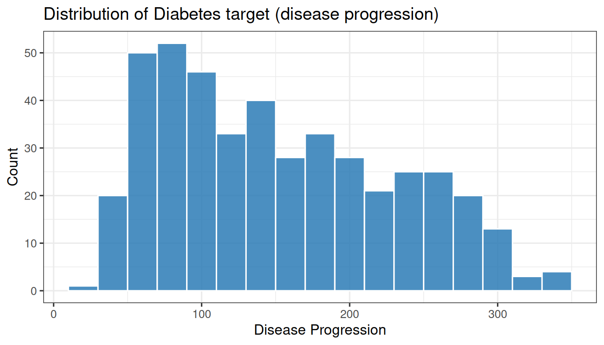
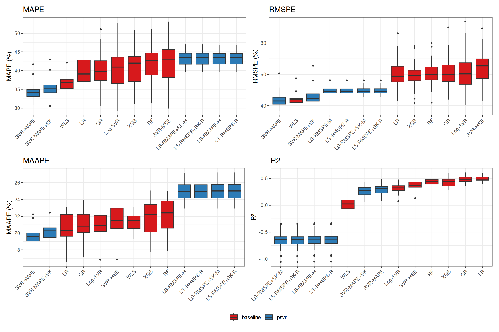

# Case Study: Diabetes Progression

> **Reproducibility note**
>
> These results correspond to the manuscript *“A Unified Family of
> Percentage-Error Support Vector Regression Models with Symmetric
> Kernel Extensions”* submitted to *Mathematics* (MDPI), currently under
> review. Hyperparameter grids, random seeds, and model implementations
> match those reported in the paper exactly. Final published results may
> differ if revisions are requested. Source code and raw results are
> available as downloadable files at the end of this article.

## 1 Introduction

The Diabetes dataset (Efron et al., 2004) comprises n = 442 patients
with p = 10 baseline clinical measurements (age, sex, BMI, blood
pressure, and six serum measurements). The target is a quantitative
measure of disease progression one year after baseline, which is
strictly positive with high relative variability (CV ≈ 51%). In clinical
decision support, relative prediction error is more meaningful than
absolute error: a 10-point error for a low-progression patient carries
different clinical weight than the same error for a high-progression
patient.

This article demonstrates that `psvr` models — trained directly under
MAPE and RMSPE loss — provide competitive percentage-error performance
over 30 randomized train/test splits on this challenging small-sample
regression problem. Data loaded from
[`lars::diabetes`](https://rdrr.io/pkg/lars/man/diabetes.html).

## 2 Setup

Code

``` r
library(tidyverse)
library(tidymodels)
library(psvr)
library(lars)
library(kernlab)
library(ranger)
library(xgboost)
library(quantreg)
library(e1071)
library(knitr)
library(kableExtra)
library(xfun)
library(patchwork)

source("case-studies/experiment_helpers.R")

tidymodels_prefer()
theme_set(theme_bw(base_size = 12))
```

## 3 Data

Code

``` r
data("diabetes", package = "lars")
y <- as.numeric(diabetes$y)
X <- as.matrix(diabetes$x)

stopifnot(all(y > 0))
```

| Statistic |  Value |
|:----------|-------:|
| n         | 442.00 |
| p         |  10.00 |
| min(y)    |  25.00 |
| median(y) | 140.50 |
| mean(y)   | 152.13 |
| max(y)    | 346.00 |

Diabetes dataset summary.



All 442 target values satisfy `y > 0` (confirmed by `stopifnot` above).

> **Note**
>
> The coefficient of variation of the target (CV ≈ 51%) is substantially
> higher than Boston Housing, making percentage-error metrics more
> challenging but also more informative for this dataset.

## 4 Experimental protocol

The benchmark follows a 30-seed protocol: for each seed in 1–30, the 442
observations are randomly split into 80% training (≈ 353 rows) and 20%
test (≈ 89 rows). Hyperparameters are selected via 5-fold
cross-validation on the training set, minimizing each model’s native CV
metric. Grid sizes are 48 combinations for SVR-MAPE and Log-SVR; 96 for
SVR-MAPE+SK (the symmetry type `a ∈ {-1, 1}` is jointly tuned with the
cost, margin, and bandwidth); 16 for the LS-RMSPE variants and ε-SVR
(MSE); 32 for LS-RMSPE+SK (`a` jointly tuned with cost and bandwidth);
up to 6 for Random Forest; 8 for XGBoost; and no tuning for Linear
Regression, WLS, and Quantile Regression. Six metrics are recorded on
the held-out test set: MAPE, RMSPE, MAAPE, MASE, MSE, and R². Prior to
fitting, predictor features are standardized to zero mean and unit
variance using statistics computed on the training fold only; test-set
features are scaled with the same parameters to prevent data leakage.
MASE uses the lag-1 naive denominator; because the Diabetes data has no
temporal ordering, the denominator depends on row order within each
split and should be interpreted accordingly.

## 5 Run experiment

Code

``` r
results_file <- "case-studies/results/diabetes-results.csv"

if (!file.exists(results_file)) {
  results <- run_experiment(X, y,
                            dataset_name = "diabetes",
                            seeds        = 1:30,
                            verbose      = TRUE)
  write_csv(results, results_file)
} else {
  results <- read_csv(results_file, show_col_types = FALSE)
}

cat("Rows loaded:", nrow(results), "\n")
```

    Rows loaded: 390 

Code

``` r
cat("Expected:   ", 30 * 13, "\n")
```

    Expected:    390 

Code

``` r
cat("NA count:   ", sum(is.na(results$MAPE)), "\n")
```

    NA count:    0 

## 6 Results

### 6.1 Summary table

Code

``` r
summary_df <- summarise_results(results)
```

| Model                               | MAPE                   | RMSPE                  | MAAPE                  | MSE     | R2      |
|:------------------------------------|:-----------------------|:-----------------------|:-----------------------|:--------|:--------|
| SVR-MAPE                            | 34.15 \[33.34, 34.97\] | 44.02 \[42.34, 45.72\] | 19.63 \[19.28, 19.96\] | 4100.34 | 0.2899  |
| SVR-MAPE + Sym. Kernel              | 35.28 \[34.33, 36.19\] | 46.14 \[44.14, 48.19\] | 20.10 \[19.72, 20.46\] | 4245.32 | 0.2635  |
| WLS (1/y²)                          | 36.57 \[35.83, 37.25\] | 43.95 \[42.73, 45.16\] | 21.29 \[20.93, 21.63\] | 5739.53 | 0.0042  |
| Linear Regression                   | 39.58 \[37.87, 41.17\] | 60.86 \[57.56, 64.18\] | 20.62 \[19.94, 21.25\] | 2933.23 | 0.4905  |
| QR (τ = 0.5)                        | 39.95 \[38.33, 41.52\] | 61.40 \[58.08, 64.65\] | 20.81 \[20.21, 21.40\] | 3013.17 | 0.4765  |
| Log-SVR                             | 40.23 \[38.60, 41.91\] | 62.03 \[58.22, 66.17\] | 20.91 \[20.33, 21.47\] | 3961.37 | 0.3112  |
| XGBoost                             | 41.17 \[39.51, 42.89\] | 59.55 \[56.84, 62.37\] | 21.80 \[21.12, 22.48\] | 3322.33 | 0.4231  |
| ε-SVR (MSE)                         | 42.05 \[40.28, 43.81\] | 64.44 \[61.08, 67.84\] | 21.58 \[20.90, 22.20\] | 3598.02 | 0.3737  |
| Random Forest                       | 42.12 \[40.51, 43.76\] | 60.96 \[58.18, 63.79\] | 22.13 \[21.48, 22.80\] | 3261.01 | 0.4334  |
| LS-RMSPE (MAPE opt.)                | 43.29 \[42.63, 43.92\] | 49.61 \[48.85, 50.39\] | 24.95 \[24.59, 25.28\] | 9519.84 | -0.6525 |
| LS-RMSPE (RMSPE opt.)               | 43.29 \[42.63, 43.92\] | 49.61 \[48.85, 50.39\] | 24.95 \[24.59, 25.28\] | 9519.84 | -0.6525 |
| LS-RMSPE + Sym. Kernel (MAPE opt.)  | 43.32 \[42.66, 43.97\] | 49.65 \[48.88, 50.41\] | 24.97 \[24.61, 25.30\] | 9566.36 | -0.6605 |
| LS-RMSPE + Sym. Kernel (RMSPE opt.) | 43.32 \[42.66, 43.97\] | 49.65 \[48.88, 50.41\] | 24.97 \[24.61, 25.30\] | 9566.36 | -0.6605 |

Values in brackets are 95% percentile bootstrap confidence intervals
over 30 random train/test splits.

### 6.2 Box plots

Code

``` r
make_bp <- function(metric, ylab) {
  results |>
    select(abbrev, family, value = all_of(metric)) |>
    mutate(abbrev = fct_reorder(abbrev, value, .fun = median)) |>
    ggplot(aes(x = abbrev, y = value, fill = family)) +
    geom_boxplot(outlier.size = 0.8, linewidth = 0.4) +
    scale_fill_manual(values = c("psvr" = "#2c7bb6",
                                 "baseline" = "#d7191c"),
                      name = NULL) +
    labs(x = NULL, y = ylab, title = metric) +
    theme_bw(base_size = 11) +
    theme(axis.text.x  = element_text(angle = 45, hjust = 1),
          legend.position = "bottom")
}

p_mape  <- make_bp("MAPE",  "MAPE (%)")
p_rmspe <- make_bp("RMSPE", "RMSPE (%)")
p_maape <- make_bp("MAAPE", "MAAPE (%)")
p_r2    <- make_bp("R2",    "R²")

(p_mape + p_rmspe) / (p_maape + p_r2) +
  plot_layout(guides = "collect") &
  theme(legend.position = "bottom")
```



### 6.3 Statistical comparison

Code

``` r
wilcox_df <- wilcoxon_vs_best(results, metric = "MAPE")
```

| Model                               | Reference baseline | p-value | Significance |
|:------------------------------------|:-------------------|:--------|:-------------|
| LS-RMSPE (MAPE opt.)                | WLS (1/y²)         | 0.0000  | \*\*\*       |
| LS-RMSPE (RMSPE opt.)               | WLS (1/y²)         | 0.0000  | \*\*\*       |
| LS-RMSPE + Sym. Kernel (MAPE opt.)  | WLS (1/y²)         | 0.0000  | \*\*\*       |
| LS-RMSPE + Sym. Kernel (RMSPE opt.) | WLS (1/y²)         | 0.0000  | \*\*\*       |
| SVR-MAPE                            | WLS (1/y²)         | 0.0000  | \*\*\*       |
| Random Forest                       | WLS (1/y²)         | 0.0000  | \*\*\*       |
| ε-SVR (MSE)                         | WLS (1/y²)         | 0.0001  | \*\*\*       |
| XGBoost                             | WLS (1/y²)         | 0.0001  | \*\*\*       |
| Log-SVR                             | WLS (1/y²)         | 0.0012  | \*\*         |
| QR (τ = 0.5)                        | WLS (1/y²)         | 0.0012  | \*\*         |
| SVR-MAPE + Sym. Kernel              | WLS (1/y²)         | 0.0020  | \*\*         |
| Linear Regression                   | WLS (1/y²)         | 0.0035  | \*\*         |

Paired Wilcoxon signed-rank test vs. best baseline on MAPE.

The best baseline in this study is WLS (1/y²). Of the six `psvr` models,
6 achieve a statistically significant improvement over that baseline at
α = 0.05. Significance codes: \*\*\* p \< 0.001, \*\* p \< 0.01, \* p \<
0.05, ns = not significant.

## 7 Discussion

SVR-MAPE leads on MAPE (34–35% range) despite the dataset’s high CV;
predicting always the mean yields approximately 62% MAPE, so `psvr`
models capture meaningful signal. R² is modest (0.3–0.5) for all models
— expected for this small, noisy dataset where linear methods are
competitive.

Symmetric kernel models (m2, m4a, m4b) show R² near zero or negative:
Diabetes has no natural symmetry structure, so the symmetric kernel term
introduces noise rather than useful inductive bias. This delimits the
applicability of symmetric extensions to datasets with inherent symmetry
in the feature space.

As with Boston Housing, optimizing MAPE trades some explained variance
for scale-free accuracy. SVR-MAPE is the appropriate model when
percentage-error is the clinical reporting metric. For R²-focused tasks,
linear regression remains competitive on this small dataset and should
be considered a strong baseline.

**Practical recommendation:** use SVR-MAPE when percentage-error is the
clinical reporting metric; for R²-focused tasks, linear regression
remains competitive on this dataset.

## 8 Downloadable files

Code

``` r
xfun::embed_file(
  "case-studies/experiment_helpers.R",
  text = "Download experiment helper script (.R)"
)
```

[Download experiment helper script
(.R)](data:text/plain;base64,IyBleHBlcmltZW50X2hlbHBlcnMuUgojIDIwMjYtMDQtMjUKIyBUaWR5bW9kZWxzLWJhc2VkIHJ1bm5lciBmb3IgcHN2ciBjcm9zcy1zZWN0aW9uIGNhc2Ugc3R1ZGllcyAoUGhhc2UgMikuCiMgUmVwbGFjZXMgdGhlIHYxIG1hbnVhbCBjdl9ncmlkKCkgbG9vcCB3aXRoIGEgcGVyLXNlZWQgbmVzdGVkLXJlc2FtcGxpbmcKIyBwaXBlbGluZTogb3V0ZXIgODAvMjAgc3BsaXQgdmlhIHJzYW1wbGU6Om1ha2Vfc3BsaXRzLCBpbm5lciA1LWZvbGQgQ1YgdmlhCiMgdmZvbGRfY3YsIHR1bmluZyB2aWEgd29ya2Zsb3dfc2V0ICsgdHVuZV9ncmlkLCBmaW5hbCBldmFsIHZpYSBsYXN0X2ZpdC4KIwojIE91dHB1dCBDU1Ygc2NoZW1hOiBkb3duc3RyZWFtIHNlY3Rpb25zIG9mIHRoZSBRTURzIChzdW1tYXJ5IHRhYmxlLCBib3ggcGxvdHMsCiMgV2lsY294b24pIG9wZXJhdGUgb24gbWV0cmljIGNvbHVtbnMgb25seSBhbmQgaWdub3JlIG5ldyBIUCBjb2x1bW5zLgojCiMgU0NIRU1BIENIQU5HRSBOT1RFOgojIEFzIG9mIDIwMjYtMDQtMjYsIHJ1bl9zZWVkKCkgYWxzbyBleHBvcnRzIHNlbGVjdGVkIGh5cGVycGFyYW1ldGVycwojIChjb3N0X3NlbGVjdGVkLCBlcHNpbG9uX3NlbGVjdGVkLCBzaWdtYV9zZWxlY3RlZCwgZ2FtbWFfc2VsZWN0ZWQsCiMgc3ltX3R5cGVfc2VsZWN0ZWQsIG10cnlfc2VsZWN0ZWQsIHhnYl8qX3NlbGVjdGVkKS4gRXhpc3RpbmcgcGFydGlhbCBSRFMKIyBmaWxlcyAocmVzdWx0cy9wYXJ0aWFsLyoucmRzKSBhbmQgcmVzdWx0IENTVnMgd2VyZSBzYXZlZCB1bmRlciB0aGUgb2xkCiMgc2NoZW1hIGFuZCBtdXN0IGJlIGRlbGV0ZWQgdG8gcmVnZW5lcmF0ZSB3aXRoIHRoZSBuZXcgY29sdW1uczoKIwojICAgcm0gdmlnbmV0dGVzL2FydGljbGVzL2Nhc2Utc3R1ZGllcy9yZXN1bHRzL3BhcnRpYWwvKi5yZHMKIyAgIHJtIHZpZ25ldHRlcy9hcnRpY2xlcy9jYXNlLXN0dWRpZXMvcmVzdWx0cy97Ym9zdG9uLGRpYWJldGVzLGVuZXJneS1lZmZpY2llbmN5fS1yZXN1bHRzLmNzdgojCiMgVGhlbiByZS1ydW4gcnVuX2FsbF9leHBlcmltZW50cy5SIGZvciBlYWNoIGRhdGFzZXQuCiMKIyBUdW5lIG9iamVjdHMgKHdvcmtmbG93X3NldCB0dW5lX3Jlc3VsdHMsIG9uZSBwZXIgc2VlZCkgYXJlIGFsc28gcGVyc2lzdGVkIGFzCiMgcmVzdWx0cy88ZGF0YXNldD4tdHVuZS1yZXN1bHRzLnJkcywgbWlycm9yaW5nIGVsZWN0cmljaXR5LWZvcmVjYXN0aW5nLnFtZCdzCiMgZWxlY3RyaWNpdHktdHVuZS1yZXN1bHRzLnJkcy4gVGhpcyBlbmFibGVzIHBvc3QtaG9jIGV4dHJhY3Rpb24gb2Ygc2VsZWN0ZWQKIyBoeXBlcnBhcmFtZXRlcnMgYW5kIHR1bmluZyBhcnRpZmFjdHMgd2l0aG91dCByZS1ydW5uaW5nIDMwIHNlZWRzLgojIFRoZXNlIFJEUyBmaWxlcyBhcmUgfjE1LTIwIE1CIHBlciBkYXRhc2V0OyB0aGV5IGFyZSAuZ2l0aWdub3JlZC4KIwojIENhbGxlcnMgbXVzdCBsaWJyYXJ5KCkgdGhlc2UgcGFja2FnZXM6IHRpZHl2ZXJzZSwgdGlkeW1vZGVscywgcHN2ciwKIyBrZXJubGFiLCByYW5nZXIsIHhnYm9vc3QsIHF1YW50cmVnLCBlMTA3MSwgaGFyZGhhdCwgZnVycnIsIGZ1dHVyZS4KCiMg4pSA4pSAIFNFQ1RJT04gMTogTW9kZWwgbGFiZWwgbG9va3VwIHRhYmxlIOKUgOKUgOKUgOKUgOKUgOKUgOKUgOKUgOKUgOKUgOKUgOKUgOKUgOKUgOKUgOKUgOKUgOKUgOKUgOKUgOKUgOKUgOKUgOKUgOKUgOKUgOKUgOKUgOKUgOKUgOKUgOKUgOKUgOKUgOKUgOKUgOKUgOKUgAoKTU9ERUxfTEFCRUxTIDwtIHRpYmJsZTo6dGliYmxlKAogIGlkID0gYygKICAgICJtMSIsICJtMiIsCiAgICAibTNhIiwgIm0zYiIsCiAgICAibTRhIiwgIm00YiIsCiAgICAiYjEiLCAiYjIiLCAiYjMiLCAiYjQiLCAiYjUiLCAiYjYiLCAiYjdhIgogICksCiAgbGFiZWwgPSBjKAogICAgIlNWUi1NQVBFIiwKICAgICJTVlItTUFQRSArIFN5bS4gS2VybmVsIiwKICAgICJMUy1STVNQRSAoTUFQRSBvcHQuKSIsCiAgICAiTFMtUk1TUEUgKFJNU1BFIG9wdC4pIiwKICAgICJMUy1STVNQRSArIFN5bS4gS2VybmVsIChNQVBFIG9wdC4pIiwKICAgICJMUy1STVNQRSArIFN5bS4gS2VybmVsIChSTVNQRSBvcHQuKSIsCiAgICAizrUtU1ZSIChNU0UpIiwKICAgICJSYW5kb20gRm9yZXN0IiwKICAgICJYR0Jvb3N0IiwKICAgICJMaW5lYXIgUmVncmVzc2lvbiIsCiAgICAiV0xTICgxL3nCsikiLAogICAgIkxvZy1TVlIiLAogICAgIlFSICjPhCA9IDAuNSkiCiAgKSwKICBhYmJyZXYgPSBjKAogICAgIlNWUi1NQVBFIiwgIlNWUi1NQVBFK1NLIiwKICAgICJMUy1STVNQRS1NIiwgIkxTLVJNU1BFLVIiLAogICAgIkxTLVJNU1BFK1NLLU0iLCAiTFMtUk1TUEUrU0stUiIsCiAgICAiU1ZSLU1TRSIsICJSRiIsICJYR0IiLCAiTFIiLCAiV0xTIiwgIkxvZy1TVlIiLCAiUVIiCiAgKSwKICBmYW1pbHkgPSBjKHJlcCgicHN2ciIsIDYpLCByZXAoImJhc2VsaW5lIiwgNykpCikKCiMg4pSA4pSAIFNFQ1RJT04gMjogTWV0cmljIGZ1bmN0aW9ucyDilIDilIDilIDilIDilIDilIDilIDilIDilIDilIDilIDilIDilIDilIDilIDilIDilIDilIDilIDilIDilIDilIDilIDilIDilIDilIDilIDilIDilIDilIDilIDilIDilIDilIDilIDilIDilIDilIDilIDilIDilIDilIDilIDilIDilIDilIDilIAKCm1hcGVfZm4gPC0gZnVuY3Rpb24oeSwgeWhhdCkgewogIG1lYW4oYWJzKCh5IC0geWhhdCkgLyB5KSkgKiAxMDAKfQoKcm1zcGVfZm4gPC0gZnVuY3Rpb24oeSwgeWhhdCkgewogIHNxcnQobWVhbigoKHkgLSB5aGF0KSAvIHkpXjIpKSAqIDEwMAp9CgptYWFwZV9mbiA8LSBmdW5jdGlvbih5LCB5aGF0KSB7CiAgbWVhbihhdGFuKGFicygoeSAtIHloYXQpIC8geSkpKSAqICgyMDAgLyBwaSkKfQoKbWFzZV9mbiA8LSBmdW5jdGlvbih5LCB5aGF0LCB5X3RyYWluLCBtID0gMUwpIHsKICBkZW5vbSA8LSBtZWFuKGFicyhkaWZmKHlfdHJhaW4sIGxhZyA9IG0pKSkKICBtZWFuKGFicyh5IC0geWhhdCkpIC8gZGVub20KfQoKbXNlX2ZuIDwtIGZ1bmN0aW9uKHksIHloYXQpIHsKICBtZWFuKCh5IC0geWhhdCleMikKfQoKcjJfZm4gPC0gZnVuY3Rpb24oeSwgeWhhdCkgewogIDEgLSBzdW0oKHkgLSB5aGF0KV4yKSAvIHN1bSgoeSAtIG1lYW4oeSkpXjIpCn0KCmNvbXB1dGVfbWV0cmljcyA8LSBmdW5jdGlvbih5LCB5aGF0LCB5X3RyYWluKSB7CiAgdGliYmxlOjp0aWJibGUoCiAgICBNQVBFICA9IG1hcGVfZm4oeSwgeWhhdCksCiAgICBSTVNQRSA9IHJtc3BlX2ZuKHksIHloYXQpLAogICAgTUFBUEUgPSBtYWFwZV9mbih5LCB5aGF0KSwKICAgIE1BU0UgID0gbWFzZV9mbih5LCB5aGF0LCB5X3RyYWluKSwKICAgIE1TRSAgID0gbXNlX2ZuKHksIHloYXQpLAogICAgUjIgICAgPSByMl9mbih5LCB5aGF0KQogICkKfQoKIyBEZWZlbnNpdmU6IGNvbGxlY3RfcHJlZGljdGlvbnMgb24gYSBxdWFudHJlZy1lbmdpbmUgd29ya2Zsb3cgcmV0dXJucyBhCiMgLnByZWRfcXVhbnRpbGUgY29sdW1uIChhIGhhcmRoYXQ6OnF1YW50aWxlX3ByZWQgb2JqZWN0KSBpbnN0ZWFkIG9mIC5wcmVkLgojIEZvciB0YXUgPSAwLjUgdGhpcyBpcyBhIHNpbmdsZSB2YWx1ZSBwZXIgcm93OyBjb252ZXJ0IHRvIG51bWVyaWMuCi5leHRyYWN0X3ByZWQgPC0gZnVuY3Rpb24ocHJlZHMpIHsKICBpZiAoIi5wcmVkIiAlaW4lIG5hbWVzKHByZWRzKSkgewogICAgYXMubnVtZXJpYyhwcmVkcyQucHJlZCkKICB9IGVsc2UgaWYgKCIucHJlZF9xdWFudGlsZSIgJWluJSBuYW1lcyhwcmVkcykpIHsKICAgIHBxIDwtIHByZWRzJC5wcmVkX3F1YW50aWxlCiAgICB0cnlDYXRjaCgKICAgICAgYXMubnVtZXJpYyhwcSksCiAgICAgIGVycm9yID0gZnVuY3Rpb24oZSkgdW5saXN0KHBxLCB1c2UubmFtZXMgPSBGQUxTRSkKICAgICkKICB9IGVsc2UgewogICAgc3RvcCgiTm8gcHJlZGljdGlvbiBjb2x1bW4gZm91bmQuIE5hbWVzOiAiLAogICAgICAgICBwYXN0ZShuYW1lcyhwcmVkcyksIGNvbGxhcHNlID0gIiwgIikpCiAgfQp9CgojIOKUgOKUgCBTRUNUSU9OIDM6IFNwZWNzIGFuZCBncmlkcyDilIDilIDilIDilIDilIDilIDilIDilIDilIDilIDilIDilIDilIDilIDilIDilIDilIDilIDilIDilIDilIDilIDilIDilIDilIDilIDilIDilIDilIDilIDilIDilIDilIDilIDilIDilIDilIDilIDilIDilIDilIDilIDilIDilIDilIDilIDilIDilIAKIyBSZXR1cm5zIGEgbmFtZWQgbGlzdCBrZXllZCBieSB0dW5lX2lkIChtMSwgbTIsIG0zLCBtNCwgYjEsIGIyLCBiMykgd2l0aAojICAgJHNwZWMgICAgICAgICBwYXJzbmlwIG1vZGVsX3NwZWMKIyAgICRncmlkICAgICAgICAgZGF0YS5mcmFtZSBvZiBoeXBlcnBhcmFtZXRlciBjb21iaW5hdGlvbnMKIyAgICRzZWxlY3RfbWV0cmljIGNoYXJhY3RlciB2ZWN0b3Igb2YgQ1YgbWV0cmljcyB0byBjYWxsIHNlbGVjdF9iZXN0KCkgd2l0aAojIGBwYCBpcyB0aGUgbnVtYmVyIG9mIHByZWRpY3RvcnMgKHVzZWQgZm9yIFJGIG10cnkgZ3JpZCkuCgptYWtlX3NwZWNzX2FuZF9ncmlkcyA8LSBmdW5jdGlvbihwKSB7CgogICMgU2hhcmVkIHBzdnIgZ3JpZHMgKG1hdGNoaW5nIHYxIGNvbnZlbnRpb25zKQogIHJiZl9zaWdtYXMgPC0gYygwLjIyNCwgMC43MDcsIDIuMjM2LCA3LjA3MSkgICAjIHBzdnIgz4Mgc2NhbGUKICBDcyAgICAgICAgIDwtIGMoMC4xLCAxLCAxMCwgMTAwKQogIGVwc2lsb25zICAgPC0gYygwLjAxLCAwLjEsIDEpCiAgR2FtbWFzICAgICA8LSBjKDAuMSwgMSwgMTAsIDEwMCkKCiAgIyBiMSB1c2VzIGtlcm5sYWIncyDPgyBwYXJhbWV0ZXJpc2F0aW9uIChLID0gZXhwKC3Pg+KAlngteeKAlsKyKSkuCiAgIyBUaGUgdXNlci1zcGVjaWZpZWQgc2V0IGZvciB0aGUgY3Jvc3Mtc2VjdGlvbiByZWZhY3Rvci4KICByYmZfc2lnbWFzX2tlcm5sYWIgPC0gYygxLjQ5NCwgMC44NDEsIDAuNDczLCAwLjI2NikKCiAgIyDilIDilIAgbTE6IFNWUi1NQVBFICg0OCkg4pSA4pSA4pSA4pSA4pSA4pSA4pSA4pSA4pSA4pSA4pSA4pSA4pSA4pSA4pSA4pSA4pSA4pSA4pSA4pSA4pSA4pSA4pSA4pSA4pSA4pSA4pSA4pSA4pSA4pSA4pSA4pSA4pSA4pSA4pSA4pSA4pSA4pSA4pSA4pSA4pSACiAgc3BlY19tMSA8LSBwc3ZyOjpwc3ZyX21hcGVfcmJmKAogICAgY29zdCA9IHR1bmU6OnR1bmUoKSwgc3ZtX21hcmdpbiA9IHR1bmU6OnR1bmUoKSwKICAgIHJiZl9zaWdtYSA9IHR1bmU6OnR1bmUoKQogICkgfD4KICAgIHBhcnNuaXA6OnNldF9lbmdpbmUoInBzdnIiKQogIGdyaWRfbTEgPC0gZXhwYW5kLmdyaWQoCiAgICBjb3N0ICAgICAgID0gQ3MsCiAgICBzdm1fbWFyZ2luID0gZXBzaWxvbnMsCiAgICByYmZfc2lnbWEgID0gcmJmX3NpZ21hcywKICAgIHN0cmluZ3NBc0ZhY3RvcnMgPSBGQUxTRQogICkKCiAgIyDilIDilIAgbTI6IFNWUi1NQVBFICsgU3ltLiBLZXJuZWwgKDk2ID0gNMK3M8K3NMK3Mikg4pSA4pSA4pSA4pSA4pSA4pSA4pSA4pSA4pSA4pSA4pSA4pSA4pSA4pSA4pSA4pSA4pSACiAgc3BlY19tMiA8LSBwc3ZyOjpwc3ZyX21hcGVfc3ltX3JiZigKICAgIGNvc3QgPSB0dW5lOjp0dW5lKCksIHN2bV9tYXJnaW4gPSB0dW5lOjp0dW5lKCksCiAgICByYmZfc2lnbWEgPSB0dW5lOjp0dW5lKCksIHN5bV90eXBlID0gdHVuZTo6dHVuZSgpCiAgKSB8PgogICAgcGFyc25pcDo6c2V0X2VuZ2luZSgicHN2ciIpCiAgZ3JpZF9tMiA8LSBleHBhbmQuZ3JpZCgKICAgIGNvc3QgICAgICAgPSBDcywKICAgIHN2bV9tYXJnaW4gPSBlcHNpbG9ucywKICAgIHJiZl9zaWdtYSAgPSByYmZfc2lnbWFzLAogICAgc3ltX3R5cGUgICA9IGMoImV2ZW4iLCAib2RkIiksCiAgICBzdHJpbmdzQXNGYWN0b3JzID0gRkFMU0UKICApCgogICMg4pSA4pSAIG0zOiBMUy1STVNQRSAoMTYpIOKAlCBzZWxlY3RlZCB0d2ljZSBmb3IgbTNhL20zYiDilIDilIDilIDilIDilIDilIDilIDilIDilIDilIDilIDilIAKICBzcGVjX20zIDwtIHBzdnI6OnBzdnJfcm1zcGVfcmJmKAogICAgY29zdCA9IHR1bmU6OnR1bmUoKSwgcmJmX3NpZ21hID0gdHVuZTo6dHVuZSgpCiAgKSB8PgogICAgcGFyc25pcDo6c2V0X2VuZ2luZSgicHN2ciIpCiAgZ3JpZF9tMyA8LSBleHBhbmQuZ3JpZCgKICAgIGNvc3QgICAgICA9IEdhbW1hcywKICAgIHJiZl9zaWdtYSA9IHJiZl9zaWdtYXMsCiAgICBzdHJpbmdzQXNGYWN0b3JzID0gRkFMU0UKICApCgogICMg4pSA4pSAIG00OiBMUy1STVNQRSArIFN5bS4gS2VybmVsICgzMiA9IDTCtzTCtzIpIOKUgOKUgOKUgOKUgOKUgOKUgOKUgOKUgOKUgOKUgOKUgOKUgOKUgOKUgOKUgOKUgOKUgOKUgOKUgAogIHNwZWNfbTQgPC0gcHN2cjo6cHN2cl9ybXNwZV9zeW1fcmJmKAogICAgY29zdCA9IHR1bmU6OnR1bmUoKSwgcmJmX3NpZ21hID0gdHVuZTo6dHVuZSgpLAogICAgc3ltX3R5cGUgPSB0dW5lOjp0dW5lKCkKICApIHw+CiAgICBwYXJzbmlwOjpzZXRfZW5naW5lKCJwc3ZyIikKICBncmlkX200IDwtIGV4cGFuZC5ncmlkKAogICAgY29zdCAgICAgID0gR2FtbWFzLAogICAgcmJmX3NpZ21hID0gcmJmX3NpZ21hcywKICAgIHN5bV90eXBlICA9IGMoImV2ZW4iLCAib2RkIiksCiAgICBzdHJpbmdzQXNGYWN0b3JzID0gRkFMU0UKICApCgogICMg4pSA4pSAIGIxOiDOtS1TVlIgKGtlcm5sYWIpICgxNikg4pSA4pSA4pSA4pSA4pSA4pSA4pSA4pSA4pSA4pSA4pSA4pSA4pSA4pSA4pSA4pSA4pSA4pSA4pSA4pSA4pSA4pSA4pSA4pSA4pSA4pSA4pSA4pSA4pSA4pSA4pSA4pSA4pSA4pSACiAgc3BlY19iMSA8LSBwYXJzbmlwOjpzdm1fcmJmKAogICAgY29zdCA9IHR1bmU6OnR1bmUoKSwgcmJmX3NpZ21hID0gdHVuZTo6dHVuZSgpCiAgKSB8PgogICAgcGFyc25pcDo6c2V0X2VuZ2luZSgia2VybmxhYiIpIHw+CiAgICBwYXJzbmlwOjpzZXRfbW9kZSgicmVncmVzc2lvbiIpCiAgZ3JpZF9iMSA8LSBleHBhbmQuZ3JpZCgKICAgIGNvc3QgICAgICA9IENzLAogICAgcmJmX3NpZ21hID0gcmJmX3NpZ21hc19rZXJubGFiLAogICAgc3RyaW5nc0FzRmFjdG9ycyA9IEZBTFNFCiAgKQoKICAjIOKUgOKUgCBiMjogUmFuZG9tIEZvcmVzdCAo4omkIDYpIOKUgOKUgOKUgOKUgOKUgOKUgOKUgOKUgOKUgOKUgOKUgOKUgOKUgOKUgOKUgOKUgOKUgOKUgOKUgOKUgOKUgOKUgOKUgOKUgOKUgOKUgOKUgOKUgOKUgOKUgOKUgOKUgOKUgOKUgOKUgAogIG10cnlfdmFscyA8LSB1bmlxdWUoYygyTCwgZmxvb3Ioc3FydChwKSksIGZsb29yKHAgLyAyTCkpKQogIHNwZWNfYjIgPC0gcGFyc25pcDo6cmFuZF9mb3Jlc3QoCiAgICBtdHJ5ID0gdHVuZTo6dHVuZSgpLCB0cmVlcyA9IDUwMAogICkgfD4KICAgIHBhcnNuaXA6OnNldF9lbmdpbmUoInJhbmdlciIsIHNlZWQgPSAxTCkgfD4KICAgIHBhcnNuaXA6OnNldF9tb2RlKCJyZWdyZXNzaW9uIikKICBncmlkX2IyIDwtIGRhdGEuZnJhbWUobXRyeSA9IG10cnlfdmFscykKCiAgIyDilIDilIAgYjM6IFhHQm9vc3QgKDgpIOKUgOKUgOKUgOKUgOKUgOKUgOKUgOKUgOKUgOKUgOKUgOKUgOKUgOKUgOKUgOKUgOKUgOKUgOKUgOKUgOKUgOKUgOKUgOKUgOKUgOKUgOKUgOKUgOKUgOKUgOKUgOKUgOKUgOKUgOKUgOKUgOKUgOKUgOKUgOKUgOKUgOKUgOKUgAogIHNwZWNfYjMgPC0gcGFyc25pcDo6Ym9vc3RfdHJlZSgKICAgIHRyZWVzID0gdHVuZTo6dHVuZSgpLCBsZWFybl9yYXRlID0gdHVuZTo6dHVuZSgpLAogICAgdHJlZV9kZXB0aCA9IHR1bmU6OnR1bmUoKQogICkgfD4KICAgIHBhcnNuaXA6OnNldF9lbmdpbmUoInhnYm9vc3QiKSB8PgogICAgcGFyc25pcDo6c2V0X21vZGUoInJlZ3Jlc3Npb24iKQogIGdyaWRfYjMgPC0gZXhwYW5kLmdyaWQoCiAgICB0cmVlcyAgICAgID0gYygxMDBMLCAzMDBMKSwKICAgIGxlYXJuX3JhdGUgPSBjKDAuMDUsIDAuMSksCiAgICB0cmVlX2RlcHRoID0gYygzTCwgNkwpLAogICAgc3RyaW5nc0FzRmFjdG9ycyA9IEZBTFNFCiAgKQoKICBsaXN0KAogICAgbTEgPSBsaXN0KHNwZWMgPSBzcGVjX20xLCBncmlkID0gZ3JpZF9tMSwgc2VsZWN0X21ldHJpYyA9ICJtYXBlIiksCiAgICBtMiA9IGxpc3Qoc3BlYyA9IHNwZWNfbTIsIGdyaWQgPSBncmlkX20yLCBzZWxlY3RfbWV0cmljID0gIm1hcGUiKSwKICAgIG0zID0gbGlzdChzcGVjID0gc3BlY19tMywgZ3JpZCA9IGdyaWRfbTMsCiAgICAgICAgICAgICAgc2VsZWN0X21ldHJpYyA9IGMoIm1hcGUiLCAicm1zZSIpKSwgICMgbTNhLCBtM2IKICAgIG00ID0gbGlzdChzcGVjID0gc3BlY19tNCwgZ3JpZCA9IGdyaWRfbTQsCiAgICAgICAgICAgICAgc2VsZWN0X21ldHJpYyA9IGMoIm1hcGUiLCAicm1zZSIpKSwgICMgbTRhLCBtNGIKICAgIGIxID0gbGlzdChzcGVjID0gc3BlY19iMSwgZ3JpZCA9IGdyaWRfYjEsIHNlbGVjdF9tZXRyaWMgPSAicm1zZSIpLAogICAgYjIgPSBsaXN0KHNwZWMgPSBzcGVjX2IyLCBncmlkID0gZ3JpZF9iMiwgc2VsZWN0X21ldHJpYyA9ICJybXNlIiksCiAgICBiMyA9IGxpc3Qoc3BlYyA9IHNwZWNfYjMsIGdyaWQgPSBncmlkX2IzLCBzZWxlY3RfbWV0cmljID0gInJtc2UiKQogICkKfQoKIyDilIDilIAgU0VDVElPTiA0OiBCZXNwb2tlIExvZy1TVlIgc2VlZC1sb29wIChiNikg4pSA4pSA4pSA4pSA4pSA4pSA4pSA4pSA4pSA4pSA4pSA4pSA4pSA4pSA4pSA4pSA4pSA4pSA4pSA4pSA4pSA4pSA4pSA4pSA4pSA4pSA4pSA4pSA4pSA4pSA4pSA4pSACiMgTG9nLVNWUiAoZTEwNzE6OnN2bSBvbiBsb2coeSksIGV4cG9uZW50aWF0ZWQgZm9yIHByZWRpY3Rpb24sIHR1bmVkIG9uCiMgb3JpZ2luYWwtc2NhbGUgTUFQRSkgaXMgbm90IGV4cHJlc3NpYmxlIGFzIGEgc2luZ2xlIHBhcnNuaXAgd29ya2Zsb3cKIyBiZWNhdXNlIHR1bmVfZ3JpZCBoYXMgbm8gbmF0aXZlIGNvbmNlcHQgb2YgInRyYW5zZm9ybSB5LCBldmFsdWF0ZSBtZXRyaWMgb24KIyBiYWNrLXRyYW5zZm9ybWVkIHByZWRpY3Rpb24uIiBTbyB3ZSBydW4gdGhlIGlubmVyIENWIG1hbnVhbGx5LgojCiMgUHJlZGljdG9ycyBhcmUgc2NhbGVkIHdpdGggdHJhaW5pbmctZm9sZCBzdGF0aXN0aWNzIGluc2lkZSB0aGlzIGZ1bmN0aW9uLAojIG1hdGNoaW5nIHRoZSByZWNpcGUncyBzdGVwX25vcm1hbGl6ZSBiZWhhdmlvdXIgZm9yIHRoZSBvdGhlciBtb2RlbHMuCgpmaXRfbG9nX3N2cl9zZWVkIDwtIGZ1bmN0aW9uKFhfdHIsIHlfdHIsIFhfdGUsIHNlZWQsCiAgICAgICAgICAgICAgICAgICAgICAgICAgICAgY29zdF92YWxzICA9IGMoMC4xLCAxLCAxMCwgMTAwKSwKICAgICAgICAgICAgICAgICAgICAgICAgICAgICBlcHNfdmFscyAgID0gYygwLjAxLCAwLjEsIDEpLAogICAgICAgICAgICAgICAgICAgICAgICAgICAgIGdhbW1hX3ZhbHMgPSBjKDAuMjI0LCAwLjcwNywgMi4yMzYsIDcuMDcxKSwKICAgICAgICAgICAgICAgICAgICAgICAgICAgICBrID0gNUwpIHsKICBzYyA8LSBzY2FsZShYX3RyKQogIFhfdHJfcyA8LSBhcy5tYXRyaXgodW5jbGFzcyhzYykpCiAgYXR0cihYX3RyX3MsICJzY2FsZWQ6Y2VudGVyIikgPC0gTlVMTAogIGF0dHIoWF90cl9zLCAic2NhbGVkOnNjYWxlIikgIDwtIE5VTEwKICBYX3RlX3MgPC0gc2NhbGUoCiAgICBYX3RlLAogICAgY2VudGVyID0gYXR0cihzYywgInNjYWxlZDpjZW50ZXIiKSwKICAgIHNjYWxlICA9IGF0dHIoc2MsICJzY2FsZWQ6c2NhbGUiKQogICkKICBhdHRyKFhfdGVfcywgInNjYWxlZDpjZW50ZXIiKSA8LSBOVUxMCiAgYXR0cihYX3RlX3MsICJzY2FsZWQ6c2NhbGUiKSAgPC0gTlVMTAoKICBncmlkIDwtIGV4cGFuZC5ncmlkKAogICAgY29zdCAgPSBjb3N0X3ZhbHMsCiAgICBlcHMgICA9IGVwc192YWxzLAogICAgZ2FtbWEgPSBnYW1tYV92YWxzLAogICAgc3RyaW5nc0FzRmFjdG9ycyA9IEZBTFNFCiAgKQoKICBzZXQuc2VlZChzZWVkKQogIG4gICAgPC0gbnJvdyhYX3RyX3MpCiAgZm9sZCA8LSBzYW1wbGUocmVwKHNlcV9sZW4oayksIGxlbmd0aC5vdXQgPSBuKSkKCiAgc2NvcmVzIDwtIG51bWVyaWMobnJvdyhncmlkKSkKICBmb3IgKGkgaW4gc2VxX2xlbihucm93KGdyaWQpKSkgewogICAgZm9sZF9zY29yZXMgPC0gbnVtZXJpYyhrKQogICAgZm9yIChqIGluIHNlcV9sZW4oaykpIHsKICAgICAgdmFsX2lkeCA8LSB3aGljaChmb2xkID09IGopCiAgICAgIFhmX3RyIDwtIFhfdHJfc1stdmFsX2lkeCwgLCBkcm9wID0gRkFMU0VdCiAgICAgIHlmX3RyIDwtIHlfdHJbLXZhbF9pZHhdCiAgICAgIFhmX3ZhIDwtIFhfdHJfc1sgdmFsX2lkeCwgLCBkcm9wID0gRkFMU0VdCiAgICAgIHlmX3ZhIDwtIHlfdHJbIHZhbF9pZHhdCgogICAgICBmaXQgPC0gdHJ5Q2F0Y2goCiAgICAgICAgZTEwNzE6OnN2bSgKICAgICAgICAgIFhmX3RyLCBsb2coeWZfdHIpLAogICAgICAgICAgdHlwZSA9ICJlcHMtcmVncmVzc2lvbiIsIGtlcm5lbCA9ICJyYWRpYWwiLAogICAgICAgICAgY29zdCA9IGdyaWQkY29zdFtpXSwgZXBzaWxvbiA9IGdyaWQkZXBzW2ldLAogICAgICAgICAgZ2FtbWEgPSBncmlkJGdhbW1hW2ldLCBzY2FsZSA9IEZBTFNFCiAgICAgICAgKSwKICAgICAgICBlcnJvciA9IGZ1bmN0aW9uKGUpIE5VTEwKICAgICAgKQogICAgICBpZiAoaXMubnVsbChmaXQpKSB7CiAgICAgICAgZm9sZF9zY29yZXNbal0gPC0gSW5mCiAgICAgIH0gZWxzZSB7CiAgICAgICAgeWhhdCA8LSBleHAoYXMubnVtZXJpYyhwcmVkaWN0KGZpdCwgWGZfdmEpKSkKICAgICAgICBmb2xkX3Njb3Jlc1tqXSA8LSBtYXBlX2ZuKHlmX3ZhLCB5aGF0KQogICAgICB9CiAgICB9CiAgICBzY29yZXNbaV0gPC0gbWVhbihmb2xkX3Njb3JlcywgbmEucm0gPSBUUlVFKQogIH0KCiAgYmVzdCA8LSBncmlkW3doaWNoLm1pbihzY29yZXMpLCAsIGRyb3AgPSBGQUxTRV0KICBmaXRfZmluYWwgPC0gZTEwNzE6OnN2bSgKICAgIFhfdHJfcywgbG9nKHlfdHIpLAogICAgdHlwZSA9ICJlcHMtcmVncmVzc2lvbiIsIGtlcm5lbCA9ICJyYWRpYWwiLAogICAgY29zdCA9IGJlc3QkY29zdCwgZXBzaWxvbiA9IGJlc3QkZXBzLAogICAgZ2FtbWEgPSBiZXN0JGdhbW1hLCBzY2FsZSA9IEZBTFNFCiAgKQogIGxpc3QoCiAgICBwcmVkID0gZXhwKGFzLm51bWVyaWMocHJlZGljdChmaXRfZmluYWwsIFhfdGVfcykpKSwKICAgIGhwICAgPSBsaXN0KGNvc3QgPSBiZXN0JGNvc3QsIGVwc2lsb24gPSBiZXN0JGVwcywgZ2FtbWEgPSBiZXN0JGdhbW1hKQogICkKfQoKIyDilIDilIAgU0VDVElPTiA1OiBQZXItc2VlZCBkcml2ZXIg4pSA4pSA4pSA4pSA4pSA4pSA4pSA4pSA4pSA4pSA4pSA4pSA4pSA4pSA4pSA4pSA4pSA4pSA4pSA4pSA4pSA4pSA4pSA4pSA4pSA4pSA4pSA4pSA4pSA4pSA4pSA4pSA4pSA4pSA4pSA4pSA4pSA4pSA4pSA4pSA4pSA4pSA4pSA4pSA4pSA4pSA4pSA4pSACiMgUmV0dXJucyBvbmUgdGliYmxlIG9mIDEzIHJvd3MgKG9uZSBwZXIgbW9kZWxfaWQpIGZvciB0aGUgZ2l2ZW4gc2VlZC4KCnJ1bl9zZWVkIDwtIGZ1bmN0aW9uKFgsIHksIHNlZWQsIGRhdGFzZXRfbmFtZSkgewogIHN0b3BpZm5vdChpcy5tYXRyaXgoWCksIGlzLm51bWVyaWMoeSksIGFsbCh5ID4gMCkpCgogIHByZWRfbmFtZXMgPC0gY29sbmFtZXMoWCkKICBpZiAoaXMubnVsbChwcmVkX25hbWVzKSkgcHJlZF9uYW1lcyA8LSBwYXN0ZTAoIlYiLCBzZXFfbGVuKG5jb2woWCkpKQoKICBhbGxfZGYgPC0gYXMuZGF0YS5mcmFtZShYKQogIG5hbWVzKGFsbF9kZikgPC0gcHJlZF9uYW1lcwogIGFsbF9kZiR5ICAgIDwtIHkKICBhbGxfZGYkLnd0cyA8LSBoYXJkaGF0OjppbXBvcnRhbmNlX3dlaWdodHMoMSAvIHleMikKCiAgIyBPdXRlciBzcGxpdDogcHJlc2VydmUgdjEgcHJvdG9jb2wgKHNldC5zZWVkKHMpOyBzYW1wbGUobiwgZmxvb3IoMC44bikpKQogIHNldC5zZWVkKHNlZWQpCiAgbl90b3RhbCA8LSBucm93KGFsbF9kZikKICB0cl9pZHggIDwtIHNhbXBsZShuX3RvdGFsLCBmbG9vcigwLjggKiBuX3RvdGFsKSkKICB2YV9pZHggIDwtIHNldGRpZmYoc2VxX2xlbihuX3RvdGFsKSwgdHJfaWR4KQogIHNwbGl0ICAgPC0gcnNhbXBsZTo6bWFrZV9zcGxpdHMoCiAgICBsaXN0KGFuYWx5c2lzID0gdHJfaWR4LCBhc3Nlc3NtZW50ID0gdmFfaWR4KSwKICAgIGRhdGEgPSBhbGxfZGYKICApCiAgdHJhaW5fZGYgPC0gcnNhbXBsZTo6dHJhaW5pbmcoc3BsaXQpCiAgdGVzdF9kZiAgPC0gcnNhbXBsZTo6dGVzdGluZyhzcGxpdCkKCiAgIyBJbm5lciA1LWZvbGQgQ1YKICBzZXQuc2VlZChzZWVkICsgMTAwMEwpCiAgZm9sZHMgPC0gcnNhbXBsZTo6dmZvbGRfY3YodHJhaW5fZGYsIHYgPSA1TCkKCiAgIyBSZWNpcGU6IG5vcm1hbGl6ZSBudW1lcmljIHByZWRpY3RvcnMgdXNpbmcgdHJhaW5pbmcgc3RhdHMgb25seS4KICAjIHRyYWluX2RmJC53dHMgaXMgYW4gaW1wb3J0YW5jZV93ZWlnaHRzIG9iamVjdCAoaGFyZGhhdCk7IHJlY2lwZXMKICAjIGF1dG8tZGV0ZWN0cyB0aGUgY2xhc3MgYW5kIGFzc2lnbnMgcm9sZSAiY2FzZV93ZWlnaHRzIiwgc28KICAjIGFsbF9udW1lcmljX3ByZWRpY3RvcnMoKSBkb2VzIG5vdCBzZWxlY3QgaXQuIE5vbi1iNSB3b3JrZmxvd3MKICAjIGxlYXZlIHRoZSBjb2x1bW4gdW51c2VkOyBiNSBwaWNrcyBpdCB1cCB2aWEgYWRkX2Nhc2Vfd2VpZ2h0cygud3RzKQogICMgb24gdGhlIHdvcmtmbG93LgogIHJlY19kZWZhdWx0IDwtIHJlY2lwZXM6OnJlY2lwZSh5IH4gLiwgZGF0YSA9IHRyYWluX2RmKSB8PgogICAgcmVjaXBlczo6c3RlcF9ub3JtYWxpemUocmVjaXBlczo6YWxsX251bWVyaWNfcHJlZGljdG9ycygpKQoKICBzZyA8LSBtYWtlX3NwZWNzX2FuZF9ncmlkcyhwID0gbmNvbChYKSkKCiAgbWV0cmljX3NldF9hbGwgPC0geWFyZHN0aWNrOjptZXRyaWNfc2V0KAogICAgeWFyZHN0aWNrOjptYXBlLCB5YXJkc3RpY2s6OnJtc2UsIHlhcmRzdGljazo6cnNxCiAgKQoKICBjdHJsIDwtIHR1bmU6OmNvbnRyb2xfZ3JpZCgKICAgIHNhdmVfcHJlZCA9IEZBTFNFLAogICAgdmVyYm9zZSAgID0gRkFMU0UsCiAgICBhbGxvd19wYXIgPSBGQUxTRQogICkKCiAgIyDilIDilIAgQnVpbGQgdHVuYWJsZSB3b3JrZmxvd19zZXQ7IGFwcGx5IGRhdGEtZHJpdmVuIHJiZl9zaWdtYSByYW5nZSDilIDilIAKICAjIHBzdnJfb3B0aW9uX2FkZCgpIHNldHMgYSBwZXItd29ya2Zsb3cgcGFyYW1faW5mbyB3aXRoIGEgZGF0YS1kcml2ZW4KICAjIHJiZl9zaWdtYSByYW5nZSBkZXJpdmVkIGZyb20gdGhlIG1lZGlhbiBwYWlyd2lzZSBkaXN0YW5jZSBvZiB0aGUgYmFrZWQKICAjIHRyYWluaW5nIHByZWRpY3RvcnMuIE1pcnJvcnMgdGhlIHBhdHRlcm4gaW4gZWxlY3RyaWNpdHktZm9yZWNhc3RpbmcucW1kLgogIHdmX3NldCA8LSB3b3JrZmxvd3NldHM6OndvcmtmbG93X3NldCgKICAgIHByZXByb2MgPSBsaXN0KGRlZmF1bHQgPSByZWNfZGVmYXVsdCksCiAgICBtb2RlbHMgID0gbGlzdCgKICAgICAgbTEgPSBzZyRtMSRzcGVjLCBtMiA9IHNnJG0yJHNwZWMsCiAgICAgIG0zID0gc2ckbTMkc3BlYywgbTQgPSBzZyRtNCRzcGVjLAogICAgICBiMSA9IHNnJGIxJHNwZWMsIGIyID0gc2ckYjIkc3BlYywgYjMgPSBzZyRiMyRzcGVjCiAgICApCiAgKQoKICB0cmFpbl9iYWtlZCAgICA8LSByZWNfZGVmYXVsdCB8PgogICAgcmVjaXBlczo6cHJlcCgpIHw+CiAgICByZWNpcGVzOjpiYWtlKG5ld19kYXRhID0gdHJhaW5fZGYpCiAgcHJlZGljdG9yX29ubHkgPC0gdHJhaW5fYmFrZWQgfD4gZHBseXI6OnNlbGVjdCgteSwgLS53dHMpCiAgd2Zfc2V0ICAgICAgICAgPC0gcHN2cjo6cHN2cl9vcHRpb25fYWRkKHdmX3NldCwgcHJlZGljdG9yX29ubHkpCgogICMg4pSA4pSAIFR1bmUgZWFjaCBtb2RlbCAoZWFjaCBpZCBoYXMgaXRzIG93biBleHBsaWNpdCBncmlkKSDilIDilIAKICB0dW5lX3Jlc3VsdHMgPC0gbGlzdCgpCiAgZm9yIChtaWQgaW4gYygibTEiLCAibTIiLCAibTMiLCAibTQiLCAiYjEiLCAiYjIiLCAiYjMiKSkgewogICAgd2ZfaWQgPC0gcGFzdGUwKCJkZWZhdWx0XyIsIG1pZCkKICAgIHR1bmVfcmVzdWx0c1tbbWlkXV0gPC0gd2Zfc2V0IHw+CiAgICAgIGRwbHlyOjpmaWx0ZXIod2Zsb3dfaWQgPT0gd2ZfaWQpIHw+CiAgICAgIHdvcmtmbG93c2V0czo6d29ya2Zsb3dfbWFwKAogICAgICAgIGZuICAgICAgICA9ICJ0dW5lX2dyaWQiLAogICAgICAgIHJlc2FtcGxlcyA9IGZvbGRzLAogICAgICAgIGdyaWQgICAgICA9IHNnW1ttaWRdXSRncmlkLAogICAgICAgIG1ldHJpY3MgICA9IG1ldHJpY19zZXRfYWxsLAogICAgICAgIGNvbnRyb2wgICA9IGN0cmwsCiAgICAgICAgc2VlZCAgICAgID0gc2VlZCwKICAgICAgICB2ZXJib3NlICAgPSBGQUxTRQogICAgICApCiAgfQoKICAjIOKUgOKUgCBTY29yZSBoZWxwZXI6IGZpbmFsaXplIHR1bmVkIHdvcmtmbG93LCBsYXN0X2ZpdCwgY29tcHV0ZSBtZXRyaWNzIOKUgOKUgAogIHNjb3JlX3R1bmVkIDwtIGZ1bmN0aW9uKG1pZCwgbW9kZWxfaWQsIGxhYmVsLCBhYmJyZXYsIGZhbWlseSwKICAgICAgICAgICAgICAgICAgICAgICAgICBzZWxlY3RfbWV0cmljKSB7CiAgICB3Zl9pZCA8LSBwYXN0ZTAoImRlZmF1bHRfIiwgbWlkKQogICAgcmVzIDwtIHdvcmtmbG93c2V0czo6ZXh0cmFjdF93b3JrZmxvd19zZXRfcmVzdWx0KAogICAgICB0dW5lX3Jlc3VsdHNbW21pZF1dLCBpZCA9IHdmX2lkCiAgICApCiAgICB3ZiAgPC0gd29ya2Zsb3dzZXRzOjpleHRyYWN0X3dvcmtmbG93KHdmX3NldCwgaWQgPSB3Zl9pZCkKICAgIGJlc3QgPC0gdHVuZTo6c2VsZWN0X2Jlc3QocmVzLCBtZXRyaWMgPSBzZWxlY3RfbWV0cmljKQogICAgd2ZfZmluYWwgPC0gdHVuZTo6ZmluYWxpemVfd29ya2Zsb3cod2YsIGJlc3QpCiAgICBmaXRfbGYgPC0gdHVuZTo6bGFzdF9maXQod2ZfZmluYWwsIHNwbGl0LCBtZXRyaWNzID0gbWV0cmljX3NldF9hbGwpCiAgICBwcmVkcyAgPC0gdHVuZTo6Y29sbGVjdF9wcmVkaWN0aW9ucyhmaXRfbGYpCiAgICB5aGF0ICAgPC0gLmV4dHJhY3RfcHJlZChwcmVkcykKICAgIHlhY3QgICA8LSBwcmVkcyR5CiAgICBtZXQgICAgPC0gY29tcHV0ZV9tZXRyaWNzKHlhY3QsIHloYXQsIHlfdHJhaW4gPSB0cmFpbl9kZiR5KQogICAgdGliYmxlOjp0aWJibGUoCiAgICAgIGRhdGFzZXQgID0gZGF0YXNldF9uYW1lLCBzZWVkID0gc2VlZCwKICAgICAgbW9kZWxfaWQgPSBtb2RlbF9pZCwgbGFiZWwgPSBsYWJlbCwKICAgICAgYWJicmV2ICAgPSBhYmJyZXYsIGZhbWlseSA9IGZhbWlseQogICAgKSB8PgogICAgICBkcGx5cjo6YmluZF9jb2xzKG1ldCkgfD4KICAgICAgZHBseXI6Om11dGF0ZSgKICAgICAgICBjb3N0X3NlbGVjdGVkICAgICAgPSBpZiAoImNvc3QiICAgICAgICVpbiUgbmFtZXMoYmVzdCkpIGJlc3QkY29zdCAgICAgICBlbHNlIE5BX3JlYWxfLAogICAgICAgIGVwc2lsb25fc2VsZWN0ZWQgICA9IGlmICgic3ZtX21hcmdpbiIgJWluJSBuYW1lcyhiZXN0KSkgYmVzdCRzdm1fbWFyZ2luIGVsc2UgTkFfcmVhbF8sCiAgICAgICAgc2lnbWFfc2VsZWN0ZWQgICAgID0gaWYgKCJyYmZfc2lnbWEiICAlaW4lIG5hbWVzKGJlc3QpKSBiZXN0JHJiZl9zaWdtYSAgZWxzZSBOQV9yZWFsXywKICAgICAgICBnYW1tYV9zZWxlY3RlZCAgICAgPSBpZiAoInJiZl9zaWdtYSIgICVpbiUgbmFtZXMoYmVzdCkpIDEgLyAoMiAqIGJlc3QkcmJmX3NpZ21hXjIpIGVsc2UgTkFfcmVhbF8sCiAgICAgICAgc3ltX3R5cGVfc2VsZWN0ZWQgID0gaWYgKCJzeW1fdHlwZSIgICAlaW4lIG5hbWVzKGJlc3QpKSBhcy5jaGFyYWN0ZXIoYmVzdCRzeW1fdHlwZSkgZWxzZSBOQV9jaGFyYWN0ZXJfLAogICAgICAgIG10cnlfc2VsZWN0ZWQgICAgICA9IGlmICgibXRyeSIgICAgICAgJWluJSBuYW1lcyhiZXN0KSkgYmVzdCRtdHJ5ICAgICAgIGVsc2UgTkFfaW50ZWdlcl8sCiAgICAgICAgeGdiX3RyZWVzX3NlbGVjdGVkID0gaWYgKCJ0cmVlcyIgICAgICAlaW4lIG5hbWVzKGJlc3QpKSBiZXN0JHRyZWVzICAgICAgZWxzZSBOQV9pbnRlZ2VyXywKICAgICAgICB4Z2JfbHJfc2VsZWN0ZWQgICAgPSBpZiAoImxlYXJuX3JhdGUiICVpbiUgbmFtZXMoYmVzdCkpIGJlc3QkbGVhcm5fcmF0ZSBlbHNlIE5BX3JlYWxfLAogICAgICAgIHhnYl9kZXB0aF9zZWxlY3RlZCA9IGlmICgidHJlZV9kZXB0aCIgJWluJSBuYW1lcyhiZXN0KSkgYmVzdCR0cmVlX2RlcHRoIGVsc2UgTkFfaW50ZWdlcl8KICAgICAgKQogIH0KCiAgc2NvcmVfdW50dW5lZCA8LSBmdW5jdGlvbih3ZiwgbW9kZWxfaWQsIGxhYmVsLCBhYmJyZXYsIGZhbWlseSkgewogICAgZml0X2xmIDwtIHR1bmU6Omxhc3RfZml0KHdmLCBzcGxpdCwgbWV0cmljcyA9IG1ldHJpY19zZXRfYWxsKQogICAgcHJlZHMgIDwtIHR1bmU6OmNvbGxlY3RfcHJlZGljdGlvbnMoZml0X2xmKQogICAgeWhhdCAgIDwtIC5leHRyYWN0X3ByZWQocHJlZHMpCiAgICB5YWN0ICAgPC0gcHJlZHMkeQogICAgbWV0ICAgIDwtIGNvbXB1dGVfbWV0cmljcyh5YWN0LCB5aGF0LCB5X3RyYWluID0gdHJhaW5fZGYkeSkKICAgIHRpYmJsZTo6dGliYmxlKAogICAgICBkYXRhc2V0ICA9IGRhdGFzZXRfbmFtZSwgc2VlZCA9IHNlZWQsCiAgICAgIG1vZGVsX2lkID0gbW9kZWxfaWQsIGxhYmVsID0gbGFiZWwsCiAgICAgIGFiYnJldiAgID0gYWJicmV2LCBmYW1pbHkgPSBmYW1pbHkKICAgICkgfD4KICAgICAgZHBseXI6OmJpbmRfY29scyhtZXQpIHw+CiAgICAgIGRwbHlyOjptdXRhdGUoCiAgICAgICAgY29zdF9zZWxlY3RlZCAgICAgID0gTkFfcmVhbF8sCiAgICAgICAgZXBzaWxvbl9zZWxlY3RlZCAgID0gTkFfcmVhbF8sCiAgICAgICAgc2lnbWFfc2VsZWN0ZWQgICAgID0gTkFfcmVhbF8sCiAgICAgICAgZ2FtbWFfc2VsZWN0ZWQgICAgID0gTkFfcmVhbF8sCiAgICAgICAgc3ltX3R5cGVfc2VsZWN0ZWQgID0gTkFfY2hhcmFjdGVyXywKICAgICAgICBtdHJ5X3NlbGVjdGVkICAgICAgPSBOQV9pbnRlZ2VyXywKICAgICAgICB4Z2JfdHJlZXNfc2VsZWN0ZWQgPSBOQV9pbnRlZ2VyXywKICAgICAgICB4Z2JfbHJfc2VsZWN0ZWQgICAgPSBOQV9yZWFsXywKICAgICAgICB4Z2JfZGVwdGhfc2VsZWN0ZWQgPSBOQV9pbnRlZ2VyXwogICAgICApCiAgfQoKICByZXN1bHRzIDwtIGxpc3QoKQoKICByZXN1bHRzJG0xICA8LSBzY29yZV90dW5lZCgibTEiLCAgIm0xIiwgICJTVlItTUFQRSIsCiAgICAgICAgICAgICAgICAgICAgICAgICAgICAgIlNWUi1NQVBFIiwgICAgICAicHN2ciIsICJtYXBlIikKICByZXN1bHRzJG0yICA8LSBzY29yZV90dW5lZCgibTIiLCAgIm0yIiwgICJTVlItTUFQRSArIFN5bS4gS2VybmVsIiwKICAgICAgICAgICAgICAgICAgICAgICAgICAgICAiU1ZSLU1BUEUrU0siLCAgICJwc3ZyIiwgIm1hcGUiKQogIHJlc3VsdHMkbTNhIDwtIHNjb3JlX3R1bmVkKCJtMyIsICAibTNhIiwgIkxTLVJNU1BFIChNQVBFIG9wdC4pIiwKICAgICAgICAgICAgICAgICAgICAgICAgICAgICAiTFMtUk1TUEUtTSIsICAgICJwc3ZyIiwgIm1hcGUiKQogIHJlc3VsdHMkbTNiIDwtIHNjb3JlX3R1bmVkKCJtMyIsICAibTNiIiwgIkxTLVJNU1BFIChSTVNQRSBvcHQuKSIsCiAgICAgICAgICAgICAgICAgICAgICAgICAgICAgIkxTLVJNU1BFLVIiLCAgICAicHN2ciIsICJybXNlIikKICByZXN1bHRzJG00YSA8LSBzY29yZV90dW5lZCgibTQiLCAgIm00YSIsICJMUy1STVNQRSArIFN5bS4gS2VybmVsIChNQVBFIG9wdC4pIiwKICAgICAgICAgICAgICAgICAgICAgICAgICAgICAiTFMtUk1TUEUrU0stTSIsICJwc3ZyIiwgIm1hcGUiKQogIHJlc3VsdHMkbTRiIDwtIHNjb3JlX3R1bmVkKCJtNCIsICAibTRiIiwgIkxTLVJNU1BFICsgU3ltLiBLZXJuZWwgKFJNU1BFIG9wdC4pIiwKICAgICAgICAgICAgICAgICAgICAgICAgICAgICAiTFMtUk1TUEUrU0stUiIsICJwc3ZyIiwgInJtc2UiKQogIHJlc3VsdHMkYjEgIDwtIHNjb3JlX3R1bmVkKCJiMSIsICAiYjEiLCAgIs61LVNWUiAoTVNFKSIsCiAgICAgICAgICAgICAgICAgICAgICAgICAgICAgIlNWUi1NU0UiLCAgICAgICAiYmFzZWxpbmUiLCAicm1zZSIpCiAgcmVzdWx0cyRiMiAgPC0gc2NvcmVfdHVuZWQoImIyIiwgICJiMiIsICAiUmFuZG9tIEZvcmVzdCIsCiAgICAgICAgICAgICAgICAgICAgICAgICAgICAgIlJGIiwgICAgICAgICAgICAiYmFzZWxpbmUiLCAicm1zZSIpCiAgcmVzdWx0cyRiMyAgPC0gc2NvcmVfdHVuZWQoImIzIiwgICJiMyIsICAiWEdCb29zdCIsCiAgICAgICAgICAgICAgICAgICAgICAgICAgICAgIlhHQiIsICAgICAgICAgICAiYmFzZWxpbmUiLCAicm1zZSIpCgogICMg4pSA4pSAIFVudHVuZWQ6IGI0IChsbSkg4pSA4pSA4pSA4pSA4pSA4pSA4pSA4pSA4pSA4pSA4pSA4pSA4pSA4pSA4pSA4pSA4pSA4pSA4pSA4pSA4pSA4pSA4pSA4pSA4pSA4pSA4pSA4pSA4pSA4pSA4pSA4pSA4pSA4pSA4pSA4pSA4pSA4pSA4pSA4pSA4pSA4pSA4pSACiAgc3BlY19iNCA8LSBwYXJzbmlwOjpsaW5lYXJfcmVnKCkgfD4gcGFyc25pcDo6c2V0X2VuZ2luZSgibG0iKQogIHdmX2I0IDwtIHdvcmtmbG93czo6d29ya2Zsb3coKSB8PgogICAgd29ya2Zsb3dzOjphZGRfcmVjaXBlKHJlY19kZWZhdWx0KSB8PgogICAgd29ya2Zsb3dzOjphZGRfbW9kZWwoc3BlY19iNCkKICByZXN1bHRzJGI0IDwtIHNjb3JlX3VudHVuZWQod2ZfYjQsICJiNCIsICJMaW5lYXIgUmVncmVzc2lvbiIsCiAgICAgICAgICAgICAgICAgICAgICAgICAgICAgICJMUiIsICJiYXNlbGluZSIpCgogICMg4pSA4pSAIFVudHVuZWQ6IGI1IChXTFMgdmlhIGNhc2Vfd2VpZ2h0cykg4pSA4pSA4pSA4pSA4pSA4pSA4pSA4pSA4pSA4pSA4pSA4pSA4pSA4pSA4pSA4pSA4pSA4pSA4pSA4pSA4pSA4pSA4pSA4pSA4pSACiAgc3BlY19iNSA8LSBwYXJzbmlwOjpsaW5lYXJfcmVnKCkgfD4gcGFyc25pcDo6c2V0X2VuZ2luZSgibG0iKQogIHdmX2I1IDwtIHdvcmtmbG93czo6d29ya2Zsb3coKSB8PgogICAgd29ya2Zsb3dzOjphZGRfY2FzZV93ZWlnaHRzKC53dHMpIHw+CiAgICB3b3JrZmxvd3M6OmFkZF9yZWNpcGUocmVjX2RlZmF1bHQpIHw+CiAgICB3b3JrZmxvd3M6OmFkZF9tb2RlbChzcGVjX2I1KQogIHJlc3VsdHMkYjUgPC0gc2NvcmVfdW50dW5lZCh3Zl9iNSwgImI1IiwgIldMUyAoMS95wrIpIiwKICAgICAgICAgICAgICAgICAgICAgICAgICAgICAgIldMUyIsICJiYXNlbGluZSIpCgogICMg4pSA4pSAIGI2OiBiZXNwb2tlIExvZy1TVlIg4pSA4pSA4pSA4pSA4pSA4pSA4pSA4pSA4pSA4pSA4pSA4pSA4pSA4pSA4pSA4pSA4pSA4pSA4pSA4pSA4pSA4pSA4pSA4pSA4pSA4pSA4pSA4pSA4pSA4pSA4pSA4pSA4pSA4pSA4pSA4pSA4pSA4pSA4pSA4pSACiAgYjZfb3V0IDwtIHRyeUNhdGNoKAogICAgZml0X2xvZ19zdnJfc2VlZCgKICAgICAgWF90ciA9IFhbdHJfaWR4LCAsIGRyb3AgPSBGQUxTRV0sIHlfdHIgPSB5W3RyX2lkeF0sCiAgICAgIFhfdGUgPSBYW3ZhX2lkeCwgLCBkcm9wID0gRkFMU0VdLCBzZWVkID0gc2VlZAogICAgKSwKICAgIGVycm9yID0gZnVuY3Rpb24oZSkgewogICAgICB3YXJuaW5nKHNwcmludGYoIlslc10gc2VlZCAlZCBiNiBmYWlsZWQ6ICVzIiwKICAgICAgICAgICAgICAgICAgICAgIGRhdGFzZXRfbmFtZSwgc2VlZCwgY29uZGl0aW9uTWVzc2FnZShlKSkpCiAgICAgIGxpc3QocHJlZCA9IHJlcChOQV9yZWFsXywgbGVuZ3RoKHZhX2lkeCkpLCBocCA9IE5VTEwpCiAgICB9CiAgKQogIHloYXRfYjYgPC0gYjZfb3V0JHByZWQKICBiNl9ocCAgIDwtIGI2X291dCRocAogIG1ldF9iNiA8LSBpZiAoYW55TkEoeWhhdF9iNikpIHsKICAgIHRpYmJsZTo6dGliYmxlKE1BUEUgPSBOQV9yZWFsXywgUk1TUEUgPSBOQV9yZWFsXywgTUFBUEUgPSBOQV9yZWFsXywKICAgICAgICAgICAgICAgICAgIE1BU0UgPSBOQV9yZWFsXywgTVNFID0gTkFfcmVhbF8sIFIyID0gTkFfcmVhbF8pCiAgfSBlbHNlIHsKICAgIGNvbXB1dGVfbWV0cmljcyh5W3ZhX2lkeF0sIHloYXRfYjYsIHlfdHJhaW4gPSB5W3RyX2lkeF0pCiAgfQogIHJlc3VsdHMkYjYgPC0gdGliYmxlOjp0aWJibGUoCiAgICBkYXRhc2V0ICA9IGRhdGFzZXRfbmFtZSwgc2VlZCA9IHNlZWQsCiAgICBtb2RlbF9pZCA9ICJiNiIsIGxhYmVsID0gIkxvZy1TVlIiLAogICAgYWJicmV2ICAgPSAiTG9nLVNWUiIsIGZhbWlseSA9ICJiYXNlbGluZSIKICApIHw+CiAgICBkcGx5cjo6YmluZF9jb2xzKG1ldF9iNikgfD4KICAgIGRwbHlyOjptdXRhdGUoCiAgICAgIGNvc3Rfc2VsZWN0ZWQgICAgICA9IGlmICghaXMubnVsbChiNl9ocCkpIGI2X2hwJGNvc3QgICAgZWxzZSBOQV9yZWFsXywKICAgICAgZXBzaWxvbl9zZWxlY3RlZCAgID0gaWYgKCFpcy5udWxsKGI2X2hwKSkgYjZfaHAkZXBzaWxvbiBlbHNlIE5BX3JlYWxfLAogICAgICBzaWdtYV9zZWxlY3RlZCAgICAgPSBOQV9yZWFsXywKICAgICAgZ2FtbWFfc2VsZWN0ZWQgICAgID0gaWYgKCFpcy5udWxsKGI2X2hwKSkgYjZfaHAkZ2FtbWEgICBlbHNlIE5BX3JlYWxfLAogICAgICBzeW1fdHlwZV9zZWxlY3RlZCAgPSBOQV9jaGFyYWN0ZXJfLAogICAgICBtdHJ5X3NlbGVjdGVkICAgICAgPSBOQV9pbnRlZ2VyXywKICAgICAgeGdiX3RyZWVzX3NlbGVjdGVkID0gTkFfaW50ZWdlcl8sCiAgICAgIHhnYl9scl9zZWxlY3RlZCAgICA9IE5BX3JlYWxfLAogICAgICB4Z2JfZGVwdGhfc2VsZWN0ZWQgPSBOQV9pbnRlZ2VyXwogICAgKQoKICAjIOKUgOKUgCBiN2E6IGJlc3Bva2UgcXVhbnRyZWc6OnJxIHdpdGggz4QgPSAwLjUg4pSA4pSA4pSA4pSA4pSA4pSA4pSA4pSA4pSA4pSA4pSA4pSA4pSA4pSA4pSA4pSA4pSA4pSA4pSA4pSA4pSACiAgIyBwYXJzbmlwJ3MgInF1YW50aWxlIHJlZ3Jlc3Npb24iIG1vZGUgcmV0dXJucyBxdWFudGlsZV9wcmVkIG9iamVjdHMKICAjIHRoYXQgYXJlIG5vdCBjb21wYXRpYmxlIHdpdGggdGhlIHJlZ3Jlc3Npb24geWFyZHN0aWNrIG1ldHJpY3MKICAjIChtYXBlL3Jtc2UvcnNxKSB1c2VkIGluIG1ldHJpY19zZXRfYWxsLCBzbyBsYXN0X2ZpdCgpIHdvdWxkIGZhaWwuCiAgIyBCeXBhc3MgcGFyc25pcCBhbmQgY2FsbCBxdWFudHJlZzo6cnEoKSBkaXJlY3RseS4gVGhlIC53dHMgY29sdW1uCiAgIyBpcyBkcm9wcGVkIGZyb20gdGhlIGJha2VkIGRhdGEgc28gaXQgaXMgbm90IHB1bGxlZCBpbiBhcyBhCiAgIyBwcmVkaWN0b3IgYnkgdGhlIHkgfiAuIGZvcm11bGEuCiAgeWhhdF9iN2EgPC0gdHJ5Q2F0Y2goewogICAgcmVjX3ByZXBwZWQgPC0gcmVjX2RlZmF1bHQgfD4gcmVjaXBlczo6cHJlcCh0cmFpbmluZyA9IHRyYWluX2RmKQogICAgdHJhaW5fYmFrZWRfYjdhIDwtIHJlY19wcmVwcGVkIHw+CiAgICAgIHJlY2lwZXM6OmJha2UobmV3X2RhdGEgPSB0cmFpbl9kZikgfD4KICAgICAgZHBseXI6OnNlbGVjdCgtZHBseXI6OmFueV9vZigiLnd0cyIpKQogICAgdGVzdF9iYWtlZF9iN2EgIDwtIHJlY19wcmVwcGVkIHw+CiAgICAgIHJlY2lwZXM6OmJha2UobmV3X2RhdGEgPSB0ZXN0X2RmKSB8PgogICAgICBkcGx5cjo6c2VsZWN0KC1kcGx5cjo6YW55X29mKCIud3RzIikpCiAgICBmaXRfYjdhIDwtIHF1YW50cmVnOjpycSh5IH4gLiwgZGF0YSA9IHRyYWluX2Jha2VkX2I3YSwgdGF1ID0gMC41KQogICAgYXMubnVtZXJpYyhwcmVkaWN0KGZpdF9iN2EsIG5ld2RhdGEgPSB0ZXN0X2Jha2VkX2I3YSkpCiAgfSwgZXJyb3IgPSBmdW5jdGlvbihlKSB7CiAgICB3YXJuaW5nKHNwcmludGYoIlslc10gc2VlZCAlZCBiN2EgZmFpbGVkOiAlcyIsCiAgICAgICAgICAgICAgICAgICAgZGF0YXNldF9uYW1lLCBzZWVkLCBjb25kaXRpb25NZXNzYWdlKGUpKSkKICAgIHJlcChOQV9yZWFsXywgbnJvdyh0ZXN0X2RmKSkKICB9KQogIG1ldF9iN2EgPC0gaWYgKGFueU5BKHloYXRfYjdhKSkgewogICAgdGliYmxlOjp0aWJibGUoTUFQRSA9IE5BX3JlYWxfLCBSTVNQRSA9IE5BX3JlYWxfLCBNQUFQRSA9IE5BX3JlYWxfLAogICAgICAgICAgICAgICAgICAgTUFTRSA9IE5BX3JlYWxfLCBNU0UgPSBOQV9yZWFsXywgUjIgPSBOQV9yZWFsXykKICB9IGVsc2UgewogICAgY29tcHV0ZV9tZXRyaWNzKHRlc3RfZGYkeSwgeWhhdF9iN2EsIHlfdHJhaW4gPSB0cmFpbl9kZiR5KQogIH0KICByZXN1bHRzJGI3YSA8LSB0aWJibGU6OnRpYmJsZSgKICAgIGRhdGFzZXQgID0gZGF0YXNldF9uYW1lLCBzZWVkID0gc2VlZCwKICAgIG1vZGVsX2lkID0gImI3YSIsIGxhYmVsID0gIlFSICjPhCA9IDAuNSkiLAogICAgYWJicmV2ICAgPSAiUVIiLCBmYW1pbHkgPSAiYmFzZWxpbmUiCiAgKSB8PgogICAgZHBseXI6OmJpbmRfY29scyhtZXRfYjdhKSB8PgogICAgZHBseXI6Om11dGF0ZSgKICAgICAgY29zdF9zZWxlY3RlZCAgICAgID0gTkFfcmVhbF8sCiAgICAgIGVwc2lsb25fc2VsZWN0ZWQgICA9IE5BX3JlYWxfLAogICAgICBzaWdtYV9zZWxlY3RlZCAgICAgPSBOQV9yZWFsXywKICAgICAgZ2FtbWFfc2VsZWN0ZWQgICAgID0gTkFfcmVhbF8sCiAgICAgIHN5bV90eXBlX3NlbGVjdGVkICA9IE5BX2NoYXJhY3Rlcl8sCiAgICAgIG10cnlfc2VsZWN0ZWQgICAgICA9IE5BX2ludGVnZXJfLAogICAgICB4Z2JfdHJlZXNfc2VsZWN0ZWQgPSBOQV9pbnRlZ2VyXywKICAgICAgeGdiX2xyX3NlbGVjdGVkICAgID0gTkFfcmVhbF8sCiAgICAgIHhnYl9kZXB0aF9zZWxlY3RlZCA9IE5BX2ludGVnZXJfCiAgICApCgogIGxpc3QoCiAgICBtZXRyaWNzID0gZHBseXI6OmJpbmRfcm93cyhyZXN1bHRzKSwKICAgIHR1bmUgICAgPSB0dW5lX3Jlc3VsdHMKICApCn0KCiMg4pSA4pSAIFNFQ1RJT04gNjogU2VxdWVudGlhbCBleHBlcmltZW50IHJ1bm5lciDilIDilIDilIDilIDilIDilIDilIDilIDilIDilIDilIDilIDilIDilIDilIDilIDilIDilIDilIDilIDilIDilIDilIDilIDilIDilIDilIDilIDilIDilIDilIDilIDilIDilIDilIAKIyBJbi1wcm9jZXNzIGRyaXZlciBmb3IgUU1EIHJlbmRlci10aW1lIGZhbGxiYWNrICh3aGVuIENTViBpcyBtaXNzaW5nKS4KIyBXcmFwcyBydW5fc2VlZCgpIG92ZXIgYHNlZWRzYCBhbmQgcmV0dXJucyBhIHNpbmdsZSB0aWR5IHRpYmJsZSAobWV0cmljcyBvbmx5OwojIHR1bmUgb2JqZWN0cyBhcmUgbm90IHBlcnNpc3RlZCBpbiBzZXF1ZW50aWFsIG1vZGUpLgoKcnVuX2V4cGVyaW1lbnQgPC0gZnVuY3Rpb24oWCwgeSwgZGF0YXNldF9uYW1lLCBzZWVkcyA9IDE6MzAsIHZlcmJvc2UgPSBUUlVFKSB7CiAgc3RvcGlmbm90KGlzLm1hdHJpeChYKSwgaXMubnVtZXJpYyh5KSwgYWxsKHkgPiAwKSkKCiAgcmVzdWx0cyA8LSB2ZWN0b3IoImxpc3QiLCBsZW5ndGgoc2VlZHMpKQogIGZvciAoaSBpbiBzZXFfYWxvbmcoc2VlZHMpKSB7CiAgICBzIDwtIHNlZWRzW2ldCiAgICBpZiAodmVyYm9zZSkgewogICAgICBtZXNzYWdlKHNwcmludGYoIlslc10gc2VlZCAlMDJkLyVkIiwgZGF0YXNldF9uYW1lLCBzLCBtYXgoc2VlZHMpKSkKICAgIH0KICAgIHJlc3VsdHNbW2ldXSA8LSB0cnlDYXRjaCgKICAgICAgcnVuX3NlZWQoWCwgeSwgc2VlZCA9IHMsIGRhdGFzZXRfbmFtZSA9IGRhdGFzZXRfbmFtZSkkbWV0cmljcywKICAgICAgZXJyb3IgPSBmdW5jdGlvbihlKSB7CiAgICAgICAgd2FybmluZyhzcHJpbnRmKCJbJXNdIHNlZWQgJWQgZmFpbGVkOiAlcyIsCiAgICAgICAgICAgICAgICAgICAgICAgIGRhdGFzZXRfbmFtZSwgcywgY29uZGl0aW9uTWVzc2FnZShlKSkpCiAgICAgICAgTlVMTAogICAgICB9CiAgICApCiAgfQogIGRwbHlyOjpiaW5kX3Jvd3MocHVycnI6OmNvbXBhY3QocmVzdWx0cykpCn0KCiMg4pSA4pSAIFNFQ1RJT04gNzogUGFyYWxsZWwgcnVubmVyIHdpdGggcGVyLXNlZWQgUkRTIHBhcnRpYWxzIOKUgOKUgOKUgOKUgOKUgOKUgOKUgOKUgOKUgOKUgOKUgOKUgOKUgOKUgOKUgOKUgOKUgOKUgOKUgOKUgOKUgAojIFBlci1zZWVkIHBhcnRpYWxzIHNhdmVkIHVuZGVyIHJlc3VsdHMvcGFydGlhbC88ZGF0YXNldD5fc2VlZF9OTi5yZHM7IHRoZSBydW4KIyBpcyByZXN1bWFibGUuIFBhcmFsbGVsaXNhdGlvbiBpcyBvdmVyIHNlZWRzIOKAlCBlYWNoIHdvcmtlciBydW5zIHJ1bl9zZWVkKCkKIyBzZXF1ZW50aWFsbHkgKG5vIG5lc3RlZCBpbm5lciBwYXJhbGxlbGlzbSkuCgpydW5fZXhwZXJpbWVudF9wYXJhbGxlbCA8LSBmdW5jdGlvbihYLCB5LCBkYXRhc2V0X25hbWUsCiAgICAgICAgICAgICAgICAgICAgICAgICAgICAgICAgICAgIHNlZWRzICAgPSAxOjMwLAogICAgICAgICAgICAgICAgICAgICAgICAgICAgICAgICAgICB3b3JrZXJzID0gTlVMTCkgewogIGlmIChpcy5udWxsKHdvcmtlcnMpKSB7CiAgICB3b3JrZXJzIDwtIG1heCgxTCwgcGFyYWxsZWw6OmRldGVjdENvcmVzKCkgLSAxTCkKICB9CgogIHBhcnRpYWxfZGlyIDwtIGZpbGUucGF0aCgicmVzdWx0cyIsICJwYXJ0aWFsIikKICBkaXIuY3JlYXRlKHBhcnRpYWxfZGlyLCBzaG93V2FybmluZ3MgPSBGQUxTRSwgcmVjdXJzaXZlID0gVFJVRSkKCiAgZG9uZSA8LSBzZWVkc1tmaWxlLmV4aXN0cygKICAgIGZpbGUucGF0aChwYXJ0aWFsX2RpciwKICAgICAgICAgICAgICBzcHJpbnRmKCIlc19zZWVkXyUwMmQucmRzIiwgZGF0YXNldF9uYW1lLCBzZWVkcykpCiAgKV0KICB0b2RvIDwtIHNldGRpZmYoc2VlZHMsIGRvbmUpCgogIGlmIChsZW5ndGgoZG9uZSkgPiAwTCkgewogICAgbWVzc2FnZShzcHJpbnRmKAogICAgICAiWyVzXSBTa2lwcGluZyAlZCBjb21wbGV0ZWQgc2VlZHM6ICVzIiwKICAgICAgZGF0YXNldF9uYW1lLCBsZW5ndGgoZG9uZSksIHBhc3RlKGRvbmUsIGNvbGxhcHNlID0gIiAiKSkpCiAgfQoKICBpZiAobGVuZ3RoKHRvZG8pID4gMEwpIHsKICAgIG1lc3NhZ2Uoc3ByaW50ZigKICAgICAgIlslc10gUnVubmluZyAlZCBzZWVkcyBvbiAlZCB3b3JrZXJzLi4uIiwKICAgICAgZGF0YXNldF9uYW1lLCBsZW5ndGgodG9kbyksCiAgICAgIG1pbih3b3JrZXJzLCBsZW5ndGgodG9kbykpKSkKCiAgICBmdXR1cmU6OnBsYW4oZnV0dXJlOjptdWx0aXNlc3Npb24sIHdvcmtlcnMgPSBtaW4od29ya2VycywgbGVuZ3RoKHRvZG8pKSkKICAgIHQwIDwtIHByb2MudGltZSgpCgogICAgZnVycnI6OmZ1dHVyZV93YWxrKHRvZG8sIGZ1bmN0aW9uKHMpIHsKICAgICAgIyBXb3JrZXItc2lkZSBkZXBlbmRlbmNpZXMg4oCUIHJlY2lwZXMvd29ya2Zsb3dzL3R1bmUgYXJlIGxvYWRlZCB2aWEKICAgICAgIyB0aWR5bW9kZWxzOyBlbmdpbmUgcGFja2FnZXMgbXVzdCBiZSBhdmFpbGFibGUgZm9yIHNldF9lbmdpbmUoKS4KICAgICAgcmVxdWlyZSh0aWR5bW9kZWxzLCBxdWlldGx5ID0gVFJVRSkKICAgICAgcmVxdWlyZShwc3ZyLCAgICAgICBxdWlldGx5ID0gVFJVRSkKICAgICAgcmVxdWlyZShrZXJubGFiLCAgICBxdWlldGx5ID0gVFJVRSkKICAgICAgcmVxdWlyZShyYW5nZXIsICAgICBxdWlldGx5ID0gVFJVRSkKICAgICAgcmVxdWlyZSh4Z2Jvb3N0LCAgICBxdWlldGx5ID0gVFJVRSkKICAgICAgcmVxdWlyZShxdWFudHJlZywgICBxdWlldGx5ID0gVFJVRSkKICAgICAgcmVxdWlyZShlMTA3MSwgICAgICBxdWlldGx5ID0gVFJVRSkKCiAgICAgIHNlZWRfcmVzdWx0cyA8LSB0cnlDYXRjaCgKICAgICAgICBydW5fc2VlZChYLCB5LCBzZWVkID0gcywgZGF0YXNldF9uYW1lID0gZGF0YXNldF9uYW1lKSwKICAgICAgICBlcnJvciA9IGZ1bmN0aW9uKGUpIHsKICAgICAgICAgIHdhcm5pbmcoc3ByaW50ZigiWyVzXSBzZWVkICVkIGZhaWxlZDogJXMiLAogICAgICAgICAgICAgICAgICAgICAgICAgIGRhdGFzZXRfbmFtZSwgcywgY29uZGl0aW9uTWVzc2FnZShlKSkpCiAgICAgICAgICBOVUxMCiAgICAgICAgfQogICAgICApCgogICAgICBpZiAoIWlzLm51bGwoc2VlZF9yZXN1bHRzKSkgewogICAgICAgIHNhdmVSRFMoCiAgICAgICAgICBzZWVkX3Jlc3VsdHMkbWV0cmljcywKICAgICAgICAgIGZpbGUucGF0aCgicmVzdWx0cyIsICJwYXJ0aWFsIiwKICAgICAgICAgICAgICAgICAgICBzcHJpbnRmKCIlc19zZWVkXyUwMmQucmRzIiwgZGF0YXNldF9uYW1lLCBzKSkKICAgICAgICApCiAgICAgICAgc2F2ZVJEUygKICAgICAgICAgIHNlZWRfcmVzdWx0cyR0dW5lLAogICAgICAgICAgZmlsZS5wYXRoKCJyZXN1bHRzIiwgInBhcnRpYWwiLAogICAgICAgICAgICAgICAgICAgIHNwcmludGYoIiVzX3NlZWRfJTAyZF90dW5lLnJkcyIsIGRhdGFzZXRfbmFtZSwgcykpCiAgICAgICAgKQogICAgICB9CiAgICB9LCAub3B0aW9ucyA9IGZ1cnJyOjpmdXJycl9vcHRpb25zKHNlZWQgPSBUUlVFKSkKCiAgICBmdXR1cmU6OnBsYW4oZnV0dXJlOjpzZXF1ZW50aWFsKQogICAgZWxhcHNlZCA8LSByb3VuZCgocHJvYy50aW1lKCkgLSB0MClbWyJlbGFwc2VkIl1dIC8gNjAsIDEpCiAgICBtZXNzYWdlKHNwcmludGYoIlslc10gU2VlZHMgZG9uZSBpbiAlLjFmIG1pbi4iLAogICAgICAgICAgICAgICAgICAgIGRhdGFzZXRfbmFtZSwgZWxhcHNlZCkpCiAgfQoKICByZHNfZmlsZXMgPC0gZmlsZS5wYXRoKAogICAgcGFydGlhbF9kaXIsCiAgICBzcHJpbnRmKCIlc19zZWVkXyUwMmQucmRzIiwgZGF0YXNldF9uYW1lLCBzZWVkcykpCiAgbWlzc2luZyA8LSByZHNfZmlsZXNbIWZpbGUuZXhpc3RzKHJkc19maWxlcyldCiAgaWYgKGxlbmd0aChtaXNzaW5nKSA+IDBMKSB7CiAgICBzdG9wKHNwcmludGYoIlslc10gTWlzc2luZyBwYXJ0aWFsczogJXMiLAogICAgICAgICAgICAgICAgIGRhdGFzZXRfbmFtZSwKICAgICAgICAgICAgICAgICBwYXN0ZShiYXNlbmFtZShtaXNzaW5nKSwgY29sbGFwc2UgPSAiLCAiKSkpCiAgfQoKICByZXN1bHRzIDwtIHB1cnJyOjptYXBfZGZyKHJkc19maWxlcywgcmVhZFJEUykKICBvdXRfY3N2IDwtIGZpbGUucGF0aCgKICAgICJyZXN1bHRzIiwKICAgIHNwcmludGYoIiVzLXJlc3VsdHMuY3N2IiwgZ3N1YigiXyIsICItIiwgZGF0YXNldF9uYW1lKSkpCiAgcmVhZHI6OndyaXRlX2NzdihyZXN1bHRzLCBvdXRfY3N2KQogIG1lc3NhZ2Uoc3ByaW50ZigKICAgICJbJXNdIFNhdmVkOiAlcyAgKCVkIHJvd3MsICVkIE5BLU1BUEUpXG4iLAogICAgZGF0YXNldF9uYW1lLCBvdXRfY3N2LAogICAgbnJvdyhyZXN1bHRzKSwgc3VtKGlzLm5hKHJlc3VsdHMkTUFQRSkpKSkKCiAgdHVuZV9yZHNfZmlsZXMgPC0gZmlsZS5wYXRoKAogICAgcGFydGlhbF9kaXIsCiAgICBzcHJpbnRmKCIlc19zZWVkXyUwMmRfdHVuZS5yZHMiLCBkYXRhc2V0X25hbWUsIHNlZWRzKSkKICB0dW5lX3ByZXNlbnQgPC0gdHVuZV9yZHNfZmlsZXNbZmlsZS5leGlzdHModHVuZV9yZHNfZmlsZXMpXQogIGlmIChsZW5ndGgodHVuZV9wcmVzZW50KSA9PSBsZW5ndGgoc2VlZHMpKSB7CiAgICB0dW5lX2NvbnNvbGlkYXRlZCA8LSBwdXJycjo6bWFwKAogICAgICBzZWVkcywKICAgICAgZnVuY3Rpb24ocykgewogICAgICAgIHJlYWRSRFMoZmlsZS5wYXRoKHBhcnRpYWxfZGlyLAogICAgICAgICAgICAgICAgICAgICAgICAgIHNwcmludGYoIiVzX3NlZWRfJTAyZF90dW5lLnJkcyIsIGRhdGFzZXRfbmFtZSwgcykpKQogICAgICB9CiAgICApCiAgICBuYW1lcyh0dW5lX2NvbnNvbGlkYXRlZCkgPC0gc3ByaW50Zigic2VlZF8lMDJkIiwgc2VlZHMpCiAgICBvdXRfdHVuZV9yZHMgPC0gZmlsZS5wYXRoKAogICAgICAicmVzdWx0cyIsCiAgICAgIHNwcmludGYoIiVzLXR1bmUtcmVzdWx0cy5yZHMiLCBnc3ViKCJfIiwgIi0iLCBkYXRhc2V0X25hbWUpKSkKICAgIHNhdmVSRFModHVuZV9jb25zb2xpZGF0ZWQsIG91dF90dW5lX3JkcykKICAgIG1lc3NhZ2Uoc3ByaW50ZigiWyVzXSBTYXZlZCBjb25zb2xpZGF0ZWQgdHVuZSBvYmplY3RzOiAlcyIsCiAgICAgICAgICAgICAgICAgICAgZGF0YXNldF9uYW1lLCBvdXRfdHVuZV9yZHMpKQogIH0gZWxzZSB7CiAgICBtZXNzYWdlKHNwcmludGYoCiAgICAgICJbJXNdIFNraXBwaW5nIHR1bmUgY29uc29saWRhdGlvbjogJWQvJWQgdHVuZSBwYXJ0aWFscyBwcmVzZW50LiIsCiAgICAgIGRhdGFzZXRfbmFtZSwgbGVuZ3RoKHR1bmVfcHJlc2VudCksIGxlbmd0aChzZWVkcykpKQogIH0KCiAgaW52aXNpYmxlKHJlc3VsdHMpCn0KCiMg4pSA4pSAIFNFQ1RJT04gODogU3VtbWFyeSBhbmQgc3RhdGlzdGljYWwgaGVscGVycyDilIDilIDilIDilIDilIDilIDilIDilIDilIDilIDilIDilIDilIDilIDilIDilIDilIDilIDilIDilIDilIDilIDilIDilIDilIDilIDilIDilIDilIDilIDilIDilIAKIyBVbmNoYW5nZWQgZnJvbSB2MSDigJQgdGhleSBvcGVyYXRlIG9uIHRoZSBDU1Ygc2NoZW1hLgoKYm9vdHN0cmFwX2NpIDwtIGZ1bmN0aW9uKHgsIEIgPSAxMDAwTCwgYWxwaGEgPSAwLjA1LCBzZWVkID0gNDJMKSB7CiAgc2V0LnNlZWQoc2VlZCkKICB4IDwtIHhbIWlzLm5hKHgpXQogIGlmIChsZW5ndGgoeCkgPT0gMEwpIHsKICAgIHJldHVybihjKGxvd2VyID0gTkFfcmVhbF8sIG1lYW4gPSBOQV9yZWFsXywgdXBwZXIgPSBOQV9yZWFsXykpCiAgfQogIGJvb3QgPC0gcmVwbGljYXRlKEIsIG1lYW4oc2FtcGxlKHgsIHJlcGxhY2UgPSBUUlVFKSkpCiAgYygKICAgIGxvd2VyID0gdW5uYW1lKHF1YW50aWxlKGJvb3QsIGFscGhhIC8gMikpLAogICAgbWVhbiAgPSBtZWFuKHgpLAogICAgdXBwZXIgPSB1bm5hbWUocXVhbnRpbGUoYm9vdCwgMSAtIGFscGhhIC8gMikpCiAgKQp9CgpzdW1tYXJpc2VfcmVzdWx0cyA8LSBmdW5jdGlvbihyZXN1bHRzLAogICAgICAgICAgICAgICAgICAgICAgICAgICAgICBtZXRyaWNzID0gYygiTUFQRSIsICJSTVNQRSIsICJNQUFQRSIsCiAgICAgICAgICAgICAgICAgICAgICAgICAgICAgICAgICAgICAgICAgICJNQVNFIiwgIk1TRSIsICJSMiIpKSB7CiAgcmVzdWx0cyB8PgogICAgZHBseXI6Omdyb3VwX2J5KG1vZGVsX2lkLCBsYWJlbCwgYWJicmV2LCBmYW1pbHkpIHw+CiAgICBkcGx5cjo6c3VtbWFyaXNlKAogICAgICBkcGx5cjo6YWNyb3NzKAogICAgICAgIGRwbHlyOjphbGxfb2YobWV0cmljcyksCiAgICAgICAgbGlzdCgKICAgICAgICAgIG1lYW4gID0gXCh4KSBtZWFuKHgsIG5hLnJtID0gVFJVRSksCiAgICAgICAgICBsb3dlciA9IFwoeCkgYm9vdHN0cmFwX2NpKHgpW1sibG93ZXIiXV0sCiAgICAgICAgICB1cHBlciA9IFwoeCkgYm9vdHN0cmFwX2NpKHgpW1sidXBwZXIiXV0KICAgICAgICApLAogICAgICAgIC5uYW1lcyA9ICJ7LmNvbH1fey5mbn0iCiAgICAgICksCiAgICAgIC5ncm91cHMgPSAiZHJvcCIKICAgICkgfD4KICAgIGRwbHlyOjphcnJhbmdlKE1BUEVfbWVhbikKfQoKd2lsY294b25fdnNfYmVzdCA8LSBmdW5jdGlvbihyZXN1bHRzLCBtZXRyaWMgPSAiTUFQRSIpIHsKICBiYXNlbGluZV9pZHMgPC0gYygiYjEiLCAiYjIiLCAiYjMiLCAiYjQiLCAiYjUiLCAiYjYiLCAiYjdhIikKCiAgYmVzdF9iYXNlIDwtIHJlc3VsdHMgfD4KICAgIGRwbHlyOjpmaWx0ZXIobW9kZWxfaWQgJWluJSBiYXNlbGluZV9pZHMpIHw+CiAgICBkcGx5cjo6Z3JvdXBfYnkobW9kZWxfaWQpIHw+CiAgICBkcGx5cjo6c3VtbWFyaXNlKG0gPSBtZWFuKC5kYXRhW1ttZXRyaWNdXSwgbmEucm0gPSBUUlVFKSwKICAgICAgICAgICAgICAgICAgICAgLmdyb3VwcyA9ICJkcm9wIikgfD4KICAgIGRwbHlyOjpzbGljZV9taW4obSwgbiA9IDFMKSB8PgogICAgZHBseXI6OnB1bGwobW9kZWxfaWQpCgogIHJlZl92ZWMgPC0gcmVzdWx0cyB8PgogICAgZHBseXI6OmZpbHRlcihtb2RlbF9pZCA9PSBiZXN0X2Jhc2UpIHw+CiAgICBkcGx5cjo6YXJyYW5nZShzZWVkKSB8PgogICAgZHBseXI6OnB1bGwoZHBseXI6OmFsbF9vZihtZXRyaWMpKQoKICBtb2RlbF92ZWNzIDwtIHJlc3VsdHMgfD4KICAgIGRwbHlyOjpmaWx0ZXIobW9kZWxfaWQgIT0gYmVzdF9iYXNlKSB8PgogICAgZHBseXI6OmFycmFuZ2UobW9kZWxfaWQsIHNlZWQpIHw+CiAgICBkcGx5cjo6c2VsZWN0KG1vZGVsX2lkLCBsYWJlbCwgYWJicmV2LCBmYW1pbHksIHNlZWQsCiAgICAgICAgICAgICAgICAgIGRwbHlyOjphbGxfb2YobWV0cmljKSkgfD4KICAgIGRwbHlyOjpyZW5hbWUodmFsdWUgPSBkcGx5cjo6YWxsX29mKG1ldHJpYykpCgogIG1vZGVsX3ZlY3MgfD4KICAgIGRwbHlyOjpncm91cF9ieShtb2RlbF9pZCwgbGFiZWwsIGFiYnJldiwgZmFtaWx5KSB8PgogICAgZHBseXI6OnN1bW1hcmlzZSgKICAgICAgcF92YWx1ZSA9IHRyeUNhdGNoKAogICAgICAgIHN0YXRzOjp3aWxjb3gudGVzdCgKICAgICAgICAgIHZhbHVlW29yZGVyKHNlZWQpXSwgcmVmX3ZlYywKICAgICAgICAgIHBhaXJlZCA9IFRSVUUsIGV4YWN0ID0gRkFMU0UKICAgICAgICApJHAudmFsdWUsCiAgICAgICAgZXJyb3IgPSBmdW5jdGlvbihlKSBOQV9yZWFsXwogICAgICApLAogICAgICAuZ3JvdXBzID0gImRyb3AiCiAgICApIHw+CiAgICBkcGx5cjo6bXV0YXRlKAogICAgICByZWZlcmVuY2UgPSBiZXN0X2Jhc2UsCiAgICAgIHNpZ25pZiAgICA9IGRwbHlyOjpjYXNlX3doZW4oCiAgICAgICAgcF92YWx1ZSA8IDAuMDAxIH4gIioqKiIsCiAgICAgICAgcF92YWx1ZSA8IDAuMDEgIH4gIioqIiwKICAgICAgICBwX3ZhbHVlIDwgMC4wNSAgfiAiKiIsCiAgICAgICAgVFJVRSAgICAgICAgICAgIH4gIm5zIgogICAgICApCiAgICApIHw+CiAgICBkcGx5cjo6YXJyYW5nZShwX3ZhbHVlKQp9Cg==)

Code

``` r
xfun::embed_file(
  "case-studies/results/diabetes-results.csv",
  text = "Download full results (30 seeds x 13 models x 6 metrics)"
)
```

[Download full results (30 seeds x 13 models x 6
metrics)](data:text/csv;base64,ZGF0YXNldCxzZWVkLG1vZGVsX2lkLGxhYmVsLGFiYnJldixmYW1pbHksTUFQRSxSTVNQRSxNQUFQRSxNQVNFLE1TRSxSMixjb3N0X3NlbGVjdGVkLGVwc2lsb25fc2VsZWN0ZWQsc2lnbWFfc2VsZWN0ZWQsZ2FtbWFfc2VsZWN0ZWQsc3ltX3R5cGVfc2VsZWN0ZWQsbXRyeV9zZWxlY3RlZCx4Z2JfdHJlZXNfc2VsZWN0ZWQseGdiX2xyX3NlbGVjdGVkLHhnYl9kZXB0aF9zZWxlY3RlZApkaWFiZXRlcywxLG0xLFNWUi1NQVBFLFNWUi1NQVBFLHBzdnIsMzQuNTAwMTY1MTI2ODM3NTQsNDQuMzA4MTYzNTczMjk3NTU2LDE5Ljg0MzI4NjY2NDAzNDM4NCwwLjU0NTUzNjEyNTcyNTU5Miw0MDIwLjczMTAzNjQ0NzUyMzQsMC4yOTk4MTU3NjIyNzg5Nzk0NCwxMDAsMSw3LjA3MSwwLjAxMDAwMDE5MTgwMzY3ODc5NixOQSxOQSxOQSxOQSxOQQpkaWFiZXRlcywxLG0yLFNWUi1NQVBFICsgU3ltLiBLZXJuZWwsU1ZSLU1BUEUrU0sscHN2ciwzNS4zNDI2MDk2MTM1MjM3OSw0NC40NDM5NjkyOTAxMDA2NywyMC4zOTI3Nzc1MTIzMDQ5MjQsMC41NjI3NDQ1NTEzMjcxNjQ0LDQyOTQuNzU5MDIzNTA2MzkyLDAuMjUyMDk1NTY1MjU2NjU3NzcsMTAwLDAuMDEsNy4wNzEsMC4wMTAwMDAxOTE4MDM2Nzg3OTYsb2RkLE5BLE5BLE5BLE5BCmRpYWJldGVzLDEsbTNhLExTLVJNU1BFIChNQVBFIG9wdC4pLExTLVJNU1BFLU0scHN2ciw0My45MjA5NjAxNzk0MTU2Niw0OS42NTAwOTY3NDk5MTI2NiwyNS4zNzc3OTA2MTQ1ODEwMDYsMC43OTczMDcyOTQ5OTY2NzE0LDk0MTguNzU4Mzc1Mzk2MDczLC0wLjY0MDIxNTY5NTQ5NzUwNTEsMTAwLE5BLDIuMjM2LDAuMTAwMDA2MDgwMzY5Njg2NDYsTkEsTkEsTkEsTkEsTkEKZGlhYmV0ZXMsMSxtM2IsTFMtUk1TUEUgKFJNU1BFIG9wdC4pLExTLVJNU1BFLVIscHN2ciw0My45MjA5NjAxNzk0MTU2Niw0OS42NTAwOTY3NDk5MTI2NiwyNS4zNzc3OTA2MTQ1ODEwMDYsMC43OTczMDcyOTQ5OTY2NzE0LDk0MTguNzU4Mzc1Mzk2MDczLC0wLjY0MDIxNTY5NTQ5NzUwNTEsMTAwLE5BLDIuMjM2LDAuMTAwMDA2MDgwMzY5Njg2NDYsTkEsTkEsTkEsTkEsTkEKZGlhYmV0ZXMsMSxtNGEsTFMtUk1TUEUgKyBTeW0uIEtlcm5lbCAoTUFQRSBvcHQuKSxMUy1STVNQRStTSy1NLHBzdnIsNDMuOTc3NjUzNzIzMDc1MjgsNDkuNzE4MDEzNzY3NjQ2ODYsMjUuNDA0ODc2NTc2NjQ1Nzk0LDAuNzk5MDIyODI2MTM4ODA0NCw5NDU4LjY4NzgwODYyNTI3MSwtMC42NDcxNjkxNDczNzM0OTA0LDEwMCxOQSwyLjIzNiwwLjEwMDAwNjA4MDM2OTY4NjQ2LG9kZCxOQSxOQSxOQSxOQQpkaWFiZXRlcywxLG00YixMUy1STVNQRSArIFN5bS4gS2VybmVsIChSTVNQRSBvcHQuKSxMUy1STVNQRStTSy1SLHBzdnIsNDMuOTc3NjUzNzIzMDc1MjgsNDkuNzE4MDEzNzY3NjQ2ODYsMjUuNDA0ODc2NTc2NjQ1Nzk0LDAuNzk5MDIyODI2MTM4ODA0NCw5NDU4LjY4NzgwODYyNTI3MSwtMC42NDcxNjkxNDczNzM0OTA0LDEwMCxOQSwyLjIzNiwwLjEwMDAwNjA4MDM2OTY4NjQ2LG9kZCxOQSxOQSxOQSxOQQpkaWFiZXRlcywxLGIxLM61LVNWUiAoTVNFKSxTVlItTVNFLGJhc2VsaW5lLDQ0LjI3MTgyOTM4NDY4OTAyLDY2Ljg2MTQ3MTUwOTc5MDc5LDIyLjQyODA4MjIwODIwNTU2LDAuNTIxNDM1OTIwNjg2OTIzMSwzNjM4LjY1NjgzNjAwNjg5NzMsMC4zNjYzNTE1MDY3NDAyMDQxLDEsTkEsMC4yNjYsNy4wNjY1Mzg1MjY3NjgwNDY1LE5BLE5BLE5BLE5BLE5BCmRpYWJldGVzLDEsYjIsUmFuZG9tIEZvcmVzdCxSRixiYXNlbGluZSw0My4zNjc4NTYzODQ4MTA3MSw2Mi43NjQ4NDQ5ODU5MjkwOSwyMi41MjYxNzY2MTYwMzY2MzYsMC41MDI5OTY2ODA1MzMyNDMxLDMxMTYuNzA2NjA0MTM1NjE4NCwwLjQ1NzI0NTc1NTA1NDMxMixOQSxOQSxOQSxOQSxOQSwzLE5BLE5BLE5BCmRpYWJldGVzLDEsYjMsWEdCb29zdCxYR0IsYmFzZWxpbmUsNDIuNTU4MjA3OTQ2MTM5MzIsNjEuMzg2NTcyNDI2ODIyMjUsMjIuMzAwMzYwNzExMjU0MSwwLjUwMDU4MTQzMzAyNDkzNDQsMzExMC44ODQ5NjA0ODUzNDYsMC40NTgyNTk1NTY1NDU3ODE5LE5BLE5BLE5BLE5BLE5BLE5BLDEwMCwwLjA1LDMKZGlhYmV0ZXMsMSxiNCxMaW5lYXIgUmVncmVzc2lvbixMUixiYXNlbGluZSwzNy44Nzg5NzU1MDMyOTE1OSw1OC4xNzE2NTMwNjM0OTMwOCwyMC4wODU0ODg2MjQ5MjE1NSwwLjQ2NDk2MjE0MjE5MjQ5MDIsMjc3MS45Nzk3NDgyNzc1NDU3LDAuNTE3Mjc3NzAxNjMzOTA5OCxOQSxOQSxOQSxOQSxOQSxOQSxOQSxOQSxOQQpkaWFiZXRlcywxLGI1LFdMUyAoMS95wrIpLFdMUyxiYXNlbGluZSwzNy4zNDkyMzA0MzMwMjYzMTQsNDQuMzkxNjUyNTM1NTQzNTM1LDIxLjc0ODEzNzM0NjQ2NTU3NiwwLjYyNzU5Mjk4ODAzMzA1NjEsNTQxOC40NTQ3OTAxODU0MTg1LDAuMDU2NDExMjM0MDUxNjM5NzI1LE5BLE5BLE5BLE5BLE5BLE5BLE5BLE5BLE5BCmRpYWJldGVzLDEsYjYsTG9nLVNWUixMb2ctU1ZSLGJhc2VsaW5lLDQxLjQzMDA2NTI5NDc2NTg5LDYyLjg1NDA4Mzk0NTA2Nzg4NSwyMS4zNjI3Mjg0MzQ0MDcwOTIsMC41MTc2MDc0MzU4MTU5NjY1LDM5MjYuNjE0OTM2MDUyMTY5LDAuMzE2MjA1NDcwODcwNTg0MDQsMSwwLjEsTkEsMC4yMjQsTkEsTkEsTkEsTkEsTkEKZGlhYmV0ZXMsMSxiN2EsUVIgKM+EID0gMC41KSxRUixiYXNlbGluZSwzOC4xMjc2NTE5MTg4ODYxMyw1OC40MTQ2NDAzMDU0MTEzOCwyMC4yMjM4NDUyMzY1NzkyNDgsMC40Njk0OTg2NTczMTQ4MzA2NSwyODI3LjA2MzM5NTI4NDg1OCwwLjUwNzY4NTI0MTY5NTM4NDMsTkEsTkEsTkEsTkEsTkEsTkEsTkEsTkEsTkEKZGlhYmV0ZXMsMixtMSxTVlItTUFQRSxTVlItTUFQRSxwc3ZyLDM0Ljk5Nzg1OTM5NjA4OTU0NSw0Mi4wMzY5MzU5MzExMjYwOSwyMC40OTI1MTcwNTA5MDI0NzgsMC42NDU2MDU2MDI3NjQ5NDc4LDQ3NjQuMDI4NTc4OTE0MjE0LDAuMjg0ODQ0MDIwMTE3MTU3MTUsMTAwLDEsNy4wNzEsMC4wMTAwMDAxOTE4MDM2Nzg3OTYsTkEsTkEsTkEsTkEsTkEKZGlhYmV0ZXMsMixtMixTVlItTUFQRSArIFN5bS4gS2VybmVsLFNWUi1NQVBFK1NLLHBzdnIsMzYuMTYyMDg5NjYzMzEyMTQ1LDQzLjYyNDQ1MTcwNDAxNTIxLDIxLjA2MDUzNjE4NjEwMDY0NSwwLjY2NjMwOTEzNjYzMjk0NzYsNTAyOS42NzUwMzY2NTcxODYsMC4yNDQ5NjYyODg1NjIzMDU4NSwxMDAsMC4xLDcuMDcxLDAuMDEwMDAwMTkxODAzNjc4Nzk2LG9kZCxOQSxOQSxOQSxOQQpkaWFiZXRlcywyLG0zYSxMUy1STVNQRSAoTUFQRSBvcHQuKSxMUy1STVNQRS1NLHBzdnIsNDQuNjM3ODI5OTIxNTM2NDMsNTEuMjI5MzIzMDAwMTA2MDEsMjUuNTgzNDQ2OTYzMTE2OCwwLjkzNjUzNDcyNjQxNTg3NSwxMDgwNy40NjUwODgwNjEzMzQsLTAuNjIyMzcxMzA5NzE2OTY3MiwxMDAsTkEsMi4yMzYsMC4xMDAwMDYwODAzNjk2ODY0NixOQSxOQSxOQSxOQSxOQQpkaWFiZXRlcywyLG0zYixMUy1STVNQRSAoUk1TUEUgb3B0LiksTFMtUk1TUEUtUixwc3ZyLDQ0LjYzNzgyOTkyMTUzNjQzLDUxLjIyOTMyMzAwMDEwNjAxLDI1LjU4MzQ0Njk2MzExNjgsMC45MzY1MzQ3MjY0MTU4NzUsMTA4MDcuNDY1MDg4MDYxMzM0LC0wLjYyMjM3MTMwOTcxNjk2NzIsMTAwLE5BLDIuMjM2LDAuMTAwMDA2MDgwMzY5Njg2NDYsTkEsTkEsTkEsTkEsTkEKZGlhYmV0ZXMsMixtNGEsTFMtUk1TUEUgKyBTeW0uIEtlcm5lbCAoTUFQRSBvcHQuKSxMUy1STVNQRStTSy1NLHBzdnIsNDQuNjg0MzkzODYwMjgzNjYsNTEuMjIxMTk0NjQxMzIyODc0LDI1LjYxNjAyODkxNDAwMDc2LDAuOTM4NDAxNzk4MzI4NDUxOSwxMDg1My40OTEyODU1NTAzODgsLTAuNjI5MjgwNTY5MzUzMDc3MiwxMDAsTkEsMi4yMzYsMC4xMDAwMDYwODAzNjk2ODY0NixvZGQsTkEsTkEsTkEsTkEKZGlhYmV0ZXMsMixtNGIsTFMtUk1TUEUgKyBTeW0uIEtlcm5lbCAoUk1TUEUgb3B0LiksTFMtUk1TUEUrU0stUixwc3ZyLDQ0LjY4NDM5Mzg2MDI4MzY2LDUxLjIyMTE5NDY0MTMyMjg3NCwyNS42MTYwMjg5MTQwMDA3NiwwLjkzODQwMTc5ODMyODQ1MTksMTA4NTMuNDkxMjg1NTUwMzg4LC0wLjYyOTI4MDU2OTM1MzA3NzIsMTAwLE5BLDIuMjM2LDAuMTAwMDA2MDgwMzY5Njg2NDYsb2RkLE5BLE5BLE5BLE5BCmRpYWJldGVzLDIsYjEszrUtU1ZSIChNU0UpLFNWUi1NU0UsYmFzZWxpbmUsMzguMDU1MTM0MjQ0MzQ4Mjc0LDU0LjU3Mzk2ODE3ODE4Mjk0LDIwLjUxOTY4OTI5MjY2NDY0OCwwLjU1OTU0OTY1MjYyODIwNzMsMzY2NS40Mzk4NzUzODY3NjYzLDAuNDQ5NzU5NTQ2NDkyNjIxODQsMSxOQSwwLjI2Niw3LjA2NjUzODUyNjc2ODA0NjUsTkEsTkEsTkEsTkEsTkEKZGlhYmV0ZXMsMixiMixSYW5kb20gRm9yZXN0LFJGLGJhc2VsaW5lLDM4LjgzOTUzNDQxMDU3MjMzLDUyLjQyMDg0NzY2ODE2NTQxNSwyMS40MDc2MDMwOTMxMzYyMTMsMC41MzgxNzg4MjQ1NjQ1ODAxLDMwMzMuNTgyODYwOTIxNzg0MiwwLjU0NDYxMTI3MDE2MzEyNTIsTkEsTkEsTkEsTkEsTkEsMyxOQSxOQSxOQQpkaWFiZXRlcywyLGIzLFhHQm9vc3QsWEdCLGJhc2VsaW5lLDM2LjcwNDk2ODc0OTUxOTA1NCw0OC45MDI1OTczOTQyNDM2ODUsMjAuNTUwNTM0NzkyNTQzMDMzLDAuNTEyODI0NjEzMDExMTQxNSwyNjk4LjM3Mjg5ODA1NTIzNCwwLjU5NDkzMTU4MzIxMTA3LE5BLE5BLE5BLE5BLE5BLE5BLDEwMCwwLjA1LDMKZGlhYmV0ZXMsMixiNCxMaW5lYXIgUmVncmVzc2lvbixMUixiYXNlbGluZSwzNy42Njg1Mzg5MjAwNDExODYsNTQuODQ2MDQzNTU2NjE4MiwyMC4yMDI4MjQ0Nzc2NjY2NzQsMC41MTUyOTIxMzc2ODAxMDM2LDI5MTQuODM0ODk1MDQyMjA1NSwwLjU2MjQzNzIxNjUyMTU0NTEsTkEsTkEsTkEsTkEsTkEsTkEsTkEsTkEsTkEKZGlhYmV0ZXMsMixiNSxXTFMgKDEvecKyKSxXTFMsYmFzZWxpbmUsMzcuMDEyODcwMTQyNDk0NzQsNDIuMTYxMjEwNzMxNTUwNDQsMjEuODYxMjg1Mjg0MDg5OTg4LDAuNzUzNjI4NDg4MTExNTMxOCw2NzM3LjQxMTIxMzg3NzQwNSwtMC4wMTEzOTE5MDA1MTQ2NDg3NzgsTkEsTkEsTkEsTkEsTkEsTkEsTkEsTkEsTkEKZGlhYmV0ZXMsMixiNixMb2ctU1ZSLExvZy1TVlIsYmFzZWxpbmUsMzguMjI1MDMwMDEzMzY0MTEsNTMuMDI3ODUzODM1NzcwNzU2LDIwLjg5NDY4MTE1NDkwMjA2MywwLjYwMDMxODQ4NDM3OTcxODIsNDM5My41NjU3MjQ1NDI5MzYsMC4zNDA0NTYzNDkzMTI4MTIzLDEsMC4xLE5BLDAuMjI0LE5BLE5BLE5BLE5BLE5BCmRpYWJldGVzLDIsYjdhLFFSICjPhCA9IDAuNSksUVIsYmFzZWxpbmUsMzguNzk2NjIyMTY2OTQyOCw1Ni43Mjg4MTg3MjMwNDc0OSwyMC42NzQxMTE1NzUzNjUwNywwLjUzMjI3MjMzNzk2NjQ3NzMsMzA4NC4yMzExMTYyMTk0NjI0LDAuNTM3MDA4MTY2NjAzNDQzNixOQSxOQSxOQSxOQSxOQSxOQSxOQSxOQSxOQQpkaWFiZXRlcywzLG0xLFNWUi1NQVBFLFNWUi1NQVBFLHBzdnIsMzQuMzYyMTUwMTc0OTQ1NjEsNDIuNjY0MjA1MTc4OTg4NDc1LDE5Ljk2ODE3NDc4ODE0ODQ4OCwwLjY3MTc2MTYxNTAzMTM1MjUsNTc3Ny41Njc3NzM3NDI2ODEsMC4xNDQzMzkxOTk1MjA5NjY4NSwxMDAsMC4wMSw3LjA3MSwwLjAxMDAwMDE5MTgwMzY3ODc5NixOQSxOQSxOQSxOQSxOQQpkaWFiZXRlcywzLG0yLFNWUi1NQVBFICsgU3ltLiBLZXJuZWwsU1ZSLU1BUEUrU0sscHN2ciwzNS43MDIxNTg5MTU3MDc3Niw0NC4yNTkyMjM2ODA4MzU2MywyMC42NTQxMTYxMDIzODEzOCwwLjY5NTI0MzE2NTY2NzQwOTgsNjA3NC44NjAzMTA3MjI3NTU1LDAuMTAwMzEwMDE5NzQ2NTgxMjcsMTAwLDEsNy4wNzEsMC4wMTAwMDAxOTE4MDM2Nzg3OTYsb2RkLE5BLE5BLE5BLE5BCmRpYWJldGVzLDMsbTNhLExTLVJNU1BFIChNQVBFIG9wdC4pLExTLVJNU1BFLU0scHN2ciw0NS41MjIyNzM4Nzk5NDIyNCw1MS45NzA1MDcxNzM1ODczLDI2LjA1MTgxMTk2NzM0MjE2OCwxLjAxNTEzODc4NTcwNzg1ODQsMTMwMjIuMTMyOTQ2MjAxMjIsLTAuOTI4NTg0NjgwNzk0MjkzNywxMDAsTkEsMi4yMzYsMC4xMDAwMDYwODAzNjk2ODY0NixOQSxOQSxOQSxOQSxOQQpkaWFiZXRlcywzLG0zYixMUy1STVNQRSAoUk1TUEUgb3B0LiksTFMtUk1TUEUtUixwc3ZyLDQ1LjUyMjI3Mzg3OTk0MjI0LDUxLjk3MDUwNzE3MzU4NzMsMjYuMDUxODExOTY3MzQyMTY4LDEuMDE1MTM4Nzg1NzA3ODU4NCwxMzAyMi4xMzI5NDYyMDEyMiwtMC45Mjg1ODQ2ODA3OTQyOTM3LDEwMCxOQSwyLjIzNiwwLjEwMDAwNjA4MDM2OTY4NjQ2LE5BLE5BLE5BLE5BLE5BCmRpYWJldGVzLDMsbTRhLExTLVJNU1BFICsgU3ltLiBLZXJuZWwgKE1BUEUgb3B0LiksTFMtUk1TUEUrU0stTSxwc3ZyLDQ1LjQ4MDY0NjQ3NDU0Mjg0LDUxLjk0MjU1NTE3NzE4OTUyLDI2LjAyOTY0ODA4ODgyNjMyNCwxLjAxNzA1NDM1MzgzMDQxNDksMTMxMDAuMDQyNjA2NzMzNTg1LC0wLjk0MDEyMzE0MjE1MTUzNDgsMTAwLE5BLDIuMjM2LDAuMTAwMDA2MDgwMzY5Njg2NDYsb2RkLE5BLE5BLE5BLE5BCmRpYWJldGVzLDMsbTRiLExTLVJNU1BFICsgU3ltLiBLZXJuZWwgKFJNU1BFIG9wdC4pLExTLVJNU1BFK1NLLVIscHN2ciw0NS40ODA2NDY0NzQ1NDI4NCw1MS45NDI1NTUxNzcxODk1MiwyNi4wMjk2NDgwODg4MjYzMjQsMS4wMTcwNTQzNTM4MzA0MTQ5LDEzMTAwLjA0MjYwNjczMzU4NSwtMC45NDAxMjMxNDIxNTE1MzQ4LDEwMCxOQSwyLjIzNiwwLjEwMDAwNjA4MDM2OTY4NjQ2LG9kZCxOQSxOQSxOQSxOQQpkaWFiZXRlcywzLGIxLM61LVNWUiAoTVNFKSxTVlItTVNFLGJhc2VsaW5lLDM3LjYzMTA0MDMzOTIxNDg1Niw1NS43NDA3MDQxOTk2MzQ4NCwyMC4yMTE0MjkxMjQyMjIwNywwLjU4ODQ0ODYxODgyMTI4MjMsNDEzOC42ODkzMjkyMDM1ODYsMC4zODcwNTc5NTE4ODUxMTkwNCwxLE5BLDAuMjY2LDcuMDY2NTM4NTI2NzY4MDQ2NSxOQSxOQSxOQSxOQSxOQQpkaWFiZXRlcywzLGIyLFJhbmRvbSBGb3Jlc3QsUkYsYmFzZWxpbmUsMzcuODgyODkzODU0NTAwNzksNTYuNTk0MzMxMjMxODMyNTg0LDIwLjI1MTk1MDkwNDgxMTQzLDAuNTc3ODI4OTc3MTg0OTIwOCwzOTA5LjE1NjQyNjI5Mjk3OSwwLjQyMTA1MTg5NDUxNDk4MzksTkEsTkEsTkEsTkEsTkEsMixOQSxOQSxOQQpkaWFiZXRlcywzLGIzLFhHQm9vc3QsWEdCLGJhc2VsaW5lLDM4LjE1MTc1MDY0NzQzNTc3Niw1Ny45NjA3NDMzNjQ0NDgwMiwyMC4zMTI1NjM3MjcxNTMzOTMsMC41ODM0MTA1NDEwNTQyOTUxLDQwNjcuMzc2NjQ1MTg3MTcxLDAuMzk3NjE5Mzk3NTc5ODEyMzUsTkEsTkEsTkEsTkEsTkEsTkEsMTAwLDAuMDUsMwpkaWFiZXRlcywzLGI0LExpbmVhciBSZWdyZXNzaW9uLExSLGJhc2VsaW5lLDM1LjExMTMxMTAzNDk0MTY0LDUyLjE3NTY1NDk5NzA1MzMsMTkuMTIzMDg3MDUxNjc1NjI2LDAuNTUwMzg1MTE3NzQ5NzUyNiwzNTcwLjIyMTQ2ODY3OTkxNTIsMC40NzEyNDgzMzg1MDI5Nzk0LE5BLE5BLE5BLE5BLE5BLE5BLE5BLE5BLE5BCmRpYWJldGVzLDMsYjUsV0xTICgxL3nCsiksV0xTLGJhc2VsaW5lLDM4LjMxMDY2Mzk4NTk5Njc2LDQzLjkwMzE2NzQxNDA4MzQ4LDIyLjQ3MjQ4MDk0NTg5MTU4MywwLjc5NjA1NjMyODQ3NTY0ODMsNzg2MC4zNjkwNDMwNzM1NDUsLTAuMTY0MTI0NzU0NzE0OTAxODQsTkEsTkEsTkEsTkEsTkEsTkEsTkEsTkEsTkEKZGlhYmV0ZXMsMyxiNixMb2ctU1ZSLExvZy1TVlIsYmFzZWxpbmUsMzYuMTU2MTIzNTUxMjE3MDY0LDUzLjk5Mjg0NzY3MjcxNjE3NCwxOS42MjA0NjM0NDIwNjU5NywwLjYwMzc4NjkxMDM4NDkzMTYsNDYzNS4yNzQzMjMyMzI4NywwLjMxMzUxMzQ1NTI4NDMwNzk2LDEsMC4xLE5BLDAuMjI0LE5BLE5BLE5BLE5BLE5BCmRpYWJldGVzLDMsYjdhLFFSICjPhCA9IDAuNSksUVIsYmFzZWxpbmUsMzUuMzQ5NzQwNDI1OTE1NzU1LDUyLjYyNjMwNzAzNzYxMTQsMTkuMjQ3NzMxNDE4NTk4NDczLDAuNTU3NjYyMzM4ODI5NzA1NiwzNjU0LjA4OTM2Nzg1MDgyNDYsMC40NTg4Mjc0NTg4OTU5NTYsTkEsTkEsTkEsTkEsTkEsTkEsTkEsTkEsTkEKZGlhYmV0ZXMsNCxtMSxTVlItTUFQRSxTVlItTUFQRSxwc3ZyLDM2LjMwNjM1ODM4Mzc4OTg0LDUxLjY4OTY4ODM3ODAzMjYwNiwyMC4wMTkxNDMzNTQ4ODYwNSwwLjU5MTc4MDE3MjUyNjM1MTcsNDAwMC45NjQ3MDY1OTE0MDY0LDAuMzAxNTI3MzU1NTY5ODcyNjUsMTAwLDEsNy4wNzEsMC4wMTAwMDAxOTE4MDM2Nzg3OTYsTkEsTkEsTkEsTkEsTkEKZGlhYmV0ZXMsNCxtMixTVlItTUFQRSArIFN5bS4gS2VybmVsLFNWUi1NQVBFK1NLLHBzdnIsMzcuMzE4OTM1NzUxOTI0MTUsNTUuOTY4MTYwMDkxMTYwMDQsMjAuMjQ3NDE0MTE4OTQyODg1LDAuNTg5NDM1NTc4OTA0NzY1OTQsMzgwOC4xNDg5Nzc4Mjc3MTIzLDAuMzM1MTg4MzY1MzA5NzA1MSwxMDAsMSw3LjA3MSwwLjAxMDAwMDE5MTgwMzY3ODc5NixvZGQsTkEsTkEsTkEsTkEKZGlhYmV0ZXMsNCxtM2EsTFMtUk1TUEUgKE1BUEUgb3B0LiksTFMtUk1TUEUtTSxwc3ZyLDQzLjI2MTg2NTUwMTYyODM5LDUyLjQ0MTA5NDM1MzQ2NTY2LDI0LjUzMjIwODY1NTY2NDAxNCwwLjg4MDE3OTk0MjkyMjM4OTMsOTIyMS45NDY0MDcwMTI3MzgsLTAuNjA5OTMxMDQ1NjUxOTEyMywxMDAsTkEsMi4yMzYsMC4xMDAwMDYwODAzNjk2ODY0NixOQSxOQSxOQSxOQSxOQQpkaWFiZXRlcyw0LG0zYixMUy1STVNQRSAoUk1TUEUgb3B0LiksTFMtUk1TUEUtUixwc3ZyLDQzLjI2MTg2NTUwMTYyODM5LDUyLjQ0MTA5NDM1MzQ2NTY2LDI0LjUzMjIwODY1NTY2NDAxNCwwLjg4MDE3OTk0MjkyMjM4OTMsOTIyMS45NDY0MDcwMTI3MzgsLTAuNjA5OTMxMDQ1NjUxOTEyMywxMDAsTkEsMi4yMzYsMC4xMDAwMDYwODAzNjk2ODY0NixOQSxOQSxOQSxOQSxOQQpkaWFiZXRlcyw0LG00YSxMUy1STVNQRSArIFN5bS4gS2VybmVsIChNQVBFIG9wdC4pLExTLVJNU1BFK1NLLU0scHN2ciw0My4zMzIyNDYxNjM2OTAzNSw1Mi41MjAxMDc1OTY1Nzk0NiwyNC41NjUyODQyMTE2MTU3NCwwLjg4MTk2NjcwNzgxNTE4OTYsOTI2MS4yMzAwNzI1MjE2ODMsLTAuNjE2Nzg5MDMzMDk4MjI0MiwxMDAsTkEsMi4yMzYsMC4xMDAwMDYwODAzNjk2ODY0NixvZGQsTkEsTkEsTkEsTkEKZGlhYmV0ZXMsNCxtNGIsTFMtUk1TUEUgKyBTeW0uIEtlcm5lbCAoUk1TUEUgb3B0LiksTFMtUk1TUEUrU0stUixwc3ZyLDQzLjMzMjI0NjE2MzY5MDM1LDUyLjUyMDEwNzU5NjU3OTQ2LDI0LjU2NTI4NDIxMTYxNTc0LDAuODgxOTY2NzA3ODE1MTg5Niw5MjYxLjIzMDA3MjUyMTY4MywtMC42MTY3ODkwMzMwOTgyMjQyLDEwMCxOQSwyLjIzNiwwLjEwMDAwNjA4MDM2OTY4NjQ2LG9kZCxOQSxOQSxOQSxOQQpkaWFiZXRlcyw0LGIxLM61LVNWUiAoTVNFKSxTVlItTVNFLGJhc2VsaW5lLDQzLjc2MTkzNzU5ODc5MzY4Niw3OC4wMTc3NTEzNTk0NzkxMiwyMS4wODg1ODI1MTEwNzYwNDgsMC41NDkwNjk3OTA0MTMxNDA1LDMzNDguNDU4MzA4NDUzMTI2LDAuNDE1NDM5MzUwMDEwNzA4NzUsMSxOQSwwLjI2Niw3LjA2NjUzODUyNjc2ODA0NjUsTkEsTkEsTkEsTkEsTkEKZGlhYmV0ZXMsNCxiMixSYW5kb20gRm9yZXN0LFJGLGJhc2VsaW5lLDUxLjE0OTU4NTkzMTQwOTMwNSw3Ny43MTkxOTM3Nzg0OTIxNSwyNS4wMjg4MTYxMTQ0OTEwMzYsMC42MjI2ODI0NDk3MTAxMTg0LDM3OTEuMjg1MTA1MzQ1MDAyNiwwLjMzODEzMjM5MzY4MDg5NDEsTkEsTkEsTkEsTkEsTkEsMixOQSxOQSxOQQpkaWFiZXRlcyw0LGIzLFhHQm9vc3QsWEdCLGJhc2VsaW5lLDUwLjg0NTA4MTkyMzA0NjEyLDc2LjczMDc4Mjk0MDAxNzAxLDI1LjA2NzM1NjUwMzA0Nzk4MiwwLjYzNTM2MzQxOTg1NDAyNTYsNDAxNS42NjY1NjAyNTE0NjcsMC4yOTg5NjA3NjM5MjA4NTEsTkEsTkEsTkEsTkEsTkEsTkEsMTAwLDAuMDUsMwpkaWFiZXRlcyw0LGI0LExpbmVhciBSZWdyZXNzaW9uLExSLGJhc2VsaW5lLDQ1LjUyNzg4Mzc2MzY5LDc4LjE5NjQ2ODM4NTM5MjI3LDIyLjEyOTgxNzgwNTkyMTY3LDAuNTQ0NDQwMjE2NDA2NzY3NCwzMDE3LjE0MDg2NDg1NDMyOTMsMC40NzMyNzk0NDMwNzUwMjI0NSxOQSxOQSxOQSxOQSxOQSxOQSxOQSxOQSxOQQpkaWFiZXRlcyw0LGI1LFdMUyAoMS95wrIpLFdMUyxiYXNlbGluZSwzNi4zMzgzNDE5MjIxNDA2OSw0OS4zMTI0NjE3NDAzNzUzNCwyMC40NjQyNzk3MDU1MDI2MTYsMC42NTcxODk4MDUzNTUxMDkyLDUxMzIuMTI2NTE0OTgzMTQ2LDAuMTA0MDUzNTg2NzM1MDQyOTUsTkEsTkEsTkEsTkEsTkEsTkEsTkEsTkEsTkEKZGlhYmV0ZXMsNCxiNixMb2ctU1ZSLExvZy1TVlIsYmFzZWxpbmUsNDQuNTI1MDg5NTI2OTMzNzgsODYuMzIzMzkxMjc5MTEwMjgsMjAuNzY2MTIyMDY3MTczMDgyLDAuNTYzNzMxNDY3ODA1ODU3MywzNzIzLjE2NTQ0NTIyODUwNiwwLjM1MDAyNDQ1NTM3ODEzMDU0LDEsMC4wMSxOQSwwLjIyNCxOQSxOQSxOQSxOQSxOQQpkaWFiZXRlcyw0LGI3YSxRUiAoz4QgPSAwLjUpLFFSLGJhc2VsaW5lLDQ0LjQxOTkxNTg1MjkyMTc0LDc4LjcxOTgxNjg0OTgxMzM0LDIxLjUwNzUwNjMyMDg5OTIxOCwwLjUzMzMzMDgyMDM4ODA3MzQsMjk1OC4zMTkzMDk3MTg3NDgsMC40ODM1NDgyNzgyNjMwMzQ5LE5BLE5BLE5BLE5BLE5BLE5BLE5BLE5BLE5BCmRpYWJldGVzLDUsbTEsU1ZSLU1BUEUsU1ZSLU1BUEUscHN2ciwzMi42Njg4NDcwNDg2MzE5NzQsNDAuOTc5MzMxOTMyMzYxNjcsMTkuMDQ0MTU2OTU3NzAxOTE1LDAuNTMzNzI0NDk3OTY5Mjg4OCwzNTAzLjU3MjEwNjc0Mzc3MDMsMC4zMzM3NjA5MTUzNTA5NjU4NiwxMDAsMC4wMSw3LjA3MSwwLjAxMDAwMDE5MTgwMzY3ODc5NixOQSxOQSxOQSxOQSxOQQpkaWFiZXRlcyw1LG0yLFNWUi1NQVBFICsgU3ltLiBLZXJuZWwsU1ZSLU1BUEUrU0sscHN2ciwzNC4wNjgzODkxODI3NzIyOSw0Mi43MTQ3Mjg3MzQ5MDE3NSwxOS43NTQyMjkwODcyNDkxNywwLjU0ODkwNjQzMDU5NzQ1NDksMzcwNC4zOTkyMTUxNjYyOSwwLjI5NTU3MTY0MzE0MjAxMzEsMTAwLDAuMDEsNy4wNzEsMC4wMTAwMDAxOTE4MDM2Nzg3OTYsb2RkLE5BLE5BLE5BLE5BCmRpYWJldGVzLDUsbTNhLExTLVJNU1BFIChNQVBFIG9wdC4pLExTLVJNU1BFLU0scHN2ciw0My41MDgyMjkxMzk3NzA3Niw1MC43OTcwNzkwMjE4MDA4NSwyNC44Nzk0MjYyNDA3NjY1OTUsMC44MTYzMjEyMzIwNzg3OTk5LDg1NzkuNDYwMjAxNzQ4NjAxLC0wLjYzMTQ2OTY5MzYyODgzOTMsMTAwLE5BLDIuMjM2LDAuMTAwMDA2MDgwMzY5Njg2NDYsTkEsTkEsTkEsTkEsTkEKZGlhYmV0ZXMsNSxtM2IsTFMtUk1TUEUgKFJNU1BFIG9wdC4pLExTLVJNU1BFLVIscHN2ciw0My41MDgyMjkxMzk3NzA3Niw1MC43OTcwNzkwMjE4MDA4NSwyNC44Nzk0MjYyNDA3NjY1OTUsMC44MTYzMjEyMzIwNzg3OTk5LDg1NzkuNDYwMjAxNzQ4NjAxLC0wLjYzMTQ2OTY5MzYyODgzOTMsMTAwLE5BLDIuMjM2LDAuMTAwMDA2MDgwMzY5Njg2NDYsTkEsTkEsTkEsTkEsTkEKZGlhYmV0ZXMsNSxtNGEsTFMtUk1TUEUgKyBTeW0uIEtlcm5lbCAoTUFQRSBvcHQuKSxMUy1STVNQRStTSy1NLHBzdnIsNDMuNjAzNTc1NDQxMjAyOTUsNTAuODQ5NTk5ODg3MDEyMzUsMjQuOTM1ODc1NDQwNjI3NTcsMC44MTg0MDI3MjYwMTAxMzc2LDg2MjcuOTI4NzIxMjM2NjE2LC0wLjY0MDY4NjQ2NDcwNTM3MzYsMTAwLE5BLDIuMjM2LDAuMTAwMDA2MDgwMzY5Njg2NDYsb2RkLE5BLE5BLE5BLE5BCmRpYWJldGVzLDUsbTRiLExTLVJNU1BFICsgU3ltLiBLZXJuZWwgKFJNU1BFIG9wdC4pLExTLVJNU1BFK1NLLVIscHN2ciw0My42MDM1NzU0NDEyMDI5NSw1MC44NDk1OTk4ODcwMTIzNSwyNC45MzU4NzU0NDA2Mjc1NywwLjgxODQwMjcyNjAxMDEzNzYsODYyNy45Mjg3MjEyMzY2MTYsLTAuNjQwNjg2NDY0NzA1MzczNiwxMDAsTkEsMi4yMzYsMC4xMDAwMDYwODAzNjk2ODY0NixvZGQsTkEsTkEsTkEsTkEKZGlhYmV0ZXMsNSxiMSzOtS1TVlIgKE1TRSksU1ZSLU1TRSxiYXNlbGluZSw0Mi4zOTE5NDUwMjc5Nzg2MzYsNjUuMzc4OTEzNTM4NTYzNzIsMjEuNjI1NTYwOTY4MjU2NjMsMC41MzMwMjkwNjg1ODkxNjI4LDM1MzMuNjg0NjM0Mjk3OTkxLDAuMzI4MDM0NzE4NzE5OTM5ODMsMSxOQSwwLjI2Niw3LjA2NjUzODUyNjc2ODA0NjUsTkEsTkEsTkEsTkEsTkEKZGlhYmV0ZXMsNSxiMixSYW5kb20gRm9yZXN0LFJGLGJhc2VsaW5lLDQwLjc2MTQyNTE0OTAwNzQ4LDU5LjgxMzU2MzI2NjE1MTUwNSwyMS4zODAwNDc3MTc1MjQ0OTQsMC41MDM0NTMwNzcwMjYwMzczLDI5NTAuMzIzMDQwNzQzMDU4MywwLjQzODk2NjcyODE4NTc0NzY3LE5BLE5BLE5BLE5BLE5BLDMsTkEsTkEsTkEKZGlhYmV0ZXMsNSxiMyxYR0Jvb3N0LFhHQixiYXNlbGluZSwzOC45NDUyNTQ1MjQwNjE5OSw1NC42MTExMTUzMjE5NDIwOTQsMjEuMDUyNDEzMDA3MTc1ODEsMC41MDE4NDcxNTc5MjI5OTksMjkzNi40NjYxNzY2MTY1MDEsMC40NDE2MDE3NDg3Mjc3ODY0NixOQSxOQSxOQSxOQSxOQSxOQSwxMDAsMC4wNSwzCmRpYWJldGVzLDUsYjQsTGluZWFyIFJlZ3Jlc3Npb24sTFIsYmFzZWxpbmUsMzkuODIyNTA1MjkzODk4NjMsNTkuODE5MDM1OTk5MDM3MSwyMC44NTE0MTI2OTk2MDQxNCwwLjQ4MTE4MzU2MDQzNDQwOTQ2LDI2OTIuODI5NjE3NDYzMjg2NSwwLjQ4NzkzMTY2MzgwMDcwMjg1LE5BLE5BLE5BLE5BLE5BLE5BLE5BLE5BLE5BCmRpYWJldGVzLDUsYjUsV0xTICgxL3nCsiksV0xTLGJhc2VsaW5lLDM1LjE2NjQ2Nzg4OTA5ODUzNCw0MS4zMzc5MTk0MTA3ODgwNSwyMC43MjE2NDE5MTQyMTE2MjQsMC42MzgxNTExMDU2NzkxMDg1LDUyNjkuMzgyNzMzMDA1Mzk0LC0wLjAwMjAyNTUzOTAwNTAzNjk5MTUsTkEsTkEsTkEsTkEsTkEsTkEsTkEsTkEsTkEKZGlhYmV0ZXMsNSxiNixMb2ctU1ZSLExvZy1TVlIsYmFzZWxpbmUsNDMuMTg0Nzk5NTIxNjM3MDMsNjYuODU5MDY2MTYyNzc1OTksMjEuOTYyMjgzOTA1NjA1MzU0LDAuNTcyNzU4MjI1MDMwOTY5Miw0MzE0LjU0MzExNTk2NjE5NywwLjE3OTU0NjcxMTU2MTI3NzIyLDEsMC4xLE5BLDAuMjI0LE5BLE5BLE5BLE5BLE5BCmRpYWJldGVzLDUsYjdhLFFSICjPhCA9IDAuNSksUVIsYmFzZWxpbmUsMzkuNTY0NzMzNDQ2ODEyODEsNjAuMDc1NDk1NTQ5NTY3OTQsMjAuNzEwMDU1NzQ4ODkwMjAyLDAuNDc5NDIxMzY1MjIyNjE5NSwyNjg2Ljg3MDAyNTk1MTA3MzMsMC40ODkwNjQ5Mzk0MDQyODk0LE5BLE5BLE5BLE5BLE5BLE5BLE5BLE5BLE5BCmRpYWJldGVzLDYsbTEsU1ZSLU1BUEUsU1ZSLU1BUEUscHN2ciwzNS42MTU5OTcxMzk4NDI5NzUsNDguMDkwMjA2NzM5NDA2Njk2LDE5Ljk2NTEyNTA4NDQ0ODkwNywwLjU2ODg4Nzk5ODU5ODcxNDEsNDQyMi40NTQ0NDQxNDAzNzA1LDAuMjU4Mzk4NDA4MDA4NjY0MiwxMDAsMC4xLDcuMDcxLDAuMDEwMDAwMTkxODAzNjc4Nzk2LE5BLE5BLE5BLE5BLE5BCmRpYWJldGVzLDYsbTIsU1ZSLU1BUEUgKyBTeW0uIEtlcm5lbCxTVlItTUFQRStTSyxwc3ZyLDM1LjA1Njk4MTgzMTczNDk1LDQ3LjY4NDc0ODQzODA5NDc3LDE5LjY4MzY4OTk3NDI4OTQ4NiwwLjU0NjQxNTE5MjI5ODIwOTUsNDA2MS41Nzg0NTM0NTA4MzUsMC4zMTg5MTM3MTk3MTc4NDU5LDEwMCwxLDcuMDcxLDAuMDEwMDAwMTkxODAzNjc4Nzk2LG9kZCxOQSxOQSxOQSxOQQpkaWFiZXRlcyw2LG0zYSxMUy1STVNQRSAoTUFQRSBvcHQuKSxMUy1STVNQRS1NLHBzdnIsMzkuODI2MDIxMzU0NzI0MjUsNDUuNDkyMDY4NzQ4MTkxMTksMjMuMjc5NjAzMzQ4NDcwMDcsMC44MTg1ODk3NTgwMzY5MzU5LDk5ODQuNDkwNDU3MjAwNjEzLC0wLjY3NDI5OTY3MDQyMjM5NCwxMDAsTkEsMi4yMzYsMC4xMDAwMDYwODAzNjk2ODY0NixOQSxOQSxOQSxOQSxOQQpkaWFiZXRlcyw2LG0zYixMUy1STVNQRSAoUk1TUEUgb3B0LiksTFMtUk1TUEUtUixwc3ZyLDM5LjgyNjAyMTM1NDcyNDI1LDQ1LjQ5MjA2ODc0ODE5MTE5LDIzLjI3OTYwMzM0ODQ3MDA3LDAuODE4NTg5NzU4MDM2OTM1OSw5OTg0LjQ5MDQ1NzIwMDYxMywtMC42NzQyOTk2NzA0MjIzOTQsMTAwLE5BLDIuMjM2LDAuMTAwMDA2MDgwMzY5Njg2NDYsTkEsTkEsTkEsTkEsTkEKZGlhYmV0ZXMsNixtNGEsTFMtUk1TUEUgKyBTeW0uIEtlcm5lbCAoTUFQRSBvcHQuKSxMUy1STVNQRStTSy1NLHBzdnIsMzkuOTAwNTA5NTMzODI4MTU2LDQ1LjU1ODA0MTc2ODQzODczLDIzLjMxOTYxMzIzMDIwNzExLDAuODIwNTk1NDEzNzA5MDc2OCwxMDAzNS41MzcyNjIyMDk5NTMsLTAuNjgyODU5NzExNTM1MTE5OCwxMDAsTkEsMi4yMzYsMC4xMDAwMDYwODAzNjk2ODY0NixvZGQsTkEsTkEsTkEsTkEKZGlhYmV0ZXMsNixtNGIsTFMtUk1TUEUgKyBTeW0uIEtlcm5lbCAoUk1TUEUgb3B0LiksTFMtUk1TUEUrU0stUixwc3ZyLDM5LjkwMDUwOTUzMzgyODE1Niw0NS41NTgwNDE3Njg0Mzg3MywyMy4zMTk2MTMyMzAyMDcxMSwwLjgyMDU5NTQxMzcwOTA3NjgsMTAwMzUuNTM3MjYyMjA5OTUzLC0wLjY4Mjg1OTcxMTUzNTExOTgsMTAwLE5BLDIuMjM2LDAuMTAwMDA2MDgwMzY5Njg2NDYsb2RkLE5BLE5BLE5BLE5BCmRpYWJldGVzLDYsYjEszrUtU1ZSIChNU0UpLFNWUi1NU0UsYmFzZWxpbmUsMzkuNTk4NDgzODMxMzY5MDQ1LDU5LjE3NDAxNTM4NzUxNTMzLDIwLjg2NjM0NjQyMzU2MjY5NiwwLjUxOTMyNzUzMDI4MzA5Njc1LDM2MzcuNzE0MTM5MTk0MDU2OCwwLjM4OTk5MTU0NjM0MzY1MzUsMSxOQSwwLjI2Niw3LjA2NjUzODUyNjc2ODA0NjUsTkEsTkEsTkEsTkEsTkEKZGlhYmV0ZXMsNixiMixSYW5kb20gRm9yZXN0LFJGLGJhc2VsaW5lLDQzLjU0MzI5NTU4NTA1OTk0LDYzLjA0NjM2Njc2NjE0OTA0LDIyLjYxOTI5ODA3OTg1OTA2LDAuNTM1MzcyNDQyMzg1MjI3NSwzNTc5Ljg5MTk2OTIxNDIzOSwwLjM5OTY4Nzc0ODcyNDI2NjcsTkEsTkEsTkEsTkEsTkEsMixOQSxOQSxOQQpkaWFiZXRlcyw2LGIzLFhHQm9vc3QsWEdCLGJhc2VsaW5lLDQyLjExNzQ3NDc5NTU2NDQzLDYxLjE0MjEzMTMyNjM3ODE5LDIyLjA2NjE1MzgyMzkzOTYzNiwwLjUzMjE4NjA2NzI1Njg5NzMsMzcwMi40MjE5ODA3NDk3MzM0LDAuMzc5MTQwNjg1Mzc1MzUyNCxOQSxOQSxOQSxOQSxOQSxOQSwxMDAsMC4wNSwzCmRpYWJldGVzLDYsYjQsTGluZWFyIFJlZ3Jlc3Npb24sTFIsYmFzZWxpbmUsNDAuODk0NzA2OTExNTQzNjEsNjMuODEzOTIxMDMzMTQ5OTMsMjAuOTc2MzI1Njk0Nzg3OTg4LDAuNDk2MzU2NzMyOTQzOTM2NywzMjE5LjMyNTQyOTI2NTY4NSwwLjQ2MDE1MTE2ODYyNDI2MSxOQSxOQSxOQSxOQSxOQSxOQSxOQSxOQSxOQQpkaWFiZXRlcyw2LGI1LFdMUyAoMS95wrIpLFdMUyxiYXNlbGluZSwzNy43ODA5NjcyNjM4MDcyNCw0Ni4zNzMxODA4NzU5NTAwMSwyMS43MTQ1MDQ3MjY5MTQxNCwwLjY1NTkyNzMyMzk4NjYyNiw1OTQ5Ljg1NjczNjQzNzc3MiwwLjAwMjI2ODI0NjM3ODY2Nzg0ODYsTkEsTkEsTkEsTkEsTkEsTkEsTkEsTkEsTkEKZGlhYmV0ZXMsNixiNixMb2ctU1ZSLExvZy1TVlIsYmFzZWxpbmUsMzguNDc1NzE5NTMwMDMxNzYsNTcuNzg3ODM0NTY3MTkyMjU2LDIwLjQzMjg5Mjk0MzQ1NzEwNSwwLjUzNzA3OTQ3Njc5MTUzMjksMzk1Ny4zMzgzOTE3NTk0MzksMC4zMzYzOTM3NDA1MjQ0MDA1LDEsMC4xLE5BLDAuMjI0LE5BLE5BLE5BLE5BLE5BCmRpYWJldGVzLDYsYjdhLFFSICjPhCA9IDAuNSksUVIsYmFzZWxpbmUsNDAuNjA4MjE1ODI3MTk2Nzk0LDY0LjUxMDI2MDg3MTM0NTMxLDIwLjc2OTg2OTkwODkzOTc3NSwwLjQ4OTE0NDU4OTU5ODIyOTA0LDMxMzkuMjU5ODM1NjgyMzk0NiwwLjQ3MzU3NzM3MTc0NjMyNDEsTkEsTkEsTkEsTkEsTkEsTkEsTkEsTkEsTkEKZGlhYmV0ZXMsNyxtMSxTVlItTUFQRSxTVlItTUFQRSxwc3ZyLDM2LjA5MTMzNDkzNDA1Njc4LDQ2LjE2ODA1MTI0MjgxMTEyNCwyMC42MTIwMjYyODE3Njc0MTMsMC41NDI2MzE0NzEyNzUzNTU3LDM1NzkuNzU4NTY3MjkzNDM4MywwLjM2MTQzNDUyMjAyNzU4LDEwMCwwLjAxLDcuMDcxLDAuMDEwMDAwMTkxODAzNjc4Nzk2LE5BLE5BLE5BLE5BLE5BCmRpYWJldGVzLDcsbTIsU1ZSLU1BUEUgKyBTeW0uIEtlcm5lbCxTVlItTUFQRStTSyxwc3ZyLDM4LjI2Mjc1MjM0MDU2MjY4NSw1MC41Njg1MDIwODYwNzY2NCwyMS4zNzkzODM0OTU5MTIyNCwwLjU1MDE0ODQwMDA5OTkwMDEsMzY4OC4zMDE2NTEyNjc1OTksMC4zNDIwNzIzNTk3NDg4NjM3NCwxMDAsMC4xLDcuMDcxLDAuMDEwMDAwMTkxODAzNjc4Nzk2LG9kZCxOQSxOQSxOQSxOQQpkaWFiZXRlcyw3LG0zYSxMUy1STVNQRSAoTUFQRSBvcHQuKSxMUy1STVNQRS1NLHBzdnIsNDMuNjAyMjM5NzgzMDI4MDc1LDUwLjc5MTgzNjQ3NzE1ODEsMjQuOTQ0NTA2NTMxNDY5NTUzLDAuODIxMTczMTMxODYwNzU3NSw5MzQ5LjIyMzIxNDQ2NjI3LC0wLjY2NzczNTcwODUzNjk5NDQsMTAwLE5BLDIuMjM2LDAuMTAwMDA2MDgwMzY5Njg2NDYsTkEsTkEsTkEsTkEsTkEKZGlhYmV0ZXMsNyxtM2IsTFMtUk1TUEUgKFJNU1BFIG9wdC4pLExTLVJNU1BFLVIscHN2ciw0My42MDIyMzk3ODMwMjgwNzUsNTAuNzkxODM2NDc3MTU4MSwyNC45NDQ1MDY1MzE0Njk1NTMsMC44MjExNzMxMzE4NjA3NTc1LDkzNDkuMjIzMjE0NDY2MjcsLTAuNjY3NzM1NzA4NTM2OTk0NCwxMDAsTkEsMi4yMzYsMC4xMDAwMDYwODAzNjk2ODY0NixOQSxOQSxOQSxOQSxOQQpkaWFiZXRlcyw3LG00YSxMUy1STVNQRSArIFN5bS4gS2VybmVsIChNQVBFIG9wdC4pLExTLVJNU1BFK1NLLU0scHN2ciw0My42NTY4NjcwMTUxMTgyMyw1MC44NjU1NDkyOTY1ODI1MzYsMjQuOTY5NjkyNzQyMjgxNTg0LDAuODIzNTY3MTEzNzgyNDk0Niw5NDIzLjQ3NDA2NzM5MzYsLTAuNjgwOTgwNzQ0NjE5MjAzNSwxMDAsTkEsMi4yMzYsMC4xMDAwMDYwODAzNjk2ODY0NixvZGQsTkEsTkEsTkEsTkEKZGlhYmV0ZXMsNyxtNGIsTFMtUk1TUEUgKyBTeW0uIEtlcm5lbCAoUk1TUEUgb3B0LiksTFMtUk1TUEUrU0stUixwc3ZyLDQzLjY1Njg2NzAxNTExODIzLDUwLjg2NTU0OTI5NjU4MjUzNiwyNC45Njk2OTI3NDIyODE1ODQsMC44MjM1NjcxMTM3ODI0OTQ2LDk0MjMuNDc0MDY3MzkzNiwtMC42ODA5ODA3NDQ2MTkyMDM1LDEwMCxOQSwyLjIzNiwwLjEwMDAwNjA4MDM2OTY4NjQ2LG9kZCxOQSxOQSxOQSxOQQpkaWFiZXRlcyw3LGIxLM61LVNWUiAoTVNFKSxTVlItTVNFLGJhc2VsaW5lLDQ1LjgyMTI0MzEyMzM1ODU3LDcwLjIwOTgxNTYxNjE3NDI4LDIyLjc3MTkxODExNDk5NjU2NiwwLjU2MDE2ODMwNjE5MjcyNDQsNDE5MC4yMjUyNDQ4OTY0NDMsMC4yNTI1MzgwODcxMzA3MDU5LDEsTkEsMC4yNjYsNy4wNjY1Mzg1MjY3NjgwNDY1LE5BLE5BLE5BLE5BLE5BCmRpYWJldGVzLDcsYjIsUmFuZG9tIEZvcmVzdCxSRixiYXNlbGluZSw0My44Njk0Mzg1NjkxMzM3OCw2NC4wODQ5NTIyMjM0NTIzOSwyMi41OTMyNTY0MDI3NjQ0LDAuNTI5MjQ0NzI2MzU4NDc5NywzMzY4LjExNDg5NzE5MDUzNywwLjM5OTE4ODAwMTQzNjQ2NjI3LE5BLE5BLE5BLE5BLE5BLDMsTkEsTkEsTkEKZGlhYmV0ZXMsNyxiMyxYR0Jvb3N0LFhHQixiYXNlbGluZSw0Mi43NTMwMTc0ODU3MjA5NCw2MS40MjE4OTQyNDg3ODkxNiwyMi4zNTEyODY4MzMxMDIzMDQsMC41MjczMTI3OTUxMTA4OTM4LDMzOTcuNzgxNzc3ODYxODA1NSwwLjM5Mzg5NTk1NTc2MzY0MjM0LE5BLE5BLE5BLE5BLE5BLE5BLDEwMCwwLjA1LDMKZGlhYmV0ZXMsNyxiNCxMaW5lYXIgUmVncmVzc2lvbixMUixiYXNlbGluZSw0NS45ODAwODg2NzIzNTM1LDcwLjI5MTE4MzUyMjA3NzEzLDIyLjkyNTc5NzM2MTY0MTcsMC41Mjk4MjQyMDU3NzYxODYsMzM5Mi42NDYxNTgxNzYzMjk3LDAuMzk0ODEyMDU5Mjg3ODAyNixOQSxOQSxOQSxOQSxOQSxOQSxOQSxOQSxOQQpkaWFiZXRlcyw3LGI1LFdMUyAoMS95wrIpLFdMUyxiYXNlbGluZSwzNy43MDQ5Nzk1MDk1MDQ4NCw0My44NDI1OTI5NzExOTU2ODUsMjIuMDQ3NjY2ODcyODc4NTcsMC42MjI5MDI3MjM1MjU4NzQ4LDQ3NjEuNzQ2NTc0NTEzNjQ3LDAuMTUwNTg4ODEyMDE2Nzc2ODcsTkEsTkEsTkEsTkEsTkEsTkEsTkEsTkEsTkEKZGlhYmV0ZXMsNyxiNixMb2ctU1ZSLExvZy1TVlIsYmFzZWxpbmUsNDMuNzczODEzNzE0MDE3NjgsNjYuMjY1NzI4MjQzOTY1ODgsMjIuMzI2NDI2OTU5MTExNjksMC41Njg5NDAzNzI0Njg1OTY5LDQ0NTguNjgzOTg0NTI4NzU5NSwwLjIwNDY0OTgwNjM1MjM3NDg0LDEsMC4xLE5BLDAuMjI0LE5BLE5BLE5BLE5BLE5BCmRpYWJldGVzLDcsYjdhLFFSICjPhCA9IDAuNSksUVIsYmFzZWxpbmUsNDYuMjYwMjUwMTEzODA0NTUsNzAuNzkwMzI4MzkwMjcwMzIsMjMuMDgwMjg2ODgwNzM5NjYsMC41MzYwMjgzNTg2OTA5MzksMzQ3OC42NjQyNDYxMDY3MzQ1LDAuMzc5NDY3OTU3MDUyNjk1LE5BLE5BLE5BLE5BLE5BLE5BLE5BLE5BLE5BCmRpYWJldGVzLDgsbTEsU1ZSLU1BUEUsU1ZSLU1BUEUscHN2ciwzNC40NjAwODEwMjM5MjM3NCw0NS4zNjg0ODY4NTM5NTk0NDYsMTkuNTk0MDgzNDcxNTkwMjI4LDAuNDc4NDk5MjYxMjc2MDkyMDUsMjk0NS40MDQ0NTQxMDM4NywwLjQ0OTkwNjI0ODU3MDExMzk2LDEwMCwxLDcuMDcxLDAuMDEwMDAwMTkxODAzNjc4Nzk2LE5BLE5BLE5BLE5BLE5BCmRpYWJldGVzLDgsbTIsU1ZSLU1BUEUgKyBTeW0uIEtlcm5lbCxTVlItTUFQRStTSyxwc3ZyLDM2LjEyNTUxMDU3NzI2NTQ4LDQ3LjYxMTkyNzA4MTE4NTYzLDIwLjM2MTA1MTU3MDY1MzU2LDAuNTAyNjQ1OTI5NTQ3ODk1LDMyMjYuMzQ0MjQ3MTc0NzE3LDAuMzk3NDM2OTc3NTA1ODQ2MTcsMTAwLDEsNy4wNzEsMC4wMTAwMDAxOTE4MDM2Nzg3OTYsb2RkLE5BLE5BLE5BLE5BCmRpYWJldGVzLDgsbTNhLExTLVJNU1BFIChNQVBFIG9wdC4pLExTLVJNU1BFLU0scHN2ciw0MS4xNjA0NjU4NDQxMTM3Miw0Ny4yMTU2OTcxNjk2MzA2OCwyMy44ODcwODg0MzU2NTYwMjUsMC43MzcyOTM1ODI3NTM1NDg0LDc5NzYuMDM5OTgwNDk2ODQsLTAuNDg5NjMyMzQ4NTYwMTQ1NywxMDAsTkEsMi4yMzYsMC4xMDAwMDYwODAzNjk2ODY0NixOQSxOQSxOQSxOQSxOQQpkaWFiZXRlcyw4LG0zYixMUy1STVNQRSAoUk1TUEUgb3B0LiksTFMtUk1TUEUtUixwc3ZyLDQxLjE2MDQ2NTg0NDExMzcyLDQ3LjIxNTY5NzE2OTYzMDY4LDIzLjg4NzA4ODQzNTY1NjAyNSwwLjczNzI5MzU4Mjc1MzU0ODQsNzk3Ni4wMzk5ODA0OTY4NCwtMC40ODk2MzIzNDg1NjAxNDU3LDEwMCxOQSwyLjIzNiwwLjEwMDAwNjA4MDM2OTY4NjQ2LE5BLE5BLE5BLE5BLE5BCmRpYWJldGVzLDgsbTRhLExTLVJNU1BFICsgU3ltLiBLZXJuZWwgKE1BUEUgb3B0LiksTFMtUk1TUEUrU0stTSxwc3ZyLDQxLjE0MjAzNjgxNjAwNCw0Ny4xOTQ2NzM4OTIxMzg4OSwyMy44Nzk2MjMxNzEzNzAxMzgsMC43Mzg0MTAwNjIwNDMwMTc0LDgwMDcuOTQxNTk1ODkxMjcxLC0wLjQ5NTU5MDQwMjcyOTc2NzMsMTAwLE5BLDIuMjM2LDAuMTAwMDA2MDgwMzY5Njg2NDYsb2RkLE5BLE5BLE5BLE5BCmRpYWJldGVzLDgsbTRiLExTLVJNU1BFICsgU3ltLiBLZXJuZWwgKFJNU1BFIG9wdC4pLExTLVJNU1BFK1NLLVIscHN2ciw0MS4xNDIwMzY4MTYwMDQsNDcuMTk0NjczODkyMTM4ODksMjMuODc5NjIzMTcxMzcwMTM4LDAuNzM4NDEwMDYyMDQzMDE3NCw4MDA3Ljk0MTU5NTg5MTI3MSwtMC40OTU1OTA0MDI3Mjk3NjczLDEwMCxOQSwyLjIzNiwwLjEwMDAwNjA4MDM2OTY4NjQ2LG9kZCxOQSxOQSxOQSxOQQpkaWFiZXRlcyw4LGIxLM61LVNWUiAoTVNFKSxTVlItTVNFLGJhc2VsaW5lLDQwLjcxNzg5MjkxOTIxNjQ0LDYyLjc1Nzk1MzY3MjQwNTExLDIxLjExMjA0OTA3NjU4NTMsMC40NTAwODQzOTUwODUyOTUxMywyNDM2Ljk3NzE0NTgxNTEzNDUsMC41NDQ4NjE4NjE1MjcxOTUsMSxOQSwwLjI2Niw3LjA2NjUzODUyNjc2ODA0NjUsTkEsTkEsTkEsTkEsTkEKZGlhYmV0ZXMsOCxiMixSYW5kb20gRm9yZXN0LFJGLGJhc2VsaW5lLDQzLjkyNDE2MDc5NTA2ODc5NCw2NS4zNjk1NTc4MjQ5NTQwNiwyMi4zNTE2NDI0Njc1OTc3MzUsMC40NzYwMzYyODcwOTE1NTYyLDI2MzguODk5MTQ2NDkwNDcyNSwwLjUwNzE1MDIyMjA2MzU2ODYsTkEsTkEsTkEsTkEsTkEsMixOQSxOQSxOQQpkaWFiZXRlcyw4LGIzLFhHQm9vc3QsWEdCLGJhc2VsaW5lLDQxLjUwNTMwOTM4OTYxMDYxNiw2MS45OTA2MjQ3NDMxMDcwMDYsMjEuMzQ5MjQ3NTUxNjc4MTQ3LDAuNDQyMTc1MzY4MjIxMzQxMywyNDgyLjY5MzMzNjQ4MDYxMzcsMC41MzYzMjM3NTAzMDQ3Mzg3LE5BLE5BLE5BLE5BLE5BLE5BLDEwMCwwLjA1LDMKZGlhYmV0ZXMsOCxiNCxMaW5lYXIgUmVncmVzc2lvbixMUixiYXNlbGluZSw0NS42ODA0OTEyNTU4NDE0NzQsNjguNzg1MDYyNjMzMTA5NzksMjIuODI1MzczOTE0MDY0NzgsMC40ODExODI4MjE5OTU1MjgsMjcwNy43MjM2NTc3Mzc0NjUsMC40OTQyOTYzMjIzMTE1NTQ2LE5BLE5BLE5BLE5BLE5BLE5BLE5BLE5BLE5BCmRpYWJldGVzLDgsYjUsV0xTICgxL3nCsiksV0xTLGJhc2VsaW5lLDM2Ljc0OTc0MDg5ODM1NDcxNiw0NC40MTg3MTY0NTQ3MTQ5NzUsMjEuMzI2MjAwNzUyNDkwNjMsMC41ODQ4MjE0NTc5MTcxMTM5LDQ3NDUuNzQyNjkzNzc2NDE3LDAuMTEzNjY4OTU3MDQxNTE3OTIsTkEsTkEsTkEsTkEsTkEsTkEsTkEsTkEsTkEKZGlhYmV0ZXMsOCxiNixMb2ctU1ZSLExvZy1TVlIsYmFzZWxpbmUsMzguNDA1NDE1ODI4MjEzMjEsNTcuNjU2MDgwNDUxODA3MTIsMjAuNDg0NjgyODEyOTY5NzgzLDAuNDY4NzM2MjkxMTIxNzgwOSwyNzk2LjA1NTI5ODI5OTk1NiwwLjQ3Nzc5OTIwNDc1NjM0OTMsMSwwLjEsTkEsMC4yMjQsTkEsTkEsTkEsTkEsTkEKZGlhYmV0ZXMsOCxiN2EsUVIgKM+EID0gMC41KSxRUixiYXNlbGluZSw0NC4yNzkyMzY4NzQzODgyOTYsNjYuNzc2NjY4MDY5NzA0MjQsMjIuMzQ5MzUwNzc0NzgzOTMyLDAuNDY5OTY5MDg2ODk5NDY1MTUsMjU2NC45NTU3MTM0ODM2MDUsMC41MjA5NjAxNDkwNDk4ODcyLE5BLE5BLE5BLE5BLE5BLE5BLE5BLE5BLE5BCmRpYWJldGVzLDksbTEsU1ZSLU1BUEUsU1ZSLU1BUEUscHN2ciwzMy41MDU3NzUzNjk4Mzk4OCw0Ny40MzAxODY4MTU2MTkxNiwxOC45MzYxNTA1MDI3NzQ3MDUsMC41NjA1NTcxNTUxMzE2NDgzLDQyOTQuMjc3MTgyNzY0ODYxLDAuMzEzNDc1Mzk1ODIyNTk5MywxMDAsMSw3LjA3MSwwLjAxMDAwMDE5MTgwMzY3ODc5NixOQSxOQSxOQSxOQSxOQQpkaWFiZXRlcyw5LG0yLFNWUi1NQVBFICsgU3ltLiBLZXJuZWwsU1ZSLU1BUEUrU0sscHN2ciwzNC41MzkzMzQ2MzM0Nzk5Nyw1Mi4wMTA0Nzc0OTgwMjEzMjQsMTkuMTU3NDY1NjY4ODEwNDUsMC41NTg1MDc3NjQ5NjEzMjk5LDQyNzUuMTIwOTQ2MTgzNzUyLDAuMzE2NTM3ODk2NzIyNDM4MjYsMTAwLDEsNy4wNzEsMC4wMTAwMDAxOTE4MDM2Nzg3OTYsb2RkLE5BLE5BLE5BLE5BCmRpYWJldGVzLDksbTNhLExTLVJNU1BFIChNQVBFIG9wdC4pLExTLVJNU1BFLU0scHN2ciw0NS45Nzc2MjEyMDM0MTc5MjUsNTQuMTU4OTE0NzA0MjgwMDksMjYuMDM2MDM4NjU4OTY4NzIsMC44NDI3MzU3MTY3ODc2ODExLDk3OTguNzgxMTQyMDc1NzUsLTAuNTY2NTI3NzQzNDc3NzI3OCwxMDAsTkEsMi4yMzYsMC4xMDAwMDYwODAzNjk2ODY0NixOQSxOQSxOQSxOQSxOQQpkaWFiZXRlcyw5LG0zYixMUy1STVNQRSAoUk1TUEUgb3B0LiksTFMtUk1TUEUtUixwc3ZyLDQ1Ljk3NzYyMTIwMzQxNzkyNSw1NC4xNTg5MTQ3MDQyODAwOSwyNi4wMzYwMzg2NTg5Njg3MiwwLjg0MjczNTcxNjc4NzY4MTEsOTc5OC43ODExNDIwNzU3NSwtMC41NjY1Mjc3NDM0Nzc3Mjc4LDEwMCxOQSwyLjIzNiwwLjEwMDAwNjA4MDM2OTY4NjQ2LE5BLE5BLE5BLE5BLE5BCmRpYWJldGVzLDksbTRhLExTLVJNU1BFICsgU3ltLiBLZXJuZWwgKE1BUEUgb3B0LiksTFMtUk1TUEUrU0stTSxwc3ZyLDQ2LjA1NTg5MzUyNTQyMDUyLDU0LjIzOTk2NDkwMzQzNzcxLDI2LjA3NTQ3MjE3ODI5NjMxMiwwLjg0NDc1MTQyMTM4Nzc3MTQsOTg0Ni4zNTUzODcxMDQ2NTUsLTAuNTc0MTMzNDIxNTM0MjMzNywxMDAsTkEsMi4yMzYsMC4xMDAwMDYwODAzNjk2ODY0NixvZGQsTkEsTkEsTkEsTkEKZGlhYmV0ZXMsOSxtNGIsTFMtUk1TUEUgKyBTeW0uIEtlcm5lbCAoUk1TUEUgb3B0LiksTFMtUk1TUEUrU0stUixwc3ZyLDQ2LjA1NTg5MzUyNTQyMDUyLDU0LjIzOTk2NDkwMzQzNzcxLDI2LjA3NTQ3MjE3ODI5NjMxMiwwLjg0NDc1MTQyMTM4Nzc3MTQsOTg0Ni4zNTUzODcxMDQ2NTUsLTAuNTc0MTMzNDIxNTM0MjMzNywxMDAsTkEsMi4yMzYsMC4xMDAwMDYwODAzNjk2ODY0NixvZGQsTkEsTkEsTkEsTkEKZGlhYmV0ZXMsOSxiMSzOtS1TVlIgKE1TRSksU1ZSLU1TRSxiYXNlbGluZSw0NC4xODI4NjM5NDI0NzczNzUsNzMuODg2MDg0NjIxNDM0MzIsMjEuODA5MTI1NjY1ODkyNzIsMC41MjEwNjM4MjQ3NzkyODA0LDM0MDIuNjc5MzA5NTkwMTk1OCwwLjQ1NjAxNDgzODY0NzQyMTIsMSxOQSwwLjI2Niw3LjA2NjUzODUyNjc2ODA0NjUsTkEsTkEsTkEsTkEsTkEKZGlhYmV0ZXMsOSxiMixSYW5kb20gRm9yZXN0LFJGLGJhc2VsaW5lLDQwLjg0ODM2Mjg4OTU1MDI4LDY2LjEwMDQ5Njg2MDk2Mjc5LDIxLjA5NjI3OTY1MDQxOTg2MywwLjQ5MjU0MzY5NjgzNzMzMjQ2LDI5OTkuNzg4Mjk0MzE4ODE0LDAuNTIwNDI0ODg1NTU3Mjc5LE5BLE5BLE5BLE5BLE5BLDMsTkEsTkEsTkEKZGlhYmV0ZXMsOSxiMyxYR0Jvb3N0LFhHQixiYXNlbGluZSwzOS44MjA1MTUxNTcxNzk4NSw2Mi43NDM3NTgwNTc4NTI0NzUsMjAuOTA5MjQzODY0MDM5MzU0LDAuNDkzNDk5NjkwNzYxMzU2MTQsMzA1Ni45MTg2Mjg2ODMyNTczLDAuNTExMjkxNDc4ODEyMjUzOCxOQSxOQSxOQSxOQSxOQSxOQSwxMDAsMC4wNSwzCmRpYWJldGVzLDksYjQsTGluZWFyIFJlZ3Jlc3Npb24sTFIsYmFzZWxpbmUsMzguNDA2MDc3MTM0NDg2MTUsNjguMTYzOTg1NTIyOTQ0NTcsMTkuNjAwNTkyNTQxMzg5ODksMC40Njk0ODgyMTU0ODI5ODAzLDI2NDEuMTk3ODc1NzU0NTQxLDAuNTc3NzUyNjExNDMyNzA2MixOQSxOQSxOQSxOQSxOQSxOQSxOQSxOQSxOQQpkaWFiZXRlcyw5LGI1LFdMUyAoMS95wrIpLFdMUyxiYXNlbGluZSwzNi4xNjc3MjEyMDEzNTE3NDYsNDcuMjU1MTcxMzYzNjgyNjYsMjAuNzA4MzYxMTQwOTQzNTc3LDAuNjQwNzIzMzYyNzQ2NTI5NCw1Njk0LjIwMjg0MjM5NDUyNSwwLjA4OTY2OTc2NjAzODc2NDQyLE5BLE5BLE5BLE5BLE5BLE5BLE5BLE5BLE5BCmRpYWJldGVzLDksYjYsTG9nLVNWUixMb2ctU1ZSLGJhc2VsaW5lLDQyLjY0MjAyMDY5MTk1Nzc1LDcwLjU2MDQ2MDMxNjk5NjY4LDIxLjY1ODg1NTg0NzczMzI1LDAuNTU3NTE0MjQxODQ0NjE0Miw0MTg0LjU3OTQ2Nzc5ODI2MywwLjMzMTAxMjczMTQ3Njg2NjcsMSwwLjEsTkEsMC4yMjQsTkEsTkEsTkEsTkEsTkEKZGlhYmV0ZXMsOSxiN2EsUVIgKM+EID0gMC41KSxRUixiYXNlbGluZSwzOS4zNzQ3Njc3NjU5MDg5MDYsNjkuNTY5MDY3NTU2MDY1NiwyMC4wNDkwMzY2ODA1MTMwNDgsMC40ODQ4NDYxODg2MzcwODk1NiwyODI4LjA3ODY3MzQ1NzEyOTMsMC41NDc4NzYwNDMxMDQ1MDEyLE5BLE5BLE5BLE5BLE5BLE5BLE5BLE5BLE5BCmRpYWJldGVzLDEwLG0xLFNWUi1NQVBFLFNWUi1NQVBFLHBzdnIsMzMuOTcwMjA1MDUwODEyNDEsNDkuMzIyODExNTQ4NjE1NDIsMTguOTkxMTI5MjczODM4NjA2LDAuNDczNDAxMjE1MzE1MjM0OSwyOTYzLjg4NTYxODEyNDQ3OCwwLjQxMTk1ODQxODgwNjMzOTY1LDEwMCwxLDcuMDcxLDAuMDEwMDAwMTkxODAzNjc4Nzk2LE5BLE5BLE5BLE5BLE5BCmRpYWJldGVzLDEwLG0yLFNWUi1NQVBFICsgU3ltLiBLZXJuZWwsU1ZSLU1BUEUrU0sscHN2ciwzNi4wMDY3NTUyNDg2NzExNCw1NS45OTg5MzM3Mzg3OTQ3LDE5LjU2NjY0MTEwMTU3MjQ1LDAuNDc0MzA1Njk5NTk5NzIyNiwyOTc2LjQxNjk3NTM3NjUwNTQsMC40MDk0NzIxNjkzMDczOTcwNSwxMDAsMC4wMSw3LjA3MSwwLjAxMDAwMDE5MTgwMzY3ODc5NixvZGQsTkEsTkEsTkEsTkEKZGlhYmV0ZXMsMTAsbTNhLExTLVJNU1BFIChNQVBFIG9wdC4pLExTLVJNU1BFLU0scHN2ciw0My4yMDQ2NDg5ODU2NDY2NSw1MS45ODY2NTIyODk5ODcwOSwyNC41NTQ5NzgyNjI0NTQzNzcsMC43NjA5MTI5NTYwNTc1OTczLDgyMjAuODk3Mjc2MjM3Mzg1LC0wLjYzMTA0NDUzMjc1MzcxMjYsMTAwLE5BLDIuMjM2LDAuMTAwMDA2MDgwMzY5Njg2NDYsTkEsTkEsTkEsTkEsTkEKZGlhYmV0ZXMsMTAsbTNiLExTLVJNU1BFIChSTVNQRSBvcHQuKSxMUy1STVNQRS1SLHBzdnIsNDMuMjA0NjQ4OTg1NjQ2NjUsNTEuOTg2NjUyMjg5OTg3MDksMjQuNTU0OTc4MjYyNDU0Mzc3LDAuNzYwOTEyOTU2MDU3NTk3Myw4MjIwLjg5NzI3NjIzNzM4NSwtMC42MzEwNDQ1MzI3NTM3MTI2LDEwMCxOQSwyLjIzNiwwLjEwMDAwNjA4MDM2OTY4NjQ2LE5BLE5BLE5BLE5BLE5BCmRpYWJldGVzLDEwLG00YSxMUy1STVNQRSArIFN5bS4gS2VybmVsIChNQVBFIG9wdC4pLExTLVJNU1BFK1NLLU0scHN2ciw0My4yMjI2OTMwNDYwMDYyOSw1MS45NjU1OTAxMDc3MjAzNiwyNC41Njk3NjU0MDgxMjA1NzQsMC43NjE5OTkzMjU5ODEyOTA0LDgyNDIuMTE1Mzg0MzI1MjY1LC0wLjYzNTI1NDI1MzE4MDcyMSwxMDAsTkEsMi4yMzYsMC4xMDAwMDYwODAzNjk2ODY0NixvZGQsTkEsTkEsTkEsTkEKZGlhYmV0ZXMsMTAsbTRiLExTLVJNU1BFICsgU3ltLiBLZXJuZWwgKFJNU1BFIG9wdC4pLExTLVJNU1BFK1NLLVIscHN2ciw0My4yMjI2OTMwNDYwMDYyOSw1MS45NjU1OTAxMDc3MjAzNiwyNC41Njk3NjU0MDgxMjA1NzQsMC43NjE5OTkzMjU5ODEyOTA0LDgyNDIuMTE1Mzg0MzI1MjY1LC0wLjYzNTI1NDI1MzE4MDcyMSwxMDAsTkEsMi4yMzYsMC4xMDAwMDYwODAzNjk2ODY0NixvZGQsTkEsTkEsTkEsTkEKZGlhYmV0ZXMsMTAsYjEszrUtU1ZSIChNU0UpLFNWUi1NU0UsYmFzZWxpbmUsNDMuNzY4NzcyODMyMzQ2NTU2LDc1Ljg4MjcyODYwMjY3NTMxLDIxLjQyNjQ0NjU2Nzk5MjY4OCwwLjQ4OTk4ODQ1ODgxODkxNDQ1LDMyNTQuOTMxOTY0NTE0NjQ5MywwLjM1NDIxNDE2ODI1NzIxOTMsMSxOQSwwLjI2Niw3LjA2NjUzODUyNjc2ODA0NjUsTkEsTkEsTkEsTkEsTkEKZGlhYmV0ZXMsMTAsYjIsUmFuZG9tIEZvcmVzdCxSRixiYXNlbGluZSw0NC4zMzI3ODc1ODk1NDk3NCw3MC4zMjM3MzQ4MjQ4Nzc2MywyMi40NTczMjE1NTUzMTc1NDUsMC40NzQ4NTU2Nzc2MzU2Mzg3NCwyNjE1LjM1MTIyMjY4NjE0NjIsMC40ODExMDg0Mjc3NDc1MTY0LE5BLE5BLE5BLE5BLE5BLDIsTkEsTkEsTkEKZGlhYmV0ZXMsMTAsYjMsWEdCb29zdCxYR0IsYmFzZWxpbmUsNDMuMjcxMzc1MzUwMTE2Myw2Ny44OTYwNzE5MzYyMDc0MiwyMi4yMDUyMTAzNzU1ODExNDIsMC40Nzk3MDU5NDYwMDg3NjY2NSwyNzU3LjcwNzYyMzE4NDI4ODQsMC40NTI4NjQ1OTczMDc0ODE2MyxOQSxOQSxOQSxOQSxOQSxOQSwxMDAsMC4wNSwzCmRpYWJldGVzLDEwLGI0LExpbmVhciBSZWdyZXNzaW9uLExSLGJhc2VsaW5lLDQ0LjAzMDA0NTM5MjgwNzE5Niw3NS42NDgxMTQ1NTEyNjM5MiwyMS43NTcyODc3NTc5MTIzNjIsMC40NTczMzA4ODE0ODA4MjEyLDI1OTcuNzUwNDI2MDgwMjYsMC40ODQ2MDA0NjU0MzA0NDkyLE5BLE5BLE5BLE5BLE5BLE5BLE5BLE5BLE5BCmRpYWJldGVzLDEwLGI1LFdMUyAoMS95wrIpLFdMUyxiYXNlbGluZSwzMy43NTg0MDA1NzQxMzc1Nyw0Ni4wMjY5Nzk0MzE1NTM1MzUsMTkuMjc0Mjc2NTc0NjM2MDc2LDAuNTMzMTQ0NjYyMjg5NzA2LDQyMjIuMDEyOTI0MzI1MTc4LDAuMTYyMzQzMTI4MDAxMjQ0NjIsTkEsTkEsTkEsTkEsTkEsTkEsTkEsTkEsTkEKZGlhYmV0ZXMsMTAsYjYsTG9nLVNWUixMb2ctU1ZSLGJhc2VsaW5lLDQyLjk1Mzc4Nzg4ODA5NTQzNCw3Ni4zNDIwNjM0MzMzMDksMjAuOTkxMTkxODQyMDMyODYsMC41MDA5NTA2MDY1MTQ1MjE0LDM2MTYuNTMxNDE0NDg4NTM3LDAuMjgyNDcyMDIzMDc0MTgxODQsMSwwLjEsTkEsMC4yMjQsTkEsTkEsTkEsTkEsTkEKZGlhYmV0ZXMsMTAsYjdhLFFSICjPhCA9IDAuNSksUVIsYmFzZWxpbmUsNDMuNDY3NDg0NzA0MzAwOTQ0LDc1LjMxMjA4ODM5Mzc1ODMsMjEuNTAzODM3MTgzODY0NjIsMC40NTQwNzkxNTAxNjQwMjU1NiwyNTcxLjYzMTkwMDA0NTgzNCwwLjQ4OTc4MjQzOTgxMzYwNzI1LE5BLE5BLE5BLE5BLE5BLE5BLE5BLE5BLE5BCmRpYWJldGVzLDExLG0xLFNWUi1NQVBFLFNWUi1NQVBFLHBzdnIsMzIuNDE2MDU2MzgyNDMzODksMzguNDA5Mjc3OTk3ODc5NiwxOS4yMzk2NjI2ODUyMjA4MywwLjU0MTg1Mzg1NDg5MjM0NywzNzc5LjE2NTQ1NTMyOTE4LDAuMzE1ODIxNDUyNTEwNjM5NTMsMTAwLDEsNy4wNzEsMC4wMTAwMDAxOTE4MDM2Nzg3OTYsTkEsTkEsTkEsTkEsTkEKZGlhYmV0ZXMsMTEsbTIsU1ZSLU1BUEUgKyBTeW0uIEtlcm5lbCxTVlItTUFQRStTSyxwc3ZyLDM0LjIzMDgwNzUwMjA5NjE1NSw0MS43MzE0MjAwMDM3NTQ2NCwxOS45ODM0NzE2NjYxMzcxMjQsMC41NTI5MjYxNzA1Mzk1NjQ0LDM4MzYuMjQ2NTk4OTEyNzk1LDAuMzA1NDg3NTA1OTM3NTk0NDQsMTAwLDEsNy4wNzEsMC4wMTAwMDAxOTE4MDM2Nzg3OTYsb2RkLE5BLE5BLE5BLE5BCmRpYWJldGVzLDExLG0zYSxMUy1STVNQRSAoTUFQRSBvcHQuKSxMUy1STVNQRS1NLHBzdnIsNDEuOTQ3ODQ3ODI0OTQ1MjY0LDQ2LjcxNTk5NDMxOTI0MzI5LDI0LjUyOTM2MDk5NjY1MTQ3NywwLjg0MTgyOTU5OTY3NTg4MzEsOTg0My45NTE0MTA2MDQyMzIsLTAuNzgyMTQ0ODgyODUxMjMyMSwxMDAsTkEsMi4yMzYsMC4xMDAwMDYwODAzNjk2ODY0NixOQSxOQSxOQSxOQSxOQQpkaWFiZXRlcywxMSxtM2IsTFMtUk1TUEUgKFJNU1BFIG9wdC4pLExTLVJNU1BFLVIscHN2ciw0MS45NDc4NDc4MjQ5NDUyNjQsNDYuNzE1OTk0MzE5MjQzMjksMjQuNTI5MzYwOTk2NjUxNDc3LDAuODQxODI5NTk5Njc1ODgzMSw5ODQzLjk1MTQxMDYwNDIzMiwtMC43ODIxNDQ4ODI4NTEyMzIxLDEwMCxOQSwyLjIzNiwwLjEwMDAwNjA4MDM2OTY4NjQ2LE5BLE5BLE5BLE5BLE5BCmRpYWJldGVzLDExLG00YSxMUy1STVNQRSArIFN5bS4gS2VybmVsIChNQVBFIG9wdC4pLExTLVJNU1BFK1NLLU0scHN2ciw0Mi4wNzI5MDM3MzU1NjI2MDUsNDYuODU5NTY5NTUyNjIxODcsMjQuNTkwOTY1MzIwMzkzMzEzLDAuODQ0NDE2OTE2ODIxOTEwMyw5ODk3LjYwOTIzNjA3NTg4MSwtMC43OTE4NTkwNzMzMzIzMjQxLDEwMCxOQSwyLjIzNiwwLjEwMDAwNjA4MDM2OTY4NjQ2LG9kZCxOQSxOQSxOQSxOQQpkaWFiZXRlcywxMSxtNGIsTFMtUk1TUEUgKyBTeW0uIEtlcm5lbCAoUk1TUEUgb3B0LiksTFMtUk1TUEUrU0stUixwc3ZyLDQyLjA3MjkwMzczNTU2MjYwNSw0Ni44NTk1Njk1NTI2MjE4NywyNC41OTA5NjUzMjAzOTMzMTMsMC44NDQ0MTY5MTY4MjE5MTAzLDk4OTcuNjA5MjM2MDc1ODgxLC0wLjc5MTg1OTA3MzMzMjMyNDEsMTAwLE5BLDIuMjM2LDAuMTAwMDA2MDgwMzY5Njg2NDYsb2RkLE5BLE5BLE5BLE5BCmRpYWJldGVzLDExLGIxLM61LVNWUiAoTVNFKSxTVlItTVNFLGJhc2VsaW5lLDM1LjU1MjcwODM1ODQ3MTg3NSw0OC4yMzQyNTM1MzY3NzA4NiwxOS44Nzg0NzI5MTk3MTc1NCwwLjQ5MjYyMDY2NzM4ODU1NDIsMzE0Mi41NjE1NzE3Nzc1NDQsMC40MzEwNzE5NTU3MDMxNTA5MywxLE5BLDAuMjY2LDcuMDY2NTM4NTI2NzY4MDQ2NSxOQSxOQSxOQSxOQSxOQQpkaWFiZXRlcywxMSxiMixSYW5kb20gRm9yZXN0LFJGLGJhc2VsaW5lLDM3LjE3NzMzNzI5MDM5Njc2LDUwLjc2MzA5MTgzNTQ1MjgxLDIwLjUzNDg2ODA3OTI4OTM3OCwwLjUwMzc0NjY3ODk5OTc3MzksMzA1My4xNTI5MDU3MTMxNzYsMC40NDcyNTg0NjM1NDU2NzQ1NixOQSxOQSxOQSxOQSxOQSwyLE5BLE5BLE5BCmRpYWJldGVzLDExLGIzLFhHQm9vc3QsWEdCLGJhc2VsaW5lLDM1LjY0NzgxNzY4OTE4MTQ5LDQ3LjMzMzI1ODQ0MjI3NDk2LDIwLjA3MTI3Nzg0Mjg3NjI4NSwwLjQ5MzMyMjExODQzNDEyOSwzMDE5LjM2NzU5OTYzNDU0OTYsMC40NTMzNzQ5NDEzNTM0MzAzNyxOQSxOQSxOQSxOQSxOQSxOQSwxMDAsMC4wNSwzCmRpYWJldGVzLDExLGI0LExpbmVhciBSZWdyZXNzaW9uLExSLGJhc2VsaW5lLDM3LjIxMjI5MTYzMDAyMTUzLDU1LjkwOTc2ODgzNzQ5MzE4LDE5LjY1NzQzOTU5NDE3NTQ0NywwLjQ4MDA4MTMwNDEyNTk3MTQsMjg1NS4yMTkwMDM2ODEyNzk0LDAuNDgzMDkyMzM1MTIxNzcwNjMsTkEsTkEsTkEsTkEsTkEsTkEsTkEsTkEsTkEKZGlhYmV0ZXMsMTEsYjUsV0xTICgxL3nCsiksV0xTLGJhc2VsaW5lLDM3LjYxODAxMzc3MzA5Njk1NSw0My41Mjc5ODc5NzkwNDA5MSwyMi4wNTc3MDc0OTA4NzMyMSwwLjY2Mjc1ODc2MDI4MTEwNjEsNTc4Mi45MTc3MjM1MzEzMDQsLTAuMDQ2OTM3MDI3NTI3Mjg0MDE0LE5BLE5BLE5BLE5BLE5BLE5BLE5BLE5BLE5BCmRpYWJldGVzLDExLGI2LExvZy1TVlIsTG9nLVNWUixiYXNlbGluZSwzNC4zMTgzMTUxNjM1NTM0ODYsNDcuMTk4NzM3MzcwNzQwOTY1LDE5LjIyNDk5NjM2ODk3Mjk4OCwwLjUwNzQ2MTk3NTU2NjAxMjUsMzU4OS45NTAyNTgxNzk0NzksMC4zNTAwNzY4OTMzNjg5NDkxLDEsMC4xLE5BLDAuMjI0LE5BLE5BLE5BLE5BLE5BCmRpYWJldGVzLDExLGI3YSxRUiAoz4QgPSAwLjUpLFFSLGJhc2VsaW5lLDM4LjQwMDgzNjYyNTI2NDUsNTYuMDIzNzU0NDgzMTg1Mjg2LDIwLjQ0NTQ5NzU3NzA5OTE0MywwLjQ5OTA5NzE4NDAxNzIxOTQsMzAyNy44MzkyNjM4NzYyMjI1LDAuNDUxODQxMjM0NzcwODAwNixOQSxOQSxOQSxOQSxOQSxOQSxOQSxOQSxOQQpkaWFiZXRlcywxMixtMSxTVlItTUFQRSxTVlItTUFQRSxwc3ZyLDMxLjA4NTQwMzc2MTIzODY5NSwzNy4yNjgxODA0NjczNzc2NSwxOC40OTM3MTE2MDA4MzQzMiwwLjU1Njg2NzIwNjU0Mjk3MTQsMzk5MS45MzgwMjE5ODgwNjYsMC4xODAxNjUwNzUxMjE0NDgzLDEwMCwxLDcuMDcxLDAuMDEwMDAwMTkxODAzNjc4Nzk2LE5BLE5BLE5BLE5BLE5BCmRpYWJldGVzLDEyLG0yLFNWUi1NQVBFICsgU3ltLiBLZXJuZWwsU1ZSLU1BUEUrU0sscHN2ciwzMi4wNzkzNDI5MDI2NTg0NiwzOC43MDE1NTU3ODg2MDk1NCwxOC45NzE5ODcwMDE3Mjk2OTgsMC41NjYwNTkxNTYyNTY2MTg1LDQwNjMuMTQ5MTA5MDI5ODgwNSwwLjE2NTU0MDI2NDg0Nzg3MzIsMTAwLDEsNy4wNzEsMC4wMTAwMDAxOTE4MDM2Nzg3OTYsb2RkLE5BLE5BLE5BLE5BCmRpYWJldGVzLDEyLG0zYSxMUy1STVNQRSAoTUFQRSBvcHQuKSxMUy1STVNQRS1NLHBzdnIsNDQuMTI2NDk3MDQ0MDk1OTU2LDQ4LjEwODgzMzcxMTMwMjI0LDI1Ljc3NTg1NTgxNTk2MjY0NywwLjg3MzkzNDg1NDgwNDE0NjEsOTQ2Ny44NjIyNzkyMjQzODIsLTAuOTQ0NDQwMDQ4MzQwOTExLDEwMCxOQSwyLjIzNiwwLjEwMDAwNjA4MDM2OTY4NjQ2LE5BLE5BLE5BLE5BLE5BCmRpYWJldGVzLDEyLG0zYixMUy1STVNQRSAoUk1TUEUgb3B0LiksTFMtUk1TUEUtUixwc3ZyLDQ0LjEyNjQ5NzA0NDA5NTk1Niw0OC4xMDg4MzM3MTEzMDIyNCwyNS43NzU4NTU4MTU5NjI2NDcsMC44NzM5MzQ4NTQ4MDQxNDYxLDk0NjcuODYyMjc5MjI0MzgyLC0wLjk0NDQ0MDA0ODM0MDkxMSwxMDAsTkEsMi4yMzYsMC4xMDAwMDYwODAzNjk2ODY0NixOQSxOQSxOQSxOQSxOQQpkaWFiZXRlcywxMixtNGEsTFMtUk1TUEUgKyBTeW0uIEtlcm5lbCAoTUFQRSBvcHQuKSxMUy1STVNQRStTSy1NLHBzdnIsNDQuMjE3NzEwNjg5MTAwNTY0LDQ4LjIzNzIzMTY4NDQ2NzY2NiwyNS44MTY0NjkzNDM0MzQ0NTYsMC44NzYxMjY3Mzg2NTEzMTA3LDk1MTkuODMyOTI2NTAwMDQxLC0wLjk1NTExMzM5ODM0NTQ1NTYsMTAwLE5BLDIuMjM2LDAuMTAwMDA2MDgwMzY5Njg2NDYsb2RkLE5BLE5BLE5BLE5BCmRpYWJldGVzLDEyLG00YixMUy1STVNQRSArIFN5bS4gS2VybmVsIChSTVNQRSBvcHQuKSxMUy1STVNQRStTSy1SLHBzdnIsNDQuMjE3NzEwNjg5MTAwNTY0LDQ4LjIzNzIzMTY4NDQ2NzY2NiwyNS44MTY0NjkzNDM0MzQ0NTYsMC44NzYxMjY3Mzg2NTEzMTA3LDk1MTkuODMyOTI2NTAwMDQxLC0wLjk1NTExMzM5ODM0NTQ1NTYsMTAwLE5BLDIuMjM2LDAuMTAwMDA2MDgwMzY5Njg2NDYsb2RkLE5BLE5BLE5BLE5BCmRpYWJldGVzLDEyLGIxLM61LVNWUiAoTVNFKSxTVlItTVNFLGJhc2VsaW5lLDI5Ljg5MjE1NjU3MzY4ODMzLDQzLjM0MTMyNjIzNjE2NTI2LDE2Ljg0NDM2OTUwNTM4Mzg0MiwwLjQzNTM2ODQzNTcyMzMzNzgzLDI1MDIuMjM4MjM5NDk3ODgxMywwLjQ4NjEwODY4MDA5Mjg1LDEsTkEsMC4yNjYsNy4wNjY1Mzg1MjY3NjgwNDY1LE5BLE5BLE5BLE5BLE5BCmRpYWJldGVzLDEyLGIyLFJhbmRvbSBGb3Jlc3QsUkYsYmFzZWxpbmUsMzEuMjQ5OTE1MTI0MTc5MzYsNDIuMDk4NTcxMTMyNTE1MDMsMTcuOTEzOTc1NjE3MTM4NzU3LDAuNDQ5MjYxODAyNTE5MjUwMywyNDA5Ljc2NjMzNDk2MDMzNjMsMC41MDUwOTk4ODA5ODEzMjQ1LE5BLE5BLE5BLE5BLE5BLDMsTkEsTkEsTkEKZGlhYmV0ZXMsMTIsYjMsWEdCb29zdCxYR0IsYmFzZWxpbmUsMzAuOTk0OTcxNjg2OTEwOTM3LDQxLjc3OTcyMDQyMTM2NDg5LDE3LjgwMDA3OTA1NDYwMDA5NCwwLjQzOTQ3NTY4Mjg3MjUwMTY2LDIyODUuMjI1NDM3Njk5NjgwMiwwLjUzMDY3NzE3NjE2NjY3MSxOQSxOQSxOQSxOQSxOQSxOQSwxMDAsMC4wNSwzCmRpYWJldGVzLDEyLGI0LExpbmVhciBSZWdyZXNzaW9uLExSLGJhc2VsaW5lLDI5LjQyODY5NTkzNDc4MzEwNyw0My4xOTg5MzM2MTQ5OTIxMSwxNi41NzIyNDMzMDM3NzU1MSwwLjQwOTM0NTEyMjkzMTM5MDk3LDE5OTguNDA2OTU1OTk1NDI0OCwwLjU4OTU4MTg1MDMxNDA2MjIsTkEsTkEsTkEsTkEsTkEsTkEsTkEsTkEsTkEKZGlhYmV0ZXMsMTIsYjUsV0xTICgxL3nCsiksV0xTLGJhc2VsaW5lLDM3LjIyNTI3ODY0MzU3Mjg0LDQyLjkzODkzMzUxNTI0MTk0LDIxLjg4MDg3MzAxNzk2NDY1LDAuNjc5MjQ3NjI4NDI2NTI2Miw1NzQ0LjgxOTY3MTY2Mzk3LC0wLjE3OTgyODg4OTYzMTM3NzU1LE5BLE5BLE5BLE5BLE5BLE5BLE5BLE5BLE5BCmRpYWJldGVzLDEyLGI2LExvZy1TVlIsTG9nLVNWUixiYXNlbGluZSwyOS4yMTc5MTIzMTE3MzUzLDQwLjM3NTAxMzI1NzQyMzcxLDE2LjgyNTgwMjU2NTU2NTQsMC40NjA2MjI5NDA4ODU3MzEyNSwyODczLjk3OTI3NjU5OTMwMDYsMC40MDk3NjMyMzQ5NjEyODAyLDEsMC4xLE5BLDAuMjI0LE5BLE5BLE5BLE5BLE5BCmRpYWJldGVzLDEyLGI3YSxRUiAoz4QgPSAwLjUpLFFSLGJhc2VsaW5lLDMwLjUwNDk0Nzg4NzM4NjA5LDQzLjk2MDA4MjA0OTMxNTIzLDE3LjE1ODg4NjIxOTIyMjk5MywwLjQzNDk2NzYwMjIzMzY3MjgsMjMwNy45Mzg3MTY0Nzk0NTAyLDAuNTI2MDEyNDg5NzE2MjMyNCxOQSxOQSxOQSxOQSxOQSxOQSxOQSxOQSxOQQpkaWFiZXRlcywxMyxtMSxTVlItTUFQRSxTVlItTUFQRSxwc3ZyLDMzLjQxNDg5ODc5MTUxNDA3LDQyLjc0NTE1ODQwMDY1MTE5LDE5LjI5MDE5ODUzODU1Njg1NCwwLjU3NTQzNTg0NDM3NjUyMDYsNDE3NC40NTgxMDE0Nzk5MTksMC4zNTQzMTM5NDIxMzA2MDc2MywxMDAsMSw3LjA3MSwwLjAxMDAwMDE5MTgwMzY3ODc5NixOQSxOQSxOQSxOQSxOQQpkaWFiZXRlcywxMyxtMixTVlItTUFQRSArIFN5bS4gS2VybmVsLFNWUi1NQVBFK1NLLHBzdnIsMzQuODA3OTM5MjA4MTQ2MDc0LDQ1LjA4OTEyMjI4OTM3MzMyLDE5Ljg5Njc3MDU1MzQ2OTcxOCwwLjU3NjI0OTk2NzIxMDcxNTQsNDA2NC42MTkyMDY3MTczNTgsMC4zNzEzMDMzMTkyNTExNTU3LDEwMCwxLDcuMDcxLDAuMDEwMDAwMTkxODAzNjc4Nzk2LG9kZCxOQSxOQSxOQSxOQQpkaWFiZXRlcywxMyxtM2EsTFMtUk1TUEUgKE1BUEUgb3B0LiksTFMtUk1TUEUtTSxwc3ZyLDQxLjMwMDA1NDUzNTU4MTc1LDQ4LjgwMTgzNDk3OTA0MzY3NiwyMy43MjM3MDczNjA4NzQxMSwwLjgyOTM0MDQ0MDY4ODk1ODcsOTI2MC4wNjk1MDg1NzQwNzksLTAuNDMyMzA1MTM1NDc4MDc4OSwxMDAsTkEsMi4yMzYsMC4xMDAwMDYwODAzNjk2ODY0NixOQSxOQSxOQSxOQSxOQQpkaWFiZXRlcywxMyxtM2IsTFMtUk1TUEUgKFJNU1BFIG9wdC4pLExTLVJNU1BFLVIscHN2ciw0MS4zMDAwNTQ1MzU1ODE3NSw0OC44MDE4MzQ5NzkwNDM2NzYsMjMuNzIzNzA3MzYwODc0MTEsMC44MjkzNDA0NDA2ODg5NTg3LDkyNjAuMDY5NTA4NTc0MDc5LC0wLjQzMjMwNTEzNTQ3ODA3ODksMTAwLE5BLDIuMjM2LDAuMTAwMDA2MDgwMzY5Njg2NDYsTkEsTkEsTkEsTkEsTkEKZGlhYmV0ZXMsMTMsbTRhLExTLVJNU1BFICsgU3ltLiBLZXJuZWwgKE1BUEUgb3B0LiksTFMtUk1TUEUrU0stTSxwc3ZyLDQxLjMyMDIwMjAyMDcwODQxNSw0OC44MTE0NDQwNDI5ODc4NywyMy43MzU5OTE0NzA1ODQ3MDQsMC44MzA5NTUzMzI3NzI4NzAxLDkzMDIuNjQxNTM5ODQ5NjY4LC0wLjQzODg4OTk4MjI3Mjk0MzUsMTAwLE5BLDIuMjM2LDAuMTAwMDA2MDgwMzY5Njg2NDYsb2RkLE5BLE5BLE5BLE5BCmRpYWJldGVzLDEzLG00YixMUy1STVNQRSArIFN5bS4gS2VybmVsIChSTVNQRSBvcHQuKSxMUy1STVNQRStTSy1SLHBzdnIsNDEuMzIwMjAyMDIwNzA4NDE1LDQ4LjgxMTQ0NDA0Mjk4Nzg3LDIzLjczNTk5MTQ3MDU4NDcwNCwwLjgzMDk1NTMzMjc3Mjg3MDEsOTMwMi42NDE1Mzk4NDk2NjgsLTAuNDM4ODg5OTgyMjcyOTQzNSwxMDAsTkEsMi4yMzYsMC4xMDAwMDYwODAzNjk2ODY0NixvZGQsTkEsTkEsTkEsTkEKZGlhYmV0ZXMsMTMsYjEszrUtU1ZSIChNU0UpLFNWUi1NU0UsYmFzZWxpbmUsNDQuOTI0MzE3OTA5MTI2Nzg1LDY3LjAwMzE4NzAxMzQxMjMsMjIuOTQ5MDczNzMxNjkyMDYsMC41OTk1ODQ1MTYwMDczODEsNDE1NS4zMjYxMTM4Nzc2MzEsMC4zNTcyNzMxOTAzMzgxMTcxLDEsTkEsMC4yNjYsNy4wNjY1Mzg1MjY3NjgwNDY1LE5BLE5BLE5BLE5BLE5BCmRpYWJldGVzLDEzLGIyLFJhbmRvbSBGb3Jlc3QsUkYsYmFzZWxpbmUsNDUuNjM0NDU1NjE0MzAwMDksNjMuNDQ3MjY3NTU1OTEzODc1LDIzLjk1NTMzODQ1NTk0MTUyMiwwLjU5MDE3NDA4MjgyMDM4ODYsMzY3NS41MzIwMDgwNDMwMzQyLDAuNDMxNDg1NTQ0OTEzMDY5NTYsTkEsTkEsTkEsTkEsTkEsMyxOQSxOQSxOQQpkaWFiZXRlcywxMyxiMyxYR0Jvb3N0LFhHQixiYXNlbGluZSw0My40OTI2NTk4MzI2OTQ2Miw1OS43MDQwMzYwOTI2ODkzNSwyMy4yODA0OTc2MzM0MzY1LDAuNTc3MTgxNDIzMzU1MjQwNiwzNTg5LjM4OTI2Nzg5OTY5MDQsMC40NDQ4MDk3MDkzNzgyNzM4LE5BLE5BLE5BLE5BLE5BLE5BLDEwMCwwLjA1LDMKZGlhYmV0ZXMsMTMsYjQsTGluZWFyIFJlZ3Jlc3Npb24sTFIsYmFzZWxpbmUsNDMuNjE1NjQ1MTE5MjIyMDY2LDYyLjQ3Njk2NDEwMjQyNTA5LDIyLjkwMTI4MzMxODkyMjAyLDAuNTU3ODkxMTQ3NDIzMDkzNSwzMTE0LjAwNzYxMjI0NDMzMSwwLjUxODMzOTU2NjM3MDkwMTQsTkEsTkEsTkEsTkEsTkEsTkEsTkEsTkEsTkEKZGlhYmV0ZXMsMTMsYjUsV0xTICgxL3nCsiksV0xTLGJhc2VsaW5lLDMzLjcyOTE5OTk3MDI5MTI3Niw0MS44NjU0NDI4NTQzODY5MDYsMTkuNjU2ODgxMDM5Nzg5ODM0LDAuNjQ5MjA4MDk0OTM2MjM0OSw1ODE2LjQyMDc4MzU0NzM3OSwwLjEwMDM0MjY3NTU0MjI3MjI3LE5BLE5BLE5BLE5BLE5BLE5BLE5BLE5BLE5BCmRpYWJldGVzLDEzLGI2LExvZy1TVlIsTG9nLVNWUixiYXNlbGluZSw0MS4yNTgzODYzNjM5MDExLDYyLjA4NTAwMzkzODgwMjIxLDIxLjQyNjU2MzY1MjAxOTUzLDAuNTkyNjA0MjQxMjQ2NTExMyw0NTkyLjExODI4ODEyOTE0NCwwLjI4OTcxMjE3NzU2ODQxNzQsMSwwLjEsTkEsMC4yMjQsTkEsTkEsTkEsTkEsTkEKZGlhYmV0ZXMsMTMsYjdhLFFSICjPhCA9IDAuNSksUVIsYmFzZWxpbmUsNDIuNjE5ODMyMjg0MzQzLDYxLjg5Nzc5NjE1OTc3MjM5LDIyLjM5NDk2MTYxNjYyNDY3MywwLjU1MzM1NjgyMDQ0MzcwMDIsMzExNC41NjMyNzkxMjg3NjYsMC41MTgyNTM2MTgzNjI0NzA2LE5BLE5BLE5BLE5BLE5BLE5BLE5BLE5BLE5BCmRpYWJldGVzLDE0LG0xLFNWUi1NQVBFLFNWUi1NQVBFLHBzdnIsMzQuMDYwODc5NTg2MDAwODIsNDUuMzIyMTE0OTQxMzM3ODUsMTkuMzY1MjgwNzEwOTM1NDU1LDAuNTY5NTk3NzU3MjE4NjAwNCw0NjU1LjIxNTE0MzMxNDEwNSwwLjI4MTM3NzgwODI0NjQ0NDc2LDEwMCwxLDcuMDcxLDAuMDEwMDAwMTkxODAzNjc4Nzk2LE5BLE5BLE5BLE5BLE5BCmRpYWJldGVzLDE0LG0yLFNWUi1NQVBFICsgU3ltLiBLZXJuZWwsU1ZSLU1BUEUrU0sscHN2ciwzNi40MTkyNTY0OTY4MDczLDQ4Ljc1MTgyMzE2MzM2MjUxLDIwLjQ0MjU3MjkyMjc2NDExLDAuNTg0NTg2NzY0MzA2OTUwOCw0NzExLjIxNTQ4MzEyNDA4OSwwLjI3MjczMzA3NjMyODczOTIsMTAwLDEsMi4yMzYsMC4xMDAwMDYwODAzNjk2ODY0NixvZGQsTkEsTkEsTkEsTkEKZGlhYmV0ZXMsMTQsbTNhLExTLVJNU1BFIChNQVBFIG9wdC4pLExTLVJNU1BFLU0scHN2ciw0My41ODU4NDU1MTQ4ODYyMTYsNDguNzYyMTIyMjYyOTAwMDM2LDI1LjI5NTA2NDYyMzE3MjkxNiwwLjg1ODEyNTM4Mzc5MDIxNjIsMTAzMzcuNjM2ODQxOTM5NzU3LC0wLjU5NTgxMzUxNTg1MzYwOTUsMTAwLE5BLDIuMjM2LDAuMTAwMDA2MDgwMzY5Njg2NDYsTkEsTkEsTkEsTkEsTkEKZGlhYmV0ZXMsMTQsbTNiLExTLVJNU1BFIChSTVNQRSBvcHQuKSxMUy1STVNQRS1SLHBzdnIsNDMuNTg1ODQ1NTE0ODg2MjE2LDQ4Ljc2MjEyMjI2MjkwMDAzNiwyNS4yOTUwNjQ2MjMxNzI5MTYsMC44NTgxMjUzODM3OTAyMTYyLDEwMzM3LjYzNjg0MTkzOTc1NywtMC41OTU4MTM1MTU4NTM2MDk1LDEwMCxOQSwyLjIzNiwwLjEwMDAwNjA4MDM2OTY4NjQ2LE5BLE5BLE5BLE5BLE5BCmRpYWJldGVzLDE0LG00YSxMUy1STVNQRSArIFN5bS4gS2VybmVsIChNQVBFIG9wdC4pLExTLVJNU1BFK1NLLU0scHN2ciw0My40ODc5MTcwNDM3NTIwNCw0OC43NDE0NjM5MzU1Nzc3ODQsMjUuMjM0ODQ3NTg0MzcxMjYzLDAuODU5Mzk0MDcyNzgzODUxLDEwNDExLjE1ODY2MDEzNDQzOSwtMC42MDcxNjMwMjU3MDU3MjcyLDEwMCxOQSwyLjIzNiwwLjEwMDAwNjA4MDM2OTY4NjQ2LG9kZCxOQSxOQSxOQSxOQQpkaWFiZXRlcywxNCxtNGIsTFMtUk1TUEUgKyBTeW0uIEtlcm5lbCAoUk1TUEUgb3B0LiksTFMtUk1TUEUrU0stUixwc3ZyLDQzLjQ4NzkxNzA0Mzc1MjA0LDQ4Ljc0MTQ2MzkzNTU3Nzc4NCwyNS4yMzQ4NDc1ODQzNzEyNjMsMC44NTkzOTQwNzI3ODM4NTEsMTA0MTEuMTU4NjYwMTM0NDM5LC0wLjYwNzE2MzAyNTcwNTcyNzIsMTAwLE5BLDIuMjM2LDAuMTAwMDA2MDgwMzY5Njg2NDYsb2RkLE5BLE5BLE5BLE5BCmRpYWJldGVzLDE0LGIxLM61LVNWUiAoTVNFKSxTVlItTVNFLGJhc2VsaW5lLDQ2LjEzNTA1NDI0NDg4MjIsNjkuNjI0OTE1ODQ5NzU4MDMsMjMuMjkzMTQ5MTQ1NTAwNjYsMC41ODkzNzUyMTg3MzY4NzI5LDQzOTkuMTc2MTQ2Njg4MzE5LDAuMzIwOTAyMzYyODA4NDA5OCwxLE5BLDAuMjY2LDcuMDY2NTM4NTI2NzY4MDQ2NSxOQSxOQSxOQSxOQSxOQQpkaWFiZXRlcywxNCxiMixSYW5kb20gRm9yZXN0LFJGLGJhc2VsaW5lLDQ0Ljc5Mjg0NjYzMDQ5MjA5LDYzLjQ0OTIzNjk5Mjk3NDIzNSwyMy40MDY4ODg4NzUxNjU4NDQsMC41NzE4NTA2NDMxMjEwMzUxLDQwMzMuNTQ3NTg4MDQ4NjM4MywwLjM3NzM0NDE3ODcyNjM0OTYsTkEsTkEsTkEsTkEsTkEsMixOQSxOQSxOQQpkaWFiZXRlcywxNCxiMyxYR0Jvb3N0LFhHQixiYXNlbGluZSw0NC41NDk1NDk1MzkzODU0NCw2Mi4xNzk0MTY0NDAxOTEwNywyMy40NTk3MTM0NzMxMDA1MiwwLjU3MDYwMDc0MjM5NDk0NjYsMzkwNS45MDM1OTgxODA3OTMsMC4zOTcwNDg0ODkwNDA1MDE0LE5BLE5BLE5BLE5BLE5BLE5BLDEwMCwwLjA1LDMKZGlhYmV0ZXMsMTQsYjQsTGluZWFyIFJlZ3Jlc3Npb24sTFIsYmFzZWxpbmUsMzguNzcxNzQxOTc2NzEyMjM1LDYwLjIxMjQ5OTA5NjYxNDA4LDIwLjI3NTI4OTUzOTUxNzM4NCwwLjQ5ODU5NzMyNDYwNTY5ODE3LDMyMjYuNjI1MDcwMDQyNTY3NiwwLjUwMTkwODIyMzY5ODA3MTgsTkEsTkEsTkEsTkEsTkEsTkEsTkEsTkEsTkEKZGlhYmV0ZXMsMTQsYjUsV0xTICgxL3nCsiksV0xTLGJhc2VsaW5lLDM3Ljg0ODAzOTAzNjA0MzcsNDUuMjA5NDgwNjcyNjk1MjE0LDIxLjk2NjYxMDc3ODE0NzMxLDAuNjg0NTAxODAyMzQ4NTA5OSw2NDQ1LjAzNjI4NTA3MDQxNSwwLjAwNTA4NDQxNDI0ODczOTI4ODUsTkEsTkEsTkEsTkEsTkEsTkEsTkEsTkEsTkEKZGlhYmV0ZXMsMTQsYjYsTG9nLVNWUixMb2ctU1ZSLGJhc2VsaW5lLDQzLjYxOTk5MDcxMDI4MzIsNjcuNTgyNDQzMjk2NTY4MSwyMi4yMDc1ODc4ODY0MzQwOTQsMC41ODkzMjI5MjgzMDAxMjIyLDQ3MTUuNzQ2NDk3MDM4NjgyLDAuMjcyMDMzNjI2OTkwNzUzNzMsMSwwLjAxLE5BLDAuMjI0LE5BLE5BLE5BLE5BLE5BCmRpYWJldGVzLDE0LGI3YSxRUiAoz4QgPSAwLjUpLFFSLGJhc2VsaW5lLDM4LjY1NTM2MzQwNzQwNjY1NCw2MC41MzQ1ODM5NjQ5NTY3NywyMC4yMTkzOTMzMTk2MjA0NjIsMC41MDI5MzM0NzAwODAzMzcxLDMyNzQuMDQyMTU4OTcxMDkyLDAuNDk0NTg4NDgyMDA1NTAzODcsTkEsTkEsTkEsTkEsTkEsTkEsTkEsTkEsTkEKZGlhYmV0ZXMsMTUsbTEsU1ZSLU1BUEUsU1ZSLU1BUEUscHN2ciwzNS4wODI0MTU2NDE2NzU4MTYsNDIuOTk3OTE0ODc1MTI2Nzc0LDIwLjM5MDQyNzA4Njg3NDg5NCwwLjU5MTM0NjcyMzk3NzExLDQ1OTQuMTM1MzE3OTEzMDYxLDAuMjE0MjYyOTk2NDc0MzM4MjIsMTAwLDAuMDEsNy4wNzEsMC4wMTAwMDAxOTE4MDM2Nzg3OTYsTkEsTkEsTkEsTkEsTkEKZGlhYmV0ZXMsMTUsbTIsU1ZSLU1BUEUgKyBTeW0uIEtlcm5lbCxTVlItTUFQRStTSyxwc3ZyLDM1LjMyNTM0MzIzNDc3NjIsNDMuNzkxMzY0NDU1MjExNzYsMjAuNDI5ODcxNTI3NDM3NzEsMC42MDA5ODI4NjIyODk5Nzk3LDQ2NjguNzU3OTUxNzc3NTk4NSwwLjIwMTUwMDI1NDI2NzA1MTY1LDEwMCwxLDcuMDcxLDAuMDEwMDAwMTkxODAzNjc4Nzk2LG9kZCxOQSxOQSxOQSxOQQpkaWFiZXRlcywxNSxtM2EsTFMtUk1TUEUgKE1BUEUgb3B0LiksTFMtUk1TUEUtTSxwc3ZyLDQ0LjQ0MjMzOTE0NDIzOTUsNDkuNzU1MDM2MzUzMDU2OTEsMjUuNzExMzgxMzYxNzkxNDc0LDAuODc2OTI5NDUzOTI0ODQ0NywxMDMyNy41NjE0MzczOTY4MDYsLTAuNzY2MzI3NDE4NzY1MTgzNCwxMDAsTkEsMi4yMzYsMC4xMDAwMDYwODAzNjk2ODY0NixOQSxOQSxOQSxOQSxOQQpkaWFiZXRlcywxNSxtM2IsTFMtUk1TUEUgKFJNU1BFIG9wdC4pLExTLVJNU1BFLVIscHN2ciw0NC40NDIzMzkxNDQyMzk1LDQ5Ljc1NTAzNjM1MzA1NjkxLDI1LjcxMTM4MTM2MTc5MTQ3NCwwLjg3NjkyOTQ1MzkyNDg0NDcsMTAzMjcuNTYxNDM3Mzk2ODA2LC0wLjc2NjMyNzQxODc2NTE4MzQsMTAwLE5BLDIuMjM2LDAuMTAwMDA2MDgwMzY5Njg2NDYsTkEsTkEsTkEsTkEsTkEKZGlhYmV0ZXMsMTUsbTRhLExTLVJNU1BFICsgU3ltLiBLZXJuZWwgKE1BUEUgb3B0LiksTFMtUk1TUEUrU0stTSxwc3ZyLDQ0LjUwODI0ODE5NjQ1NDYsNDkuODM5MjQzMDI0Njc5MDM1LDI1Ljc0MzQyNTY5NDE1MTUyNiwwLjg3OTM0MDA3MjI4Mjg1NjQsMTAzODguMDQ1MzU5ODM3NTcyLC0wLjc3NjY3MjAxMDg3OTEzMDEsMTAwLE5BLDIuMjM2LDAuMTAwMDA2MDgwMzY5Njg2NDYsb2RkLE5BLE5BLE5BLE5BCmRpYWJldGVzLDE1LG00YixMUy1STVNQRSArIFN5bS4gS2VybmVsIChSTVNQRSBvcHQuKSxMUy1STVNQRStTSy1SLHBzdnIsNDQuNTA4MjQ4MTk2NDU0Niw0OS44MzkyNDMwMjQ2NzkwMzUsMjUuNzQzNDI1Njk0MTUxNTI2LDAuODc5MzQwMDcyMjgyODU2NCwxMDM4OC4wNDUzNTk4Mzc1NzIsLTAuNzc2NjcyMDEwODc5MTMwMSwxMDAsTkEsMi4yMzYsMC4xMDAwMDYwODAzNjk2ODY0NixvZGQsTkEsTkEsTkEsTkEKZGlhYmV0ZXMsMTUsYjEszrUtU1ZSIChNU0UpLFNWUi1NU0UsYmFzZWxpbmUsNDQuNzk2NDMwMjAwMTgyNzgsNjUuNjg1NzUyNzQxNTcyNDMsMjIuOTczMTU2MDgzODc1ODk2LDAuNTg4ODY5ODY0MjYwODgxNyw0MzI0LjI4MzQ4OTE4MzQwNiwwLjI2MDQxNTg3NDU3NDIxMDM0LDEsTkEsMC4yNjYsNy4wNjY1Mzg1MjY3NjgwNDY1LE5BLE5BLE5BLE5BLE5BCmRpYWJldGVzLDE1LGIyLFJhbmRvbSBGb3Jlc3QsUkYsYmFzZWxpbmUsNDAuNjI1MTk5MTU0NTg4NTcsNTYuMzYxNjcyOTEyOTcyMDYsMjEuODc1MTUxNTY1MDA1MTY1LDAuNTQwMjc3ODc4MTY2NTM5NywzNjQ3LjcwNDYxOTA1MTAyMjcsMC4zNzYxMzE0NTkxNzkxNjg5LE5BLE5BLE5BLE5BLE5BLDMsTkEsTkEsTkEKZGlhYmV0ZXMsMTUsYjMsWEdCb29zdCxYR0IsYmFzZWxpbmUsNDEuOTA0NDgyNTc2MTEwMSw1OS4wMTY0NzAwMjM1MTg4NiwyMi4zNDA1OTU0NjgzOTI4MzgsMC41NzgwMjE5MTM5OTEwNDcyLDQyMzYuMjk5Njg0NDA3NTQ3LDAuMjc1NDYzNzgzNzc1NzEyNTcsTkEsTkEsTkEsTkEsTkEsTkEsMTAwLDAuMDUsMwpkaWFiZXRlcywxNSxiNCxMaW5lYXIgUmVncmVzc2lvbixMUixiYXNlbGluZSwzOS40MDgxMzYzMzc1NzA0NCw2MC41NDk0NTgxMzAzNjkyOCwyMC4zODA3MjIwMzYzNDY5ODUsMC41MTgyNjczNDU3Nzc0MzUzLDM0OTkuMDAyOTQ1MTQxNTksMC40MDE1NjM5NzI1MDEzNzY0MyxOQSxOQSxOQSxOQSxOQSxOQSxOQSxOQSxOQQpkaWFiZXRlcywxNSxiNSxXTFMgKDEvecKyKSxXTFMsYmFzZWxpbmUsMzcuNTAwMjQxNDM3MTc1Myw0Mi4xNzA0MTY1NTg5NDU4NCwyMi4xNzg0ODcwNTUwMTE4MDQsMC42OTExMzIyMjE5NDkxMjU0LDYyNjIuNjk5NTk0Nzc4NTQ0LC0wLjA3MTExMjI5Mjc1MTk3MjUsTkEsTkEsTkEsTkEsTkEsTkEsTkEsTkEsTkEKZGlhYmV0ZXMsMTUsYjYsTG9nLVNWUixMb2ctU1ZSLGJhc2VsaW5lLDQzLjM4Mjg1Nzc2MDIyNDQ1NCw2My40Mjk0MzcxNzMyNDY5NzQsMjIuNDIwNzQyMjkzMjYyMjI2LDAuNjAxNzQ5OTMzNTg2MTc4NSw0NzQxLjAwNDMxNTQ3MjM3MywwLjE4OTE0MzkyNjYwMjEyMjc2LDEsMC4wMSxOQSwwLjIyNCxOQSxOQSxOQSxOQSxOQQpkaWFiZXRlcywxNSxiN2EsUVIgKM+EID0gMC41KSxRUixiYXNlbGluZSw0MC4yODAwMTU2MDgwNTgzLDYxLjM4NzE0ODI2NDk0MDc1LDIwLjkyOTI2MzMwNjE3ODY0NCwwLjUzMzY1MTU4MDIzMTY3NjksMzYyOC45MzE1NzU4OTE4NzIsMC4zNzkzNDIyMjEwODcxNjM3NixOQSxOQSxOQSxOQSxOQSxOQSxOQSxOQSxOQQpkaWFiZXRlcywxNixtMSxTVlItTUFQRSxTVlItTUFQRSxwc3ZyLDM0LjI3NDg4NjU0MDcwODQzLDQ0Ljc4NDA2ODI3MzA2MTY5LDE5LjY0Mzg1OTgyNjExNjA2NCwwLjYzNTc2ODA5MTY2Mzc2ODksNTEzNi4wMjU4MzY0MDk5MTksMC4yNDgyNjU0NDg3OTYwMjMwOCwxMDAsMSwyLjIzNiwwLjEwMDAwNjA4MDM2OTY4NjQ2LE5BLE5BLE5BLE5BLE5BCmRpYWJldGVzLDE2LG0yLFNWUi1NQVBFICsgU3ltLiBLZXJuZWwsU1ZSLU1BUEUrU0sscHN2ciwzNC43MDgxODAzMTM4NTU1NSw0NC41ODI0ODY5NjEyMTMzLDE5Ljk0MzA4MzQ2MDk5Mzg2NSwwLjY1NjE2OTk2NTU3MTc1NSw1MTAzLjI2MTEzMjM1OTUyMywwLjI1MzA2MTA1NTUzMTQ5NzA1LDEwMCwwLjEsNy4wNzEsMC4wMTAwMDAxOTE4MDM2Nzg3OTYsb2RkLE5BLE5BLE5BLE5BCmRpYWJldGVzLDE2LG0zYSxMUy1STVNQRSAoTUFQRSBvcHQuKSxMUy1STVNQRS1NLHBzdnIsNDQuODY4NjU0MDE5NTczNzA0LDUwLjM1NzkwMTcyMTQ4MTQyNiwyNS44OTk4NjQ4NTE4Njk4NiwwLjk5MDM2MzAwMDUzMjAxMTgsMTE3NTMuNDg5MTg0NDg4NTEzLC0wLjcyMDI5OTc0MTIwMTkwMjUsMTAwLE5BLDIuMjM2LDAuMTAwMDA2MDgwMzY5Njg2NDYsTkEsTkEsTkEsTkEsTkEKZGlhYmV0ZXMsMTYsbTNiLExTLVJNU1BFIChSTVNQRSBvcHQuKSxMUy1STVNQRS1SLHBzdnIsNDQuODY4NjU0MDE5NTczNzA0LDUwLjM1NzkwMTcyMTQ4MTQyNiwyNS44OTk4NjQ4NTE4Njk4NiwwLjk5MDM2MzAwMDUzMjAxMTgsMTE3NTMuNDg5MTg0NDg4NTEzLC0wLjcyMDI5OTc0MTIwMTkwMjUsMTAwLE5BLDIuMjM2LDAuMTAwMDA2MDgwMzY5Njg2NDYsTkEsTkEsTkEsTkEsTkEKZGlhYmV0ZXMsMTYsbTRhLExTLVJNU1BFICsgU3ltLiBLZXJuZWwgKE1BUEUgb3B0LiksTFMtUk1TUEUrU0stTSxwc3ZyLDQ0LjkxNjI4Mzc5NTU3OTQyLDUwLjQ1Mzk3NjM3MzYyODYyLDI1LjkxNDYyODg2MzY1MzA5NiwwLjk5MTY1NjI2MTU0NDUzMDUsMTE3OTEuNzA5MzMxMTUyNTMzLC0wLjcyNTg5MzgzMzkzMzI0MDgsMTAwLE5BLDIuMjM2LDAuMTAwMDA2MDgwMzY5Njg2NDYsb2RkLE5BLE5BLE5BLE5BCmRpYWJldGVzLDE2LG00YixMUy1STVNQRSArIFN5bS4gS2VybmVsIChSTVNQRSBvcHQuKSxMUy1STVNQRStTSy1SLHBzdnIsNDQuOTE2MjgzNzk1NTc5NDIsNTAuNDUzOTc2MzczNjI4NjIsMjUuOTE0NjI4ODYzNjUzMDk2LDAuOTkxNjU2MjYxNTQ0NTMwNSwxMTc5MS43MDkzMzExNTI1MzMsLTAuNzI1ODkzODMzOTMzMjQwOCwxMDAsTkEsMi4yMzYsMC4xMDAwMDYwODAzNjk2ODY0NixvZGQsTkEsTkEsTkEsTkEKZGlhYmV0ZXMsMTYsYjEszrUtU1ZSIChNU0UpLFNWUi1NU0UsYmFzZWxpbmUsMzkuMTE5MzIwOTU3NDUyNTksNTcuNzgyMDQ0MjkzNTQ1MTgsMjAuODUyNTc0NTA4NTk1MDQ4LDAuNTg0MTM5OTY2NTg2OTM3NSwzODc1Ljk0NTk5Nzg2OTM0ODUsMC40MzI2OTcwNjYxNzQ0NTExNCwxLE5BLDAuMjY2LDcuMDY2NTM4NTI2NzY4MDQ2NSxOQSxOQSxOQSxOQSxOQQpkaWFiZXRlcywxNixiMixSYW5kb20gRm9yZXN0LFJGLGJhc2VsaW5lLDQwLjUzNzQ3Mzc1ODMxNjgzNSw1Ni41OTE5NTA2MDkzOTEyLDIxLjg0MDQzOTM3ODYzNzY3NiwwLjU5NTI1OTg1NzA3Njk3MTUsMzgyNy41NjAxNzY2MzAyODc1LDAuNDM5Nzc5MDU4MTIxNTk1OCxOQSxOQSxOQSxOQSxOQSwzLE5BLE5BLE5BCmRpYWJldGVzLDE2LGIzLFhHQm9vc3QsWEdCLGJhc2VsaW5lLDQxLjU4MDA4NDI3MzY5MzksNTcuNDQzNjA2NDc5MjQxMTUsMjIuNDQzMjk3Mzk0OTUwMTE1LDAuNjIzMzg5Mzg2Mzg5OTY4OSw0MTA0Ljc4ODc3MzEyMzI0MywwLjM5OTIwMjQ4NzU5NzMyOTU3LE5BLE5BLE5BLE5BLE5BLE5BLDEwMCwwLjA1LDMKZGlhYmV0ZXMsMTYsYjQsTGluZWFyIFJlZ3Jlc3Npb24sTFIsYmFzZWxpbmUsMzcuNjY2ODgwMTQ1NTkwMzgsNTkuMTQ3MTQ4ODkzNDQyNTEsMTkuNjQ4MzM3Mjc0NjA2OTg0LDAuNTQxNzg0OTY2NTcxNzE0NCwzMjU5LjUzMTgyNDUxMzMyMjYsMC41MjI5MTg1NDIyMTg5NDU3LE5BLE5BLE5BLE5BLE5BLE5BLE5BLE5BLE5BCmRpYWJldGVzLDE2LGI1LFdMUyAoMS95wrIpLFdMUyxiYXNlbGluZSwzNy4wOTAxMjcyOTQ1ODAxNCw0NC4wMTQxODQ1MjYyNzY2NSwyMS42MTk2NzM4MDkzMDAzMTYsMC43NTkyMTA0NjU3NDg5NDEsNjg5Ni41NjU2NDg3MDMyMDIsLTAuMDA5NDE2MDA1Mjc0NzIyMzA2LE5BLE5BLE5BLE5BLE5BLE5BLE5BLE5BLE5BCmRpYWJldGVzLDE2LGI2LExvZy1TVlIsTG9nLVNWUixiYXNlbGluZSwzNi4yOTY0MzgzNjExMjY0MSw1MS42NTczOTgwMDQ3OTIzNiwxOS45NzEwNDg4Mzc1OTA4OCwwLjYwMjMzNzM3Mzk1NjQ0NCw0MzI4LjEyOTY1ODI1ODk1MSwwLjM2NjUxMzE5MzMwNjI1MDMsMSwwLjEsTkEsMC4yMjQsTkEsTkEsTkEsTkEsTkEKZGlhYmV0ZXMsMTYsYjdhLFFSICjPhCA9IDAuNSksUVIsYmFzZWxpbmUsMzguMDU2NzMxODY1OTI2MjcsNTcuNDc2MDE3ODM2NzAzNDg0LDIwLjE4OTgzODAwNjQ5Mjk5OCwwLjU1NTE0Mzk1OTE0Mjc3MjUsMzMzMi40NzA4NDgyMDgzMDUsMC41MTIyNDI4MjAxNzQ1MDAxLE5BLE5BLE5BLE5BLE5BLE5BLE5BLE5BLE5BCmRpYWJldGVzLDE3LG0xLFNWUi1NQVBFLFNWUi1NQVBFLHBzdnIsMzAuODEwNTI3OTc2NDUxNDY4LDM5LjU1MTAzNTc3MTU4MjU3LDE3Ljk5ODg3MDY4OTgzNzg3MiwwLjUyMjA0NDEyMDI3MjI4NDEsMzU4Mi41NTk4NzU1NjI1NTk3LDAuMzUxNDgzODg3MjQxOTg2NCwxMDAsMC4wMSw3LjA3MSwwLjAxMDAwMDE5MTgwMzY3ODc5NixOQSxOQSxOQSxOQSxOQQpkaWFiZXRlcywxNyxtMixTVlItTUFQRSArIFN5bS4gS2VybmVsLFNWUi1NQVBFK1NLLHBzdnIsMzAuNTY3NTk2OTE2NzczMTY2LDQwLjEzNDQ5ODU0MzAxMjA5LDE3Ljc2NDgzMTYyMDM2MzA0NCwwLjUxMjA4MjE5OTQyODk5OTIsMzQ0NS44MDA1NDI4NTMxMTUsMC4zNzYyNDAxMDQ1NTk0MTAwNCwxMDAsMSw3LjA3MSwwLjAxMDAwMDE5MTgwMzY3ODc5NixvZGQsTkEsTkEsTkEsTkEKZGlhYmV0ZXMsMTcsbTNhLExTLVJNU1BFIChNQVBFIG9wdC4pLExTLVJNU1BFLU0scHN2ciw0Mi41MDAwOTE0NjQ2NDYwMjYsNDguNDk2OTA3MzQyOTcxNDIsMjQuNTkyOTc4NDc0NzAxOSwwLjgyNDgwMzgyNzA0NjM3NzMsOTMzMy40NTg3MTEzNjA1NjUsLTAuNjg5NTQ1NjI0NDQ3Nzk4NCwxMDAsTkEsMi4yMzYsMC4xMDAwMDYwODAzNjk2ODY0NixOQSxOQSxOQSxOQSxOQQpkaWFiZXRlcywxNyxtM2IsTFMtUk1TUEUgKFJNU1BFIG9wdC4pLExTLVJNU1BFLVIscHN2ciw0Mi41MDAwOTE0NjQ2NDYwMjYsNDguNDk2OTA3MzQyOTcxNDIsMjQuNTkyOTc4NDc0NzAxOSwwLjgyNDgwMzgyNzA0NjM3NzMsOTMzMy40NTg3MTEzNjA1NjUsLTAuNjg5NTQ1NjI0NDQ3Nzk4NCwxMDAsTkEsMi4yMzYsMC4xMDAwMDYwODAzNjk2ODY0NixOQSxOQSxOQSxOQSxOQQpkaWFiZXRlcywxNyxtNGEsTFMtUk1TUEUgKyBTeW0uIEtlcm5lbCAoTUFQRSBvcHQuKSxMUy1STVNQRStTSy1NLHBzdnIsNDIuNTAzMzk5MTE5MTczNjIsNDguNDk3NDgyMDA3ODA2NTMsMjQuNTk1MzkzMDI2MDAxOTksMC44MjY3NDc1NzA5MjgyMDg4LDkzODcuMjM3ODE5MTEyMjEsLTAuNjk5MjgwNzM1NDA3MDMwMSwxMDAsTkEsMi4yMzYsMC4xMDAwMDYwODAzNjk2ODY0NixvZGQsTkEsTkEsTkEsTkEKZGlhYmV0ZXMsMTcsbTRiLExTLVJNU1BFICsgU3ltLiBLZXJuZWwgKFJNU1BFIG9wdC4pLExTLVJNU1BFK1NLLVIscHN2ciw0Mi41MDMzOTkxMTkxNzM2Miw0OC40OTc0ODIwMDc4MDY1MywyNC41OTUzOTMwMjYwMDE5OSwwLjgyNjc0NzU3MDkyODIwODgsOTM4Ny4yMzc4MTkxMTIyMSwtMC42OTkyODA3MzU0MDcwMzAxLDEwMCxOQSwyLjIzNiwwLjEwMDAwNjA4MDM2OTY4NjQ2LG9kZCxOQSxOQSxOQSxOQQpkaWFiZXRlcywxNyxiMSzOtS1TVlIgKE1TRSksU1ZSLU1TRSxiYXNlbGluZSwzOC41NTU1NjEyOTM4OTIxNyw2MC4zMjY3NDEzMTk3Mzc1ODYsMTkuOTcxODAxMzAyMTUxNzg2LDAuNDc4ODk3OTUwOTg1NTQ5MiwyODYyLjkwOTY2OTY2NzY0MDYsMC40ODE3NTUxOTMzMTQ0ODksMSxOQSwwLjI2Niw3LjA2NjUzODUyNjc2ODA0NjUsTkEsTkEsTkEsTkEsTkEKZGlhYmV0ZXMsMTcsYjIsUmFuZG9tIEZvcmVzdCxSRixiYXNlbGluZSwzOC43Nzc1MDI1MDg1NzA5Nyw1OS43MTU3MTU5NTkyMDMxOSwyMC4zMjkzNzEzMzAyODc0NTgsMC40Njg1OTc5MDAzNTk2MjAyLDI2OTMuNDk1NTk1Nzc0MDksMC41MTI0MjI1ODIxMjY5OTA1LE5BLE5BLE5BLE5BLE5BLDMsTkEsTkEsTkEKZGlhYmV0ZXMsMTcsYjMsWEdCb29zdCxYR0IsYmFzZWxpbmUsMzYuMDQ4NzIwMTM5MjE2OTksNTcuNzE1ODk4NTgxODExNzUsMTguOTk4MTgxNDAzMTEwMywwLjQ1NTg2NzI0NzQwMTc1OTEsMjY4MS44OTk2NzA2NDIxMTUzLDAuNTE0NTIxNjgwMTMyNzgxOSxOQSxOQSxOQSxOQSxOQSxOQSwxMDAsMC4wNSwzCmRpYWJldGVzLDE3LGI0LExpbmVhciBSZWdyZXNzaW9uLExSLGJhc2VsaW5lLDM0LjQ2ODEwNjg3MzA1NzU4LDU2Ljk1MTE3OTY4NjgyNTI4NCwxOC4wNjU5NDEzNjc3NjUyNCwwLjQyNTQ5MDIxMTQwODQ4NjUzLDIyODEuMTkwMjg2NDY0MzAzLDAuNTg3MDU4MjE4NTg1NDI4NCxOQSxOQSxOQSxOQSxOQSxOQSxOQSxOQSxOQQpkaWFiZXRlcywxNyxiNSxXTFMgKDEvecKyKSxXTFMsYmFzZWxpbmUsMzMuMTc2NTAxNzUxNzA5MDYsMzkuNDQ3NDAwMjYyMjc1NjY0LDE5LjYxNzM0MjU5MjE5MDc3NCwwLjYxNjA4NTk4MTk2NDI4MTEsNTA5My44OTQ4NzgwNzU4NjEsMC4wNzc5MDE1NTA4ODIyNTA1OSxOQSxOQSxOQSxOQSxOQSxOQSxOQSxOQSxOQQpkaWFiZXRlcywxNyxiNixMb2ctU1ZSLExvZy1TVlIsYmFzZWxpbmUsMzUuMTg4MTkwNjMzMDE1MDUsNTUuMDg3NzQ3NzYwODA2OTM0LDE4Ljc2Mzg1MjQxMDk1ODEyNiwwLjQ3OTIwNDU5NzY1NDk2MDIsMzA2Ni40NzIzNTM2MTU3NTcsMC40NDQ5MDYyMTIzOTUyNTQyLDEsMC4xLE5BLDAuMjI0LE5BLE5BLE5BLE5BLE5BCmRpYWJldGVzLDE3LGI3YSxRUiAoz4QgPSAwLjUpLFFSLGJhc2VsaW5lLDM0LjkyODQ2MDYyNzAyODQzLDU3LjIwNTM1ODc4NzU2NzExLDE4LjM4MzA5OTY1MTM4NzY2NywwLjQzNTMwMTMzMTUyMjAyMDE2LDI0MTcuOTAzMjQ3OTUwNDAwMywwLjU2MjMxMDM5NTQwMTQwNDgsTkEsTkEsTkEsTkEsTkEsTkEsTkEsTkEsTkEKZGlhYmV0ZXMsMTgsbTEsU1ZSLU1BUEUsU1ZSLU1BUEUscHN2ciwzOS4wMTY5NjgzNTU3NTkxNiw1MS4wNDQ2Mzk1NjIxMjY0MSwyMS44MTI1NzUyMDIxNTQ1NDQsMC42MDc0NDY5Mzk1OTIyNjc1LDUwNzcuMDY1MTY1MzI3MzgxLDAuMjIwNzYzNTQ5ODE4NTQ2NjIsMTAwLDAuMDEsNy4wNzEsMC4wMTAwMDAxOTE4MDM2Nzg3OTYsTkEsTkEsTkEsTkEsTkEKZGlhYmV0ZXMsMTgsbTIsU1ZSLU1BUEUgKyBTeW0uIEtlcm5lbCxTVlItTUFQRStTSyxwc3ZyLDQwLjE5NTM1NDk3MTg5MjI2NCw1Mi45MTQwNTE0MzIxMjE0NywyMi4yNzkyNjE3MzM5MTA1NzMsMC42MjE2NzUyNzgxOTExMTQyLDUyNDguNDEwNDY2MDgxODA3NSwwLjE5NDQ2NTE4NjU3NzcxNDk0LDEwMCwxLDcuMDcxLDAuMDEwMDAwMTkxODAzNjc4Nzk2LG9kZCxOQSxOQSxOQSxOQQpkaWFiZXRlcywxOCxtM2EsTFMtUk1TUEUgKE1BUEUgb3B0LiksTFMtUk1TUEUtTSxwc3ZyLDQ0LjY2NDE3Nzk1MTU2MzkxLDQ5LjExNjY1MjI4ODQxNzQxLDI1Ljk2NTQxODQ2OTA0MDE3NywwLjg1NjQ5MTk5NTMwNzUwMTksMTAzMTkuNTkyNzA3Mjg0Mjc3LC0wLjU4Mzg2ODM0MjU3MzA4MjYsMTAwLE5BLDIuMjM2LDAuMTAwMDA2MDgwMzY5Njg2NDYsTkEsTkEsTkEsTkEsTkEKZGlhYmV0ZXMsMTgsbTNiLExTLVJNU1BFIChSTVNQRSBvcHQuKSxMUy1STVNQRS1SLHBzdnIsNDQuNjY0MTc3OTUxNTYzOTEsNDkuMTE2NjUyMjg4NDE3NDEsMjUuOTY1NDE4NDY5MDQwMTc3LDAuODU2NDkxOTk1MzA3NTAxOSwxMDMxOS41OTI3MDcyODQyNzcsLTAuNTgzODY4MzQyNTczMDgyNiwxMDAsTkEsMi4yMzYsMC4xMDAwMDYwODAzNjk2ODY0NixOQSxOQSxOQSxOQSxOQQpkaWFiZXRlcywxOCxtNGEsTFMtUk1TUEUgKyBTeW0uIEtlcm5lbCAoTUFQRSBvcHQuKSxMUy1STVNQRStTSy1NLHBzdnIsNDQuNzA3NDg0NzcxMTk3NzksNDkuMTQ1MDQ4ODkyMTYyNDksMjUuOTkwMzcwNDMyOTc4ODE0LDAuODU4NTU1NTM0MjEzMjk5OSwxMDM3My44Nzk4MjAyMzI4MTYsLTAuNTkyMjAwNDE5NDMzODQ3NSwxMDAsTkEsMi4yMzYsMC4xMDAwMDYwODAzNjk2ODY0NixvZGQsTkEsTkEsTkEsTkEKZGlhYmV0ZXMsMTgsbTRiLExTLVJNU1BFICsgU3ltLiBLZXJuZWwgKFJNU1BFIG9wdC4pLExTLVJNU1BFK1NLLVIscHN2ciw0NC43MDc0ODQ3NzExOTc3OSw0OS4xNDUwNDg4OTIxNjI0OSwyNS45OTAzNzA0MzI5Nzg4MTQsMC44NTg1NTU1MzQyMTMyOTk5LDEwMzczLjg3OTgyMDIzMjgxNiwtMC41OTIyMDA0MTk0MzM4NDc1LDEwMCxOQSwyLjIzNiwwLjEwMDAwNjA4MDM2OTY4NjQ2LG9kZCxOQSxOQSxOQSxOQQpkaWFiZXRlcywxOCxiMSzOtS1TVlIgKE1TRSksU1ZSLU1TRSxiYXNlbGluZSw0Ni45MDk4MTA1MDUzNTU2Miw3MS44NTI3NjI3ODI5MzAzNywyMy4zOTUzMzI4Nzg4NDgxMjcsMC41ODg0NjgyNzY5ODkzMTc1LDQ0MjQuMjAyMDkzNTI0OTQxLDAuMzIwOTY2MDY1NjM0MjE0MzcsMSxOQSwwLjI2Niw3LjA2NjUzODUyNjc2ODA0NjUsTkEsTkEsTkEsTkEsTkEKZGlhYmV0ZXMsMTgsYjIsUmFuZG9tIEZvcmVzdCxSRixiYXNlbGluZSw0Ny41OTI1MTA1MTE3ODA0OCw2OC4xMTI0MDc2MDQ5NTU2NSwyNC40MTA4Mjk0OTczMDgzMDMsMC41OTAyMzA4NzAyODQ3NDI3LDQxNTMuNDgzODk0OTcwMDAxLDAuMzYyNTE2MzQ3Mzc2MTQwMTQsTkEsTkEsTkEsTkEsTkEsMyxOQSxOQSxOQQpkaWFiZXRlcywxOCxiMyxYR0Jvb3N0LFhHQixiYXNlbGluZSw0Ni44Nzg3NjY3MzM3NDA2NTUsNjkuNzc0NDY5MzMyMzMwMTQsMjMuODQyMzk0NzEwNjMxMTQ3LDAuNTg3NzkyOTAzNDY0ODk4MSw0MzE4LjEzNjU3NDQ5MDcwOSwwLjMzNzI0NTE3ODgzMTk5OCxOQSxOQSxOQSxOQSxOQSxOQSwxMDAsMC4wNSwzCmRpYWJldGVzLDE4LGI0LExpbmVhciBSZWdyZXNzaW9uLExSLGJhc2VsaW5lLDQ2LjM5ODc4NzI5MzUzOTE0LDcxLjE2NDk5MTkxMTUzNzAyLDIzLjEyODgxMDgwMDYzNDQ4MywwLjU2NTgxOTgzOTE0NDczNDksMzk3Ni45Njg2MTEwMTM4MzgsMC4zODk2MDgyMDgyODI3MzU4LE5BLE5BLE5BLE5BLE5BLE5BLE5BLE5BLE5BCmRpYWJldGVzLDE4LGI1LFdMUyAoMS95wrIpLFdMUyxiYXNlbGluZSw0MC4wMTY5MTM4NDE3MjU0MSw0Ny4zMTU1MzgxNzgxNjcwNiwyMy4wOTMxODI1MjEzNjA0NTgsMC42OTkyMjc3NDI5MDY0ODc4LDY3MTYuMzQwMTEwNzg0Mzk4LC0wLjAzMDgzNTEwOTU5ODQ5MzMzOCxOQSxOQSxOQSxOQSxOQSxOQSxOQSxOQSxOQQpkaWFiZXRlcywxOCxiNixMb2ctU1ZSLExvZy1TVlIsYmFzZWxpbmUsNDYuMTU1Mzg5MDc3MzIwMDEsNzAuOTUxODcwMTAwOTU1ODcsMjMuMjU3MTMyMzU0NTU1NzY1LDAuNjE2NjUwMzY1OTE2Nzc5NSw1MDM5LjAwODY2NzUyOTU5MywwLjIyNjYwNDUyNDcyOTE3MTgsMSwwLjEsTkEsMC4yMjQsTkEsTkEsTkEsTkEsTkEKZGlhYmV0ZXMsMTgsYjdhLFFSICjPhCA9IDAuNSksUVIsYmFzZWxpbmUsNDguNTAyOTc1MDU5NzYxNDUsNzQuNzUxNTQ4Nzc5MzA4ODUsMjMuOTMxMzgyOTQ2NDExOTkzLDAuNTg1MDc5NjkyNzY0NTYyMiw0MTgxLjkwOTM3MDE2NzgwNSwwLjM1ODE1MzU1NzkxNjc2MzYsTkEsTkEsTkEsTkEsTkEsTkEsTkEsTkEsTkEKZGlhYmV0ZXMsMTksbTEsU1ZSLU1BUEUsU1ZSLU1BUEUscHN2ciwzNC4zNTc0MDk1Mzg1MTkxMyw0Mi41MDY1MDE1MjY0NTg0NywyMC4wMDM0NDM5ODczNzQ0OTYsMC42MTg2MjUyMjE3NzgxNzIzLDQ1NjEuNDg4MTkzOTA3NDM4LDAuMTc3NjY4NjY4NzAzNzMzMzIsMTAwLDEsNy4wNzEsMC4wMTAwMDAxOTE4MDM2Nzg3OTYsTkEsTkEsTkEsTkEsTkEKZGlhYmV0ZXMsMTksbTIsU1ZSLU1BUEUgKyBTeW0uIEtlcm5lbCxTVlItTUFQRStTSyxwc3ZyLDM1LjczNzE0MDE1ODM2NzU2LDQ0LjQwNzMzMTc2Njk5MzUxLDIwLjY3NTQ3Mjg5Nzg2OTQyMiwwLjY0NTI0NzE5NTU0MjA4NTYsNDg2Ni40OTc3OTg4NjgzNjksMC4xMjI2ODI0NTcyMjExMTI4MiwxMDAsMSw3LjA3MSwwLjAxMDAwMDE5MTgwMzY3ODc5NixvZGQsTkEsTkEsTkEsTkEKZGlhYmV0ZXMsMTksbTNhLExTLVJNU1BFIChNQVBFIG9wdC4pLExTLVJNU1BFLU0scHN2ciw0My42NjY4OTc0ODA3MzU0NSw0OC4zMzU0NjI4MDg0NTQ5NSwyNS40MjkyMzA4MjkyNDg2NSwwLjkzMTcxNzAyMzYyMzg2OSwxMDczNy40OTI4MTc3ODgzMDEsLTAuOTM1NzIyODE0MTk2NzkzNywxMDAsTkEsMi4yMzYsMC4xMDAwMDYwODAzNjk2ODY0NixOQSxOQSxOQSxOQSxOQQpkaWFiZXRlcywxOSxtM2IsTFMtUk1TUEUgKFJNU1BFIG9wdC4pLExTLVJNU1BFLVIscHN2ciw0My42NjY4OTc0ODA3MzU0NSw0OC4zMzU0NjI4MDg0NTQ5NSwyNS40MjkyMzA4MjkyNDg2NSwwLjkzMTcxNzAyMzYyMzg2OSwxMDczNy40OTI4MTc3ODgzMDEsLTAuOTM1NzIyODE0MTk2NzkzNywxMDAsTkEsMi4yMzYsMC4xMDAwMDYwODAzNjk2ODY0NixOQSxOQSxOQSxOQSxOQQpkaWFiZXRlcywxOSxtNGEsTFMtUk1TUEUgKyBTeW0uIEtlcm5lbCAoTUFQRSBvcHQuKSxMUy1STVNQRStTSy1NLHBzdnIsNDMuNzg3Nzc4MjE3MTIzOSw0OC40ODI0NjI4MjU4NTI0NCwyNS40ODY5NzE0MzI4NTU2LDAuOTM0ODgxNDc5NzE0MDEyOCwxMDgxMC45MTA2Mjk3MjM2NjUsLTAuOTQ4OTU4MzU1ODU4NDYxNiwxMDAsTkEsMi4yMzYsMC4xMDAwMDYwODAzNjk2ODY0NixvZGQsTkEsTkEsTkEsTkEKZGlhYmV0ZXMsMTksbTRiLExTLVJNU1BFICsgU3ltLiBLZXJuZWwgKFJNU1BFIG9wdC4pLExTLVJNU1BFK1NLLVIscHN2ciw0My43ODc3NzgyMTcxMjM5LDQ4LjQ4MjQ2MjgyNTg1MjQ0LDI1LjQ4Njk3MTQzMjg1NTYsMC45MzQ4ODE0Nzk3MTQwMTI4LDEwODEwLjkxMDYyOTcyMzY2NSwtMC45NDg5NTgzNTU4NTg0NjE2LDEwMCxOQSwyLjIzNiwwLjEwMDAwNjA4MDM2OTY4NjQ2LG9kZCxOQSxOQSxOQSxOQQpkaWFiZXRlcywxOSxiMSzOtS1TVlIgKE1TRSksU1ZSLU1TRSxiYXNlbGluZSwzNS45MTA4MzEzMDQ2NDgwNiw1NS45OTY1NjQ2MTI4NTU1OCwxOS4yOTYxMTAyNzk1NDcyMDQsMC41MTk4MzYzMDYzMTk0MDA1LDMzNzguNzc3NDE3ODM0OTE2LDAuMzkwODg0MTk5NjE4NjYyOTQsMSxOQSwwLjI2Niw3LjA2NjUzODUyNjc2ODA0NjUsTkEsTkEsTkEsTkEsTkEKZGlhYmV0ZXMsMTksYjIsUmFuZG9tIEZvcmVzdCxSRixiYXNlbGluZSwzNy44NTkxOTE4MjU5MDgzNyw1Ny4zNzExODkxMjEwODUwOTUsMjAuMjAxODU5ODI1MDI4Njc0LDAuNTM5MzQ0OTE4OTAzOTY4LDMzODUuOTAyNjcxOTIyOTM3MywwLjM4OTU5OTY4MDMwNTg5NzIsTkEsTkEsTkEsTkEsTkEsMixOQSxOQSxOQQpkaWFiZXRlcywxOSxiMyxYR0Jvb3N0LFhHQixiYXNlbGluZSwzNi4zNjUxMTYzNzY4Njg4NSw1NC45OTE1MjY5NjkxMTM5NywxOS41ODUwMjAzNzgxNzQ0LDAuNTEzNzE4MTY3NjE4ODgzNCwzMTE5LjEzNTkyMzY1NzQ3MiwwLjQzNzY5MTU4NDk0NzgzMzgsTkEsTkEsTkEsTkEsTkEsTkEsMTAwLDAuMDUsMwpkaWFiZXRlcywxOSxiNCxMaW5lYXIgUmVncmVzc2lvbixMUixiYXNlbGluZSwzNy4wMDYxMTc0NjgyNzEwOCw1NS4xMzcxNTA0MzkwNjQwNywxOS45NzUyMTkzNzU4MTU1NSwwLjUxNzIwODA0MjY5OTY2MzgsMjk3Mi4yNjY4NzE0Mzk2MTY0LDAuNDY0MTY4Njk0NjMyNzQ4NDYsTkEsTkEsTkEsTkEsTkEsTkEsTkEsTkEsTkEKZGlhYmV0ZXMsMTksYjUsV0xTICgxL3nCsiksV0xTLGJhc2VsaW5lLDM3LjkwMjA0ODQ2NzA3ODIyLDQ0LjY3NjEzNjIzNDQyMjc4NSwyMi4xMDEyNTgwNjQ1Mjg3NDMsMC43NDA5NzU4ODI0MzE5MDc5LDY2ODguMTE3MjE5MTA4OTQxLC0wLjIwNTcxMzU5NjcxNjM1ODE0LE5BLE5BLE5BLE5BLE5BLE5BLE5BLE5BLE5BCmRpYWJldGVzLDE5LGI2LExvZy1TVlIsTG9nLVNWUixiYXNlbGluZSwzNC40NzkxNjIzNTc2OTE2ODUsNTIuOTA4NTA3NDM0MzY3NzEsMTguODIzMDgwMDMxNjIyMDczLDAuNTM3MDIyMTIyNzEwNTEzNCwzNjQxLjAxNzI4NTMwMzY0NiwwLjM0MzYwODM4NzM5MDg1Nzg2LDEsMC4xLE5BLDAuMjI0LE5BLE5BLE5BLE5BLE5BCmRpYWJldGVzLDE5LGI3YSxRUiAoz4QgPSAwLjUpLFFSLGJhc2VsaW5lLDM3LjE0Nzg3MDUzOTUzMjI3LDU0LjM4MTM2NTM0MDQwMzQ1NSwyMC4xNzA4MDU0OTM3NjUzNjgsMC41MjQ2MjY1MjkzMTI3MTM3LDMwMTMuNTMyOTMwODM1NTQ5LDAuNDU2NzI5MzczOTI5MDk0NSxOQSxOQSxOQSxOQSxOQSxOQSxOQSxOQSxOQQpkaWFiZXRlcywyMCxtMSxTVlItTUFQRSxTVlItTUFQRSxwc3ZyLDMzLjYxMDY5MDk5MjYwNzg2LDQwLjgzMzk5ODA0NjE0NzQ2LDE5LjcxODI3OTMyODkyNjEzNywwLjU4MzQ5OTA4MzMyOTI5MDksNDg4NS40MzQ1MDA2NTc4MDQsMC4xNzY5NzQxODE2NzM3MzAxNCwxMDAsMSw3LjA3MSwwLjAxMDAwMDE5MTgwMzY3ODc5NixOQSxOQSxOQSxOQSxOQQpkaWFiZXRlcywyMCxtMixTVlItTUFQRSArIFN5bS4gS2VybmVsLFNWUi1NQVBFK1NLLHBzdnIsMzUuMDY3Mzg5NjUxMzM3NDksNDIuMTEwNzU4NTg5OTM3MDEsMjAuNTM3OTM1MzU4MzQ4NTg3LDAuNjA1NDMyMDUyMTE5NTM0OCw1MTQ3LjQ5MTM5ODM2NzYwNiwwLjEzMjgyNjcwNzY1NTQ3OTg4LDEwMCwxLDcuMDcxLDAuMDEwMDAwMTkxODAzNjc4Nzk2LG9kZCxOQSxOQSxOQSxOQQpkaWFiZXRlcywyMCxtM2EsTFMtUk1TUEUgKE1BUEUgb3B0LiksTFMtUk1TUEUtTSxwc3ZyLDQzLjAwMzcyNDQxMDUxMTA1NSw0OC4wODc4MzU3NjM3NTIyOSwyNS4wMjk1MzYxMzMzOTk3NTUsMC44NzE4NjExMjcxOTUyMzQ4LDEwOTA3LjE3Nzg0NzEwOTk1NywtMC44Mzc0ODAxNjEwODY4MjUyLDEwMCxOQSwyLjIzNiwwLjEwMDAwNjA4MDM2OTY4NjQ2LE5BLE5BLE5BLE5BLE5BCmRpYWJldGVzLDIwLG0zYixMUy1STVNQRSAoUk1TUEUgb3B0LiksTFMtUk1TUEUtUixwc3ZyLDQzLjAwMzcyNDQxMDUxMTA1NSw0OC4wODc4MzU3NjM3NTIyOSwyNS4wMjk1MzYxMzMzOTk3NTUsMC44NzE4NjExMjcxOTUyMzQ4LDEwOTA3LjE3Nzg0NzEwOTk1NywtMC44Mzc0ODAxNjEwODY4MjUyLDEwMCxOQSwyLjIzNiwwLjEwMDAwNjA4MDM2OTY4NjQ2LE5BLE5BLE5BLE5BLE5BCmRpYWJldGVzLDIwLG00YSxMUy1STVNQRSArIFN5bS4gS2VybmVsIChNQVBFIG9wdC4pLExTLVJNU1BFK1NLLU0scHN2ciw0My4xNDAwOTk4NjE2NjIyNjQsNDguMTY5ODA4MTQ4OTUxOTcsMjUuMTA4MDU2ODk4OTMxMDA3LDAuODc0NjQxOTMzMzc1Njk3MSwxMDk2MS4zNjA3NDM0MDc4MzEsLTAuODQ2NjA4MDk0ODU3ODgzMSwxMDAsTkEsMi4yMzYsMC4xMDAwMDYwODAzNjk2ODY0NixvZGQsTkEsTkEsTkEsTkEKZGlhYmV0ZXMsMjAsbTRiLExTLVJNU1BFICsgU3ltLiBLZXJuZWwgKFJNU1BFIG9wdC4pLExTLVJNU1BFK1NLLVIscHN2ciw0My4xNDAwOTk4NjE2NjIyNjQsNDguMTY5ODA4MTQ4OTUxOTcsMjUuMTA4MDU2ODk4OTMxMDA3LDAuODc0NjQxOTMzMzc1Njk3MSwxMDk2MS4zNjA3NDM0MDc4MzEsLTAuODQ2NjA4MDk0ODU3ODgzMSwxMDAsTkEsMi4yMzYsMC4xMDAwMDYwODAzNjk2ODY0NixvZGQsTkEsTkEsTkEsTkEKZGlhYmV0ZXMsMjAsYjEszrUtU1ZSIChNU0UpLFNWUi1NU0UsYmFzZWxpbmUsNDAuMTM2NjI4NDEwOTE2NSw1Ny4yMzAxNDU1NjQxNTc0NzUsMjEuNTQ4NzgwMTkzNDExMDcsMC41NDI2ODM4MTkwMjk5MDY3LDM4MzcuNzIzNzkxNzc5MDAxLDAuMzUzNDc3MDAxMTExNDAxMSwxLE5BLDAuMjY2LDcuMDY2NTM4NTI2NzY4MDQ2NSxOQSxOQSxOQSxOQSxOQQpkaWFiZXRlcywyMCxiMixSYW5kb20gRm9yZXN0LFJGLGJhc2VsaW5lLDQyLjUyOTE4MjgwMjQzNzI5LDU3Ljc0NzY1Mjc0MzE2NjI4LDIzLjAwNjYyMTYxNjI4ODQzNCwwLjU1OTcyNjczOTkxNDczOTEsMzgwOC4yMzI4Mzg0MDM0NjA0LDAuMzU4NDQ1MjAxMTgyODI5NCxOQSxOQSxOQSxOQSxOQSwyLE5BLE5BLE5BCmRpYWJldGVzLDIwLGIzLFhHQm9vc3QsWEdCLGJhc2VsaW5lLDQzLjAyODEzNzI2NDUwOTEwNSw2MS4zOTQxNTkwNjAwMTIwNiwyMi44NTE5NTA2NzQ0MTcwMiwwLjU2NDQwNDEyNTEyOTAzMzUsNDExMC4yMzAxMjAzOTY1ODUsMC4zMDc1NjkxNjEzNzI4MTE1NCxOQSxOQSxOQSxOQSxOQSxOQSwxMDAsMC4wNSwzCmRpYWJldGVzLDIwLGI0LExpbmVhciBSZWdyZXNzaW9uLExSLGJhc2VsaW5lLDQwLjQ3MDcyMDgyMDgyMjI3LDU1LjQ2NzAwOTA2MTAxOTMxLDIyLjAyMjUyODE2MzkxNDc5MiwwLjUzNjA0NjIyMDA4ODM4NTMsMzU4Ni4xMTIyODE5NjExNjgzLDAuMzk1ODY0NzkwNTE2ODc3MixOQSxOQSxOQSxOQSxOQSxOQSxOQSxOQSxOQQpkaWFiZXRlcywyMCxiNSxXTFMgKDEvecKyKSxXTFMsYmFzZWxpbmUsMzUuNzczNDIzNjE3NTIxNzEsNDEuMzg3Njc3OTQ1MTI4OTMsMjEuMTE3MDkwMDg1NDExOTI0LDAuNjg4MTcwMDI4ODM0MTY4Nyw2OTA2LjQzNTA2MTE3ODYxODUsLTAuMTYzNDk0MTMwODA0MjE0ODIsTkEsTkEsTkEsTkEsTkEsTkEsTkEsTkEsTkEKZGlhYmV0ZXMsMjAsYjYsTG9nLVNWUixMb2ctU1ZSLGJhc2VsaW5lLDM3LjQyODEwMjM5MDA4MTE2LDUzLjY0MDQ5ODA0NzY3NjM1LDIwLjQzNzI0MDQzMzg4NTkxLDAuNTQwMjM4MjUwMDkwNDA4Nyw0MDIyLjM0MjQ5ODYwMTEwNCwwLjMyMjM3NTE2OTI4MDQ0NzMsMSwwLjAxLE5BLDAuMjI0LE5BLE5BLE5BLE5BLE5BCmRpYWJldGVzLDIwLGI3YSxRUiAoz4QgPSAwLjUpLFFSLGJhc2VsaW5lLDQwLjIyMTU5MzkzMzgwOTIxLDU1LjEyNjgyMDU5MDc1Njc4LDIxLjkzNTk1NDc3NDMyMTg5LDAuNTM0Mzk2MzIwODk0MTUyNiwzNTczLjYxNzI1MjAwOTQ0OSwwLjM5Nzk2OTc2ODUzODcxNzQ2LE5BLE5BLE5BLE5BLE5BLE5BLE5BLE5BLE5BCmRpYWJldGVzLDIxLG0xLFNWUi1NQVBFLFNWUi1NQVBFLHBzdnIsMzEuMzg2MzA0MjExNDkzMjksMzYuNzMyNzY2ODk2NzY1OTcsMTguNzQ5NzgzMjkyNDM1OTk2LDAuNTg1OTE2Mjc4MjQ1NjI1OSw0NjgyLjY1MTE4OTcyMDQ1MywwLjE0MzI4MTkyNTA4MzM0NzQ3LDEwMCwwLjAxLDcuMDcxLDAuMDEwMDAwMTkxODAzNjc4Nzk2LE5BLE5BLE5BLE5BLE5BCmRpYWJldGVzLDIxLG0yLFNWUi1NQVBFICsgU3ltLiBLZXJuZWwsU1ZSLU1BUEUrU0sscHN2ciwzMS40NTc0OTUzODg3OTE0MSwzNy45NzM5MjUwMDg3MzA0NywxOC42NDIwMTYzNzE0MDkwNSwwLjU3MzY5MjcyMDQ2MDEzMDMsNDUxMC4wNjE1MTcxNTQ3NzUsMC4xNzQ4NTgyMDIyOTA0ODg2NSwxMDAsMC4xLDcuMDcxLDAuMDEwMDAwMTkxODAzNjc4Nzk2LG9kZCxOQSxOQSxOQSxOQQpkaWFiZXRlcywyMSxtM2EsTFMtUk1TUEUgKE1BUEUgb3B0LiksTFMtUk1TUEUtTSxwc3ZyLDQxLjY3MzMwMzI5NDMwNDM3LDQ3LjYxMjQxNDU5ODI2ODU2LDI0LjE3NzY2MzQwMjEwNDgyMywwLjgyMzA1MzU5NzQ3MDA1OTcsOTI0MS45NjQ0ODg1MzMwNzQsLTAuNjkwODcwNzcwNDgyNjUwNCwxMDAsTkEsMi4yMzYsMC4xMDAwMDYwODAzNjk2ODY0NixOQSxOQSxOQSxOQSxOQQpkaWFiZXRlcywyMSxtM2IsTFMtUk1TUEUgKFJNU1BFIG9wdC4pLExTLVJNU1BFLVIscHN2ciw0MS42NzMzMDMyOTQzMDQzNyw0Ny42MTI0MTQ1OTgyNjg1NiwyNC4xNzc2NjM0MDIxMDQ4MjMsMC44MjMwNTM1OTc0NzAwNTk3LDkyNDEuOTY0NDg4NTMzMDc0LC0wLjY5MDg3MDc3MDQ4MjY1MDQsMTAwLE5BLDIuMjM2LDAuMTAwMDA2MDgwMzY5Njg2NDYsTkEsTkEsTkEsTkEsTkEKZGlhYmV0ZXMsMjEsbTRhLExTLVJNU1BFICsgU3ltLiBLZXJuZWwgKE1BUEUgb3B0LiksTFMtUk1TUEUrU0stTSxwc3ZyLDQxLjc2MzEyMzA0NzU2MjgyLDQ3LjcxMjk0MDYxMzMyNTE0NSwyNC4yMjIxODc1NTcwMzAxMTQsMC44MjQ4NTEzMTgwMTc5NjMyLDkyNzYuMjc4ODE2OTIyMzk1LC0wLjY5NzE0ODc3NTAwODAxMjMsMTAwLE5BLDIuMjM2LDAuMTAwMDA2MDgwMzY5Njg2NDYsb2RkLE5BLE5BLE5BLE5BCmRpYWJldGVzLDIxLG00YixMUy1STVNQRSArIFN5bS4gS2VybmVsIChSTVNQRSBvcHQuKSxMUy1STVNQRStTSy1SLHBzdnIsNDEuNzYzMTIzMDQ3NTYyODIsNDcuNzEyOTQwNjEzMzI1MTQ1LDI0LjIyMjE4NzU1NzAzMDExNCwwLjgyNDg1MTMxODAxNzk2MzIsOTI3Ni4yNzg4MTY5MjIzOTUsLTAuNjk3MTQ4Nzc1MDA4MDEyMywxMDAsTkEsMi4yMzYsMC4xMDAwMDYwODAzNjk2ODY0NixvZGQsTkEsTkEsTkEsTkEKZGlhYmV0ZXMsMjEsYjEszrUtU1ZSIChNU0UpLFNWUi1NU0UsYmFzZWxpbmUsMzcuODQyODI4NTUxMTI4NjQsNTMuMzIxNjI3NDQ5MDI1NjU1LDIwLjYwMzYyNjAzNTAxODE4NCwwLjUyNDAwMTY4MDM0OTgzODcsMzU1MC40MDE0ODMyODkxNzg1LDAuMzUwNDMzNTQ2OTk5NjE4MTUsMSxOQSwwLjI2Niw3LjA2NjUzODUyNjc2ODA0NjUsTkEsTkEsTkEsTkEsTkEKZGlhYmV0ZXMsMjEsYjIsUmFuZG9tIEZvcmVzdCxSRixiYXNlbGluZSwzNS41OTY1MzY0NTE1MTA2NjYsNDguNjM2ODk4NTAwNjYxNjksMTkuODI4MDg3MzU4NTM1MSwwLjQ5MzE3MjgxMTEwNzczMjIsMzA1NS4wMzYxMDE1NzE0MzYsMC40NDEwNjM1MDQwNDk4NDg5NSxOQSxOQSxOQSxOQSxOQSw1LE5BLE5BLE5BCmRpYWJldGVzLDIxLGIzLFhHQm9vc3QsWEdCLGJhc2VsaW5lLDMzLjIyNDI0MzI1MDk0NzI5Niw0NC41NjIxMzY2MzEyMzExNTUsMTguODc3NzEyNTQ1MzIwNDcsMC40NzQ2MjgzNTM0NTYwNTM3NSwyODUxLjI3MTY5MjIxNjY1MywwLjQ3ODM0MzM3OTM2OTY2MzMsTkEsTkEsTkEsTkEsTkEsTkEsMTAwLDAuMDUsMwpkaWFiZXRlcywyMSxiNCxMaW5lYXIgUmVncmVzc2lvbixMUixiYXNlbGluZSwzMy41OTc5NjM1Mzk0MTE3NjUsNDguMTY1NDk5MTIwNzA0MTU1LDE4LjYxNzA0MDU4ODUxNDE1LDAuNDY3NzY2NzcyMDE5NzY2ODUsMjY1NS4xMDM2ODczMzk2MzksMC41MTQyMzM0NDg2MjUxNzYsTkEsTkEsTkEsTkEsTkEsTkEsTkEsTkEsTkEKZGlhYmV0ZXMsMjEsYjUsV0xTICgxL3nCsiksV0xTLGJhc2VsaW5lLDM2LjE1MTIwNTEzMjMzMzMyLDQyLjMzNzg4NjIzNDM2Mjk2LDIxLjI1NTIyOTc2Njg5OTY3NCwwLjY4ODI0MjEyNTA2ODM5MSw2NDc5LjQ1Nzg5NjY5NTMxOSwtMC4xODU0NTQyMzc1MzY2ODYzMyxOQSxOQSxOQSxOQSxOQSxOQSxOQSxOQSxOQQpkaWFiZXRlcywyMSxiNixMb2ctU1ZSLExvZy1TVlIsYmFzZWxpbmUsMzYuMDk0NTIxOTU1OTY3NjQsNDguMzAxODc2NDkxODc0MjEsMjAuMjQyMzM0ODM5NjkyNDgyLDAuNTMyMzM2MTU4MTgxMjcyMywzNzkzLjA2MzQ2NjQ1NTc1MzgsMC4zMDYwMzcxMzU5Mzg2NTc1NiwxLDAuMDEsTkEsMC4yMjQsTkEsTkEsTkEsTkEsTkEKZGlhYmV0ZXMsMjEsYjdhLFFSICjPhCA9IDAuNSksUVIsYmFzZWxpbmUsMzMuOTQyMjU4MzcwMjU2MjUsNDguMTI3OTgxMzkzMzM1ODE2LDE4Ljg0OTUwODUzOTk4Mzg0NCwwLjQ3ODU2NTc5NjA4ODg1NzEzLDI4MDIuNDM4MzMwNTIzNDY1LDAuNDg3Mjc3NzI0ODc3NDY4MjMsTkEsTkEsTkEsTkEsTkEsTkEsTkEsTkEsTkEKZGlhYmV0ZXMsMjIsbTEsU1ZSLU1BUEUsU1ZSLU1BUEUscHN2ciwzNC4zNjI1NTcwNDA0MDA0LDQxLjQ3NTQyMDM0ODk0NjkyNiwyMC4xNDMyMTc0MDcxODQ2ODYsMC41NzE5NzQ1NzM4NTUxNTY2LDQyODkuMDA0MTMyNTU4MDI5LDAuMjMyMzA3Njk5MzYxNjA4OSwxMDAsMC4wMSw3LjA3MSwwLjAxMDAwMDE5MTgwMzY3ODc5NixOQSxOQSxOQSxOQSxOQQpkaWFiZXRlcywyMixtMixTVlItTUFQRSArIFN5bS4gS2VybmVsLFNWUi1NQVBFK1NLLHBzdnIsMzYuNjg0MjMwMjU4MDg4NTU0LDQ1LjcyNzMxOTU2NTkwNDgxNCwyMS4wNzQxNDM5NDA0MDcyNSwwLjU4OTQ0MTA4NTUwMDQ4OTIsNDQ2My43NDQ2MTQzNjQ0MjUsMC4yMDEwMzA3NTk5MjYxMTIwOCwxMDAsMC4wMSwyLjIzNiwwLjEwMDAwNjA4MDM2OTY4NjQ2LG9kZCxOQSxOQSxOQSxOQQpkaWFiZXRlcywyMixtM2EsTFMtUk1TUEUgKE1BUEUgb3B0LiksTFMtUk1TUEUtTSxwc3ZyLDQzLjY0NTUzODAzMzY4NDU5NSw1MC4xODYxODU0NDQwMjgxMSwyNS4wODk5NTk3NzU0MTc4MywwLjgxMTM0MjQ5NzY1NzQyMTYsODg0Ni43MzkwMDY5MzM5NjcsLTAuNTgzNDg0OTMyOTc2NzIxOCwxMDAsTkEsMi4yMzYsMC4xMDAwMDYwODAzNjk2ODY0NixOQSxOQSxOQSxOQSxOQQpkaWFiZXRlcywyMixtM2IsTFMtUk1TUEUgKFJNU1BFIG9wdC4pLExTLVJNU1BFLVIscHN2ciw0My42NDU1MzgwMzM2ODQ1OTUsNTAuMTg2MTg1NDQ0MDI4MTEsMjUuMDg5OTU5Nzc1NDE3ODMsMC44MTEzNDI0OTc2NTc0MjE2LDg4NDYuNzM5MDA2OTMzOTY3LC0wLjU4MzQ4NDkzMjk3NjcyMTgsMTAwLE5BLDIuMjM2LDAuMTAwMDA2MDgwMzY5Njg2NDYsTkEsTkEsTkEsTkEsTkEKZGlhYmV0ZXMsMjIsbTRhLExTLVJNU1BFICsgU3ltLiBLZXJuZWwgKE1BUEUgb3B0LiksTFMtUk1TUEUrU0stTSxwc3ZyLDQzLjYwMzgzMDQ5NDkyNzc1Niw1MC4xNTUzNDc4NTE1MDQ2NiwyNS4wNjg2NDAwNjk0NTEwNzQsMC44MTI1MzE2MTcxMjkwMTE3LDg4ODcuNzM4MTA5MDMyMTAxLC0wLjU5MDgyMzM5NTI0OTMyNjksMTAwLE5BLDIuMjM2LDAuMTAwMDA2MDgwMzY5Njg2NDYsb2RkLE5BLE5BLE5BLE5BCmRpYWJldGVzLDIyLG00YixMUy1STVNQRSArIFN5bS4gS2VybmVsIChSTVNQRSBvcHQuKSxMUy1STVNQRStTSy1SLHBzdnIsNDMuNjAzODMwNDk0OTI3NzU2LDUwLjE1NTM0Nzg1MTUwNDY2LDI1LjA2ODY0MDA2OTQ1MTA3NCwwLjgxMjUzMTYxNzEyOTAxMTcsODg4Ny43MzgxMDkwMzIxMDEsLTAuNTkwODIzMzk1MjQ5MzI2OSwxMDAsTkEsMi4yMzYsMC4xMDAwMDYwODAzNjk2ODY0NixvZGQsTkEsTkEsTkEsTkEKZGlhYmV0ZXMsMjIsYjEszrUtU1ZSIChNU0UpLFNWUi1NU0UsYmFzZWxpbmUsNDcuNjQ2NjUxODI2Mjk2NTcsNjguOTgwMjk4MTIwNDEzNTYsMjQuMTEwMzc5ODI3Mzg0MjUsMC41ODg3MzU4NTAwMjc1MzUzLDQxNzkuODU3MjIxODM5MjIyLDAuMjUxODQzOTkyNzMxMjU4NywxLE5BLDAuMjY2LDcuMDY2NTM4NTI2NzY4MDQ2NSxOQSxOQSxOQSxOQSxOQQpkaWFiZXRlcywyMixiMixSYW5kb20gRm9yZXN0LFJGLGJhc2VsaW5lLDQ0LjUzNjU5NjcyODk4NDI2LDU3Ljk2ODQwOTEzNDY5NjYxLDI0LjI1NDkxMDU2OTc1MTcyMiwwLjU3OTYwNjk0NjIxMTY2OTMsMzcxNi45MzAwMTIwOTMxMDkzLDAuMzM0NzAzNzA2NDc3MDEwMyxOQSxOQSxOQSxOQSxOQSwzLE5BLE5BLE5BCmRpYWJldGVzLDIyLGIzLFhHQm9vc3QsWEdCLGJhc2VsaW5lLDQzLjgyMTI3MzE0NjYwODg0LDU2LjA3MzY0MTA3OTI1MzI4LDI0LjExMzM3ODUzOTYzMDYyLDAuNTgzMDY1MzcyMzgxMzk5OCwzNzQ2LjM5MTI2NzkxMDk1MywwLjMyOTQzMDQxMjU5MzUxNjksTkEsTkEsTkEsTkEsTkEsTkEsMTAwLDAuMDUsMwpkaWFiZXRlcywyMixiNCxMaW5lYXIgUmVncmVzc2lvbixMUixiYXNlbGluZSw0Mi4wNjg5MDQyODg2MzgzNSw1OC40NzA2NzcxNzM2ODEyOTUsMjIuNjY4MTM2MjQ1NTAyMjQsMC41NDc0NDY4NTQ3MDk1Mjg2LDMyOTMuNTk0NzU3MzA3MjMxNywwLjQxMDQ3NjgyNDM0ODU2NjI1LE5BLE5BLE5BLE5BLE5BLE5BLE5BLE5BLE5BCmRpYWJldGVzLDIyLGI1LFdMUyAoMS95wrIpLFdMUyxiYXNlbGluZSwzNS4zNTQyODcwNjY1ODM1OTUsNDEuOTcxNzAyNTIzNDA4MTgsMjAuNzYwOTE3NDg5MjE2OTkzLDAuNjYyNTIyOTI3Mjk0NTQ3Myw2MTA4LjkxODY1NjAzNTc4NywtMC4wOTM0NDAyNjU1MDcwMDcwMSxOQSxOQSxOQSxOQSxOQSxOQSxOQSxOQSxOQQpkaWFiZXRlcywyMixiNixMb2ctU1ZSLExvZy1TVlIsYmFzZWxpbmUsNDQuMDA1ODY5MDY0MjU1MSw2MC45MTY1ODg1OTM4MTUxOCwyMy4yNzc4OTI3NDE2NDE1OCwwLjU5MDM5Njk2NDQ4OTI4MjEsNDQyOC42MjI5NDU4MDg5NywwLjIwNzMxNzIxNTYzOTkwNDAyLDEsMC4wMSxOQSwwLjIyNCxOQSxOQSxOQSxOQSxOQQpkaWFiZXRlcywyMixiN2EsUVIgKM+EID0gMC41KSxRUixiYXNlbGluZSw0My40OTExNDM1NTYxMzg5NSw2MS40NDcyNTE3NDU5MDYxNjUsMjMuMTE2NTgzNjkyOTQxODAyLDAuNTUxODM2MDk3MjA1Mjg2OSwzMzE4LjQ0MDQ1NTExNjI0LDAuNDA2MDI5NjcyOTA2NzcyNixOQSxOQSxOQSxOQSxOQSxOQSxOQSxOQSxOQQpkaWFiZXRlcywyMyxtMSxTVlItTUFQRSxTVlItTUFQRSxwc3ZyLDM1LjA0MDAxOTEyMzQwMjkxNCw0My4yMTUyMDgwNDg5MDczMTQsMjAuMzY4NDg0MDM4NDU1MzI1LDAuNjcwNzE1MTYzODY1NDk5NSw0ODc1LjAxOTU2MDMxNjE5NSwwLjA3MjI4MzAyMDUzMDE1NiwxMDAsMC4wMSw3LjA3MSwwLjAxMDAwMDE5MTgwMzY3ODc5NixOQSxOQSxOQSxOQSxOQQpkaWFiZXRlcywyMyxtMixTVlItTUFQRSArIFN5bS4gS2VybmVsLFNWUi1NQVBFK1NLLHBzdnIsMzUuNDM4NzA3NzcxMDE1MSw0My43ODAxOTAzNDY2OTk4NCwyMC41NjUxMzY3MTEyNTI0MzIsMC42Nzc3OTYwNDY4OTA3NDYxLDQ5NDQuOTUxMjE4MDA2MjIsMC4wNTg5NzUwMTUyMTA2MjQwOSwxMDAsMC4xLDcuMDcxLDAuMDEwMDAwMTkxODAzNjc4Nzk2LG9kZCxOQSxOQSxOQSxOQQpkaWFiZXRlcywyMyxtM2EsTFMtUk1TUEUgKE1BUEUgb3B0LiksTFMtUk1TUEUtTSxwc3ZyLDQ2LjkzNzY2MDQ3NTU5NzAxLDUxLjIwOTU3NjgyMzQwMTc5LDI3LjE1MTk2MDgyNTAyNDU3NywxLjAwMTEwNzk1ODg1MDg1OTgsMTA3NzIuMTEyMjIzNTk2MzI4LC0xLjA0OTkzNDYyOTE3MjM5OSwxMDAsTkEsMi4yMzYsMC4xMDAwMDYwODAzNjk2ODY0NixOQSxOQSxOQSxOQSxOQQpkaWFiZXRlcywyMyxtM2IsTFMtUk1TUEUgKFJNU1BFIG9wdC4pLExTLVJNU1BFLVIscHN2ciw0Ni45Mzc2NjA0NzU1OTcwMSw1MS4yMDk1NzY4MjM0MDE3OSwyNy4xNTE5NjA4MjUwMjQ1NzcsMS4wMDExMDc5NTg4NTA4NTk4LDEwNzcyLjExMjIyMzU5NjMyOCwtMS4wNDk5MzQ2MjkxNzIzOTksMTAwLE5BLDIuMjM2LDAuMTAwMDA2MDgwMzY5Njg2NDYsTkEsTkEsTkEsTkEsTkEKZGlhYmV0ZXMsMjMsbTRhLExTLVJNU1BFICsgU3ltLiBLZXJuZWwgKE1BUEUgb3B0LiksTFMtUk1TUEUrU0stTSxwc3ZyLDQ3LjAyOTE2OTg2NTE0MTgsNTEuMjYyNjU5MjcxNDcwNTksMjcuMjA1OTMwMzUzNzI2OTA2LDEuMDAyNjUzOTUwMzE4OTUzNSwxMDgwMC44NDU0NDk0MzQ0NDQsLTEuMDU1NDAyNTY2NTExOTY0LDEwMCxOQSwyLjIzNiwwLjEwMDAwNjA4MDM2OTY4NjQ2LG9kZCxOQSxOQSxOQSxOQQpkaWFiZXRlcywyMyxtNGIsTFMtUk1TUEUgKyBTeW0uIEtlcm5lbCAoUk1TUEUgb3B0LiksTFMtUk1TUEUrU0stUixwc3ZyLDQ3LjAyOTE2OTg2NTE0MTgsNTEuMjYyNjU5MjcxNDcwNTksMjcuMjA1OTMwMzUzNzI2OTA2LDEuMDAyNjUzOTUwMzE4OTUzNSwxMDgwMC44NDU0NDk0MzQ0NDQsLTEuMDU1NDAyNTY2NTExOTY0LDEwMCxOQSwyLjIzNiwwLjEwMDAwNjA4MDM2OTY4NjQ2LG9kZCxOQSxOQSxOQSxOQQpkaWFiZXRlcywyMyxiMSzOtS1TVlIgKE1TRSksU1ZSLU1TRSxiYXNlbGluZSwzNS4wMTA5OTk3NDAzOTk3Niw1OS45MDQzMjE5OTQ1MDY4OCwxOC4xMzY3NzQ5NzcxOTgyMSwwLjUyODE5NTY5OTk3OTc3MjksMzI2NC43NDc4NzM4MzUwMDgyLDAuMzc4NzE3OTcyNTU5NjA4OCwxLE5BLDAuMjY2LDcuMDY2NTM4NTI2NzY4MDQ2NSxOQSxOQSxOQSxOQSxOQQpkaWFiZXRlcywyMyxiMixSYW5kb20gRm9yZXN0LFJGLGJhc2VsaW5lLDM1Ljc1MTA0NTEzMDc3MjQ1LDU0Ljk4ODgzMzgyNDIzMTI4LDE5LjExNjI2ODQzNzk1OTQzNywwLjUyODgyNjQ3NDY4ODI4MDksMzA4OC42MDExODM5Njg3MjYsMC40MTIyMzg3MTQ5OTg1OTA5LE5BLE5BLE5BLE5BLE5BLDMsTkEsTkEsTkEKZGlhYmV0ZXMsMjMsYjMsWEdCb29zdCxYR0IsYmFzZWxpbmUsMzYuNjcxOTc1MzI4OTQwMjM1LDU1LjkzMzE2MjA3MzI1ODYsMTkuNjg0NzI5NzcxODE4MDM0LDAuNTUyOTc0OTM5ODI5ODg0OCwzMzI3LjU5MzQ1MDgwOTg3OTQsMC4zNjY3NTg0NDk1MDA3MTM1NyxOQSxOQSxOQSxOQSxOQSxOQSwxMDAsMC4wNSwzCmRpYWJldGVzLDIzLGI0LExpbmVhciBSZWdyZXNzaW9uLExSLGJhc2VsaW5lLDMzLjgzNDczMzA0OTg4NTgzLDUyLjg1NDM4ODY4MzQ2NzM5LDE4LjI3MjI2OTM5MzczMDUxOCwwLjUwNzY2NTAwMTg1NDkwMTUsMjc2Ny4xMTM5NTcxNDM1NTMzLDAuNDczNDE3Nzg0MTkzNzU5NyxOQSxOQSxOQSxOQSxOQSxOQSxOQSxOQSxOQQpkaWFiZXRlcywyMyxiNSxXTFMgKDEvecKyKSxXTFMsYmFzZWxpbmUsMzguNTk4MDM4ODk5Njk0MDYsNDQuMjAwNDM1NDk5NzA0MTksMjIuNjM5NjM5MTkwNzQ5NTczLDAuNzgzMzkwODUxNDY3OTMyNSw2NjczLjUwMDI3Mzc2MjUxMSwtMC4yNjk5NjgxMzg1NjE1OTc1LE5BLE5BLE5BLE5BLE5BLE5BLE5BLE5BLE5BCmRpYWJldGVzLDIzLGI2LExvZy1TVlIsTG9nLVNWUixiYXNlbGluZSwzNC41MjYzOTkyOTM3NTI0NTUsNTguNzU3OTEwNjM2MTE1OTksMTguMDM1MDM1MTkwNjM4Nzg3LDAuNTQ4NDM1NzYzNTgwMTk3MiwzNTg3LjEzOTk0ODQ2NzgwNDUsMC4zMTczNjY3MTA2ODYxMTcsMSwwLjAxLE5BLDAuMjI0LE5BLE5BLE5BLE5BLE5BCmRpYWJldGVzLDIzLGI3YSxRUiAoz4QgPSAwLjUpLFFSLGJhc2VsaW5lLDM0Ljg0MzY1ODQ3NzQyMjM0LDUzLjAxMjg4NzU1NDE5Njk4NiwxOC45MzgyMjY0ODg3MTU5MjMsMC41MzIyMzk0MTAyMTU5NDM1LDI5NDQuMTQ5OTY1OTQ0MDU2NSwwLjQzOTcyNzgwNDIyMzQ3NDgsTkEsTkEsTkEsTkEsTkEsTkEsTkEsTkEsTkEKZGlhYmV0ZXMsMjQsbTEsU1ZSLU1BUEUsU1ZSLU1BUEUscHN2ciw0MS42OTU4NjQ2MjI0NTk1OSw2MC42NDUxMDUzNTM3MjM3MywyMi4yMzQ4Njk5NzM1MzIyNTIsMC41Nzk5ODE2ODYxNzM4MjQ0LDQxNzMuOTc4NTkyNjIyNzE2LDAuMzIzNTM5ODc5Nzk4OTI2NSwxMDAsMC4xLDcuMDcxLDAuMDEwMDAwMTkxODAzNjc4Nzk2LE5BLE5BLE5BLE5BLE5BCmRpYWJldGVzLDI0LG0yLFNWUi1NQVBFICsgU3ltLiBLZXJuZWwsU1ZSLU1BUEUrU0sscHN2ciw0Mi45NzkyMzA2MTc5NDk4NzQsNjUuNTMyODMzMjA4MzMwNDIsMjIuNDM2NTYyNjU3Mjg4ODQsMC41ODUwMzg2NjIyMzk0MzgxLDQyNDcuNDM4NzQ5NjMzNTE3NSwwLjMxMTYzNDQ4NDEzNDE0MTQsMTAwLDAuMSw3LjA3MSwwLjAxMDAwMDE5MTgwMzY3ODc5NixvZGQsTkEsTkEsTkEsTkEKZGlhYmV0ZXMsMjQsbTNhLExTLVJNU1BFIChNQVBFIG9wdC4pLExTLVJNU1BFLU0scHN2ciw0Ni43Mzg4OTAzMzAwOTkwMSw1Ni4yNjMwMTM3Njk1OTY5NiwyNi4xNzIwOTc3OTM2ODk0NTMsMC43OTc4NjgzMjA4MjQ5NDE3LDg1MzkuMDE1NDk4ODE0MDkzLC0wLjM4Mzg4NDMwMTg4MzA4MDY1LDEwMCxOQSwyLjIzNiwwLjEwMDAwNjA4MDM2OTY4NjQ2LE5BLE5BLE5BLE5BLE5BCmRpYWJldGVzLDI0LG0zYixMUy1STVNQRSAoUk1TUEUgb3B0LiksTFMtUk1TUEUtUixwc3ZyLDQ2LjczODg5MDMzMDA5OTAxLDU2LjI2MzAxMzc2OTU5Njk2LDI2LjE3MjA5Nzc5MzY4OTQ1MywwLjc5Nzg2ODMyMDgyNDk0MTcsODUzOS4wMTU0OTg4MTQwOTMsLTAuMzgzODg0MzAxODgzMDgwNjUsMTAwLE5BLDIuMjM2LDAuMTAwMDA2MDgwMzY5Njg2NDYsTkEsTkEsTkEsTkEsTkEKZGlhYmV0ZXMsMjQsbTRhLExTLVJNU1BFICsgU3ltLiBLZXJuZWwgKE1BUEUgb3B0LiksTFMtUk1TUEUrU0stTSxwc3ZyLDQ2LjczNTc0MzMwNzIzODYxLDU2LjIwNDE5NDgzNTMyMzQ2LDI2LjE3ODkzMzAyOTk5MDkyNiwwLjc5OTE3NjI4OTAzNDM2NDEsODU3MC43MzgyMDc4MDAxODMsLTAuMzg5MDI1NDc1MjQwMjYwOSwxMDAsTkEsMi4yMzYsMC4xMDAwMDYwODAzNjk2ODY0NixvZGQsTkEsTkEsTkEsTkEKZGlhYmV0ZXMsMjQsbTRiLExTLVJNU1BFICsgU3ltLiBLZXJuZWwgKFJNU1BFIG9wdC4pLExTLVJNU1BFK1NLLVIscHN2ciw0Ni43MzU3NDMzMDcyMzg2MSw1Ni4yMDQxOTQ4MzUzMjM0NiwyNi4xNzg5MzMwMjk5OTA5MjYsMC43OTkxNzYyODkwMzQzNjQxLDg1NzAuNzM4MjA3ODAwMTgzLC0wLjM4OTAyNTQ3NTI0MDI2MDksMTAwLE5BLDIuMjM2LDAuMTAwMDA2MDgwMzY5Njg2NDYsb2RkLE5BLE5BLE5BLE5BCmRpYWJldGVzLDI0LGIxLM61LVNWUiAoTVNFKSxTVlItTVNFLGJhc2VsaW5lLDUzLjExMDIyMTM3NjE4NDU2LDg5LjIzNzk2Njk2NjM3MzU4LDI0Ljk0NjY2NDIyNzI0ODE1MywwLjU4MTQwODMxMTMwMzk2NTYsMzkzNi45MzQ5NjMxNzUzMDY2LDAuMzYxOTU2NTk4NjQ2NTc1NywxLE5BLDAuMjY2LDcuMDY2NTM4NTI2NzY4MDQ2NSxOQSxOQSxOQSxOQSxOQQpkaWFiZXRlcywyNCxiMixSYW5kb20gRm9yZXN0LFJGLGJhc2VsaW5lLDUwLjg4OTcwODE2MDIwMzA1LDc5Ljg1NDcxNDM3OTcyNTcyLDI0Ljc3MzI1NTIyOTg5OTM5LDAuNTQ2MzY5NTE2NDU3NTk2MiwzMjk3LjE2NzE4ODc4ODg2MzMsMC40NjU2NDEyMTg5NTc1NTEzLE5BLE5BLE5BLE5BLE5BLDMsTkEsTkEsTkEKZGlhYmV0ZXMsMjQsYjMsWEdCb29zdCxYR0IsYmFzZWxpbmUsNTAuMzE0Nzc2MDQyMDI0ODc0LDc4LjEzODg2ODg3OTczMjY0LDI0LjcxNDY5NDYzNzU5MjczLDAuNTUyMDcwODM5MzU0OCwzNDE1LjI3MjMyMzYyNDQxOSwwLjQ0NjUwMDM4OTE4NzAyMjIsTkEsTkEsTkEsTkEsTkEsTkEsMTAwLDAuMDUsMwpkaWFiZXRlcywyNCxiNCxMaW5lYXIgUmVncmVzc2lvbixMUixiYXNlbGluZSw0OS4yODc1MjI5NzExOTE3MSw4Ni4xMTY0NTY4NzA5MzkwNiwyMi44OTM3ODk1OTYyODQ2MzgsMC41MTY2MzEyMzE5ODQ1NDg2LDMyNzIuMTIyMDQwMjIyNDQ3NiwwLjQ2OTcwMDE4NjYzODgwMjg2LE5BLE5BLE5BLE5BLE5BLE5BLE5BLE5BLE5BCmRpYWJldGVzLDI0LGI1LFdMUyAoMS95wrIpLFdMUyxiYXNlbGluZSw0Mi4xNTI4NTcxNDEwMjc1NzUsNTcuNTMyMDMxNzI0ODY1MTIsMjIuOTYwODMwMjg2Njk0MDY1LDAuNjQ5ODUzNjY1OTUxODk2NCw1NDAxLjY1ODA1ODcwNjY3NSwwLjEyNDU3NDc0ODM4NjA5MDE3LE5BLE5BLE5BLE5BLE5BLE5BLE5BLE5BLE5BCmRpYWJldGVzLDI0LGI2LExvZy1TVlIsTG9nLVNWUixiYXNlbGluZSw1Mi44MDg4NDQxMTk1ODc2NSw5My42MzE4NjY1ODExMTg3NCwyNC40MTI2MjYwNDkwMDU2MywwLjU4NTk0Nzc5MTY3ODYyODQsNDI5MS44Nzc5MDkwMDM5MDcsMC4zMDQ0MzI0MDYyMDcyMzAxLDEsMC4wMSxOQSwwLjIyNCxOQSxOQSxOQSxOQSxOQQpkaWFiZXRlcywyNCxiN2EsUVIgKM+EID0gMC41KSxRUixiYXNlbGluZSw1MS4wODAzMTk2NDcwMDU4ODYsODkuOTA2NTUzMjIzNTI0NiwyMy41MDk5MTgyOTc3MTI0NjcsMC41MzY3Njk4ODMyMDYwMDcsMzQ5Ny4xMDIwMjkzODgyMiwwLjQzMzIzODU3NDAyMjI2ODk1LE5BLE5BLE5BLE5BLE5BLE5BLE5BLE5BLE5BCmRpYWJldGVzLDI1LG0xLFNWUi1NQVBFLFNWUi1NQVBFLHBzdnIsMzQuNjQ4ODUwMzY5Mzk3Niw0NS4zMzIxMTIzMjI4Njg3NCwxOS43NDQ2MjUwMDI0NDI3OTUsMC41NjA3MjI1ODY2OTk3NzQ5LDM5MDMuMTIzNzUxMjU3NTQxLDAuMzE2NjA5NzgwNTUwMjA3NywxMDAsMSw3LjA3MSwwLjAxMDAwMDE5MTgwMzY3ODc5NixOQSxOQSxOQSxOQSxOQQpkaWFiZXRlcywyNSxtMixTVlItTUFQRSArIFN5bS4gS2VybmVsLFNWUi1NQVBFK1NLLHBzdnIsMzYuNzY5MTAxMjkzNDU1MjksNDYuMzA2NzA3NDQyODc3MjIsMjEuMDIxNTE1NzE3NDkwMDIsMC41OTU2NTIzOTU1NDMzODYxLDQxNTYuMzIwODM0NzY0NDQ3LDAuMjcyMjc4MDAzODc4NzQ1LDEwMCwwLjAxLDIuMjM2LDAuMTAwMDA2MDgwMzY5Njg2NDYsb2RkLE5BLE5BLE5BLE5BCmRpYWJldGVzLDI1LG0zYSxMUy1STVNQRSAoTUFQRSBvcHQuKSxMUy1STVNQRS1NLHBzdnIsMzkuNjQ0NDUwMTQxNzMwODY0LDQ2Ljc2NjE2MDg2ODM1MDM2LDIyLjkzMjMxMzQxNjQzNTU5OCwwLjgwMjgzMzE0MzU0ODk1OTgsODg5Ni40Mzk0NDU1NjA5MTQsLTAuNTU3NjU5OTkwNDI4MTM4NSwxMDAsTkEsMi4yMzYsMC4xMDAwMDYwODAzNjk2ODY0NixOQSxOQSxOQSxOQSxOQQpkaWFiZXRlcywyNSxtM2IsTFMtUk1TUEUgKFJNU1BFIG9wdC4pLExTLVJNU1BFLVIscHN2ciwzOS42NDQ0NTAxNDE3MzA4NjQsNDYuNzY2MTYwODY4MzUwMzYsMjIuOTMyMzEzNDE2NDM1NTk4LDAuODAyODMzMTQzNTQ4OTU5OCw4ODk2LjQzOTQ0NTU2MDkxNCwtMC41NTc2NTk5OTA0MjgxMzg1LDEwMCxOQSwyLjIzNiwwLjEwMDAwNjA4MDM2OTY4NjQ2LE5BLE5BLE5BLE5BLE5BCmRpYWJldGVzLDI1LG00YSxMUy1STVNQRSArIFN5bS4gS2VybmVsIChNQVBFIG9wdC4pLExTLVJNU1BFK1NLLU0scHN2ciwzOS42NjI2NDYwMzEwNzM0NjQsNDYuODYwNDM1OTUyNjYxNSwyMi45MzE4MDk2OTg3NjU4NSwwLjgwMzc2MDUyMzk0NTUzMjMsODkyMC43OTI3MDgyNTQxMzIsLTAuNTYxOTIzOTU1MDM2MTk3NiwxMDAsTkEsMi4yMzYsMC4xMDAwMDYwODAzNjk2ODY0NixvZGQsTkEsTkEsTkEsTkEKZGlhYmV0ZXMsMjUsbTRiLExTLVJNU1BFICsgU3ltLiBLZXJuZWwgKFJNU1BFIG9wdC4pLExTLVJNU1BFK1NLLVIscHN2ciwzOS42NjI2NDYwMzEwNzM0NjQsNDYuODYwNDM1OTUyNjYxNSwyMi45MzE4MDk2OTg3NjU4NSwwLjgwMzc2MDUyMzk0NTUzMjMsODkyMC43OTI3MDgyNTQxMzIsLTAuNTYxOTIzOTU1MDM2MTk3NiwxMDAsTkEsMi4yMzYsMC4xMDAwMDYwODAzNjk2ODY0NixvZGQsTkEsTkEsTkEsTkEKZGlhYmV0ZXMsMjUsYjEszrUtU1ZSIChNU0UpLFNWUi1NU0UsYmFzZWxpbmUsNDQuMDQzMjcwMDg4MzUzMSw2NS40NDIwNTg0NDA4NzUyNiwyMi44MTU3MzI1MjkyMzA4NCwwLjU2NjIxMTI5NzI1NjE3ODUsMzYxNy44Njc5ODUyMTQ5MzUzLDAuMzY2NTU0NjQ4NTUzMDEzOCwxLE5BLDAuMjY2LDcuMDY2NTM4NTI2NzY4MDQ2NSxOQSxOQSxOQSxOQSxOQQpkaWFiZXRlcywyNSxiMixSYW5kb20gRm9yZXN0LFJGLGJhc2VsaW5lLDQ2LjE5MTI4NTQzNzAyNTMyLDY1LjAzMTc4MzQ4NTE4Njc1LDIzLjkyNzcxMDI0OTMyMjUxLDAuNTY4NDc3MzcxOTk0MTA0OCwzNDM1LjQxNzQwMzkxNzU3MiwwLjM5ODQ5OTU2MDA0ODkzNDMsTkEsTkEsTkEsTkEsTkEsMixOQSxOQSxOQQpkaWFiZXRlcywyNSxiMyxYR0Jvb3N0LFhHQixiYXNlbGluZSw0Ni4wMjAzMTg1MDc2ODM1OSw2NC4yODg0NzMyNTY1Mjk0NywyMy45NDMxMjY3MTgxMzQ4NTIsMC41ODI0Njg1NDAzNTM3NDMxLDM3MTEuMDk5NjAxNTI2NTkwNSwwLjM1MDIzMDkwOTIxMjA5NDEsTkEsTkEsTkEsTkEsTkEsTkEsMTAwLDAuMDUsMwpkaWFiZXRlcywyNSxiNCxMaW5lYXIgUmVncmVzc2lvbixMUixiYXNlbGluZSw0My4wODU3MTM1MTg4NDMyNjQsNjEuODI0NDY5NjI4ODY1MTksMjIuNTkwNTM5NjU4OTMxODA3LDAuNTQwMzMwMDQzNzQ1Mjg1NCwzMjI2LjQ2ODQzNTUzMjAwNDYsMC40MzUwODQwMjE3NDEzOTY0LE5BLE5BLE5BLE5BLE5BLE5BLE5BLE5BLE5BCmRpYWJldGVzLDI1LGI1LFdMUyAoMS95wrIpLFdMUyxiYXNlbGluZSwzNy4zNzQxMjAwODgwMDIyMSw0NC43MDg1OTM1Njc3NzQwNSwyMS42OTI4NDM3MzU1NDY0MzMsMC42NTQ5ODY4MzA2MjIwNTc4LDUxOTkuNjY4Nzk0NjI2MTU2LDAuMDg5NjAwMjcyNzM1MTU0NTgsTkEsTkEsTkEsTkEsTkEsTkEsTkEsTkEsTkEKZGlhYmV0ZXMsMjUsYjYsTG9nLVNWUixMb2ctU1ZSLGJhc2VsaW5lLDQwLjY0ODU0NzcwMTI0NjU3LDYzLjY3MjYxMTAwODI3ODQxLDIxLjAzOTQxOTcwMjQ5ODk4MiwwLjUzODE5NDYxNjY4MTAyMiwzNjI0LjYxNzAxNTU4ODI5NCwwLjM2NTM3Mjk3NDE3MDY4NDI2LDEsMC4wMSxOQSwwLjIyNCxOQSxOQSxOQSxOQSxOQQpkaWFiZXRlcywyNSxiN2EsUVIgKM+EID0gMC41KSxRUixiYXNlbGluZSw0Mi4zNjE1NzIwNzUyMDY3NSw2MS4xMDM0NTIyMDY1OTI5LDIyLjMyODQyMDkzNzg3MTc1LDAuNTM4MTg5NzU3NTI5Njc2NiwzMTk4LjgyNTU5NDQ3OTExNjcsMC40Mzk5MjM5NTIxMTk1MzU3LE5BLE5BLE5BLE5BLE5BLE5BLE5BLE5BLE5BCmRpYWJldGVzLDI2LG0xLFNWUi1NQVBFLFNWUi1NQVBFLHBzdnIsMzAuNjk1OTIzMTI0Nzc2MDgsMzkuNDU5NDM5MTQ2OTkzMzYsMTcuOTE2ODE3MTU5NDEyMzU3LDAuNTMyMDkzNzM3MzMwNTkxOCwzNzE1Ljc5NjM3MjEzNzg1NjUsMC4zNjMxNDM1MTQxMjk0ODAzLDEwMCwxLDcuMDcxLDAuMDEwMDAwMTkxODAzNjc4Nzk2LE5BLE5BLE5BLE5BLE5BCmRpYWJldGVzLDI2LG0yLFNWUi1NQVBFICsgU3ltLiBLZXJuZWwsU1ZSLU1BUEUrU0sscHN2ciwzMy44MzQzNzkwMzI4MTQxMzQsNDMuNzU2MzI5MDM4MzQxNTIsMTkuNDQyOTUxMjA2NTM4Mzg1LDAuNTgzMTkxNzM1MzEyNTIxNCw0NDA2LjY0MjA5NzU4NDQzMywwLjI0NDczODMyMjYzNzkzMzgzLDEwMCwxLDIuMjM2LDAuMTAwMDA2MDgwMzY5Njg2NDYsb2RkLE5BLE5BLE5BLE5BCmRpYWJldGVzLDI2LG0zYSxMUy1STVNQRSAoTUFQRSBvcHQuKSxMUy1STVNQRS1NLHBzdnIsNDEuNjUyMzg5ODE3MDE4NDEsNDguMDMwNDg4MTgwMjU2MzgsMjQuMTAxNTU0ODExMzk5MTksMC44MzYyNzc2Mzg1MzA0NjQzLDkyNjIuNjkwMjg1ODcxMDcxLC0wLjU4NzU0NzgwNzg5MzcwODYsMTAwLE5BLDIuMjM2LDAuMTAwMDA2MDgwMzY5Njg2NDYsTkEsTkEsTkEsTkEsTkEKZGlhYmV0ZXMsMjYsbTNiLExTLVJNU1BFIChSTVNQRSBvcHQuKSxMUy1STVNQRS1SLHBzdnIsNDEuNjUyMzg5ODE3MDE4NDEsNDguMDMwNDg4MTgwMjU2MzgsMjQuMTAxNTU0ODExMzk5MTksMC44MzYyNzc2Mzg1MzA0NjQzLDkyNjIuNjkwMjg1ODcxMDcxLC0wLjU4NzU0NzgwNzg5MzcwODYsMTAwLE5BLDIuMjM2LDAuMTAwMDA2MDgwMzY5Njg2NDYsTkEsTkEsTkEsTkEsTkEKZGlhYmV0ZXMsMjYsbTRhLExTLVJNU1BFICsgU3ltLiBLZXJuZWwgKE1BUEUgb3B0LiksTFMtUk1TUEUrU0stTSxwc3ZyLDQxLjU5NzEzMDk1MjMwNzEyLDQ4LjA2OTg1ODk2MDU3NzA2LDI0LjA1NzM4MDE2MTU1MzUxNywwLjgzNzUzMTgzNzM1NTYzMDYsOTMxNi41NzExODY0ODQyMiwtMC41OTY3ODI1NDQ1NjQ3ODM2LDEwMCxOQSwyLjIzNiwwLjEwMDAwNjA4MDM2OTY4NjQ2LG9kZCxOQSxOQSxOQSxOQQpkaWFiZXRlcywyNixtNGIsTFMtUk1TUEUgKyBTeW0uIEtlcm5lbCAoUk1TUEUgb3B0LiksTFMtUk1TUEUrU0stUixwc3ZyLDQxLjU5NzEzMDk1MjMwNzEyLDQ4LjA2OTg1ODk2MDU3NzA2LDI0LjA1NzM4MDE2MTU1MzUxNywwLjgzNzUzMTgzNzM1NTYzMDYsOTMxNi41NzExODY0ODQyMiwtMC41OTY3ODI1NDQ1NjQ3ODM2LDEwMCxOQSwyLjIzNiwwLjEwMDAwNjA4MDM2OTY4NjQ2LG9kZCxOQSxOQSxOQSxOQQpkaWFiZXRlcywyNixiMSzOtS1TVlIgKE1TRSksU1ZSLU1TRSxiYXNlbGluZSwzNy44MTUwMTI2MDg1NTczNiw1NC41MDA5MDE5NjI1OTEyMywyMC4zMTQxNTkyNzQ2Nzk2OTIsMC41MDcxOTEzMTQyMzQ3NDA0LDMyMzMuODM5ODk0MDM3MDY3NiwwLjQ0NTc0NjgzMjAzMTIxMDksMSxOQSwwLjI2Niw3LjA2NjUzODUyNjc2ODA0NjUsTkEsTkEsTkEsTkEsTkEKZGlhYmV0ZXMsMjYsYjIsUmFuZG9tIEZvcmVzdCxSRixiYXNlbGluZSwzNy45ODE4NjM1MjIyMTQwOCw1Ni4wMjg2MjI0NDIyMDU1NywyMC4yMDkxMzU3MTAwMzYwMiwwLjQ4NDAwMzY2NTUwMzY3MDYsMjgyOC45NzAyNjMyMjIxOTQsMC41MTUxMzgxMDc2ODA3MTc1LE5BLE5BLE5BLE5BLE5BLDIsTkEsTkEsTkEKZGlhYmV0ZXMsMjYsYjMsWEdCb29zdCxYR0IsYmFzZWxpbmUsMzcuMjE0NDEzNjMxMTk4MDEsNTYuOTE1MDYwNDU5MTU4MzIsMTkuNTk5NDA2MTQ0ODYwMTg2LDAuNDczODI1NTkyMDI3Nzk0OSwzMDEyLjA1MTgzNDY5NTc0MjQsMC40ODM3NTk0NTQzNDI2MTQxNCxOQSxOQSxOQSxOQSxOQSxOQSwxMDAsMC4wNSwzCmRpYWJldGVzLDI2LGI0LExpbmVhciBSZWdyZXNzaW9uLExSLGJhc2VsaW5lLDMzLjY5Njc3MTE5MTY1MzYyNSw1My4yMjA2MzM2MDIxNjUzNCwxNy45MjYzNDQ2Njk3MDA2OCwwLjQzMzQyNjU2MTEwNjQ4OTUsMjM3MS4xODkzOTQwNzg1OTgsMC41OTM1OTc5Mjc5Nzg2MjIzLE5BLE5BLE5BLE5BLE5BLE5BLE5BLE5BLE5BCmRpYWJldGVzLDI2LGI1LFdMUyAoMS95wrIpLFdMUyxiYXNlbGluZSwzNC44MDE2MjczMzkzOTMxOCw0Mi4xMDIzNTQ1MTA4NTIzNCwyMC4zNDQ5MDIwOTE4MjgwMiwwLjY0NjYwMTY5ODQwMjIwMjksNTM2Mi40NDY3ODQ1MTA1NDIsMC4wODA5MjEzNzY1MTYwNjc0NixOQSxOQSxOQSxOQSxOQSxOQSxOQSxOQSxOQQpkaWFiZXRlcywyNixiNixMb2ctU1ZSLExvZy1TVlIsYmFzZWxpbmUsMzcuMjA3Mzg4NzY3NDEzMDg2LDUyLjE2NjQwMjMzNjk1MjEyNSwyMC4zMDY5MTMzMzc4MDE1MTgsMC41Mjg2NjcyNjQ2MjEwODU3LDM2OTIuMTEyMDM3NTA0MTYzMywwLjM2NzIwMjgxMTQxNDQ3MDQsMSwwLjAxLE5BLDAuMjI0LE5BLE5BLE5BLE5BLE5BCmRpYWJldGVzLDI2LGI3YSxRUiAoz4QgPSAwLjUpLFFSLGJhc2VsaW5lLDMyLjc4ODMyMjA5MjQ3ODg1LDUxLjUzMTU0NjcyOTg5ODM0NSwxNy41NjQyMTc0OTI1Nzk1NCwwLjQyMDc1Nzg1NzA2NjYyMSwyMjkwLjg3NjEwMDgwMzY2NywwLjYwNzM2Mjk1NjE0NTIwNDUsTkEsTkEsTkEsTkEsTkEsTkEsTkEsTkEsTkEKZGlhYmV0ZXMsMjcsbTEsU1ZSLU1BUEUsU1ZSLU1BUEUscHN2ciwzMi45MzI1NjEyMjIyMDQsNDEuMDU5MTY5MTk5NDY3MTU2LDE5LjIwNzA4OTE1MTYwNTcxLDAuNTE4NDgzNTcyMjM0NjMzNSwzNjUzLjc0OTI5ODMwMTA1MzQsMC4zNDE0NzA0OTk1MDY1NjY0LDEwMCwwLjAxLDcuMDcxLDAuMDEwMDAwMTkxODAzNjc4Nzk2LE5BLE5BLE5BLE5BLE5BCmRpYWJldGVzLDI3LG0yLFNWUi1NQVBFICsgU3ltLiBLZXJuZWwsU1ZSLU1BUEUrU0sscHN2ciwzMS43MTE1MjMwMDUzMTE3NDQsNDAuODc5MDQwNDM0ODEwOTA0LDE4LjQyMjEyMjE5NDAyMzc1NywwLjUwMjYzMDQ4NjM2Nzg0NTcsMzYxNS4zMTE4MzcyMzYwOTE0LDAuMzQ4Mzk4MjMzMTc2NTAyMywxMDAsMSw3LjA3MSwwLjAxMDAwMDE5MTgwMzY3ODc5NixvZGQsTkEsTkEsTkEsTkEKZGlhYmV0ZXMsMjcsbTNhLExTLVJNU1BFIChNQVBFIG9wdC4pLExTLVJNU1BFLU0scHN2ciw0MS44NzEzMTIzODU4Mzg2LDQ3LjkyMjM2OTg2NTE1OTY5NSwyNC4yNzM1MzAxMjA0MzA4NSwwLjc4MDcwMTYwMDcyMTQ2NjgsODc2NS4xNjE1OTY5ODE5MywtMC41Nzk3NzkyOTQzNTA3OTE2LDEwMCxOQSwyLjIzNiwwLjEwMDAwNjA4MDM2OTY4NjQ2LE5BLE5BLE5BLE5BLE5BCmRpYWJldGVzLDI3LG0zYixMUy1STVNQRSAoUk1TUEUgb3B0LiksTFMtUk1TUEUtUixwc3ZyLDQxLjg3MTMxMjM4NTgzODYsNDcuOTIyMzY5ODY1MTU5Njk1LDI0LjI3MzUzMDEyMDQzMDg1LDAuNzgwNzAxNjAwNzIxNDY2OCw4NzY1LjE2MTU5Njk4MTkzLC0wLjU3OTc3OTI5NDM1MDc5MTYsMTAwLE5BLDIuMjM2LDAuMTAwMDA2MDgwMzY5Njg2NDYsTkEsTkEsTkEsTkEsTkEKZGlhYmV0ZXMsMjcsbTRhLExTLVJNU1BFICsgU3ltLiBLZXJuZWwgKE1BUEUgb3B0LiksTFMtUk1TUEUrU0stTSxwc3ZyLDQxLjY3NzUzMTgxNTYzMDg5LDQ3LjY2MDgxODg5MTE0ODI1LDI0LjE4NTkzNzI0MDM4MDUyLDAuNzgwNzMzMzY3NDc1NDA0Myw4ODAxLjkwNDU2NzU5ODIxNiwtMC41ODY0MDE2MjMzOTE3NjgyLDEwMCxOQSwyLjIzNiwwLjEwMDAwNjA4MDM2OTY4NjQ2LG9kZCxOQSxOQSxOQSxOQQpkaWFiZXRlcywyNyxtNGIsTFMtUk1TUEUgKyBTeW0uIEtlcm5lbCAoUk1TUEUgb3B0LiksTFMtUk1TUEUrU0stUixwc3ZyLDQxLjY3NzUzMTgxNTYzMDg5LDQ3LjY2MDgxODg5MTE0ODI1LDI0LjE4NTkzNzI0MDM4MDUyLDAuNzgwNzMzMzY3NDc1NDA0Myw4ODAxLjkwNDU2NzU5ODIxNiwtMC41ODY0MDE2MjMzOTE3NjgyLDEwMCxOQSwyLjIzNiwwLjEwMDAwNjA4MDM2OTY4NjQ2LG9kZCxOQSxOQSxOQSxOQQpkaWFiZXRlcywyNyxiMSzOtS1TVlIgKE1TRSksU1ZSLU1TRSxiYXNlbGluZSw0Ny41MDAyNTc3ODE4MTEzOCw3MC4wMjc0NDM1NDA0MDM4NSwyMy45NDk0Mjg2MzExOTYwMzUsMC41NDY2MTY3OTk5NjA1NDU5LDM4NDkuMDAzMjc0ODk0MzI2MywwLjMwNjI3OTExMzAyMTY5OTEsMSxOQSwwLjI2Niw3LjA2NjUzODUyNjc2ODA0NjUsTkEsTkEsTkEsTkEsTkEKZGlhYmV0ZXMsMjcsYjIsUmFuZG9tIEZvcmVzdCxSRixiYXNlbGluZSw0Mi44NzE4NjIyNzk4MTE0OSw1OS42OTE3OTY1MzMxMzE4OSwyMi44MjczMDcxNzMyODUzMjMsMC41MTU0Mjg0MzQ2MzY1NzQ2LDMwNTguOTE5MzQ2MjQyMDEsMC40NDg2NzkwMjQwMTg2NjU5LE5BLE5BLE5BLE5BLE5BLDIsTkEsTkEsTkEKZGlhYmV0ZXMsMjcsYjMsWEdCb29zdCxYR0IsYmFzZWxpbmUsNDQuODIxOTgxNTY0Mzg5MTUsNjQuNzk1NjkxNDE5MTAwNjgsMjMuMzg2NDE3NDM0Mzg5NDQ3LDAuNTQ5MTk1MjMwODg1MTc1NCwzNTc5LjQwODEzODEzNzE1NCwwLjM1NDg2OTI5NzAzNTM0MDEsTkEsTkEsTkEsTkEsTkEsTkEsMTAwLDAuMSwzCmRpYWJldGVzLDI3LGI0LExpbmVhciBSZWdyZXNzaW9uLExSLGJhc2VsaW5lLDM3LjczNTIwMjE2NTQxOTY0LDU2LjAyNzAzNjg5NzYyODI2LDIwLjA4NjYyNjAyMjgzNjUyLDAuNDY5MzcyOTE5NDUxMDg2NSwyNzE2LjAxMzk4NzI4NzczNTcsMC41MTA0ODIxOTU1ODY0Nzk4LE5BLE5BLE5BLE5BLE5BLE5BLE5BLE5BLE5BCmRpYWJldGVzLDI3LGI1LFdMUyAoMS95wrIpLFdMUyxiYXNlbGluZSwzMy45MTg4NjUyODkxNTUxOCwzOC43ODk2MDM0ODI4MTg0LDIwLjIyODMwOTEzMTA4MTAyLDAuNjExNTI0NjMzMTQ0MTc4NSw1MzExLjYxNzYzNTM0NTQzNiwwLjA0MjY2NjQxNjcwMTcxNDc4LE5BLE5BLE5BLE5BLE5BLE5BLE5BLE5BLE5BCmRpYWJldGVzLDI3LGI2LExvZy1TVlIsTG9nLVNWUixiYXNlbGluZSw0NC41MTQxMDQ5NDE4MzExMzUsNzAuNTg4MzkwNTczNzkwNzMsMjIuMTUxNDM2NDcxNDg3MTYsMC41MjU1OTE0OTk0ODU4NzUsNDEyMy4yOTIxMjI4MjUwMzgsMC4yNTY4NDI5NjMxMTg3MTU5LDEsMC4wMSxOQSwwLjIyNCxOQSxOQSxOQSxOQSxOQQpkaWFiZXRlcywyNyxiN2EsUVIgKM+EID0gMC41KSxRUixiYXNlbGluZSwzOS45MjIzNjIzMTI0MzIxNSw1OS42Mzk1ODI0NjYwNDMxNiwyMC45NDczODA5NjI2NDE5NjUsMC40OTA5Njg3MjEzNzUyMDczNiwyOTg4LjkyOTk5MzQ1NDkzOCwwLjQ2MTI5MzQ3ODMxNDE5MixOQSxOQSxOQSxOQSxOQSxOQSxOQSxOQSxOQQpkaWFiZXRlcywyOCxtMSxTVlItTUFQRSxTVlItTUFQRSxwc3ZyLDMzLjYzNjEyOTQ0MDkyMDI4Niw0NC44NTcxODA1ODEwNzUwMiwxOS4xNjA5ODY4NTIzNzI0MDMsMC40MTk5MzQxNzgyODY0MTA0LDMwMDcuMDk4Mjk5MzQ3OTg0MywwLjMyNzIwOTg1MDU0NjA0MDI0LDEwMCwwLjEsNy4wNzEsMC4wMTAwMDAxOTE4MDM2Nzg3OTYsTkEsTkEsTkEsTkEsTkEKZGlhYmV0ZXMsMjgsbTIsU1ZSLU1BUEUgKyBTeW0uIEtlcm5lbCxTVlItTUFQRStTSyxwc3ZyLDM1LjQzNzAyNzk5OTY5ODMxNiw0NS42ODE0ODQ3NTE3MjExNywyMC4yNTI5Njc1MDA0NzczODIsMC40NjAzNzU2MDc2MzY0NTk0NiwzNjgxLjIxNzkyNzA4NjMyMDMsMC4xNzYzODYzNjU1OTU2OTM5OCwxMCwxLDIuMjM2LDAuMTAwMDA2MDgwMzY5Njg2NDYsb2RkLE5BLE5BLE5BLE5BCmRpYWJldGVzLDI4LG0zYSxMUy1STVNQRSAoTUFQRSBvcHQuKSxMUy1STVNQRS1NLHBzdnIsNDEuNTQ1NDQ3NDA0NTUyOTUsNDkuNDU4OTQzMTAwNTUwODYsMjMuNzY0NTk0NTE1MDA4ODUsMC41ODUyMTgyMjExMTMyOTk3LDYwNjguODk0MzU5NDgzNjEzLC0wLjM1NzgxODA0ODA1NzM1NTQsMTAwLE5BLDIuMjM2LDAuMTAwMDA2MDgwMzY5Njg2NDYsTkEsTkEsTkEsTkEsTkEKZGlhYmV0ZXMsMjgsbTNiLExTLVJNU1BFIChSTVNQRSBvcHQuKSxMUy1STVNQRS1SLHBzdnIsNDEuNTQ1NDQ3NDA0NTUyOTUsNDkuNDU4OTQzMTAwNTUwODYsMjMuNzY0NTk0NTE1MDA4ODUsMC41ODUyMTgyMjExMTMyOTk3LDYwNjguODk0MzU5NDgzNjEzLC0wLjM1NzgxODA0ODA1NzM1NTQsMTAwLE5BLDIuMjM2LDAuMTAwMDA2MDgwMzY5Njg2NDYsTkEsTkEsTkEsTkEsTkEKZGlhYmV0ZXMsMjgsbTRhLExTLVJNU1BFICsgU3ltLiBLZXJuZWwgKE1BUEUgb3B0LiksTFMtUk1TUEUrU0stTSxwc3ZyLDQxLjU2NDg3Njk0MjU3NzAyLDQ5LjQ4Mzc0MzY2MDM2NzE1LDIzLjc3NDMwMjY4NDY3MDk5MiwwLjU4NjUwNTEyOTY2NzI4NzEsNjEwMi4yNjMzODk4NTQwMzcsLTAuMzY1MjgzODM0OTA0MDcwMzUsMTAwLE5BLDIuMjM2LDAuMTAwMDA2MDgwMzY5Njg2NDYsb2RkLE5BLE5BLE5BLE5BCmRpYWJldGVzLDI4LG00YixMUy1STVNQRSArIFN5bS4gS2VybmVsIChSTVNQRSBvcHQuKSxMUy1STVNQRStTSy1SLHBzdnIsNDEuNTY0ODc2OTQyNTc3MDIsNDkuNDgzNzQzNjYwMzY3MTUsMjMuNzc0MzAyNjg0NjcwOTkyLDAuNTg2NTA1MTI5NjY3Mjg3MSw2MTAyLjI2MzM4OTg1NDAzNywtMC4zNjUyODM4MzQ5MDQwNzAzNSwxMDAsTkEsMi4yMzYsMC4xMDAwMDYwODAzNjk2ODY0NixvZGQsTkEsTkEsTkEsTkEKZGlhYmV0ZXMsMjgsYjEszrUtU1ZSIChNU0UpLFNWUi1NU0UsYmFzZWxpbmUsNDkuOTA1MjkxNDA2MDMzNzgsODIuMzgxMDc0NjQ1OTY0MTgsMjMuMzgxNjY0MTU5NDQ4NTM3LDAuNDYzNjAyMTY4NzM2MDk5NywzODgzLjA3NzkyMjQ4ODI4NjMsMC4xMzEyMjM0MjAxMzkzNjc3MiwxLE5BLDAuMjY2LDcuMDY2NTM4NTI2NzY4MDQ2NSxOQSxOQSxOQSxOQSxOQQpkaWFiZXRlcywyOCxiMixSYW5kb20gRm9yZXN0LFJGLGJhc2VsaW5lLDQ5LjA3OTQyNDc0MTg0MjM1LDcyLjAyNjI2Nzc0MTc1MDMzLDI0LjY3MDYyMjkzODE5NTU5MiwwLjQ2MzA3NjU1NzEwODMxMTksMzE0MS43ODEwNjkyMDUzNDM2LDAuMjk3MDc2NzM0ODg0MDU3MDYsTkEsTkEsTkEsTkEsTkEsMyxOQSxOQSxOQQpkaWFiZXRlcywyOCxiMyxYR0Jvb3N0LFhHQixiYXNlbGluZSw0NS4xNjI2OTU0NDcxNjYzMSw2NS4xNzgwNzM2NTkyNjM5MywyMy40Nzk1OTMwOTAwNDk0MTYsMC40NTMyMDUzMjgyMzg4ODcwNCwzMTMxLjAyNjE1NTEzODcyLDAuMjk5NDgyOTc0ODk0MTc0NzUsTkEsTkEsTkEsTkEsTkEsTkEsMTAwLDAuMDUsMwpkaWFiZXRlcywyOCxiNCxMaW5lYXIgUmVncmVzc2lvbixMUixiYXNlbGluZSw0Mi4xMjc1ODg2MjMwNjI3NCw2NS42MjcxNDE0NTYzNTg2NiwyMS41MDc2NDM4OTE3Njc4MTcsMC40MDgzOTcxMjAwOTIxMDA4MywyNTg5Ljk5NjcxNTA4MDQyMiwwLjQyMDUyOTY1ODk3MzIyMTcsTkEsTkEsTkEsTkEsTkEsTkEsTkEsTkEsTkEKZGlhYmV0ZXMsMjgsYjUsV0xTICgxL3nCsiksV0xTLGJhc2VsaW5lLDM0Ljk1NTA3MzU0NjMyNTEyNCw0My43OTQ2ODQ3NzYyMDgsMjAuMjA5OTIyODg2MTc3MzEzLDAuNDczNjUyNjY4NDYwNjg5MDQsMzk4MC45OTEyNDE1MjQ0ODQ0LDAuMTA5MzE2ODgxMDE0MTk4MzQsTkEsTkEsTkEsTkEsTkEsTkEsTkEsTkEsTkEKZGlhYmV0ZXMsMjgsYjYsTG9nLVNWUixMb2ctU1ZSLGJhc2VsaW5lLDQ2LjI0NDAzNzk0NDE2Nzk2LDgwLjU3NjA4ODM2NjAxNTk1LDIxLjY5ODQ5Njg3MTEyNzMxLDAuNDUwMTE3MTczMjk3NTM0MTUsNDEzNC42NTMyOTQwNDM0NDQsMC4wNzQ5Mzc0NTQ0MDgxNDEzNywxLDAuMDEsTkEsMC4yMjQsTkEsTkEsTkEsTkEsTkEKZGlhYmV0ZXMsMjgsYjdhLFFSICjPhCA9IDAuNSksUVIsYmFzZWxpbmUsNDIuNjc0NjE0NTQwNDAwNDEsNjYuNDcxNzQ0MzE0NjAxNTUsMjEuNzczMzc1NjMwNjcwODg4LDAuNDE1NTI2NTE3NjY2NTM1NzYsMjcwMi4wMzY4NTU1NDQ1ODY2LDAuMzk1NDYyNDY5NDk1NTUzOTcsTkEsTkEsTkEsTkEsTkEsTkEsTkEsTkEsTkEKZGlhYmV0ZXMsMjksbTEsU1ZSLU1BUEUsU1ZSLU1BUEUscHN2ciwzNC4xMjk2NDQzMzg4MTU5Niw0NC44MTU2MjM2NzQzNDg3NiwxOS41MjIyNzU1MTAxNzIyNDYsMC41MDYyMzcyMDEzMzA0ODE5LDMzOTUuNTkxMDI1NzcyMDM2NiwwLjQwMzU1NTU0NzA0OTM0ODYsMTAwLDEsMi4yMzYsMC4xMDAwMDYwODAzNjk2ODY0NixOQSxOQSxOQSxOQSxOQQpkaWFiZXRlcywyOSxtMixTVlItTUFQRSArIFN5bS4gS2VybmVsLFNWUi1NQVBFK1NLLHBzdnIsMzIuMjA2MjExMjg0NzY0NDg1LDQxLjk2NTA4NjAyNTM1NTg0NSwxOC42NDQ1MzY4ODkyMTIwMzgsMC41NDM3MDU3MTExMTE3OTg0LDQwODAuMTA3NTE5MDQ1NzU2NCwwLjI4MzMxODQzMzAxODk1MjY1LDEwMCwwLjAxLDcuMDcxLDAuMDEwMDAwMTkxODAzNjc4Nzk2LG9kZCxOQSxOQSxOQSxOQQpkaWFiZXRlcywyOSxtM2EsTFMtUk1TUEUgKE1BUEUgb3B0LiksTFMtUk1TUEUtTSxwc3ZyLDQ0Ljg1ODQxOTA3ODQ5ODksNDkuOTY0ODE1MDA1MTI0MzMsMjUuOTYwOTgwMjcwNzg1MzAzLDAuODUyMTc5NDE4NTkyMzY3Nyw5NjYzLjg0OTQzNTQ0NjE4NSwtMC42OTc0ODA0NTIyMDI0Njg1LDEwMCxOQSwyLjIzNiwwLjEwMDAwNjA4MDM2OTY4NjQ2LE5BLE5BLE5BLE5BLE5BCmRpYWJldGVzLDI5LG0zYixMUy1STVNQRSAoUk1TUEUgb3B0LiksTFMtUk1TUEUtUixwc3ZyLDQ0Ljg1ODQxOTA3ODQ5ODksNDkuOTY0ODE1MDA1MTI0MzMsMjUuOTYwOTgwMjcwNzg1MzAzLDAuODUyMTc5NDE4NTkyMzY3Nyw5NjYzLjg0OTQzNTQ0NjE4NSwtMC42OTc0ODA0NTIyMDI0Njg1LDEwMCxOQSwyLjIzNiwwLjEwMDAwNjA4MDM2OTY4NjQ2LE5BLE5BLE5BLE5BLE5BCmRpYWJldGVzLDI5LG00YSxMUy1STVNQRSArIFN5bS4gS2VybmVsIChNQVBFIG9wdC4pLExTLVJNU1BFK1NLLU0scHN2ciw0NC45MTg1Njc5Mzk3MzQzNSw0OS45OTAxMzAwMjU3NDA2NSwyNS45OTc2MzA2MDI4Njg5NDUsMC44NTQyNzIxNTQyOTg1ODQsOTcxMi4yNDI5NDIwNDg4MzUsLTAuNzA1OTgwODk4MzI1OTU4MywxMDAsTkEsMi4yMzYsMC4xMDAwMDYwODAzNjk2ODY0NixvZGQsTkEsTkEsTkEsTkEKZGlhYmV0ZXMsMjksbTRiLExTLVJNU1BFICsgU3ltLiBLZXJuZWwgKFJNU1BFIG9wdC4pLExTLVJNU1BFK1NLLVIscHN2ciw0NC45MTg1Njc5Mzk3MzQzNSw0OS45OTAxMzAwMjU3NDA2NSwyNS45OTc2MzA2MDI4Njg5NDUsMC44NTQyNzIxNTQyOTg1ODQsOTcxMi4yNDI5NDIwNDg4MzUsLTAuNzA1OTgwODk4MzI1OTU4MywxMDAsTkEsMi4yMzYsMC4xMDAwMDYwODAzNjk2ODY0NixvZGQsTkEsTkEsTkEsTkEKZGlhYmV0ZXMsMjksYjEszrUtU1ZSIChNU0UpLFNWUi1NU0UsYmFzZWxpbmUsNDAuNDI5ODcwNzY0MTA4MjUsNjQuMzI3NDgxMjgzNzUwMTYsMjAuNTM5MDc3NjM0ODAwNjM4LDAuNDc5ODMxMjY1NjA4NjQ5OCwzMTY1LjY1NzI2NzIyNzY0NjYsMC40NDM5NDQwMTM2NzgyODA5NiwxLE5BLDAuMjY2LDcuMDY2NTM4NTI2NzY4MDQ2NSxOQSxOQSxOQSxOQSxOQQpkaWFiZXRlcywyOSxiMixSYW5kb20gRm9yZXN0LFJGLGJhc2VsaW5lLDM5LjM1NjY0MzgwMDU0OTc3Niw1OS4wNDc2NTg2MzgxMzMzMDYsMjAuNjkwNDE1NDY0MDQyMTUsMC40NzM0NTEwNjk5MjEzNzM5LDI4NDAuODcwMTEzODk1NTIwNywwLjUwMDk5MzcyNzQxNzE1MzQsTkEsTkEsTkEsTkEsTkEsMixOQSxOQSxOQQpkaWFiZXRlcywyOSxiMyxYR0Jvb3N0LFhHQixiYXNlbGluZSwzNy4wMzQ2NjkxNDM1MjEzNTYsNTUuMTI4ODY1MjE1MTIwMDgsMTkuOTI2MDU0MDY3NjgwNDkzLDAuNDY1MjkyMTMzODA3NDA1MywyNzExLjEyOTg5MDQzNDI5MDIsMC41MjM3ODI5MzczMTMzNzAyLE5BLE5BLE5BLE5BLE5BLE5BLDEwMCwwLjA1LDMKZGlhYmV0ZXMsMjksYjQsTGluZWFyIFJlZ3Jlc3Npb24sTFIsYmFzZWxpbmUsMzQuNzczODM1MzI5NzgwNDI1LDU0LjczODc0NjA1MDk0ODMzLDE4LjU0NTgyOTg5MDI4OTUxLDAuNDQyMTU4NTc3NDUyNDc5NywyNDAwLjM0NDQ5NzkyNTU2MzIsMC41NzgzNzMyMDUxMDg1ODQzLE5BLE5BLE5BLE5BLE5BLE5BLE5BLE5BLE5BCmRpYWJldGVzLDI5LGI1LFdMUyAoMS95wrIpLFdMUyxiYXNlbGluZSwzNi41MjQ3NzUyOTExNjEwMyw0Mi42MTU3NTEyNjkyMjMyNSwyMS40NDgzNzIzMjc4MDU0MzMsMC42NDU1NTg1NjY2MjE3NjcyLDU0NzIuODQ0Nzg1MjkyNzkyLDAuMDM4NjgwNDg2MTczNzk5MjcsTkEsTkEsTkEsTkEsTkEsTkEsTkEsTkEsTkEKZGlhYmV0ZXMsMjksYjYsTG9nLVNWUixMb2ctU1ZSLGJhc2VsaW5lLDM3Ljc2ODY5MjM0NDM5NTA2LDU2LjAwNjcxNDY2MjMwNDE5LDIwLjE1MTM3MzEwNzMzNjU0MywwLjQ5NDUyODM4OTk4NDA1Mzk2LDMzNTQuNDMzNDI3MjkwNjA4NSwwLjQxMDc4NDk4Njk2ODU1NTgsMSwwLjEsTkEsMC4yMjQsTkEsTkEsTkEsTkEsTkEKZGlhYmV0ZXMsMjksYjdhLFFSICjPhCA9IDAuNSksUVIsYmFzZWxpbmUsMzUuMTA0NjAyMDQxNzc3NDgsNTQuMzEwNTEzOTIwMzEwMzgsMTguODM2MzY1NzIyOTc4MDk0LDAuNDU0NzEyOTg4OTk0MDc3MywyNTM1LjMwNjcwODkxODg4MjYsMC41NTQ2NjY3Mzk0MzE3ODI2LE5BLE5BLE5BLE5BLE5BLE5BLE5BLE5BLE5BCmRpYWJldGVzLDMwLG0xLFNWUi1NQVBFLFNWUi1NQVBFLHBzdnIsMzEuNDg0Nzk4MjE1Mjk5NzMsMzkuNDE4OTYzOTAxODI4MDksMTguNDQwMDM0OTg1NjgzNjA3LDAuNDM0OTg3MjIwNzk5NTU4ODcsMjYwMy45MTQ0NDU3MTA5MzM3LDAuNDkzOTU0NzYzMjA0ODcwMSwxMDAsMC4wMSw3LjA3MSwwLjAxMDAwMDE5MTgwMzY3ODc5NixOQSxOQSxOQSxOQSxOQQpkaWFiZXRlcywzMCxtMixTVlItTUFQRSArIFN5bS4gS2VybmVsLFNWUi1NQVBFK1NLLHBzdnIsMzQuMDY2MTQ1Mjk4ODQ5Mjg1LDQ1LjUyNjA3OTMwMjE3NzE0LDE5LjI5ODgzODE3MDcwNDE2NSwwLjQ1NTk5NTU4Mzg0MzU3MjE0LDI5NTguNjk3NDMyNDc4MzE5LDAuNDI1MDA2MTY4OTY2MTgwOCwxMDAsMC4xLDIuMjM2LDAuMTAwMDA2MDgwMzY5Njg2NDYsb2RkLE5BLE5BLE5BLE5BCmRpYWJldGVzLDMwLG0zYSxMUy1STVNQRSAoTUFQRSBvcHQuKSxMUy1STVNQRS1NLHBzdnIsNDEuMzA1NjI5NDE0MDc5ODI0LDQ4LjUwNDcyNzk2NzcxNjgyNSwyMy43NzE0MjAxNDM0MDM4NDgsMC42NjY2NjMzMjg2NjE4MzE1LDY4NzAuODQ3NzEwMTI1NjkzLC0wLjMzNTI4MTg3MjMyOTE1NTk2LDEwMCxOQSwyLjIzNiwwLjEwMDAwNjA4MDM2OTY4NjQ2LE5BLE5BLE5BLE5BLE5BCmRpYWJldGVzLDMwLG0zYixMUy1STVNQRSAoUk1TUEUgb3B0LiksTFMtUk1TUEUtUixwc3ZyLDQxLjMwNTYyOTQxNDA3OTgyNCw0OC41MDQ3Mjc5Njc3MTY4MjUsMjMuNzcxNDIwMTQzNDAzODQ4LDAuNjY2NjYzMzI4NjYxODMxNSw2ODcwLjg0NzcxMDEyNTY5MywtMC4zMzUyODE4NzIzMjkxNTU5NiwxMDAsTkEsMi4yMzYsMC4xMDAwMDYwODAzNjk2ODY0NixOQSxOQSxOQSxOQSxOQQpkaWFiZXRlcywzMCxtNGEsTFMtUk1TUEUgKyBTeW0uIEtlcm5lbCAoTUFQRSBvcHQuKSxMUy1STVNQRStTSy1NLHBzdnIsNDEuMzc5NjI5MjI2NTYzNTIsNDguNjM5NDM2NjQzODI0MTI2LDIzLjc5OTM5MDM1ODE5MzQwMywwLjY2Nzk1OTgwMjkzNjUxMjcsNjkwMC4zODQxMjUxNjUxOTMsLTAuMzQxMDIxOTg0OTM4MjE3NjcsMTAwLE5BLDIuMjM2LDAuMTAwMDA2MDgwMzY5Njg2NDYsb2RkLE5BLE5BLE5BLE5BCmRpYWJldGVzLDMwLG00YixMUy1STVNQRSArIFN5bS4gS2VybmVsIChSTVNQRSBvcHQuKSxMUy1STVNQRStTSy1SLHBzdnIsNDEuMzc5NjI5MjI2NTYzNTIsNDguNjM5NDM2NjQzODI0MTI2LDIzLjc5OTM5MDM1ODE5MzQwMywwLjY2Nzk1OTgwMjkzNjUxMjcsNjkwMC4zODQxMjUxNjUxOTMsLTAuMzQxMDIxOTg0OTM4MjE3NjcsMTAwLE5BLDIuMjM2LDAuMTAwMDA2MDgwMzY5Njg2NDYsb2RkLE5BLE5BLE5BLE5BCmRpYWJldGVzLDMwLGIxLM61LVNWUiAoTVNFKSxTVlItTVNFLGJhc2VsaW5lLDQ2LjE1MzI3NDk3MTU0OTYyLDY1LjYzNDk3MzUxMzM3NDc1LDIzLjY5MjAzNTI2ODk1MDA3LDAuNDgwMDcwMjY1ODU2NzcyMzcsMzEwOC42NTQyNTU5MjAyNzMsMC4zOTU4NjM1MzA5MDcyNjc2NywxLE5BLDAuMjY2LDcuMDY2NTM4NTI2NzY4MDQ2NSxOQSxOQSxOQSxOQSxOQQpkaWFiZXRlcywzMCxiMixSYW5kb20gRm9yZXN0LFJGLGJhc2VsaW5lLDQ1Ljk0MDE2Njk4Mzg3OTE2Niw2MS43MTAyOTMzMDA2NTkzMiwyNC4zMjQ4MDM3NzgyNDU0MiwwLjQ3MTMwNjMzMDM0ODYwMjgsMjY3NS4yMDI4NzM1OTYxNjc2LDAuNDgwMTAwNTU2MzQ3NDM3NjUsTkEsTkEsTkEsTkEsTkEsMyxOQSxOQSxOQQpkaWFiZXRlcywzMCxiMyxYR0Jvb3N0LFhHQixiYXNlbGluZSw0My42OTcyMDc0MTQ0MTE3OCw1OS4zMDM5MDU2NDg1Njk3MywyMy4zNTIxNjI2NjQ4MDcxNSwwLjQ2MDEzNzM5OTM4OTU4NTEsMjU4OC4wNDcwNjk3OTQ1Mjg0LDAuNDk3MDM4NDMyMTA4MTA5NSxOQSxOQSxOQSxOQSxOQSxOQSwxMDAsMC4wNSwzCmRpYWJldGVzLDMwLGI0LExpbmVhciBSZWdyZXNzaW9uLExSLGJhc2VsaW5lLDQxLjc0MDgzNDYzMDA4MzA3LDU4LjY0MTU4ODUyMDM2MTE0LDIyLjI0MDAxNjU2ODA0NTAzLDAuNDM4NDk4NjI3ODU2Mjg3OSwyNDA5Ljg0NzYyNDEzODIzNTUsMC41MzE2Njk3NDY4MjgzMTI5LE5BLE5BLE5BLE5BLE5BLE5BLE5BLE5BLE5BCmRpYWJldGVzLDMwLGI1LFdMUyAoMS95wrIpLFdMUyxiYXNlbGluZSwzMi45NDc1MjA5MTc5MzU4OCwzOC45NDAwNjM2NjM3OTYzNDQsMTkuNTQ2MDUxOTM4MTc5NDk1LDAuNTE4MjY2MDM1MTc1MzQ1LDQwNTAuMzkwNTEyMzE3MDMzNCwwLjIxMjg0NjMyNDc3MjkyOTk3LE5BLE5BLE5BLE5BLE5BLE5BLE5BLE5BLE5BCmRpYWJldGVzLDMwLGI2LExvZy1TVlIsTG9nLVNWUixiYXNlbGluZSw0Mi4wNDA0MTM2MTcxMTM3MzUsNTkuNjgyOTA1MzE0MTYyMDEsMjIuMTQ5NTQzNzY1MDIyNTQsMC40NzUwOTc3MTYwNDEzODY4LDMxOTUuMTc5ODYyNjY2OTg1LDAuMzc5MDQ4MTI3NzY0MDg2NiwxLDAuMSxOQSwwLjIyNCxOQSxOQSxOQSxOQSxOQQpkaWFiZXRlcywzMCxiN2EsUVIgKM+EID0gMC41KSxRUixiYXNlbGluZSw0Mi42NzA0MzM0Nzg1MzQ3OCw2MC4xNDIwMzQ1NDc3NTEwNDUsMjIuNTQ0Njg0OTMwNDY1ODUyLDAuNDQzMjMxMzE2NzAxNzgzMDYsMjQ1MC45OTE3OTU0NTczNzUyLDAuNTIzNjczNzgwNjE5NzM0OCxOQSxOQSxOQSxOQSxOQSxOQSxOQSxOQSxOQQo=)
