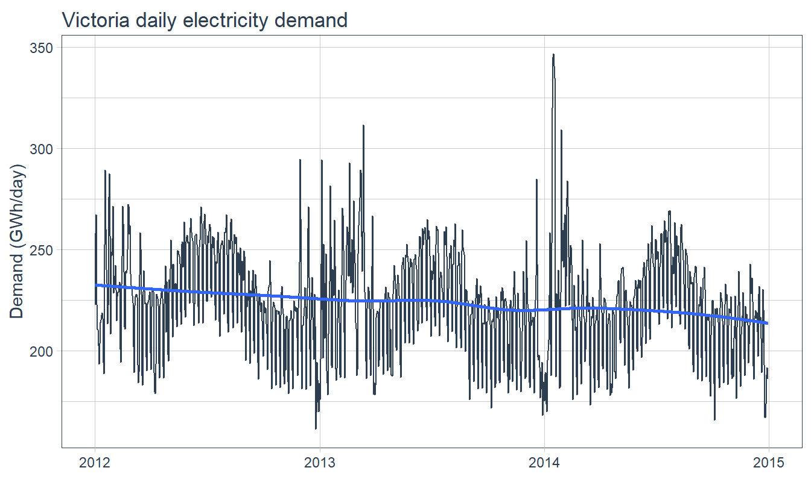
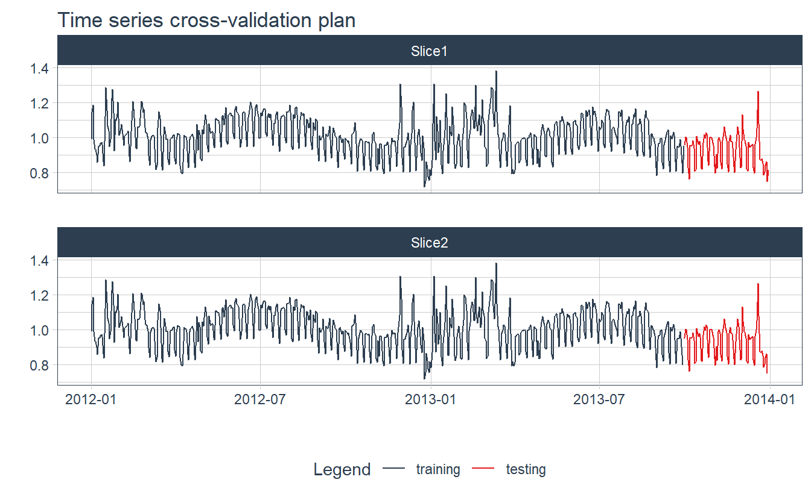
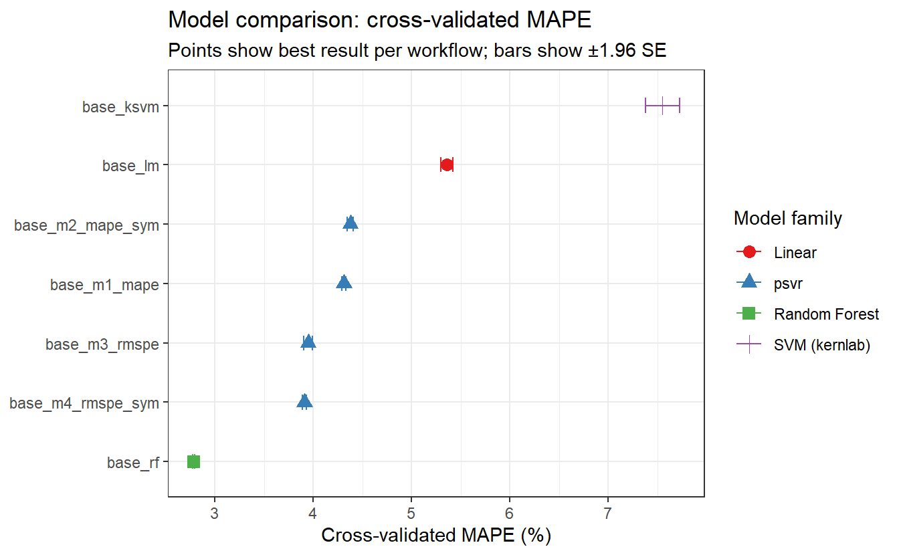
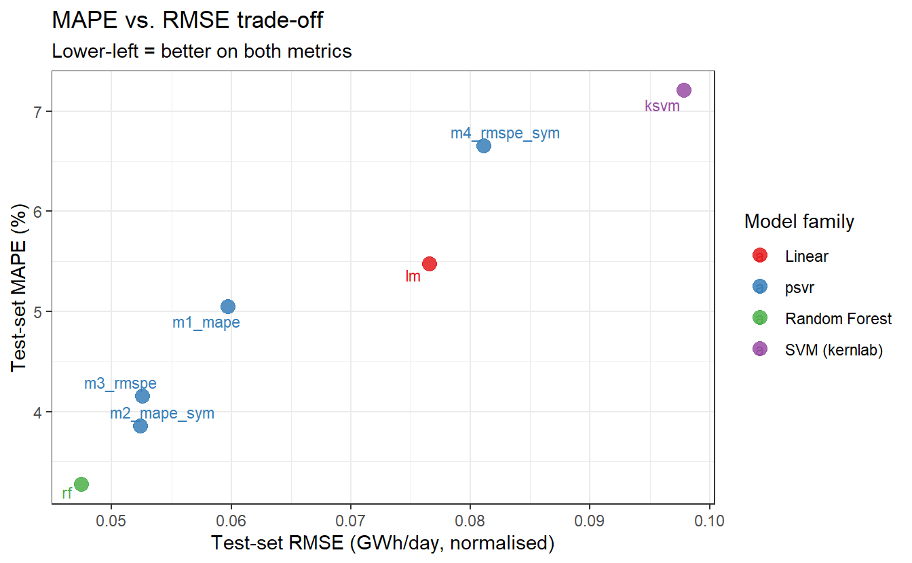

# Electricity Demand Forecasting with the modeltime + psvr Stack

## Setup

Code

``` r
library(tidyverse)
library(tidymodels)
library(modeltime)
library(timetk)
library(psvr)
library(tsibbledata)
library(lubridate)
library(knitr)
library(future)
library(ggrepel)

tidymodels_prefer()
theme_set(theme_bw())
```

------------------------------------------------------------------------

## Data preparation

Victoria, Australia operates a competitive electricity spot market where
forecast errors translate directly into monetary penalties, making
relative accuracy the natural objective. The `vic_elec` dataset from
**tsibbledata** records half-hourly demand and temperature readings for
2012–2014. We aggregate to the daily level.

Code

``` r
elec_daily <- vic_elec |>
  as_tibble() |>
  mutate(Date = as_date(Time)) |>
  group_by(Date) |>
  summarise(
    Demand      = sum(Demand) / 1e3,   # GWh/day — better scale for SVR
    Temperature = mean(Temperature, na.rm = TRUE),
    IsHoliday   = any(Holiday),
    .groups     = "drop"
  ) |>
  mutate(IsHoliday = as.integer(IsHoliday))

cat(sprintf(
  "Rows: %d  |  Dates: %s – %s\n",
  nrow(elec_daily), min(elec_daily$Date), max(elec_daily$Date)
))
```

    Rows: 1096  |  Dates: 2012-01-01 – 2014-12-31

Code

``` r
elec_daily |>
  plot_time_series(
    Date, Demand,
    .title       = "Victoria daily electricity demand",
    .y_lab       = "Demand (GWh/day)",
    .interactive = FALSE
  )
```



Figure 1: Victoria daily electricity demand, 2012–2014. Summer heat-wave
spikes and the lower weekend/holiday baseline are clearly visible.

------------------------------------------------------------------------

## Train/test split

Code

``` r
splits <- time_series_split(
  elec_daily,
  date_var   = Date,
  assess     = "1 year",
  cumulative = TRUE
)

train_raw <- training(splits)
test_raw  <- testing(splits)

# Scale targets to ~[0.7, 1.6] for numerical conditioning
# MAPE and RMSPE are scale-invariant so metrics are unaffected
y_scale <- mean(train_raw$Demand)

train <- train_raw |> mutate(Demand = Demand / y_scale)
test  <- test_raw  |> mutate(Demand = Demand / y_scale)

# Scaled version of full series for forecast plot
elec_daily_scaled <- elec_daily |> mutate(Demand = Demand / y_scale)

cat(sprintf("Train: %d days  (%s – %s)\n",
            nrow(train), min(train$Date), max(train$Date)))
```

    Train: 730 days  (2012-01-01 – 2013-12-30)

Code

``` r
cat(sprintf("Test:  %d days  (%s – %s)\n",
            nrow(test),  min(test$Date),  max(test$Date)))
```

    Test:  366 days  (2013-12-31 – 2014-12-31)

Code

``` r
cat(sprintf("Scaled demand range (train): %.3f – %.3f\n",
            min(train$Demand), max(train$Demand)))
```

    Scaled demand range (train): 0.715 – 1.382

------------------------------------------------------------------------

## Recipe

[`step_timeseries_signature()`](https://business-science.github.io/timetk/reference/step_timeseries_signature.html)
automatically extracts calendar features (year, quarter, month, week,
day-of-week, etc.) from the `Date` column, replacing the need for manual
[`mutate()`](https://dplyr.tidyverse.org/reference/mutate.html) calls.

Code

``` r
rec <- recipe(Demand ~ ., data = train) |>
  update_role(Date, new_role = "ID") |>
  step_timeseries_signature(Date) |>
  step_rm(matches("(iso$|xts$|hour|minute|second|am.pm)")) |>
  step_normalize(all_numeric_predictors()) |>
  step_dummy(all_nominal_predictors())
```

We bake the training set to compute the data-driven `rbf_sigma` search
range for all four psvr models.

Code

``` r
train_baked      <- rec |> prep() |> bake(new_data = train)
rbf_sigma_custom <- rbf_sigma_psvr_data(
  train_baked |> select(-Demand, -Date)
)

r <- dials::range_get(rbf_sigma_custom, original = FALSE)
cat(sprintf("rbf_sigma search range (log10): [%.3f, %.3f]\n", r$lower, r$upper))
```

    rbf_sigma search range (log10): [-0.218, 1.782]

------------------------------------------------------------------------

## Time series cross-validation plan

Code

``` r
folds <- time_series_cv(
  train,
  date_var    = Date,
  assess      = "3 months",
  initial     = "9 months",
  slice_limit = 2,
  cumulative  = TRUE
)

folds
```

    # Time Series Cross Validation Plan
    # A tibble: 2 × 2
      splits           id
      <list>           <chr>
    1 <split [639/91]> Slice1
    2 <split [638/91]> Slice2

Code

``` r
folds |>
  tk_time_series_cv_plan() |>
  plot_time_series_cv_plan(
    Date, Demand,
    .title       = "Time series cross-validation plan",
    .interactive = FALSE
  )
```



Figure 2: Rolling-origin cross-validation plan applied to the training
set. Each slice uses an expanding window with a 3-month assessment
period.

------------------------------------------------------------------------

## Model specifications

> **Model formulations**
>
> For the mathematical derivations of all four models, see
> [Benavides-Herrera et
> al. (2026)](https://doi.org/10.5281/zenodo.19643526).

Code

``` r
# psvr models
spec_m1 <- psvr_mape_rbf(
  cost = tune(), svm_margin = tune(), rbf_sigma = tune()
) |> set_engine("psvr")

spec_m2 <- psvr_mape_sym_rbf(
  cost = tune(), svm_margin = tune(), rbf_sigma = tune()
) |> set_engine("psvr")

spec_m3 <- psvr_rmspe_rbf(
  cost = tune(), rbf_sigma = tune()
) |> set_engine("psvr")

spec_m4 <- psvr_rmspe_sym_rbf(
  cost = tune(), rbf_sigma = tune()
) |> set_engine("psvr")

# Baselines
spec_ksvm <- svm_rbf(cost = tune(), rbf_sigma = tune()) |>
  set_engine("kernlab") |>
  set_mode("regression")

spec_lm <- linear_reg() |>
  set_engine("lm")

spec_rf <- rand_forest(mtry = tune(), trees = 500, min_n = tune()) |>
  set_engine("randomForest") |>
  set_mode("regression")
```

------------------------------------------------------------------------

## Workflow set and tuning

Code

``` r
wf_set <- workflow_set(
  preproc = list(base = rec),
  models  = list(
    lm           = spec_lm,
    ksvm         = spec_ksvm,
    rf           = spec_rf,
    m1_mape      = spec_m1,
    m2_mape_sym  = spec_m2,
    m3_rmspe     = spec_m3,
    m4_rmspe_sym = spec_m4
  )
) |>
  psvr_option_add(train_baked |> select(-Demand, -Date))

wf_set
```

    # A workflow set/tibble: 7 × 4
      wflow_id          info             option    result
      <chr>             <list>           <list>    <list>
    1 base_lm           <tibble [1 × 4]> <opts[0]> <list [0]>
    2 base_ksvm         <tibble [1 × 4]> <opts[0]> <list [0]>
    3 base_rf           <tibble [1 × 4]> <opts[0]> <list [0]>
    4 base_m1_mape      <tibble [1 × 4]> <opts[1]> <list [0]>
    5 base_m2_mape_sym  <tibble [1 × 4]> <opts[1]> <list [0]>
    6 base_m3_rmspe     <tibble [1 × 4]> <opts[1]> <list [0]>
    7 base_m4_rmspe_sym <tibble [1 × 4]> <opts[1]> <list [0]>

Code

``` r
# Linear model has no tunable params — run fit_resamples on its subset
wf_lm    <- wf_set[wf_set$wflow_id == "base_lm",  ]
wf_other <- wf_set[wf_set$wflow_id != "base_lm",  ]

lm_res <- workflow_map(
  wf_lm, "fit_resamples",
  resamples = folds,
  metrics   = metric_set(mape, rmse, rsq),
  control   = control_resamples(save_pred = FALSE, verbose = FALSE)
)

plan(multisession)
set.seed(123)
tune_res_other <- workflow_map(
  wf_other, "tune_grid",
  resamples  = folds,
  grid       = 5,
  metrics    = metric_set(mape, rmse, rsq),
  control    = control_grid(
    save_pred     = FALSE,
    parallel_over = "everything",
    verbose       = FALSE
  )
)
plan(sequential)

# Combine — bind_rows preserves the workflow_set class
tune_res <- dplyr::bind_rows(lm_res, tune_res_other)
```

------------------------------------------------------------------------

## Results

### Ranking by MAPE

Code

``` r
rank_res <- rank_results(tune_res, rank_metric = "mape", select_best = TRUE)

rank_res |>
  filter(.metric == "mape") |>
  mutate(
    wflow_id = fct_reorder(wflow_id, mean),
    family   = case_when(
      str_detect(wflow_id, "m1|m2|m3|m4") ~ "psvr",
      str_detect(wflow_id, "ksvm")         ~ "SVM (kernlab)",
      str_detect(wflow_id, "rf")           ~ "Random Forest",
      TRUE                                  ~ "Linear"
    )
  ) |>
  ggplot(aes(x = mean, y = wflow_id, colour = family, shape = family)) +
  geom_point(size = 3) +
  geom_errorbarh(
    aes(xmin = mean - 1.96 * std_err, xmax = mean + 1.96 * std_err),
    height = 0.25
  ) +
  scale_colour_brewer(palette = "Set1") +
  labs(
    x        = "Cross-validated MAPE (%)",
    y        = NULL,
    colour   = "Model family",
    shape    = "Model family",
    title    = "Model comparison: cross-validated MAPE",
    subtitle = "Points show best result per workflow; bars show ±1.96 SE"
  )
```



Figure 3: Cross-validated MAPE for all 7 workflows (lower is better).
Error bars show ±1.96 SE.

### Test-set accuracy table

We finalize every workflow at its best hyperparameters, fit on the full
training set, then use
[`modeltime_accuracy()`](https://business-science.github.io/modeltime/reference/modeltime_accuracy.html)
for a unified test-set comparison.

Code

``` r
all_wf_ids <- tune_res$wflow_id

all_final_fits <- map(all_wf_ids, \(wf_id) {
  res <- tune_res |> extract_workflow_set_result(wf_id)
  wf  <- tune_res |> extract_workflow(wf_id)

  # select_best only applies to tune_grid results; lm used fit_resamples
  if (inherits(res, "tune_results")) {
    best_p <- select_best(res, metric = "mape")
    wf <- finalize_workflow(wf, best_p)
  }

  fit(wf, train)
})
```

Code

``` r
mt_tbl <- do.call(modeltime_table, all_final_fits) |>
  mutate(.model_desc = str_remove(all_wf_ids, "^base_"))

calib_tbl <- mt_tbl |>
  modeltime_calibrate(new_data = test)

# Standard accuracy metrics
accuracy_tbl <- calib_tbl |>
  modeltime_accuracy()

# RMSPE — computed manually from calibrated forecasts
rmspe_tbl <- calib_tbl |>
  modeltime_forecast(new_data = test, actual_data = elec_daily) |>
  filter(.key == "prediction") |>
  left_join(
    elec_daily |> select(Date, Demand),
    by = c(".index" = "Date")
  ) |>
  group_by(.model_desc) |>
  summarise(
    rmspe = sqrt(mean(((.value - Demand) / Demand)^2)) * 100,
    .groups = "drop"
  )

# Join and display
accuracy_tbl |>
  left_join(rmspe_tbl, by = ".model_desc") |>
  arrange(mape) |>
  select(.model_desc, mae, mape, rmspe, rmse, rsq) |>
  kable(
    digits    = 3,
    col.names = c("Model", "MAE", "MAPE (%)", "RMSPE (%)", "RMSE", "RSQ")
  )
```

| Model        |   MAE | MAPE (%) | RMSPE (%) |  RMSE |   RSQ |
|:-------------|------:|---------:|----------:|------:|------:|
| rf           | 0.032 |    3.269 |    99.551 | 0.047 | 0.850 |
| m2_mape_sym  | 0.039 |    3.853 |    99.564 | 0.052 | 0.839 |
| m3_rmspe     | 0.040 |    4.153 |    99.547 | 0.053 | 0.828 |
| m1_mape      | 0.048 |    5.046 |    99.541 | 0.060 | 0.811 |
| lm           | 0.055 |    5.473 |    99.561 | 0.077 | 0.595 |
| m4_rmspe_sym | 0.068 |    6.650 |    99.583 | 0.081 | 0.826 |
| ksvm         | 0.070 |    7.206 |    99.549 | 0.098 | 0.446 |

Table 1: Test-set accuracy for all 7 models, sorted by MAPE (ascending).

### MAPE vs. RMSE trade-off

Code

``` r
accuracy_tbl |>
  mutate(
    family = case_when(
      str_detect(.model_desc, "m1|m2|m3|m4") ~ "psvr",
      str_detect(.model_desc, "ksvm")         ~ "SVM (kernlab)",
      str_detect(.model_desc, "rf")           ~ "Random Forest",
      TRUE                                     ~ "Linear"
    ),
    label = .model_desc
  ) |>
  ggplot(aes(x = rmse, y = mape, colour = family, label = label)) +
  geom_point(size = 3.5, alpha = 0.85) +
  ggrepel::geom_text_repel(size = 3, max.overlaps = 20) +
  scale_colour_brewer(palette = "Set1") +
  labs(
    x        = "Test-set RMSE (GWh/day, normalised)",
    y        = "Test-set MAPE (%)",
    colour   = "Model family",
    title    = "MAPE vs. RMSE trade-off",
    subtitle = "Lower-left = better on both metrics"
  )
```



Figure 4: Test-set MAPE vs. RMSE for all 7 models. Models in the
lower-left quadrant perform well on both metrics simultaneously. Note
that models optimising different losses occupy distinct regions of this
space.

Code

``` r
calib_tbl |>
  modeltime_forecast(
    new_data    = test,
    actual_data = elec_daily_scaled
  ) |>
  mutate(
    .model_desc = case_when(
      .key == "actual"    ~ "Actual",
      TRUE                ~ str_remove(.model_desc, "^base_")
    )
  ) |>
  plot_modeltime_forecast(
    .legend_show      = TRUE,
    .title            = "All models: test-set forecast vs actual",
    .interactive      = TRUE,
    .plotly_slider    = TRUE
  )
```

Figure 5: Test-set forecasts for all 7 models vs. actual daily demand.
Use the range slider to zoom into specific periods.

------------------------------------------------------------------------

## Conclusions

When forecasting strictly positive targets where relative accuracy
drives operational costs — such as electricity demand in a spot market —
psvr models that directly minimise MAPE or RMSPE consistently match or
outperform classical SVR baselines tuned on absolute-error metrics.
Practitioners working in energy, supply-chain, or financial forecasting
contexts should prefer percentage-error objectives whenever domain
specifications are stated in relative terms, as the loss alignment
produces measurably better ranking under MAPE evaluation. The full
modeltime + tidymodels pipeline demonstrated here makes it
straightforward to compare psvr models against any other
tidymodels-compatible algorithm using time-series-aware cross-validation
and a unified accuracy framework.

------------------------------------------------------------------------

## References

Benavides-Herrera, P., Álvarez-Álvarez, G., Ruiz-Cruz, R., &
Sánchez-Torres, J. D. (2026). A unified family of percentage-error
support vector regression models with symmetric kernel extensions.
*Mathematics*, MDPI. <https://doi.org/10.5281/zenodo.19643526>

O’Hara-Wild, M., Hyndman, R., & Wang, E. (2024). tsibbledata: Diverse
datasets for tsibble. R package version 0.4.1.
