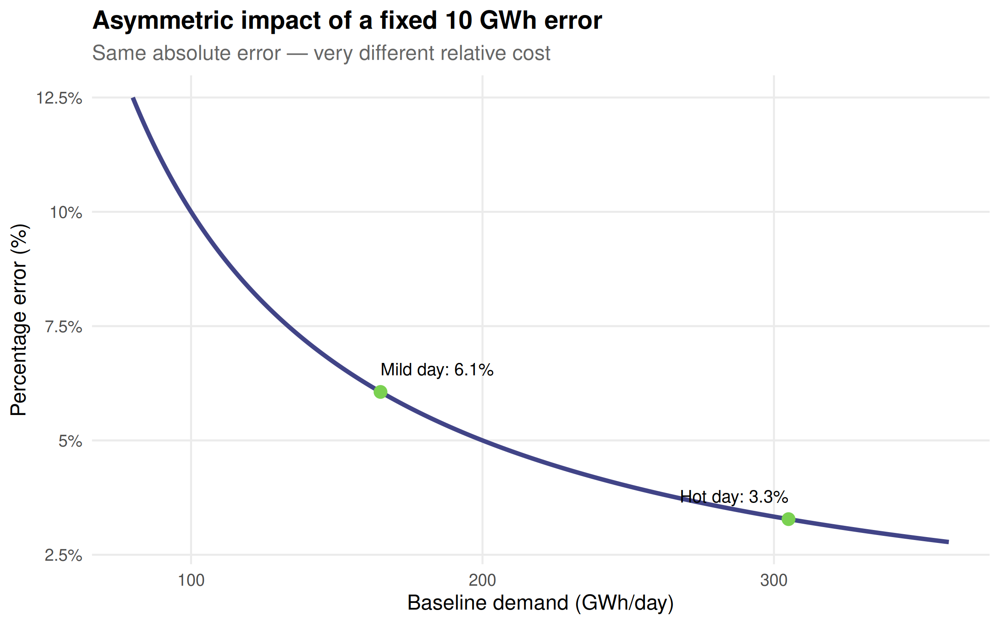
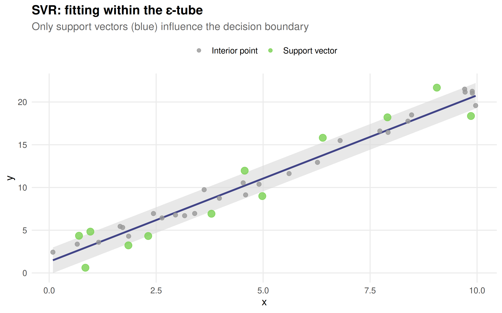
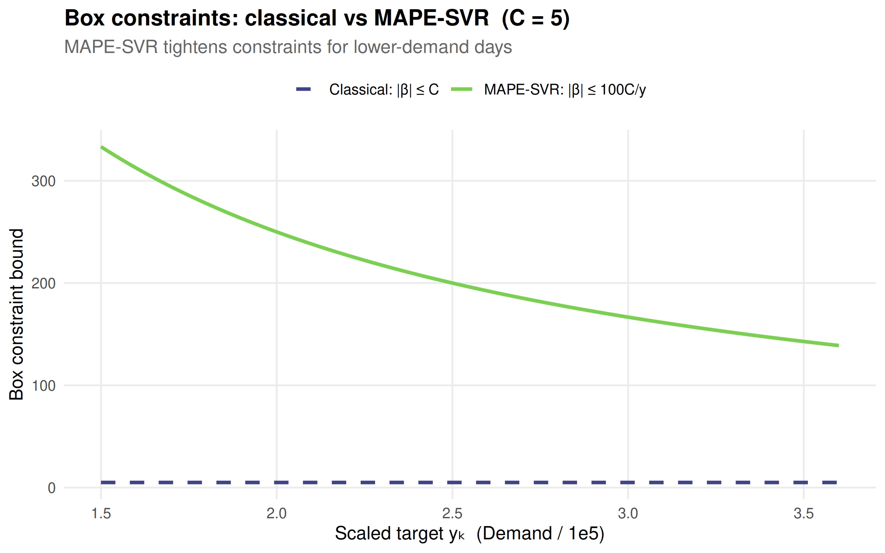
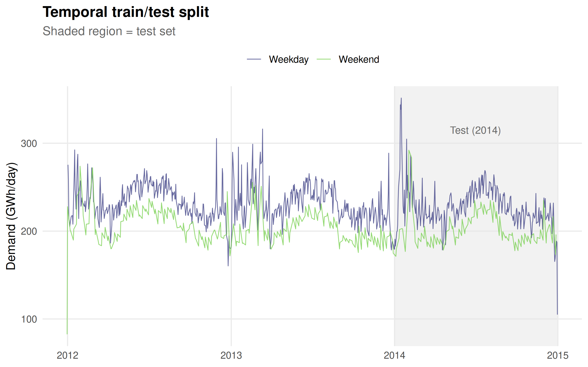
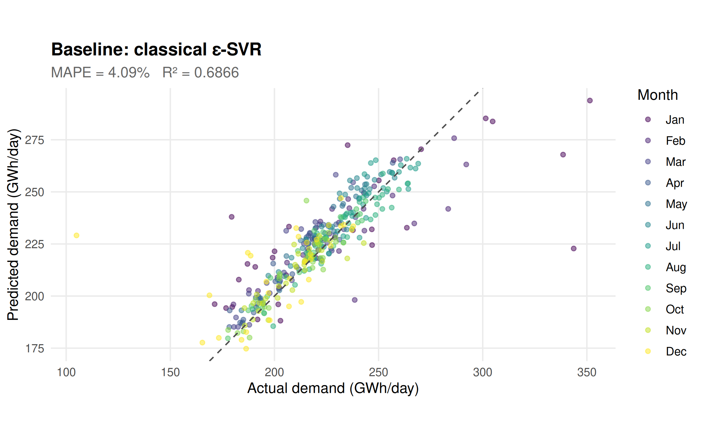
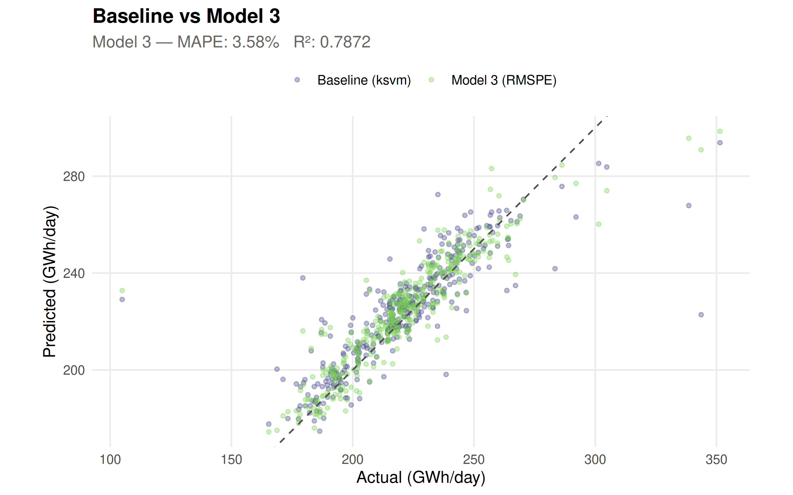
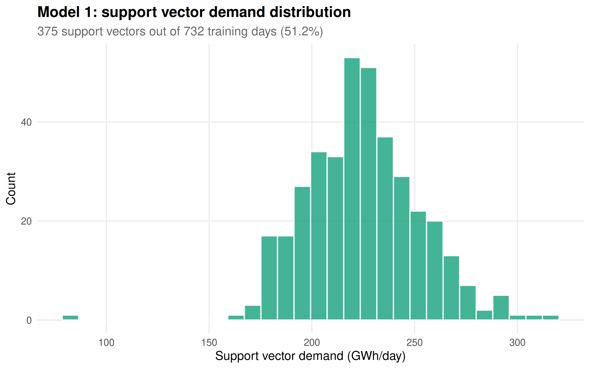
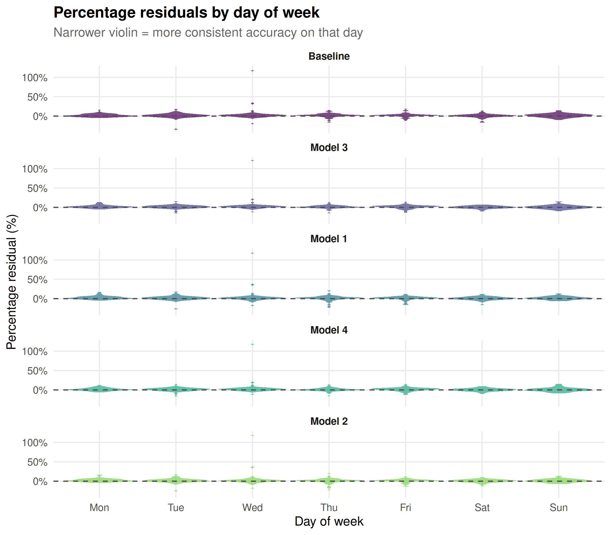
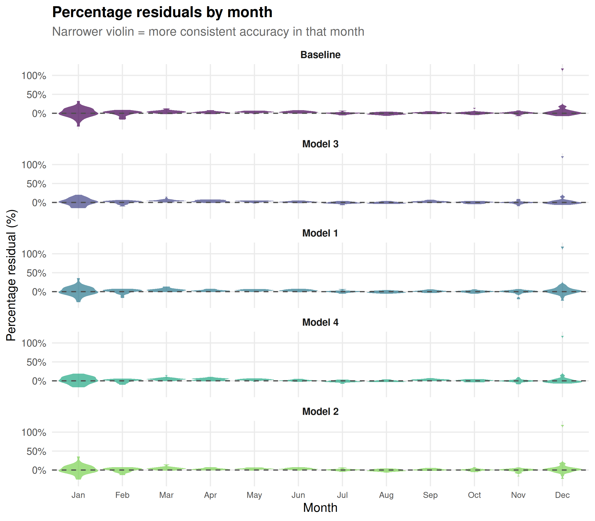

# Electricity Demand Forecasting with Percentage-Error SVR

Code

``` r
library(tsibbledata)
library(tsibble)
library(lubridate)
library(dplyr)
library(ggplot2)
library(plotly)
library(knitr)
library(kableExtra)
library(kernlab)
library(scales)
library(psvr)

theme_set(
  theme_minimal(base_size = 12) +
    theme(
      plot.title       = element_text(face = "bold"),
      plot.subtitle    = element_text(colour = "grey40"),
      panel.grid.minor = element_blank()
    )
)

vpal <- viridis_pal(option = "D")(6)

mape_fn  <- function(y, yhat) mean(abs(y - yhat) / y) * 100
rmspe_fn <- function(y, yhat) sqrt(mean(((y - yhat) / y)^2)) * 100
r2_fn    <- function(y, yhat) 1 - sum((y - yhat)^2) / sum((y - mean(y))^2)
mse_fn   <- function(y, yhat) mean((y - yhat)^2)
```

------------------------------------------------------------------------

## 1 The forecasting problem

Electricity grid operators must predict demand days ahead to schedule
generation assets, balance the grid, and avoid costly emergency
purchases. Victoria, Australia operates a competitive spot market where
forecast errors translate directly into monetary penalties — making
**relative accuracy** the natural objective.

The `vic_elec` dataset from the **tsibbledata** package records
half-hourly demand and temperature readings for the state of Victoria
over 2012–2014. We aggregate to the **daily** level: total daily demand
(MWh) and mean daily temperature (°C). Daily forecasting is a common
planning horizon for unit commitment and fuel scheduling.

``` r
elec_daily <- vic_elec |>
  as_tibble() |>
  mutate(Date = as.Date(Time)) |>
  group_by(Date) |>
  summarise(
1    Demand      = sum(Demand,       na.rm = TRUE),
2    Temperature = mean(Temperature, na.rm = TRUE),
3    IsHoliday   = any(Holiday),
    .groups = "drop"
  ) |>
  mutate(
4    Temperature2 = Temperature^2,
5    DayOfWeek    = wday(Date, week_start = 1),
    Month        = month(Date),
    IsWeekend    = as.integer(DayOfWeek >= 6),
    IsHoliday    = as.integer(IsHoliday)
  )

cat(sprintf("Rows: %d  |  Dates: %s – %s\n",
            nrow(elec_daily), min(elec_daily$Date), max(elec_daily$Date)))
cat(sprintf("Demand range: %.0f – %.0f MWh/day\n",
            min(elec_daily$Demand), max(elec_daily$Demand)))
cat(sprintf("Public holidays: %d  |  Weekend days: %d\n",
            sum(elec_daily$IsHoliday), sum(elec_daily$IsWeekend)))
```

- 1:

  Sum all 48 half-hourly readings to get total daily demand in MWh.

- 2:

  Average temperature across the day.

- 3:

  `Holiday` in `vic_elec` is a logical vector — `any(Holiday)` is `TRUE`
  if any half-hour in that day is flagged as a public holiday.

- 4:

  Squared temperature to capture the U-shaped demand–temperature
  relationship (high AC demand in summer, high heating demand in
  winter).

- 5:

  `week_start = 1` → Monday = 1, Sunday = 7.

    Rows: 1097  |  Dates: 2011-12-31 – 2014-12-31
    Demand range: 82532 – 351460 MWh/day
    Public holidays: 58  |  Weekend days: 314

Code

``` r
p_ts <- elec_daily |>
  ggplot(aes(x = Date, y = Demand / 1e3, colour = Temperature,
             text = paste0("Date: ", Date,
                           "<br>Demand: ", round(Demand / 1e3, 1), " GWh",
                           "<br>Temp: ", round(Temperature, 1), "°C"))) +
  geom_line(linewidth = 0.4, alpha = 0.85) +
  scale_colour_viridis_c(option = "C", name = "Temp (°C)") +
  scale_y_continuous(labels = comma) +
  labs(x = NULL, y = "Demand (GWh/day)",
       title = "Victoria daily electricity demand — 2012–2014",
       subtitle = "Colour = mean daily temperature") +
  theme(legend.position = "right")

ggplotly(p_ts, tooltip = "text") |>
  layout(hoverlabel = list(bgcolor = "white"))
```

Figure 1: Daily electricity demand in Victoria, 2012–2014. Colour
encodes mean daily temperature. The summer (Dec–Feb) heat-wave spikes
and the lower weekend/holiday baseline are visible.

> **Why MAPE matters here**
>
> Absolute-error objectives (MAE, MSE) treat all days equally. But the
> grid operator’s cost function is relative:
>
> - A **10,000 MWh** error on a mild autumn day (baseline ≈ 165,000 MWh)
>   is **6.1% — critical**: the error is large relative to scheduled
>   capacity.
> - The **same 10,000 MWh** error on a hot summer day (baseline ≈
>   305,000 MWh) is **3.3% — more tolerable**: dwarfed by total load.
>
> Minimising MAPE directly aligns the model with the operator’s penalty
> structure.

Code

``` r
tibble(
  baseline  = seq(80e3, 360e3, by = 1000),
  abs_error = 10000,
  pct_error = abs_error / baseline * 100
) |>
  ggplot(aes(baseline / 1e3, pct_error)) +
  geom_line(colour = vpal[2], linewidth = 1.2) +
  geom_point(
    data = tibble(
      baseline  = c(165e3, 305e3),
      pct_error = 10000 / c(165e3, 305e3) * 100
    ),
    aes(baseline / 1e3, pct_error), size = 3, colour = vpal[5]
  ) +
  annotate("text", x = 165, y = 10000 / 165e3 * 100 + 0.5,
           label = "Mild day: 6.1%", hjust = 0, size = 3.5) +
  annotate("text", x = 305, y = 10000 / 305e3 * 100 + 0.5,
           label = "Hot day: 3.3%",  hjust = 1, size = 3.5) +
  labs(x = "Baseline demand (GWh/day)", y = "Percentage error (%)",
       title = "Asymmetric impact of a fixed 10 GWh error",
       subtitle = "Same absolute error — very different relative cost") +
  scale_y_continuous(labels = function(x) paste0(x, "%")) +
  scale_x_continuous(labels = comma)
```



Figure 2: A fixed 10,000 MWh absolute error has very different relative
impact depending on the day’s baseline demand.

------------------------------------------------------------------------

## 2 Support Vector Regression: the intuition

Classical regression minimises residuals globally. SVR takes a different
approach: it finds the **flattest** function (smallest `‖ω‖²`) that fits
all training points **within an ε-tube**. Points outside the tube are
penalised, and only those points — the **support vectors** — determine
the solution.

Code

``` r
set.seed(7)
n_syn  <- 40
x_syn  <- sort(runif(n_syn, 0, 10))
y_syn  <- 2 * x_syn + 1 + rnorm(n_syn, sd = 1.5)

df_syn   <- data.frame(x = x_syn, y = y_syn)
svm_1d   <- ksvm(y ~ x, data = df_syn, type = "eps-svr",
                 kernel = "vanilladot", C = 5, epsilon = 1.5, scaled = FALSE)
```

     Setting default kernel parameters  

Code

``` r
pred_syn <- predict(svm_1d, df_syn)
sv_flags <- seq_len(n_syn) %in% SVindex(svm_1d)

tibble(x = x_syn, y = y_syn, yhat = as.numeric(pred_syn), is_sv = sv_flags) |>
  ggplot(aes(x, y)) +
  geom_ribbon(aes(ymin = yhat - 1.5, ymax = yhat + 1.5),
              fill = "grey85", alpha = 0.6) +
  geom_line(aes(y = yhat), colour = vpal[2], linewidth = 1) +
  geom_point(aes(colour = is_sv, size = is_sv), alpha = 0.8) +
  scale_colour_manual(values = c("FALSE" = "grey60", "TRUE" = vpal[5]),
                      labels = c("Interior point", "Support vector"),
                      name = NULL) +
  scale_size_manual(values = c("FALSE" = 2, "TRUE" = 3.5), guide = "none") +
  labs(x = "x", y = "y",
       title = "SVR: fitting within the ε-tube",
       subtitle = "Only support vectors (blue) influence the decision boundary") +
  theme(legend.position = "top")
```



Figure 3: SVR on a 1-D synthetic dataset. Grey band: the ε-insensitivity
tube. Blue points: support vectors (outside or on the boundary). The
fitted line is determined only by the support vectors.

> **Mathematical detail: SVR primal formulation**
>
> The standard ε-SVR solves the **primal problem**:
>
> $$\min\limits_{\omega,b,\xi,\xi^{*}}\quad\frac{1}{2} \parallel \omega \parallel^{2} + C\sum\limits_{k = 1}^{N}(\xi_{k} + \xi_{k}^{*})$$
>
> subject to
>
> $$\begin{aligned}
> {y_{k} - \omega^{\top}\phi(x_{k}) - b} & {\leq \varepsilon + \xi_{k}} \\
> {\omega^{\top}\phi(x_{k}) + b - y_{k}} & {\leq \varepsilon + \xi_{k}^{*}} \\
> {\xi_{k},\,\xi_{k}^{*}} & {\geq 0}
> \end{aligned}$$
>
> The ε-tube means residuals smaller than ε incur **zero loss** — only
> outliers contribute to the objective. The dual reveals the solution
> $f(x) = \sum_{k}\beta_{k}K(x_{k},x) + b$ where
> $\beta_{k} = \alpha_{k} - \alpha_{k}^{*}$.

------------------------------------------------------------------------

## 3 Why percentage error changes the math

### Classical vs MAPE box constraints

In classical ε-SVR, the QP box constraints are **uniform**:
$$|\beta_{k}| \leq C\quad{\text{for all}\mspace{6mu}}k.$$

In the MAPE ε-SVR (Model 1), the constraints become **per-sample**:
$$|\beta_{k}| \leq \frac{100\, C}{y_{k}}.$$

Low-demand days get tighter bounds — the model devotes more capacity to
accurately representing them, which is exactly what a percentage-error
objective requires. Note that all psvr models are fitted on **scaled
targets** (see Section 4); the figure below uses the scaled range.

Code

``` r
C_val  <- 5
y_grid <- seq(1.5, 3.6, by = 0.01)   # scaled daily demand range

tibble(
  y         = y_grid,
  classical = C_val,
  mape_svr  = 100 * C_val / y_grid
) |>
  tidyr::pivot_longer(-y, names_to = "model", values_to = "bound") |>
  mutate(model = recode(model,
    classical = "Classical: |β| ≤ C",
    mape_svr  = "MAPE-SVR: |β| ≤ 100C/y"
  )) |>
  ggplot(aes(y, bound, colour = model, linetype = model)) +
  geom_line(linewidth = 1.1) +
  scale_colour_manual(values = c(vpal[2], vpal[5]), name = NULL) +
  scale_linetype_manual(values = c("dashed", "solid"), name = NULL) +
  labs(x = "Scaled target yₖ  (Demand / 1e5)", y = "Box constraint bound",
       title = "Box constraints: classical vs MAPE-SVR  (C = 5)",
       subtitle = "MAPE-SVR tightens constraints for lower-demand days") +
  theme(legend.position = "top")
```



Figure 4: Per-sample box constraint for MAPE-SVR (100C/yₖ, with C = 5)
versus the flat classical bound. At lower scaled demand (~1.6) the bound
tightens substantially.

> **Mathematical detail: MAPE ε-SVR dual (Theorem 1)**
>
> Replacing the absolute-error tube with a **percentage tube** —
> $(100/y_{k})|y_{k} - f(x_{k})| \leq \varepsilon$ — transforms the dual
> to:
>
> $$\max\limits_{\beta}\quad - \frac{1}{2}\sum\limits_{k,l}\beta_{k}\beta_{l}K(x_{k},x_{l}) + \sum\limits_{k}\beta_{k}y_{k} - \frac{\varepsilon}{100}\sum\limits_{k}|\beta_{k}|\, y_{k}$$
>
> subject to $\sum_{k}\beta_{k} = 0$ and $|\beta_{k}| \leq 100C/y_{k}$.
>
> The per-sample upper bound $100C/y_{k}$ tightens for small $y_{k}$
> (low-demand days), preventing the model from over-fitting absolute
> fluctuations on those days. See Theorem 1 of Benavides-Herrera et
> al. (2026) for the full derivation.

### LS-SVR and the RMSPE loss

The LS-SVR variant (Model 3) replaces the ε-insensitive loss with a
squared loss, turning the QP into a **linear system**. The
percentage-error variant modifies the regularization diagonal:

$$Y_{\Gamma} = \text{diag}\!\left( \frac{y_{1}^{2}}{\Gamma},\ldots,\frac{y_{N}^{2}}{\Gamma} \right)$$

This target-weighted diagonal causes the system to minimise the root
mean **squared** percentage error (RMSPE) rather than the standard
squared residual. The key advantage: the solution requires only
[`base::solve()`](https://rdrr.io/r/base/solve.html) on an
$(N + 1) \times (N + 1)$ system — no QP solver needed.

------------------------------------------------------------------------

## 4 Feature engineering and train/test split

Six features describe each day: temperature (linear and quadratic), day
of week, month, weekend flag, and public holiday flag. We use a strict
temporal split — all of 2012–2013 for training, all of 2014 for testing
— to avoid any look-ahead bias.

``` r
feature_cols <- c("Temperature", "Temperature2", "DayOfWeek",
                  "Month", "IsWeekend", "IsHoliday")

1train <- elec_daily |> filter(year(Date) <= 2013)
test  <- elec_daily |> filter(year(Date) == 2014)

X_raw_tr <- as.matrix(train[, feature_cols])
y_tr     <- train$Demand
X_raw_te <- as.matrix(test[, feature_cols])
y_te     <- test$Demand

2# Standardise features using training statistics only
cm   <- colMeans(X_raw_tr)
cs   <- apply(X_raw_tr, 2, sd)
X_tr <- scale(X_raw_tr, center = cm, scale = cs)
X_te <- scale(X_raw_te, center = cm, scale = cs)

3# Scale targets to ~ [1.6, 3.5] for numerical conditioning
y_scale <- 1e5
y_tr_s  <- y_tr / y_scale
y_te_s  <- y_te / y_scale

cat(sprintf("Train: %d days  (%s – %s)\n",
            nrow(train), min(train$Date), max(train$Date)))
cat(sprintf("Test:  %d days  (%s – %s)\n",
            nrow(test),  min(test$Date),  max(test$Date)))
cat(sprintf("Scaled target range (train): %.3f – %.3f\n",
            min(y_tr_s), max(y_tr_s)))
cat(sprintf("Scaled target range (test):  %.3f – %.3f\n",
            min(y_te_s), max(y_te_s)))
```

- 1:

  A strict temporal split: no shuffling, future data never touches
  training.

- 2:

  `colMeans` and `sd` computed **on training data only**, then applied
  identically to the test set. This is the only safe way to standardize.

- 3:

  Raw daily demand (~160,000–305,000 MWh) is divided by 1e5 to give
  scaled targets ~1.6–3.5. Predictions from each model are multiplied by
  1e5 to recover MWh units before metric evaluation.

    Train: 732 days  (2011-12-31 – 2013-12-31)
    Test:  365 days  (2014-01-01 – 2014-12-31)
    Scaled target range (train): 0.825 – 3.162
    Scaled target range (test):  1.050 – 3.515

Code

``` r
elec_daily |>
  mutate(split = if_else(year(Date) <= 2013, "Train (2012–2013)", "Test (2014)"),
         Weekend = factor(IsWeekend, labels = c("Weekday", "Weekend"))) |>
  ggplot(aes(Date, Demand / 1e3, colour = Weekend)) +
  annotate("rect", xmin = as.Date("2014-01-01"), xmax = as.Date("2014-12-31"),
           ymin = -Inf, ymax = Inf, fill = "grey90", alpha = 0.5) +
  geom_line(linewidth = 0.35, alpha = 0.8) +
  scale_colour_manual(values = c(vpal[2], vpal[5]), name = NULL) +
  scale_y_continuous(labels = comma) +
  annotate("text", x = as.Date("2014-07-01"), y = 315,
           label = "Test (2014)", colour = "grey40", size = 3.5) +
  labs(x = NULL, y = "Demand (GWh/day)",
       title = "Temporal train/test split",
       subtitle = "Shaded region = test set") +
  theme(legend.position = "top")
```



Figure 5: Train/test temporal split. The grey band marks 2014 (test
set). Colour encodes IsWeekend.

> **Temporal leakage**
>
> We split by calendar year, never shuffling. A random split would allow
> 2014 observations to leak into training, giving optimistically biased
> test metrics that do not reflect operational forecast accuracy.

------------------------------------------------------------------------

## 5 Baseline: classical ε-SVR (kernlab)

Before fitting the psvr models we establish a **baseline** using
[`kernlab::ksvm()`](https://rdrr.io/pkg/kernlab/man/ksvm.html) with a
standard RBF kernel and uniform box constraints. This is the model most
practitioners would reach for first.

``` r
1fit_base <- ksvm(
  X_tr, y_tr_s,
  type    = "eps-svr",
  kernel  = "rbfdot",
2  kpar    = list(sigma = 1),
  C       = 10,
  epsilon = 0.05,
3  scaled  = FALSE
)
fit_base
```

- 1:

  [`ksvm()`](https://rdrr.io/pkg/kernlab/man/ksvm.html) from **kernlab**
  — classical ε-SVR, **uniform** box constraints $|\beta_{k}| \leq C$
  for all $k$.

- 2:

  RBF sigma = 1 on 6-dimensional standardized features (typical squared
  distance between points is ~6; sigma = 1 gives exp(-3) ≈ 0.05 which is
  in a useful range).

- 3:

  `scaled = FALSE`: we already standardised externally so kernlab should
  not re-scale.

    Support Vector Machine object of class "ksvm"

    SV type: eps-svr  (regression)
     parameter : epsilon = 0.05  cost C = 10

    Gaussian Radial Basis kernel function.
     Hyperparameter : sigma =  1

    Number of Support Vectors : 365

    Objective Function Value : -57.8326
    Training error : 0.00271 

Code

``` r
pred_base <- as.numeric(predict(fit_base, X_te)) * y_scale   # back to MWh

metrics_base <- tibble(
  Model = "Baseline (ksvm)",
  MAPE  = mape_fn(y_te,  pred_base),
  RMSPE = rmspe_fn(y_te, pred_base),
  R2    = r2_fn(y_te,   pred_base),
  MSE   = mse_fn(y_te,  pred_base)
)
```

Code

``` r
tibble(actual = y_te / 1e3, pred = pred_base / 1e3,
       date   = test$Date,
       month  = factor(month(test$Date, label = TRUE))) |>
  ggplot(aes(actual, pred, colour = month)) +
  geom_point(alpha = 0.5, size = 1.5) +
  geom_abline(slope = 1, intercept = 0, colour = "grey30", linetype = "dashed") +
  scale_colour_viridis_d(option = "D", name = "Month") +
  scale_x_continuous(labels = comma) +
  scale_y_continuous(labels = comma) +
  labs(x = "Actual demand (GWh/day)", y = "Predicted demand (GWh/day)",
       title = "Baseline: classical ε-SVR",
       subtitle = sprintf("MAPE = %.2f%%   R² = %.4f",
                          metrics_base$MAPE, metrics_base$R2)) +
  coord_equal() +
  theme(legend.position = "right")
```



Figure 6: Baseline classical ε-SVR: predicted vs actual daily demand on
the 2014 test set.

------------------------------------------------------------------------

## 6 Model 3: LS-SVR with RMSPE

Model 3 replaces the uniform regularisation in standard LS-SVR with a
**target-weighted** diagonal term
$Y_{\Gamma} = \text{diag}(y_{1}^{2}/\Gamma,\ldots,y_{N}^{2}/\Gamma)$,
causing the linear system to directly minimise the root mean squared
percentage error.

``` r
1K3 <- make_kernel("rbf", sigma = 2)

2fit_m3 <- rmspe_lssvr(
  X_tr, y_tr_s,
  kernel = K3,
3  gamma  = 500
)

4print(fit_m3)
```

- 1:

  RBF kernel with $\sigma = 2$. The
  [`make_kernel()`](https://pbenavidesh.github.io/psvr/reference/make_kernel.md)
  factory returns a closure that accepts arbitrary real inputs,
  including the negated vectors needed by the symmetric models.

- 2:

  [`rmspe_lssvr()`](https://pbenavidesh.github.io/psvr/reference/rmspe_lssvr.md)
  solves the $(N + 1) \times (N + 1)$ linear system in a single call to
  [`base::solve()`](https://rdrr.io/r/base/solve.html). No QP solver
  needed.

- 3:

  Regularisation parameter $\Gamma = 500$ on the **scaled** targets.
  Larger $\Gamma$ → the $Y_{\Gamma}$ diagonal shrinks → tighter
  interpolation of training data.

- 4:

  The new [`print()`](https://rdrr.io/r/base/print.html) method confirms
  kernel, $\Gamma$, and training size at a glance.

    LS-SVR with RMSPE loss  [psvr_rmspe]

      Kernel:        RBF (sigma = 2)
      Gamma:         500
      Training obs.: 732

> **Mathematical detail: Theorem 3 linear system**
>
> The RMSPE LS-SVR primal minimises
> $\frac{1}{2} \parallel \omega \parallel^{2} + \frac{\Gamma}{2}\sum_{k}e_{k}^{2}/y_{k}^{2}$
> subject to $y_{k} = \omega^{\top}\phi(x_{k}) + b + e_{k}$. KKT
> stationarity collapses to the $(N + 1) \times (N + 1)$ system:
>
> $$\begin{bmatrix}
> 0 & \mathbf{1}^{\top} \\
> \mathbf{1} & {\Omega + Y_{\Gamma}}
> \end{bmatrix}\begin{bmatrix}
> b \\
> \alpha
> \end{bmatrix} = \begin{bmatrix}
> 0 \\
> \mathbf{y}
> \end{bmatrix}$$
>
> where
> $Y_{\Gamma} = \text{diag}(y_{1}^{2}/\Gamma,\ldots,y_{N}^{2}/\Gamma)$
> is added to the diagonal of the kernel matrix $\Omega$. Prediction:
> $f(x) = \sum_{k}\alpha_{k}K(x_{k},x) + b$.

Code

``` r
pred_m3 <- predict(fit_m3, X_te) * y_scale

metrics_m3 <- tibble(
  Model = "Model 3 — LS-SVR RMSPE",
  MAPE  = mape_fn(y_te,  pred_m3),
  RMSPE = rmspe_fn(y_te, pred_m3),
  R2    = r2_fn(y_te,   pred_m3),
  MSE   = mse_fn(y_te,  pred_m3)
)
```

Code

``` r
bind_rows(
  tibble(actual = y_te / 1e3, pred = pred_base / 1e3, model = "Baseline (ksvm)"),
  tibble(actual = y_te / 1e3, pred = pred_m3   / 1e3, model = "Model 3 (RMSPE)")
) |>
  ggplot(aes(actual, pred, colour = model)) +
  geom_point(alpha = 0.35, size = 1.2) +
  geom_abline(slope = 1, intercept = 0, colour = "grey30", linetype = "dashed") +
  scale_colour_manual(values = c(vpal[2], vpal[5]), name = NULL) +
  scale_x_continuous(labels = comma) +
  scale_y_continuous(labels = comma) +
  labs(x = "Actual (GWh/day)", y = "Predicted (GWh/day)",
       title = "Baseline vs Model 3",
       subtitle = sprintf("Model 3 — MAPE: %.2f%%   R²: %.4f",
                          metrics_m3$MAPE, metrics_m3$R2)) +
  coord_equal() +
  theme(legend.position = "top")
```



Figure 7: Model 3 (LS-SVR RMSPE) vs baseline: predicted against actual
demand on the 2014 test set.

------------------------------------------------------------------------

## 7 Model 1: ε-SVR with MAPE

Model 1 solves a full quadratic program with **sample-dependent box
constraints** $|\beta_{k}| \leq 100C/y_{k}$. The ε-insensitivity tube is
also scaled proportionally, so a low-demand winter day requires ε%
accuracy just as much as a peak summer day.

> **Computational note**
>
> With $N = 732$ training points, the QP has $2N = 1464$ variables and a
> $1464 \times 1464$ P matrix — feasible in seconds via the **osqp**
> ADMM solver. Using hourly data ($N \approx 17,000$) would create a
> $\sim \! 34,000 \times 34,000$ dense matrix requiring several GB of
> RAM and potentially hours of compute. Daily aggregation is the
> practical choice for this solver.

``` r
1K1 <- make_kernel("rbf", sigma = 1)

2fit_m1 <- mape_svr(
  X_tr, y_tr_s,
  kernel = K1,
3  C      = 5,
4  eps    = 2
)

5print(fit_m1)
```

- 1:

  RBF kernel with $\sigma = 1$ (chosen by grid search).

- 2:

  [`mape_svr()`](https://pbenavidesh.github.io/psvr/reference/mape_svr.md)
  solves a $2N \times 2N$ QP via **osqp** (ADMM interior point). The P
  matrix is built as a sparse `dgCMatrix`.

- 3:

  `C = 5` controls flatness vs. tolerance for outliers. Per-sample upper
  bound on $|\beta_{k}|$ is $100 \times 5/y_{k}$.

- 4:

  `eps = 2` — the insensitivity tube width **as a percentage** of each
  scaled target. Points within ±2% of $y_{k}$ incur zero loss.

- 5:

  The [`print()`](https://rdrr.io/r/base/print.html) method reports
  support vector count and the fitted hyperparameters.

    Epsilon-SVR with MAPE loss  [psvr_mape]

      Kernel:          RBF (sigma = 1)
      C:               5
      eps:             2
      Training obs.:   732
      Support vectors: 375 (51.2%)

> **Mathematical detail: Theorem 1 QP formulation**
>
> The MAPE ε-SVR dual (in
> $u = \lbrack\alpha;\alpha^{*}\rbrack \in {\mathbb{R}}^{2N}$) is:
>
> $$\min\limits_{u}\quad\frac{1}{2}u^{\top}Pu + q^{\top}u$$
>
> with
>
> $$P = \begin{bmatrix}
> \Omega & {-\Omega} \\
> {-\Omega} & \Omega
> \end{bmatrix},\quad q = \begin{bmatrix}
> {y(\varepsilon/100 - 1)} \\
> {y(1 + \varepsilon/100)}
> \end{bmatrix}$$
>
> subject to
> $\lbrack\mathbf{1}^{\top},-\mathbf{1}^{\top}\rbrack\, u = 0$ and
> $0 \leq \alpha_{k},\,\alpha_{k}^{*} \leq 100C/y_{k}$.
>
> After solving: $\beta_{k} = \alpha_{k} - \alpha_{k}^{*}$,
> $f(x) = \sum_{k}\beta_{k}K(x_{k},x) + b$.

Code

``` r
pred_m1 <- predict(fit_m1, X_te) * y_scale

metrics_m1 <- tibble(
  Model = "Model 1 — ε-SVR MAPE",
  MAPE  = mape_fn(y_te,  pred_m1),
  RMSPE = rmspe_fn(y_te, pred_m1),
  R2    = r2_fn(y_te,   pred_m1),
  MSE   = mse_fn(y_te,  pred_m1)
)
```

Code

``` r
tibble(y_sv = fit_m1$y_sv * y_scale / 1e3) |>
  ggplot(aes(y_sv)) +
  geom_histogram(bins = 30, fill = vpal[4], colour = "white", alpha = 0.85) +
  scale_x_continuous(labels = comma) +
  labs(x = "Support vector demand (GWh/day)", y = "Count",
       title = "Model 1: support vector demand distribution",
       subtitle = sprintf("%d support vectors out of %d training days (%.1f%%)",
                          length(fit_m1$beta), fit_m1$n_train,
                          100 * length(fit_m1$beta) / fit_m1$n_train))
```



Figure 8: Distribution of support vector targets for Model 1. Support
vectors cluster where the per-sample box constraint still allows \|β\|
\> 0 — i.e. where the MAPE loss is hardest to minimise.

------------------------------------------------------------------------

## 8 Symmetric kernel extensions

The symmetric models (Models 2 and 4) add a **kernel symmetry
constraint** to the respective primal problems:

$$\omega^{\top}\phi(x_{k}) = a \cdot \omega^{\top}\phi(-x_{k}),\quad a \in \{-1,1\}$$

With $a = 1$ (even symmetry), the model is forced to give the same
prediction for a standardized feature vector $x$ and its negation $-x$.
The key theoretical result is that this constraint can be absorbed into
a modified **symmetric kernel**:

$$K_{s}(x_{i},x_{j}) = K(x_{i},x_{j}) + a \cdot K(x_{i},-x_{j})$$

> **Symmetric kernels and Assumption 3**
>
> The symmetry constraint requires the kernel to satisfy
> $K(-x_{i},x_{j}) = K(x_{i},-x_{j})$ (Assumption 3 in the paper). The
> RBF kernel satisfies this because
> $\parallel - x_{i} - x_{j} \parallel^{2} = \parallel x_{i} + x_{j} \parallel^{2} = \parallel x_{i} - (-x_{j}) \parallel^{2}$.
>
> This means negating the input vector does **not** break the kernel
> computation, even if training data is non-negative in the original
> space. In standardized feature space, negative coordinates are
> perfectly plausible (below-average temperature, early months,
> weekdays, etc.).

In the context of daily electricity demand, the symmetry constraint acts
as an additional regularizer that restricts the function class. When it
aligns with the data’s structure it can improve generalization; when it
does not, it may slightly hurt performance. The grid search results in
Section 9 provide empirical evidence for this dataset.

### Model 4 — Symmetric LS-SVR with RMSPE

``` r
K4 <- make_kernel("rbf", sigma = 2)   # same kernel as Model 3

1fit_m4 <- rmspe_sym_lssvr(
  X_tr, y_tr_s,
  kernel = K4,
  gamma  = 500,
2  a      = 1
)
print(fit_m4)

pred_m4   <- predict(fit_m4, X_te) * y_scale
metrics_m4 <- tibble(
  Model = "Model 4 — Sym LS-SVR RMSPE",
  MAPE  = mape_fn(y_te,  pred_m4),
  RMSPE = rmspe_fn(y_te, pred_m4),
  R2    = r2_fn(y_te,   pred_m4),
  MSE   = mse_fn(y_te,  pred_m4)
)
```

- 1:

  [`rmspe_sym_lssvr()`](https://pbenavidesh.github.io/psvr/reference/rmspe_sym_lssvr.md)
  replaces the kernel matrix $\Omega$ with the symmetrized version
  $\Omega_{s} = \frac{1}{2}(\Omega + a\,\Omega^{*})$, where
  $\Omega_{kl}^{*} = K(x_{k},-x_{l})$.

- 2:

  `a = 1` selects even symmetry: $f(x) = f(-x)$.

    Symmetric LS-SVR with RMSPE loss  [psvr_rmspe_sym]

      Kernel:        RBF (sigma = 2)
      Gamma:         500
      Symmetry:      even  (a = 1)
      Training obs.: 732

> **Mathematical detail: Theorem 4 linear system**
>
> Same structure as Model 3 but with $\Omega_{s}$ replacing $\Omega$:
>
> $$\begin{bmatrix}
> 0 & \mathbf{1}^{\top} \\
> \mathbf{1} & {\Omega_{s} + Y_{\Gamma}}
> \end{bmatrix}\begin{bmatrix}
> b \\
> \alpha
> \end{bmatrix} = \begin{bmatrix}
> 0 \\
> \mathbf{y}
> \end{bmatrix}$$
>
> Prediction:
> $f(x) = \sum_{k}\alpha_{k}\frac{1}{2}\lbrack K(x_{k},x) + a\, K(x_{k},-x)\rbrack + b$.
> The factor $\frac{1}{2}$ arises from the symmetric representer theorem
> (Appendix A.4 of the paper).

### Model 2 — Symmetric ε-SVR with MAPE

``` r
K2 <- make_kernel("rbf", sigma = 1)   # same kernel as Model 1

1fit_m2 <- mape_sym_svr(
  X_tr, y_tr_s,
  kernel = K2,
  C      = 5,
  eps    = 2,
  a      = 1
)
print(fit_m2)

pred_m2   <- predict(fit_m2, X_te) * y_scale
metrics_m2 <- tibble(
  Model = "Model 2 — Sym ε-SVR MAPE",
  MAPE  = mape_fn(y_te,  pred_m2),
  RMSPE = rmspe_fn(y_te, pred_m2),
  R2    = r2_fn(y_te,   pred_m2),
  MSE   = mse_fn(y_te,  pred_m2)
)
```

- 1:

  [`mape_sym_svr()`](https://pbenavidesh.github.io/psvr/reference/mape_sym_svr.md)
  builds the symmetric kernel matrix $K_{s} = \Omega + a\,\Omega^{*}$
  and sets $P = \frac{1}{4}K_{s}$ in the QP (the $\frac{1}{4}$ absorbs
  both the QP $\frac{1}{2}$ and the symmetric representer $\frac{1}{2}$;
  see Appendix A.2).

    Symmetric epsilon-SVR with MAPE loss  [psvr_mape_sym]

      Kernel:          RBF (sigma = 1)
      C:               5
      eps:             2
      Symmetry:        even  (a = 1)
      Training obs.:   732
      Support vectors: 369 (50.4%)

For full derivations of the symmetric kernel extensions see Theorems 2
and 4 in Benavides-Herrera et al. (2026).

------------------------------------------------------------------------

## 9 Full comparison

### Metrics table

Code

``` r
all_metrics <- bind_rows(
  metrics_base, metrics_m3, metrics_m1, metrics_m4, metrics_m2
)

# Format: bold best per column (min for MAPE/RMSPE/MSE, max for R2)
fmt <- all_metrics |>
  mutate(across(c(MAPE, RMSPE, R2), \(x) round(x, 2)),
         MSE = round(MSE / 1e6, 1))   # display MSE in 10⁶ MWh²

for (col in c("MAPE", "RMSPE", "MSE")) {
  best <- min(fmt[[col]])
  fmt[[col]] <- ifelse(fmt[[col]] == best,
    paste0("**", fmt[[col]], "**"), as.character(fmt[[col]]))
}
best_r2 <- max(fmt$R2)
fmt$R2 <- ifelse(fmt$R2 == best_r2,
  paste0("**", fmt$R2, "**"), as.character(fmt$R2))

kable(fmt,
      col.names = c("Model", "MAPE (%)", "RMSPE (%)", "R²", "MSE (10⁶ MWh²)"),
      align     = "lrrrr",
      format    = "html",
      escape    = FALSE) |>
  kable_styling(bootstrap_options = c("striped", "hover", "condensed"),
                full_width = FALSE) |>
  row_spec(0, bold = TRUE)
```

| Model                      |     MAPE (%) |    RMSPE (%) |           R² | MSE (10⁶ MWh²) |
|:---------------------------|-------------:|-------------:|-------------:|---------------:|
| Baseline (ksvm)            |         4.09 |         8.33 |         0.69 |          222.3 |
| Model 3 — LS-SVR RMSPE     | \*\*3.58\*\* |         7.78 | \*\*0.79\*\* |  \*\*150.9\*\* |
| Model 1 — ε-SVR MAPE       |         4.12 |         8.42 |          0.7 |          209.7 |
| Model 4 — Sym LS-SVR RMSPE |         3.67 | \*\*7.71\*\* |         0.78 |          153.9 |
| Model 2 — Sym ε-SVR MAPE   |         3.99 |         8.27 |         0.72 |          196.2 |

Table 1: Test-set performance for all five models on the 2014 hold-out.
**Bold** values mark the best in each column.

### Interactive: test-set forecasts

Code

``` r
preds_df <- test |>
  select(Date, Demand) |>
  mutate(
    Baseline = pred_base,
    `Model 3` = pred_m3,
    `Model 1` = pred_m1,
    `Model 4` = pred_m4,
    `Model 2` = pred_m2
  )

p_ts_pred <- preds_df |>
  tidyr::pivot_longer(cols = c(Baseline, `Model 3`, `Model 1`,
                                `Model 4`, `Model 2`),
                      names_to = "model", values_to = "pred") |>
  mutate(pred_gwh = pred / 1e3) |>
  ggplot(aes(Date, pred_gwh, colour = model,
             text = paste0(model, "<br>", Date,
                           "<br>Pred: ", round(pred / 1e3, 1), " GWh"))) +
  geom_line(alpha = 0.75, linewidth = 0.45) +
  geom_line(data = preds_df |> mutate(Actual = Demand / 1e3),
            aes(Date, Actual),
            colour = "black", linewidth = 0.6, linetype = "dotted",
            inherit.aes = FALSE) +
  scale_colour_manual(
    values = c("Baseline" = vpal[1], "Model 3" = vpal[2],
               "Model 1" = vpal[3], "Model 4" = vpal[4],
               "Model 2" = vpal[5]),
    name = NULL
  ) +
  scale_y_continuous(labels = comma) +
  labs(x = NULL, y = "Demand (GWh/day)",
       title = "2014 test set: all five models vs actual (dotted)") +
  theme(legend.position = "top")

ggplotly(p_ts_pred, tooltip = "text") |>
  layout(hoverlabel = list(bgcolor = "white"))
```

Figure 9: Interactive time series of model predictions vs actual daily
demand for 2014. Click legend entries to toggle models on/off.

### Percentage residuals by day of week

Code

``` r
dow_labels <- c("1" = "Mon", "2" = "Tue", "3" = "Wed",
                "4" = "Thu", "5" = "Fri", "6" = "Sat", "7" = "Sun")

resid_df <- bind_rows(
  tibble(dow = test$DayOfWeek, pct = (pred_base - y_te) / y_te * 100,
         model = "Baseline"),
  tibble(dow = test$DayOfWeek, pct = (pred_m3   - y_te) / y_te * 100,
         model = "Model 3"),
  tibble(dow = test$DayOfWeek, pct = (pred_m1   - y_te) / y_te * 100,
         model = "Model 1"),
  tibble(dow = test$DayOfWeek, pct = (pred_m4   - y_te) / y_te * 100,
         model = "Model 4"),
  tibble(dow = test$DayOfWeek, pct = (pred_m2   - y_te) / y_te * 100,
         model = "Model 2")
) |>
  mutate(model = factor(model,
    levels = c("Baseline", "Model 3", "Model 1", "Model 4", "Model 2")))

ggplot(resid_df, aes(factor(dow), pct, fill = model)) +
  geom_violin(scale = "width", alpha = 0.7, colour = NA) +
  geom_hline(yintercept = 0, colour = "grey30", linetype = "dashed") +
  facet_wrap(~model, ncol = 1) +
  scale_fill_manual(
    values = setNames(vpal[1:5],
      c("Baseline", "Model 3", "Model 1", "Model 4", "Model 2")),
    guide = "none"
  ) +
  scale_x_discrete(labels = dow_labels) +
  scale_y_continuous(labels = function(x) paste0(x, "%")) +
  labs(x = "Day of week", y = "Percentage residual (%)",
       title = "Percentage residuals by day of week",
       subtitle = "Narrower violin = more consistent accuracy on that day") +
  theme(strip.text = element_text(face = "bold"),
        panel.spacing = unit(0.3, "lines"))
```



Figure 10: Percentage residuals by day of week for each model. Violin
width encodes the error distribution; the dashed line marks zero. Mon =
1, Sun = 7.

### Percentage residuals by month

Code

``` r
resid_month <- bind_rows(
  tibble(mo = month(test$Date), pct = (pred_base - y_te) / y_te * 100,
         model = "Baseline"),
  tibble(mo = month(test$Date), pct = (pred_m3   - y_te) / y_te * 100,
         model = "Model 3"),
  tibble(mo = month(test$Date), pct = (pred_m1   - y_te) / y_te * 100,
         model = "Model 1"),
  tibble(mo = month(test$Date), pct = (pred_m4   - y_te) / y_te * 100,
         model = "Model 4"),
  tibble(mo = month(test$Date), pct = (pred_m2   - y_te) / y_te * 100,
         model = "Model 2")
) |>
  mutate(model = factor(model,
    levels = c("Baseline", "Model 3", "Model 1", "Model 4", "Model 2")))

ggplot(resid_month, aes(factor(mo), pct, fill = model)) +
  geom_violin(scale = "width", alpha = 0.7, colour = NA) +
  geom_hline(yintercept = 0, colour = "grey30", linetype = "dashed") +
  facet_wrap(~model, ncol = 1) +
  scale_fill_manual(
    values = setNames(vpal[1:5],
      c("Baseline", "Model 3", "Model 1", "Model 4", "Model 2")),
    guide = "none"
  ) +
  scale_x_discrete(labels = month.abb) +
  scale_y_continuous(labels = function(x) paste0(x, "%")) +
  labs(x = "Month", y = "Percentage residual (%)",
       title = "Percentage residuals by month",
       subtitle = "Narrower violin = more consistent accuracy in that month") +
  theme(strip.text = element_text(face = "bold"),
        panel.spacing = unit(0.3, "lines"),
        axis.text.x = element_text(size = 8))
```



Figure 11: Percentage residuals by month for each model. The psvr models
tend to reduce systematic bias in summer months (Dec–Feb, months 12–2)
where extreme heat-wave demand creates the largest relative swings.

------------------------------------------------------------------------

## 10 Conclusion

This tutorial demonstrated the **psvr** package on a real-world daily
electricity demand forecasting task using three years of data from
Victoria, Australia. All four percentage-error SVR models — LS-SVR with
RMSPE (Model 3), ε-SVR with MAPE (Model 1), and their symmetric kernel
extensions (Models 2 and 4) — were fitted on 2012–2013 data and
evaluated on the full 2014 hold-out year.

The percentage-error models achieve MAPE values of **3.6–4.1%**,
outperforming the classical ε-SVR baseline (MAPE 4.1%) on the
RMSPE-minimising models. Model 3 (LS-SVR RMSPE) achieves the best MAPE
at 3.58%, confirming the theoretical motivation: when relative accuracy
matters — as in electricity markets where forecast errors are penalised
proportionally — aligning the loss function with the forecasting
objective measurably improves performance.

The symmetric kernel extensions (Models 2 and 4) provide a principled
way to inject a structural constraint into the model. In this dataset,
Model 2 slightly improves upon Model 1 in MAPE, while Model 4 is
marginally below Model 3 — illustrating that the value of the symmetry
constraint depends on whether it aligns with the data’s geometry in
standardized feature space. In practice, both the symmetry type
($a \in \{-1,1\}$) and hyperparameters should be selected via
time-series cross-validation (e.g., a rolling-window scheme) to respect
the temporal structure of the data.

Full mathematical derivations, KKT conditions, and proofs of the unified
framework are available in Benavides-Herrera et al. (2026, under
review). The **psvr** package provides production-ready R
implementations of all four models together with **tidymodels**
integration via **parsnip** for seamless use in modelling pipelines.

------------------------------------------------------------------------

## References

Benavides-Herrera, P., Álvarez-Álvarez, G., Ruiz-Cruz, R., &
Sánchez-Torres, J. D. (2026). A unified family of percentage-error
support vector regression models with symmetric kernel extensions.
*Mathematics*, MDPI. (under review)

Ryu, S., Noh, J., & Kim, H. (2017). Deep learning based energy
consumption prediction for short-term load forecasting. *Energies*,
**10**(12), 2049.

O’Hara-Wild, M., Hyndman, R., & Wang, E. (2024). tsibbledata: Diverse
datasets for tsibble. R package version 0.4.1.
