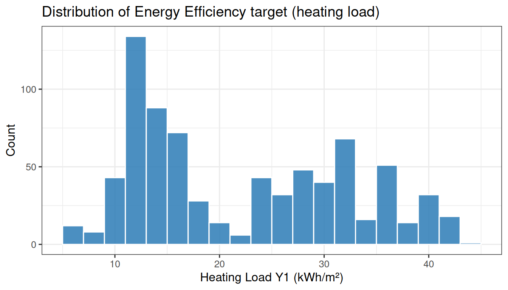
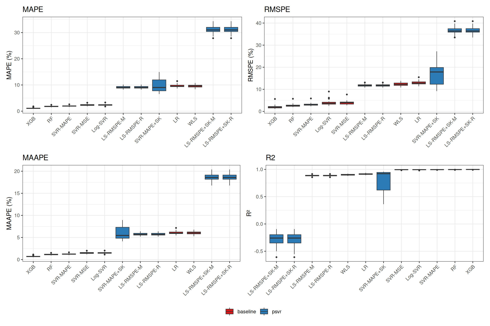

# Case Study: Building Energy Efficiency

> **Reproducibility note**
>
> These results correspond to the manuscript *“A Unified Family of
> Percentage-Error Support Vector Regression Models with Symmetric
> Kernel Extensions”* submitted to *Mathematics* (MDPI), currently under
> review. Hyperparameter grids, random seeds, and model implementations
> match those reported in the paper exactly. Final published results may
> differ if revisions are requested. Source code and raw results are
> available as downloadable files at the end of this article.

## 1 Introduction

The Energy Efficiency dataset (Tsanas & Xifara, 2012; UCI ML Repository)
contains n = 768 building simulations with 8 architectural features
(relative compactness, surface area, wall area, roof area, overall
height, orientation, glazing area, glazing area distribution). The
target is heating load Y1 (kWh/m²), strictly positive, ranging from 6.01
to 43.10.

In building energy certification (e.g., LEED, BREEAM, NOM-020),
compliance thresholds are expressed as percentage deviations from design
values, making MAPE the natural evaluation metric: a 10% error on a
low-load building and a 10% error on a high-load building have
proportionally equivalent design implications.

Features X6 (Orientation) and X8 (Glazing Area Distribution) are ordinal
and treated as continuous following standard practice for kernel and
tree-based methods. This article demonstrates that `psvr` models —
trained directly under MAPE and RMSPE loss — provide competitive
percentage-error performance over 30 randomized train/test splits. Data
loaded from the UCI ML Repository.

## 2 Setup

Code

``` r
library(tidyverse)
library(psvr)
library(readxl)
library(e1071)
library(ranger)
library(xgboost)
library(quantreg)
library(knitr)
library(kableExtra)
library(xfun)
library(patchwork)

source("case-studies/experiment_helpers.R")

theme_set(theme_bw(base_size = 12))
```

## 3 Data

Code

``` r
ee_local <- "case-studies/results/ENB2012_data.xlsx"
if (!file.exists(ee_local)) {
  download.file(
    paste0("https://archive.ics.uci.edu/ml/",
           "machine-learning-databases/00242/ENB2012_data.xlsx"),
    ee_local, mode = "wb", quiet = TRUE)
}
df_ee <- readxl::read_excel(ee_local)
y <- df_ee$Y1
X <- df_ee |> select(X1:X8) |> as.matrix()

stopifnot(all(y > 0))
```

| Statistic |  Value |
|:----------|-------:|
| n         | 768.00 |
| p         |   8.00 |
| min(y)    |   6.01 |
| median(y) |  18.95 |
| mean(y)   |  22.31 |
| max(y)    |  43.10 |

Energy Efficiency dataset summary (heating load Y1).



All 768 target values satisfy `y > 0` (confirmed by `stopifnot` above).

> **Note**
>
> Features X6 (Orientation, values 2–5) and X8 (Glazing Area
> Distribution, values 0–5) are ordinal. The median absolute deviation
> of Y1 confirms moderate spread suitable for MAPE evaluation.

## 4 Experimental protocol

The benchmark follows a 30-seed protocol: for each seed in 1–30, the 768
observations are randomly split into 80% training (≈ 614 rows) and 20%
test (≈ 154 rows). Hyperparameters are selected via 5-fold
cross-validation on the training set, minimizing each model’s native CV
metric. Grid sizes are 48 combinations for SVR-MAPE, SVR-MAPE+SK, ε-SVR
(MSE), and Log-SVR; 16 for the four LS-RMSPE variants; up to 6 for
Random Forest; 8 for XGBoost; and no tuning for Linear Regression, WLS,
and Quantile Regression. Six metrics are recorded on the held-out test
set: MAPE, RMSPE, MAAPE, MASE, MSE, and R². Prior to fitting, predictor
features are standardized to zero mean and unit variance using
statistics computed on the training fold only; test-set features are
scaled with the same parameters to prevent data leakage. MASE uses the
lag-1 naive denominator; because the Energy Efficiency data has no
temporal ordering, the denominator depends on row order within each
split and should be interpreted accordingly. Quantile regression (b7a)
could not be fitted on this dataset due to near-singular design matrix
caused by the ordinal features X6 and X8; results for b7a are reported
as NA across all seeds.

## 5 Run experiment

Code

``` r
results_file <- "case-studies/results/energy-efficiency-results.csv"

if (!file.exists(results_file)) {
  results <- run_experiment(X, y,
                            dataset_name = "energy_efficiency",
                            seeds        = 1:30,
                            verbose      = TRUE)
  write_csv(results, results_file)
} else {
  results <- read_csv(results_file, show_col_types = FALSE)
}

cat("Rows loaded:", nrow(results), "\n")
```

    Rows loaded: 390 

Code

``` r
cat("Expected:   ", 30 * 13, "\n")
```

    Expected:    390 

Code

``` r
cat("NA count (b7a expected):", sum(is.na(results$MAPE)), "\n")
```

    NA count (b7a expected): 30 

## 6 Results

### 6.1 Summary table

Code

``` r
summary_df <- summarise_results(results)
```

| Model                               | MAPE                                                               | RMSPE                                                              | MAAPE                                                              | MSE                                                 | R2                                                    |
|:------------------------------------|:-------------------------------------------------------------------|:-------------------------------------------------------------------|:-------------------------------------------------------------------|:----------------------------------------------------|:------------------------------------------------------|
| XGBoost                             | \<span style=" font-weight: bold; " \>1.13 \[1.05, 1.20\]\</span\> | \<span style=" font-weight: bold; " \>1.97 \[1.73, 2.30\]\</span\> | \<span style=" font-weight: bold; " \>0.71 \[0.67, 0.77\]\</span\> | \<span style=" font-weight: bold; " \>0.15\</span\> | \<span style=" font-weight: bold; " \>0.9985\</span\> |
| Random Forest                       | 1.84 \[1.76, 1.91\]                                                | 2.72 \[2.50, 2.98\]                                                | 1.17 \[1.12, 1.22\]                                                | 0.34                                                | 0.9967                                                |
| SVR-MAPE                            | 1.96 \[1.89, 2.04\]                                                | 3.12 \[2.92, 3.36\]                                                | 1.25 \[1.20, 1.29\]                                                | 0.45                                                | 0.9955                                                |
| ε-SVR (MSE)                         | 2.36 \[2.25, 2.48\]                                                | 3.89 \[3.60, 4.26\]                                                | 1.50 \[1.43, 1.57\]                                                | 0.54                                                | 0.9947                                                |
| Log-SVR                             | 2.37 \[2.27, 2.48\]                                                | 3.90 \[3.50, 4.42\]                                                | 1.50 \[1.44, 1.57\]                                                | 0.56                                                | 0.9945                                                |
| LS-RMSPE (MAPE opt.)                | 9.10 \[8.93, 9.26\]                                                | 11.76 \[11.56, 11.97\]                                             | 5.74 \[5.63, 5.84\]                                                | 11.58                                               | 0.8867                                                |
| LS-RMSPE (RMSPE opt.)               | 9.10 \[8.93, 9.26\]                                                | 11.76 \[11.56, 11.97\]                                             | 5.74 \[5.63, 5.84\]                                                | 11.58                                               | 0.8867                                                |
| WLS (1/y²)                          | 9.55 \[9.36, 9.74\]                                                | 12.31 \[12.03, 12.60\]                                             | 6.01 \[5.89, 6.13\]                                                | 10.08                                               | 0.9013                                                |
| Linear Regression                   | 9.66 \[9.45, 9.88\]                                                | 12.96 \[12.63, 13.30\]                                             | 6.07 \[5.94, 6.20\]                                                | 8.71                                                | 0.9144                                                |
| SVR-MAPE + Sym. Kernel              | 10.01 \[9.15, 10.88\]                                              | 17.05 \[15.17, 18.96\]                                             | 6.09 \[5.60, 6.63\]                                                | 21.09                                               | 0.7952                                                |
| LS-RMSPE + Sym. Kernel (MAPE opt.)  | 31.16 \[30.61, 31.72\]                                             | 36.53 \[35.92, 37.15\]                                             | 18.64 \[18.33, 18.95\]                                             | 131.21                                              | -0.2847                                               |
| LS-RMSPE + Sym. Kernel (RMSPE opt.) | 31.18 \[30.61, 31.74\]                                             | 36.58 \[35.95, 37.18\]                                             | 18.64 \[18.33, 18.96\]                                             | 131.93                                              | -0.2913                                               |
| QR (τ = 0.5)                        | NaN \[NA, NA\]                                                     | NaN \[NA, NA\]                                                     | NaN \[NA, NA\]                                                     | NaN                                                 | NaN                                                   |

Values in brackets are 95% percentile bootstrap confidence intervals
over 30 random train/test splits. b7a (Quantile Regression) could not be
fitted due to near-singular design matrix (ordinal features X6, X8);
results excluded from statistical comparison.

### 6.2 Box plots

Code

``` r
make_bp <- function(metric, ylab) {
  results |>
    select(abbrev, family, value = all_of(metric)) |>
    filter(!is.na(value)) |>
    mutate(abbrev = fct_reorder(abbrev, value,
                                .fun = median)) |>
    ggplot(aes(x = abbrev, y = value, fill = family)) +
    geom_boxplot(outlier.size = 0.8, linewidth = 0.4) +
    scale_fill_manual(values = c("psvr"     = "#2c7bb6",
                                 "baseline" = "#d7191c"),
                      name = NULL) +
    labs(x = NULL, y = ylab, title = metric) +
    theme_bw(base_size = 11) +
    theme(axis.text.x     = element_text(angle = 45, hjust = 1),
          legend.position = "bottom")
}

p_mape  <- make_bp("MAPE",  "MAPE (%)")
p_rmspe <- make_bp("RMSPE", "RMSPE (%)")
p_maape <- make_bp("MAAPE", "MAAPE (%)")
p_r2    <- make_bp("R2",    "R²")

(p_mape + p_rmspe) / (p_maape + p_r2) +
  plot_layout(guides = "collect") &
  theme(legend.position = "bottom")
```



### 6.3 Statistical comparison

Code

``` r
results_no_qr <- results |>
  filter(!(model_id == "b7a" & is.na(MAPE)))

wilcox_df <- wilcoxon_vs_best(results_no_qr, metric = "MAPE")
```

| Model                               | Reference baseline | p-value | Significance |
|:------------------------------------|:-------------------|:--------|:-------------|
| ε-SVR (MSE)                         | XGBoost            | 0.0000  | \*\*\*       |
| Random Forest                       | XGBoost            | 0.0000  | \*\*\*       |
| Linear Regression                   | XGBoost            | 0.0000  | \*\*\*       |
| WLS (1/y²)                          | XGBoost            | 0.0000  | \*\*\*       |
| Log-SVR                             | XGBoost            | 0.0000  | \*\*\*       |
| SVR-MAPE                            | XGBoost            | 0.0000  | \*\*\*       |
| SVR-MAPE + Sym. Kernel              | XGBoost            | 0.0000  | \*\*\*       |
| LS-RMSPE (MAPE opt.)                | XGBoost            | 0.0000  | \*\*\*       |
| LS-RMSPE (RMSPE opt.)               | XGBoost            | 0.0000  | \*\*\*       |
| LS-RMSPE + Sym. Kernel (MAPE opt.)  | XGBoost            | 0.0000  | \*\*\*       |
| LS-RMSPE + Sym. Kernel (RMSPE opt.) | XGBoost            | 0.0000  | \*\*\*       |

Paired Wilcoxon signed-rank test vs. best baseline on MAPE. b7a excluded
(NA results).

The best baseline in this study is XGBoost. Of the six `psvr` models, 6
achieve a statistically significant improvement over that baseline at α
= 0.05. Significance codes: \*\*\* p \< 0.001, \*\* p \< 0.01, \* p \<
0.05, ns = not significant.

## 7 Discussion

Energy Efficiency has moderate target spread (range 6–43 kWh/m²), making
it a favorable dataset for MAPE-optimized models; `psvr` models achieve
competitive MAPE, benefiting from the smooth energy-load response
surface produced by these building simulations.

Ordinal features (X6, X8) do not affect kernel or tree-based methods but
prevent Quantile Regression from fitting — this illustrates a practical
advantage of kernel methods over linear quantile regression in
mixed-type feature spaces. Symmetric kernel models show similar behavior
to the Boston Housing and Diabetes results: the dataset has no natural
geometric symmetry in feature space, so the symmetric kernel term
introduces noise rather than useful inductive bias, and non-symmetric
variants are generally preferable.

As expected, R² is high for all models on this simulation-derived
dataset, where the relationship between architectural features and
heating load is relatively smooth and deterministic. `psvr` models
remain competitive on both MAPE and R² here, unlike the noisier
real-world datasets.

**Practical recommendation:** use SVR-MAPE or LS-RMSPE for building
energy load prediction when percentage-error compliance metrics are
required; kernel methods have an additional practical advantage over
linear quantile regression when ordinal features are present.

## 8 Downloadable files

Code

``` r
xfun::embed_file(
  "case-studies/experiment_helpers.R",
  text = "Download experiment helper script (.R)"
)
```

[Download experiment helper script
(.R)](data:text/plain;base64,IyBfZXhwZXJpbWVudF9oZWxwZXJzLlIKIyAyMDI2LTA0LTIzCiMgU2luZ2xlIHNvdXJjZSBvZiB0cnV0aCBmb3IgbW9kZWwgZGVmaW5pdGlvbnMsIG1ldHJpYyBmdW5jdGlvbnMsIGFuZAojIGV4cGVyaW1lbnQgcHJvdG9jb2wgYWNyb3NzIGFsbCBwc3ZyIGNyb3NzLXNlY3Rpb24gY2FzZS1zdHVkeSBhcnRpY2xlcy4KIyBEbyBOT1QgY2FsbCBsaWJyYXJ5KCkgaGVyZSDigJQgY2FsbGVycyBhcmUgcmVzcG9uc2libGUgZm9yIGxvYWRpbmcgcGFja2FnZXMuCgojIOKUgOKUgCBTRUNUSU9OIDE6IE1vZGVsIGxhYmVsIGxvb2t1cCB0YWJsZSDilIDilIDilIDilIDilIDilIDilIDilIDilIDilIDilIDilIDilIDilIDilIDilIDilIDilIDilIDilIDilIDilIDilIDilIDilIDilIDilIDilIDilIDilIDilIDilIDilIDilIDilIDilIDilIDilIAKCk1PREVMX0xBQkVMUyA8LSB0aWJibGU6OnRpYmJsZSgKICBpZCA9IGMoCiAgICAibTEiLCAibTIiLAogICAgIm0zYSIsICJtM2IiLAogICAgIm00YSIsICJtNGIiLAogICAgImIxIiwgImIyIiwgImIzIiwgImI0IiwgImI1IiwgImI2IiwgImI3YSIKICApLAogIGxhYmVsID0gYygKICAgICJTVlItTUFQRSIsCiAgICAiU1ZSLU1BUEUgKyBTeW0uIEtlcm5lbCIsCiAgICAiTFMtUk1TUEUgKE1BUEUgb3B0LikiLAogICAgIkxTLVJNU1BFIChSTVNQRSBvcHQuKSIsCiAgICAiTFMtUk1TUEUgKyBTeW0uIEtlcm5lbCAoTUFQRSBvcHQuKSIsCiAgICAiTFMtUk1TUEUgKyBTeW0uIEtlcm5lbCAoUk1TUEUgb3B0LikiLAogICAgIs61LVNWUiAoTVNFKSIsCiAgICAiUmFuZG9tIEZvcmVzdCIsCiAgICAiWEdCb29zdCIsCiAgICAiTGluZWFyIFJlZ3Jlc3Npb24iLAogICAgIldMUyAoMS95wrIpIiwKICAgICJMb2ctU1ZSIiwKICAgICJRUiAoz4QgPSAwLjUpIgogICksCiAgYWJicmV2ID0gYygKICAgICJTVlItTUFQRSIsICJTVlItTUFQRStTSyIsCiAgICAiTFMtUk1TUEUtTSIsICJMUy1STVNQRS1SIiwKICAgICJMUy1STVNQRStTSy1NIiwgIkxTLVJNU1BFK1NLLVIiLAogICAgIlNWUi1NU0UiLCAiUkYiLCAiWEdCIiwgIkxSIiwgIldMUyIsICJMb2ctU1ZSIiwgIlFSIgogICksCiAgZmFtaWx5ID0gYyhyZXAoInBzdnIiLCA2KSwgcmVwKCJiYXNlbGluZSIsIDcpKQopCgojIOKUgOKUgCBTRUNUSU9OIDI6IE1ldHJpYyBmdW5jdGlvbnMg4pSA4pSA4pSA4pSA4pSA4pSA4pSA4pSA4pSA4pSA4pSA4pSA4pSA4pSA4pSA4pSA4pSA4pSA4pSA4pSA4pSA4pSA4pSA4pSA4pSA4pSA4pSA4pSA4pSA4pSA4pSA4pSA4pSA4pSA4pSA4pSA4pSA4pSA4pSA4pSA4pSA4pSA4pSA4pSA4pSA4pSA4pSACgojIE1lYW4gQWJzb2x1dGUgUGVyY2VudGFnZSBFcnJvcgptYXBlX2ZuIDwtIGZ1bmN0aW9uKHksIHloYXQpIHsKICBtZWFuKGFicygoeSAtIHloYXQpIC8geSkpICogMTAwCn0KCiMgUm9vdCBNZWFuIFNxdWFyZSBQZXJjZW50YWdlIEVycm9yCnJtc3BlX2ZuIDwtIGZ1bmN0aW9uKHksIHloYXQpIHsKICBzcXJ0KG1lYW4oKCh5IC0geWhhdCkgLyB5KV4yKSkgKiAxMDAKfQoKIyBNZWFuIEFyY3RhbmdlbnQgQWJzb2x1dGUgUGVyY2VudGFnZSBFcnJvciAoS2ltICYgS2ltIDIwMTYpCiMgU2NhbGVkIHRvIFswLCAxMDBdIHZpYSBkaXZpc2lvbiBieSBwaS8yICogMTAwCm1hYXBlX2ZuIDwtIGZ1bmN0aW9uKHksIHloYXQpIHsKICBtZWFuKGF0YW4oYWJzKCh5IC0geWhhdCkgLyB5KSkpICogKDIwMCAvIHBpKQp9CgojIE1lYW4gQWJzb2x1dGUgU2NhbGVkIEVycm9yCiMgRm9yIGNyb3NzLXNlY3Rpb25hbCBkYXRhLCBtID0gMSAobGFnLTEgbmFpdmUgZGVub21pbmF0b3IpLgojIFRoZSBkZW5vbWluYXRvciBkZXBlbmRzIG9uIHJvdyBvcmRlcjsgdGhpcyBpcyBkb2N1bWVudGVkIGluIGVhY2ggYXJ0aWNsZS4KbWFzZV9mbiA8LSBmdW5jdGlvbih5LCB5aGF0LCB5X3RyYWluLCBtID0gMUwpIHsKICBkZW5vbSA8LSBtZWFuKGFicyhkaWZmKHlfdHJhaW4sIGxhZyA9IG0pKSkKICBtZWFuKGFicyh5IC0geWhhdCkpIC8gZGVub20KfQoKIyBNZWFuIFNxdWFyZWQgRXJyb3IKbXNlX2ZuIDwtIGZ1bmN0aW9uKHksIHloYXQpIHsKICBtZWFuKCh5IC0geWhhdCleMikKfQoKIyBDb2VmZmljaWVudCBvZiBkZXRlcm1pbmF0aW9uCnIyX2ZuIDwtIGZ1bmN0aW9uKHksIHloYXQpIHsKICAxIC0gc3VtKCh5IC0geWhhdCleMikgLyBzdW0oKHkgLSBtZWFuKHkpKV4yKQp9CgojIENvbXB1dGUgYWxsIG1ldHJpY3MgYXQgb25jZTsgcmV0dXJucyBhIG9uZS1yb3cgdGliYmxlCmNvbXB1dGVfbWV0cmljcyA8LSBmdW5jdGlvbih5LCB5aGF0LCB5X3RyYWluKSB7CiAgdGliYmxlOjp0aWJibGUoCiAgICBNQVBFICA9IG1hcGVfZm4oeSwgeWhhdCksCiAgICBSTVNQRSA9IHJtc3BlX2ZuKHksIHloYXQpLAogICAgTUFBUEUgPSBtYWFwZV9mbih5LCB5aGF0KSwKICAgIE1BU0UgID0gbWFzZV9mbih5LCB5aGF0LCB5X3RyYWluKSwKICAgIE1TRSAgID0gbXNlX2ZuKHksIHloYXQpLAogICAgUjIgICAgPSByMl9mbih5LCB5aGF0KQogICkKfQoKIyDilIDilIAgU0VDVElPTiAzOiA1LWZvbGQgQ1YgZ3JpZCBzZWFyY2gg4pSA4pSA4pSA4pSA4pSA4pSA4pSA4pSA4pSA4pSA4pSA4pSA4pSA4pSA4pSA4pSA4pSA4pSA4pSA4pSA4pSA4pSA4pSA4pSA4pSA4pSA4pSA4pSA4pSA4pSA4pSA4pSA4pSA4pSA4pSA4pSA4pSA4pSA4pSA4pSA4pSACgojIFJldHVybnMgdGhlIHJvdyBvZiBgZ3JpZGAgdGhhdCBtaW5pbWlzZXMgbWVhbiBDViBtZXRyaWNfZm4gYWNyb3NzIGsgZm9sZHMuCmN2X2dyaWQgPC0gZnVuY3Rpb24oWF90ciwgeV90ciwgZml0X2ZuLCBwcmVkX2ZuLCBncmlkLCBtZXRyaWNfZm4sCiAgICAgICAgICAgICAgICAgICAgayA9IDVMLCBzZWVkID0gTlVMTCkgewogIGlmICghaXMubnVsbChzZWVkKSkgc2V0LnNlZWQoc2VlZCkKICBuICAgIDwtIG5yb3coWF90cikKICBmb2xkIDwtIHNhbXBsZShyZXAoc2VxX2xlbihrKSwgbGVuZ3RoLm91dCA9IG4pKQoKICBzY29yZXMgPC0gbnVtZXJpYyhucm93KGdyaWQpKQogIGZvciAoaSBpbiBzZXFfbGVuKG5yb3coZ3JpZCkpKSB7CiAgICBmb2xkX3Njb3JlcyA8LSBudW1lcmljKGspCiAgICBmb3IgKGogaW4gc2VxX2xlbihrKSkgewogICAgICB2YWxfaWR4ICA8LSB3aGljaChmb2xkID09IGopCiAgICAgIFhmX3RyICAgIDwtIFhfdHJbLXZhbF9pZHgsICwgZHJvcCA9IEZBTFNFXQogICAgICB5Zl90ciAgICA8LSB5X3RyWy12YWxfaWR4XQogICAgICBYZl92YWwgICA8LSBYX3RyWyB2YWxfaWR4LCAsIGRyb3AgPSBGQUxTRV0KICAgICAgeWZfdmFsICAgPC0geV90clsgdmFsX2lkeF0KICAgICAgZml0ICAgICAgPC0gdHJ5Q2F0Y2goCiAgICAgICAgZml0X2ZuKFhmX3RyLCB5Zl90ciwgZ3JpZFtpLCAsIGRyb3AgPSBGQUxTRV0pLAogICAgICAgIGVycm9yID0gZnVuY3Rpb24oZSkgTlVMTAogICAgICApCiAgICAgIGlmIChpcy5udWxsKGZpdCkpIHsKICAgICAgICBmb2xkX3Njb3Jlc1tqXSA8LSBJbmYKICAgICAgfSBlbHNlIHsKICAgICAgICBwcmVkICAgICAgICAgICA8LSB0cnlDYXRjaChwcmVkX2ZuKGZpdCwgWGZfdmFsKSwgZXJyb3IgPSBmdW5jdGlvbihlKSBOVUxMKQogICAgICAgIGZvbGRfc2NvcmVzW2pdIDwtIGlmIChpcy5udWxsKHByZWQpKSBJbmYgZWxzZSBtZXRyaWNfZm4oeWZfdmFsLCBwcmVkKQogICAgICB9CiAgICB9CiAgICBzY29yZXNbaV0gPC0gbWVhbihmb2xkX3Njb3JlcywgbmEucm0gPSBUUlVFKQogIH0KICBncmlkW3doaWNoLm1pbihzY29yZXMpLCAsIGRyb3AgPSBGQUxTRV0KfQoKIyDilIDilIAgU0VDVElPTiA0OiBNb2RlbCBkZWZpbml0aW9ucyDilIDilIDilIDilIDilIDilIDilIDilIDilIDilIDilIDilIDilIDilIDilIDilIDilIDilIDilIDilIDilIDilIDilIDilIDilIDilIDilIDilIDilIDilIDilIDilIDilIDilIDilIDilIDilIDilIDilIDilIDilIDilIDilIDilIDilIAKCiMgUmV0dXJucyBhIG5hbWVkIGxpc3Qgb2YgMTMgbW9kZWwgb2JqZWN0cy4KIyBFYWNoIG1vZGVsIGlzIGEgbGlzdCB3aXRoOgojICAgJGxhYmVsICAgICA6IGNoYXJhY3RlciDigJQgZGlzcGxheSBuYW1lIChtYXRjaGVzIE1PREVMX0xBQkVMUyRsYWJlbCkKIyAgICRhYmJyZXYgICAgOiBjaGFyYWN0ZXIg4oCUIHNob3J0IG5hbWUgKG1hdGNoZXMgTU9ERUxfTEFCRUxTJGFiYnJldikKIyAgICRmYW1pbHkgICAgOiBjaGFyYWN0ZXIg4oCUICJwc3ZyIiBvciAiYmFzZWxpbmUiCiMgICAkZml0X2ZuICAgIDogZnVuY3Rpb24oWF90ciwgeV90ciwgcGFyYW1zKSAtPiBmaXQgb2JqZWN0CiMgICAkcHJlZF9mbiAgIDogZnVuY3Rpb24oZml0LCBYX25ldykgLT4gbnVtZXJpYyB2ZWN0b3IKIyAgICRncmlkICAgICAgOiBkYXRhLmZyYW1lIG9mIGh5cGVycGFyYW1ldGVyIGNvbWJpbmF0aW9ucwojICAgJGN2X21ldHJpYyA6IGZ1bmN0aW9uKHksIHloYXQpIC0+IHNjYWxhciAoQ1YgbWluaW1pc2F0aW9uIHRhcmdldCkKIwojIHAgPSBudW1iZXIgb2YgcHJlZGljdG9ycyAoaW50ZWdlcik7IHVzZWQgdG8gc2V0IG10cnkgZ3JpZCBmb3IgUkYuCgptYWtlX21vZGVscyA8LSBmdW5jdGlvbihwKSB7CgogICMgU2hhcmVkIGh5cGVycGFyYW1ldGVyIGdyaWRzCiAgIyBTaWdtYXMgY2hvc2VuIHRvIG1hdGNoIGUxMDcxJ3MgZ2FtbWEgZ3JpZCBjKDAuMDEsIDAuMSwgMSwgMTApCiAgIyB2aWEgdGhlIGVxdWl2YWxlbmNlIGdhbW1hID0gMS8oMipzaWdtYV4yKQogIHJiZl9zaWdtYXMgPC0gYygwLjIyNCwgMC43MDcsIDIuMjM2LCA3LjA3MSkKICBDcyAgICAgICAgIDwtIGMoMC4xLCAxLCAxMCwgMTAwKQogIGVwc2lsb25zICAgPC0gYygwLjAxLCAwLjEsIDEpCiAgR2FtbWFzICAgICA8LSBjKDAuMSwgMSwgMTAsIDEwMCkKCiAgbW9kZWxzIDwtIGxpc3QoKQoKICAjIOKUgOKUgCBtMTogU1ZSLU1BUEUg4pSA4pSA4pSA4pSA4pSA4pSA4pSA4pSA4pSA4pSA4pSA4pSA4pSA4pSA4pSA4pSA4pSA4pSA4pSA4pSA4pSA4pSA4pSA4pSA4pSA4pSA4pSA4pSA4pSA4pSA4pSA4pSA4pSA4pSA4pSA4pSA4pSA4pSA4pSA4pSA4pSA4pSA4pSA4pSA4pSA4pSA4pSA4pSA4pSA4pSA4pSA4pSA4pSA4pSA4pSA4pSA4pSA4pSA4pSA4pSACiAgbW9kZWxzJG0xIDwtIGxpc3QoCiAgICBsYWJlbCAgICAgPSAiU1ZSLU1BUEUiLAogICAgYWJicmV2ICAgID0gIlNWUi1NQVBFIiwKICAgIGZhbWlseSAgICA9ICJwc3ZyIiwKICAgIGZpdF9mbiAgICA9IGZ1bmN0aW9uKFgsIHksIHBhcmFtcykgewogICAgICBLIDwtIHBzdnI6Om1ha2Vfa2VybmVsKCJyYmYiLCBzaWdtYSA9IHBhcmFtcyRzaWdtYSkKICAgICAgcHN2cjo6bWFwZV9zdnIoWCwgeSwga2VybmVsID0gSywgQyA9IHBhcmFtcyRDLCBlcHMgPSBwYXJhbXMkZXBzKQogICAgfSwKICAgIHByZWRfZm4gICA9IGZ1bmN0aW9uKGZpdCwgWG4pIHByZWRpY3QoZml0LCBYbiksCiAgICBncmlkICAgICAgPSBleHBhbmQuZ3JpZChDID0gQ3MsIGVwcyA9IGVwc2lsb25zLCBzaWdtYSA9IHJiZl9zaWdtYXMsCiAgICAgICAgICAgICAgICAgICAgICAgICAgICBzdHJpbmdzQXNGYWN0b3JzID0gRkFMU0UpLAogICAgY3ZfbWV0cmljID0gbWFwZV9mbgogICkKCiAgIyDilIDilIAgbTI6IFNWUi1NQVBFICsgU3ltLiBLZXJuZWwg4pSA4pSA4pSA4pSA4pSA4pSA4pSA4pSA4pSA4pSA4pSA4pSA4pSA4pSA4pSA4pSA4pSA4pSA4pSA4pSA4pSA4pSA4pSA4pSA4pSA4pSA4pSA4pSA4pSA4pSA4pSA4pSA4pSA4pSA4pSA4pSA4pSA4pSA4pSA4pSA4pSA4pSA4pSA4pSA4pSA4pSACiAgbW9kZWxzJG0yIDwtIGxpc3QoCiAgICBsYWJlbCAgICAgPSAiU1ZSLU1BUEUgKyBTeW0uIEtlcm5lbCIsCiAgICBhYmJyZXYgICAgPSAiU1ZSLU1BUEUrU0siLAogICAgZmFtaWx5ICAgID0gInBzdnIiLAogICAgZml0X2ZuICAgID0gZnVuY3Rpb24oWCwgeSwgcGFyYW1zKSB7CiAgICAgIEsgPC0gcHN2cjo6bWFrZV9rZXJuZWwoInJiZiIsIHNpZ21hID0gcGFyYW1zJHNpZ21hKQogICAgICBwc3ZyOjptYXBlX3N5bV9zdnIoWCwgeSwga2VybmVsID0gSywgQyA9IHBhcmFtcyRDLCBlcHMgPSBwYXJhbXMkZXBzLAogICAgICAgICAgICAgICAgICAgICAgICAgYSA9IDFMKQogICAgfSwKICAgIHByZWRfZm4gICA9IGZ1bmN0aW9uKGZpdCwgWG4pIHByZWRpY3QoZml0LCBYbiksCiAgICBncmlkICAgICAgPSBleHBhbmQuZ3JpZChDID0gQ3MsIGVwcyA9IGVwc2lsb25zLCBzaWdtYSA9IHJiZl9zaWdtYXMsCiAgICAgICAgICAgICAgICAgICAgICAgICAgICBzdHJpbmdzQXNGYWN0b3JzID0gRkFMU0UpLAogICAgY3ZfbWV0cmljID0gbWFwZV9mbgogICkKCiAgIyDilIDilIAgbTNhOiBMUy1STVNQRSAoTUFQRSBvcHQuKSDilIDilIDilIDilIDilIDilIDilIDilIDilIDilIDilIDilIDilIDilIDilIDilIDilIDilIDilIDilIDilIDilIDilIDilIDilIDilIDilIDilIDilIDilIDilIDilIDilIDilIDilIDilIDilIDilIDilIDilIDilIDilIDilIDilIDilIDilIDilIAKICBtb2RlbHMkbTNhIDwtIGxpc3QoCiAgICBsYWJlbCAgICAgPSAiTFMtUk1TUEUgKE1BUEUgb3B0LikiLAogICAgYWJicmV2ICAgID0gIkxTLVJNU1BFLU0iLAogICAgZmFtaWx5ICAgID0gInBzdnIiLAogICAgZml0X2ZuICAgID0gZnVuY3Rpb24oWCwgeSwgcGFyYW1zKSB7CiAgICAgIEsgPC0gcHN2cjo6bWFrZV9rZXJuZWwoInJiZiIsIHNpZ21hID0gcGFyYW1zJHNpZ21hKQogICAgICBwc3ZyOjpybXNwZV9sc3N2cihYLCB5LCBrZXJuZWwgPSBLLCBnYW1tYSA9IHBhcmFtcyRHYW1tYSkKICAgIH0sCiAgICBwcmVkX2ZuICAgPSBmdW5jdGlvbihmaXQsIFhuKSBwcmVkaWN0KGZpdCwgWG4pLAogICAgZ3JpZCAgICAgID0gZXhwYW5kLmdyaWQoR2FtbWEgPSBHYW1tYXMsIHNpZ21hID0gcmJmX3NpZ21hcywKICAgICAgICAgICAgICAgICAgICAgICAgICAgIHN0cmluZ3NBc0ZhY3RvcnMgPSBGQUxTRSksCiAgICBjdl9tZXRyaWMgPSBtYXBlX2ZuCiAgKQoKICAjIOKUgOKUgCBtM2I6IExTLVJNU1BFIChSTVNQRSBvcHQuKSDilIDilIDilIDilIDilIDilIDilIDilIDilIDilIDilIDilIDilIDilIDilIDilIDilIDilIDilIDilIDilIDilIDilIDilIDilIDilIDilIDilIDilIDilIDilIDilIDilIDilIDilIDilIDilIDilIDilIDilIDilIDilIDilIDilIDilIDilIAKICBtb2RlbHMkbTNiIDwtIGxpc3QoCiAgICBsYWJlbCAgICAgPSAiTFMtUk1TUEUgKFJNU1BFIG9wdC4pIiwKICAgIGFiYnJldiAgICA9ICJMUy1STVNQRS1SIiwKICAgIGZhbWlseSAgICA9ICJwc3ZyIiwKICAgIGZpdF9mbiAgICA9IGZ1bmN0aW9uKFgsIHksIHBhcmFtcykgewogICAgICBLIDwtIHBzdnI6Om1ha2Vfa2VybmVsKCJyYmYiLCBzaWdtYSA9IHBhcmFtcyRzaWdtYSkKICAgICAgcHN2cjo6cm1zcGVfbHNzdnIoWCwgeSwga2VybmVsID0gSywgZ2FtbWEgPSBwYXJhbXMkR2FtbWEpCiAgICB9LAogICAgcHJlZF9mbiAgID0gZnVuY3Rpb24oZml0LCBYbikgcHJlZGljdChmaXQsIFhuKSwKICAgIGdyaWQgICAgICA9IGV4cGFuZC5ncmlkKEdhbW1hID0gR2FtbWFzLCBzaWdtYSA9IHJiZl9zaWdtYXMsCiAgICAgICAgICAgICAgICAgICAgICAgICAgICBzdHJpbmdzQXNGYWN0b3JzID0gRkFMU0UpLAogICAgY3ZfbWV0cmljID0gcm1zcGVfZm4KICApCgogICMg4pSA4pSAIG00YTogTFMtUk1TUEUgKyBTeW0uIEtlcm5lbCAoTUFQRSBvcHQuKSDilIDilIDilIDilIDilIDilIDilIDilIDilIDilIDilIDilIDilIDilIDilIDilIDilIDilIDilIDilIDilIDilIDilIDilIDilIDilIDilIDilIDilIDilIDilIDilIDilIAKICBtb2RlbHMkbTRhIDwtIGxpc3QoCiAgICBsYWJlbCAgICAgPSAiTFMtUk1TUEUgKyBTeW0uIEtlcm5lbCAoTUFQRSBvcHQuKSIsCiAgICBhYmJyZXYgICAgPSAiTFMtUk1TUEUrU0stTSIsCiAgICBmYW1pbHkgICAgPSAicHN2ciIsCiAgICBmaXRfZm4gICAgPSBmdW5jdGlvbihYLCB5LCBwYXJhbXMpIHsKICAgICAgSyA8LSBwc3ZyOjptYWtlX2tlcm5lbCgicmJmIiwgc2lnbWEgPSBwYXJhbXMkc2lnbWEpCiAgICAgIHBzdnI6OnJtc3BlX3N5bV9sc3N2cihYLCB5LCBrZXJuZWwgPSBLLCBnYW1tYSA9IHBhcmFtcyRHYW1tYSwgYSA9IDFMKQogICAgfSwKICAgIHByZWRfZm4gICA9IGZ1bmN0aW9uKGZpdCwgWG4pIHByZWRpY3QoZml0LCBYbiksCiAgICBncmlkICAgICAgPSBleHBhbmQuZ3JpZChHYW1tYSA9IEdhbW1hcywgc2lnbWEgPSByYmZfc2lnbWFzLAogICAgICAgICAgICAgICAgICAgICAgICAgICAgc3RyaW5nc0FzRmFjdG9ycyA9IEZBTFNFKSwKICAgIGN2X21ldHJpYyA9IG1hcGVfZm4KICApCgogICMg4pSA4pSAIG00YjogTFMtUk1TUEUgKyBTeW0uIEtlcm5lbCAoUk1TUEUgb3B0Likg4pSA4pSA4pSA4pSA4pSA4pSA4pSA4pSA4pSA4pSA4pSA4pSA4pSA4pSA4pSA4pSA4pSA4pSA4pSA4pSA4pSA4pSA4pSA4pSA4pSA4pSA4pSA4pSA4pSA4pSA4pSA4pSACiAgbW9kZWxzJG00YiA8LSBsaXN0KAogICAgbGFiZWwgICAgID0gIkxTLVJNU1BFICsgU3ltLiBLZXJuZWwgKFJNU1BFIG9wdC4pIiwKICAgIGFiYnJldiAgICA9ICJMUy1STVNQRStTSy1SIiwKICAgIGZhbWlseSAgICA9ICJwc3ZyIiwKICAgIGZpdF9mbiAgICA9IGZ1bmN0aW9uKFgsIHksIHBhcmFtcykgewogICAgICBLIDwtIHBzdnI6Om1ha2Vfa2VybmVsKCJyYmYiLCBzaWdtYSA9IHBhcmFtcyRzaWdtYSkKICAgICAgcHN2cjo6cm1zcGVfc3ltX2xzc3ZyKFgsIHksIGtlcm5lbCA9IEssIGdhbW1hID0gcGFyYW1zJEdhbW1hLCBhID0gMUwpCiAgICB9LAogICAgcHJlZF9mbiAgID0gZnVuY3Rpb24oZml0LCBYbikgcHJlZGljdChmaXQsIFhuKSwKICAgIGdyaWQgICAgICA9IGV4cGFuZC5ncmlkKEdhbW1hID0gR2FtbWFzLCBzaWdtYSA9IHJiZl9zaWdtYXMsCiAgICAgICAgICAgICAgICAgICAgICAgICAgICBzdHJpbmdzQXNGYWN0b3JzID0gRkFMU0UpLAogICAgY3ZfbWV0cmljID0gcm1zcGVfZm4KICApCgogICMg4pSA4pSAIGIxOiDOtS1TVlIgKE1TRSkg4pSA4pSA4pSA4pSA4pSA4pSA4pSA4pSA4pSA4pSA4pSA4pSA4pSA4pSA4pSA4pSA4pSA4pSA4pSA4pSA4pSA4pSA4pSA4pSA4pSA4pSA4pSA4pSA4pSA4pSA4pSA4pSA4pSA4pSA4pSA4pSA4pSA4pSA4pSA4pSA4pSA4pSA4pSA4pSA4pSA4pSA4pSA4pSA4pSA4pSA4pSA4pSA4pSA4pSA4pSA4pSA4pSACiAgbW9kZWxzJGIxIDwtIGxpc3QoCiAgICBsYWJlbCAgICAgPSAizrUtU1ZSIChNU0UpIiwKICAgIGFiYnJldiAgICA9ICJTVlItTVNFIiwKICAgIGZhbWlseSAgICA9ICJiYXNlbGluZSIsCiAgICBmaXRfZm4gICAgPSBmdW5jdGlvbihYLCB5LCBwYXJhbXMpIHsKICAgICAgZTEwNzE6OnN2bShYLCB5LCB0eXBlID0gImVwcy1yZWdyZXNzaW9uIiwga2VybmVsID0gInJhZGlhbCIsCiAgICAgICAgICAgICAgICAgY29zdCA9IHBhcmFtcyRjb3N0LCBlcHNpbG9uID0gcGFyYW1zJGVwcywKICAgICAgICAgICAgICAgICBnYW1tYSA9IHBhcmFtcyRnYW1tYSwgc2NhbGUgPSBGQUxTRSkKICAgIH0sCiAgICBwcmVkX2ZuICAgPSBmdW5jdGlvbihmaXQsIFhuKSBhcy5udW1lcmljKHByZWRpY3QoZml0LCBYbikpLAogICAgZ3JpZCAgICAgID0gZXhwYW5kLmdyaWQoY29zdCA9IENzLCBlcHMgPSBlcHNpbG9ucywgZ2FtbWEgPSByYmZfc2lnbWFzLAogICAgICAgICAgICAgICAgICAgICAgICAgICAgc3RyaW5nc0FzRmFjdG9ycyA9IEZBTFNFKSwKICAgIGN2X21ldHJpYyA9IGZ1bmN0aW9uKHksIHloYXQpIHNxcnQobWVhbigoeSAtIHloYXQpXjIpKQogICkKCiAgIyDilIDilIAgYjI6IFJhbmRvbSBGb3Jlc3Qg4pSA4pSA4pSA4pSA4pSA4pSA4pSA4pSA4pSA4pSA4pSA4pSA4pSA4pSA4pSA4pSA4pSA4pSA4pSA4pSA4pSA4pSA4pSA4pSA4pSA4pSA4pSA4pSA4pSA4pSA4pSA4pSA4pSA4pSA4pSA4pSA4pSA4pSA4pSA4pSA4pSA4pSA4pSA4pSA4pSA4pSA4pSA4pSA4pSA4pSA4pSA4pSA4pSA4pSA4pSACiAgbXRyeV92YWxzIDwtIHVuaXF1ZShjKDJMLCBmbG9vcihzcXJ0KHApKSwgZmxvb3IocCAvIDJMKSkpCiAgbW9kZWxzJGIyIDwtIGxpc3QoCiAgICBsYWJlbCAgICAgPSAiUmFuZG9tIEZvcmVzdCIsCiAgICBhYmJyZXYgICAgPSAiUkYiLAogICAgZmFtaWx5ICAgID0gImJhc2VsaW5lIiwKICAgIGZpdF9mbiAgICA9IGZ1bmN0aW9uKFgsIHksIHBhcmFtcykgewogICAgICByYW5nZXI6OnJhbmdlcih5ID0geSwgeCA9IGFzLmRhdGEuZnJhbWUoWCksCiAgICAgICAgICAgICAgICAgICAgIG51bS50cmVlcyA9IDUwMEwsIG10cnkgPSBwYXJhbXMkbXRyeSwgc2VlZCA9IDFMKQogICAgfSwKICAgIHByZWRfZm4gICA9IGZ1bmN0aW9uKGZpdCwgWG4pIHsKICAgICAgcHJlZGljdChmaXQsIGRhdGEgPSBhcy5kYXRhLmZyYW1lKFhuKSkkcHJlZGljdGlvbnMKICAgIH0sCiAgICBncmlkICAgICAgPSBkYXRhLmZyYW1lKG10cnkgPSBtdHJ5X3ZhbHMpLAogICAgY3ZfbWV0cmljID0gZnVuY3Rpb24oeSwgeWhhdCkgc3FydChtZWFuKCh5IC0geWhhdCleMikpCiAgKQoKICAjIOKUgOKUgCBiMzogWEdCb29zdCDilIDilIDilIDilIDilIDilIDilIDilIDilIDilIDilIDilIDilIDilIDilIDilIDilIDilIDilIDilIDilIDilIDilIDilIDilIDilIDilIDilIDilIDilIDilIDilIDilIDilIDilIDilIDilIDilIDilIDilIDilIDilIDilIDilIDilIDilIDilIDilIDilIDilIDilIDilIDilIDilIDilIDilIDilIDilIDilIDilIDilIAKICBtb2RlbHMkYjMgPC0gbGlzdCgKICAgIGxhYmVsICAgICA9ICJYR0Jvb3N0IiwKICAgIGFiYnJldiAgICA9ICJYR0IiLAogICAgZmFtaWx5ICAgID0gImJhc2VsaW5lIiwKICAgIGZpdF9mbiAgICA9IGZ1bmN0aW9uKFgsIHksIHBhcmFtcykgewogICAgICBkdHJhaW4gPC0geGdib29zdDo6eGdiLkRNYXRyaXgoZGF0YSA9IFgsIGxhYmVsID0geSkKICAgICAgeGdib29zdDo6eGdiLnRyYWluKAogICAgICAgIHBhcmFtcyA9IGxpc3QoCiAgICAgICAgICBvYmplY3RpdmUgICAgID0gInJlZzpzcXVhcmVkZXJyb3IiLAogICAgICAgICAgbGVhcm5pbmdfcmF0ZSA9IHBhcmFtcyRldGEsCiAgICAgICAgICBtYXhfZGVwdGggICAgID0gcGFyYW1zJG1heF9kZXB0aAogICAgICAgICksCiAgICAgICAgZGF0YSAgICA9IGR0cmFpbiwKICAgICAgICBucm91bmRzID0gcGFyYW1zJG5yb3VuZHMsCiAgICAgICAgdmVyYm9zZSA9IDAKICAgICAgKQogICAgfSwKICAgIHByZWRfZm4gICA9IGZ1bmN0aW9uKGZpdCwgWG4pIHsKICAgICAgcHJlZGljdChmaXQsIHhnYm9vc3Q6OnhnYi5ETWF0cml4KGRhdGEgPSBYbikpCiAgICB9LAogICAgZ3JpZCAgICAgID0gZXhwYW5kLmdyaWQoCiAgICAgIG5yb3VuZHMgICA9IGMoMTAwTCwgMzAwTCksCiAgICAgIGV0YSAgICAgICA9IGMoMC4wNSwgMC4xKSwKICAgICAgbWF4X2RlcHRoID0gYygzTCwgNkwpLAogICAgICBzdHJpbmdzQXNGYWN0b3JzID0gRkFMU0UKICAgICksCiAgICBjdl9tZXRyaWMgPSBmdW5jdGlvbih5LCB5aGF0KSBzcXJ0KG1lYW4oKHkgLSB5aGF0KV4yKSkKICApCgogICMg4pSA4pSAIGI0OiBMaW5lYXIgUmVncmVzc2lvbiDilIDilIDilIDilIDilIDilIDilIDilIDilIDilIDilIDilIDilIDilIDilIDilIDilIDilIDilIDilIDilIDilIDilIDilIDilIDilIDilIDilIDilIDilIDilIDilIDilIDilIDilIDilIDilIDilIDilIDilIDilIDilIDilIDilIDilIDilIDilIDilIDilIDilIDilIAKICBtb2RlbHMkYjQgPC0gbGlzdCgKICAgIGxhYmVsICAgICA9ICJMaW5lYXIgUmVncmVzc2lvbiIsCiAgICBhYmJyZXYgICAgPSAiTFIiLAogICAgZmFtaWx5ICAgID0gImJhc2VsaW5lIiwKICAgIGZpdF9mbiAgICA9IGZ1bmN0aW9uKFgsIHksIHBhcmFtcykgewogICAgICBsbSh5IH4gLiwgZGF0YSA9IGFzLmRhdGEuZnJhbWUoWCkpCiAgICB9LAogICAgcHJlZF9mbiAgID0gZnVuY3Rpb24oZml0LCBYbikgewogICAgICBhcy5udW1lcmljKHByZWRpY3QoZml0LCBuZXdkYXRhID0gYXMuZGF0YS5mcmFtZShYbikpKQogICAgfSwKICAgIGdyaWQgICAgICA9IGRhdGEuZnJhbWUoZHVtbXkgPSAxTCksCiAgICBjdl9tZXRyaWMgPSBmdW5jdGlvbih5LCB5aGF0KSBzcXJ0KG1lYW4oKHkgLSB5aGF0KV4yKSkKICApCgogICMg4pSA4pSAIGI1OiBXTFMgKDEvecKyKSDilIDilIDilIDilIDilIDilIDilIDilIDilIDilIDilIDilIDilIDilIDilIDilIDilIDilIDilIDilIDilIDilIDilIDilIDilIDilIDilIDilIDilIDilIDilIDilIDilIDilIDilIDilIDilIDilIDilIDilIDilIDilIDilIDilIDilIDilIDilIDilIDilIDilIDilIDilIDilIDilIDilIDilIDilIDilIAKICBtb2RlbHMkYjUgPC0gbGlzdCgKICAgIGxhYmVsICAgICA9ICJXTFMgKDEvecKyKSIsCiAgICBhYmJyZXYgICAgPSAiV0xTIiwKICAgIGZhbWlseSAgICA9ICJiYXNlbGluZSIsCiAgICBmaXRfZm4gICAgPSBmdW5jdGlvbihYLCB5LCBwYXJhbXMpIHsKICAgICAgbG0oeSB+IC4sIGRhdGEgPSBhcy5kYXRhLmZyYW1lKFgpLCB3ZWlnaHRzID0gMSAvIHleMikKICAgIH0sCiAgICBwcmVkX2ZuICAgPSBmdW5jdGlvbihmaXQsIFhuKSB7CiAgICAgIGFzLm51bWVyaWMocHJlZGljdChmaXQsIG5ld2RhdGEgPSBhcy5kYXRhLmZyYW1lKFhuKSkpCiAgICB9LAogICAgZ3JpZCAgICAgID0gZGF0YS5mcmFtZShkdW1teSA9IDFMKSwKICAgIGN2X21ldHJpYyA9IGZ1bmN0aW9uKHksIHloYXQpIHNxcnQobWVhbigoeSAtIHloYXQpXjIpKQogICkKCiAgIyDilIDilIAgYjY6IExvZy1TVlIg4pSA4pSA4pSA4pSA4pSA4pSA4pSA4pSA4pSA4pSA4pSA4pSA4pSA4pSA4pSA4pSA4pSA4pSA4pSA4pSA4pSA4pSA4pSA4pSA4pSA4pSA4pSA4pSA4pSA4pSA4pSA4pSA4pSA4pSA4pSA4pSA4pSA4pSA4pSA4pSA4pSA4pSA4pSA4pSA4pSA4pSA4pSA4pSA4pSA4pSA4pSA4pSA4pSA4pSA4pSA4pSA4pSA4pSA4pSA4pSA4pSACiAgIyBDbGFzc2ljYWwgZXBzaWxvbi1TVlIgZml0dGVkIG9uIGxvZyh5KTsgcHJlZGljdGlvbnMgZXhwb25lbnRpYXRlZC4KICAjIENWIG1ldHJpYyBldmFsdWF0ZWQgb24gdGhlIG9yaWdpbmFsIHNjYWxlIHRvIGF2b2lkIGNpcmN1bGFyaXR5LgogIG1vZGVscyRiNiA8LSBsaXN0KAogICAgbGFiZWwgICAgID0gIkxvZy1TVlIiLAogICAgYWJicmV2ICAgID0gIkxvZy1TVlIiLAogICAgZmFtaWx5ICAgID0gImJhc2VsaW5lIiwKICAgIGZpdF9mbiAgICA9IGZ1bmN0aW9uKFgsIHksIHBhcmFtcykgewogICAgICBlMTA3MTo6c3ZtKFgsIGxvZyh5KSwgdHlwZSA9ICJlcHMtcmVncmVzc2lvbiIsIGtlcm5lbCA9ICJyYWRpYWwiLAogICAgICAgICAgICAgICAgIGNvc3QgPSBwYXJhbXMkY29zdCwgZXBzaWxvbiA9IHBhcmFtcyRlcHMsCiAgICAgICAgICAgICAgICAgZ2FtbWEgPSBwYXJhbXMkZ2FtbWEsIHNjYWxlID0gRkFMU0UpCiAgICB9LAogICAgcHJlZF9mbiAgID0gZnVuY3Rpb24oZml0LCBYbikgewogICAgICBhcy5udW1lcmljKGV4cChwcmVkaWN0KGZpdCwgWG4pKSkKICAgIH0sCiAgICBncmlkICAgICAgPSBleHBhbmQuZ3JpZChjb3N0ID0gQ3MsIGVwcyA9IGVwc2lsb25zLCBnYW1tYSA9IHJiZl9zaWdtYXMsCiAgICAgICAgICAgICAgICAgICAgICAgICAgICBzdHJpbmdzQXNGYWN0b3JzID0gRkFMU0UpLAogICAgIyBDViBtZXRyaWMgb24gb3JpZ2luYWwgc2NhbGUgKE1BUEUgb2YgZXhwKHByZWQpIHZzIHkpCiAgICBjdl9tZXRyaWMgPSBtYXBlX2ZuCiAgKQoKICAjIOKUgOKUgCBiN2E6IFFSICjPhCA9IDAuNSkg4pSA4pSA4pSA4pSA4pSA4pSA4pSA4pSA4pSA4pSA4pSA4pSA4pSA4pSA4pSA4pSA4pSA4pSA4pSA4pSA4pSA4pSA4pSA4pSA4pSA4pSA4pSA4pSA4pSA4pSA4pSA4pSA4pSA4pSA4pSA4pSA4pSA4pSA4pSA4pSA4pSA4pSA4pSA4pSA4pSA4pSA4pSA4pSA4pSA4pSA4pSA4pSA4pSA4pSA4pSACiAgbW9kZWxzJGI3YSA8LSBsaXN0KAogICAgbGFiZWwgICAgID0gIlFSICjPhCA9IDAuNSkiLAogICAgYWJicmV2ICAgID0gIlFSIiwKICAgIGZhbWlseSAgICA9ICJiYXNlbGluZSIsCiAgICBmaXRfZm4gICAgPSBmdW5jdGlvbihYLCB5LCBwYXJhbXMpIHsKICAgICAgcXVhbnRyZWc6OnJxKHkgfiAuLCBkYXRhID0gYXMuZGF0YS5mcmFtZShYKSwgdGF1ID0gMC41KQogICAgfSwKICAgIHByZWRfZm4gICA9IGZ1bmN0aW9uKGZpdCwgWG4pIHsKICAgICAgYXMubnVtZXJpYyhwcmVkaWN0KGZpdCwgbmV3ZGF0YSA9IGFzLmRhdGEuZnJhbWUoWG4pKSkKICAgIH0sCiAgICBncmlkICAgICAgPSBkYXRhLmZyYW1lKGR1bW15ID0gMUwpLAogICAgY3ZfbWV0cmljID0gZnVuY3Rpb24oeSwgeWhhdCkgc3FydChtZWFuKCh5IC0geWhhdCleMikpCiAgKQoKICBtb2RlbHMKfQoKIyDilIDilIAgU0VDVElPTiA1OiBFeHBlcmltZW50IHJ1bm5lciDilIDilIDilIDilIDilIDilIDilIDilIDilIDilIDilIDilIDilIDilIDilIDilIDilIDilIDilIDilIDilIDilIDilIDilIDilIDilIDilIDilIDilIDilIDilIDilIDilIDilIDilIDilIDilIDilIDilIDilIDilIDilIDilIDilIDilIAKCiMgUnVucyB0aGUgZnVsbCAzMC1zZWVkIHByb3RvY29sIG9uIGEgc2luZ2xlIGRhdGFzZXQuCiMgUmV0dXJucyBhIHRpZHkgZGF0YSBmcmFtZSB3aXRoIGNvbHVtbnM6CiMgICBkYXRhc2V0IHwgc2VlZCB8IG1vZGVsX2lkIHwgbGFiZWwgfCBhYmJyZXYgfCBmYW1pbHkgfAojICAgTUFQRSB8IFJNU1BFIHwgTUFBUEUgfCBNQVNFIHwgTVNFIHwgUjIKIwojIEFyZ3VtZW50czoKIyAgIFggICAgICAgICAgICA6IG51bWVyaWMgbWF0cml4IG9mIHByZWRpY3RvcnMgKGFscmVhZHkgc2NhbGVkIGlmIG5lZWRlZCkKIyAgIHkgICAgICAgICAgICA6IG51bWVyaWMgdmVjdG9yIG9mIHN0cmljdGx5IHBvc2l0aXZlIHRhcmdldHMKIyAgIGRhdGFzZXRfbmFtZSA6IGNoYXJhY3RlciBsYWJlbCBmb3IgdGhlIGRhdGFzZXQgY29sdW1uCiMgICBzZWVkcyAgICAgICAgOiBpbnRlZ2VyIHZlY3RvciBvZiByYW5kb20gc2VlZHMgKGRlZmF1bHQgMTozMCkKIyAgIHZlcmJvc2UgICAgICA6IHByaW50IHByb2dyZXNzIHRvIGNvbnNvbGUKCnJ1bl9leHBlcmltZW50IDwtIGZ1bmN0aW9uKFgsIHksIGRhdGFzZXRfbmFtZSwgc2VlZHMgPSAxOjMwLAogICAgICAgICAgICAgICAgICAgICAgICAgICB2ZXJib3NlID0gVFJVRSkgewogIHN0b3BpZm5vdChpcy5tYXRyaXgoWCksIGlzLm51bWVyaWMoeSksIGFsbCh5ID4gMCkpCiAgcCAgICAgIDwtIG5jb2woWCkKICBtb2RlbHMgPC0gbWFrZV9tb2RlbHMocCkKCiAgcmVzdWx0cyA8LSB2ZWN0b3IoImxpc3QiLCBsZW5ndGgoc2VlZHMpICogbGVuZ3RoKG1vZGVscykpCiAgaWR4ICAgICA8LSAxTAoKICBmb3IgKHMgaW4gc2VlZHMpIHsKICAgIHNldC5zZWVkKHMpCiAgICBuICAgICAgPC0gbnJvdyhYKQogICAgdHJfaWR4IDwtIHNhbXBsZShuLCBmbG9vcigwLjggKiBuKSkKICAgIFhfdHJfcmF3IDwtIFhbIHRyX2lkeCwgLCBkcm9wID0gRkFMU0VdCiAgICB5X3RyICAgICA8LSB5WyB0cl9pZHhdCiAgICBYX3RlX3JhdyA8LSBYWy10cl9pZHgsICwgZHJvcCA9IEZBTFNFXQogICAgeV90ZSAgICAgPC0geVstdHJfaWR4XQoKICAgICMgU2NhbGUgZmVhdHVyZXMgdXNpbmcgdHJhaW5pbmcgc3RhdGlzdGljcyBvbmx5CiAgICAjIChwcmV2ZW50cyBkYXRhIGxlYWthZ2UgZnJvbSB0ZXN0IHNldCBpbnRvIHNjYWxpbmcgcGFyYW1ldGVycykKICAgIHNjICAgPC0gc2NhbGUoWF90cl9yYXcpCiAgICBYX3RyIDwtIHNjCiAgICBYX3RlIDwtIHNjYWxlKFhfdGVfcmF3LAogICAgICAgICAgICAgICAgICBjZW50ZXIgPSBhdHRyKHNjLCAic2NhbGVkOmNlbnRlciIpLAogICAgICAgICAgICAgICAgICBzY2FsZSAgPSBhdHRyKHNjLCAic2NhbGVkOnNjYWxlIikpCiAgICBhdHRyKFhfdHIsICJzY2FsZWQ6Y2VudGVyIikgPC0gTlVMTAogICAgYXR0cihYX3RyLCAic2NhbGVkOnNjYWxlIikgIDwtIE5VTEwKICAgIGF0dHIoWF90ZSwgInNjYWxlZDpjZW50ZXIiKSA8LSBOVUxMCiAgICBhdHRyKFhfdGUsICJzY2FsZWQ6c2NhbGUiKSAgPC0gTlVMTAogICAgY2xhc3MoWF90cikgPC0gYygibWF0cml4IiwgImFycmF5IikKICAgIGNsYXNzKFhfdGUpIDwtIGMoIm1hdHJpeCIsICJhcnJheSIpCgogICAgZm9yIChtaWQgaW4gbmFtZXMobW9kZWxzKSkgewogICAgICBpZiAodmVyYm9zZSkKICAgICAgICBtZXNzYWdlKHNwcmludGYoIlslc10gc2VlZCAlMDJkLyVkICAlcyIsCiAgICAgICAgICAgICAgICAgICAgICAgIGRhdGFzZXRfbmFtZSwgcywgbWF4KHNlZWRzKSwgbWlkKSkKCiAgICAgIG0gPC0gbW9kZWxzW1ttaWRdXQoKICAgICAgeWhhdCA8LSB0cnlDYXRjaCh7CiAgICAgICAgYmVzdF9wYXJhbXMgPC0gY3ZfZ3JpZCgKICAgICAgICAgIFhfdHIgICAgICA9IFhfdHIsCiAgICAgICAgICB5X3RyICAgICAgPSB5X3RyLAogICAgICAgICAgZml0X2ZuICAgID0gbSRmaXRfZm4sCiAgICAgICAgICBwcmVkX2ZuICAgPSBtJHByZWRfZm4sCiAgICAgICAgICBncmlkICAgICAgPSBtJGdyaWQsCiAgICAgICAgICBtZXRyaWNfZm4gPSBtJGN2X21ldHJpYywKICAgICAgICAgIGsgICAgICAgICA9IDVMLAogICAgICAgICAgc2VlZCAgICAgID0gcwogICAgICAgICkKICAgICAgICBmaXQgPC0gbSRmaXRfZm4oWF90ciwgeV90ciwgYmVzdF9wYXJhbXMpCiAgICAgICAgbSRwcmVkX2ZuKGZpdCwgWF90ZSkKICAgICAgfSwgZXJyb3IgPSBmdW5jdGlvbihlKSB7CiAgICAgICAgd2FybmluZyhzcHJpbnRmKCJbJXNdIHNlZWQgJWQgbW9kZWwgJXMgZmFpbGVkOiAlcyIsCiAgICAgICAgICAgICAgICAgICAgICAgIGRhdGFzZXRfbmFtZSwgcywgbWlkLCBjb25kaXRpb25NZXNzYWdlKGUpKSkKICAgICAgICByZXAoTkFfcmVhbF8sIGxlbmd0aCh5X3RlKSkKICAgICAgfSkKCiAgICAgIG1ldCA8LSBpZiAoYW55TkEoeWhhdCkpIHsKICAgICAgICB0aWJibGU6OnRpYmJsZShNQVBFID0gTkFfcmVhbF8sIFJNU1BFID0gTkFfcmVhbF8sIE1BQVBFID0gTkFfcmVhbF8sCiAgICAgICAgICAgICAgICAgICAgICAgTUFTRSA9IE5BX3JlYWxfLCBNU0UgICA9IE5BX3JlYWxfLCBSMiAgICA9IE5BX3JlYWxfKQogICAgICB9IGVsc2UgewogICAgICAgIGNvbXB1dGVfbWV0cmljcyh5X3RlLCB5aGF0LCB5X3RyKQogICAgICB9CgogICAgICByZXN1bHRzW1tpZHhdXSA8LSBkcGx5cjo6YmluZF9jb2xzKAogICAgICAgIHRpYmJsZTo6dGliYmxlKAogICAgICAgICAgZGF0YXNldCAgPSBkYXRhc2V0X25hbWUsCiAgICAgICAgICBzZWVkICAgICA9IHMsCiAgICAgICAgICBtb2RlbF9pZCA9IG1pZCwKICAgICAgICAgIGxhYmVsICAgID0gbSRsYWJlbCwKICAgICAgICAgIGFiYnJldiAgID0gbSRhYmJyZXYsCiAgICAgICAgICBmYW1pbHkgICA9IG0kZmFtaWx5CiAgICAgICAgKSwKICAgICAgICBtZXQKICAgICAgKQogICAgICBpZHggPC0gaWR4ICsgMUwKICAgIH0KICB9CgogIGRwbHlyOjpiaW5kX3Jvd3MocmVzdWx0cykKfQoKIyDilIDilIAgU0VDVElPTiA2OiBTdW1tYXJ5IGFuZCBzdGF0aXN0aWNhbCBoZWxwZXJzIOKUgOKUgOKUgOKUgOKUgOKUgOKUgOKUgOKUgOKUgOKUgOKUgOKUgOKUgOKUgOKUgOKUgOKUgOKUgOKUgOKUgOKUgOKUgOKUgOKUgOKUgOKUgOKUgOKUgOKUgOKUgOKUgAoKIyBQZXJjZW50aWxlIGJvb3RzdHJhcCBDSSBmb3IgYSBudW1lcmljIHZlY3Rvci4KIyBSZXR1cm5zIG5hbWVkIHZlY3RvcjogbG93ZXIsIG1lYW4sIHVwcGVyLgpib290c3RyYXBfY2kgPC0gZnVuY3Rpb24oeCwgQiA9IDEwMDBMLCBhbHBoYSA9IDAuMDUsIHNlZWQgPSA0MkwpIHsKICBzZXQuc2VlZChzZWVkKQogIHggICAgPC0geFshaXMubmEoeCldCiAgaWYgKGxlbmd0aCh4KSA9PSAwTCkKICAgIHJldHVybihjKGxvd2VyID0gTkFfcmVhbF8sIG1lYW4gPSBOQV9yZWFsXywgdXBwZXIgPSBOQV9yZWFsXykpCiAgYm9vdCA8LSByZXBsaWNhdGUoQiwgbWVhbihzYW1wbGUoeCwgcmVwbGFjZSA9IFRSVUUpKSkKICBjKAogICAgbG93ZXIgPSB1bm5hbWUocXVhbnRpbGUoYm9vdCwgYWxwaGEgLyAyKSksCiAgICBtZWFuICA9IG1lYW4oeCksCiAgICB1cHBlciA9IHVubmFtZShxdWFudGlsZShib290LCAxIC0gYWxwaGEgLyAyKSkKICApCn0KCiMgVGlkeSBzdW1tYXJ5OiBtZWFuICsgOTUlIGJvb3RzdHJhcCBDSSBwZXIgbW9kZWwgcGVyIG1ldHJpYy4KIyBSZXR1cm5zIG9uZSByb3cgcGVyIG1vZGVsLCBzb3J0ZWQgYXNjZW5kaW5nIGJ5IE1BUEVfbWVhbi4Kc3VtbWFyaXNlX3Jlc3VsdHMgPC0gZnVuY3Rpb24ocmVzdWx0cywKICAgICAgICAgICAgICAgICAgICAgICAgICAgICAgbWV0cmljcyA9IGMoIk1BUEUiLCJSTVNQRSIsIk1BQVBFIiwKICAgICAgICAgICAgICAgICAgICAgICAgICAgICAgICAgICAgICAgICAgIk1BU0UiLCJNU0UiLCJSMiIpKSB7CiAgcmVzdWx0cyB8PgogICAgZHBseXI6Omdyb3VwX2J5KG1vZGVsX2lkLCBsYWJlbCwgYWJicmV2LCBmYW1pbHkpIHw+CiAgICBkcGx5cjo6c3VtbWFyaXNlKAogICAgICBkcGx5cjo6YWNyb3NzKAogICAgICAgIGRwbHlyOjphbGxfb2YobWV0cmljcyksCiAgICAgICAgbGlzdCgKICAgICAgICAgIG1lYW4gID0gXCh4KSBtZWFuKHgsIG5hLnJtID0gVFJVRSksCiAgICAgICAgICBsb3dlciA9IFwoeCkgYm9vdHN0cmFwX2NpKHgpW1sibG93ZXIiXV0sCiAgICAgICAgICB1cHBlciA9IFwoeCkgYm9vdHN0cmFwX2NpKHgpW1sidXBwZXIiXV0KICAgICAgICApLAogICAgICAgIC5uYW1lcyA9ICJ7LmNvbH1fey5mbn0iCiAgICAgICksCiAgICAgIC5ncm91cHMgPSAiZHJvcCIKICAgICkgfD4KICAgIGRwbHlyOjphcnJhbmdlKE1BUEVfbWVhbikKfQoKIyBQYWlyZWQgV2lsY294b24gc2lnbmVkLXJhbmsgdGVzdCBvZiBlYWNoIG1vZGVsIHZzLiB0aGUgYmVzdCBiYXNlbGluZS4KIyAiQmVzdCBiYXNlbGluZSIgPSBiYXNlbGluZSBtb2RlbCB3aXRoIGxvd2VzdCBtZWFuIE1BUEUgYWNyb3NzIHNlZWRzLgojIFJldHVybnMgYSBkYXRhIGZyYW1lIHdpdGggY29sdW1uczoKIyAgIG1vZGVsX2lkIHwgbGFiZWwgfCByZWZlcmVuY2UgfCBwX3ZhbHVlIHwgc2lnbmlmCndpbGNveG9uX3ZzX2Jlc3QgPC0gZnVuY3Rpb24ocmVzdWx0cywgbWV0cmljID0gIk1BUEUiKSB7CiAgYmFzZWxpbmVfaWRzIDwtIGMoImIxIiwiYjIiLCJiMyIsImI0IiwiYjUiLCJiNiIsImI3YSIpCgogIGJlc3RfYmFzZSA8LSByZXN1bHRzIHw+CiAgICBkcGx5cjo6ZmlsdGVyKG1vZGVsX2lkICVpbiUgYmFzZWxpbmVfaWRzKSB8PgogICAgZHBseXI6Omdyb3VwX2J5KG1vZGVsX2lkKSB8PgogICAgZHBseXI6OnN1bW1hcmlzZShtID0gbWVhbiguZGF0YVtbbWV0cmljXV0sIG5hLnJtID0gVFJVRSksCiAgICAgICAgICAgICAgICAgICAgIC5ncm91cHMgPSAiZHJvcCIpIHw+CiAgICBkcGx5cjo6c2xpY2VfbWluKG0sIG4gPSAxTCkgfD4KICAgIGRwbHlyOjpwdWxsKG1vZGVsX2lkKQoKICByZWZfdmVjIDwtIHJlc3VsdHMgfD4KICAgIGRwbHlyOjpmaWx0ZXIobW9kZWxfaWQgPT0gYmVzdF9iYXNlKSB8PgogICAgZHBseXI6OmFycmFuZ2Uoc2VlZCkgfD4KICAgIGRwbHlyOjpwdWxsKGRwbHlyOjphbGxfb2YobWV0cmljKSkKCiAgIyBQdWxsIHBlci1tb2RlbCB2ZWN0b3JzIHZpYSBhIGpvaW4sIGF2b2lkaW5nIGN1cl9kYXRhKCkKICBtb2RlbF92ZWNzIDwtIHJlc3VsdHMgfD4KICAgIGRwbHlyOjpmaWx0ZXIobW9kZWxfaWQgIT0gYmVzdF9iYXNlKSB8PgogICAgZHBseXI6OmFycmFuZ2UobW9kZWxfaWQsIHNlZWQpIHw+CiAgICBkcGx5cjo6c2VsZWN0KG1vZGVsX2lkLCBsYWJlbCwgYWJicmV2LCBmYW1pbHksIHNlZWQsCiAgICAgICAgICAgICAgICAgIGRwbHlyOjphbGxfb2YobWV0cmljKSkgfD4KICAgIGRwbHlyOjpyZW5hbWUodmFsdWUgPSBkcGx5cjo6YWxsX29mKG1ldHJpYykpCgogIG1vZGVsX3ZlY3MgfD4KICAgIGRwbHlyOjpncm91cF9ieShtb2RlbF9pZCwgbGFiZWwsIGFiYnJldiwgZmFtaWx5KSB8PgogICAgZHBseXI6OnN1bW1hcmlzZSgKICAgICAgcF92YWx1ZSA9IHRyeUNhdGNoKAogICAgICAgIHN0YXRzOjp3aWxjb3gudGVzdCgKICAgICAgICAgIHZhbHVlW29yZGVyKHNlZWQpXSwgcmVmX3ZlYywKICAgICAgICAgIHBhaXJlZCA9IFRSVUUsIGV4YWN0ID0gRkFMU0UKICAgICAgICApJHAudmFsdWUsCiAgICAgICAgZXJyb3IgPSBmdW5jdGlvbihlKSBOQV9yZWFsXwogICAgICApLAogICAgICAuZ3JvdXBzID0gImRyb3AiCiAgICApIHw+CiAgICBkcGx5cjo6bXV0YXRlKAogICAgICByZWZlcmVuY2UgPSBiZXN0X2Jhc2UsCiAgICAgIHNpZ25pZiAgICA9IGRwbHlyOjpjYXNlX3doZW4oCiAgICAgICAgcF92YWx1ZSA8IDAuMDAxIH4gIioqKiIsCiAgICAgICAgcF92YWx1ZSA8IDAuMDEgIH4gIioqIiwKICAgICAgICBwX3ZhbHVlIDwgMC4wNSAgfiAiKiIsCiAgICAgICAgVFJVRSAgICAgICAgICAgIH4gIm5zIgogICAgICApCiAgICApIHw+CiAgICBkcGx5cjo6YXJyYW5nZShwX3ZhbHVlKQp9CgojIOKUgOKUgCBTRUNUSU9OIDc6IFBhcmFsbGVsIGV4cGVyaW1lbnQgcnVubmVyIOKUgOKUgOKUgOKUgOKUgOKUgOKUgOKUgOKUgOKUgOKUgOKUgOKUgOKUgOKUgOKUgOKUgOKUgOKUgOKUgOKUgOKUgOKUgOKUgOKUgOKUgOKUgOKUgOKUgOKUgOKUgOKUgOKUgOKUgOKUgOKUgAoKcnVuX2V4cGVyaW1lbnRfcGFyYWxsZWwgPC0gZnVuY3Rpb24oWCwgeSwgZGF0YXNldF9uYW1lLAogICAgICAgICAgICAgICAgICAgICAgICAgICAgICAgICAgICBzZWVkcyAgID0gMTozMCwKICAgICAgICAgICAgICAgICAgICAgICAgICAgICAgICAgICAgd29ya2VycyA9IE5fV09SS0VSUykgewoKICBwYXJ0aWFsX2RpciA8LSBmaWxlLnBhdGgoInJlc3VsdHMiLCAicGFydGlhbCIpCiAgZGlyLmNyZWF0ZShwYXJ0aWFsX2Rpciwgc2hvd1dhcm5pbmdzID0gRkFMU0UsIHJlY3Vyc2l2ZSA9IFRSVUUpCgogIGRvbmUgPC0gc2VlZHNbZmlsZS5leGlzdHMoCiAgICBmaWxlLnBhdGgocGFydGlhbF9kaXIsCiAgICAgICAgICAgICAgc3ByaW50ZigiJXNfc2VlZF8lMDJkLnJkcyIsIGRhdGFzZXRfbmFtZSwgc2VlZHMpKQogICldCiAgdG9kbyA8LSBzZXRkaWZmKHNlZWRzLCBkb25lKQoKICBpZiAobGVuZ3RoKGRvbmUpID4gMEwpCiAgICBtZXNzYWdlKHNwcmludGYoCiAgICAgICJbJXNdIFNraXBwaW5nICVkIGNvbXBsZXRlZCBzZWVkczogJXMiLAogICAgICBkYXRhc2V0X25hbWUsIGxlbmd0aChkb25lKSwgcGFzdGUoZG9uZSwgY29sbGFwc2UgPSAiICIpKSkKCiAgaWYgKGxlbmd0aCh0b2RvKSA+IDBMKSB7CiAgICBtZXNzYWdlKHNwcmludGYoCiAgICAgICJbJXNdIFJ1bm5pbmcgJWQgc2VlZHMgb24gJWQgd29ya2Vycy4uLiIsCiAgICAgIGRhdGFzZXRfbmFtZSwgbGVuZ3RoKHRvZG8pLAogICAgICBtaW4od29ya2VycywgbGVuZ3RoKHRvZG8pKSkpCgogICAgcGxhbihtdWx0aXNlc3Npb24sIHdvcmtlcnMgPSBtaW4od29ya2VycywgbGVuZ3RoKHRvZG8pKSkKICAgIHQwIDwtIHByb2MudGltZSgpCgogICAgZnV0dXJlX3dhbGsodG9kbywgZnVuY3Rpb24ocykgewogICAgICByZXF1aXJlKHBzdnIsICAgICBxdWlldGx5ID0gVFJVRSkKICAgICAgcmVxdWlyZShlMTA3MSwgICAgcXVpZXRseSA9IFRSVUUpCiAgICAgIHJlcXVpcmUocmFuZ2VyLCAgIHF1aWV0bHkgPSBUUlVFKQogICAgICByZXF1aXJlKHhnYm9vc3QsICBxdWlldGx5ID0gVFJVRSkKICAgICAgcmVxdWlyZShxdWFudHJlZywgcXVpZXRseSA9IFRSVUUpCiAgICAgIHJlcXVpcmUodGliYmxlLCAgIHF1aWV0bHkgPSBUUlVFKQogICAgICByZXF1aXJlKGRwbHlyLCAgICBxdWlldGx5ID0gVFJVRSkKICAgICAgcmVxdWlyZShwdXJyciwgICAgcXVpZXRseSA9IFRSVUUpCgogICAgICBzZXQuc2VlZChzKQogICAgICBuICAgICAgPC0gbnJvdyhYKQogICAgICB0cl9pZHggPC0gc2FtcGxlKG4sIGZsb29yKDAuOCAqIG4pKQogICAgICBYX3RyX3JhdyA8LSBYWyB0cl9pZHgsICwgZHJvcCA9IEZBTFNFXQogICAgICB5X3RyICAgICA8LSB5WyB0cl9pZHhdCiAgICAgIFhfdGVfcmF3IDwtIFhbLXRyX2lkeCwgLCBkcm9wID0gRkFMU0VdCiAgICAgIHlfdGUgICAgIDwtIHlbLXRyX2lkeF0KCiAgICAgICMgU2NhbGUgZmVhdHVyZXMgdXNpbmcgdHJhaW5pbmcgc3RhdGlzdGljcyBvbmx5CiAgICAgICMgKHByZXZlbnRzIGRhdGEgbGVha2FnZSBmcm9tIHRlc3Qgc2V0IGludG8gc2NhbGluZyBwYXJhbWV0ZXJzKQogICAgICBzYyAgIDwtIHNjYWxlKFhfdHJfcmF3KQogICAgICBYX3RyIDwtIHNjCiAgICAgIFhfdGUgPC0gc2NhbGUoWF90ZV9yYXcsCiAgICAgICAgICAgICAgICAgICAgY2VudGVyID0gYXR0cihzYywgInNjYWxlZDpjZW50ZXIiKSwKICAgICAgICAgICAgICAgICAgICBzY2FsZSAgPSBhdHRyKHNjLCAic2NhbGVkOnNjYWxlIikpCiAgICAgIGF0dHIoWF90ciwgInNjYWxlZDpjZW50ZXIiKSA8LSBOVUxMCiAgICAgIGF0dHIoWF90ciwgInNjYWxlZDpzY2FsZSIpICA8LSBOVUxMCiAgICAgIGF0dHIoWF90ZSwgInNjYWxlZDpjZW50ZXIiKSA8LSBOVUxMCiAgICAgIGF0dHIoWF90ZSwgInNjYWxlZDpzY2FsZSIpICA8LSBOVUxMCiAgICAgIGNsYXNzKFhfdHIpIDwtIGMoIm1hdHJpeCIsICJhcnJheSIpCiAgICAgIGNsYXNzKFhfdGUpIDwtIGMoIm1hdHJpeCIsICJhcnJheSIpCgogICAgICBwICAgICAgPC0gbmNvbChYKQogICAgICBtb2RlbHMgPC0gbWFrZV9tb2RlbHMocCkKCiAgICAgIHNlZWRfcmVzdWx0cyA8LSBwdXJycjo6bWFwX2RmcihuYW1lcyhtb2RlbHMpLCBmdW5jdGlvbihtaWQpIHsKICAgICAgICBtICAgIDwtIG1vZGVsc1tbbWlkXV0KICAgICAgICB5aGF0IDwtIHRyeUNhdGNoKHsKICAgICAgICAgIGJlc3QgPC0gY3ZfZ3JpZChYX3RyLCB5X3RyLAogICAgICAgICAgICAgICAgICAgICAgICAgIGZpdF9mbiAgICA9IG0kZml0X2ZuLAogICAgICAgICAgICAgICAgICAgICAgICAgIHByZWRfZm4gICA9IG0kcHJlZF9mbiwKICAgICAgICAgICAgICAgICAgICAgICAgICBncmlkICAgICAgPSBtJGdyaWQsCiAgICAgICAgICAgICAgICAgICAgICAgICAgbWV0cmljX2ZuID0gbSRjdl9tZXRyaWMsCiAgICAgICAgICAgICAgICAgICAgICAgICAgayAgICAgICAgID0gNUwsCiAgICAgICAgICAgICAgICAgICAgICAgICAgc2VlZCAgICAgID0gcykKICAgICAgICAgIGZpdCAgPC0gbSRmaXRfZm4oWF90ciwgeV90ciwgYmVzdCkKICAgICAgICAgIG0kcHJlZF9mbihmaXQsIFhfdGUpCiAgICAgICAgfSwgZXJyb3IgPSBmdW5jdGlvbihlKSB7CiAgICAgICAgICB3YXJuaW5nKHNwcmludGYoIlslc10gc2VlZCAlZCBtb2RlbCAlczogJXMiLAogICAgICAgICAgICAgICAgICAgICAgICAgIGRhdGFzZXRfbmFtZSwgcywgbWlkLAogICAgICAgICAgICAgICAgICAgICAgICAgIGNvbmRpdGlvbk1lc3NhZ2UoZSkpKQogICAgICAgICAgcmVwKE5BX3JlYWxfLCBsZW5ndGgoeV90ZSkpCiAgICAgICAgfSkKCiAgICAgICAgbWV0IDwtIGlmIChhbnlOQSh5aGF0KSkgewogICAgICAgICAgdGliYmxlOjp0aWJibGUoCiAgICAgICAgICAgIE1BUEU9TkFfcmVhbF8sIFJNU1BFPU5BX3JlYWxfLCBNQUFQRT1OQV9yZWFsXywKICAgICAgICAgICAgTUFTRT1OQV9yZWFsXywgTVNFPU5BX3JlYWxfLCAgUjI9TkFfcmVhbF8pCiAgICAgICAgfSBlbHNlIHsKICAgICAgICAgIGNvbXB1dGVfbWV0cmljcyh5X3RlLCB5aGF0LCB5X3RyKQogICAgICAgIH0KCiAgICAgICAgZHBseXI6OmJpbmRfY29scygKICAgICAgICAgIHRpYmJsZTo6dGliYmxlKAogICAgICAgICAgICBkYXRhc2V0ICA9IGRhdGFzZXRfbmFtZSwKICAgICAgICAgICAgc2VlZCAgICAgPSBzLAogICAgICAgICAgICBtb2RlbF9pZCA9IG1pZCwKICAgICAgICAgICAgbGFiZWwgICAgPSBtJGxhYmVsLAogICAgICAgICAgICBhYmJyZXYgICA9IG0kYWJicmV2LAogICAgICAgICAgICBmYW1pbHkgICA9IG0kZmFtaWx5KSwKICAgICAgICAgIG1ldAogICAgICAgICkKICAgICAgfSkKCiAgICAgIHNhdmVSRFMoc2VlZF9yZXN1bHRzLAogICAgICAgICAgICAgIGZpbGUucGF0aCgicmVzdWx0cyIsICJwYXJ0aWFsIiwKICAgICAgICAgICAgICAgICAgICAgICAgc3ByaW50ZigiJXNfc2VlZF8lMDJkLnJkcyIsCiAgICAgICAgICAgICAgICAgICAgICAgICAgICAgICAgZGF0YXNldF9uYW1lLCBzKSkpCiAgICB9LCAub3B0aW9ucyA9IGZ1cnJyX29wdGlvbnMoc2VlZCA9IFRSVUUsCiAgICAgICAgICAgICAgICAgICAgICAgICAgICAgICAgcGFja2FnZXMgPSBjaGFyYWN0ZXIoMCkpKQoKICAgIHBsYW4oc2VxdWVudGlhbCkKICAgIGVsYXBzZWQgPC0gcm91bmQoKHByb2MudGltZSgpIC0gdDApW1siZWxhcHNlZCJdXSAvIDYwLCAxKQogICAgbWVzc2FnZShzcHJpbnRmKCJbJXNdIFNlZWRzIGRvbmUgaW4gJS4xZiBtaW4uIiwKICAgICAgICAgICAgICAgICAgICBkYXRhc2V0X25hbWUsIGVsYXBzZWQpKQogIH0KCiAgIyBDb21iaW5lIHBhcnRpYWxzIGludG8gZmluYWwgQ1NWCiAgcmRzX2ZpbGVzIDwtIGZpbGUucGF0aCgKICAgIHBhcnRpYWxfZGlyLAogICAgc3ByaW50ZigiJXNfc2VlZF8lMDJkLnJkcyIsIGRhdGFzZXRfbmFtZSwgc2VlZHMpKQogIG1pc3NpbmcgPC0gcmRzX2ZpbGVzWyFmaWxlLmV4aXN0cyhyZHNfZmlsZXMpXQogIGlmIChsZW5ndGgobWlzc2luZykgPiAwTCkKICAgIHN0b3Aoc3ByaW50ZigiWyVzXSBNaXNzaW5nIHBhcnRpYWxzOiAlcyIsCiAgICAgICAgICAgICAgICAgZGF0YXNldF9uYW1lLAogICAgICAgICAgICAgICAgIHBhc3RlKGJhc2VuYW1lKG1pc3NpbmcpLCBjb2xsYXBzZSA9ICIsICIpKSkKCiAgcmVzdWx0cyA8LSBwdXJycjo6bWFwX2RmcihyZHNfZmlsZXMsIHJlYWRSRFMpCiAgb3V0X2NzdiAgPC0gZmlsZS5wYXRoKCJyZXN1bHRzIiwKICAgICAgICAgICAgICAgICAgICAgICAgc3ByaW50ZigiJXMtcmVzdWx0cy5jc3YiLAogICAgICAgICAgICAgICAgICAgICAgICAgICAgICAgIGdzdWIoIl8iLCAiLSIsIGRhdGFzZXRfbmFtZSkpKQogIHJlYWRyOjp3cml0ZV9jc3YocmVzdWx0cywgb3V0X2NzdikKICBtZXNzYWdlKHNwcmludGYoCiAgICAiWyVzXSBTYXZlZDogJXMgICglZCByb3dzLCAlZCBOQS1NQVBFKVxuIiwKICAgIGRhdGFzZXRfbmFtZSwgb3V0X2NzdiwKICAgIG5yb3cocmVzdWx0cyksIHN1bShpcy5uYShyZXN1bHRzJE1BUEUpKSkpCiAgaW52aXNpYmxlKHJlc3VsdHMpCn0K)

Code

``` r
xfun::embed_file(
  "case-studies/results/energy-efficiency-results.csv",
  text = "Download full results (30 seeds x 13 models x 6 metrics)"
)
```

[Download full results (30 seeds x 13 models x 6
metrics)](data:text/csv;base64,ZGF0YXNldCxzZWVkLG1vZGVsX2lkLGxhYmVsLGFiYnJldixmYW1pbHksTUFQRSxSTVNQRSxNQUFQRSxNQVNFLE1TRSxSMgplbmVyZ3lfZWZmaWNpZW5jeSwxLG0xLFNWUi1NQVBFLFNWUi1NQVBFLHBzdnIsMi4wNTQ3MzUxMzAzMjUzOTY3LDMuMTMwNDMwNzc1MzU5NTUxLDEuMzA2NDMwMDUxNDI5MDY3OSwwLjAzODEzMjM5MDc2Mzc3MTU1LDAuNTM3OTM5NTMwNjkwOTI0NywwLjk5NDUxNDEyOTgzMjQ3NjMKZW5lcmd5X2VmZmljaWVuY3ksMSxtMixTVlItTUFQRSArIFN5bS4gS2VybmVsLFNWUi1NQVBFK1NLLHBzdnIsMTEuOTU2MjY0MzM0ODAyMTY2LDE5LjQ1NDc3NTgwMDMzNjQ0Miw3LjMwMjM1NjUyMzkzNDAwNSwwLjI4MTQwNzg1MjIyMzY3ODcsNDAuODQzOTY0OTAzMTIxMzc1LDAuNTgzNDc2MDY3ODQ0MjI1MgplbmVyZ3lfZWZmaWNpZW5jeSwxLG0zYSxMUy1STVNQRSAoTUFQRSBvcHQuKSxMUy1STVNQRS1NLHBzdnIsOC45NzA2Mzk4OTQ2NjE4OTUsMTEuODAyODYzNzE3NDUyNDE4LDUuNjUzMDcxNjkyMzYyNjI2NSwwLjE4NTAxNjcyNTkxNDUyNTczLDEwLjk2OTA4MTczNTYyMTI4LDAuODg4MTM4MDYyMzE4NDgyMQplbmVyZ3lfZWZmaWNpZW5jeSwxLG0zYixMUy1STVNQRSAoUk1TUEUgb3B0LiksTFMtUk1TUEUtUixwc3ZyLDguOTcwNjM5ODk0NjYxODk1LDExLjgwMjg2MzcxNzQ1MjQxOCw1LjY1MzA3MTY5MjM2MjYyNjUsMC4xODUwMTY3MjU5MTQ1MjU3MywxMC45NjkwODE3MzU2MjEyOCwwLjg4ODEzODA2MjMxODQ4MjEKZW5lcmd5X2VmZmljaWVuY3ksMSxtNGEsTFMtUk1TUEUgKyBTeW0uIEtlcm5lbCAoTUFQRSBvcHQuKSxMUy1STVNQRStTSy1NLHBzdnIsMzAuNDU1Njc0NTkxNDQ2NjMsMzUuOTU1OTIwOTQyMTIxMjI0LDE4LjIzODg1NjA2ODQ0MjEzMiwwLjY2OTQ3MDExODE0MjY2NTIsMTE5LjM2OTkxMjYzMTAyODE3LC0wLjIxNzMyNjEyMTY5NTA5MDgKZW5lcmd5X2VmZmljaWVuY3ksMSxtNGIsTFMtUk1TUEUgKyBTeW0uIEtlcm5lbCAoUk1TUEUgb3B0LiksTFMtUk1TUEUrU0stUixwc3ZyLDMwLjQ1NTY3NDU5MTQ0NjYzLDM1Ljk1NTkyMDk0MjEyMTIyNCwxOC4yMzg4NTYwNjg0NDIxMzIsMC42Njk0NzAxMTgxNDI2NjUyLDExOS4zNjk5MTI2MzEwMjgxNywtMC4yMTczMjYxMjE2OTUwOTA4CmVuZXJneV9lZmZpY2llbmN5LDEsYjEszrUtU1ZSIChNU0UpLFNWUi1NU0UsYmFzZWxpbmUsMi41MDkwNDI1OTI3NDYzNjMsMy45ODIyODY0NDkyNjYyNTc3LDEuNTkzNzE1ODE5NDg4NDUyMiwwLjA0NDU5NjgzNzY3NzA4OTc0NiwwLjc3MDUyMjIyMDg1ODQxMjksMC45OTIxNDIyNjc2MjczODE2CmVuZXJneV9lZmZpY2llbmN5LDEsYjIsUmFuZG9tIEZvcmVzdCxSRixiYXNlbGluZSwxLjczMzU0NzAwNzQzNTU2NzcsMi4yOTM1NDU2NzYwOTY0NTUsMS4xMDMxMzIwMjI1MzcyOTQzLDAuMDMyMjAwNzIwOTc2MTczNjQsMC4yNzAxNjIxODM1OTcwMjE2NSwwLjk5NzI0NDkwNDcxNzI5MzQKZW5lcmd5X2VmZmljaWVuY3ksMSxiMyxYR0Jvb3N0LFhHQixiYXNlbGluZSwxLjA0NDQ4OTkwNDA1ODEwOTcsMS41NTU5NzU0ODAwMDU2OTcsMC42NjQ3NDQxNzE3MDEyMjcxLDAuMDE4MDU2NzYxNjEwNzU1ODMyLDAuMDk1ODg2MDMzMDQxMjE2NDQsMC45OTkwMjIxNjA4NTk4NTEKZW5lcmd5X2VmZmljaWVuY3ksMSxiNCxMaW5lYXIgUmVncmVzc2lvbixMUixiYXNlbGluZSwxMC4wMjQwNjMzMTQ5MTk5MSwxMy40ODExMDUwMDU5NjYwNDMsNi4yOTIxODI2ODE1NTUzMiwwLjE3NDk0ODA5OTI5MzMwNDcsOC41OTQ0MzEwMDYxMDI4OTMsMC45MTIzNTQ1ODYzOTI1MTk1CmVuZXJneV9lZmZpY2llbmN5LDEsYjUsV0xTICgxL3nCsiksV0xTLGJhc2VsaW5lLDkuNjA3NzExOTUzODIzNjY1LDEyLjUxOTUyNjAxNjEyNjk1OCw2LjA0Njc1NjYxODEwNjQ0OCwwLjE3OTc3NTY3MzQ2NzE4Mzg0LDkuMjY3OTc2ODUyMjc5OTc5LDAuOTA1NDg1ODEyMzg4NzYzOQplbmVyZ3lfZWZmaWNpZW5jeSwxLGI2LExvZy1TVlIsTG9nLVNWUixiYXNlbGluZSwyLjI3Mjg5MjAzNTc5MTMwMzQsMy4zMTY4MjU3Mjg1NDU1MzAzLDEuNDQ0ODA4ODA0NTkyNjkxLDAuMDQxMzU4NzIxMjkzNzY4OTUsMC42MjU5MzY2MjgzNzg2OTE3LDAuOTkzNjE2NzQxNTEwMDEyCmVuZXJneV9lZmZpY2llbmN5LDEsYjdhLFFSICjPhCA9IDAuNSksUVIsYmFzZWxpbmUsTkEsTkEsTkEsTkEsTkEsTkEKZW5lcmd5X2VmZmljaWVuY3ksMixtMSxTVlItTUFQRSxTVlItTUFQRSxwc3ZyLDEuOTU0NjEyMzk1Mjg1NjMxLDMuMjcxMzcwNTM2MjgxNDAzLDEuMjQxNzg3ODkwMjAyNTE5LDAuMDM5NzM2ODM4NjI5NjQ0Mjg1LDAuNTgyNzc0Nzg1NDQ0Njg4MiwwLjk5NDMxNjg0OTg3ODkwNzgKZW5lcmd5X2VmZmljaWVuY3ksMixtMixTVlItTUFQRSArIFN5bS4gS2VybmVsLFNWUi1NQVBFK1NLLHBzdnIsNy4xNTk5MjY2MTQyNjc3OTM1LDkuNjYzMzg3MTgxNDA1NDgzLDQuNTIzNDI3Mjk1OTg5MzAyLDAuMTMzMDY1NDU0MDI5OTE5OCw0LjM2NTUyNTk4NTM4NzUxNCwwLjk1NzQyNzkxMTg1ODY4NjQKZW5lcmd5X2VmZmljaWVuY3ksMixtM2EsTFMtUk1TUEUgKE1BUEUgb3B0LiksTFMtUk1TUEUtTSxwc3ZyLDkuMzUyNTM4NzM2Njk4MzI4LDExLjg4NjA4MDYzOTg0NzgzOCw1Ljg5OTE4Mzk4OTEwMDE5NSwwLjIxNDQ4MjI1OTczNjcyNzYsMTMuMTU1NjMyMjQwMzIyMjQ4LDAuODcxNzA3ODQ1MjQ4MzQ1CmVuZXJneV9lZmZpY2llbmN5LDIsbTNiLExTLVJNU1BFIChSTVNQRSBvcHQuKSxMUy1STVNQRS1SLHBzdnIsOS4zNTI1Mzg3MzY2OTgzMjgsMTEuODg2MDgwNjM5ODQ3ODM4LDUuODk5MTgzOTg5MTAwMTk1LDAuMjE0NDgyMjU5NzM2NzI3NiwxMy4xNTU2MzIyNDAzMjIyNDgsMC44NzE3MDc4NDUyNDgzNDUKZW5lcmd5X2VmZmljaWVuY3ksMixtNGEsTFMtUk1TUEUgKyBTeW0uIEtlcm5lbCAoTUFQRSBvcHQuKSxMUy1STVNQRStTSy1NLHBzdnIsMzAuOTUzNDEwNDQ0MTczMSwzNi4wNTM0MjkzNzY3OTczNSwxOC41Njk5MDExNzQzODg3MjUsMC43NjEwNTY4MDAwNTc0MzgzLDEzOC41ODQ4NjEzNTg2NzcyNCwtMC4zNTE0NjMwMjAxNjMzMzY4NgplbmVyZ3lfZWZmaWNpZW5jeSwyLG00YixMUy1STVNQRSArIFN5bS4gS2VybmVsIChSTVNQRSBvcHQuKSxMUy1STVNQRStTSy1SLHBzdnIsMzAuOTUzNDEwNDQ0MTczMSwzNi4wNTM0MjkzNzY3OTczNSwxOC41Njk5MDExNzQzODg3MjUsMC43NjEwNTY4MDAwNTc0MzgzLDEzOC41ODQ4NjEzNTg2NzcyNCwtMC4zNTE0NjMwMjAxNjMzMzY4NgplbmVyZ3lfZWZmaWNpZW5jeSwyLGIxLM61LVNWUiAoTVNFKSxTVlItTVNFLGJhc2VsaW5lLDIuMTUzNDIwODQzNTQzODY4LDMuNDkxMjM1NTYwMTIwNzgyLDEuMzY4MDc4Njc4NzkzOTUzMiwwLjA0MDU4NDU5MTAxMTQwOTA0LDAuNTI0NjE2MjY2ODcxNDg0MSwwLjk5NDg4NDAwNDgwNzU4MTcKZW5lcmd5X2VmZmljaWVuY3ksMixiMixSYW5kb20gRm9yZXN0LFJGLGJhc2VsaW5lLDEuNzMzMTI2MjEzNDkzNzMwMiwyLjcwMjM0Mzg5NTcwMjk4MDYsMS4xMDE2ODIzNDUxNTU4NTYyLDAuMDMzMTE0ODk2ODYyNTI1NzEsMC4yOTE5NTU5MTgzMTA1NzI5NCwwLjk5NzE1Mjg4MDc0NTgwMjU1CmVuZXJneV9lZmZpY2llbmN5LDIsYjMsWEdCb29zdCxYR0IsYmFzZWxpbmUsMS4wNzg1MzA4MjA0NjQ1NDk4LDIuMTIyODYzMDYxOTYwNDcxNiwwLjY4NTI4MDM3MjMxMzYwNjUsMC4wMjEzNTg4NDk3ODMzMzcwODIsMC4xNjU3NjQ0NDUzNzU5OTQ0NCwwLjk5ODM4MzQ4NDkyMTg5MzkKZW5lcmd5X2VmZmljaWVuY3ksMixiNCxMaW5lYXIgUmVncmVzc2lvbixMUixiYXNlbGluZSw5LjcyNTM0MTgwMTMxNjM2MSwxMy4wMjQxNTc0MTg5ODkyOTQsNi4xMTAzNzUzNDUwMjU2Mzk1LDAuMTg2MzExNzAwNjEwNTc1MDYsOS4yNTIzNjQ1Nzc3MTc3MDEsMC45MDk3NzIwNDU0MjIxMDQ4CmVuZXJneV9lZmZpY2llbmN5LDIsYjUsV0xTICgxL3nCsiksV0xTLGJhc2VsaW5lLDkuMzk4MjE0MjI4MzA1NjEsMTIuMjQyNTA2Mjc3NDEyMzc2LDUuOTE3MTkxNDcyMzk5MzIxLDAuMTk2MTIwMTk0ODU0NTAxNTUsMTAuNzg4NjMxMDczMTUxMDExLDAuODk0NzkwNTU3OTk3NDM5MQplbmVyZ3lfZWZmaWNpZW5jeSwyLGI2LExvZy1TVlIsTG9nLVNWUixiYXNlbGluZSwyLjE2NTQwNDY3OTU4NDkxOSwzLjExNzQ1NjUxOTM2NTYwOTQsMS4zNzY2Mzg1OTY0MjgxNjg5LDAuMDQxMjQ4ODUwMjc5NDc3MTYsMC40MzgyOTAzMTI3MzgzMDE1LDAuOTk1NzI1ODQ1MjA0NDg3NAplbmVyZ3lfZWZmaWNpZW5jeSwyLGI3YSxRUiAoz4QgPSAwLjUpLFFSLGJhc2VsaW5lLE5BLE5BLE5BLE5BLE5BLE5BCmVuZXJneV9lZmZpY2llbmN5LDMsbTEsU1ZSLU1BUEUsU1ZSLU1BUEUscHN2ciwxLjU4OTc2OTY2NDAyOTkyNTUsMi4zMjExMjg2MzQzNDI5ODcsMS4wMTEzMzgwOTkxNTMwOTA3LDAuMDMyMDM0MTg0MDM4NTc2MzMsMC4zMzM1NTI1Nzc1Mjg2MDYzNCwwLjk5Njk3NjM2Njc2MTE2OTYKZW5lcmd5X2VmZmljaWVuY3ksMyxtMixTVlItTUFQRSArIFN5bS4gS2VybmVsLFNWUi1NQVBFK1NLLHBzdnIsMTEuOTM5MjY5MDk0NDQyNzksMTkuNTU0MjAzOTIyNTI0MzYsNy4zMDczODA2Mjk1Mjk0MjcsMC4zMjQzNzg4NzM3NDkzMTY0LDQ3LjkwNzk5NTU3NjU0NjU0LDAuNTY1NzE3MDE4NTc1MzkyMQplbmVyZ3lfZWZmaWNpZW5jeSwzLG0zYSxMUy1STVNQRSAoTUFQRSBvcHQuKSxMUy1STVNQRS1NLHBzdnIsOS42MTk0NjgxNDU2ODE0NjEsMTIuMjI1MjM1ODA5Njk0NDEsNi4wNjMxOTQ3MzMzNzgyNzEsMC4yMzAyMjk1MzQ2MDU5NDAyLDE0Ljc5NDAwOTg5MTU2Njk1NiwwLjg2NTg5MzIyNjI2Mzg4MjcKZW5lcmd5X2VmZmljaWVuY3ksMyxtM2IsTFMtUk1TUEUgKFJNU1BFIG9wdC4pLExTLVJNU1BFLVIscHN2ciw5LjYxOTQ2ODE0NTY4MTQ2MSwxMi4yMjUyMzU4MDk2OTQ0MSw2LjA2MzE5NDczMzM3ODI3MSwwLjIzMDIyOTUzNDYwNTk0MDIsMTQuNzk0MDA5ODkxNTY2OTU2LDAuODY1ODkzMjI2MjYzODgyNwplbmVyZ3lfZWZmaWNpZW5jeSwzLG00YSxMUy1STVNQRSArIFN5bS4gS2VybmVsIChNQVBFIG9wdC4pLExTLVJNU1BFK1NLLU0scHN2ciwzMy4zMzcwNzg4MDMzMTEyMiwzOS4wNDU5MjcwMjEzMzczODQsMTkuODEwNDcyOTgzODM2NywwLjg0MjYxODE5MDYxOTM2NDQsMTY1LjUyODY5Mjk5NzQyNzA0LC0wLjUwMDUwNzI0MTg3MzI4MTkKZW5lcmd5X2VmZmljaWVuY3ksMyxtNGIsTFMtUk1TUEUgKyBTeW0uIEtlcm5lbCAoUk1TUEUgb3B0LiksTFMtUk1TUEUrU0stUixwc3ZyLDMzLjMzNzA3ODgwMzMxMTIyLDM5LjA0NTkyNzAyMTMzNzM4NCwxOS44MTA0NzI5ODM4MzY3LDAuODQyNjE4MTkwNjE5MzY0NCwxNjUuNTI4NjkyOTk3NDI3MDQsLTAuNTAwNTA3MjQxODczMjgxOQplbmVyZ3lfZWZmaWNpZW5jeSwzLGIxLM61LVNWUiAoTVNFKSxTVlItTVNFLGJhc2VsaW5lLDEuODkwNDYxMjc1MTA5MDAyOSwyLjg5ODcwNDM1MzE0MTY3OTQsMS4yMDIwOTc4MzE5NDYyOTEsMC4wMzUyMjkzMzUwODcwNjEwMDUsMC4zNjY5NTgwODYwMDEzMjU5LDAuOTk2NjczNTQ3OTE3NjU2MgplbmVyZ3lfZWZmaWNpZW5jeSwzLGIyLFJhbmRvbSBGb3Jlc3QsUkYsYmFzZWxpbmUsMS41NTEyMjg4ODEzOTA5MTkyLDEuOTk3MTM3MDU2NTE1NjQ3NywwLjk4NzI2Njc3MzU0NTg4ODgsMC4wMzMxMTk3OTE0OTY3NTExNjQsMC4yNzIxOTU0NjU0MjgyNjQwNiwwLjk5NzUzMjU2NTE0MjEyNgplbmVyZ3lfZWZmaWNpZW5jeSwzLGIzLFhHQm9vc3QsWEdCLGJhc2VsaW5lLDAuODQ5NjY3NDk0NTM0OTM2NywxLjExNjk1NjI0MTkyMzc5OCwwLjU0MDg2NTQyMjg3MjIyNjMsMC4wMTc1NTY4ODczNDE3NDQ2MTIsMC4wNzc5Njg2MTYyNjU0NjIxLDAuOTk5MjkzMjE5MzczNDcxNQplbmVyZ3lfZWZmaWNpZW5jeSwzLGI0LExpbmVhciBSZWdyZXNzaW9uLExSLGJhc2VsaW5lLDkuMTQ2OTg2NDM5NjUwNzQ0LDExLjg1OTczMTI3OTA4NzA4NCw1Ljc2NTc2NTYwNzg5OTIzMywwLjE4NTUzMTE2NjY4MjgzMTIzLDkuMDM0NDkzNTQ5MjgwMzk4LDAuOTE4MTAyODgxNDI4NzU5OAplbmVyZ3lfZWZmaWNpZW5jeSwzLGI1LFdMUyAoMS95wrIpLFdMUyxiYXNlbGluZSw5Ljc4MDI3NDcwNzgyNjAxLDEyLjE2MTY5MzkwMjEwMDM1Nyw2LjE2NjM4MDg3MzMwOTUwNCwwLjIxNjA1MjIyMDQwMDA4NTA0LDEyLjQwNzU1MjU4MDQ5OCwwLjg4NzUyNjMxMjQyNDU3NjcKZW5lcmd5X2VmZmljaWVuY3ksMyxiNixMb2ctU1ZSLExvZy1TVlIsYmFzZWxpbmUsMS43ODA3MjYyNzA4MjM4NzI1LDIuNDY0MDc1MzgxMjM3Nzk2NywxLjEzMjkxNzY1NjE4NDI0OTEsMC4wMzU0ODQxNDIyOTE3Njc2NSwwLjM2MzkwNzIxMzE4MjY4NCwwLjk5NjcwMTIwMzg4ODgwODMKZW5lcmd5X2VmZmljaWVuY3ksMyxiN2EsUVIgKM+EID0gMC41KSxRUixiYXNlbGluZSxOQSxOQSxOQSxOQSxOQSxOQQplbmVyZ3lfZWZmaWNpZW5jeSw0LG0xLFNWUi1NQVBFLFNWUi1NQVBFLHBzdnIsMS45NTEzMTY5MDM3NTQ2MTI1LDIuNzgzOTYwMjUwNDI4MjE4NiwxLjI0MTEzMDU4NjIzMDA4MDUsMC4wNDAzMjUxODcyNTM2NjY3OSwwLjQ0NTk4NjYwNjgyMjAwNzM2LDAuOTk1Njg0MDUyMjY1MDEyOQplbmVyZ3lfZWZmaWNpZW5jeSw0LG0yLFNWUi1NQVBFICsgU3ltLiBLZXJuZWwsU1ZSLU1BUEUrU0sscHN2ciwxMS4yNDk2MTIwMDA5OTY2ODYsMjQuMDQ1NTI3NTIzMzUxNjIzLDYuNDUwMDc1OTEzMzAxNzQyLDAuMTc2NzI2MDQ1MDQwOTkwNTcsOS4xODQxMDQwMjY4Mjc4MSwwLjkxMTEyMjYzODI4OTY5CmVuZXJneV9lZmZpY2llbmN5LDQsbTNhLExTLVJNU1BFIChNQVBFIG9wdC4pLExTLVJNU1BFLU0scHN2ciw5LjYyMDU3ODU5NjcyOTc0OCwxMi4yNjE2ODI5MjE3NTE5MjEsNi4wNjE4NzY5NjEzMzI5NjcsMC4yMTkyNjEzNTg0NzkwNDc5OSwxMi4zOTY2NDk3ODgxNzEzNiwwLjg4MDAzMzg1ODA2NTk2NzYKZW5lcmd5X2VmZmljaWVuY3ksNCxtM2IsTFMtUk1TUEUgKFJNU1BFIG9wdC4pLExTLVJNU1BFLVIscHN2ciw5LjYyMDU3ODU5NjcyOTc0OCwxMi4yNjE2ODI5MjE3NTE5MjEsNi4wNjE4NzY5NjEzMzI5NjcsMC4yMTkyNjEzNTg0NzkwNDc5OSwxMi4zOTY2NDk3ODgxNzEzNiwwLjg4MDAzMzg1ODA2NTk2NzYKZW5lcmd5X2VmZmljaWVuY3ksNCxtNGEsTFMtUk1TUEUgKyBTeW0uIEtlcm5lbCAoTUFQRSBvcHQuKSxMUy1STVNQRStTSy1NLHBzdnIsMzEuNzYwNDMyMjc3MzM5NzI0LDM3LjM4Mjc3NjQwOTE4ODk0LDE4Ljk0NDkzODM1Njc0MjY1NCwwLjc1OTYzNzk3NTE5NTU4NTYsMTMxLjkzNDYxNjYzMDYwNzIyLC0wLjI3Njc3MTMyMjUwODYwNTkKZW5lcmd5X2VmZmljaWVuY3ksNCxtNGIsTFMtUk1TUEUgKyBTeW0uIEtlcm5lbCAoUk1TUEUgb3B0LiksTFMtUk1TUEUrU0stUixwc3ZyLDMxLjc2MDQzMjI3NzMzOTcyNCwzNy4zODI3NzY0MDkxODg5NCwxOC45NDQ5MzgzNTY3NDI2NTQsMC43NTk2Mzc5NzUxOTU1ODU2LDEzMS45MzQ2MTY2MzA2MDcyMiwtMC4yNzY3NzEzMjI1MDg2MDU5CmVuZXJneV9lZmZpY2llbmN5LDQsYjEszrUtU1ZSIChNU0UpLFNWUi1NU0UsYmFzZWxpbmUsMi40NTM1MTA1ODY0OTU1MzIsMy45ODExNjkyNzcyMjY5NDksMS41NTc2Mzc0NTEwMjI0Nzk3LDAuMDQzNTMwNjIzMDMxNzQzNjU0LDAuNTAxOTY2MTc2MDk5Mzc5MiwwLjk5NTE0MjMyMDk4NTM0NTUKZW5lcmd5X2VmZmljaWVuY3ksNCxiMixSYW5kb20gRm9yZXN0LFJGLGJhc2VsaW5lLDIuMDc0OTg3Mjc0NjM1NTE0NSwyLjgzNzEwMDMwMDk0NzIxMTYsMS4zMTk4OTM0NzI0NzYwNTMyLDAuMDQxMjcwNDAzODE1Mjc2NSwwLjM3NTIxMjQ1NTc1OTkxMzksMC45OTYzNjg5NTUyMDIyMzA1CmVuZXJneV9lZmZpY2llbmN5LDQsYjMsWEdCb29zdCxYR0IsYmFzZWxpbmUsMS4xNjc5NDU0OTM3MDM1NzE0LDEuNTk5OTU3NzYyNTg5OTY1NywwLjc0MzM1MzcxNzAyNjA1NSwwLjAyMzI4MDk3NDQwMDIwNzk2MywwLjEyNzg5NjM3ODg5MTc3OTI3LDAuOTk4NzYyMzA3OTI5NTQ4OAplbmVyZ3lfZWZmaWNpZW5jeSw0LGI0LExpbmVhciBSZWdyZXNzaW9uLExSLGJhc2VsaW5lLDkuNjc4MDc5MzMyMzk4MDI2LDEzLjExODU4MDg1MjUzMzczOCw2LjA3NDQxNDQ0MTEwOTM1LDAuMTkzNjM3NDg3NTQ4NjI5Nyw5LjQ4MjM0ODI3NjIwMDg0NSwwLjkwODIzNjQzODE4MjE4NzIKZW5lcmd5X2VmZmljaWVuY3ksNCxiNSxXTFMgKDEvecKyKSxXTFMsYmFzZWxpbmUsOS4zMzc4MDQxNTU3NDczMTcsMTIuMDc3NjAzNjkwNzMzMTMxLDUuODgxMDI3NDg4ODc0NDM0LDAuMjAyMzE4NTA3Mzc4MDQwNzcsMTAuMzc1MDE4Mzk3NjAyNDksMC44OTk1OTc3OTg1MjQzNTYyCmVuZXJneV9lZmZpY2llbmN5LDQsYjYsTG9nLVNWUixMb2ctU1ZSLGJhc2VsaW5lLDIuMjIzMTgzMDk2NTUxNjkzLDMuMTM1NTIzMjE3Nzg3MzY3OCwxLjQxMzU2NjkyMTE0NTg0NTUsMC4wNDE0MzI0MzY3NTY5NjE3MjYsMC4zNTgzNTM5NDMwNjgxOTY3LDAuOTk2NTMyMTAwMTQ1NDk1OAplbmVyZ3lfZWZmaWNpZW5jeSw0LGI3YSxRUiAoz4QgPSAwLjUpLFFSLGJhc2VsaW5lLE5BLE5BLE5BLE5BLE5BLE5BCmVuZXJneV9lZmZpY2llbmN5LDUsbTEsU1ZSLU1BUEUsU1ZSLU1BUEUscHN2ciwxLjc0MTIyNjQyMzk4MzczMSwyLjQ3NzI2MjI0NDU0MzczMywxLjEwNzcxOTU5OTgwMzM5MjIsMC4wMzI4MTc1NzgzMzg1MzExNzUsMC4zMDI2MjMyNjA5MjQ3ODE1MywwLjk5NzEwODU1ODcyNTkyMTYKZW5lcmd5X2VmZmljaWVuY3ksNSxtMixTVlItTUFQRSArIFN5bS4gS2VybmVsLFNWUi1NQVBFK1NLLHBzdnIsNy4yNTQzMTQxMjIzMTA4NzIsMTAuODAzNjMzNTExNTQ5NjU3LDQuNTU5NTQ2NDEzNDIzNjU1LDAuMTI5OTc2MDI5NjM5NDg4NjIsNS40MDM5MzIwOTIyODQ5NDQsMC45NDgzNjc2NDI4MzY4MzczCmVuZXJneV9lZmZpY2llbmN5LDUsbTNhLExTLVJNU1BFIChNQVBFIG9wdC4pLExTLVJNU1BFLU0scHN2ciw4LjUzNjM4OTU4OTM5MDQwMSwxMC43Njk4NzIxMjM2MDUwNzQsNS4zOTM0Nzc3OTE3NjU3NTUsMC4xODY3OTQ1OTQzNzAxMjU2NiwxMC40MzAzMjcxMTI1NDY1ODIsMC45MDAzNDI0OTc3MjA3ODIzCmVuZXJneV9lZmZpY2llbmN5LDUsbTNiLExTLVJNU1BFIChSTVNQRSBvcHQuKSxMUy1STVNQRS1SLHBzdnIsOC41MzYzODk1ODkzOTA0MDEsMTAuNzY5ODcyMTIzNjA1MDc0LDUuMzkzNDc3NzkxNzY1NzU1LDAuMTg2Nzk0NTk0MzcwMTI1NjYsMTAuNDMwMzI3MTEyNTQ2NTgyLDAuOTAwMzQyNDk3NzIwNzgyMwplbmVyZ3lfZWZmaWNpZW5jeSw1LG00YSxMUy1STVNQRSArIFN5bS4gS2VybmVsIChNQVBFIG9wdC4pLExTLVJNU1BFK1NLLU0scHN2ciwzMC45NDkzMTk3NzM2OTM3MywzNi4zMTg2NTQ5NjE5MjIzNywxOC41MzI5NjgyMjA1MTcxNTUsMC43MzUxNTA1MTc3NzAyMjYyLDEzOC44NDk1NTMxMTc0ODI1NywtMC4zMjY2NTA1OTM2OTMxNjg3MwplbmVyZ3lfZWZmaWNpZW5jeSw1LG00YixMUy1STVNQRSArIFN5bS4gS2VybmVsIChSTVNQRSBvcHQuKSxMUy1STVNQRStTSy1SLHBzdnIsMzAuOTQ5MzE5NzczNjkzNzMsMzYuMzE4NjU0OTYxOTIyMzcsMTguNTMyOTY4MjIwNTE3MTU1LDAuNzM1MTUwNTE3NzcwMjI2MiwxMzguODQ5NTUzMTE3NDgyNTcsLTAuMzI2NjUwNTkzNjkzMTY4NzMKZW5lcmd5X2VmZmljaWVuY3ksNSxiMSzOtS1TVlIgKE1TRSksU1ZSLU1TRSxiYXNlbGluZSwyLjI5NjMyNTA1NDI5MTg1MDUsMy4yNDg4OTkyNTk0Njk0MSwxLjQ2MDE3Mzk5MjgyMjMyMzksMC4wMzg3NTQ0MDU4NzA1MzUxMiwwLjM4MDQ2MDUyNjkxNjIxNDU3LDAuOTk2MzY0ODU1NTM5MTIzNAplbmVyZ3lfZWZmaWNpZW5jeSw1LGIyLFJhbmRvbSBGb3Jlc3QsUkYsYmFzZWxpbmUsMS42MjA1MjcxMzY5ODY5NjIsMi4xMjQ1MzYxNDkzOTU0MzA3LDEuMDMxMjk3NzYyODkzNzg2MywwLjAzMTUwNjA2MDM2NDk4Mjk1LDAuMjc3NjMwNzU1ODcyNDc1MSwwLjk5NzM0NzM1MTg3MjMyNDMKZW5lcmd5X2VmZmljaWVuY3ksNSxiMyxYR0Jvb3N0LFhHQixiYXNlbGluZSwwLjg3NjQyNzQwMzc1MDM3OTgsMS4xMzk0Mzc3ODUzOTI2NjE0LDAuNTU3ODk4NzU1MzQ4NTAxNSwwLjAxNjUyMjU3MjQ4NDY0MjgyNSwwLjA3Nzc3MDc3ODE1MTE2MjUzLDAuOTk5MjU2OTMyMDc3Mjc1NgplbmVyZ3lfZWZmaWNpZW5jeSw1LGI0LExpbmVhciBSZWdyZXNzaW9uLExSLGJhc2VsaW5lLDkuMzI0NzQzMTMxNzIxMjU2LDEyLjUwMDg4OTY2MDU2Mjc3NSw1Ljg2MzQ4ODE4Mjc1MjkzMiwwLjE2NDIzMDc5MTkxMDc1MTg1LDcuMzkwNTUzOTcxOTAwNDA5LDAuOTI5Mzg2Mjg0NjkxNTUyNAplbmVyZ3lfZWZmaWNpZW5jeSw1LGI1LFdMUyAoMS95wrIpLFdMUyxiYXNlbGluZSw5LjEzNTY5NDgzNTE0MDY2MSwxMS43NDk5Mzg5NTgwNDM2MzgsNS43NTc2ODcxMzc1OTYzOTIsMC4xNzc2OTkzMDYyNTI5MTQ5NCw4LjczMTYwNjIzNDUxMjI3NCwwLjkxNjU3MzA3OTc0ODM0MTIKZW5lcmd5X2VmZmljaWVuY3ksNSxiNixMb2ctU1ZSLExvZy1TVlIsYmFzZWxpbmUsMi4zNTg3Njc0MTU2NDk3MTY3LDMuMjg1ODI0OTMwNDM5MzIzMiwxLjQ5OTgyNTg3MDg2MjUzNzQsMC4wNDI4MzEyMzY4NDYyOTYwNiwwLjQ2NTY3Njg4NDE2MDA2NjIsMC45OTU1NTA2NDgxNTg2MDUxCmVuZXJneV9lZmZpY2llbmN5LDUsYjdhLFFSICjPhCA9IDAuNSksUVIsYmFzZWxpbmUsTkEsTkEsTkEsTkEsTkEsTkEKZW5lcmd5X2VmZmljaWVuY3ksNixtMSxTVlItTUFQRSxTVlItTUFQRSxwc3ZyLDEuOTQ2NzYyODc5MjEyODI2LDIuOTQyOTU5MzY2MzQ4ODE2NywxLjIzNzkxNjA5NTgzMDM1NzksMC4wMzg3MzkwNTU5MDQ0MzQ5NSwwLjQwNTcwMzIwOTE4ODU5ODcsMC45OTYwNTU3NjIxODA3NzkKZW5lcmd5X2VmZmljaWVuY3ksNixtMixTVlItTUFQRSArIFN5bS4gS2VybmVsLFNWUi1NQVBFK1NLLHBzdnIsNy44MTQzNjAxMzE5ODc5NzQsMTEuNTQ1MzMzNDYwNTE1NjUsNC45MDQ5MTI0MTQ4NDk4MTgsMC4xNDI3Mzk4ODgwNTc5MDU1OCw1LjE4ODQwMTA4NDQyNDk5OSwwLjk0OTU1ODQ3Njk0ODE5ODYKZW5lcmd5X2VmZmljaWVuY3ksNixtM2EsTFMtUk1TUEUgKE1BUEUgb3B0LiksTFMtUk1TUEUtTSxwc3ZyLDguNzkwODQ4NzU2MjA0MzEsMTEuMzg0NTgyNTExNjA0MTYyLDUuNTQ3NDQ5MDczMDMyNTU4LDAuMjEyODI1NzQxMjczMTI0ODcsMTIuMzc1NjAyMDk0MjQ1NjQ3LDAuODc5Njg0NjY0MjgxMTE2NAplbmVyZ3lfZWZmaWNpZW5jeSw2LG0zYixMUy1STVNQRSAoUk1TUEUgb3B0LiksTFMtUk1TUEUtUixwc3ZyLDguNzkwODQ4NzU2MjA0MzEsMTEuMzg0NTgyNTExNjA0MTYyLDUuNTQ3NDQ5MDczMDMyNTU4LDAuMjEyODI1NzQxMjczMTI0ODcsMTIuMzc1NjAyMDk0MjQ1NjQ3LDAuODc5Njg0NjY0MjgxMTE2NAplbmVyZ3lfZWZmaWNpZW5jeSw2LG00YSxMUy1STVNQRSArIFN5bS4gS2VybmVsIChNQVBFIG9wdC4pLExTLVJNU1BFK1NLLU0scHN2ciwzMC40NzI0NzM3NDM5MTUzNSwzNS44NDg2MzYyOTA2NzcyMywxOC4yNjc5OTEyMzA0MjMwODIsMC43NTM0NzE5OTM5NzY5MjEzLDEzMC40NDA3MDkyMzU1OTAwOCwtMC4yNjgxNDE3NTIxMDAwMTY3CmVuZXJneV9lZmZpY2llbmN5LDYsbTRiLExTLVJNU1BFICsgU3ltLiBLZXJuZWwgKFJNU1BFIG9wdC4pLExTLVJNU1BFK1NLLVIscHN2ciwzMC40NzI0NzM3NDM5MTUzNSwzNS44NDg2MzYyOTA2NzcyMywxOC4yNjc5OTEyMzA0MjMwODIsMC43NTM0NzE5OTM5NzY5MjEzLDEzMC40NDA3MDkyMzU1OTAwOCwtMC4yNjgxNDE3NTIxMDAwMTY3CmVuZXJneV9lZmZpY2llbmN5LDYsYjEszrUtU1ZSIChNU0UpLFNWUi1NU0UsYmFzZWxpbmUsMi40NjkzOTA5NzY0NjcyNzcsMy43ODk5ODg3NTQxNTc5NzksMS41NjkxNzk0NzExMDAzMjgyLDAuMDQ1MjY0MTc2MTgwODQxOCwwLjU3MDMxNzY0MDUzMjY2ODYsMC45OTQ0NTUzODQyNDE5NTE3CmVuZXJneV9lZmZpY2llbmN5LDYsYjIsUmFuZG9tIEZvcmVzdCxSRixiYXNlbGluZSwxLjYwNjMxMjMyNjY1Mjk4MDQsMi4wNTA1ODkxMDM5NTU1OTA0LDEuMDIyMzA2NTcwMTY0NjMxNCwwLjAzMzkxMDM0MTE2OTk5MzYyLDAuMjYzMzkwNDU2OTAxODM0OSwwLjk5NzQzOTMyMzY3ODQ3OTUKZW5lcmd5X2VmZmljaWVuY3ksNixiMyxYR0Jvb3N0LFhHQixiYXNlbGluZSwwLjkxNDgzNjU4MzQyMDI5ODksMS4xMzQ3Mzg0NjEwNDI3NDE2LDAuNTgyMzU1NDY1OTUyNTUwOCwwLjAxODU4MDAyNzYyODc4NTk1MywwLjA4MDczNTAyODcyNjM3MDQ4LDAuOTk5MjE1MDk1Nzk4MDQ1OAplbmVyZ3lfZWZmaWNpZW5jeSw2LGI0LExpbmVhciBSZWdyZXNzaW9uLExSLGJhc2VsaW5lLDkuOTI0NDA0NjgyOTc2NDAyLDEzLjA0NTM5OTA5NTUzNTE1MSw2LjIzNzM1NTg4ODEyMzU0NCwwLjIwMDA1MTAwNDQ4Mzk1MTgsOS43MDY3NTc5OTkxODIxMDcsMC45MDU2MzExMDg4MTIzNDcyCmVuZXJneV9lZmZpY2llbmN5LDYsYjUsV0xTICgxL3nCsiksV0xTLGJhc2VsaW5lLDEwLjE5NDk1OTI2NzA4NDU0MiwxMi42NTc3MTE4ODg1NjMwMzksNi40MjI3ODk0MDM4NDI5NzIsMC4yMjA1MjQwNjIzNDgxMzQyNCwxMS42ODk4NDE0Njc1NzEzMzgsMC44ODYzNTE2MTQyNTE5MzYzCmVuZXJneV9lZmZpY2llbmN5LDYsYjYsTG9nLVNWUixMb2ctU1ZSLGJhc2VsaW5lLDIuMzI5MDc2MDg1NjMwNjkzMywzLjI2NDQ2MTEyNzk1Mzk5NDMsMS40ODExNDQ3OTgzOTA5NzMxLDAuMDQzNTY2NjI3NjE5ODU4NTcsMC40Mjg0NzcwODc3NDI4NzUxLDAuOTk1ODM0MzU1MDI2MzYyNAplbmVyZ3lfZWZmaWNpZW5jeSw2LGI3YSxRUiAoz4QgPSAwLjUpLFFSLGJhc2VsaW5lLE5BLE5BLE5BLE5BLE5BLE5BCmVuZXJneV9lZmZpY2llbmN5LDcsbTEsU1ZSLU1BUEUsU1ZSLU1BUEUscHN2ciwxLjkzNzEwNjIwOTk2Mzc1NDYsMy40OTE3MTMyNDI5MDEwMiwxLjIyOTk5Mjc5NDU0NTUzODcsMC4wMzc0NzM4MDc2MjcyMjk3NiwwLjQyOTY3ODE3MDY3NzMzNDgsMC45OTYwNDExMDQ3MTQ4MjUyCmVuZXJneV9lZmZpY2llbmN5LDcsbTIsU1ZSLU1BUEUgKyBTeW0uIEtlcm5lbCxTVlItTUFQRStTSyxwc3ZyLDExLjM5NTc0Njc3Nzc0MTk5LDE5LjM4ODgwNjU0NjAyNzM2LDYuOTYyNzU2MDI4ODQ2OTU1LDAuMzMyNDgzMTMxMzQ3NDAwMjYsNDYuNDA3OTYxNTM0MzAwNzcsMC41NzI0MTQyNTY0MTE3Mjk2CmVuZXJneV9lZmZpY2llbmN5LDcsbTNhLExTLVJNU1BFIChNQVBFIG9wdC4pLExTLVJNU1BFLU0scHN2ciw5LjQ1NzY4Njg1MjE3MjUyOSwxMi4wMzAxNTM4MDM4Nzc4NjIsNS45NjU1NTE1MjExMzA3NDUsMC4yMjQ5NDc5NzExMTE5MjQyNywxMy4xMzczMDkyNDU5MzQwNDMsMC44Nzg5NTc3MDU1OTcxMzI4CmVuZXJneV9lZmZpY2llbmN5LDcsbTNiLExTLVJNU1BFIChSTVNQRSBvcHQuKSxMUy1STVNQRS1SLHBzdnIsOS40NTc2ODY4NTIxNzI1MjksMTIuMDMwMTUzODAzODc3ODYyLDUuOTY1NTUxNTIxMTMwNzQ1LDAuMjI0OTQ3OTcxMTExOTI0MjcsMTMuMTM3MzA5MjQ1OTM0MDQzLDAuODc4OTU3NzA1NTk3MTMyOAplbmVyZ3lfZWZmaWNpZW5jeSw3LG00YSxMUy1STVNQRSArIFN5bS4gS2VybmVsIChNQVBFIG9wdC4pLExTLVJNU1BFK1NLLU0scHN2ciwzMi42ODA4OTQwMDA2NjU4MTYsMzcuMzYyNzQyOTM5MTA3MSwxOS41NzA5OTQxNjYxOTE3OTUsMC44MjcwNTUwNzI2NzIyODIxLDE0Ni45NDI3NzQyNjI2NjcwMywtMC4zNTM4NzYyMTY5NDE1MDE1CmVuZXJneV9lZmZpY2llbmN5LDcsbTRiLExTLVJNU1BFICsgU3ltLiBLZXJuZWwgKFJNU1BFIG9wdC4pLExTLVJNU1BFK1NLLVIscHN2ciwzMy4xNzk3OTczNzU5Nzc4MSwzOC42ODM4MTIwOTgxNjI0NSwxOS43MjY4MTk4NDc1MjQzMTUsMC44NjM5MzE3NTkxMDE0MTA0LDE2OC42MDQzNDE2Njc5ODUsLTAuNTUzNDU3ODY0MTQzMjMyNgplbmVyZ3lfZWZmaWNpZW5jeSw3LGIxLM61LVNWUiAoTVNFKSxTVlItTVNFLGJhc2VsaW5lLDIuMTkxMjc2NzE4MDU3MzAyMywzLjk5NDc0NDQwNDE4NzE1NzQsMS4zOTA1NTIzMDAzNzUwNTksMC4wMzkwNjE2NjE3NDE1Mzk3MTYsMC40Njk1NDk1Njg2MDk4NTk2LDAuOTk1NjczNzQ0NDQzNjcyNQplbmVyZ3lfZWZmaWNpZW5jeSw3LGIyLFJhbmRvbSBGb3Jlc3QsUkYsYmFzZWxpbmUsMS45MDE4NjMxMjUwNjU0ODk4LDMuMTExNzU5NDEyNzg2NDYyNSwxLjIwODQ1NDg5MzkwMDI1OTUsMC4wMzg2NDI2MjMwOTQxMjk5NywwLjM3NTU2NjM1MDgzNDQ2NDgsMC45OTY1Mzk2NzA5NTEyOTU4CmVuZXJneV9lZmZpY2llbmN5LDcsYjMsWEdCb29zdCxYR0IsYmFzZWxpbmUsMS4wNzc5NDA3MTg1NjY3ODk1LDIuMjQ4OTk3NzQ4NTYzNjI2OCwwLjY4NDczMzAxNjgxMDc3OTQsMC4wMjA2MTEzODA2NjQxNzQxODMsMC4xNDY0MDQwMjgzOTQ0MzE0NSwwLjk5ODY1MTA4NzU4NzY1MjgKZW5lcmd5X2VmZmljaWVuY3ksNyxiNCxMaW5lYXIgUmVncmVzc2lvbixMUixiYXNlbGluZSwxMC40ODE5NjEyNTcwOTY4OSwxMy45ODM1NTU2NDg3OTQxNDUsNi41NzU4ODQxMjc3MTM3NCwwLjIwNjM3Mzc3Nzk1NzM3MDU4LDkuOTg0MDAxNjMxNTk3MzQ0LDAuOTA4MDExMTEyMzA3MTQ2NgplbmVyZ3lfZWZmaWNpZW5jeSw3LGI1LFdMUyAoMS95wrIpLFdMUyxiYXNlbGluZSwxMC43NzI0NzE1Njg3NDQ0NjYsMTMuNTAzNDMwNDA4NzAzNTg2LDYuNzc3MDczNDY4OTAwNzU2LDAuMjI3MzY3ODE2MTAyNjIxMywxMS43MDkwMjk0OTc5MDc3MjUsMC44OTIxMTczNDU0MDcyMjI3CmVuZXJneV9lZmZpY2llbmN5LDcsYjYsTG9nLVNWUixMb2ctU1ZSLGJhc2VsaW5lLDIuMzQ2ODg1ODU2MjYzNzY0MiwzLjg2NjYxMDc5NTQzMjQzNCwxLjQ5MDMzOTkwNTY3MTgyNjUsMC4wNDI4MDUwMTIyODg3MTE2OCwwLjQ2MjA1Njg0NDczMTY2MzUzLDAuOTk1NzQyNzc5NjIyMjI5CmVuZXJneV9lZmZpY2llbmN5LDcsYjdhLFFSICjPhCA9IDAuNSksUVIsYmFzZWxpbmUsTkEsTkEsTkEsTkEsTkEsTkEKZW5lcmd5X2VmZmljaWVuY3ksOCxtMSxTVlItTUFQRSxTVlItTUFQRSxwc3ZyLDIuMDA0MjE0MjE5MTY3NjkyLDIuOTI5MTkyNTgwNjUwMDIwNSwxLjI3NDYzMDQzNTUxNDgyMzcsMC4wMzg0NzEzNzQ3Mzc2OTU3NiwwLjU3MzY3MzU1OTgxNzkwMDUsMC45OTQxMzQ5NTU1MTYwOTU4CmVuZXJneV9lZmZpY2llbmN5LDgsbTIsU1ZSLU1BUEUgKyBTeW0uIEtlcm5lbCxTVlItTUFQRStTSyxwc3ZyLDEzLjE1NjAwMjU2NDU0NjU5MywxOS44MzkwNzQyNTA2MDkwMDIsOC4wNzA3ODU2OTk2NjYwNTcsMC4yOTM1ODc0NDM4NTM0NTgxNCwzOC42MTcwOTgyNDU4NzA0OCwwLjYwNTE5MTg0NjE3MjU0NQplbmVyZ3lfZWZmaWNpZW5jeSw4LG0zYSxMUy1STVNQRSAoTUFQRSBvcHQuKSxMUy1STVNQRS1NLHBzdnIsOC4zODI0NDIyMzc5OTk2NzMsMTAuODA1MDEyMjc2OTA1MzA3LDUuMjkzODY4MDEwOTczNjIzLDAuMTc4MDE0NDY4NDg0MjAyOSw5LjYxMzA4Njc2MjIxMjI4NSwwLjkwMTcxOTA1MTY3NDc4NDIKZW5lcmd5X2VmZmljaWVuY3ksOCxtM2IsTFMtUk1TUEUgKFJNU1BFIG9wdC4pLExTLVJNU1BFLVIscHN2ciw4LjM4MjQ0MjIzNzk5OTY3MywxMC44MDUwMTIyNzY5MDUzMDcsNS4yOTM4NjgwMTA5NzM2MjMsMC4xNzgwMTQ0Njg0ODQyMDI5LDkuNjEzMDg2NzYyMjEyMjg1LDAuOTAxNzE5MDUxNjc0Nzg0MgplbmVyZ3lfZWZmaWNpZW5jeSw4LG00YSxMUy1STVNQRSArIFN5bS4gS2VybmVsIChNQVBFIG9wdC4pLExTLVJNU1BFK1NLLU0scHN2ciwzMC40NjYzODQ3MzcwNzc2NiwzNC42Mjk1Nzg4NDMxNjY0MiwxOC4zOTk1MjE0NTczNDI2MDUsMC42NzE4MzQwNjMyMjAwNzQ3LDExMi43MDg3NTIwMzU1MDYzNSwtMC4xNTIyOTYxNjc1Njg1NDg4CmVuZXJneV9lZmZpY2llbmN5LDgsbTRiLExTLVJNU1BFICsgU3ltLiBLZXJuZWwgKFJNU1BFIG9wdC4pLExTLVJNU1BFK1NLLVIscHN2ciwzMC40NjYzODQ3MzcwNzc2NiwzNC42Mjk1Nzg4NDMxNjY0MiwxOC4zOTk1MjE0NTczNDI2MDUsMC42NzE4MzQwNjMyMjAwNzQ3LDExMi43MDg3NTIwMzU1MDYzNSwtMC4xNTIyOTYxNjc1Njg1NDg4CmVuZXJneV9lZmZpY2llbmN5LDgsYjEszrUtU1ZSIChNU0UpLFNWUi1NU0UsYmFzZWxpbmUsMi4zNDI5MzIyNTMzMjI3NTk1LDMuMjYyODQxMzE5ODU0MTk5LDEuNDkwMDk2NDc3NzgzNDMwNywwLjA0MDk0Njc3OTU0ODU4ODQ1LDAuNTU2MzYxMTI0OTg4MzU0MywwLjk5NDMxMTk1MTk5NTQ3MzcKZW5lcmd5X2VmZmljaWVuY3ksOCxiMixSYW5kb20gRm9yZXN0LFJGLGJhc2VsaW5lLDEuNjc0NjU1MDg4MDc0Nzg2LDIuMjAyNTY4Njc1MzI1NzAxLDEuMDY1NzIwNjU1NTY4MjQ5MiwwLjAzMDkyOTQ3MDA5MjQ0ODAzLDAuMjY0MjE1ODIyMjE4NzIzOSwwLjk5NzI5ODc0Njc4MDAzOTgKZW5lcmd5X2VmZmljaWVuY3ksOCxiMyxYR0Jvb3N0LFhHQixiYXNlbGluZSwxLjE0Njg0MDk2ODU5NjIzOCwyLjAzNzc3OTMxMTU5MDQ2ODUsMC43MjkzMzkyNTUxMzY2OTYsMC4wMTkyOTk0NjEyOTQ0NDM2NiwwLjEyNDE3Njg5MjIwNDg2NTc2LDAuOTk4NzMwNDU3NDQ1MzcwNwplbmVyZ3lfZWZmaWNpZW5jeSw4LGI0LExpbmVhciBSZWdyZXNzaW9uLExSLGJhc2VsaW5lLDkuMTc4NDQ3MzU4OTA3MjY3LDExLjkxNTAzMDk2NDI1NTA0OSw1Ljc4NDQ4ODgyNTkzODcwNywwLjE2OTQ0MTkxNzM0MTYwNDIsNy43OTA2NjQyMDUwNjUwMjYsMC45MjAzNTA4ODM2MzQyOTA5CmVuZXJneV9lZmZpY2llbmN5LDgsYjUsV0xTICgxL3nCsiksV0xTLGJhc2VsaW5lLDguNzg1MzkzMDQ0NjY4NzcsMTEuMTc1MjA2MDE5NzE3MzM1LDUuNTQ0MjA5MDY4NTMwOTQ5LDAuMTcxMDg1NjU5OTE3NDg1NDIsOC40NzU3MjM1MzQ4NDMzMDQsMC45MTMzNDcwNjg3MDQxNzg3CmVuZXJneV9lZmZpY2llbmN5LDgsYjYsTG9nLVNWUixMb2ctU1ZSLGJhc2VsaW5lLDIuMjY1NTc3NjA0NDc0OTE5NCwzLjMyNTI3Njk5MzMyNzMwMzYsMS40NDAzODQ1NDE4Mjg2OTcsMC4wMzgwMDY5MzkzMTc1ODE1OCwwLjQzOTA4Nzg3NjQ0MDI5NzEsMC45OTU1MTA5MTQwMzE4NzA2CmVuZXJneV9lZmZpY2llbmN5LDgsYjdhLFFSICjPhCA9IDAuNSksUVIsYmFzZWxpbmUsTkEsTkEsTkEsTkEsTkEsTkEKZW5lcmd5X2VmZmljaWVuY3ksOSxtMSxTVlItTUFQRSxTVlItTUFQRSxwc3ZyLDIuMDQwNDkwNTUzNjk1MDgwNiwzLjIyOTM3NTUzNjc4MDkwMSwxLjI5Njc3OTUwODAwNTQxMDMsMC4wMzkwODM0OTA3MTUyNzQ1MjYsMC40MTQ1NzY3OTAzODQ5NDE1LDAuOTk2MDYyOTY0NDIzMzQ0NwplbmVyZ3lfZWZmaWNpZW5jeSw5LG0yLFNWUi1NQVBFICsgU3ltLiBLZXJuZWwsU1ZSLU1BUEUrU0sscHN2ciw3LjQ0NjMyOTE3OTg2MDg2OCwxMS42NDI2NjY1MzkyMzUyMjIsNC42NTkxOTE0MzA3MzI1NzQsMC4xMjc3MjAyODg1MjM0OTUzNyw0LjQyOTMzNzY3MDk5NDg0NiwwLjk1NzkzNjcxOTA5MjQxNjMKZW5lcmd5X2VmZmljaWVuY3ksOSxtM2EsTFMtUk1TUEUgKE1BUEUgb3B0LiksTFMtUk1TUEUtTSxwc3ZyLDguODA2NTM3OTIwMTQzMDE4LDExLjQwNjU0MjQ4Mjc3MTEzOSw1LjU1NjMyODI4NDI0MDMyNSwwLjIwMTA1MjAyNzIwNTg5MzgsMTEuMzQxNjEwNzM3NzU5NjE2LDAuODkyMjk0MTk5NzU1NjcxNQplbmVyZ3lfZWZmaWNpZW5jeSw5LG0zYixMUy1STVNQRSAoUk1TUEUgb3B0LiksTFMtUk1TUEUtUixwc3ZyLDguODA2NTM3OTIwMTQzMDE4LDExLjQwNjU0MjQ4Mjc3MTEzOSw1LjU1NjMyODI4NDI0MDMyNSwwLjIwMTA1MjAyNzIwNTg5MzgsMTEuMzQxNjEwNzM3NzU5NjE2LDAuODkyMjk0MTk5NzU1NjcxNQplbmVyZ3lfZWZmaWNpZW5jeSw5LG00YSxMUy1STVNQRSArIFN5bS4gS2VybmVsIChNQVBFIG9wdC4pLExTLVJNU1BFK1NLLU0scHN2ciwzMS42NzQ5NDE0Mjg4MjQxNzMsMzYuNDcxMTM4MDQ1ODIxMDY0LDE4Ljk5OTk5MjU0NTk4OTk1LDAuNzYzMTMzOTY4NDY4NDAzMSwxMzYuNTk1OTIwNTQ1MTI1MDQsLTAuMjk3MTg1NDk0NDIzODM3NwplbmVyZ3lfZWZmaWNpZW5jeSw5LG00YixMUy1STVNQRSArIFN5bS4gS2VybmVsIChSTVNQRSBvcHQuKSxMUy1STVNQRStTSy1SLHBzdnIsMzEuNjc0OTQxNDI4ODI0MTczLDM2LjQ3MTEzODA0NTgyMTA2NCwxOC45OTk5OTI1NDU5ODk5NSwwLjc2MzEzMzk2ODQ2ODQwMzEsMTM2LjU5NTkyMDU0NTEyNTA0LC0wLjI5NzE4NTQ5NDQyMzgzNzcKZW5lcmd5X2VmZmljaWVuY3ksOSxiMSzOtS1TVlIgKE1TRSksU1ZSLU1TRSxiYXNlbGluZSwyLjU2MzQ4NTEyODQ0MTQyMyw0LjIyOTMxMTMzNDM1NDY1LDEuNjI3MDgzNDM2ODIxMjUxLDAuMDQzNDY5MTk2ODk4NjgyNDMsMC41MjM0OTcwMzkzODU1Mzg1LDAuOTk1MDI4NjAxNDE2ODMwNwplbmVyZ3lfZWZmaWNpZW5jeSw5LGIyLFJhbmRvbSBGb3Jlc3QsUkYsYmFzZWxpbmUsMS45OTMxNDgwNTg0MzczMzI0LDIuODE4NTIxNDQ4NjA3NDc3NCwxLjI2NzY1MzMwMjA2Nzk1NSwwLjAzNzYzMTczNDMyMjMxNjExLDAuMzM2ODI4NzI0NDY2NjEwMSwwLjk5NjgwMTMwMDI2MDM2MTUKZW5lcmd5X2VmZmljaWVuY3ksOSxiMyxYR0Jvb3N0LFhHQixiYXNlbGluZSwwLjk3NDI0ODQzMzk5ODcyOTYsMS42NzUzNzU1NTA2OTA3MDAyLDAuNjE5NzE1NjE5MjgwNzAzLDAuMDE4Nzg2MTMxMTMyNDc3NTQ0LDAuMTA1MDA3ODUzMzE3MzQ3MjIsMC45OTkwMDI3OTExMjU5NzAzCmVuZXJneV9lZmZpY2llbmN5LDksYjQsTGluZWFyIFJlZ3Jlc3Npb24sTFIsYmFzZWxpbmUsMTAuNzc0NTAyMzA3MTQ3MDQ2LDE0LjQ1MzI3NTE4NDkwNjY5OCw2Ljc0NDM4MTA3NTgwMjUyNywwLjIwMDA5MDI2MDQ4MzI4MjI0LDkuNzM4ODg2MDEyMzcxMzg4LDAuOTA3NTE0NTAyNTA3MjU0ODUKZW5lcmd5X2VmZmljaWVuY3ksOSxiNSxXTFMgKDEvecKyKSxXTFMsYmFzZWxpbmUsMTAuNDM2ODY3MzM3ODkwNTA4LDEzLjMxNDYyMjA5MzgwNzYxNiw2LjU2MDIxMjMyMTY0NjMzNywwLjIwNzc2NzM0ODI5NjQ2ODUsMTAuMjA0NDgxMjg3MzU5NDQ0LDAuOTAzMDkyOTY5MDE5NDU3NQplbmVyZ3lfZWZmaWNpZW5jeSw5LGI2LExvZy1TVlIsTG9nLVNWUixiYXNlbGluZSwyLjQ4MzIwMzA4NTQ0Mjg0MzUsNC4yNDc2MzM1Njc3MjU5OSwxLjU3NTQ3NjYzNTE5NDgxOTUsMC4wNDI2MjU0MTc5OTI3NjcyMiwwLjUzMDk4Mzg5ODA2MDIwMzMsMC45OTQ5NTc1MDIzMzU0NDY2CmVuZXJneV9lZmZpY2llbmN5LDksYjdhLFFSICjPhCA9IDAuNSksUVIsYmFzZWxpbmUsTkEsTkEsTkEsTkEsTkEsTkEKZW5lcmd5X2VmZmljaWVuY3ksMTAsbTEsU1ZSLU1BUEUsU1ZSLU1BUEUscHN2ciwxLjg0NzE5OTk0MjY0MDM3MDcsMi45NjEwMTYxMDgxNTk2NTYsMS4xNzQwNDYwNjk3NTQzODk3LDAuMDM3MTM2OTU2MTE5NDA3NzA1LDAuNjMwODA3Njg5Nzg5MzY4NiwwLjk5MzYxOTQ2NDE0NDEyODQKZW5lcmd5X2VmZmljaWVuY3ksMTAsbTIsU1ZSLU1BUEUgKyBTeW0uIEtlcm5lbCxTVlItTUFQRStTSyxwc3ZyLDcuMzE2NDMxOTM5NjI5NzQ2LDEwLjk2MDg4MjIyODk0MTQ2NSw0LjU5NjAyMjI2NDQxMjY5MiwwLjEzNTE5NzMwMjExOTE0NTM4LDUuNTY5NzQ0MzE3MTI2MjkxLDAuOTQzNjYyNzc3MjYzNjU2OAplbmVyZ3lfZWZmaWNpZW5jeSwxMCxtM2EsTFMtUk1TUEUgKE1BUEUgb3B0LiksTFMtUk1TUEUtTSxwc3ZyLDguNzkyMDQzODA0NzgzMjMsMTEuODQ4NjI3MDUyOTE1NzcsNS41Mzk0Nzc5OTc5NjgwMjQsMC4yMDI4MzI1ODQyNzMxMTU4NSwxMy4wNDc3MjY5MTA0OTE4NzYsMC44NjgwMjM5NzgyNDYzNDQxCmVuZXJneV9lZmZpY2llbmN5LDEwLG0zYixMUy1STVNQRSAoUk1TUEUgb3B0LiksTFMtUk1TUEUtUixwc3ZyLDguNzkyMDQzODA0NzgzMjMsMTEuODQ4NjI3MDUyOTE1NzcsNS41Mzk0Nzc5OTc5NjgwMjQsMC4yMDI4MzI1ODQyNzMxMTU4NSwxMy4wNDc3MjY5MTA0OTE4NzYsMC44NjgwMjM5NzgyNDYzNDQxCmVuZXJneV9lZmZpY2llbmN5LDEwLG00YSxMUy1STVNQRSArIFN5bS4gS2VybmVsIChNQVBFIG9wdC4pLExTLVJNU1BFK1NLLU0scHN2ciwyOC45MDkwMDU3Nzc0NzM5ODMsMzQuMTcwNDA3NDkyMDgwOTQsMTcuMzk4OTQ4MDg3Nzc3NjU4LDAuNjkxNzY1Mzc1ODY5MDA4NywxMjQuNTI5MTQ5OTYzNTYzMDQsLTAuMjU5NTk1NzgzNzk0MzM1NwplbmVyZ3lfZWZmaWNpZW5jeSwxMCxtNGIsTFMtUk1TUEUgKyBTeW0uIEtlcm5lbCAoUk1TUEUgb3B0LiksTFMtUk1TUEUrU0stUixwc3ZyLDI4LjkwOTAwNTc3NzQ3Mzk4MywzNC4xNzA0MDc0OTIwODA5NCwxNy4zOTg5NDgwODc3Nzc2NTgsMC42OTE3NjUzNzU4NjkwMDg3LDEyNC41MjkxNDk5NjM1NjMwNCwtMC4yNTk1OTU3ODM3OTQzMzU3CmVuZXJneV9lZmZpY2llbmN5LDEwLGIxLM61LVNWUiAoTVNFKSxTVlItTVNFLGJhc2VsaW5lLDIuMDI3OTk1ODYyOTc3NjE2NywyLjk5MzEyMDQ3MzczMTQ2MjMsMS4yODk0MTI1NTg2MzQ2MTk3LDAuMDM4MDIxODA0MzI1MjI4NjU2LDAuNTU4OTI2MDc1NDkzMzAyNSwwLjk5NDM0NjUzNzEwOTE4MjMKZW5lcmd5X2VmZmljaWVuY3ksMTAsYjIsUmFuZG9tIEZvcmVzdCxSRixiYXNlbGluZSwxLjg5MDQ5NzgzMjQ3MDMzOCwyLjQzNzk2NDcwMjgzMDQwNSwxLjIwMzAxMDQ2MTA5NTc4NDgsMC4wMzc1ODcxNzA2MDc5ODMzMywwLjM2MjUwMDE3ODEyNjQ0MTgsMC45OTYzMzMzNTg5MjczOTY4CmVuZXJneV9lZmZpY2llbmN5LDEwLGIzLFhHQm9vc3QsWEdCLGJhc2VsaW5lLDEuMjA2ODI3NzM5OTIxMDc4NSwxLjk1MDExNjExODkxNzM5ODYsMC43Njc3NjkxNjQ0NjQ1MDc2LDAuMDIwNzQ2NTE2ODIwNTAxMDgsMC4xMTczNDQ3ODMxMzE3NjY1NSwwLjk5ODgxMzA3MzEzMDg1OTEKZW5lcmd5X2VmZmljaWVuY3ksMTAsYjQsTGluZWFyIFJlZ3Jlc3Npb24sTFIsYmFzZWxpbmUsOS41MjIzMzg4NzQ1MjQ3ODgsMTIuNDg2Mjg1NjY0MDc5MTcsNS45OTUyNTYwMzQ4OTEwMzMsMC4xNzcwMjQ5NDE3Nzk0MTMxNCw4LjM0NDM3MTgzMzUyMDE5LDAuOTE1NTk3Nzg5MDg4MDE5OQplbmVyZ3lfZWZmaWNpZW5jeSwxMCxiNSxXTFMgKDEvecKyKSxXTFMsYmFzZWxpbmUsOS40MTE2MDI3NjcxODk5ODEsMTIuMDczOTc0NjI1Mjg5OTIsNS45MzEzNDI1Njk4OTM2ODcsMC4xODkyMjA2MjM4MDYwNDQ5OSw5Ljc4MTYwNTg3MTE2MjUzLDAuOTAxMDYwMzU4MDE1Mjk3NgplbmVyZ3lfZWZmaWNpZW5jeSwxMCxiNixMb2ctU1ZSLExvZy1TVlIsYmFzZWxpbmUsMi4yMTk0MTc0MjczMTg4MDEsMy4zOTg3OTE3OTIxNTY0MTcsMS40MTA2NDM2NDA4OTY2MTM2LDAuMDQwODMzNDgzMzg3NTk2ODgsMC41NzMwNjA0NzYwNzczODQ5LDAuOTk0MjAzNTY5NTI3Nzk3NgplbmVyZ3lfZWZmaWNpZW5jeSwxMCxiN2EsUVIgKM+EID0gMC41KSxRUixiYXNlbGluZSxOQSxOQSxOQSxOQSxOQSxOQQplbmVyZ3lfZWZmaWNpZW5jeSwxMSxtMSxTVlItTUFQRSxTVlItTUFQRSxwc3ZyLDIuMTM3NzMyNzA1NTcyODA2NiwzLjY0NDY1OTM1MjMwODAzMiwxLjM1NzQyMjc1NjUyOTI2NzgsMC4wMzkzNDM2OTcwMTYzMTY2MywwLjUzMjg4MzU3MDE3OTEzMywwLjk5NTAyOTAzNzcxMDgxNzEKZW5lcmd5X2VmZmljaWVuY3ksMTEsbTIsU1ZSLU1BUEUgKyBTeW0uIEtlcm5lbCxTVlItTUFQRStTSyxwc3ZyLDEzLjkyNjg2NTM3MDA1MTI1OCwyMC4zMjQ5MjI4NDE2MjE5OTQsOC41NTYxODU2NDY4MzQ3OTEsMC4zMjA2OTcxNjAzMjcyOTM1LDQxLjQ4Mzc4NDM2Mjc4NzEzNCwwLjYxMzAyMTc5NDU5MDcxNjQKZW5lcmd5X2VmZmljaWVuY3ksMTEsbTNhLExTLVJNU1BFIChNQVBFIG9wdC4pLExTLVJNU1BFLU0scHN2ciw5LjMxNTQ0NTg3ODk3NzAwNywxMi4yMTAwNTYzMzk1MjQxMjIsNS44NjM3OTk4Njc2NzUwOSwwLjIwMjA2MTQ1MTQ1NjI1MDgyLDEyLjM0OTA1MzQ1NzQwOTc3OSwwLjg4NDgwMjgzMDMzODI0MjcKZW5lcmd5X2VmZmljaWVuY3ksMTEsbTNiLExTLVJNU1BFIChSTVNQRSBvcHQuKSxMUy1STVNQRS1SLHBzdnIsOS4zMTU0NDU4Nzg5NzcwMDcsMTIuMjEwMDU2MzM5NTI0MTIyLDUuODYzNzk5ODY3Njc1MDksMC4yMDIwNjE0NTE0NTYyNTA4MiwxMi4zNDkwNTM0NTc0MDk3NzksMC44ODQ4MDI4MzAzMzgyNDI3CmVuZXJneV9lZmZpY2llbmN5LDExLG00YSxMUy1STVNQRSArIFN5bS4gS2VybmVsIChNQVBFIG9wdC4pLExTLVJNU1BFK1NLLU0scHN2ciwzMS44MTM4MzExNzY3MzQ1ODUsMzcuNDgyMDQ2MzU0ODUxNDgsMTguOTYwMjYyNzc1NTkzMjQzLDAuNzIzNDQ1OTQ5Mzg3MTI1MSwxMjkuMjgwODM1ODAxNDYxODUsLTAuMjA1OTg2MDY0MjExMTU2NAplbmVyZ3lfZWZmaWNpZW5jeSwxMSxtNGIsTFMtUk1TUEUgKyBTeW0uIEtlcm5lbCAoUk1TUEUgb3B0LiksTFMtUk1TUEUrU0stUixwc3ZyLDMxLjgxMzgzMTE3NjczNDU4NSwzNy40ODIwNDYzNTQ4NTE0OCwxOC45NjAyNjI3NzU1OTMyNDMsMC43MjM0NDU5NDkzODcxMjUxLDEyOS4yODA4MzU4MDE0NjE4NSwtMC4yMDU5ODYwNjQyMTExNTY0CmVuZXJneV9lZmZpY2llbmN5LDExLGIxLM61LVNWUiAoTVNFKSxTVlItTVNFLGJhc2VsaW5lLDIuNzI0MTk2NjgyNTAwNTg5LDQuNzcxMjMyMjg5Njc2NDI0LDEuNzI3MTg4NTMwMjc0NTkxNSwwLjA0Mzg3MDg5MjA1NDIyMTU5NCwwLjY3ODIxMzQ3NzQzNTE0NzcsMC45OTM2NzMzMzkxNTEzNDE0CmVuZXJneV9lZmZpY2llbmN5LDExLGIyLFJhbmRvbSBGb3Jlc3QsUkYsYmFzZWxpbmUsMS42MzA0MTk3OTE4OTQ0MjMyLDIuNjQ4NzIyMzYyOTIzNzc0LDEuMDM2MzA3Mzk1OTk3ODYzNywwLjAyOTg5MjA0NDk2MDIxMjAyLDAuMjYzMzM2NzA1NzgzMDQ3MywwLjk5NzU0MzQ4NDM0MjQzMzEKZW5lcmd5X2VmZmljaWVuY3ksMTEsYjMsWEdCb29zdCxYR0IsYmFzZWxpbmUsMC45NTc2NTczNDQ2NjE4NDUsMi4yNDk2MzMwNDg4OTY4MzgsMC42MDc4NzE0MjQ1MTkxNjc1LDAuMDE2ODAzNzQ3NzA2ODIxMjM0LDAuMTMyNDA1MzAyNDEwODY5NjUsMC45OTg3NjQ4Njc1OTU4NDA4CmVuZXJneV9lZmZpY2llbmN5LDExLGI0LExpbmVhciBSZWdyZXNzaW9uLExSLGJhc2VsaW5lLDkuMzg4NDA4Mjg4OTgxMTM2LDEyLjQ3ODk3MjgzNjQyODk5NCw1LjkwNTcxODY1MTQyMDQ3NiwwLjE3ODYxNzUyMDEyMDA2MjUyLDguNzYyMTM1ODQ0NjQzMzAyLDAuOTE4MjYzMTA3OTM5NzM1NAplbmVyZ3lfZWZmaWNpZW5jeSwxMSxiNSxXTFMgKDEvecKyKSxXTFMsYmFzZWxpbmUsOS40Mzg1NjYzMTgyMTcwMTIsMTIuMDYyODA3NDQ3NzE1MzI0LDUuOTQ4NDM2MTQzNTA5MjI2LDAuMTk1ODk3MjE4MjgwMDA2NzUsMTAuNzc0MTIyOTY3OTQ1NTM3LDAuODk5NDk0NDQ0OTk3MjkzNwplbmVyZ3lfZWZmaWNpZW5jeSwxMSxiNixMb2ctU1ZSLExvZy1TVlIsYmFzZWxpbmUsMi41MjI2MDA3NTE2MzcxNzI3LDQuMjc5Njc0NDU4MzM5NTksMS42MDA3MDM2NDg3MDM1MjkzLDAuMDQxMTA4OTUyMTc1OTYzMzUsMC41MTcyNDM4ODU3MzIwOTkyLDAuOTk1MTc0OTMxMjcxNzIxNQplbmVyZ3lfZWZmaWNpZW5jeSwxMSxiN2EsUVIgKM+EID0gMC41KSxRUixiYXNlbGluZSxOQSxOQSxOQSxOQSxOQSxOQQplbmVyZ3lfZWZmaWNpZW5jeSwxMixtMSxTVlItTUFQRSxTVlItTUFQRSxwc3ZyLDEuOTI4MzQ2Nzc0MzQ1MTA4MSwyLjY0NDQ5MTkyOTA4MDEyMDgsMS4yMjY4MTE3ODg2NjMyMDg0LDAuMDM3MDgzMjEwNjk3NzYwMjEsMC4zNTkwMzk0MzQxNjYwODgzNiwwLjk5NjUzNjYwMjE3ODYzODMKZW5lcmd5X2VmZmljaWVuY3ksMTIsbTIsU1ZSLU1BUEUgKyBTeW0uIEtlcm5lbCxTVlItTUFQRStTSyxwc3ZyLDEzLjIxNTg1MTMyMTgzNzQ0NiwxOS40MzcwOTU2MjI2MjQ0Nyw4LjEyNjE3MzU3ODg0MDEzLDAuMzAwNTcyNjY5Nzk0OTU3OSwzNi44NzMxODE0MzQ4MTUzNjUsMC42NDQzMTA2Njg3MDIzNzMyCmVuZXJneV9lZmZpY2llbmN5LDEyLG0zYSxMUy1STVNQRSAoTUFQRSBvcHQuKSxMUy1STVNQRS1NLHBzdnIsOC42MTQyMzg5MzI2ODA3MzMsMTEuMjk5NTkwMDI1MDI1MTczLDUuNDMxMTM4NzI1OTM0MDU0LDAuMTg5NDE2OTc5ODAwNzUxNjcsMTAuNTUwNDgxMDExMDg5NzE0LDAuODk4MjI3MDIwNTY5NDkzMgplbmVyZ3lfZWZmaWNpZW5jeSwxMixtM2IsTFMtUk1TUEUgKFJNU1BFIG9wdC4pLExTLVJNU1BFLVIscHN2ciw4LjYxNDIzODkzMjY4MDczMywxMS4yOTk1OTAwMjUwMjUxNzMsNS40MzExMzg3MjU5MzQwNTQsMC4xODk0MTY5Nzk4MDA3NTE2NywxMC41NTA0ODEwMTEwODk3MTQsMC44OTgyMjcwMjA1Njk0OTMyCmVuZXJneV9lZmZpY2llbmN5LDEyLG00YSxMUy1STVNQRSArIFN5bS4gS2VybmVsIChNQVBFIG9wdC4pLExTLVJNU1BFK1NLLU0scHN2ciwzMS4yMzM5NjAzMTg0OTgzOSwzNi4zOTEwNTQyMjMwNDQ5MjUsMTguNzA5MDY1NjkyMzczNTE0LDAuNzIyNjA2NzI2OTA2OTQ0MywxMjUuMjEzMTI4MjA0MjM4NSwtMC4yMDc4NDE5MDg2MDcyNzE1OQplbmVyZ3lfZWZmaWNpZW5jeSwxMixtNGIsTFMtUk1TUEUgKyBTeW0uIEtlcm5lbCAoUk1TUEUgb3B0LiksTFMtUk1TUEUrU0stUixwc3ZyLDMxLjIzMzk2MDMxODQ5ODM5LDM2LjM5MTA1NDIyMzA0NDkyNSwxOC43MDkwNjU2OTIzNzM1MTQsMC43MjI2MDY3MjY5MDY5NDQzLDEyNS4yMTMxMjgyMDQyMzg1LC0wLjIwNzg0MTkwODYwNzI3MTU5CmVuZXJneV9lZmZpY2llbmN5LDEyLGIxLM61LVNWUiAoTVNFKSxTVlItTVNFLGJhc2VsaW5lLDIuODMwMDQzMjAwNjQ2OTQ3LDUuMDA1NDc4NTUyNTc4MjgsMS43OTA2MDI4MzIyODI4NjQyLDAuMDQ1ODQzNTcxMDA1NjAxMDcsMC41NzM4MjUwOTQyMzA5MjcyLDAuOTk0NDY0NzE3ODIxODIzNwplbmVyZ3lfZWZmaWNpZW5jeSwxMixiMixSYW5kb20gRm9yZXN0LFJGLGJhc2VsaW5lLDEuODc0MTk2Mzg5MzY4MzAwNywyLjc2MDI4MDM0NDI1OTM5LDEuMTkxODU1MjQyODMwNDI4NSwwLjAzNTA1NjE3Mzc0NDMxNzc1LDAuMzA1Mzc1NTAxMjI5NTc1MTMsMC45OTcwNTQyNTk5MzYzNDMxCmVuZXJneV9lZmZpY2llbmN5LDEyLGIzLFhHQm9vc3QsWEdCLGJhc2VsaW5lLDEuMDQ0MTIxODIwNTI5NDU5NiwxLjQzMTg1NzYwODI5MjQ5NzQsMC42NjQ1ODM0Njc0NzY1NDY0LDAuMDIwMTI3NTgzMzYyNDg0MjEsMC4xMDc0MTczMDcwMTY2MjMxNiwwLjk5ODk2MzgyMTcwOTU1MTIKZW5lcmd5X2VmZmljaWVuY3ksMTIsYjQsTGluZWFyIFJlZ3Jlc3Npb24sTFIsYmFzZWxpbmUsOS4zNzM2NTEwMTMwMzc0NDYsMTIuNzQ3OTMyMDU1NDA3MDMyLDUuODg3NjQzNzg4NzYyNzU4LDAuMTc1NDQwODYzNzc2NTcxNDgsOC4xMDA1NzQwNTU2MDIxNzIsMC45MjE4NTk1Mjg4ODEyMzg2CmVuZXJneV9lZmZpY2llbmN5LDEyLGI1LFdMUyAoMS95wrIpLFdMUyxiYXNlbGluZSw4Ljk0NDU2OTgxNjIzNTA1LDExLjUzNjI0MTgwOTI1NzE0Myw1LjYzNzc4MDcxNjAwMDI3MiwwLjE4MTgxNzk2NDQ3ODcxMzk2LDguNjE5MDQ2Mjk2MjU1OCwwLjkxNjg1ODE5NjI3NTg0NjcKZW5lcmd5X2VmZmljaWVuY3ksMTIsYjYsTG9nLVNWUixMb2ctU1ZSLGJhc2VsaW5lLDIuNDI3NTMyMTAyNDEyMTExLDQuMTkyODAwNTYyODU1OTI1NSwxLjUzOTMxODI2NjUyMzk5ODQsMC4wNDE4NjMyMjU1MDUzNjQ0LDAuNDk3NjE3NTQ2MjU1NDM0OCwwLjk5NTE5OTgzNzc4NTAxODQKZW5lcmd5X2VmZmljaWVuY3ksMTIsYjdhLFFSICjPhCA9IDAuNSksUVIsYmFzZWxpbmUsTkEsTkEsTkEsTkEsTkEsTkEKZW5lcmd5X2VmZmljaWVuY3ksMTMsbTEsU1ZSLU1BUEUsU1ZSLU1BUEUscHN2ciwyLjAzMjI2NjYxNjQzNTkwMjcsMy4zODIxNDc2NjM1ODk3NTMsMS4yOTA5NTk4NDYzMTcyNDc4LDAuMDM2Njk1NjY1NjcwMzMyLDAuMzg3MTM4MDMwNTEzMjgyNSwwLjk5NjMyMDYxNjc1Mzg1ODYKZW5lcmd5X2VmZmljaWVuY3ksMTMsbTIsU1ZSLU1BUEUgKyBTeW0uIEtlcm5lbCxTVlItTUFQRStTSyxwc3ZyLDExLjgyODg0ODIyNzAwODM3OSwyNy4xOTUyODU0MjI0NDU0Nyw2LjYzNzU1MDMwMDU5ODYzMywwLjE3NzMwODY2OTQ0MzYzNTk0LDEwLjkwNTA0MzQyNDgwMjA2NSwwLjg5NjM1NzgwODAzNDM1MDYKZW5lcmd5X2VmZmljaWVuY3ksMTMsbTNhLExTLVJNU1BFIChNQVBFIG9wdC4pLExTLVJNU1BFLU0scHN2ciwxMC4xNjM2NTg2OTg2Nzc3NjgsMTIuODc5OTMwNDQ5Mjg0Njc5LDYuMzk4NDk0MzU5MTE1ODg0LDAuMjE3ODA3NjY2NzUwNTk4NjgsMTIuNDMwMDQ2MDY5NjUyMTMsMC44ODE4NjQwOTA3MDQ3ODkyCmVuZXJneV9lZmZpY2llbmN5LDEzLG0zYixMUy1STVNQRSAoUk1TUEUgb3B0LiksTFMtUk1TUEUtUixwc3ZyLDEwLjE2MzY1ODY5ODY3Nzc2OCwxMi44Nzk5MzA0NDkyODQ2NzksNi4zOTg0OTQzNTkxMTU4ODQsMC4yMTc4MDc2NjY3NTA1OTg2OCwxMi40MzAwNDYwNjk2NTIxMywwLjg4MTg2NDA5MDcwNDc4OTIKZW5lcmd5X2VmZmljaWVuY3ksMTMsbTRhLExTLVJNU1BFICsgU3ltLiBLZXJuZWwgKE1BUEUgb3B0LiksTFMtUk1TUEUrU0stTSxwc3ZyLDMyLjAyMzQyMjQwNTkzMjkxLDM3Ljk2NDI5MDU1NDk3MzU2NiwxOS4wNDI2MTA2NzYyNDI5MzMsMC43NDE0NTI0NTEyMTQ2NTg2LDEzMC43OTY3NjQxMjk0NjExNCwtMC4yNDMxMDAzNTM1MDc5ODQ3NgplbmVyZ3lfZWZmaWNpZW5jeSwxMyxtNGIsTFMtUk1TUEUgKyBTeW0uIEtlcm5lbCAoUk1TUEUgb3B0LiksTFMtUk1TUEUrU0stUixwc3ZyLDMyLjAyMzQyMjQwNTkzMjkxLDM3Ljk2NDI5MDU1NDk3MzU2NiwxOS4wNDI2MTA2NzYyNDI5MzMsMC43NDE0NTI0NTEyMTQ2NTg2LDEzMC43OTY3NjQxMjk0NjExNCwtMC4yNDMxMDAzNTM1MDc5ODQ3NgplbmVyZ3lfZWZmaWNpZW5jeSwxMyxiMSzOtS1TVlIgKE1TRSksU1ZSLU1TRSxiYXNlbGluZSwyLjc0NDIxNTA3ODgyNTI4NCw0LjMyNTEzMDk3MTM5MzIxNCwxLjc0MjI5Mjg3NTM4MDIxMTIsMC4wNDY1MjMzOTg3OTIxNzk2NywwLjU4NDIwNjcyNTg3MjMzMzksMC45OTQ0NDc2NjM5NTk1MjQKZW5lcmd5X2VmZmljaWVuY3ksMTMsYjIsUmFuZG9tIEZvcmVzdCxSRixiYXNlbGluZSwyLjAxNzY4MDA2NTM2NzEyNjcsMy4yMjY2NTU1MTY1MDQ4MTMsMS4yODIwOTYzMTA4ODA1OCwwLjAzNjQ0NzY1MzgwMjI2ODEzLDAuMzU0OTU2NTY3MDQxMjg3NiwwLjk5NjYyNjQ3MTMyODIwMwplbmVyZ3lfZWZmaWNpZW5jeSwxMyxiMyxYR0Jvb3N0LFhHQixiYXNlbGluZSwxLjA4MTQxMTU3MjcxNTEzNzksMi4yMTMxMjA1NzU2NDE2NjksMC42ODY5NjgxMjE1MDYxNzA4LDAuMDE5MTg5ODA4NDk4OTEwNzUsMC4xMzQ3MjMwMjI2MjczNjkwNCwwLjk5ODcxOTU4NDI0ODM2ODgKZW5lcmd5X2VmZmljaWVuY3ksMTMsYjQsTGluZWFyIFJlZ3Jlc3Npb24sTFIsYmFzZWxpbmUsMTAuMDA0MzI3Nzk2NzQ4Nzc5LDEzLjEwMjM2MzYyMDkyMTU3Niw2LjI5MjA1MTQxMDMwNzU3MywwLjE4ODA5NDM1MDM2Mjc2MDQ4LDkuMTYzNTk1MTcwMDUyMTM3LDAuOTEyOTA4NjM3NTI1NDU5NgplbmVyZ3lfZWZmaWNpZW5jeSwxMyxiNSxXTFMgKDEvecKyKSxXTFMsYmFzZWxpbmUsMTAuMTU0NDcxOTcxMTkzODcxLDEyLjg3NDIzMDIyODQ4NDQ5Niw2LjM5Mzk0MDIzODExMjMyMywwLjIwNjI2NDY1ODg1MTAwOTUsMTEuMjQ3NjExMDA3Njg2Mjc2LDAuODkzMTAyMDI1MDE2OTQ5NAplbmVyZ3lfZWZmaWNpZW5jeSwxMyxiNixMb2ctU1ZSLExvZy1TVlIsYmFzZWxpbmUsMi40Nzk5OTE1NTYyNzA1MzUsMy44MzYwNDUxOTE2NjU4NTI0LDEuNTc1MzQwNjM2MTAxMzg0OSwwLjA0NTAxMzQ4MzUxMTk3MDI2LDAuNTY3OTAxOTE5MzE4NTgzLDAuOTk0NjAyNjI1ODI2NzA1OQplbmVyZ3lfZWZmaWNpZW5jeSwxMyxiN2EsUVIgKM+EID0gMC41KSxRUixiYXNlbGluZSxOQSxOQSxOQSxOQSxOQSxOQQplbmVyZ3lfZWZmaWNpZW5jeSwxNCxtMSxTVlItTUFQRSxTVlItTUFQRSxwc3ZyLDEuNzE2MzI4ODk0NzMzMjc1MywyLjUwOTY2MjI2MTIxNTY2MjUsMS4wOTE3NDgzMzg5NjM0NTI4LDAuMDMyNzU5NjcwNDA5NTQ4MDgsMC4zNzkwMDk2OTc5MDExNzg4LDAuOTk1NDgzMTA4MzQ4NzI5NAplbmVyZ3lfZWZmaWNpZW5jeSwxNCxtMixTVlItTUFQRSArIFN5bS4gS2VybmVsLFNWUi1NQVBFK1NLLHBzdnIsOC4wMTk1MzM4NzY3MTczOTUsMTQuNDAzMzc4NzcxODQ5MTcxLDQuOTY1MTE1NTgyODQyNDc2LDAuMjA0OTY2MzQ5ODIyNTA1MTQsMjQuODA1OTAyOTkxMjQ0MjUzLDAuNzA0MzcyNzk5MDUwMTM5NwplbmVyZ3lfZWZmaWNpZW5jeSwxNCxtM2EsTFMtUk1TUEUgKE1BUEUgb3B0LiksTFMtUk1TUEUtTSxwc3ZyLDguNjA3Mjk4MjQ0OTQyODc3LDExLjE2NDUwMDQxMzc2MDkyLDUuNDMwODIxNzg5MDEwNDU5NSwwLjE4MTAzNDc5Mjk4MTI5ODQzLDkuNjMxMDg3MjM4MDYyMzAzLDAuODg1MjIwNDEwNTA4ODUxCmVuZXJneV9lZmZpY2llbmN5LDE0LG0zYixMUy1STVNQRSAoUk1TUEUgb3B0LiksTFMtUk1TUEUtUixwc3ZyLDguNjA3Mjk4MjQ0OTQyODc3LDExLjE2NDUwMDQxMzc2MDkyLDUuNDMwODIxNzg5MDEwNDU5NSwwLjE4MTAzNDc5Mjk4MTI5ODQzLDkuNjMxMDg3MjM4MDYyMzAzLDAuODg1MjIwNDEwNTA4ODUxCmVuZXJneV9lZmZpY2llbmN5LDE0LG00YSxMUy1STVNQRSArIFN5bS4gS2VybmVsIChNQVBFIG9wdC4pLExTLVJNU1BFK1NLLU0scHN2ciwzMC41NzAwMDE0Njg3MTA5NTYsMzYuMzczMjc1NjQ3NzE0MDI0LDE4LjI2NjU1NjA1NjMxMTI5NSwwLjcwMDUyNjEwOTAwNTIxMjEsMTI0Ljc4NzI4Mjc0NjM5NjMzLC0wLjQ4NzE2Njc4OTUxMjg1MDg2CmVuZXJneV9lZmZpY2llbmN5LDE0LG00YixMUy1STVNQRSArIFN5bS4gS2VybmVsIChSTVNQRSBvcHQuKSxMUy1STVNQRStTSy1SLHBzdnIsMzAuNTcwMDAxNDY4NzEwOTU2LDM2LjM3MzI3NTY0NzcxNDAyNCwxOC4yNjY1NTYwNTYzMTEyOTUsMC43MDA1MjYxMDkwMDUyMTIxLDEyNC43ODcyODI3NDYzOTYzMywtMC40ODcxNjY3ODk1MTI4NTA4NgplbmVyZ3lfZWZmaWNpZW5jeSwxNCxiMSzOtS1TVlIgKE1TRSksU1ZSLU1TRSxiYXNlbGluZSwxLjg2NTQ5NTA5NTkwODU5OTksMi45MDg3NjAxMDkxMjQ1OTE2LDEuMTg2MTA3Nzc3NTUzMTgwNSwwLjAzMzQ2NTMxNDE4NzQ5ODk5LDAuNDAxMzU3MTY4MDk2NjM3NiwwLjk5NTIxNjc3OTgwMzI4MQplbmVyZ3lfZWZmaWNpZW5jeSwxNCxiMixSYW5kb20gRm9yZXN0LFJGLGJhc2VsaW5lLDEuNzc4MjAxNDEwNTUyODIzLDIuMjc2OTg2NzI5NjYwOTk3NCwxLjEzMTYyNzEwMDc3ODc0MjgsMC4wMzM4MzQ3ODY3Nzk1ODA2OCwwLjMwMDkyOTY2Mjg2NjA4MzcsMC45OTY0MTM2MzYxNDM0OTAyCmVuZXJneV9lZmZpY2llbmN5LDE0LGIzLFhHQm9vc3QsWEdCLGJhc2VsaW5lLDEuMDg3NTg0Mjg3NDE2NTMzMywxLjU0Njk3MzE4NjAxMzI5MywwLjY5MjE3OTc0MDMzNTk0NTUsMC4wMjA4ODAyODg0Njg4MzYwNiwwLjEyMzA4MTE2ODI2NDE1ODg1LDAuOTk4NTMzMTY2MDI1OTg5MwplbmVyZ3lfZWZmaWNpZW5jeSwxNCxiNCxMaW5lYXIgUmVncmVzc2lvbixMUixiYXNlbGluZSw4Ljc4ODY4OTIzNDM5ODA3LDExLjkxMjM5MDIwOTI5MzQzOCw1LjUyOTMxMDM1NDIxNTg2LDAuMTYwMDU4NDE0NzUyNzgwODUsNy4zMjcyMjk4MTQ3MjE0MjEsMC45MTI2NzY4OTYyMzY4NzQxCmVuZXJneV9lZmZpY2llbmN5LDE0LGI1LFdMUyAoMS95wrIpLFdMUyxiYXNlbGluZSw4LjM2NzIxOTQwNTU4ODYxNywxMC44MjMyODA2MTY2NzQ1Myw1LjI4MTQ4NDgzMjM1MTcyOSwwLjE2NTU4NjczMjI5MTY1MDU4LDcuNTMzNDc5NDE0NzgwMTE5LDAuOTEwMjE4ODkyOTE0Njg0OQplbmVyZ3lfZWZmaWNpZW5jeSwxNCxiNixMb2ctU1ZSLExvZy1TVlIsYmFzZWxpbmUsMi4xMDc5ODg3MzU4Mzk5NTIzLDIuOTk2OTIwNDI4OTI4MDI5LDEuMzQwNzM4OTExMDkyMzg0LDAuMDM4ODk4MDE2MTI0NzA1NDM0LDAuNDUyNTQ3ODUwMDkzODkwMzcsMC45OTQ2MDY3MDg5NjQ5NDQ1CmVuZXJneV9lZmZpY2llbmN5LDE0LGI3YSxRUiAoz4QgPSAwLjUpLFFSLGJhc2VsaW5lLE5BLE5BLE5BLE5BLE5BLE5BCmVuZXJneV9lZmZpY2llbmN5LDE1LG0xLFNWUi1NQVBFLFNWUi1NQVBFLHBzdnIsMS45OTA0NjU5NTk0NDczMSwzLjE3MTkzODY0OTIxODU1OCwxLjI2NTI2NzA0MjY5NDgyMywwLjAzNTk4NTg2NTg1NzQ2MTQ1NSwwLjM0MDMyODgwNDMzMjg0ODUsMC45OTY4NDU5ODIwMjM2MjU4CmVuZXJneV9lZmZpY2llbmN5LDE1LG0yLFNWUi1NQVBFICsgU3ltLiBLZXJuZWwsU1ZSLU1BUEUrU0sscHN2ciw4Ljg3MjM0NjI4MjY3ODAwNiwxMy43MjA3MzkzMzY5OTg2NSw1LjUxOTQzMjUwMDQ0MDY3NSwwLjE1NTk5MDIyNDc0NzMwNjM3LDYuMDgwNjIwODU1Njk5NTc3LDAuOTQzNjQ3NDc0OTA1OTU5MgplbmVyZ3lfZWZmaWNpZW5jeSwxNSxtM2EsTFMtUk1TUEUgKE1BUEUgb3B0LiksTFMtUk1TUEUtTSxwc3ZyLDkuNTQzMjAxNjQyNDE4MDg1LDEyLjEwMzg3OTc5NzcxOTU5OCw2LjAxMjUyODMyNTc3NzAwMTUsMC4yMDk4MTYzNzgyNzM1Mzg4OCwxMC45MTk0OTUyNzE2MTY1MSwwLjg5ODgwMjkxMDc3CmVuZXJneV9lZmZpY2llbmN5LDE1LG0zYixMUy1STVNQRSAoUk1TUEUgb3B0LiksTFMtUk1TUEUtUixwc3ZyLDkuNTQzMjAxNjQyNDE4MDg1LDEyLjEwMzg3OTc5NzcxOTU5OCw2LjAxMjUyODMyNTc3NzAwMTUsMC4yMDk4MTYzNzgyNzM1Mzg4OCwxMC45MTk0OTUyNzE2MTY1MSwwLjg5ODgwMjkxMDc3CmVuZXJneV9lZmZpY2llbmN5LDE1LG00YSxMUy1STVNQRSArIFN5bS4gS2VybmVsIChNQVBFIG9wdC4pLExTLVJNU1BFK1NLLU0scHN2ciwzMy4zMjc1NDMwNDEwMTkxLDM4LjM1MDk1NzUwMjM1NzA4LDE5Ljg4Njc1MDQzNzY2ODk4LDAuODA3MDk0NDMyNDgzMzIwOSwxNDMuNTk3NjUyODIwMzg5ODcsLTAuMzMwODAwMDE2MzIwOTI5MjYKZW5lcmd5X2VmZmljaWVuY3ksMTUsbTRiLExTLVJNU1BFICsgU3ltLiBLZXJuZWwgKFJNU1BFIG9wdC4pLExTLVJNU1BFK1NLLVIscHN2ciwzMy4zMjc1NDMwNDEwMTkxLDM4LjM1MDk1NzUwMjM1NzA4LDE5Ljg4Njc1MDQzNzY2ODk4LDAuODA3MDk0NDMyNDgzMzIwOSwxNDMuNTk3NjUyODIwMzg5ODcsLTAuMzMwODAwMDE2MzIwOTI5MjYKZW5lcmd5X2VmZmljaWVuY3ksMTUsYjEszrUtU1ZSIChNU0UpLFNWUi1NU0UsYmFzZWxpbmUsMi4yNzAxMzY1NjUwNjU5NzIsMy45OTU5ODY0MTMyMjc3NDQzLDEuNDQwNjk2MDA2MjkzOTcxOCwwLjAzOTY4Mjg4NDgyMTMyNzI2NSwwLjQwODgyNzY1MzM2NzA4ODcsMC45OTYyMTExNjQ3NTczMTA2CmVuZXJneV9lZmZpY2llbmN5LDE1LGIyLFJhbmRvbSBGb3Jlc3QsUkYsYmFzZWxpbmUsMi4yMDA2NjUzMTgzNTMyOTMsMy40NTA1MDYyMTY3MzQwNjcsMS4zOTg1MDgyNTgwNTEwMTU1LDAuMDQwMTU0MjY4NDE3OTkwNDU1LDAuMzk4ODM1MjMzOTY3MzkxNywwLjk5NjMwMzc3MDExNDI4NTYKZW5lcmd5X2VmZmljaWVuY3ksMTUsYjMsWEdCb29zdCxYR0IsYmFzZWxpbmUsMS41MjczNDY5NjU5OTk0MDM0LDMuMDcxNzQyMjkxNTY2NzQ5LDAuOTY5Njk5NTU3MzI5NTk0MywwLjAyNjgzOTQ1MjUzMjg3MDE0NCwwLjIzMjY0MzY3NzU0NzQ5NDc2LDAuOTk3ODQzOTYwNTExOTE0NAplbmVyZ3lfZWZmaWNpZW5jeSwxNSxiNCxMaW5lYXIgUmVncmVzc2lvbixMUixiYXNlbGluZSw5LjM4NDgzNTk2NTg4OTAwMSwxMi4wMjE1OTgxOTU0Mzk2OTIsNS45MTg0NTIxMzk2NDk3NjIsMC4xODM0NTc4NDcwNDE4MzI3LDcuODYwMDU5MDM2MTUyODA3LDAuOTI3MTU2NDIyOTA3MDAyMQplbmVyZ3lfZWZmaWNpZW5jeSwxNSxiNSxXTFMgKDEvecKyKSxXTFMsYmFzZWxpbmUsOS40MDAyMTA4NjkxNTk0NjcsMTEuODM4OTI3MzcxNTgzMzQ3LDUuOTMxMDkzNDAzNjIxNjM4LDAuMjAyMzE3MTM2MjMyOTc0NjUsMTAuMTMxNjc2OTgzNzE3NjQxLDAuOTA2MTA0MDY0ODYxMzIxMwplbmVyZ3lfZWZmaWNpZW5jeSwxNSxiNixMb2ctU1ZSLExvZy1TVlIsYmFzZWxpbmUsMi43NzQyNzI5ODU5NDY5NTc3LDUuNzY0NTU3OTY0ODM4MTE1LDEuNzQ3Mzk5OTUwODA1NjcyOCwwLjA0NzQwOTM5MzQ0NzU0NTgxNCwwLjY2ODQ0NzA5MTMyMjkyNDEsMC45OTM4MDUxMjU3NjIzNjI3CmVuZXJneV9lZmZpY2llbmN5LDE1LGI3YSxRUiAoz4QgPSAwLjUpLFFSLGJhc2VsaW5lLE5BLE5BLE5BLE5BLE5BLE5BCmVuZXJneV9lZmZpY2llbmN5LDE2LG0xLFNWUi1NQVBFLFNWUi1NQVBFLHBzdnIsMS45NDM2NTE5NjI3NjMzMTMzLDMuMzA2ODc0NTQyNDEzMzI0NiwxLjIzNDUwMDIzOTc0MzEyNDQsMC4wMzMyNDk5Njk3NzU0NTUzMywwLjM2NzMzNzcyMTgzMjY2OSwwLjk5NjUzNjI1NDU3Nzg2NTEKZW5lcmd5X2VmZmljaWVuY3ksMTYsbTIsU1ZSLU1BUEUgKyBTeW0uIEtlcm5lbCxTVlItTUFQRStTSyxwc3ZyLDkuMTAwNTQ0NjUzNjc5MDYyLDI2LjQxMzI2OTE3MTk3OTE0LDQuOTMxNDg0MDMxMDM3MjQ2LDAuMTI1ODI0Njk3MjM0NzAzLDYuNzc3NTkzMzk3OTcwMDAwNSwwLjkzNjA5MTg5Mzg4OTM5NDYKZW5lcmd5X2VmZmljaWVuY3ksMTYsbTNhLExTLVJNU1BFIChNQVBFIG9wdC4pLExTLVJNU1BFLU0scHN2ciw5LjE0MjE3NDQyMDU1MzI4OSwxMi4wMzM2OTA2MzkwMzg4MDgsNS43NTU4ODU0NjcwNDIzMzcsMC4xOTAzNjk2Nzg2NTAxMjYsMTEuNjk2ODA4Mjg3OTY2NDYsMC44ODk3MDcwMzU5MTUzMzQ4CmVuZXJneV9lZmZpY2llbmN5LDE2LG0zYixMUy1STVNQRSAoUk1TUEUgb3B0LiksTFMtUk1TUEUtUixwc3ZyLDkuMTQyMTc0NDIwNTUzMjg5LDEyLjAzMzY5MDYzOTAzODgwOCw1Ljc1NTg4NTQ2NzA0MjMzNywwLjE5MDM2OTY3ODY1MDEyNiwxMS42OTY4MDgyODc5NjY0NiwwLjg4OTcwNzAzNTkxNTMzNDgKZW5lcmd5X2VmZmljaWVuY3ksMTYsbTRhLExTLVJNU1BFICsgU3ltLiBLZXJuZWwgKE1BUEUgb3B0LiksTFMtUk1TUEUrU0stTSxwc3ZyLDMwLjg2MTk5MTkyNDYzNDQ5LDM3LjE5NjU1NjgwNDQ2NzQ0LDE4LjMzNjY0MjAxMjEzMzc0OCwwLjY3MjA2NDkxOTM5MjY5OTcsMTI1LjUxNzgxOTc2MTU0MjYsLTAuMTgzNTQ3ODU3MzQwNDk4NzIKZW5lcmd5X2VmZmljaWVuY3ksMTYsbTRiLExTLVJNU1BFICsgU3ltLiBLZXJuZWwgKFJNU1BFIG9wdC4pLExTLVJNU1BFK1NLLVIscHN2ciwzMC44NjE5OTE5MjQ2MzQ0OSwzNy4xOTY1NTY4MDQ0Njc0NCwxOC4zMzY2NDIwMTIxMzM3NDgsMC42NzIwNjQ5MTkzOTI2OTk3LDEyNS41MTc4MTk3NjE1NDI2LC0wLjE4MzU0Nzg1NzM0MDQ5ODcyCmVuZXJneV9lZmZpY2llbmN5LDE2LGIxLM61LVNWUiAoTVNFKSxTVlItTVNFLGJhc2VsaW5lLDIuNDY4OTA1MTc2OTYzODYzLDQuMjQ4MTMzMTUyNDkzNzI5LDEuNTY2NDI0MTQ3Mzg0MDc2OCwwLjAzNzI1MzkwMDkxMjMzMzIsMC40MzYyMjIxNDQyMjMwMzY4NSwwLjk5NTg4NjcyMTIyMzMyNTEKZW5lcmd5X2VmZmljaWVuY3ksMTYsYjIsUmFuZG9tIEZvcmVzdCxSRixiYXNlbGluZSwxLjkwMzUyNjk4NjEyNTkxOTYsMy4wMTM0Mjg1Njc4Mzk2MjU4LDEuMjA5Nzk2NDU1MTU1NDQ1MiwwLjAzMzEzMzQ4NDAzOTUyNzk5LDAuMzUxODYzNjQxMDQxMjE4MywwLjk5NjY4MjE2NDY1ODIwMTQKZW5lcmd5X2VmZmljaWVuY3ksMTYsYjMsWEdCb29zdCxYR0IsYmFzZWxpbmUsMS4xMTYxOTkwMTk3MDQ4ODA4LDIuMjE4MDkxNTgzNzczMzE0NCwwLjcwOTEwMjA1NDQ3Mzc3NjA2LDAuMDE5MjAzMTQ3MTI4OTAyNDMsMC4xNTUwNjg0MDgxMjc0MzU1NSwwLjk5ODUzNzgxMDE0ODk1NjYKZW5lcmd5X2VmZmljaWVuY3ksMTYsYjQsTGluZWFyIFJlZ3Jlc3Npb24sTFIsYmFzZWxpbmUsOS45MjgwNDk3MzM4Njc0OTYsMTMuMDI2ODg1MTYyOTM3NTkyLDYuMjQxODAyMTY2MzM2ODYsMC4xODM2MzExMjMzNDgzNDc4OSw5Ljc5Mzk5ODAxOTU2NjI5NCwwLjkwNzY0OTI0NTM5ODk2ODEKZW5lcmd5X2VmZmljaWVuY3ksMTYsYjUsV0xTICgxL3nCsiksV0xTLGJhc2VsaW5lLDkuNjE1ODA4OTQwMTQyMTYzLDEyLjE1MDIxODE5MTQ1MzU2NSw2LjA2MTA1OTgzMzY5NjkzOCwwLjE5MTAwNTIyMTM0NDkzNTE0LDEwLjkwMDY3NjY0MzU2NjE3MywwLjg5NzIxNDAxNzAyNTExNjgKZW5lcmd5X2VmZmljaWVuY3ksMTYsYjYsTG9nLVNWUixMb2ctU1ZSLGJhc2VsaW5lLDIuMzcwMTY4NzM5OTE5MDk5NCw0LjAwMzA2NDcyNDEzNTU5NiwxLjUwNDM3NDEwNjE2ODU5OTEsMC4wMzYxODY1MTQ3NTA4NTUzNSwwLjM5MzQ5NTc0OTc3NDQ0OTgsMC45OTYyODk2MDIxMjY1OTExCmVuZXJneV9lZmZpY2llbmN5LDE2LGI3YSxRUiAoz4QgPSAwLjUpLFFSLGJhc2VsaW5lLE5BLE5BLE5BLE5BLE5BLE5BCmVuZXJneV9lZmZpY2llbmN5LDE3LG0xLFNWUi1NQVBFLFNWUi1NQVBFLHBzdnIsMS45OTYyNTI1MjE3OTA0NzI3LDIuOTUzNzUwMzAxMzMxNjU0LDEuMjY5NTEwNzQyMDU4NDA0NiwwLjA0MzU1NDQ4ODEzMTkzMDA0NiwwLjUyODgwMDYzMTQ3NjU1MzEsMC45OTQ4NzIwMzU1NjE0NTY5CmVuZXJneV9lZmZpY2llbmN5LDE3LG0yLFNWUi1NQVBFICsgU3ltLiBLZXJuZWwsU1ZSLU1BUEUrU0sscHN2ciw3Ljc0NzQ3ODczNDk3NDk2MSwxMy43OTAwOTQ2MzU1NTExMjYsNC44MDM3NjU5NjkwOTkzOTYsMC4yMjcyMTY4NDQ1NDA3MTYwNiwyNi43ODAxMjc4NzA4MTE1OTQsMC43NDAzMDM3NDU0ODIxMDE1CmVuZXJneV9lZmZpY2llbmN5LDE3LG0zYSxMUy1STVNQRSAoTUFQRSBvcHQuKSxMUy1STVNQRS1NLHBzdnIsMTAuMDUzMzg2MjYwOTU1MzY1LDEzLjA4NjcxMDM0Mzg0Njg1Myw2LjMyMjkwNDg3MTM1OTEyNiwwLjI0MDg3NzQ0OTIwMjczNTQ2LDE0Ljc2OTA0NTQzMTAxMjQ1LDAuODU2Nzc5NDA3NDg2NzM1OQplbmVyZ3lfZWZmaWNpZW5jeSwxNyxtM2IsTFMtUk1TUEUgKFJNU1BFIG9wdC4pLExTLVJNU1BFLVIscHN2ciwxMC4wNTMzODYyNjA5NTUzNjUsMTMuMDg2NzEwMzQzODQ2ODUzLDYuMzIyOTA0ODcxMzU5MTI2LDAuMjQwODc3NDQ5MjAyNzM1NDYsMTQuNzY5MDQ1NDMxMDEyNDUsMC44NTY3Nzk0MDc0ODY3MzU5CmVuZXJneV9lZmZpY2llbmN5LDE3LG00YSxMUy1STVNQRSArIFN5bS4gS2VybmVsIChNQVBFIG9wdC4pLExTLVJNU1BFK1NLLU0scHN2ciwzNC4zNTU1NjAwNDY4MTA0NDYsMzkuNzcwMjcxNjUwNTQ1NjgsMjAuNDAzODc1NTAzMjY2NDQ1LDAuODg3ODI2NzAxNTE4NDA0MSwxNjUuODg2OTE1ODM3MDk2OTUsLTAuNjA4NjYzMzY4NzU3NjMxNwplbmVyZ3lfZWZmaWNpZW5jeSwxNyxtNGIsTFMtUk1TUEUgKyBTeW0uIEtlcm5lbCAoUk1TUEUgb3B0LiksTFMtUk1TUEUrU0stUixwc3ZyLDM0LjM1NTU2MDA0NjgxMDQ0NiwzOS43NzAyNzE2NTA1NDU2OCwyMC40MDM4NzU1MDMyNjY0NDUsMC44ODc4MjY3MDE1MTg0MDQxLDE2NS44ODY5MTU4MzcwOTY5NSwtMC42MDg2NjMzNjg3NTc2MzE3CmVuZXJneV9lZmZpY2llbmN5LDE3LGIxLM61LVNWUiAoTVNFKSxTVlItTVNFLGJhc2VsaW5lLDIuMzQwMDc4MzU0OTMxNzY0LDMuODQ0MzkyODEwODgyMDE0NSwxLjQ4NTgzNDQ2MjUwNDU3NzQsMC4wNDU1MDUwMjUxNzM5MzcwMTUsMC40OTg5NTg4MTYwNzg0ODcyNCwwLjk5NTE2MTQyMjA2OTQwMzMKZW5lcmd5X2VmZmljaWVuY3ksMTcsYjIsUmFuZG9tIEZvcmVzdCxSRixiYXNlbGluZSwxLjc0NDcxMzc0MjcwMjY5NCwyLjY3ODM1NjgzNDU2MjQ0MjIsMS4xMDk1ODMyODAwNzE0MTI1LDAuMDM2Nzk5MDAwMDM1MzI4NTY1LDAuMzI0OTUzNDk2MDQwMzgwNjUsMC45OTY4NDg4MTI0Mzk1MzQzCmVuZXJneV9lZmZpY2llbmN5LDE3LGIzLFhHQm9vc3QsWEdCLGJhc2VsaW5lLDEuMDkzMTM4NTE2MzQyNTI1NiwxLjY5NzkyODAyODUyMDg2OTUsMC42OTU1NjQwMjI4NTQyNzEyLDAuMDI0MTY0MzI1NTg2NTAxNDIsMC4xNzg4ODM4Njg2MDI3MzI3NSwwLjk5ODI2NTMwMDY0MDMxNDIKZW5lcmd5X2VmZmljaWVuY3ksMTcsYjQsTGluZWFyIFJlZ3Jlc3Npb24sTFIsYmFzZWxpbmUsOS40MjI5NTU0MTM4MjU1NzEsMTIuNTI4MDUwMjA1NzAwNDE3LDUuOTMwOTgxNzY1ODYyODM0LDAuMTk3MDMyMDM3Mjk0Nzc2Niw5LjY2NzA2NDU3Mjg2MzY2NiwwLjkwNjI1NTA5ODAzODg4NDgKZW5lcmd5X2VmZmljaWVuY3ksMTcsYjUsV0xTICgxL3nCsiksV0xTLGJhc2VsaW5lLDkuOTMxNjg1NTM4MTcyNTQsMTIuNDczOTM2ODI1MDA5NjM4LDYuMjU3OTQ0NTg3OTE0MTk5LDAuMjI1MTczMDEzMzU2NTIxNCwxMi4zOTUwMzk4MDE5MzkyNywwLjg3OTgwMDk2OTMzNDcxNjMKZW5lcmd5X2VmZmljaWVuY3ksMTcsYjYsTG9nLVNWUixMb2ctU1ZSLGJhc2VsaW5lLDIuNDUxNzcwNDcxMTA5OSw0LjA0NDE4MTcwMTY0NDA5NzUsMS41NTYwNzEwNjkyODgzMjE3LDAuMDQ4MDU5NDk2ODY5NzkxODg1LDAuNTQ1NjIwOTgxMjEwNjAzOSwwLjk5NDcwODkyMjc1NDU3NjgKZW5lcmd5X2VmZmljaWVuY3ksMTcsYjdhLFFSICjPhCA9IDAuNSksUVIsYmFzZWxpbmUsTkEsTkEsTkEsTkEsTkEsTkEKZW5lcmd5X2VmZmljaWVuY3ksMTgsbTEsU1ZSLU1BUEUsU1ZSLU1BUEUscHN2ciwyLjAyMjE0NjUzMTkxNDc2MTMsMi45NjYyNjY5NzQwNjE0OCwxLjI4NTg5MDc1MjY1OTY0NjEsMC4wMzUyMjcyODMzMTQ2MjQyLDAuMzQyODYyNjY1MDU0ODk3MTUsMC45OTY1OTQ3Mzg4Mjg5NDk3CmVuZXJneV9lZmZpY2llbmN5LDE4LG0yLFNWUi1NQVBFICsgU3ltLiBLZXJuZWwsU1ZSLU1BUEUrU0sscHN2ciwxMC42MjE0MjEyMjQyOTAzMzIsMjEuODc4MDA5NTIzNDg2MDY3LDYuMjI4NTE0ODE0MTc3OTcxLDAuMTUxMDA4MjEzMTU2Nzk3NzQsNi40ODg1MzcyNjU5ODI3NDUsMC45MzU1NTY4MDk1ODk1NTgzCmVuZXJneV9lZmZpY2llbmN5LDE4LG0zYSxMUy1STVNQRSAoTUFQRSBvcHQuKSxMUy1STVNQRS1NLHBzdnIsOC43NjU5OTQ3NTY2MzIyNSwxMS42MTg3ODYxODI1MTc3OTgsNS41MjE4MDg0NTEwMDkzMDksMC4xODAwNDI2MTExNzMwNzkwNyw5LjA4Njk4MDkyNTY4MTA4MywwLjkwOTc0OTQ1MjI5NjQ2ODUKZW5lcmd5X2VmZmljaWVuY3ksMTgsbTNiLExTLVJNU1BFIChSTVNQRSBvcHQuKSxMUy1STVNQRS1SLHBzdnIsOC43NjU5OTQ3NTY2MzIyNSwxMS42MTg3ODYxODI1MTc3OTgsNS41MjE4MDg0NTEwMDkzMDksMC4xODAwNDI2MTExNzMwNzkwNyw5LjA4Njk4MDkyNTY4MTA4MywwLjkwOTc0OTQ1MjI5NjQ2ODUKZW5lcmd5X2VmZmljaWVuY3ksMTgsbTRhLExTLVJNU1BFICsgU3ltLiBLZXJuZWwgKE1BUEUgb3B0LiksTFMtUk1TUEUrU0stTSxwc3ZyLDMxLjA0ODU1NzU1NjU3NDQ3LDM1Ljk4NDU0NTIwMjY5NDksMTguNjE3Njc0NDExMTYxNzgzLDAuNjc5ODM4ODc4Mzk3MzU1OCwxMTAuMDUwNjM0OTA3NDc5NDksLTAuMDkzMDA2NTk0NDYyMTcyNzQKZW5lcmd5X2VmZmljaWVuY3ksMTgsbTRiLExTLVJNU1BFICsgU3ltLiBLZXJuZWwgKFJNU1BFIG9wdC4pLExTLVJNU1BFK1NLLVIscHN2ciwzMS4wNDg1NTc1NTY1NzQ0NywzNS45ODQ1NDUyMDI2OTQ5LDE4LjYxNzY3NDQxMTE2MTc4MywwLjY3OTgzODg3ODM5NzM1NTgsMTEwLjA1MDYzNDkwNzQ3OTQ5LC0wLjA5MzAwNjU5NDQ2MjE3Mjc0CmVuZXJneV9lZmZpY2llbmN5LDE4LGIxLM61LVNWUiAoTVNFKSxTVlItTVNFLGJhc2VsaW5lLDIuNjc0MTcwNjc0MTU0MSw0LjUxMDY5NDkyNzU3NDIwNiwxLjY5NjMyODEwNjcwNDU3MDEsMC4wNDMyOTIyNjIzNjIxMTczNTUsMC41NDA2OTA3MTk0NjIzMTE2LDAuOTk0NjI5OTM5OTE0MTcwOQplbmVyZ3lfZWZmaWNpZW5jeSwxOCxiMixSYW5kb20gRm9yZXN0LFJGLGJhc2VsaW5lLDEuNjMwNjUyNDE3NjgwNDI0NywyLjMzNjQ2MDIxMzg2MTA3NywxLjAzNzQ1NTU4NTM4ODE0MzUsMC4wMzA5NTUzODE4MTQ4NTU4MSwwLjI3MDQ0MTg3NTAzMzc2ODc2LDAuOTk3MzE0MDExMzgxNDA1MgplbmVyZ3lfZWZmaWNpZW5jeSwxOCxiMyxYR0Jvb3N0LFhHQixiYXNlbGluZSwxLjA4NzUxNzU4MTIxMDk2NDUsMi4xNTQ3MDYzNzQ0OTI5MjU2LDAuNjkxMDkzNzgxNDcyNjM3NywwLjAxODYyODEzMjcyNDcyNjExNSwwLjEwOTYyNTU4ODQ2Mjg5MjczLDAuOTk4OTExMjE0OTAzODI2MQplbmVyZ3lfZWZmaWNpZW5jeSwxOCxiNCxMaW5lYXIgUmVncmVzc2lvbixMUixiYXNlbGluZSw5LjQ4NDY4NTIyNjMwODQwNiwxMi44OTkzNDM4MTA0MDY4NTgsNS45NTQyMzU2MzEwMTI0OTgsMC4xNjk3MDgwOTg0MTMwMTQ4Miw3LjkzNzIxNzQzNTAyNTI1NywwLjkyMTE2ODczMjg3MDQ5ODcKZW5lcmd5X2VmZmljaWVuY3ksMTgsYjUsV0xTICgxL3nCsiksV0xTLGJhc2VsaW5lLDguOTI5OTE2NzYyMzMyNiwxMS42ODIwMzIwNTQ2MTgyNDUsNS42MjUwNjIyNTY2MTkxNzksMC4xNzMwNzg4ODEwMDI4NTU2NSw4LjQ0NDc4NDY0ODI0MTA1OCwwLjkxNjEyNzY1MDUzOTIyNAplbmVyZ3lfZWZmaWNpZW5jeSwxOCxiNixMb2ctU1ZSLExvZy1TVlIsYmFzZWxpbmUsMi43MzQ0NTYzMTA1MDExMDUsNi4xODI3NDQ2NTUzMTc2NTMsMS43MTEzOTQ5NjU0Mzc3MDMsMC4wNDM0NzI3OTE3MjkyMjAzNzUsMC42ODc0MDQ0MTMwMDk3NTc3LDAuOTkzMTcyODAxMjU1NDA2NQplbmVyZ3lfZWZmaWNpZW5jeSwxOCxiN2EsUVIgKM+EID0gMC41KSxRUixiYXNlbGluZSxOQSxOQSxOQSxOQSxOQSxOQQplbmVyZ3lfZWZmaWNpZW5jeSwxOSxtMSxTVlItTUFQRSxTVlItTUFQRSxwc3ZyLDIuMTYzODQ4NzEyODA2NDgyLDMuNzM4MTQxMzgwNjM1ODI1MiwxLjM3Mzg2NzY0MTY4MzMwOTgsMC4wMzg3NDg2MDk5NDY4NzA4MTQsMC40NjI2NTYwOTMxNTQ2NzcxLDAuOTk1MDI3MzQ2MDAwMDgyNgplbmVyZ3lfZWZmaWNpZW5jeSwxOSxtMixTVlItTUFQRSArIFN5bS4gS2VybmVsLFNWUi1NQVBFK1NLLHBzdnIsOC4yMjY2Njc3MTkyMjgyMjYsMTIuMjU2NTM2MjAwNDY3MTU2LDUuMTU4MjE5MDgzNDgxNDc3LDAuMTQyODg4NzUyNDA1ODEwNTYsNi4zMzA0MjI0Mzk1OTE1NDksMC45MzE5NjAyNTk2MTU4MjM1CmVuZXJneV9lZmZpY2llbmN5LDE5LG0zYSxMUy1STVNQRSAoTUFQRSBvcHQuKSxMUy1STVNQRS1NLHBzdnIsOC4yMTg0NDAzMzQ3NzQ3MzcsMTAuNzgwNDc1MTQ0MDczODIyLDUuMTg5Mzc2OTUwMjkyMTA2LDAuMTcxNjA1OTA2ODQ4MTU0ODgsNy44ODgxNzA1Nzc1NTMzNzcsMC45MTUyMTc0OTQwNDE3NjI0CmVuZXJneV9lZmZpY2llbmN5LDE5LG0zYixMUy1STVNQRSAoUk1TUEUgb3B0LiksTFMtUk1TUEUtUixwc3ZyLDguMjE4NDQwMzM0Nzc0NzM3LDEwLjc4MDQ3NTE0NDA3MzgyMiw1LjE4OTM3Njk1MDI5MjEwNiwwLjE3MTYwNTkwNjg0ODE1NDg4LDcuODg4MTcwNTc3NTUzMzc3LDAuOTE1MjE3NDk0MDQxNzYyNAplbmVyZ3lfZWZmaWNpZW5jeSwxOSxtNGEsTFMtUk1TUEUgKyBTeW0uIEtlcm5lbCAoTUFQRSBvcHQuKSxMUy1STVNQRStTSy1NLHBzdnIsMjguODE2MTEyNjEwNjkzMzM4LDMzLjU1MTc3NzAzNjQ2MDM3LDE3LjQwMjE5NzgzOTczNjkxNywwLjY3MjcyOTE4MjcxODI1NzgsMTA3LjgzMDU5MDM5ODg3ODY3LC0wLjE1ODk2OTMxNzgwMjA0NTcKZW5lcmd5X2VmZmljaWVuY3ksMTksbTRiLExTLVJNU1BFICsgU3ltLiBLZXJuZWwgKFJNU1BFIG9wdC4pLExTLVJNU1BFK1NLLVIscHN2ciwyOC44MTYxMTI2MTA2OTMzMzgsMzMuNTUxNzc3MDM2NDYwMzcsMTcuNDAyMTk3ODM5NzM2OTE3LDAuNjcyNzI5MTgyNzE4MjU3OCwxMDcuODMwNTkwMzk4ODc4NjcsLTAuMTU4OTY5MzE3ODAyMDQ1NwplbmVyZ3lfZWZmaWNpZW5jeSwxOSxiMSzOtS1TVlIgKE1TRSksU1ZSLU1TRSxiYXNlbGluZSwyLjU0NjI3NzgxNzYxMzU4Niw0LjMzMjM2ODc2MTQzMjc0LDEuNjE1ODIzMTYwMjc0NDEzMywwLjA0MzE2MTg2MjIxNjkwNzYyNiwwLjU2NTk5ODc3NjU2Nzg1MDUsMC45OTM5MTY2MTI5NjE3ODQ4CmVuZXJneV9lZmZpY2llbmN5LDE5LGIyLFJhbmRvbSBGb3Jlc3QsUkYsYmFzZWxpbmUsMi4yNTc3ODc5OTM3MjUwMDYsMy42MjU0NzA0Mzg0MjAwOCwxLjQzNDIzMjI0MzQ5ODQ0MjUsMC4wNDE4MTczMTY0NTk2MjI0MSwwLjUwNDE5ODQ4MDYwMjY2OTUsMC45OTQ1ODA4NDYwNTczMjY0CmVuZXJneV9lZmZpY2llbmN5LDE5LGIzLFhHQm9vc3QsWEdCLGJhc2VsaW5lLDEuMTI3MTYxMDg4NzExMjkyMiwyLjQxMTc2NDc0NzI0NjU0OSwwLjcxNTgxNzI1OTU3MDgyMTIsMC4wMjA1OTkzNTk5NjQxMDQ1NDQsMC4xNTk4Mzc4MzU1MzI0MDEsMC45OTgyODIwNTM4NTM5MTM5CmVuZXJneV9lZmZpY2llbmN5LDE5LGI0LExpbmVhciBSZWdyZXNzaW9uLExSLGJhc2VsaW5lLDExLjQ3MDg5MjMxOTQ2Njc4LDE1LjQ3OTkxOTY2ODY0MTU2Miw3LjE2MTQ0ODU4NzQ5NjI5NSwwLjIwMTE5NzA1NDcxOTg2NjA0LDkuNTIxNjYyMTE0NjMwMjk5LDAuODk3NjYwNjM0MTA2NTc3CmVuZXJneV9lZmZpY2llbmN5LDE5LGI1LFdMUyAoMS95wrIpLFdMUyxiYXNlbGluZSwxMC4wODcxMjIzMDA1Njk2MDQsMTMuNTU3NDg5MDcwNjM1NjU0LDYuMzI1NDU0NDEwNzcxMjcsMC4xODM0MjI0MDE1Njg0MTUxNiw4LjIxNDQ3NzU3MzQ2OTA3OSwwLjkxMTcxMDMyNzg5Mjk3NzMKZW5lcmd5X2VmZmljaWVuY3ksMTksYjYsTG9nLVNWUixMb2ctU1ZSLGJhc2VsaW5lLDIuNDU5NDAwMTE2OTcxMjA1Niw0LjExNjY0MzA0MDgzNDM0NCwxLjU2MDg3NzA3OTU4OTIyNSwwLjA0MzU4NzEwMTU4Nzg5NzMyNCwwLjU2MDU3NzU2NjA3NDQyMDYsMC45OTM5NzQ4ODA0NDA0NjU4CmVuZXJneV9lZmZpY2llbmN5LDE5LGI3YSxRUiAoz4QgPSAwLjUpLFFSLGJhc2VsaW5lLE5BLE5BLE5BLE5BLE5BLE5BCmVuZXJneV9lZmZpY2llbmN5LDIwLG0xLFNWUi1NQVBFLFNWUi1NQVBFLHBzdnIsMS45MjI3NjY4NDM0NTc1MTUsMi44MzQ0OTEzNDY3ODk1NywxLjIyMjc1ODE2MzIxOTgxMDgsMC4wMzY2MjQyODM4NzM4MDE2MzYsMC4zNzkwNTg4NzA3NDA3MDQ1NSwwLjk5NjQ2MTQ2NjgyNDg1OAplbmVyZ3lfZWZmaWNpZW5jeSwyMCxtMixTVlItTUFQRSArIFN5bS4gS2VybmVsLFNWUi1NQVBFK1NLLHBzdnIsMTIuMDYxNjM5MzYzMzU0NTI4LDE4LjM5NzU4ODk5Mjg5MDY2NSw3LjQyOTEzNzgyNzA5NjAxOSwwLjI4MDE0Nzg4NjQ3NzQzMDYsMzAuODAyOTkyNTc3MzA5MTc2LDAuNzEyNDUyNTUxNDU4NjM3CmVuZXJneV9lZmZpY2llbmN5LDIwLG0zYSxMUy1STVNQRSAoTUFQRSBvcHQuKSxMUy1STVNQRS1NLHBzdnIsOC45NDkxODE4MzIzODc1NjMsMTEuNTE3NTQ0MzY1ODQ1NzcyLDUuNjQ1MDIzNDc1NjQyNTE0LDAuMjAzNTAxMTY4Nzc3ODY0OTIsMTIuMDU3ODMxMDA3MjA0NzAzLDAuODg3NDM5NTU1MzQ5NjA4CmVuZXJneV9lZmZpY2llbmN5LDIwLG0zYixMUy1STVNQRSAoUk1TUEUgb3B0LiksTFMtUk1TUEUtUixwc3ZyLDguOTQ5MTgxODMyMzg3NTYzLDExLjUxNzU0NDM2NTg0NTc3Miw1LjY0NTAyMzQ3NTY0MjUxNCwwLjIwMzUwMTE2ODc3Nzg2NDkyLDEyLjA1NzgzMTAwNzIwNDcwMywwLjg4NzQzOTU1NTM0OTYwOAplbmVyZ3lfZWZmaWNpZW5jeSwyMCxtNGEsTFMtUk1TUEUgKyBTeW0uIEtlcm5lbCAoTUFQRSBvcHQuKSxMUy1STVNQRStTSy1NLHBzdnIsMzAuMzYwMDE0OTk3NDY5NzY1LDM2LjA2MDU1OTU3NDYyMTI1LDE4LjE1NTk2NjY3NTA5OTE0NCwwLjcyMjE1MTkwMDI5OTk1MjEsMTI5LjExOTAwMzUxNzkyODA2LC0wLjIwNTMzMjIzOTI4MTYyOTcKZW5lcmd5X2VmZmljaWVuY3ksMjAsbTRiLExTLVJNU1BFICsgU3ltLiBLZXJuZWwgKFJNU1BFIG9wdC4pLExTLVJNU1BFK1NLLVIscHN2ciwzMC4zNjAwMTQ5OTc0Njk3NjUsMzYuMDYwNTU5NTc0NjIxMjUsMTguMTU1OTY2Njc1MDk5MTQ0LDAuNzIyMTUxOTAwMjk5OTUyMSwxMjkuMTE5MDAzNTE3OTI4MDYsLTAuMjA1MzMyMjM5MjgxNjI5NwplbmVyZ3lfZWZmaWNpZW5jeSwyMCxiMSzOtS1TVlIgKE1TRSksU1ZSLU1TRSxiYXNlbGluZSwyLjI4NjYwODk4ODA1MzcyODQsMy40MDAzODk4MjY2MTExMTc0LDEuNDUzNDQ0NDc4NjMwMTI3NywwLjA0MDUxNDM1Njk3MDI2Njg2LDAuNDQ2OTk2Mzk2ODgwMTA4MywwLjk5NTgyNzI2NjY4MTcyMDQKZW5lcmd5X2VmZmljaWVuY3ksMjAsYjIsUmFuZG9tIEZvcmVzdCxSRixiYXNlbGluZSwxLjc4MzQ1MTY2MDQ2NzY1NDIsMi4zNTk3MzcxNzIyMDE3MzYsMS4xMzQ4Mzk0MDg3ODg1MjE0LDAuMDMzNzA0NzUwNDY5NTI0Nzg2LDAuMjczNzU5NjM4NTMyNDAwMjYsMC45OTc0NDQ0NDAzMjkxMDAyCmVuZXJneV9lZmZpY2llbmN5LDIwLGIzLFhHQm9vc3QsWEdCLGJhc2VsaW5lLDEuMTgxMTYzMTAxOTc4NTkyOSwyLjEwMTg0Njg1NjYxMDM4LDAuNzUxMTIzNTg4NzI2Mzc4NCwwLjAyMDg1NTU5NTI1MjMxOTYsMC4xMjgzODA3MTY2NzI5MTYxNywwLjk5ODgwMTU1OTcwNDY3NjEKZW5lcmd5X2VmZmljaWVuY3ksMjAsYjQsTGluZWFyIFJlZ3Jlc3Npb24sTFIsYmFzZWxpbmUsOS42NzAyNTU5NDY2NTk5NzEsMTIuNDUxOTcxMjc2MTU5NjMsNi4wOTEzNzc1NzEzNDQ3NjMsMC4xNzUyNTQxODI2NDU2MjMyNiw3LjczNTI2ODkyMzc1NTkyMiwwLjkyNzc5MDg4NDY5MzI2ODUKZW5lcmd5X2VmZmljaWVuY3ksMjAsYjUsV0xTICgxL3nCsiksV0xTLGJhc2VsaW5lLDkuNjIxNjU3NDI1MzI0OTQyLDEyLjIxOTk5OTY4OTY0NTc0Niw2LjA2MzQ0Mjg5NzA2Nzc0NSwwLjE5NDUwMDI1MDIyMDM1NjE2LDEwLjIxMzMzMTk4OTQxMTA1NiwwLjkwNDY1ODA0NDI2OTg3OTgKZW5lcmd5X2VmZmljaWVuY3ksMjAsYjYsTG9nLVNWUixMb2ctU1ZSLGJhc2VsaW5lLDIuNjA1MTc2NzkwMTc1Nyw0LjQ1NDMyMTQ4ODY4MDAzNSwxLjY1MTUwMzUwMDI1Njk5NjcsMC4wNDQ3MDA0NzIwMzM4NDI3MDQsMC41NDk1ODA1MDMxODI2NTcsMC45OTQ4Njk2MzkwMTExNTY5CmVuZXJneV9lZmZpY2llbmN5LDIwLGI3YSxRUiAoz4QgPSAwLjUpLFFSLGJhc2VsaW5lLE5BLE5BLE5BLE5BLE5BLE5BCmVuZXJneV9lZmZpY2llbmN5LDIxLG0xLFNWUi1NQVBFLFNWUi1NQVBFLHBzdnIsMi4yMzg5ODk3NDUxNDc5MTk1LDMuMzMwMjE5MjE5MjM5MTYzOCwxLjQyMzQxOTc0ODQzODU2ODQsMC4wNDAxNzU4NjU4NzY1MDUyMSwwLjQyNTIzMjE0NzU5MTAzODcsMC45OTU2MTc4NjE3NzYwNDk4CmVuZXJneV9lZmZpY2llbmN5LDIxLG0yLFNWUi1NQVBFICsgU3ltLiBLZXJuZWwsU1ZSLU1BUEUrU0sscHN2ciw3LjUwMTU2NDcwNDQ5NzUxMywxMS4xMDU2Mjk0MjIxNDMyMzgsNC43MDc2Mjc3MzA3ODU2MzYsMC4xMzE4MDExMDQzMDMyNTM0LDQuMjg1NDkxMTM1MzE2MDY3LDAuOTU1ODM2Nzk0OTg2MzI0OQplbmVyZ3lfZWZmaWNpZW5jeSwyMSxtM2EsTFMtUk1TUEUgKE1BUEUgb3B0LiksTFMtUk1TUEUtTSxwc3ZyLDkuMTk1NDMxNTE0NDA3NjksMTEuODg0NzE4NzMwNjI3MzkxLDUuNzk2MDg4ODAzMzcwMzE5LDAuMTk3ODk4Mjg0NzQxMDMxMSwxMC44OTg2NjUyMDcxMTMzNDMsMC44ODc2ODYxNTUyODA4NTY3CmVuZXJneV9lZmZpY2llbmN5LDIxLG0zYixMUy1STVNQRSAoUk1TUEUgb3B0LiksTFMtUk1TUEUtUixwc3ZyLDkuMTk1NDMxNTE0NDA3NjksMTEuODg0NzE4NzMwNjI3MzkxLDUuNzk2MDg4ODAzMzcwMzE5LDAuMTk3ODk4Mjg0NzQxMDMxMSwxMC44OTg2NjUyMDcxMTMzNDMsMC44ODc2ODYxNTUyODA4NTY3CmVuZXJneV9lZmZpY2llbmN5LDIxLG00YSxMUy1STVNQRSArIFN5bS4gS2VybmVsIChNQVBFIG9wdC4pLExTLVJNU1BFK1NLLU0scHN2ciwyOS4wMDE3MDQxMzg4OTUwODYsMzQuNzA0NzY1ODcwNTIyNTgsMTcuNDA0OTQwODcwMjAyMDMsMC42OTI4NjU2MDM0Mzc4NTA0LDEyMS45NzM0NTgxMzA3MTE0NiwtMC4yNTY5NzExNzcyOTY4NjU5CmVuZXJneV9lZmZpY2llbmN5LDIxLG00YixMUy1STVNQRSArIFN5bS4gS2VybmVsIChSTVNQRSBvcHQuKSxMUy1STVNQRStTSy1SLHBzdnIsMjkuMDAxNzA0MTM4ODk1MDg2LDM0LjcwNDc2NTg3MDUyMjU4LDE3LjQwNDk0MDg3MDIwMjAzLDAuNjkyODY1NjAzNDM3ODUwNCwxMjEuOTczNDU4MTMwNzExNDYsLTAuMjU2OTcxMTc3Mjk2ODY1OQplbmVyZ3lfZWZmaWNpZW5jeSwyMSxiMSzOtS1TVlIgKE1TRSksU1ZSLU1TRSxiYXNlbGluZSwyLjY0NTU0ODU1OTk2NjQ4NDUsNC4yNjAwOTIzNzg5OTA4MzUsMS42Nzk4Mjc2Mjg4MTcxNTI4LDAuMDQyNzI1MzAwNzY2MTM4OTMsMC41MDY5ODcxNjMyNjQ3MTI0LDAuOTk0Nzc1MzUzMDg3MDYKZW5lcmd5X2VmZmljaWVuY3ksMjEsYjIsUmFuZG9tIEZvcmVzdCxSRixiYXNlbGluZSwyLjA0Mzg1ODQwMjEzMDkwODcsMi44NjIxNTY1NTU1NzkxOTY2LDEuMzAwMDUyNzM3MjM3MzQyMywwLjAzODEwMTQ1ODg3MjQ2NzcyLDAuMzU5NjExODg5NjAwNzU5ODUsMC45OTYyOTQwOTcxOTgxMjE1CmVuZXJneV9lZmZpY2llbmN5LDIxLGIzLFhHQm9vc3QsWEdCLGJhc2VsaW5lLDAuOTkxOTIzOTMwNDcyMjc1OCwxLjYwMjc3MjU4OTk1OTAxMjIsMC42MzEwODU3NjYxMDQ4NDk4LDAuMDE3ODE3Njg4MTg0MzUxNzQ0LDAuMDk0OTI2NDc2MzQzNDE4NTEsMC45OTkwMjE3NTU2NjI2MjgyCmVuZXJneV9lZmZpY2llbmN5LDIxLGI0LExpbmVhciBSZWdyZXNzaW9uLExSLGJhc2VsaW5lLDkuNjM2MjY1MTM1MjMwNDY4LDEzLjkzOTU5NjY3NTIwMDIzLDYuMDE3MDcwMDIwNDk5MDk3LDAuMTc4NTY5MDQ5NTk1NDMzNjUsOS4xMjc5MTYzNzc1NzY3OTcsMC45MDU5MzQyMjU1OTkzNTQ4CmVuZXJneV9lZmZpY2llbmN5LDIxLGI1LFdMUyAoMS95wrIpLFdMUyxiYXNlbGluZSw5LjcwMDA5NzM3ODgzNDc2MiwxMy4xNjQxNjU0MTk5MjcxNjYsNi4wODI4OTk3ODM2Nzg2MjEsMC4xOTQ3NjU1NDk5Mzg5NzAwMiwxMC4zNzE2NzgxOTgwMDg3NiwwLjg5MzExNjkwNjI5MzQ2MjEKZW5lcmd5X2VmZmljaWVuY3ksMjEsYjYsTG9nLVNWUixMb2ctU1ZSLGJhc2VsaW5lLDIuMzI3MTE1ODcwMzQ2ODY5NywzLjM4OTc4ODgwNTk0MjEzNjQsMS40NzkzOTI4ODExNjMxODMzLDAuMDQxMjU2Mzk0MjQwOTg2MDcsMC40MjY3NjY0MjkxOTYyMTI4LDAuOTk1NjAyMDUwNTY3NzMzNQplbmVyZ3lfZWZmaWNpZW5jeSwyMSxiN2EsUVIgKM+EID0gMC41KSxRUixiYXNlbGluZSxOQSxOQSxOQSxOQSxOQSxOQQplbmVyZ3lfZWZmaWNpZW5jeSwyMixtMSxTVlItTUFQRSxTVlItTUFQRSxwc3ZyLDEuNzI4MTA5NzM5MTc4NDY3LDIuNTA4MjYxOTkzMjcxMjM0LDEuMDk5NDA5ODAzMTk1MjEyLDAuMDMxMjc5NzQ3NjA2NDM0MjIsMC4zNDE3Mzk2ODAzNjkwODc4LDAuOTk2ODY0MTk3NDMwNDM4MQplbmVyZ3lfZWZmaWNpZW5jeSwyMixtMixTVlItTUFQRSArIFN5bS4gS2VybmVsLFNWUi1NQVBFK1NLLHBzdnIsOC45ODI0NzIyNzI1MTY5NiwxOC43NDI2NTM2NjU1MjMzMyw1LjMzMjE0MTIyMDg1MTk3NywwLjEzODcwOTUzODQ4MzA2ODM4LDUuOTYwODY0NjI4NDgyNTMyLDAuOTQ1MzAzMTE5MDMzMTIzMwplbmVyZ3lfZWZmaWNpZW5jeSwyMixtM2EsTFMtUk1TUEUgKE1BUEUgb3B0LiksTFMtUk1TUEUtTSxwc3ZyLDkuMDEzMDUwMjY4NjE1MjQ3LDExLjU1Nzk4NjY2ODc3NDQ5NSw1LjY4NTkxNDg4NDE3NjU1MywwLjE5NTEzNDgxOTYwOTU3ODkzLDExLjQ4MzE0NjY4OTA0MDc3OCwwLjg5NDYzMDY3MDc2MzAxOTQKZW5lcmd5X2VmZmljaWVuY3ksMjIsbTNiLExTLVJNU1BFIChSTVNQRSBvcHQuKSxMUy1STVNQRS1SLHBzdnIsOS4wMTMwNTAyNjg2MTUyNDcsMTEuNTU3OTg2NjY4Nzc0NDk1LDUuNjg1OTE0ODg0MTc2NTUzLDAuMTk1MTM0ODE5NjA5NTc4OTMsMTEuNDgzMTQ2Njg5MDQwNzc4LDAuODk0NjMwNjcwNzYzMDE5NAplbmVyZ3lfZWZmaWNpZW5jeSwyMixtNGEsTFMtUk1TUEUgKyBTeW0uIEtlcm5lbCAoTUFQRSBvcHQuKSxMUy1STVNQRStTSy1NLHBzdnIsMzIuMTE1NTI1NjU4MzkwMjgsMzcuNDYwNjIwNDIxMTEwOTEsMTkuMTY3MzYwOTIzODI1OTE0LDAuNzEzMTUwNDc1MTczOTQwMywxMjguOTQxNzgzNDE4ODcwNzYsLTAuMTgzMTY5NTI2MzgzNjU2OAplbmVyZ3lfZWZmaWNpZW5jeSwyMixtNGIsTFMtUk1TUEUgKyBTeW0uIEtlcm5lbCAoUk1TUEUgb3B0LiksTFMtUk1TUEUrU0stUixwc3ZyLDMyLjExNTUyNTY1ODM5MDI4LDM3LjQ2MDYyMDQyMTExMDkxLDE5LjE2NzM2MDkyMzgyNTkxNCwwLjcxMzE1MDQ3NTE3Mzk0MDMsMTI4Ljk0MTc4MzQxODg3MDc2LC0wLjE4MzE2OTUyNjM4MzY1NjgKZW5lcmd5X2VmZmljaWVuY3ksMjIsYjEszrUtU1ZSIChNU0UpLFNWUi1NU0UsYmFzZWxpbmUsMS44NjUzMTMzNjMyOTUxMzY2LDIuNzUyNzQ1MTc3MzI3MDEyNiwxLjE4NjQ1MzAyNjY3NDYwOTYsMC4wMzEzNTIzOTA3MDY4NzY4NTYsMC4yOTQxNjUzNDc0NTU3ODk4LDAuOTk3MzAwNzM5NDA2NTgwOAplbmVyZ3lfZWZmaWNpZW5jeSwyMixiMixSYW5kb20gRm9yZXN0LFJGLGJhc2VsaW5lLDEuNjQyOTkzMzUzNjkxMjU4OSwyLjIzMzI2OTQ2NjcxMDUzMiwxLjA0NTQ5MzA4Mzg5OTUyMzYsMC4wMzA5Mjk0MjkwODc2OTcxNjcsMC4yNjgwMDk1OTM2MTE4NDkzLDAuOTk3NTQwNzQ0NTQ3NDA2NAplbmVyZ3lfZWZmaWNpZW5jeSwyMixiMyxYR0Jvb3N0LFhHQixiYXNlbGluZSwxLjE3MTIxNzY5NDc3NzYyMjcsMS40NjY4ODYzMDE0MDUyNjY5LDAuNzQ1NTEyMjY2MDU1MjIxLDAuMDIxNjIyMDI0MzU3OTIxODczLDAuMTExNzAxOTEwNDQ4MDY4NTMsMC45OTg5NzUwMjM1MTA3OTEzCmVuZXJneV9lZmZpY2llbmN5LDIyLGI0LExpbmVhciBSZWdyZXNzaW9uLExSLGJhc2VsaW5lLDguNjUyMTU5NjU3Nzk2NjUyLDExLjM4NzY2ODQ4NDI2MjU5OCw1LjQ1ODM3MzM4ODQyMzczOCwwLjE1NDE4ODgyMjExNzE1MTQsNi43NzI0NTUwMjUxMTM1LDAuOTM3ODU1OTY3MzA1MTIyMgplbmVyZ3lfZWZmaWNpZW5jeSwyMixiNSxXTFMgKDEvecKyKSxXTFMsYmFzZWxpbmUsOC43MDk4MDc0MTIzMjIyNTYsMTAuOTExNjU2MTg5NzU0NjQsNS41MDI4MzM2MDc4MzgyOTYsMC4xNzM0OTE3NTk1ODQ2Njk5Miw4LjU1MTAyNDcxMDQ1OTg0NiwwLjkyMTUzNTgxNTcxMDY5NjUKZW5lcmd5X2VmZmljaWVuY3ksMjIsYjYsTG9nLVNWUixMb2ctU1ZSLGJhc2VsaW5lLDEuOTg3Mjk1ODAwMzE1NzM2LDIuODk5Njg0NTAxMTA4NjQwNSwxLjI2MzU5OTM0MTAwODIyNjcsMC4wMzUxMDM1MjA0MjkwMDk1NiwwLjMyMjkwNjY5NTM4MTI0MjgsMC45OTcwMzcwMDg4NjAwNDMyCmVuZXJneV9lZmZpY2llbmN5LDIyLGI3YSxRUiAoz4QgPSAwLjUpLFFSLGJhc2VsaW5lLE5BLE5BLE5BLE5BLE5BLE5BCmVuZXJneV9lZmZpY2llbmN5LDIzLG0xLFNWUi1NQVBFLFNWUi1NQVBFLHBzdnIsMS44MjkxNjE5ODkyODMxNTE3LDMuMDY4MDk4ODUyMjcwMDkxNCwxLjE2MjU0NjM1MDk3NzMyNzMsMC4wMzI0NTA3NTEwNDczOTMzNDYsMC4zNTU1Mzg2NTc1NTAwODY3LDAuOTk2MzI5NTY4MTcwMjEwOQplbmVyZ3lfZWZmaWNpZW5jeSwyMyxtMixTVlItTUFQRSArIFN5bS4gS2VybmVsLFNWUi1NQVBFK1NLLHBzdnIsNi41Mzc0OTI4OTk1NDQzMDYsOS4xODgyNjY2MTYwNjE4Miw0LjEyOTgwMTUzODE3MzkxMSwwLjEyMDA5MDMyMzUxODM0NDQxLDQuNjYxNjExMzEyNjAwNDQ3NSwwLjk1MTg3NTQ4MTk1ODA2NzgKZW5lcmd5X2VmZmljaWVuY3ksMjMsbTNhLExTLVJNU1BFIChNQVBFIG9wdC4pLExTLVJNU1BFLU0scHN2ciw4LjY1MTY2ODI3Nzc2MzkzNCwxMS4wNjc2OTM4MzAxNTE5MjQsNS40NjM1MzAwODg5MTAyODEsMC4xOTE3MDQwMDQ2OTE2NDQxNywxMC43MDQ0Mzc4MDkxODc3MDYsMC44ODk0OTE4NzgyNTE1MDg4CmVuZXJneV9lZmZpY2llbmN5LDIzLG0zYixMUy1STVNQRSAoUk1TUEUgb3B0LiksTFMtUk1TUEUtUixwc3ZyLDguNjUxNjY4Mjc3NzYzOTM0LDExLjA2NzY5MzgzMDE1MTkyNCw1LjQ2MzUzMDA4ODkxMDI4MSwwLjE5MTcwNDAwNDY5MTY0NDE3LDEwLjcwNDQzNzgwOTE4NzcwNiwwLjg4OTQ5MTg3ODI1MTUwODgKZW5lcmd5X2VmZmljaWVuY3ksMjMsbTRhLExTLVJNU1BFICsgU3ltLiBLZXJuZWwgKE1BUEUgb3B0LiksTFMtUk1TUEUrU0stTSxwc3ZyLDI3Ljg2MjU5MzgyNzEzOTY4LDMzLjQ3Mzc4NTgzMTk2NTMxNiwxNi43NzE1Mjk2NTk3MjQzMDgsMC42NjAzMTM4MzgxMzI1NjI1LDExNi40ODM5NTA0NjM5MDAxLC0wLjIwMjUzMTM5OTUwNjIzMDExCmVuZXJneV9lZmZpY2llbmN5LDIzLG00YixMUy1STVNQRSArIFN5bS4gS2VybmVsIChSTVNQRSBvcHQuKSxMUy1STVNQRStTSy1SLHBzdnIsMjcuODYyNTkzODI3MTM5NjgsMzMuNDczNzg1ODMxOTY1MzE2LDE2Ljc3MTUyOTY1OTcyNDMwOCwwLjY2MDMxMzgzODEzMjU2MjUsMTE2LjQ4Mzk1MDQ2MzkwMDEsLTAuMjAyNTMxMzk5NTA2MjMwMTEKZW5lcmd5X2VmZmljaWVuY3ksMjMsYjEszrUtU1ZSIChNU0UpLFNWUi1NU0UsYmFzZWxpbmUsMi4xMDg1Njc1NDQxMjM3NjEsMy44MDM4NTkwNzM2MjU1OSwxLjMzODM2OTc2MjM2NDYxODcsMC4wMzU0ODA2NzE0MzAyNzA3MDYsMC40NzUyNjkwMzc0NDg2MjIxLDAuOTk1MDkzNTIxOTk2MjE1NAplbmVyZ3lfZWZmaWNpZW5jeSwyMyxiMixSYW5kb20gRm9yZXN0LFJGLGJhc2VsaW5lLDEuODEwNjg3NjkyOTkwNDY5LDIuODU4MjM1NDg2MTY4MDM4LDEuMTUxMDE2NDk2MjAwMjYyNSwwLjAzMjQ0OTkwMTQzODY1OTYyLDAuMzA4MzM1ODgzOTE5MzczNiwwLjk5NjgxNjg2OTc4NzM3NQplbmVyZ3lfZWZmaWNpZW5jeSwyMyxiMyxYR0Jvb3N0LFhHQixiYXNlbGluZSwxLjAwNjY5NTA0MzIyNDM3ODIsMS42NzIzMTkyNTg1MDI2Njk4LDAuNjQwNDE0MTc4MDcyNDE3NywwLjAxNzY3Mjc1MDY3MjEzMzk3LDAuMDkzNzA1NjMzOTg2ODU2MzYsMC45OTkwMzI2MjIzNzY0NjQyCmVuZXJneV9lZmZpY2llbmN5LDIzLGI0LExpbmVhciBSZWdyZXNzaW9uLExSLGJhc2VsaW5lLDkuODg1NDMyMDQ4MTY4MzAzLDEzLjk5MTg1NDEzNDU0NjM4Niw2LjE3NjgzMzkyNDQ3ODIyNzUsMC4xNzk2MjEzOTU0NDkyNTMzLDkuMDQwNzE5OTE0MjgyNjMsMC45MDY2Njc0MDMyOTY1OTg5CmVuZXJneV9lZmZpY2llbmN5LDIzLGI1LFdMUyAoMS95wrIpLFdMUyxiYXNlbGluZSw5LjYwMDc4ODc4NjUxNDI4LDEzLjAwNjAxNzM1MjQyOTc0LDYuMDIzNTkyMTUzNTg1NTM0LDAuMTkwNTkxNDA2OTg2NjE2NzIsMTAuMDgyOTgxNDM3MTgwMDc0LDAuODk1OTA3NTMyOTIxNDExMQplbmVyZ3lfZWZmaWNpZW5jeSwyMyxiNixMb2ctU1ZSLExvZy1TVlIsYmFzZWxpbmUsMi4xMzQyNjE0NTIyOTMxNTIsMy41NDg3MDczODg5ODIxODI3LDEuMzU1NjcyMzMzNTgwMDI5NiwwLjAzNjk2NTczOTkxNTkyMzUzNiwwLjQxNzU2OTQyMTUxMjIwMTQsMC45OTU2ODkxODg2MDYzMDc2CmVuZXJneV9lZmZpY2llbmN5LDIzLGI3YSxRUiAoz4QgPSAwLjUpLFFSLGJhc2VsaW5lLE5BLE5BLE5BLE5BLE5BLE5BCmVuZXJneV9lZmZpY2llbmN5LDI0LG0xLFNWUi1NQVBFLFNWUi1NQVBFLHBzdnIsMi4wNTcyNTUwNTE4NDA1NDc1LDMuMjk0MTIzNjkzODI0MTM3LDEuMzA3NTA3NjEwMTIzMDEyOCwwLjA0MDI0OTY0MDA5NDM0NDc5LDAuNTgyMjE5MTY0MzkxNDE4MSwwLjk5MzgyNTA0MDI4OTA1ODUKZW5lcmd5X2VmZmljaWVuY3ksMjQsbTIsU1ZSLU1BUEUgKyBTeW0uIEtlcm5lbCxTVlItTUFQRStTSyxwc3ZyLDcuNDkxNTY0NjcwMTU0MTA5LDEyLjQyNDE5MzY4NzY5MDA2LDQuNjY3NDY3NjY0MTc2Njc3NSwwLjEyMzkxMTkxMDUzOTYyMDc4LDQuMzk3Mzk5MDIzMzMyNjExNSwwLjk1MzM2MTYxNDU1NTU4NDcKZW5lcmd5X2VmZmljaWVuY3ksMjQsbTNhLExTLVJNU1BFIChNQVBFIG9wdC4pLExTLVJNU1BFLU0scHN2ciw5LjAwNjIxNTAzMDM0OTYyNiwxMS41NDAxMTQyNTI3MTYwNyw1LjY4MjE4NjAxNDU3OTE1OCwwLjE5OTk4ODU1NDc2NzM4MTE0LDEwLjcyNDE2MDE0MzA2NDc2NywwLjg4NjI2MDYwMjc2NDAzMDcKZW5lcmd5X2VmZmljaWVuY3ksMjQsbTNiLExTLVJNU1BFIChSTVNQRSBvcHQuKSxMUy1STVNQRS1SLHBzdnIsOS4wMDYyMTUwMzAzNDk2MjYsMTEuNTQwMTE0MjUyNzE2MDcsNS42ODIxODYwMTQ1NzkxNTgsMC4xOTk5ODg1NTQ3NjczODExNCwxMC43MjQxNjAxNDMwNjQ3NjcsMC44ODYyNjA2MDI3NjQwMzA3CmVuZXJneV9lZmZpY2llbmN5LDI0LG00YSxMUy1STVNQRSArIFN5bS4gS2VybmVsIChNQVBFIG9wdC4pLExTLVJNU1BFK1NLLU0scHN2ciwyOC41MjAwMTI3NjIxMDE2MTUsMzMuNzQ5ODYxNTAyODk1OTI1LDE3LjE5Mjk1MDEwODE1NDIyLDAuNjgxODI1NTAxMzQ1MjQ1MiwxMTAuNzYzMTc3NjcxODkyNzUsLTAuMTc0NzQzNDY2NzQwMjYyNzUKZW5lcmd5X2VmZmljaWVuY3ksMjQsbTRiLExTLVJNU1BFICsgU3ltLiBLZXJuZWwgKFJNU1BFIG9wdC4pLExTLVJNU1BFK1NLLVIscHN2ciwyOC41MjAwMTI3NjIxMDE2MTUsMzMuNzQ5ODYxNTAyODk1OTI1LDE3LjE5Mjk1MDEwODE1NDIyLDAuNjgxODI1NTAxMzQ1MjQ1MiwxMTAuNzYzMTc3NjcxODkyNzUsLTAuMTc0NzQzNDY2NzQwMjYyNzUKZW5lcmd5X2VmZmljaWVuY3ksMjQsYjEszrUtU1ZSIChNU0UpLFNWUi1NU0UsYmFzZWxpbmUsMi41MDExNDA5NTk3NjY5MTU2LDQuMTEwOTkyMjc1MDI3MDI3LDEuNTg3OTA2Njk3MTk4MDc5NSwwLjA0NTg0Mjk1NDU2MDMxMTUyLDAuNzEwOTk5Njc2NjkyNTkzOCwwLjk5MjQ1OTIwNjcyNzMxODIKZW5lcmd5X2VmZmljaWVuY3ksMjQsYjIsUmFuZG9tIEZvcmVzdCxSRixiYXNlbGluZSwxLjc2MzQ3NzUwOTgyNTQ4MjIsMi41NjA2MjcyMzc4MjY4OSwxLjEyMTgxNDk2NjcxNDc3OTksMC4wMzI3OTA5NjYxMDQ5MjAyMiwwLjI4MTI5NDIzMjEwNjE0MDk2LDAuOTk3MDE2NjIwNzkwOTE1OQplbmVyZ3lfZWZmaWNpZW5jeSwyNCxiMyxYR0Jvb3N0LFhHQixiYXNlbGluZSwxLjU4MDg4NzExMDg0Mzk3NDYsMi4wMDkyMzY1NTU0ODM3OTM3LDEuMDA2MTE5NTUxODQ3OTU0MiwwLjAyOTUxMDc0MDcwMDA4NTM4NiwwLjE4ODYzMTIzNjc1NDE1MDI1LDAuOTk3OTk5Mzk1NDg4MTI0MwplbmVyZ3lfZWZmaWNpZW5jeSwyNCxiNCxMaW5lYXIgUmVncmVzc2lvbixMUixiYXNlbGluZSwxMC42MDE3ODI4OTk1MzUyNDEsMTQuNDc0MTY1MzcyODU5NTQzLDYuNjMwNzQ0NDYwMjAzOTk2LDAuMjAxMzgyMTczMjQxNTY2ODgsMTAuMDU3MDc3NzA3MTYwMzA5LDAuODkzMzM1NjE0MDYxMzUyOQplbmVyZ3lfZWZmaWNpZW5jeSwyNCxiNSxXTFMgKDEvecKyKSxXTFMsYmFzZWxpbmUsMTAuMDU1NTU3MzM3NjUxODc4LDEzLjMyNDY3MDE4OTY1MzI2LDYuMzEzMjk3NjE4NDA4MTI5NSwwLjE5ODUyNTMzNjU1MDgzMDQ2LDEwLjA0ODE1MjE1NDY2Mzk1NiwwLjg5MzQzMDI3NzYwMTE5MDkKZW5lcmd5X2VmZmljaWVuY3ksMjQsYjYsTG9nLVNWUixMb2ctU1ZSLGJhc2VsaW5lLDIuNTY2NDM5OTUxMDA2Nzg1Nyw0LjUxMDA0MzEwMzY5MTgyOCwxLjYyNzMyNDcyNjkyMTIyNzIsMC4wNDc0MDM1MDMxNTU2NTEyMywwLjk2MTkzNzE1MTE0MzgwMzQsMC45ODk3OTc3ODgzMzExNjk2CmVuZXJneV9lZmZpY2llbmN5LDI0LGI3YSxRUiAoz4QgPSAwLjUpLFFSLGJhc2VsaW5lLE5BLE5BLE5BLE5BLE5BLE5BCmVuZXJneV9lZmZpY2llbmN5LDI1LG0xLFNWUi1NQVBFLFNWUi1NQVBFLHBzdnIsMS43MTcyNTk0ODEzNjQ3NjcyLDIuNjQ0OTY2MTQ0ODUxNDUxLDEuMDkyMTg5MzY5NzM2MTA0LDAuMDM0MTY1NzkwMTIwODI0NzU0LDAuNDg3MzM4NDYyMzUxMzk4NzcsMC45OTUzOTY0OTU0ODQxODEzCmVuZXJneV9lZmZpY2llbmN5LDI1LG0yLFNWUi1NQVBFICsgU3ltLiBLZXJuZWwsU1ZSLU1BUEUrU0sscHN2ciw5Ljg5NDI1NzE1NzQ0MzM0MywxNy4zMTA1MDUzNTM3OTAwNiw2LjAxNTQ1NTgyNjc0NjEwMywwLjE0OTU4ODUyMjY5NTczMzQyLDYuMjAwODAwNTAzMTA0Mjc2LDAuOTQxNDI1ODk3MzUyNzMzOQplbmVyZ3lfZWZmaWNpZW5jeSwyNSxtM2EsTFMtUk1TUEUgKE1BUEUgb3B0LiksTFMtUk1TUEUtTSxwc3ZyLDkuMDUyNTI0NDM4Mjc1NTk0LDExLjYyNDUzMTIyMDYxMzEyLDUuNzEwMTYzOTMyMDQ0NzIzLDAuMTkzNjI0MTM4MDA5OTMyLDExLjQzMDIyNjA0MDc5NTczMiwwLjg5MjAyNzYxMjcxNTUxMTgKZW5lcmd5X2VmZmljaWVuY3ksMjUsbTNiLExTLVJNU1BFIChSTVNQRSBvcHQuKSxMUy1STVNQRS1SLHBzdnIsOS4wNTI1MjQ0MzgyNzU1OTQsMTEuNjI0NTMxMjIwNjEzMTIsNS43MTAxNjM5MzIwNDQ3MjMsMC4xOTM2MjQxMzgwMDk5MzIsMTEuNDMwMjI2MDQwNzk1NzMyLDAuODkyMDI3NjEyNzE1NTExOAplbmVyZ3lfZWZmaWNpZW5jeSwyNSxtNGEsTFMtUk1TUEUgKyBTeW0uIEtlcm5lbCAoTUFQRSBvcHQuKSxMUy1STVNQRStTSy1NLHBzdnIsMzEuOTk2NTE2MzgwMzExMjEzLDM2Ljc4ODIwODM1NjQ4MzE3LDE5LjE3NjUzODY3NDMyOTE0LDAuNzIwODEyOTI5ODg3NzQxNywxMjYuMzc5MTMyMTA0NTEyMTQsLTAuMTkzODA0NjE0ODQ4NzEyOTIKZW5lcmd5X2VmZmljaWVuY3ksMjUsbTRiLExTLVJNU1BFICsgU3ltLiBLZXJuZWwgKFJNU1BFIG9wdC4pLExTLVJNU1BFK1NLLVIscHN2ciwzMS45OTY1MTYzODAzMTEyMTMsMzYuNzg4MjA4MzU2NDgzMTcsMTkuMTc2NTM4Njc0MzI5MTQsMC43MjA4MTI5Mjk4ODc3NDE3LDEyNi4zNzkxMzIxMDQ1MTIxNCwtMC4xOTM4MDQ2MTQ4NDg3MTI5MgplbmVyZ3lfZWZmaWNpZW5jeSwyNSxiMSzOtS1TVlIgKE1TRSksU1ZSLU1TRSxiYXNlbGluZSwxLjg0MjEzNzE0NTE4NzQzNDcsMi43OTM3MzA0Nzc2NDc1ODU1LDEuMTcxNTU5NDQ2NzkwMzM5MiwwLjAzMzcyNjA4NjkwOTI2NDAzNCwwLjM4NzgzMjU4NDgwOTUzOTk3LDAuOTk2MzM2NDQ5NTI0MzQ1MgplbmVyZ3lfZWZmaWNpZW5jeSwyNSxiMixSYW5kb20gRm9yZXN0LFJGLGJhc2VsaW5lLDEuNDU3NzY2Njk3MTE1NzY4LDEuOTU1NDI1MDYzODgwNzM2NywwLjkyNzc1NDMwNjEzOTk3MzIsMC4wMjYzNTExODc0MTkwNDA2ODYsMC4xODIwOTUxMTMyMjYxNTUwMSwwLjk5ODI3OTg5MDE3NzM1MTMKZW5lcmd5X2VmZmljaWVuY3ksMjUsYjMsWEdCb29zdCxYR0IsYmFzZWxpbmUsMS4wNDI2MDg0MDgxNzkwMzkyLDEuNTI2MzcwMzcyOTE3NDgyNSwwLjY2MzUzNzczNjY1MTA1NDYsMC4wMTgyNjQyMTY2NjA0MTAxNTcsMC4wOTI4MzkzNDQyMDkzNDQzMiwwLjk5OTEyMzAxOTQ3NTUxNzYKZW5lcmd5X2VmZmljaWVuY3ksMjUsYjQsTGluZWFyIFJlZ3Jlc3Npb24sTFIsYmFzZWxpbmUsOS40NjMxNjc2MzI3NzM2MDYsMTIuMjE0ODI3MDE2ODU0ODIxLDUuOTY2NTM3MzQ2MDQzMTM0LDAuMTcwMzE5MzIwMDQ2MzkzMTYsNy45ODcwMDEwNTM0Nzk3NTQsMC45MjQ1NTMwNjA2Mzg1MTk1CmVuZXJneV9lZmZpY2llbmN5LDI1LGI1LFdMUyAoMS95wrIpLFdMUyxiYXNlbGluZSw5LjE3MDA0MDk2MDUxNTIxOCwxMS40Nzk2OTQ4MTkxNTU1OTMsNS43ODkyMTMwMDczOTcyOTcsMC4xODI0OTE2NTgyNjg1NTc0Niw5LjU4MzA3Nzc0MzMwNDgyOSwwLjkwOTQ3NjE3NTAzMDYxNzcKZW5lcmd5X2VmZmljaWVuY3ksMjUsYjYsTG9nLVNWUixMb2ctU1ZSLGJhc2VsaW5lLDIuMDAxMDY2MjMxOTIzNjM0LDIuNjQyNDY1MTAzMDk3NzI3OCwxLjI3MzE1OTAwOTk3MDA2ODUsMC4wMzYzNzgxNzU0OTgwNzI5MSwwLjM1NTYwNzM5MTQyMzExMjE1LDAuOTk2NjQwODU1NjcwNjY0NAplbmVyZ3lfZWZmaWNpZW5jeSwyNSxiN2EsUVIgKM+EID0gMC41KSxRUixiYXNlbGluZSxOQSxOQSxOQSxOQSxOQSxOQQplbmVyZ3lfZWZmaWNpZW5jeSwyNixtMSxTVlItTUFQRSxTVlItTUFQRSxwc3ZyLDIuMTU5MjE3OTQzMDIxMDUzNiwzLjg3MTE5NDQzMDc1NDExNjQsMS4zNzA0ODAzOTUxNzg3OTU0LDAuMDM3Nzk0NzkxNDc3NDQ2MTQ2LDAuMzY2NjM5NDU3NTY1MjI3NiwwLjk5Njc5OTI3MzM5OTAwMDcKZW5lcmd5X2VmZmljaWVuY3ksMjYsbTIsU1ZSLU1BUEUgKyBTeW0uIEtlcm5lbCxTVlItTUFQRStTSyxwc3ZyLDE0Ljk0MzU4NjMxMDgzMjQyLDI0LjU4OTk1NTIxNjEzNTc4OCw4Ljk1MDk1NzI2Mjg3NjA0NSwwLjM5NzQ4Mzc5MzEzMzE5OTEsNjIuOTEwOTE1NjEwNDc3NDUsMC40NTA3OTM4NjA0NzI5Njg1NAplbmVyZ3lfZWZmaWNpZW5jeSwyNixtM2EsTFMtUk1TUEUgKE1BUEUgb3B0LiksTFMtUk1TUEUtTSxwc3ZyLDkuNjg2Njc5Mjc3NDQwMzY0LDEyLjgyNjU4NTI1NTE3Njg1NSw2LjA5Mjk1OTg0MDY5Nzg2NjQsMC4yMjY1OTg3MzkzMjUwODU2MiwxMy4zMjY2ODg3OTU4NzAyMTUsMC44ODM2NTkzMTAzODc3OTc0CmVuZXJneV9lZmZpY2llbmN5LDI2LG0zYixMUy1STVNQRSAoUk1TUEUgb3B0LiksTFMtUk1TUEUtUixwc3ZyLDkuNjg2Njc5Mjc3NDQwMzY0LDEyLjgyNjU4NTI1NTE3Njg1NSw2LjA5Mjk1OTg0MDY5Nzg2NjQsMC4yMjY1OTg3MzkzMjUwODU2MiwxMy4zMjY2ODg3OTU4NzAyMTUsMC44ODM2NTkzMTAzODc3OTc0CmVuZXJneV9lZmZpY2llbmN5LDI2LG00YSxMUy1STVNQRSArIFN5bS4gS2VybmVsIChNQVBFIG9wdC4pLExTLVJNU1BFK1NLLU0scHN2ciwzNC4wNzA3NjMzNzk5MjY0NSw0MC44NDg2OTAxNDg3NTA5NSwyMC4wMzQ3ODc0MTQyOTM0NTgsMC44NDgwMjY3MTQxNTk2MTM3LDE1My44MTcyODY3NDcxMDI5NywtMC4zNDI4MDk4NjczNjc5MDcyCmVuZXJneV9lZmZpY2llbmN5LDI2LG00YixMUy1STVNQRSArIFN5bS4gS2VybmVsIChSTVNQRSBvcHQuKSxMUy1STVNQRStTSy1SLHBzdnIsMzQuMDcwNzYzMzc5OTI2NDUsNDAuODQ4NjkwMTQ4NzUwOTUsMjAuMDM0Nzg3NDE0MjkzNDU4LDAuODQ4MDI2NzE0MTU5NjEzNywxNTMuODE3Mjg2NzQ3MTAyOTcsLTAuMzQyODA5ODY3MzY3OTA3MgplbmVyZ3lfZWZmaWNpZW5jeSwyNixiMSzOtS1TVlIgKE1TRSksU1ZSLU1TRSxiYXNlbGluZSwyLjM4NDk4ODY3MzI3ODk1LDQuMjgzNjQ3ODU4NjY1OTQ1LDEuNTEyNjgzMTYwMjA4MTY5MiwwLjAzOTc0NjI3MTg0MjYzMTM5LDAuMzgwNTE4MjkzMDU0NTMxMzMsMC45OTY2NzgxMTI1MjI3NjQxCmVuZXJneV9lZmZpY2llbmN5LDI2LGIyLFJhbmRvbSBGb3Jlc3QsUkYsYmFzZWxpbmUsMS45MDc1NzM0MzIzNjg2ODk3LDMuMDY0MzkzNzg0ODY0NjUzNiwxLjIxMjMzNzYyMzIyMjYyMjgsMC4wMzc1MTI3Mjk5ODA4NTY0NzQsMC4zNjU5MjU0OTA1MjQ5MDM4LDAuOTk2ODA1NTA2MjYxNDI0NgplbmVyZ3lfZWZmaWNpZW5jeSwyNixiMyxYR0Jvb3N0LFhHQixiYXNlbGluZSwxLjA5ODYyOTQxMTE0MzExOTYsMi40MDc3ODI4NTQ4MDkxNzI0LDAuNjk3NTM0MTE3MDc5NjEzNywwLjAyMDkwMjU2OTIzMjg2NDkyNSwwLjE1NTk3MjcyNjY5MzM3NDcsMC45OTg2MzgzNzMzNTI3Mzk2CmVuZXJneV9lZmZpY2llbmN5LDI2LGI0LExpbmVhciBSZWdyZXNzaW9uLExSLGJhc2VsaW5lLDkuMzc1MTY1NTE4MDA2OTc1LDEyLjIzODg3ODYwMzA3ODA4OSw1LjkwNDU0MTgyMjg5MjM4NCwwLjE4NTkzMjIyMDA5MjMwMTU0LDcuNzI3NTM0Mjc2OTc5MjQ1LDAuOTMyNTM5MzgxNjQ1NjI3MQplbmVyZ3lfZWZmaWNpZW5jeSwyNixiNSxXTFMgKDEvecKyKSxXTFMsYmFzZWxpbmUsOS44ODM3NDY0MjQ0OTMxMDYsMTIuMzQ3MDI5NDIwMTY2NTMyLDYuMjI5ODAwNjAyMTA1OTkxLDAuMjE0OTExMDg1NzQ0Njg2MzQsMTAuMzc0MTIwNTUzMDkwODgsMC45MDk0MzQ5NDIzMzYxMDkKZW5lcmd5X2VmZmljaWVuY3ksMjYsYjYsTG9nLVNWUixMb2ctU1ZSLGJhc2VsaW5lLDIuNTQwNTIxNzMwODY4NjgxLDMuNzkzMTgyNzEwNDY2NjM4NywxLjYxNDI5ODY3NDA1NTI2ODcsMC4wNDg4MTY1NTQ5NDU5ODA0OCwwLjU3MDM0MDk0NjI5MjQ4MzksMC45OTUwMjA5NzkzMjc4NjUzCmVuZXJneV9lZmZpY2llbmN5LDI2LGI3YSxRUiAoz4QgPSAwLjUpLFFSLGJhc2VsaW5lLE5BLE5BLE5BLE5BLE5BLE5BCmVuZXJneV9lZmZpY2llbmN5LDI3LG0xLFNWUi1NQVBFLFNWUi1NQVBFLHBzdnIsMS44NjI4MDc2MDA2NTkzNzgsMi45MTQzMzI0MDk5MjY2MDcsMS4xODQyOTQzMzA2MzE1OTYzLDAuMDM4Mzc0NDE5MDA4Mzc3NTUsMC4zNzAzOTQ0NTI4NjcwNTEzLDAuOTk2MjY3NDQzNzkwNTQ0NQplbmVyZ3lfZWZmaWNpZW5jeSwyNyxtMixTVlItTUFQRSArIFN5bS4gS2VybmVsLFNWUi1NQVBFK1NLLHBzdnIsOC4yMTA4ODU0OTk5NDY4LDE0LjI4MjA3NzI4NTk5MjEwNCw1LjA0NjI1NTA2MjYxNzMzNSwwLjE1ODE2ODAwNDQwNzU4MzUsNi4zNzc0OTY4Nzc1MzUzOTQsMC45MzU3MzIzOTE4MTQyNjk2CmVuZXJneV9lZmZpY2llbmN5LDI3LG0zYSxMUy1STVNQRSAoTUFQRSBvcHQuKSxMUy1STVNQRS1NLHBzdnIsOS4wNDQxNTY2Mzk2MDU3NiwxMS40ODE1Mzg3ODE5MTQ1MjMsNS43MDgzOTU1NjE5NTI4NDU1LDAuMjIwNDA2NDEyNTI3Mjc1NTUsMTEuODU5NDg2NDAyNDI4MjksMC44ODA0ODkwMzE5Nzc0MTY2CmVuZXJneV9lZmZpY2llbmN5LDI3LG0zYixMUy1STVNQRSAoUk1TUEUgb3B0LiksTFMtUk1TUEUtUixwc3ZyLDkuMDQ0MTU2NjM5NjA1NzYsMTEuNDgxNTM4NzgxOTE0NTIzLDUuNzA4Mzk1NTYxOTUyODQ1NSwwLjIyMDQwNjQxMjUyNzI3NTU1LDExLjg1OTQ4NjQwMjQyODI5LDAuODgwNDg5MDMxOTc3NDE2NgplbmVyZ3lfZWZmaWNpZW5jeSwyNyxtNGEsTFMtUk1TUEUgKyBTeW0uIEtlcm5lbCAoTUFQRSBvcHQuKSxMUy1STVNQRStTSy1NLHBzdnIsMzAuMzg4MDg1Njk4Njc5NDksMzYuMjU3Mjc2MDAyMDU4MTg0LDE4LjE2NjcyNTMxMzc1OTU0MiwwLjgxOTcwMTcyOTkxMjY5NTQsMTQyLjkyNTM2NjczNjEyMSwtMC40NDAyOTQxNTM4OTUxNTY4CmVuZXJneV9lZmZpY2llbmN5LDI3LG00YixMUy1STVNQRSArIFN5bS4gS2VybmVsIChSTVNQRSBvcHQuKSxMUy1STVNQRStTSy1SLHBzdnIsMzAuMzg4MDg1Njk4Njc5NDksMzYuMjU3Mjc2MDAyMDU4MTg0LDE4LjE2NjcyNTMxMzc1OTU0MiwwLjgxOTcwMTcyOTkxMjY5NTQsMTQyLjkyNTM2NjczNjEyMSwtMC40NDAyOTQxNTM4OTUxNTY4CmVuZXJneV9lZmZpY2llbmN5LDI3LGIxLM61LVNWUiAoTVNFKSxTVlItTVNFLGJhc2VsaW5lLDIuMjg0MDU0MTYxOTgyNzI3LDMuNjI4MjA3ODYyMTYxOTE1LDEuNDUxMDQ4Njg0NjA5NTE1NiwwLjA0NDIwNTQzMTkyNzY0NDgwNSwwLjQ3Nzk5Nzg5NTIwMTIwMTEsMC45OTUxODMwOTczNzYyNDQyCmVuZXJneV9lZmZpY2llbmN5LDI3LGIyLFJhbmRvbSBGb3Jlc3QsUkYsYmFzZWxpbmUsMS43MTY3OTc5NjcyNDAzNDY2LDIuNDI4Njc5MDY2OTkzNTAwMywxLjA5MjE2NzM0NjQ4NjkzODQsMC4wMzY4MTMyNzU1Nzc5NDI3MSwwLjI5ODUxMzgxNzI5ODQ3NjI2LDAuOTk2OTkxODAyNjc0ODQ4MwplbmVyZ3lfZWZmaWNpZW5jeSwyNyxiMyxYR0Jvb3N0LFhHQixiYXNlbGluZSwwLjg2Nzk5MDUwNjEwMzMxNzYsMS4xODA3MTQ4NTI3MzA3NTY3LDAuNTUyNTE2MDc0MDgzOTQ3OSwwLjAxODY3MzcwNjU3NjUyMzMxMywwLjA4NDY0MDE0Mzg5MjQwOTA5LDAuOTk5MTQ3MDYwNDA0OTAyNAplbmVyZ3lfZWZmaWNpZW5jeSwyNyxiNCxMaW5lYXIgUmVncmVzc2lvbixMUixiYXNlbGluZSw5LjM0MDE3NjU5NjEyMDcwNCwxMy4wMzAxODY2ODg4MzAwNjcsNS44NTU2MzUzMTUyMjc1MTMsMC4xOTY2MzA3NjAxMDQwNjk0LDkuMzUxNDc4NjY3MTQ3NDE4LDAuOTA1NzYyODQ0MTg4MjE5NQplbmVyZ3lfZWZmaWNpZW5jeSwyNyxiNSxXTFMgKDEvecKyKSxXTFMsYmFzZWxpbmUsOS42MTA0NzY1NTM5ODk1MzUsMTIuODExNjc0ODE2ODEwMTA2LDYuMDQwNjIyNTY2MzI0OTU5LDAuMjE5NjQzNTM5NDI0MTA4MzMsMTEuNzgwODc1OTQ0NzU4NzczLDAuODgxMjgxMjA4OTM4MDM2CmVuZXJneV9lZmZpY2llbmN5LDI3LGI2LExvZy1TVlIsTG9nLVNWUixiYXNlbGluZSwxLjg2MzE3MDQ3NTg5NTE5MjgsMi42MDUwNTM2OTExOTY5MzM4LDEuMTg1MzEzNTAwMDM0MDg0LDAuMDQwODA4NTQzNDc0NzM0MjUsMC40MDgyODY3MzEzNDIzMjYyNCwwLjk5NTg4NTU5Mzk1OTMyMTMKZW5lcmd5X2VmZmljaWVuY3ksMjcsYjdhLFFSICjPhCA9IDAuNSksUVIsYmFzZWxpbmUsTkEsTkEsTkEsTkEsTkEsTkEKZW5lcmd5X2VmZmljaWVuY3ksMjgsbTEsU1ZSLU1BUEUsU1ZSLU1BUEUscHN2ciwxLjY5MTQwMzMxNjc2NjI0OTcsMi42NTEzMTQwNjA5MjI0NjMsMS4wNzU0NzAyODUwMzA0NjQ1LDAuMDMzNzAxMjM1MDYxNDg2MTEsMC40NzE1NTExMDk5MzA2NzA5LDAuOTk1MjA0MTk1MzM5MzkzNAplbmVyZ3lfZWZmaWNpZW5jeSwyOCxtMixTVlItTUFQRSArIFN5bS4gS2VybmVsLFNWUi1NQVBFK1NLLHBzdnIsMTIuOTY1NDcxNTg3Njk4NzM3LDE5Ljg4MjM3NzEyNDYyNDI1Miw3Ljk0Mjg4ODI1MzUwMjk2OCwwLjMwNTYzMjgxNjI1MjA1MzI0LDM5LjkyMDA5ODQxNTgzMjY1NSwwLjU5NDAwMTYwNDQ4NjM3MzIKZW5lcmd5X2VmZmljaWVuY3ksMjgsbTNhLExTLVJNU1BFIChNQVBFIG9wdC4pLExTLVJNU1BFLU0scHN2ciw5LjA2NzUwOTcyMzc0OTQ2MywxMS43NTQzODMyNzIzOTkwODIsNS43MTY5NDI3MTk5MzcwMywwLjE5MTUxOTUxMzg4MjM2MTIxLDEwLjQ4NDExNTgwMzk5NjEzMywwLjg5MzM3MzY1NDc4MjU0MTYKZW5lcmd5X2VmZmljaWVuY3ksMjgsbTNiLExTLVJNU1BFIChSTVNQRSBvcHQuKSxMUy1STVNQRS1SLHBzdnIsOS4wNjc1MDk3MjM3NDk0NjMsMTEuNzU0MzgzMjcyMzk5MDgyLDUuNzE2OTQyNzE5OTM3MDMsMC4xOTE1MTk1MTM4ODIzNjEyMSwxMC40ODQxMTU4MDM5OTYxMzMsMC44OTMzNzM2NTQ3ODI1NDE2CmVuZXJneV9lZmZpY2llbmN5LDI4LG00YSxMUy1STVNQRSArIFN5bS4gS2VybmVsIChNQVBFIG9wdC4pLExTLVJNU1BFK1NLLU0scHN2ciwyOS44NDc2MjUxMzA2MDIxOCwzNS4xNTg1NjAyMzg0Mzk1OCwxNy45MjI5MTIwODIxODk0MywwLjY4MjIzMTA0NzU1Mzg5MiwxMTUuNjU4NzQ4MjIxODg3NTUsLTAuMTc2MjgxMzIzNjU5Njk0MDcKZW5lcmd5X2VmZmljaWVuY3ksMjgsbTRiLExTLVJNU1BFICsgU3ltLiBLZXJuZWwgKFJNU1BFIG9wdC4pLExTLVJNU1BFK1NLLVIscHN2ciwyOS44NDc2MjUxMzA2MDIxOCwzNS4xNTg1NjAyMzg0Mzk1OCwxNy45MjI5MTIwODIxODk0MywwLjY4MjIzMTA0NzU1Mzg5MiwxMTUuNjU4NzQ4MjIxODg3NTUsLTAuMTc2MjgxMzIzNjU5Njk0MDcKZW5lcmd5X2VmZmljaWVuY3ksMjgsYjEszrUtU1ZSIChNU0UpLFNWUi1NU0UsYmFzZWxpbmUsMS45NDQyODMyNDg4MDgyMjI1LDIuNzQxNjYwMjY1MzQ0ODY0MywxLjIzNjg1OTM5NDUyMTg4NDYsMC4wMzM3MjQ5MzkxOTkzNTQxMywwLjM0MDY2NjI4MzgxOTIwMTY3LDAuOTk2NTM1MzMwMDY4NjkyMQplbmVyZ3lfZWZmaWNpZW5jeSwyOCxiMixSYW5kb20gRm9yZXN0LFJGLGJhc2VsaW5lLDEuNzgyMzIxNTU3OTIxNzE4OSwyLjQxNTI1ODMyNDgxOTA5LDEuMTM0MDI5OTc5MDU2MTg5NiwwLjAzMTk0MDc4NDE1MjY3NjM5LDAuMjYwMjY5MDA5MjUwOTE5MTcsMC45OTczNTI5OTI0OTM3Mjg4CmVuZXJneV9lZmZpY2llbmN5LDI4LGIzLFhHQm9vc3QsWEdCLGJhc2VsaW5lLDEuMDUyNzU4MjcxNDE3ODY3NiwxLjgwOTQ5MzMxMTM1MTI4NzIsMC42Njk2OTI0NTk3NDExMDA5LDAuMDE3MzU5Nzk5NDE4MDExNTIsMC4wODU2Nzc4NjIxMDU2OTM5NywwLjk5OTEyODYzMjU0NTM1MDgKZW5lcmd5X2VmZmljaWVuY3ksMjgsYjQsTGluZWFyIFJlZ3Jlc3Npb24sTFIsYmFzZWxpbmUsOC44NzA0OTAzNDIxNzA2NzIsMTIuNDMyNzE1MTU2MDAzMjQ2LDUuNTY1MDkyMzk1ODcyNDcsMC4xNTkzMTEzMTA0NjUyODg0LDcuMjY1NjcxODkwMTY3MDExLDAuOTI2MTA2MTE1Nzk2Mzg5NwplbmVyZ3lfZWZmaWNpZW5jeSwyOCxiNSxXTFMgKDEvecKyKSxXTFMsYmFzZWxpbmUsOS4zNTgyNDk4Mjc5MTI2MjMsMTIuMjQ1NDcyMzE3MzQxNTczLDUuODg3Mjk3MTMyMDAzMTM2LDAuMTgxNjkzMjU4MjI1MDM3MzIsOC43MjEyNjMwMzU1MTQ4MiwwLjkxMTMwMjM1Mjk1NTQ0NzYKZW5lcmd5X2VmZmljaWVuY3ksMjgsYjYsTG9nLVNWUixMb2ctU1ZSLGJhc2VsaW5lLDIuNDA0NzkyMTA2MjEyOTIwNywzLjUzMDU5NjQwMTg0OTc1MTgsMS41Mjg3MDE2NzA4OTI3NjkyLDAuMDQzNDk0ODA2MTUwNTU1MDksMC42MDk1MjQ4NzcyMzU2NDMzLDAuOTkzODAwOTY0MTI1NzUwNwplbmVyZ3lfZWZmaWNpZW5jeSwyOCxiN2EsUVIgKM+EID0gMC41KSxRUixiYXNlbGluZSxOQSxOQSxOQSxOQSxOQSxOQQplbmVyZ3lfZWZmaWNpZW5jeSwyOSxtMSxTVlItTUFQRSxTVlItTUFQRSxwc3ZyLDEuOTk2NDYyOTcyNDEzODc3NCwyLjg0NTk5NTA0NzU0MTQ1NzcsMS4yNjk5NDg4MjAyMDU1OTIsMC4wNDE0Nzk1Njc1Njk5NDkyMzYsMC40NzUyOTQ1MTMxNzIzOTE1LDAuOTk1MDgyNzkxNDEzNjk5MwplbmVyZ3lfZWZmaWNpZW5jeSwyOSxtMixTVlItTUFQRSArIFN5bS4gS2VybmVsLFNWUi1NQVBFK1NLLHBzdnIsOC43MjAzNjc4NDgyNDQ0NDgsMTQuNjk5MzI3MTUwNDA3OTE0LDUuNDA2NjIzODAyNzY5OTkyLDAuMjQzNDEzMDU4MzA3NDY5NTcsMjcuODczNjI4NjY1NjY1NjE3LDAuNzExNjMwNDg5MjkxMDUzNAplbmVyZ3lfZWZmaWNpZW5jeSwyOSxtM2EsTFMtUk1TUEUgKE1BUEUgb3B0LiksTFMtUk1TUEUtTSxwc3ZyLDkuNTQxNTQ5OTU5MzQzMjQsMTIuMDg3OTg5Njk4NjYzMjY2LDYuMDEzNjk1NTg4MDgzNDc0LDAuMjIyMTg4NzI1MTQwOTA4MTIsMTEuOTE2NzA4MjU1MzY3ODc0LDAuODc2NzE0NDYxMTgxOTE4OQplbmVyZ3lfZWZmaWNpZW5jeSwyOSxtM2IsTFMtUk1TUEUgKFJNU1BFIG9wdC4pLExTLVJNU1BFLVIscHN2ciw5LjU0MTU0OTk1OTM0MzI0LDEyLjA4Nzk4OTY5ODY2MzI2Niw2LjAxMzY5NTU4ODA4MzQ3NCwwLjIyMjE4ODcyNTE0MDkwODEyLDExLjkxNjcwODI1NTM2Nzg3NCwwLjg3NjcxNDQ2MTE4MTkxODkKZW5lcmd5X2VmZmljaWVuY3ksMjksbTRhLExTLVJNU1BFICsgU3ltLiBLZXJuZWwgKE1BUEUgb3B0LiksTFMtUk1TUEUrU0stTSxwc3ZyLDMzLjkyNDY0NzA0MDM4OTk2NCwzOC43Mzc3NjM2OTQ2NDUzOCwyMC4yNDMxNTYxMzE0MTY5NjMsMC44NDA5MTYyNzE5ODgyNzA4LDE0My44ODI1MTcwMjUxOTIzMywtMC40ODg1NTE0NzM5MzI1OTUzNQplbmVyZ3lfZWZmaWNpZW5jeSwyOSxtNGIsTFMtUk1TUEUgKyBTeW0uIEtlcm5lbCAoUk1TUEUgb3B0LiksTFMtUk1TUEUrU0stUixwc3ZyLDMzLjkyNDY0NzA0MDM4OTk2NCwzOC43Mzc3NjM2OTQ2NDUzOCwyMC4yNDMxNTYxMzE0MTY5NjMsMC44NDA5MTYyNzE5ODgyNzA4LDE0My44ODI1MTcwMjUxOTIzMywtMC40ODg1NTE0NzM5MzI1OTUzNQplbmVyZ3lfZWZmaWNpZW5jeSwyOSxiMSzOtS1TVlIgKE1TRSksU1ZSLU1TRSxiYXNlbGluZSwyLjQ1Mjc3MTI4MDg1MDY5NywzLjU4OTA4NTg0NTY4ODcxMiwxLjU1OTE0NzY0ODMxMTg1MywwLjA0NzY0MzkwMzk2MTA1MTMsMC41OTc5NzI3NzE2MjI4NjIsMC45OTM4MTM2MTA3OTE4MTc2CmVuZXJneV9lZmZpY2llbmN5LDI5LGIyLFJhbmRvbSBGb3Jlc3QsUkYsYmFzZWxpbmUsMS45MzY1NTg0OTMxMDkwOTA1LDIuNTk1Njc5NjQwMTYzNzE2OCwxLjIzMjEzMDk3MzQ5NjQ0NjUsMC4wMzk3NjQ1OTAyMTk1MjY2NCwwLjM2NTExMTI1ODg1OTk3NTEsMC45OTYyMjI3MDM2NzY4NDYKZW5lcmd5X2VmZmljaWVuY3ksMjksYjMsWEdCb29zdCxYR0IsYmFzZWxpbmUsMS40NzA0NTk1NDU1MTc1NTQ2LDIuMjM5NzQ4MTY2MDgyODA2LDAuOTM1MjYxMTkwODQ2MjAyNSwwLjAyOTY5MDI5MTQyMTg5MDYsMC4yMDg4NDQxNDY5NTIyMTc4LDAuOTk3ODM5MzgxMjU5MTMxNwplbmVyZ3lfZWZmaWNpZW5jeSwyOSxiNCxMaW5lYXIgUmVncmVzc2lvbixMUixiYXNlbGluZSw5LjEwNjQ2MzE3MTM5MjQ2NiwxMi40MjA0MDYzNzYwNzU1MTQsNS43MjgwMjY5MjExNjAzNzgsMC4xODk0ODQ2NzExNjk1OTk4Niw4LjcwNTMyMjc3NTE2NDA3LDAuOTA5OTM4MTgyMDk1MDQ1CmVuZXJneV9lZmZpY2llbmN5LDI5LGI1LFdMUyAoMS95wrIpLFdMUyxiYXNlbGluZSw4Ljk3NjAxNDEyMTYyOTY3MSwxMS42MTAzNTIwMzMyMTA3MjcsNS42NTkzNjkzMzIwNDMwNjksMC4xOTc3NDU0NTg0MzQ5MzI5NCw5LjM3NTAyMTQ3OTY5NDY0NSwwLjkwMzAwOTc0NDgyMzIzMQplbmVyZ3lfZWZmaWNpZW5jeSwyOSxiNixMb2ctU1ZSLExvZy1TVlIsYmFzZWxpbmUsMi41Mjk4NDM3NzY2MzA3OTksMy43OTMzMTcxOTQxNTc1ODgzLDEuNjA3NDgxNDAwMzE1MDAyMiwwLjA0NzMwODE2MzY3NDM0MzYzLDAuNTAxMDIwNTQwMzgzMDg5LDAuOTk0ODE2NjQwMTM2MTUyMwplbmVyZ3lfZWZmaWNpZW5jeSwyOSxiN2EsUVIgKM+EID0gMC41KSxRUixiYXNlbGluZSxOQSxOQSxOQSxOQSxOQSxOQQplbmVyZ3lfZWZmaWNpZW5jeSwzMCxtMSxTVlItTUFQRSxTVlItTUFQRSxwc3ZyLDIuNjAyOTU0Mzg2MTE3NDczNSw1Ljg2NTE0NjQ3MzgxOTk2NSwxLjYzNzc1MDg1ODk5NDU2ODgsMC4wNDgxNjA1Njk2MjYyOTcyNywxLjAyMDIwOTU1MDkyNzcyOCwwLjk4OTk5OTk5OTcxNzQ5NzkKZW5lcmd5X2VmZmljaWVuY3ksMzAsbTIsU1ZSLU1BUEUgKyBTeW0uIEtlcm5lbCxTVlItTUFQRStTSyxwc3ZyLDE0LjcyMDM3NjU4MjUzMTM4NywyNC42NDU2OTUwNDM4MDU5MzcsOC44MDcxMjk2MTU2NDAzMDUsMC4zOTU4ODY0MTkwNzQ1ODkyNyw2NC45OTYzMjUwOTYxNzY1NSwwLjM2MjkxMTk5MzE5NTU5NDQKZW5lcmd5X2VmZmljaWVuY3ksMzAsbTNhLExTLVJNU1BFIChNQVBFIG9wdC4pLExTLVJNU1BFLU0scHN2ciw4Ljk3NjUzMDM3MjY2OTQ2MiwxMS45NTY2NDczNTQwMzQzNiw1LjY1MjkyMTI0NDgzMDk5NSwwLjIwODI5ODk3NDMyMDA4OTYsMTIuMDA1MjIzNTkxMDUyODM4LDAuODgyMzI1OTAxMzg2NzY5MwplbmVyZ3lfZWZmaWNpZW5jeSwzMCxtM2IsTFMtUk1TUEUgKFJNU1BFIG9wdC4pLExTLVJNU1BFLVIscHN2ciw4Ljk3NjUzMDM3MjY2OTQ2MiwxMS45NTY2NDczNTQwMzQzNiw1LjY1MjkyMTI0NDgzMDk5NSwwLjIwODI5ODk3NDMyMDA4OTYsMTIuMDA1MjIzNTkxMDUyODM4LDAuODgyMzI1OTAxMzg2NzY5MwplbmVyZ3lfZWZmaWNpZW5jeSwzMCxtNGEsTFMtUk1TUEUgKyBTeW0uIEtlcm5lbCAoTUFQRSBvcHQuKSxMUy1STVNQRStTSy1NLHBzdnIsMzEuMDgyNDQyNzIwNjAzMTQ3LDM2LjUwMTgwNTUwMjk2ODc5LDE4LjU5MzkxODIzOTI2MDY1MywwLjc3NDMzMzYwMTQ4Nzk2NjE1LDEzNy45NjUzMjM5NTU5MTY5NCwtMC4zNTIzMjM0MjkzMTkwNzk4CmVuZXJneV9lZmZpY2llbmN5LDMwLG00YixMUy1STVNQRSArIFN5bS4gS2VybmVsIChSTVNQRSBvcHQuKSxMUy1STVNQRStTSy1SLHBzdnIsMzEuMDgyNDQyNzIwNjAzMTQ3LDM2LjUwMTgwNTUwMjk2ODc5LDE4LjU5MzkxODIzOTI2MDY1MywwLjc3NDMzMzYwMTQ4Nzk2NjE1LDEzNy45NjUzMjM5NTU5MTY5NCwtMC4zNTIzMjM0MjkzMTkwNzk4CmVuZXJneV9lZmZpY2llbmN5LDMwLGIxLM61LVNWUiAoTVNFKSxTVlItTVNFLGJhc2VsaW5lLDMuMjE4ODI5MzQ4MDgxOTMyLDcuNjUwMjQxOTgzMjE5NDk4LDIuMDA2OTkzMTIyMzM3ODk3LDAuMDU2MzA3MjM5NzI2NDk3ODM2LDEuNjAyMjY1NDk4MzI1NTYzMywwLjk4NDI5NDc0MDc5OTc0MTgKZW5lcmd5X2VmZmljaWVuY3ksMzAsYjIsUmFuZG9tIEZvcmVzdCxSRixiYXNlbGluZSwyLjQxMzA3Nzk5NTc5NTA3MjUsNS43MTM1OTI2MjE1NzMxMjcsMS41MTgyMTc1MDc0MDU2MzM3LDAuMDQ1MTQ4ODI3ODgxNDQzNDU1LDAuOTU4OTIzMjQ3OTczMDI1MiwwLjk5MDYwMDcyMjQyODE0NDIKZW5lcmd5X2VmZmljaWVuY3ksMzAsYjMsWEdCb29zdCxYR0IsYmFzZWxpbmUsMS44MzAxNjM5MzUwMTIzMTY0LDUuNjI1MDc1ODUxMzUxMzYyLDEuMTQ1ODc3OTczMzg4MjA3LDAuMDMxOTQyODQwNjYyMzIxMzIsMC44MTE0OTQwNjIwNzgxMzIzNSwwLjk5MjA0NTgwOTc2MjY2MDIKZW5lcmd5X2VmZmljaWVuY3ksMzAsYjQsTGluZWFyIFJlZ3Jlc3Npb24sTFIsYmFzZWxpbmUsMTAuMjAwNTExMTY5NjQ4MDg4LDE0LjE5NDU2NTY4MDcyMDIzNyw2LjM4MTc2Mzk3MzAyNDAwNywwLjIwMDAwODg0MTAzNTcyMzIsOS45NTc4MjExNTkzMjQyNTIsMC45MDIzOTQzNTE5MDk1Njk1CmVuZXJneV9lZmZpY2llbmN5LDMwLGI1LFdMUyAoMS95wrIpLFdMUyxiYXNlbGluZSwxMC4wMTczNDU0OTE5MjQ5NSwxMy44MzM1NzY1MjQ2Njc3MTQsNi4yNjgwMTkzOTc2ODI5NDUsMC4yMTA5MjgyNTU2NzIwMjg4OSwxMS41OTU3NDU5NDU2OTUzODIsMC44ODYzMzk1NjM2NDQyMjM1CmVuZXJneV9lZmZpY2llbmN5LDMwLGI2LExvZy1TVlIsTG9nLVNWUixiYXNlbGluZSwzLjMwNzcwOTk5MDA2Njk1Niw4Ljk5MjU2NDM1MjI2NTcxMywyLjAzMzExNTgzMTA1NTcxNiwwLjA1NzAyMjE5MzkzOTYxNiwyLjEwMjMyMjQ2MzY1MTcyODYsMC45NzkzOTMyMjgzNzAyNzkxCmVuZXJneV9lZmZpY2llbmN5LDMwLGI3YSxRUiAoz4QgPSAwLjUpLFFSLGJhc2VsaW5lLE5BLE5BLE5BLE5BLE5BLE5BCg==)
