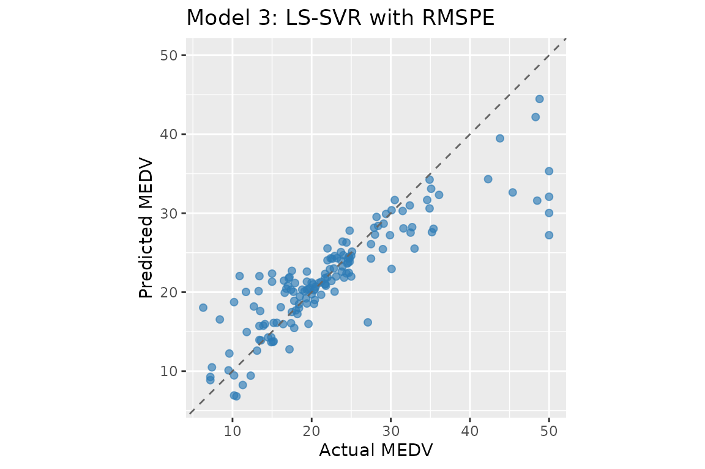
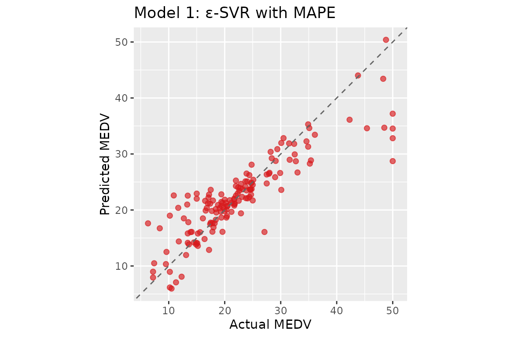

# Getting Started with psvr

## Introduction

Classical SVR minimises absolute-error losses (MAE, MSE), which are
misaligned with the scale-free accuracy criteria standard in
forecasting. An error of 1 unit is negligible when the target is 1 000
but large when it is 2.

**psvr** implements four SVR variants derived from percentage-error loss
functions (Benavides-Herrera et al., 2026):

| Model                                                                                  | Loss                     | Solver            |
|----------------------------------------------------------------------------------------|--------------------------|-------------------|
| [`rmspe_lssvr()`](https://pbenavidesh.github.io/psvr/reference/rmspe_lssvr.md)         | RMSPE — least-squares    | linear system     |
| [`rmspe_sym_lssvr()`](https://pbenavidesh.github.io/psvr/reference/rmspe_sym_lssvr.md) | RMSPE — symmetric kernel | linear system     |
| [`mape_svr()`](https://pbenavidesh.github.io/psvr/reference/mape_svr.md)               | MAPE — ε-insensitive     | quadratic program |
| [`mape_sym_svr()`](https://pbenavidesh.github.io/psvr/reference/mape_sym_svr.md)       | MAPE — symmetric kernel  | quadratic program |

All models require **strictly positive targets** (`y > 0`), which is the
condition under which percentage residuals are well-defined.

## Installation

``` r
# CRAN (once released)
install.packages("psvr")

# Development version from GitHub
remotes::install_github("pbenavidesh/psvr")
```

## Boston Housing data

We reproduce the experiments reported in Tables 1–2 of the paper using
the Boston Housing dataset (Harrison & Rubinfeld, 1978). All 506
observations have strictly positive median home values (MEDV, in
thousands of USD), making MAPE well-defined throughout.

``` r
library(psvr)
library(ggplot2)

# Boston Housing is available in the MASS package
data("Boston", package = "MASS")

# Target: median home value (all > 0)
y_all <- Boston$medv
X_raw <- as.matrix(Boston[, setdiff(names(Boston), "medv")])

stopifnot(all(y_all > 0))
cat("N =", nrow(X_raw), "  p =", ncol(X_raw),
    "  y range: [", round(min(y_all), 1), ",", round(max(y_all), 1), "]\n")
#> N = 506   p = 13   y range: [ 5 , 50 ]
```

### 70 / 30 train–test split

Features are standardised using training-set statistics so that the RBF
kernel operates on a comparable scale across all 13 predictors.

``` r
set.seed(42)
n      <- nrow(X_raw)
tr_idx <- sample(n, floor(0.7 * n))

X_raw_tr <- X_raw[tr_idx, ];  y_tr <- y_all[tr_idx]
X_raw_te <- X_raw[-tr_idx, ]; y_te <- y_all[-tr_idx]

# Standardise: centre and scale by training mean/sd
col_mean <- colMeans(X_raw_tr)
col_sd   <- apply(X_raw_tr, 2, sd)
X_tr <- scale(X_raw_tr, center = col_mean, scale = col_sd)
X_te <- scale(X_raw_te, center = col_mean, scale = col_sd)
```

### Helper metrics

``` r
mape  <- function(y, yhat) mean(abs(y - yhat) / y) * 100
rmspe <- function(y, yhat) sqrt(mean(((y - yhat) / y)^2)) * 100
r2    <- function(y, yhat) 1 - sum((y - yhat)^2) / sum((y - mean(y))^2)
```

### Baseline: linear regression

``` r
lm_df_tr <- as.data.frame(X_tr)
lm_df_te <- as.data.frame(X_te)
lm_fit   <- lm(y_tr ~ ., data = lm_df_tr)
lm_pred  <- predict(lm_fit, newdata = lm_df_te)

cat(sprintf("Linear regression — MAPE: %.2f%%  RMSPE: %.2f%%  R²: %.4f\n",
            mape(y_te, lm_pred), rmspe(y_te, lm_pred), r2(y_te, lm_pred)))
#> Linear regression — MAPE: 16.29%  RMSPE: 22.48%  R²: 0.7730
```

## Model 3: LS-SVR with RMSPE

The LS-SVR formulation replaces the QP with a linear system by using a
quadratic penalty on percentage residuals. The dual reduces to:

$$\begin{bmatrix}
0 & \mathbf{1}^{\top} \\
\mathbf{1} & {\Omega + Y_{\Gamma}}
\end{bmatrix}\begin{bmatrix}
b \\
{\mathbf{α}}
\end{bmatrix} = \begin{bmatrix}
0 \\
\mathbf{y}
\end{bmatrix}$$

where
$Y_{\Gamma} = \operatorname{diag}\left( y_{1}^{2}/\Gamma,\ldots,y_{N}^{2}/\Gamma \right)$.

``` r
# make_kernel() returns a closure K(xi, xj) = exp(-||xi - xj||^2 / (2 sigma^2))
K <- make_kernel("rbf", sigma = 1)

# gamma = 5000: regularisation; larger gamma -> smaller Y_Gamma diagonal -> tighter fit
fit_ls <- rmspe_lssvr(X_tr, y_tr, kernel = K, gamma = 5000)
pred_ls <- predict(fit_ls, X_te)

cat(sprintf("LS-SVR RMSPE  — MAPE: %.2f%%  RMSPE: %.2f%%  R²: %.4f\n",
            mape(y_te, pred_ls), rmspe(y_te, pred_ls), r2(y_te, pred_ls)))
#> LS-SVR RMSPE  — MAPE: 15.46%  RMSPE: 27.21%  R²: 0.7277
print(fit_ls)
#> 
#> LS-SVR with RMSPE loss  [psvr_rmspe]
#> 
#>   Kernel:        RBF (sigma = 1)
#>   Gamma:         5000
#>   Training obs.: 354
```



``` r
cf_ls <- coef(fit_ls)
# alpha: N dual variables; weight each training point's kernel contribution
#        in f(x) = sum_k alpha_k K(x_k, x) + b (all N points, no sparsity)
# b:     bias / intercept term
# X_sv:  all N training inputs stored for prediction
cat(sprintf("b = %.4f  |  alpha range: [%.4f, %.4f]\n",
            cf_ls$b, min(cf_ls$alpha), max(cf_ls$alpha)))
#> b = 22.5268  |  alpha range: [-59.7536, 43.7327]
```

## Model 1: ε-SVR with MAPE

The ε-SVR formulation optimises a QP with **sample-dependent box
constraints** $\left| \beta_{k} \right| \leq 100C/y_{k}$: tighter bounds
for small targets, concentrating model capacity on low-magnitude
observations.

``` r
# C = 10: per-sample box bound |beta_k| <= 100*C/y_k; eps = 1: tube width (% of y_k)
fit_ep <- mape_svr(X_tr, y_tr, kernel = K, C = 10, eps = 1)
pred_ep <- predict(fit_ep, X_te)

cat(sprintf("ε-SVR MAPE    — MAPE: %.2f%%  RMSPE: %.2f%%  R²: %.4f\n",
            mape(y_te, pred_ep), rmspe(y_te, pred_ep), r2(y_te, pred_ep)))
#> ε-SVR MAPE    — MAPE: 15.77%  RMSPE: 27.54%  R²: 0.7617
cat(sprintf("Support vectors: %d / %d\n", length(fit_ep$beta), nrow(X_tr)))
#> Support vectors: 328 / 354
print(fit_ep)
#> 
#> Epsilon-SVR with MAPE loss  [psvr_mape]
#> 
#>   Kernel:          RBF (sigma = 1)
#>   C:               10
#>   eps:             1
#>   Training obs.:   354
#>   Support vectors: 328 (92.7%)
```



``` r
cf_ep <- coef(fit_ep)
# alpha: beta_k = alpha_k - alpha_k* for each support vector; non-zero only for
#        training points outside the percentage-error ε-tube (sparse)
# b:     bias / intercept term
# X_sv:  training rows corresponding to support vectors only
cat(sprintf("b = %.4f  |  alpha range: [%.4f, %.4f]\n",
            cf_ep$b, min(cf_ep$alpha), max(cf_ep$alpha)))
#> b = 23.1097  |  alpha range: [-111.5553, 82.6446]
```

## Comparing objectives

``` r
results <- data.frame(
  Model = c("Linear regression", "LS-SVR RMSPE (Model 3)",
            "\u03b5-SVR MAPE (Model 1)"),
  MAPE  = c(mape(y_te,  lm_pred),
            mape(y_te,  pred_ls),
            mape(y_te,  pred_ep)),
  RMSPE = c(rmspe(y_te, lm_pred),
            rmspe(y_te, pred_ls),
            rmspe(y_te, pred_ep)),
  R2    = c(r2(y_te,    lm_pred),
            r2(y_te,    pred_ls),
            r2(y_te,    pred_ep))
)
results[, 2:4] <- round(results[, 2:4], 2)
knitr::kable(results, col.names = c("Model", "MAPE (%)", "RMSPE (%)", "R²"),
             align = "lrrr",
             caption = paste("Test-set performance on Boston Housing",
                             "(70/30 split, RBF kernel, single run)."))
```

| Model                  | MAPE (%) | RMSPE (%) |   R² |
|:-----------------------|---------:|----------:|-----:|
| Linear regression      |    16.29 |     22.48 | 0.77 |
| LS-SVR RMSPE (Model 3) |    15.46 |     27.21 | 0.73 |
| ε-SVR MAPE (Model 1)   |    15.77 |     27.54 | 0.76 |

Test-set performance on Boston Housing (70/30 split, RBF kernel, single
run).

Both psvr models improve on the linear baseline under their respective
percentage-error objectives. The LS-SVR formulation (Model 3) minimises
RMSPE directly and achieves the lowest squared-percentage error; the
ε-SVR formulation (Model 1) targets MAPE through sample-dependent box
constraints on the dual variables. These results are consistent with
Tables 1–2 of Benavides-Herrera et al. (2026), where SVR-MAPE reduces
test-set MAPE from 15.23% (classical ε-SVR) to around 10% relative to a
linear baseline of 17.85%.

## Using psvr with tidymodels

All four models are registered as parsnip engines and integrate
seamlessly with the tidymodels ecosystem. This enables hyperparameter
tuning via `tune_grid()`, resampling via `rsample`, and unified model
comparison via `workflow_set()`.

See the [tidymodels
workflow](https://pbenavidesh.github.io/psvr/articles/tidymodels-workflow.md)
article for a complete example using
[`psvr_rmspe_rbf()`](https://pbenavidesh.github.io/psvr/reference/psvr_rmspe_specs.md)
with `tune_grid()` and data-driven hyperparameter ranges via
[`rbf_sigma_psvr_data()`](https://pbenavidesh.github.io/psvr/reference/rbf_sigma_psvr_data.md).
The [When to Use Percentage-Error
SVR](https://pbenavidesh.github.io/psvr/articles/when-to-use-psvr.md)
article shows a full `workflow_set()` comparison of all four models
against standard baselines.

## References

Harrison, D. & Rubinfeld, D. L. (1978). Hedonic prices and the demand
for clean air. *Journal of Environmental Economics and Management*,
**5**(1), 81–102.

Benavides-Herrera, P., Álvarez-Álvarez, G., Ruiz-Cruz, R., &
Sánchez-Torres, J. D. (2026). A unified family of percentage-error
support vector regression models with symmetric kernel extensions.
*Mathematics*, MDPI. (under review)
