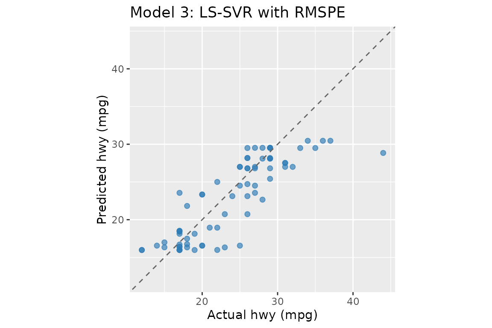
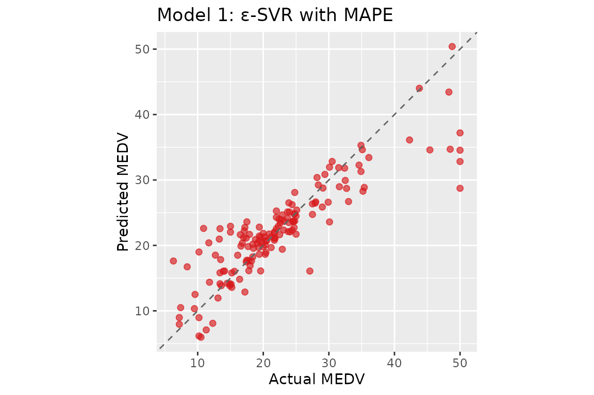

# Getting Started with psvr

## Introduction

Classical SVR minimises absolute-error losses (MAE, MSE), which are
misaligned with the scale-free accuracy criteria standard in
forecasting. An error of 1 unit is negligible when the target is 1 000
but large when it is 2.

**psvr** implements four SVR variants derived from percentage-error loss
functions (Benavides-Herrera et al., 2026), accessed through one fitter
per model family:

| Model | Function | `sym_type` | Solver |
|----|----|----|----|
| 3 | [`psvr_rmspe()`](https://pbenavidesh.github.io/psvr/reference/psvr_rmspe.md) | `"none"` | linear system |
| 4 | [`psvr_rmspe()`](https://pbenavidesh.github.io/psvr/reference/psvr_rmspe.md) | `"even"` / `"odd"` | linear system |
| 1 | [`psvr_mape()`](https://pbenavidesh.github.io/psvr/reference/psvr_mape.md) | `"none"` | quadratic program |
| 2 | [`psvr_mape()`](https://pbenavidesh.github.io/psvr/reference/psvr_mape.md) | `"even"` / `"odd"` | quadratic program |

`sym_type = "even"` enforces even symmetry `f(x) = f(-x)`; `"odd"`
enforces odd symmetry. Use the symmetric variants only with kernels that
satisfy Assumption 3 of the paper (RBF and even-degree polynomial
kernels do).

These are the two direct fitters. They replaced the unified
[`psvr()`](https://pbenavidesh.github.io/psvr/reference/psvr-package.md)
entry point in 0.0.2.9012, which had in turn replaced four separate
wrappers in 0.0.2.9010: seven of
[`psvr()`](https://pbenavidesh.github.io/psvr/reference/psvr-package.md)’s
eleven arguments were conditional on which family you were fitting, so
the families are now separate functions. Both return the same classes
the tidymodels engine returns, so a fit obtained either way behaves
identically.

All models require **strictly positive targets** (`y > 0`), which is the
condition under which percentage residuals are well-defined.

## Fuel-economy data

This vignette **demonstrates** the package on a small public dataset. It
does not reproduce the paper’s experiments, and every number printed
below is computed when the vignette is built.

We use
[`ggplot2::mpg`](https://ggplot2.tidyverse.org/reference/mpg.html): 234
records of US passenger vehicles. The target is `hwy`, highway fuel
economy in miles per gallon. It is strictly positive on every
observation, so the percentage residuals — and therefore MAPE and RMSPE
— are well-defined throughout.

``` r

library(psvr)
library(ggplot2)

# Target: highway fuel economy (all > 0)
y_all <- mpg$hwy

# Predictors: engine displacement, model year, cylinder count.
#
# `cty` is deliberately EXCLUDED. City and highway fuel economy are two
# measurements of the same property of the same vehicle (they correlate at
# 0.96), so predicting one from the other is leakage rather than modelling.
X_raw <- as.matrix(mpg[, c("displ", "year", "cyl")])

stopifnot(all(y_all > 0))
cat("N =", nrow(X_raw), "  p =", ncol(X_raw),
    "  y range: [", min(y_all), ",", max(y_all), "]\n")
#> N = 234   p = 3   y range: [ 12 , 44 ]
```

### 70 / 30 train–test split

Features are standardised using training-set statistics so that the RBF
kernel operates on a comparable scale across all three predictors.

``` r

set.seed(42)
n      <- nrow(X_raw)
tr_idx <- sample(n, floor(0.7 * n))

X_raw_tr <- X_raw[tr_idx, ];  y_tr <- y_all[tr_idx]
X_raw_te <- X_raw[-tr_idx, ]; y_te <- y_all[-tr_idx]

# Standardise: centre and scale by training mean/sd
col_mean <- colMeans(X_raw_tr)
col_sd   <- apply(X_raw_tr, 2, sd)
X_tr <- scale(X_raw_tr, center = col_mean, scale = col_sd)
X_te <- scale(X_raw_te, center = col_mean, scale = col_sd)
```

### Helper metrics

``` r

mape  <- function(y, yhat) mean(abs(y - yhat) / y) * 100
rmspe <- function(y, yhat) sqrt(mean(((y - yhat) / y)^2)) * 100
r2    <- function(y, yhat) 1 - sum((y - yhat)^2) / sum((y - mean(y))^2)
```

### Baseline: linear regression

``` r

lm_df_tr <- as.data.frame(X_tr)
lm_df_te <- as.data.frame(X_te)
lm_fit   <- lm(y_tr ~ ., data = lm_df_tr)
lm_pred  <- predict(lm_fit, newdata = lm_df_te)

cat(sprintf("Linear regression — MAPE: %.2f%%  RMSPE: %.2f%%  R²: %.4f\n",
            mape(y_te, lm_pred), rmspe(y_te, lm_pred), r2(y_te, lm_pred)))
#> Linear regression — MAPE: 12.91%  RMSPE: 17.65%  R²: 0.6391
```

## Model 3: LS-SVR with RMSPE

The LS-SVR formulation replaces the QP with a linear system by using a
quadratic penalty on percentage residuals. The dual reduces to:

``` math
\begin{bmatrix} 0 & \mathbf{1}^\top \\ \mathbf{1} & \Omega + Y_\Gamma \end{bmatrix}
\begin{bmatrix} b \\ \boldsymbol{\alpha} \end{bmatrix}
= \begin{bmatrix} 0 \\ \mathbf{y} \end{bmatrix}
```

where
$`Y_\Gamma = \operatorname{diag}(y_1^2/\Gamma, \ldots, y_N^2/\Gamma)`$.

``` r

# make_kernel() returns a closure K(xi, xj) = exp(-||xi - xj||^2 / (2 sigma^2)).
# sigma is a LENGTH in the units of the preprocessed feature space, so it has
# to be set on that scale -- sigma_heuristic() reads it off the data instead of
# guessing. See "Hyperparameter search ranges" below.
K <- make_kernel("rbf", sigma = sigma_heuristic(X_tr))

# gamma = 5000: regularisation; larger gamma -> smaller Y_Gamma diagonal -> tighter fit.
# This is roughly var(y_tr) * N, the scale cost_psvr_ls_data() computes -- and
# already five times the ceiling of the registered `cost` default. See below.
fit_ls <- psvr_rmspe(X_tr, y_tr, kernel = K, gamma = 5000)
pred_ls <- predict(fit_ls, X_te)

cat(sprintf("LS-SVR RMSPE  — MAPE: %.2f%%  RMSPE: %.2f%%  R²: %.4f\n",
            mape(y_te, pred_ls), rmspe(y_te, pred_ls), r2(y_te, pred_ls)))
#> LS-SVR RMSPE  — MAPE: 11.43%  RMSPE: 14.48%  R²: 0.6845
print(fit_ls)
#> 
#> LS-SVR with RMSPE loss  [psvr_rmspe]
#> 
#>   Kernel:        RBF (sigma = 2.1195)
#>   Gamma:         5000
#>   Training obs.: 163
```



``` r

cf_ls <- coef(fit_ls)
# alpha:        N dual variables; weight each training point's kernel
#               contribution in f(x) = sum_k alpha_k K(x_k, x) + b
#               (all N points, no sparsity)
# b:            bias / intercept term
# support_data: all N training inputs stored for prediction
cat(sprintf("b = %.4f  |  alpha range: [%.4f, %.4f]\n",
            cf_ls$b, min(cf_ls$alpha), max(cf_ls$alpha)))
#> b = 23.0976  |  alpha range: [-138.1332, 68.7725]
```

## Model 1: ε-SVR with MAPE

The ε-SVR formulation optimises a QP with **sample-dependent box
constraints** $`|\beta_k| \le 100C/y_k`$: tighter bounds for small
targets, concentrating model capacity on low-magnitude observations.

``` r

# C = 10: per-sample box bound |beta_k| <= 100*C/y_k; eps = 1: tube width (% of y_k)
fit_ep <- psvr_mape(X_tr, y_tr, kernel = K, C = 10, eps = 1)
pred_ep <- predict(fit_ep, X_te)

cat(sprintf("ε-SVR MAPE    — MAPE: %.2f%%  RMSPE: %.2f%%  R²: %.4f\n",
            mape(y_te, pred_ep), rmspe(y_te, pred_ep), r2(y_te, pred_ep)))
#> ε-SVR MAPE    — MAPE: 11.11%  RMSPE: 14.68%  R²: 0.6913
cat(sprintf("Support vectors: %d / %d\n", length(fit_ep$beta), fit_ep$n_train))
#> Support vectors: 154 / 163
print(fit_ep)
#> 
#> Epsilon-SVR with MAPE loss  [psvr_mape]
#> 
#>   Kernel:          RBF (sigma = 2.1195)
#>   C:               10
#>   eps:             1
#>   Training obs.:   163
#>   Support vectors: 154 (94.5%)
```



``` r

cf_ep <- coef(fit_ep)
# alpha, alpha_star: length-N dual variables (paired); the pre-pruning
#               solution.  Useful as a warm-start across CV folds; for
#               prediction use `beta` instead.
# beta:         beta_k = alpha_k - alpha_k* for each SUPPORT VECTOR only
#               (non-zero only for training points outside the
#               percentage-error ε-tube — sparse)
# b:            bias / intercept term
# support_data: training rows corresponding to support vectors only
cat(sprintf("b = %.4f  |  beta range: [%.4f, %.4f]\n",
            cf_ep$b, min(cf_ep$beta), max(cf_ep$beta)))
#> b = 22.2127  |  beta range: [-83.3333, 62.5000]
```

## Comparing objectives

``` r

results <- data.frame(
  Model = c("Linear regression", "LS-SVR RMSPE (Model 3)",
            "\u03b5-SVR MAPE (Model 1)"),
  MAPE  = c(mape(y_te,  lm_pred),
            mape(y_te,  pred_ls),
            mape(y_te,  pred_ep)),
  RMSPE = c(rmspe(y_te, lm_pred),
            rmspe(y_te, pred_ls),
            rmspe(y_te, pred_ep)),
  R2    = c(r2(y_te,    lm_pred),
            r2(y_te,    pred_ls),
            r2(y_te,    pred_ep))
)
results[, 2:4] <- round(results[, 2:4], 2)
knitr::kable(results, col.names = c("Model", "MAPE (%)", "RMSPE (%)", "R²"),
             align = "lrrr",
             caption = paste("Test-set performance on ggplot2::mpg",
                             "(70/30 split, RBF kernel, single run,",
                             "untuned hyperparameters)."))
```

| Model                  | MAPE (%) | RMSPE (%) |   R² |
|:-----------------------|---------:|----------:|-----:|
| Linear regression      |    12.91 |     17.65 | 0.64 |
| LS-SVR RMSPE (Model 3) |    11.43 |     14.48 | 0.68 |
| ε-SVR MAPE (Model 1)   |    11.11 |     14.68 | 0.69 |

Test-set performance on ggplot2::mpg (70/30 split, RBF kernel, single
run, untuned hyperparameters). {.table}

Both psvr models improve on the linear baseline under their respective
percentage-error objectives. The LS-SVR formulation (Model 3) minimises
RMSPE directly; the ε-SVR formulation (Model 1) targets MAPE through
sample-dependent box constraints on the dual variables.

Read the table for the ordering, not for the magnitudes. It is one split
of one small dataset at hyperparameters nobody tuned, so the margins are
not evidence about how these models perform in general — that is what
the resampled comparison in the [When to Use Percentage-Error
SVR](https://pbenavidesh.github.io/psvr/articles/when-to-use-psvr.html)
article is for.

## Using psvr with tidymodels

All four models are registered as parsnip engines and integrate
seamlessly with the tidymodels ecosystem. This enables hyperparameter
tuning via
[`tune_grid()`](https://tune.tidymodels.org/reference/tune_grid.html),
resampling via `rsample`, and unified model comparison via
`workflow_set()`.

See the [tidymodels
workflow](https://pbenavidesh.github.io/psvr/articles/tidymodels-workflow.md)
article for a complete example using
[`psvr_rmspe_rbf()`](https://pbenavidesh.github.io/psvr/reference/psvr_rmspe_specs.md)
with
[`tune_grid()`](https://tune.tidymodels.org/reference/tune_grid.html)
and data-driven hyperparameter ranges via
[`rbf_sigma_psvr_data()`](https://pbenavidesh.github.io/psvr/reference/rbf_sigma_psvr_data.md).
The [When to Use Percentage-Error
SVR](https://pbenavidesh.github.io/psvr/articles/when-to-use-psvr.html)
article, on the package website rather than in the installed package,
shows a full `workflow_set()` comparison of all four models against
standard baselines.

## Hyperparameter search ranges

The parsnip specs register **static** default ranges — a `dials`
parameter object has to exist before any data does. Three of them are
deliberately conservative, one of them is actively wrong for LS-SVR, and
one searches a level you probably do not want, so tuning a psvr model
means supplying your own ranges through `param_info`.

Nothing below fits a model. It builds the parameter set and prints it,
before and after.

``` r

library(parsnip)
library(tune)

show_ranges <- function(ps) {
  for (i in seq_len(nrow(ps))) {
    ob <- ps$object[[i]]
    cat(sprintf("  %-10s %s\n", ps$id[i],
      if (inherits(ob, "quant_param"))
        sprintf("[%s] on the %s scale",
                paste(signif(unlist(ob$range), 4), collapse = ", "),
                if (is.null(ob$trans)) "identity" else ob$trans$name)
      else sprintf("{%s}", paste(ob$values, collapse = ", "))))
  }
  invisible(ps)
}

spec_mape <- psvr_mape_rbf(cost = tune(), margin = tune(),
                           rbf_sigma = tune(), sym_type = tune()) |>
  set_engine("psvr")

extract_parameter_set_dials(spec_mape) |> show_ranges()
#>   cost       [-2, 10] on the log-2 scale
#>   margin     [1, 20] on the identity scale
#>   rbf_sigma  [-3, 1] on the log-10 scale
#>   sym_type   {none, even, odd}
```

For an ε-SVR (Models 1–2) only `rbf_sigma` really needs replacing; the
`cost` and `margin` defaults are usable as they stand.

``` r

extract_parameter_set_dials(spec_mape) |>
  update(
    cost      = cost_psvr(),                      # [-2, 10] log2 — fine for C
    margin    = margin_percentage(),              # 1-20% of each target
    rbf_sigma = rbf_sigma_psvr_data(X_tr),        # data-driven; see below
    sym_type  = sym_type_param(c("even", "odd"))  # drops "none"; see below
  ) |>
  show_ranges()
#>   cost       [-2, 10] on the log-2 scale
#>   margin     [1, 20] on the identity scale
#>   rbf_sigma  [-0.6738, 1.326] on the log-10 scale
#>   sym_type   {even, odd}
```

For an LS-SVR (Models 3–4) `cost` is $`\Gamma`$, and there the
registered default is **not** usable.

``` r

spec_ls <- psvr_rmspe_rbf(cost = tune(), rbf_sigma = tune(),
                          sym_type = tune()) |>
  set_engine("psvr")

extract_parameter_set_dials(spec_ls) |>
  update(
    cost      = cost_psvr_ls_data(y_tr),
    rbf_sigma = rbf_sigma_psvr_data(X_tr),
    sym_type  = sym_type_param(c("even", "odd"))
  ) |>
  show_ranges()
#>   cost       [-2, 16.38] on the log-2 scale
#>   rbf_sigma  [-0.6738, 1.326] on the log-10 scale
#>   sym_type   {even, odd}
```

No single spec carries all four helpers: `margin` exists only on the
MAPE specs, and
[`cost_psvr_ls_data()`](https://pbenavidesh.github.io/psvr/reference/cost_psvr_ls_data.md)
applies only to the RMSPE ones.

### `rbf_sigma` is a length scale, not a precision

Of everything on this page, this is the one most likely to cost you a
day. psvr’s RBF kernel is

``` math
K(\mathbf{x}_i, \mathbf{x}_j) =
  \exp\left(-\frac{\|\mathbf{x}_i - \mathbf{x}_j\|^2}{2\sigma^2}\right)
```

so `rbf_sigma` is a **length**, measured in the units of the
preprocessed feature space, and *larger* means a *wider* kernel.
`kernlab::rbfdot(sigma =)`, `e1071::svm(gamma =)` and
`parsnip::svm_rbf(rbf_sigma =)` all use the reciprocal convention,
$`\exp(-\sigma\|\cdot\|^2)`$, where larger means *narrower*. Carrying a
tuned value across from one of those gives a silently wrong kernel width
— no error, no warning, just a worse model.

### `rbf_sigma_psvr_data()` needs preprocessed predictors

`rbf_sigma_psvr_data(X)` centres its range on the median pairwise
Euclidean distance between the rows of `X`, spanning one decade either
side of it on the log10 scale. Being a distance-based heuristic, it
means nothing except on the scale the model is actually fitted on: pass
the standardised predictors (`X_tr` here, or the baked output of a
recipe), never the raw ones.

``` r

sigma_heuristic(X_tr)   # the geometric centre of the range printed above,
#> [1] 2.119499
                        # and the value the fits at the top of this page used
```

Above `sample_size` rows (default 500) the median is taken on a random
subsample, so the centre becomes an estimate rather than the exact
median — and a seed-dependent one. Pass `seed` if you need it
reproducible.

### LS-SVR needs `cost_psvr_ls_data()`, and it cannot be automated

`cost` maps to `C` on the ε-SVR models and to $`\Gamma`$ on the LS-SVR
ones, but both register the same default of $`[-2, 10]`$ on the log2
scale, i.e. $`\Gamma \le 1024`$. That is the ε-SVR range. $`\Gamma`$
enters the LS-SVR system only through the $`y_k^2/\Gamma`$ diagonal, so
the value that balances that term against the kernel scales with
`var(y) * n` — it is not a fixed magnitude, and it grows with both the
spread of the outcome and the size of the training set.

The fit at the top of this page is already past the default ceiling: it
used `gamma = 5000`, and $`[-2, 10]`$ stops at 1024. A grid over the
default would be **boundary-trapped** — every candidate is legal, the
search reports a plausible number, and the optimum was never inside the
range. The [tidymodels
workflow](https://pbenavidesh.github.io/psvr/articles/tidymodels-workflow.md)
article shows the size of the effect.

`cost_psvr_ls_data(y)` sets the ceiling from `var(y) * n`. It has to be
passed by hand: `tune` finalises parameters from the molded
**predictors** alone and never passes the outcome to
[`dials::finalize()`](https://dials.tidymodels.org/reference/finalize.html),
so no machinery could compute a `var(y)`-based bound on your behalf.

### `cost` is not comparable across datasets either

The same trap has a milder form on the ε-SVR side, and
[`cost_psvr()`](https://pbenavidesh.github.io/psvr/reference/cost_psvr.md)
does not protect you from it. The dual box constraint is

``` math
|\beta_k| \le \frac{100\,C}{y_k}
```

so the bound a given `C` imposes depends on the **magnitude of the
outcome**. On data where `y` is of order $`10^4`$ rather than order
$`10`$, the same `C` yields a box three decades tighter, every
multiplier saturates against it, and the fit degenerates towards a
constant.
[`cost_psvr()`](https://pbenavidesh.github.io/psvr/reference/cost_psvr.md)
returns a static $`[-2, 10]`$ calibrated for outcomes of order 10, so on
large-`y` data `C` has to be raised by hand to compensate — there is
currently no `cost_psvr_data()` counterpart to
[`cost_psvr_ls_data()`](https://pbenavidesh.github.io/psvr/reference/cost_psvr_ls_data.md)
for the ε-SVR family.

### Tuning `sym_type` cannot answer “does symmetry help”

`sym_type` registers all three levels, `{none, even, odd}`, and `"none"`
*is* the asymmetric model. So `sym_type = tune()` puts Models 1 and 2 —
or 3 and 4 — inside a single search space, and
[`select_best()`](https://tune.tidymodels.org/reference/show_best.html)
returns whichever candidate won. That is a selection, not a comparison.
To contrast the two families, fix `sym_type` on two specs and compare
their resampled metrics. Restricting to `c("even", "odd")`, as above,
tunes *within* the symmetric family, which is a third question again.

### The outcome stays in original units

[`recipes::step_normalize()`](https://recipes.tidymodels.org/reference/step_normalize.html)
applies to predictors. Leave the outcome alone: the percentage-error
losses divide by `y`, so they need `y > 0` on the original scale, and
centring the outcome would destroy positivity and change what
“percentage error” even refers to. This is a genuine departure from
classical SVR, where rescaling the outcome is routine and harmless.

## References

Benavides-Herrera, P., Álvarez, G., Ruiz-Cruz, R., & Sánchez-Torres, J.
D. (2026). A unified family of percentage-error support vector
regression models with symmetric kernel extensions. *Mathematics*,
14(10), 1679. <https://doi.org/10.3390/math14101679>
