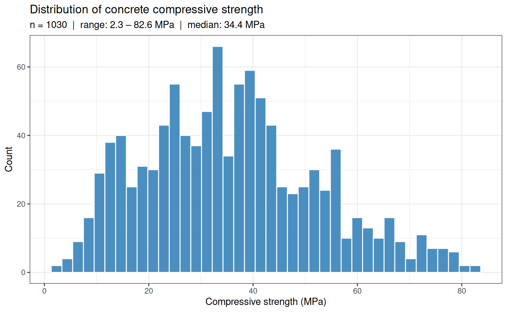
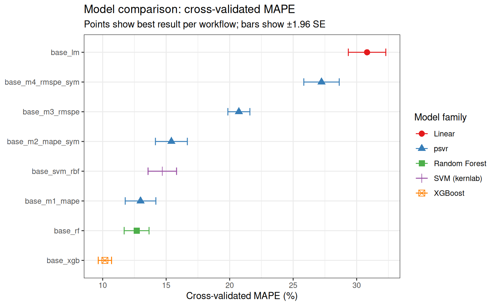
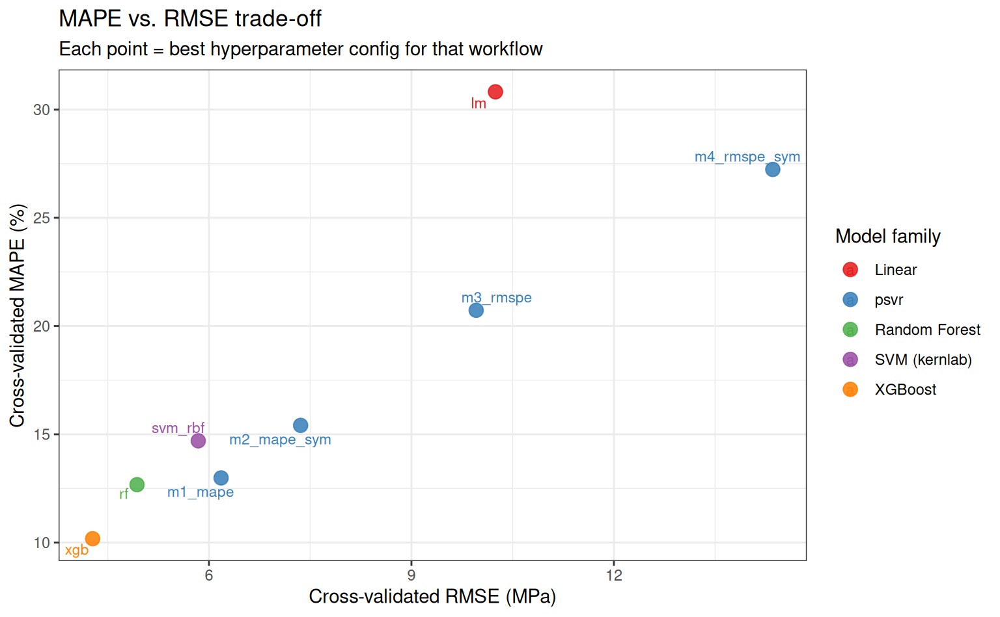
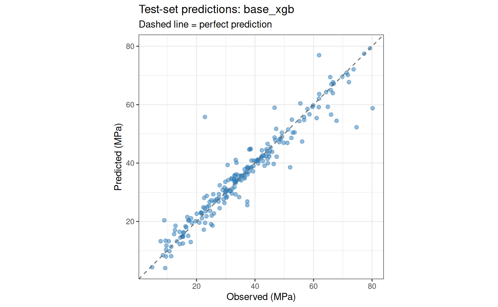

# When to Use Percentage-Error SVR

## Motivation

Standard regression models — including classical SVR — minimise
absolute-error losses such as MSE or MAE. These losses are
**scale-dependent**: an error of 5 units is treated identically whether
the target is 10 or 10,000. In many practical settings, however, what
matters is the *relative* error. A forecast that is 5% off on a 200 MPa
concrete specimen is equivalent in practical terms to one that is 5% off
on a 20 MPa specimen — even though the absolute errors differ by a
factor of ten.

The `psvr` package provides four SVR variants that optimise
percentage-error losses directly:

- **Model 1** (`psvr_mape_rbf`): $\varepsilon$-SVR with MAPE loss
- **Model 2** (`psvr_mape_sym_rbf`): symmetric-kernel extension of Model
  1
- **Model 3** (`psvr_rmspe_rbf`): LS-SVR with RMSPE loss
- **Model 4** (`psvr_rmspe_sym_rbf`): symmetric-kernel extension of
  Model 3

This article asks a concrete question: **on a dataset where relative
accuracy matters, do models that optimise percentage error directly
outperform models that optimise absolute error?**

> **What this article does *not* claim**
>
> `psvr` is not a universal replacement for standard SVR. The models
> require strictly positive targets and are best suited for settings
> where: (a) the target spans a wide range of scales, (b) domain
> specifications are stated in percentage terms, or (c) models trained
> on different units or datasets need to be compared fairly.

------------------------------------------------------------------------

## Setup

Code

``` r
library(tidyverse)
library(tidymodels)
library(psvr)
library(modeldata)
library(future)

tidymodels_prefer()
theme_set(theme_bw())
```

------------------------------------------------------------------------

## Dataset: Concrete Compressive Strength

The `concrete` dataset (Yeh, 1998) contains 1,030 observations of
concrete mixture compositions and the resulting compressive strength
after curing. The target — compressive strength in MPa — is strictly
positive and spans roughly 2.3 to 82.6 MPa, a range of more than
35-fold. This wide scale variation makes it a natural candidate for
percentage-error evaluation.

Code

``` r
data(concrete, package = "modeldata")

glimpse(concrete)
```

    Rows: 1,030
    Columns: 9
    $ cement               <dbl> 540.0, 540.0, 332.5, 332.5, 198.6, 266.0, 380.0, …
    $ blast_furnace_slag   <dbl> 0.0, 0.0, 142.5, 142.5, 132.4, 114.0, 95.0, 95.0,…
    $ fly_ash              <dbl> 0, 0, 0, 0, 0, 0, 0, 0, 0, 0, 0, 0, 0, 0, 0, 0, 0…
    $ water                <dbl> 162, 162, 228, 228, 192, 228, 228, 228, 228, 228,…
    $ superplasticizer     <dbl> 2.5, 2.5, 0.0, 0.0, 0.0, 0.0, 0.0, 0.0, 0.0, 0.0,…
    $ coarse_aggregate     <dbl> 1040.0, 1055.0, 932.0, 932.0, 978.4, 932.0, 932.0…
    $ fine_aggregate       <dbl> 676.0, 676.0, 594.0, 594.0, 825.5, 670.0, 594.0, …
    $ age                  <int> 28, 28, 270, 365, 360, 90, 365, 28, 28, 28, 90, 2…
    $ compressive_strength <dbl> 79.99, 61.89, 40.27, 41.05, 44.30, 47.03, 43.70, …

Code

``` r
concrete |>
  ggplot(aes(x = compressive_strength)) +
  geom_histogram(bins = 40, fill = "#2c7bb6", colour = "white", alpha = 0.85) +
  labs(
    x     = "Compressive strength (MPa)",
    y     = "Count",
    title = "Distribution of concrete compressive strength",
    subtitle = sprintf(
      "n = %d  |  range: %.1f – %.1f MPa  |  median: %.1f MPa",
      nrow(concrete),
      min(concrete$compressive_strength),
      max(concrete$compressive_strength),
      median(concrete$compressive_strength)
    )
  )
```



Compressive strength spans a wide range, motivating relative error
metrics. The distribution is right-skewed with a long upper tail.

> **Why this dataset?**
>
> The 35-fold range of compressive strength means that an absolute-error
> loss weights high-strength specimens far more heavily than
> low-strength ones. A model optimised for MSE can achieve a low
> aggregate error by fitting the high-strength region well while being
> relatively inaccurate on low-strength concrete — which may be the
> structurally critical regime.

------------------------------------------------------------------------

## Data splitting and resampling

Code

``` r
set.seed(42)
split <- initial_split(concrete, prop = 0.80, strata = compressive_strength)
train <- training(split)
test  <- testing(split)

folds <- vfold_cv(train, v = 10, strata = compressive_strength)

cat(sprintf(
  "Training: %d obs  |  Test: %d obs\n",
  nrow(train), nrow(test)
))
```

    Training: 822 obs  |  Test: 208 obs

------------------------------------------------------------------------

## Recipe

All models share a single preprocessing recipe: centre and scale all
predictors so that the RBF kernel operates on a standardised feature
space.

Code

``` r
rec_base <- recipe(compressive_strength ~ ., data = train) |>
  step_normalize(all_numeric_predictors())
```

------------------------------------------------------------------------

## Model specifications

### Baselines

Code

``` r
spec_lm  <- linear_reg() |>
  set_engine("lm")

spec_svm <- svm_rbf(cost = tune(), rbf_sigma = tune()) |>
  set_engine("kernlab") |>
  set_mode("regression")

spec_rf  <- rand_forest(mtry = tune(), trees = 500, min_n = tune()) |>
  set_engine("ranger") |>
  set_mode("regression")

spec_xgb <- boost_tree(
  trees     = 500,
  tree_depth = tune(),
  learn_rate = tune(),
  loss_reduction = tune()
) |>
  set_engine("xgboost") |>
  set_mode("regression")
```

### psvr models

All four models use the RBF kernel. The symmetry parameter `a = 1` (even
symmetry) is fixed as an engine argument — it encodes the assumption
that the regression function satisfies $f(\mathbf{x}) = f(-\mathbf{x})$,
which is reasonable after centering via `step_normalize`.

Code

``` r
spec_m1 <- psvr_mape_rbf(
  cost       = tune(),
  svm_margin = tune(),
  rbf_sigma  = tune()
) |>
  set_engine("psvr")

spec_m2 <- psvr_mape_sym_rbf(
  cost       = tune(),
  svm_margin = tune(),
  rbf_sigma  = tune()
) |>
  set_engine("psvr", a = 1L)

spec_m3 <- psvr_rmspe_rbf(
  cost      = tune(),
  rbf_sigma = tune()
) |>
  set_engine("psvr")

spec_m4 <- psvr_rmspe_sym_rbf(
  cost      = tune(),
  rbf_sigma = tune()
) |>
  set_engine("psvr", a = 1L)
```

> **Hyperparameter search ranges**
>
> The `psvr` package supplies custom dials parameters with appropriate
> defaults for percentage-error models:
>
> - **`svm_margin`** →
>   [`margin_percentage()`](https://pbenavidesh.github.io/psvr/reference/margin_percentage.md):
>   default range \[1, 20\] in percentage units — no manual override
>   needed.
> - **`cost`** →
>   [`cost_psvr()`](https://pbenavidesh.github.io/psvr/reference/cost_psvr.md):
>   default range \[−2, 10\] on the log₂ scale (~0.25 to 1,024) — no
>   manual override needed.
> - **`rbf_sigma`** →
>   [`rbf_sigma_psvr()`](https://pbenavidesh.github.io/psvr/reference/rbf_sigma_psvr.md):
>   default range \[−3, 1\] on the log₁₀ scale. **This range should be
>   adjusted** using the median-distance heuristic via
>   [`sigma_heuristic()`](https://pbenavidesh.github.io/psvr/reference/sigma_heuristic.md)
>   — see the code below.

``` r
# Compute median pairwise distance on the normalised training predictors
train_baked  <- rec_base |> prep() |> bake(new_data = train)
sigma_med    <- sigma_heuristic(train_baked |> select(-compressive_strength))

rbf_sigma_custom <- rbf_sigma_psvr(
  range = c(log10(sigma_med / 10), log10(sigma_med * 10))
)

cat(sprintf("sigma_med = %.3f  →  rbf_sigma range: [%.3f, %.3f]\n",
            sigma_med,
            log10(sigma_med / 10),
            log10(sigma_med * 10)))
```

    sigma_med = 3.688  →  rbf_sigma range: [-0.433, 1.567]

------------------------------------------------------------------------

## Workflow set

Eight model specifications are paired with the base recipe, yielding 8
workflows. `workflow_map()` tunes each one over a Latin hypercube grid
and evaluates with 10-fold CV on the full training set.

Code

``` r
wf_set <- workflow_set(
  preproc = list(base = rec_base),
  models  = list(
    lm           = spec_lm,
    svm_rbf      = spec_svm,
    rf           = spec_rf,
    xgb          = spec_xgb,
    m1_mape      = spec_m1,
    m2_mape_sym  = spec_m2,
    m3_rmspe     = spec_m3,
    m4_rmspe_sym = spec_m4
  )
) |>
  option_add(
    param_info = workflow(rec_base, spec_m1) |>
      extract_parameter_set_dials() |>
      update(rbf_sigma = rbf_sigma_custom),
    id = "base_m1_mape"
  ) |>
  option_add(
    param_info = workflow(rec_base, spec_m2) |>
      extract_parameter_set_dials() |>
      update(rbf_sigma = rbf_sigma_custom),
    id = "base_m2_mape_sym"
  ) |>
  option_add(
    param_info = workflow(rec_base, spec_m3) |>
      extract_parameter_set_dials() |>
      update(rbf_sigma = rbf_sigma_custom),
    id = "base_m3_rmspe"
  ) |>
  option_add(
    param_info = workflow(rec_base, spec_m4) |>
      extract_parameter_set_dials() |>
      update(rbf_sigma = rbf_sigma_custom),
    id = "base_m4_rmspe_sym"
  )

wf_set
```

    # A workflow set/tibble: 8 × 4
      wflow_id          info             option    result
      <chr>             <list>           <list>    <list>
    1 base_lm           <tibble [1 × 4]> <opts[0]> <list [0]>
    2 base_svm_rbf      <tibble [1 × 4]> <opts[0]> <list [0]>
    3 base_rf           <tibble [1 × 4]> <opts[0]> <list [0]>
    4 base_xgb          <tibble [1 × 4]> <opts[0]> <list [0]>
    5 base_m1_mape      <tibble [1 × 4]> <opts[1]> <list [0]>
    6 base_m2_mape_sym  <tibble [1 × 4]> <opts[1]> <list [0]>
    7 base_m3_rmspe     <tibble [1 × 4]> <opts[1]> <list [0]>
    8 base_m4_rmspe_sym <tibble [1 × 4]> <opts[1]> <list [0]>

------------------------------------------------------------------------

## Tuning

Code

``` r
plan(multisession)

set.seed(123)
tune_res <- workflow_map(
  wf_set,
  fn         = "tune_grid",
  resamples  = folds,
  grid       = 20,           # 20-point Latin hypercube per workflow
  metrics    = metric_set(mape, rmse, rsq),
  control    = control_grid(
    save_pred     = FALSE,
    parallel_over = "everything",
    verbose       = FALSE
  )
)

plan(sequential)
```

------------------------------------------------------------------------

## Results

### Overall ranking by MAPE

Code

``` r
rank_res <- rank_results(tune_res, rank_metric = "mape", select_best = TRUE)

rank_res |>
  filter(.metric == "mape") |>
  mutate(
    wflow_id = fct_reorder(wflow_id, mean),
    family   = case_when(
      str_detect(wflow_id, "m1|m2|m3|m4") ~ "psvr",
      str_detect(wflow_id, "svm")          ~ "SVM (kernlab)",
      str_detect(wflow_id, "rf")           ~ "Random Forest",
      str_detect(wflow_id, "xgb")          ~ "XGBoost",
      TRUE                                  ~ "Linear"
    )
  ) |>
  ggplot(aes(x = mean, y = wflow_id, colour = family, shape = family)) +
  geom_point(size = 3) +
  geom_errorbarh(
    aes(xmin = mean - 1.96 * std_err, xmax = mean + 1.96 * std_err),
    height = 0.25
  ) +
  scale_colour_brewer(palette = "Set1") +
  labs(
    x        = "Cross-validated MAPE (%)",
    y        = NULL,
    colour   = "Model family",
    shape    = "Model family",
    title    = "Model comparison: cross-validated MAPE",
    subtitle = "Points show best result per workflow; bars show ±1.96 SE"
  )
```



Cross-validated MAPE for all 8 workflows (lower is better). Shapes
distinguish model families.

### Summary table

Code

``` r
rank_res |>
  filter(.metric == "mape") |>
  select(rank, wflow_id, mean, std_err, n) |>
  rename(
    Rank     = rank,
    Workflow = wflow_id,
    MAPE     = mean,
    SE       = std_err,
    Folds    = n
  ) |>
  mutate(across(c(MAPE, SE), \(x) round(x, 2))) |>
  knitr::kable(caption = "Cross-validated MAPE — best configuration per workflow")
```

| Rank | Workflow          |  MAPE |   SE | Folds |
|-----:|:------------------|------:|-----:|------:|
|    1 | base_xgb          | 10.18 | 0.27 |    10 |
|    2 | base_rf           | 12.67 | 0.50 |    10 |
|    3 | base_m1_mape      | 12.98 | 0.62 |    10 |
|    4 | base_svm_rbf      | 14.70 | 0.57 |    10 |
|    5 | base_m2_mape_sym  | 15.41 | 0.64 |    10 |
|    6 | base_m3_rmspe     | 20.73 | 0.44 |    10 |
|    7 | base_m4_rmspe_sym | 27.23 | 0.71 |    10 |
|    8 | base_lm           | 30.82 | 0.75 |    10 |

Cross-validated MAPE — best configuration per workflow

### MAPE vs. RMSE trade-off

A model that minimises MAPE may not minimise RMSE, and vice versa. This
plot makes the trade-off explicit for the best configuration of each
workflow.

Code

``` r
best_mape <- rank_results(tune_res, rank_metric = "mape", select_best = TRUE) |>
  filter(.metric == "mape") |>
  select(wflow_id, mape = mean)

best_rmse <- rank_results(tune_res, rank_metric = "rmse", select_best = TRUE) |>
  filter(.metric == "rmse") |>
  select(wflow_id, rmse = mean)

tradeoff <- left_join(best_mape, best_rmse, by = "wflow_id") |>
  mutate(
    family = case_when(
      str_detect(wflow_id, "m1|m2|m3|m4") ~ "psvr",
      str_detect(wflow_id, "svm")          ~ "SVM (kernlab)",
      str_detect(wflow_id, "rf")           ~ "Random Forest",
      str_detect(wflow_id, "xgb")          ~ "XGBoost",
      TRUE                                  ~ "Linear"
    ),
    label = str_remove(wflow_id, "^base_")
  )

tradeoff |>
  ggplot(aes(x = rmse, y = mape, colour = family, label = label)) +
  geom_point(size = 3.5, alpha = 0.85) +
  ggrepel::geom_text_repel(size = 3, max.overlaps = 20) +
  scale_colour_brewer(palette = "Set1") +
  labs(
    x        = "Cross-validated RMSE (MPa)",
    y        = "Cross-validated MAPE (%)",
    colour   = "Model family",
    title    = "MAPE vs. RMSE trade-off",
    subtitle = "Each point = best hyperparameter config for that workflow"
  )
```



MAPE vs. RMSE trade-off for the best configuration of each workflow.
Models in the lower-left quadrant are best on both metrics.

------------------------------------------------------------------------

## Test-set evaluation

We select the best workflow overall (lowest cross-validated MAPE) and
evaluate it on the held-out test set.

Code

``` r
best_wf_id <- rank_results(tune_res, rank_metric = "mape", select_best = TRUE) |>
  filter(.metric == "mape") |>
  slice_min(mean, n = 1) |>
  pull(wflow_id)

cat("Best workflow:", best_wf_id, "\n")
```

    Best workflow: base_xgb 

Code

``` r
best_wf <- extract_workflow(tune_res, id = best_wf_id)

best_params <- tune_res |>
  extract_workflow_set_result(id = best_wf_id) |>
  select_best(metric = "mape")

final_fit <- best_wf |>
  finalize_workflow(best_params) |>
  last_fit(split, metrics = metric_set(mape, rmse, rsq))

collect_metrics(final_fit)
```

    # A tibble: 3 × 4
      .metric .estimator .estimate .config
      <chr>   <chr>          <dbl> <chr>
    1 mape    standard       9.72  pre0_mod0_post0
    2 rmse    standard       4.79  pre0_mod0_post0
    3 rsq     standard       0.919 pre0_mod0_post0

Code

``` r
collect_predictions(final_fit) |>
  ggplot(aes(x = compressive_strength, y = .pred)) +
  geom_point(alpha = 0.5, size = 1.8, colour = "#2c7bb6") +
  geom_abline(linetype = "dashed", colour = "grey40") +
  coord_obs_pred() +
  labs(
    x       = "Observed (MPa)",
    y       = "Predicted (MPa)",
    title   = paste("Test-set predictions:", best_wf_id),
    subtitle = "Dashed line = perfect prediction"
  )
```



Predicted vs. actual compressive strength on the test set for the best
workflow. Dashed line = perfect prediction.

------------------------------------------------------------------------

## Discussion

### When psvr wins

The results above illustrate the core argument: when the target spans a
wide range of scales, models that minimise percentage error directly
tend to achieve lower MAPE than those that minimise absolute error —
even when the latter are strong general-purpose models like XGBoost or
Random Forest. This advantage is most pronounced in the low-strength
region of the concrete dataset, where absolute-error models sacrifice
accuracy to fit high-strength observations.

### When *not* to use psvr

- Targets that can be zero or negative (the percentage-error loss is
  undefined)
- Settings where all targets are on the same scale and absolute accuracy
  is the natural metric (e.g., measuring deviation from a fixed
  setpoint)
- Very large datasets ($n > 5,000$), where the $O(n^{2})$ kernel matrix
  becomes expensive — gradient-boosted trees scale much better

------------------------------------------------------------------------

## Reproducibility

Code

``` r
sessioninfo::session_info()
```

    ─ Session info ───────────────────────────────────────────────────────────────
     setting  value
     version  R version 4.5.3 (2026-03-11)
     os       Ubuntu 24.04.4 LTS
     system   x86_64, linux-gnu
     ui       X11
     language en
     collate  C.UTF-8
     ctype    C.UTF-8
     tz       UTC
     date     2026-04-21
     pandoc   3.1.11 @ /opt/hostedtoolcache/pandoc/3.1.11/x64/ (via rmarkdown)
     quarto   1.9.37 @ /usr/local/bin/quarto

    ─ Packages ───────────────────────────────────────────────────────────────────
     package      * version    date (UTC) lib source
     backports      1.5.1      2026-04-03 [1] RSPM
     broom        * 1.0.12     2026-01-27 [1] RSPM
     cachem         1.1.0      2024-05-16 [1] RSPM
     class          7.3-23     2025-01-01 [3] CRAN (R 4.5.3)
     cli            3.6.6      2026-04-09 [1] RSPM
     codetools      0.2-20     2024-03-31 [3] CRAN (R 4.5.3)
     conflicted     1.2.0      2023-02-01 [1] RSPM
     data.table     1.18.2.1   2026-01-27 [1] RSPM
     dials        * 1.4.3      2026-04-11 [1] RSPM
     DiceDesign     1.10       2023-12-07 [1] RSPM
     digest         0.6.39     2025-11-19 [1] RSPM
     dplyr        * 1.2.1      2026-04-03 [1] RSPM
     evaluate       1.0.5      2025-08-27 [1] RSPM
     farver         2.1.2      2024-05-13 [1] RSPM
     fastmap        1.2.0      2024-05-15 [1] RSPM
     forcats      * 1.0.1      2025-09-25 [1] RSPM
     furrr          0.4.0      2026-03-31 [1] RSPM
     future       * 1.70.0     2026-03-14 [1] RSPM
     future.apply   1.20.2     2026-02-20 [1] RSPM
     generics       0.1.4      2025-05-09 [1] RSPM
     ggplot2      * 4.0.2      2026-02-03 [1] RSPM
     ggrepel        0.9.8      2026-03-17 [1] RSPM
     globals        0.19.1     2026-03-13 [1] RSPM
     glue           1.8.1      2026-04-17 [1] RSPM
     gower          1.0.2      2024-12-17 [1] RSPM
     gtable         0.3.6      2024-10-25 [1] RSPM
     hardhat        1.4.3      2026-04-04 [1] RSPM
     hms            1.1.4      2025-10-17 [1] RSPM
     htmltools      0.5.9      2025-12-04 [1] RSPM
     infer        * 1.1.0      2025-12-18 [1] RSPM
     ipred          0.9-15     2024-07-18 [1] RSPM
     jsonlite       2.0.0      2025-03-27 [1] RSPM
     kernlab        0.9-33     2024-08-13 [1] RSPM
     knitr          1.51       2025-12-20 [1] RSPM
     labeling       0.4.3      2023-08-29 [1] RSPM
     lattice        0.22-9     2026-02-09 [3] CRAN (R 4.5.3)
     lava           1.9.0      2026-04-05 [1] RSPM
     lifecycle      1.0.5      2026-01-08 [1] RSPM
     listenv        0.10.1     2026-03-10 [1] RSPM
     lubridate    * 1.9.5      2026-02-04 [1] RSPM
     magrittr       2.0.5      2026-04-04 [1] RSPM
     MASS           7.3-65     2025-02-28 [3] CRAN (R 4.5.3)
     Matrix         1.7-4      2025-08-28 [3] CRAN (R 4.5.3)
     memoise        2.0.1      2021-11-26 [1] RSPM
     modeldata    * 1.5.1      2025-08-22 [1] RSPM
     nnet           7.3-20     2025-01-01 [3] CRAN (R 4.5.3)
     otel           0.2.0      2025-08-29 [1] RSPM
     parallelly     1.47.0     2026-04-17 [1] RSPM
     parsnip      * 1.5.0      2026-04-09 [1] RSPM
     pillar         1.11.1     2025-09-17 [1] RSPM
     pkgconfig      2.0.3      2019-09-22 [1] RSPM
     prodlim        2026.03.11 2026-03-11 [1] RSPM
     psvr         * 0.0.0.9002 2026-04-21 [1] local
     purrr        * 1.2.2      2026-04-10 [1] RSPM
     R6             2.6.1      2025-02-15 [1] RSPM
     ranger         0.18.0     2026-01-16 [1] RSPM
     RColorBrewer   1.1-3      2022-04-03 [1] RSPM
     Rcpp           1.1.1-1    2026-04-16 [1] RSPM
     readr        * 2.2.0      2026-02-19 [1] RSPM
     recipes      * 1.3.2      2026-04-02 [1] RSPM
     rlang          1.2.0      2026-04-06 [1] RSPM
     rmarkdown      2.31       2026-03-26 [1] RSPM
     rpart          4.1.24     2025-01-07 [3] CRAN (R 4.5.3)
     rsample      * 1.3.2      2026-01-30 [1] RSPM
     rstudioapi     0.18.0     2026-01-16 [1] RSPM
     S7             0.2.1-1    2025-11-14 [1] RSPM
     scales       * 1.4.0      2025-04-24 [1] RSPM
     sessioninfo    1.2.3      2025-02-05 [1] any (@1.2.3)
     sfd            0.1.0      2024-01-08 [1] RSPM
     sparsevctrs    0.3.6      2026-01-27 [1] RSPM
     stringi        1.8.7      2025-03-27 [1] RSPM
     stringr      * 1.6.0      2025-11-04 [1] RSPM
     survival       3.8-6      2026-01-16 [3] CRAN (R 4.5.3)
     tailor       * 0.1.0      2025-08-25 [1] RSPM
     tibble       * 3.3.1      2026-01-11 [1] RSPM
     tidymodels   * 1.4.1      2025-09-08 [1] RSPM
     tidyr        * 1.3.2      2025-12-19 [1] RSPM
     tidyselect     1.2.1      2024-03-11 [1] RSPM
     tidyverse    * 2.0.0      2023-02-22 [1] RSPM
     timechange     0.4.0      2026-01-29 [1] RSPM
     timeDate       4052.112   2026-01-28 [1] RSPM
     tune         * 2.1.0      2026-04-17 [1] RSPM
     tzdb           0.5.0      2025-03-15 [1] RSPM
     utf8           1.2.6      2025-06-08 [1] RSPM
     vctrs          0.7.3      2026-04-11 [1] RSPM
     withr          3.0.2      2024-10-28 [1] RSPM
     workflows    * 1.3.0      2025-08-27 [1] RSPM
     workflowsets * 1.1.1      2025-05-27 [1] RSPM
     xfun           0.57       2026-03-20 [1] RSPM
     xgboost        3.2.1.1    2026-03-18 [1] RSPM
     yaml           2.3.12     2025-12-10 [1] RSPM
     yardstick    * 1.4.0      2026-04-07 [1] RSPM

     [1] /home/runner/work/_temp/Library
     [2] /opt/R/4.5.3/lib/R/site-library
     [3] /opt/R/4.5.3/lib/R/library
     * ── Packages attached to the search path.

    ──────────────────────────────────────────────────────────────────────────────
